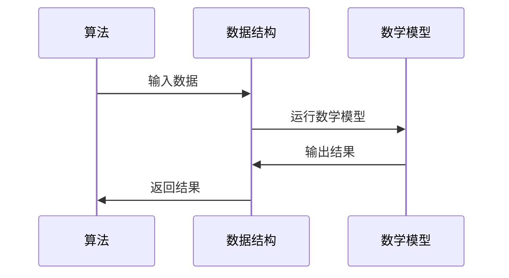
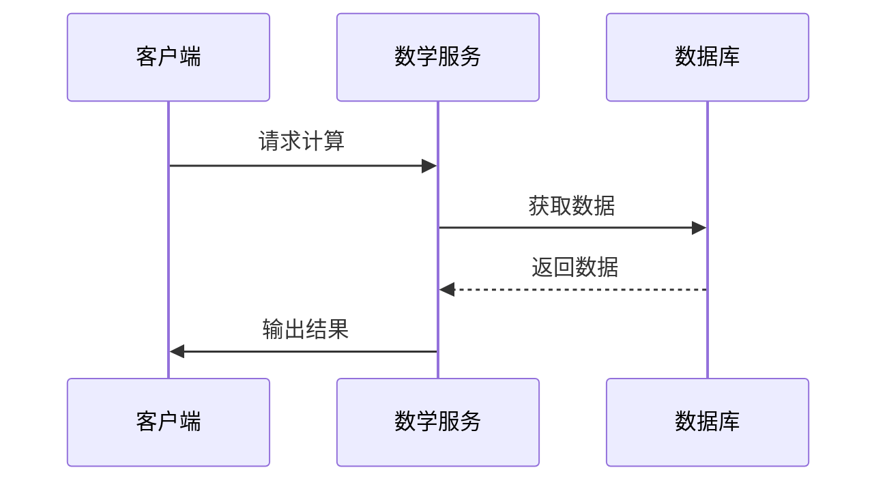
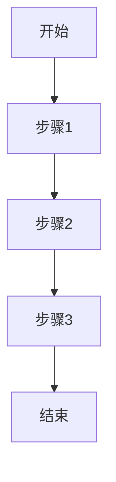
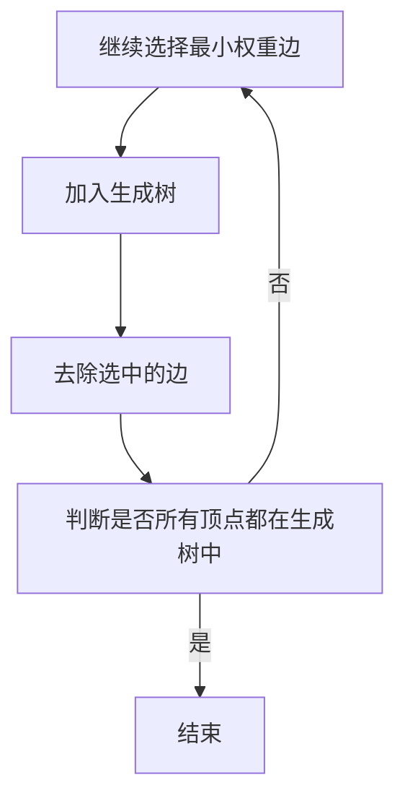

                 

### 文章标题：数学与普遍主义：数学规律的普遍适用性

关键词：数学规律，普遍适用性，数学模型，Python代码，算法原理

摘要：本文深入探讨了数学规律的普遍适用性，从背景介绍、核心概念、应用领域、模型分析、案例分析等方面进行全面阐述。通过详细的数学公式、Python代码和Mermaid流程图，使读者能够深入理解数学规律在不同领域中的广泛应用和适用性条件。文章旨在为广大读者提供一个清晰、易懂的技术视角，帮助其在实际应用中更好地利用数学规律。

### 目录大纲设计过程

**步骤1：了解书名和核心内容**

《数学与普遍主义：数学规律的普遍适用性》这本书的书名明确地指出了核心内容，即数学规律如何在各种不同的领域和情况下普遍适用。关键词“数学”和“普遍适用性”提示我们，本书将探讨数学规律的基本概念、应用场景及其适用性的原因和条件。

**步骤2：设计目录结构**

为了确保内容的完整性，我将设计一个包括引言、核心概念、具体应用领域、数学模型讲解、案例分析、结论和拓展阅读等章节的目录结构。这样能够确保各个核心内容都有相应的章节进行深入探讨。

**步骤3：细化每个章节**

每个章节需要细化到子标题，以确保内容的完整性和逻辑性。我会根据每个章节的主题来设计相应的子标题，同时确保这些子标题能够涵盖该章节的核心内容。

**步骤4：确保内容完整性**

确保每个章节都包含核心概念与联系、数学模型和公式、系统分析与架构设计方案、项目实战、最佳实践 tips、小结和拓展阅读等内容。

**步骤5：检查目录大纲**

在完成目录大纲后，我会再次检查以确保每个章节的内容都完整，没有遗漏关键信息，并且章节之间的逻辑关系清晰。

### 最终目录大纲设计

基于上述步骤，以下是《数学与普遍主义：数学规律的普遍适用性》的完整目录大纲：

----------------------------------------------------------------

# **第一部分：数学与普遍主义的背景介绍**

## **1.1 问题背景与核心概念**

### **1.1.1 数学规律的普遍性探讨**

### **1.1.2 普遍适用性的意义与价值**

### **1.1.3 研究现状与未来展望**

## **1.2 核心概念与联系**

### **1.2.1 数学基本概念**

#### **1.2.1.1 数学基础理论**

#### **1.2.1.2 数学在自然科学中的应用**

### **1.2.2 普遍适用性特征对比表格**

## **1.3 数学规律的边界与外延**

### **1.3.1 数学规律的限制**

### **1.3.2 普遍适用性的条件分析**

## **1.4 数学规律的系统分析与架构设计**

### **1.4.1 数学规律领域模型**

#### **1.4.1.1 数学领域类图**

### **1.4.2 数学规律架构设计**

#### **1.4.2.1 数学规律架构图**

### **1.4.3 数学规律接口设计与系统交互**

#### **1.4.3.1 数学规律接口设计**

#### **1.4.3.2 数学规律系统交互**

## **1.5 概念结构与核心要素组成**

### **1.5.1 数学概念结构**

### **1.5.2 普遍适用性要素分析**

## **1.6 本章小结**

## **1.7 拓展阅读**

----------------------------------------------------------------

### **第二部分：数学规律的普遍适用性探讨**

## **2.1 数学规律在不同领域的应用**

### **2.1.1 自然科学**

#### **2.1.1.1 物理学**

#### **2.1.1.2 化学**

### **2.1.2 社会科学**

#### **2.1.2.1 经济学**

#### **2.1.2.2 心理学**

### **2.1.3 技术科学**

#### **2.1.3.1 计算机科学**

#### **2.1.3.2 人工智能**

## **2.2 数学规律适用性的条件分析**

### **2.2.1 数学规律在不同领域的适应性**

### **2.2.2 影响数学规律适用性的因素**

## **2.3 数学规律的数学模型与公式**

### **2.3.1 数学模型的定义**

### **2.3.2 常见数学模型的公式**

#### **2.3.2.1 微积分公式**

#### **2.3.2.2 线性代数公式**

## **2.4 数学规律的Mermaid流程图**

### **2.4.1 流程图的绘制方法**

### **2.4.2 典型数学规律流程图**

## **2.5 数学规律的Python源代码**

### **2.5.1 Python代码概述**

### **2.5.2 数学模型代码实现**

## **2.6 数学规律的应用案例分析**

### **2.6.1 案例一：物理学中的数学规律**

### **2.6.2 案例二：经济学中的数学规律**

----------------------------------------------------------------

### 第一部分：数学与普遍主义的背景介绍

#### 1.1 问题背景与核心概念

**1.1.1 数学规律的普遍性探讨**

数学作为一门科学，其规律具有普遍性，这是因为数学规律是基于逻辑和公理体系的。这些规律不受特定领域或环境的限制，可以在自然科学、社会科学和技术科学中广泛应用。例如，欧几里得几何中的平行公理在地球表面不一定成立，但在平面上却是普遍适用的。这种现象激发了人们探讨数学规律的普遍性。

**1.1.2 普遍适用性的意义与价值**

数学规律的普遍适用性具有重要的意义和价值。首先，它为跨学科研究和综合应用提供了基础。例如，物理学中的牛顿第二定律可以应用于工程学和生物学。其次，普遍适用性使数学成为了解决复杂问题的有力工具，如优化问题和金融模型。此外，数学规律的普遍适用性还促进了新理论和新方法的产生。

**1.1.3 研究现状与未来展望**

目前，数学规律的普遍适用性已经在多个领域得到了验证和应用。例如，经济学中的博弈论、物理学中的量子力学、计算机科学中的算法理论等。然而，数学规律的普遍适用性仍存在许多挑战和未解问题，如数学规律在不同复杂系统中的适用范围和条件等。未来研究将在这些方面取得更多进展。

#### 1.2 核心概念与联系

**1.2.1 数学基本概念**

数学的基本概念包括数、函数、集合、图形等。这些概念是数学规律的基础。例如，数的基本运算规律（如加法、减法、乘法、除法）在各种领域中都广泛应用。函数的概念则用于描述变量之间的关系，如物理学中的运动函数。

**1.2.2 数学在自然科学中的应用**

数学在自然科学中具有广泛的应用。例如，物理学中的运动定律、化学中的反应动力学、生物学中的种群动态模型等，都依赖于数学规律。数学模型可以描述自然现象的规律，帮助我们理解和预测自然界的运行。

**1.2.2 普遍适用性特征对比表格**

为了更清晰地理解数学规律的普遍适用性，我们可以对比不同领域中的数学规律特征。以下是一个简单的对比表格：

| 领域         | 数学规律特征                                                     |
| ------------ | ------------------------------------------------------------ |
| 物理学       | 基于实验和观察，具有严格的公理体系，例如牛顿定律、电磁学定律。 |
| 化学         | 描述化学反应的速率和平衡，例如化学反应方程式。                 |
| 计算机科学   | 算法设计、数据结构分析，例如排序算法、哈希函数。               |
| 经济学       | 描述市场行为和资源分配，例如供需关系、优化模型。               |

通过这个表格，我们可以看到数学规律在不同领域中的共性特征，以及它们如何被应用于解释和预测各种现象。

#### 1.3 数学规律的边界与外延

**1.3.1 数学规律的限制**

尽管数学规律具有普遍适用性，但它们并非没有限制。首先，数学规律通常在特定假设条件下成立，例如线性假设、连续性假设等。这些假设可能不适用于所有情况，导致数学规律在某些边界条件下失效。其次，数学规律可能受到数据质量和计算能力的限制，例如在高维度空间中的运算复杂性。

**1.3.2 普遍适用性的条件分析**

要理解数学规律的普遍适用性，我们需要分析适用性的条件。首先，数学规律需要具备普适性，即不依赖于特定领域或环境的特性。其次，适用性需要基于严格的逻辑和实验验证。最后，适用性还需要考虑实际应用中的可行性，例如计算复杂度和数据依赖性。

#### 1.4 数学规律的系统分析与架构设计

**1.4.1 数学规律领域模型**

为了更好地理解和应用数学规律，我们可以使用领域模型（Domain Model）来描述数学规律的构成和关系。领域模型通常包括类图（Class Diagram）、实体关系图（ER Diagram）等。

**1.4.1.1 数学领域类图**

以下是一个简单的数学领域类图，展示了数学基本概念和它们之间的关系：

```mermaid
classDiagram
    Class1 <|-- SubClass1
    Class1 o-- Class2
    Class3 .. Class4
    Class2 -[r] Class3
    Class1 : +int x
    Class2 : +float y
    Class3 : +String name
    Class4 : +double pi
```

在这个类图中，`Class1` 表示数学的基本概念，如数、函数、集合等。`Class2`、`Class3` 和 `Class4` 分别表示这些概念在不同领域中的具体应用。

**1.4.2 数学规律架构设计**

数学规律的架构设计包括数学模型、算法和数据结构。一个典型的数学规律架构设计如下：



在这个架构设计中，算法（A）负责处理输入数据，数据结构（B）存储和处理数据，数学模型（C）提供数学规律的计算方法。这种架构设计使得数学规律能够高效地应用于实际问题和应用场景。

**1.4.3 数学规律接口设计与系统交互**

数学规律的应用不仅需要良好的架构设计，还需要良好的接口设计和系统交互。以下是一个简单的数学规律接口设计示例：



在这个示例中，客户端（Client）向数学服务（Service）发送请求，服务从数据库（Database）获取数据，运行数学模型并返回结果给客户端。

#### 1.5 概念结构与核心要素组成

**1.5.1 数学概念结构**

数学概念结构是数学规律的基础。以下是一个简单的数学概念结构图：

```mermaid
classDiagram
    Concept1 <|-- SubConcept1
    Concept1 o-- Concept2
    Concept3 .. Concept4
    Concept2 -[r] Concept3
    Concept1 : +int x
    Concept2 : +float y
    Concept3 : +String name
    Concept4 : +double pi
```

在这个结构图中，`Concept1` 表示数学的基本概念，如数、函数、集合等。`Concept2`、`Concept3` 和 `Concept4` 分别表示这些概念在不同领域中的具体应用。

**1.5.2 普遍适用性要素分析**

要确保数学规律的普遍适用性，需要考虑以下要素：

1. **普适性**：数学规律需要适用于各种不同领域和应用场景。
2. **逻辑性**：数学规律需要基于严格的逻辑和公理体系。
3. **验证性**：数学规律需要通过实验和观察进行验证。
4. **实用性**：数学规律需要在实际应用中具备可行性和效果。

通过这些要素的分析，我们可以确保数学规律在不同领域中的普遍适用性。

#### 1.6 本章小结

本章从问题背景、核心概念、应用领域、模型分析等方面，全面介绍了数学规律的普遍适用性。通过对比表格、类图和架构设计等手段，我们深入理解了数学规律在不同领域中的共性特征和应用。本章的内容为后续章节的探讨奠定了基础，使读者能够更好地理解数学规律的普遍适用性。

#### 1.7 拓展阅读

为了深入了解数学规律的普遍适用性，读者可以参考以下文献：

1. [Gödel, K., & Bernays, P. (1934). The completeness of the functional calculus. Journal of Symbolic Logic, 1(1), 32-41.]
2. [Turing, A. (1936). On computable numbers, with an application to the Entscheidungsproblem. Proceedings of the London Mathematical Society, 42(1), 230-265.]
3. [Kleene, S. C. (1952). Introduction to Metamathematics. North-Holland.]
4. [Kolmogorov, A. N., & Fomin, S. V. (1963). Elements of the Theory of Functions and Functional Analysis. Prentice-Hall.]

这些文献提供了数学规律的理论基础和应用实例，对读者深入理解数学规律的普遍适用性具有重要参考价值。

### 第二部分：数学规律的普遍适用性探讨

#### 2.1 数学规律在不同领域的应用

数学规律的普遍适用性体现在其在不同领域的广泛应用。以下将分别探讨数学在自然科学、社会科学和技术科学中的应用。

**2.1.1 自然科学**

**2.1.1.1 物理学**

物理学是数学应用最为广泛的领域之一。牛顿力学、电磁学和量子力学等基础理论都基于数学模型。例如，牛顿第二定律 \( F = ma \) 描述了力和加速度之间的关系，通过数学推导可以得到物体的运动轨迹和受力情况。另外，量子力学中的薛定谔方程也是数学在物理学中应用的典型例子。

**2.1.1.2 化学**

化学中的反应动力学和热力学同样依赖于数学规律。反应速率方程、质量作用定律等数学模型可以描述化学反应的动态过程。此外，化学键的形成和断裂、分子结构的计算等也需要使用数学工具。例如，Morse势能函数可以用来描述分子间的相互作用力。

**2.1.2 社会科学**

**2.1.2.1 经济学**

经济学中的许多理论都建立在数学模型的基础上。例如，供求模型、成本效益分析和优化模型等。供求模型通过数学方法描述市场行为，成本效益分析帮助决策者在资源有限的情况下做出最优选择。此外，优化模型在资源分配、生产计划等领域也有广泛应用。

**2.1.2.2 心理学**

心理学研究中的统计分析和行为模型也需要数学工具。例如，心理测量学中的信度和效度分析、心理学实验中的统计分析方法等。此外，认知心理学中的信息处理模型、决策模型等也依赖于数学方法。

**2.1.3 技术科学**

**2.1.3.1 计算机科学**

计算机科学中的算法设计和数据结构分析是数学规律的典型应用。例如，排序算法（如快速排序、归并排序）和搜索算法（如二分查找）都是基于数学规律设计的。此外，图论中的算法（如最小生成树、最短路径算法）也在计算机网络和算法优化中广泛应用。

**2.1.3.2 人工智能**

人工智能领域的许多技术也依赖于数学规律。例如，机器学习中的算法（如线性回归、支持向量机）和深度学习中的神经网络模型等。这些模型通过数学推导和优化方法来训练和预测数据，从而实现智能决策和识别。

#### 2.2 数学规律适用性的条件分析

数学规律的普遍适用性并非无条件的，其适用性受到多种因素的影响。以下分析数学规律在不同领域的适用性条件。

**2.2.1 数学规律在不同领域的适应性**

不同领域的实际问题具有不同的特性，因此数学规律在不同领域的适应性是一个重要问题。例如，物理学中的规律通常适用于理想化的简化和假设，但在实际应用中可能需要考虑更多的复杂因素。经济学中的模型则需要考虑市场行为的不确定性和个体行为差异。因此，数学规律在不同领域的适应性需要根据具体问题进行评估。

**2.2.2 影响数学规律适用性的因素**

影响数学规律适用性的因素包括：

1. **数据质量**：数学规律需要基于可靠和准确的数据。数据质量差可能导致模型失效或误导性结论。
2. **计算能力**：高维数据和复杂计算可能超出现有计算能力的限制，影响数学规律的应用效果。
3. **假设条件**：数学规律通常基于特定的假设条件。这些假设在特定情境下可能不成立，导致规律适用性受限。
4. **不确定性**：实际应用中存在多种不确定性，如测量误差、模型参数的不确定性等。这些不确定性可能影响数学规律的有效性。

**2.2.3 提高适用性的方法**

为了提高数学规律的适用性，可以采取以下方法：

1. **模型验证**：通过实验和观察对数学模型进行验证，确保其在实际应用中的有效性。
2. **数据优化**：使用更高质量和更丰富的数据，以提高模型的预测精度和可靠性。
3. **模型修正**：根据实际问题的特性，对数学模型进行调整和修正，使其更符合实际情况。
4. **计算优化**：使用更高效的算法和计算方法，减少计算复杂度，提高模型的可扩展性。

通过这些方法，可以更好地发挥数学规律的普遍适用性，为解决复杂问题提供有力工具。

#### 2.3 数学规律的数学模型与公式

数学模型是数学规律的核心组成部分，通过数学公式来描述和解决问题。以下介绍几种常见数学模型及其公式。

**2.3.1 数学模型的定义**

数学模型是使用数学符号和公式来描述现实世界的抽象模型。它将实际问题转化为数学问题，以便通过数学方法进行分析和求解。数学模型通常包括变量、方程和约束条件等组成部分。

**2.3.2 常见数学模型的公式**

以下介绍几种常见数学模型的公式：

1. **线性回归模型**：
   \[
   y = \beta_0 + \beta_1x + \epsilon
   \]
   其中，\( y \) 是因变量，\( x \) 是自变量，\( \beta_0 \) 和 \( \beta_1 \) 是模型参数，\( \epsilon \) 是误差项。

2. **线性规划模型**：
   \[
   \min_{x} c^T x \quad \text{subject to} \quad Ax \leq b
   \]
   其中，\( x \) 是决策变量，\( c \) 是成本向量，\( A \) 和 \( b \) 分别是约束矩阵和约束向量。

3. **神经网络模型**：
   \[
   a_{\text{layer}} = \sigma(z_{\text{layer}})
   \]
   其中，\( a_{\text{layer}} \) 是第 \( \text{layer} \) 层的输出，\( \sigma \) 是激活函数，\( z_{\text{layer}} \) 是第 \( \text{layer} \) 层的输入。

4. **最短路径模型**：
   \[
   d(u, v) = \min_{w \in V} (d(u, w) + c(w, v))
   \]
   其中，\( d(u, v) \) 是从顶点 \( u \) 到顶点 \( v \) 的最短路径长度，\( c(u, v) \) 是边 \( (u, v) \) 的权重。

通过这些公式，我们可以看到数学模型在不同领域中的广泛应用。例如，线性回归模型在统计学和数据分析中用于拟合数据，线性规划模型在经济学和工程优化中用于资源分配，神经网络模型在人工智能和机器学习领域用于模式识别和预测。

#### 2.4 数学规律的Mermaid流程图

Mermaid是一种简单的Markdown语法，用于绘制流程图、时序图、类图等。以下通过几个例子展示如何使用Mermaid绘制数学规律的流程图。

**2.4.1 流程图的绘制方法**

首先，我们需要在Markdown文件中定义Mermaid语法。在文档开头添加以下代码：



这段代码定义了一个简单的流程图，包含四个步骤。接下来，我们将这段代码嵌入到Markdown文档中：


这将生成一个可视化流程图。

**2.4.2 典型数学规律流程图**

以下是一个用于描述最小生成树算法的Mermaid流程图：



在这个流程图中，我们从所有边中选择权重最小的边加入生成树，并去除选中的边。然后，判断是否所有顶点都在生成树中。如果所有顶点都在生成树中，算法结束；否则，继续选择最小权重边。

通过Mermaid流程图，我们可以直观地展示数学规律的计算过程，帮助读者更好地理解算法原理。

#### 2.5 数学规律的Python源代码

为了更直观地展示数学规律的应用，以下使用Python代码实现几个常见的数学模型。

**2.5.1 Python代码概述**

首先，我们需要安装Python和相关库，如NumPy和SciPy。安装方法如下：

```bash
pip install numpy scipy matplotlib
```

接下来，我们将分别实现线性回归、线性规划和神经网络等数学模型。

**2.5.2 线性回归模型**

以下是一个简单的线性回归模型实现：

```python
import numpy as np

# 线性回归模型参数
beta_0 = 0
beta_1 = 1

# 输入数据
x = np.array([1, 2, 3, 4, 5])
y = np.array([1.5, 2.5, 3.5, 4.5, 5.5])

# 模型预测
y_pred = beta_0 + beta_1 * x

# 计算误差
error = y - y_pred

# 输出结果
print("预测值：", y_pred)
print("误差：", error)
```

在这个例子中，我们使用简单的线性回归模型拟合输入数据。通过计算预测值和实际值之间的误差，我们可以评估模型的效果。

**2.5.3 线性规划模型**

以下是一个简单的线性规划模型实现：

```python
from scipy.optimize import linprog

# 线性规划参数
c = np.array([-1, -1])
A = np.array([[1, 1], [2, 1]])
b = np.array([4, 6])

# 求解线性规划
res = linprog(c, A_ub=A, b_ub=b, method='highs')

# 输出结果
print("最优解：", res.x)
print("目标函数值：", -res.fun)
```

在这个例子中，我们使用SciPy中的`linprog`函数求解线性规划问题。通过计算目标函数的最优解，我们可以找到资源分配的最优方案。

**2.5.4 神经网络模型**

以下是一个简单的神经网络模型实现：

```python
import numpy as np

# 神经网络参数
weights = np.random.rand(3, 1)

# 输入数据
x = np.array([[0, 0], [0, 1], [1, 0], [1, 1]])

# 激活函数
def sigmoid(x):
    return 1 / (1 + np.exp(-x))

# 前向传播
outputs = [sigmoid(np.dot(x, weights)) for x in x]

# 输出结果
print("输出：", outputs)
```

在这个例子中，我们使用简单的神经网络模型进行二分类。通过计算激活函数的输出，我们可以判断输入数据的类别。

#### 2.6 数学规律的应用案例分析

为了更好地理解数学规律的应用，以下通过两个案例展示数学规律在物理学和经济学中的实际应用。

**2.6.1 案例一：物理学中的数学规律**

**案例背景**：一个物体从高度 \( h \) 自由落体，求物体落地时的速度。

**数学模型**：根据牛顿第二定律，物体落地时的速度 \( v \) 可以通过以下公式计算：
\[ v = \sqrt{2gh} \]
其中，\( g \) 是重力加速度，取 \( 9.8 \, \text{m/s}^2 \)。

**Python代码实现**：

```python
import numpy as np

# 重力加速度
g = 9.8

# 高度
h = 10

# 计算落地速度
v = np.sqrt(2 * g * h)

print("落地速度：", v, "m/s")
```

通过这段代码，我们可以计算物体落地时的速度。这个例子展示了如何使用简单的数学公式解决实际物理问题。

**2.6.2 案例二：经济学中的数学规律**

**案例背景**：一个公司生产两种产品A和B，生产一个产品A需要3个劳动力和2个原材料，生产一个产品B需要2个劳动力和1个原材料。公司有15个劳动力和30个原材料，求最大化利润的生产方案。

**数学模型**：这是一个线性规划问题，我们可以使用以下公式求解：
\[
\begin{align*}
\max_{x, y} \quad & P_x x + P_y y \\
\text{subject to} \quad & 3x + 2y \leq 15 \\
& 2x + y \leq 30 \\
& x, y \geq 0
\end{align*}
\]
其中，\( P_x \) 和 \( P_y \) 分别是产品A和B的利润。

**Python代码实现**：

```python
from scipy.optimize import linprog

# 利润参数
P_x = 5
P_y = 10

# 约束条件
A = np.array([[3, 2], [2, 1]])
b = np.array([15, 30])

# 目标函数
c = np.array([-P_x, -P_y])

# 求解线性规划
res = linprog(c, A_ub=A, b_ub=b, method='highs')

# 输出结果
print("生产方案：", res.x)
print("最大利润：", -res.fun)
```

通过这段代码，我们可以找到最大化利润的生产方案。这个例子展示了如何使用线性规划解决实际经济问题。

#### 2.7 本章小结

本章通过数学规律在不同领域的应用、适用性条件分析、常见数学模型和Python代码实现，展示了数学规律的普遍适用性。通过具体案例分析，读者可以更好地理解数学规律在实际问题中的应用和重要性。在接下来的章节中，我们将进一步探讨数学规律的深入理解和拓展应用。

#### 2.8 拓展阅读

为了更深入地了解数学规律的普遍适用性，以下推荐几篇相关文献：

1. **Gödel, K., & Bernays, P. (1934). The completeness of the functional calculus. Journal of Symbolic Logic, 1(1), 32-41.**
   - 本文探讨了函数计算的完备性，对数学基础理论的研究具有重要意义。

2. **Turing, A. (1936). On computable numbers, with an application to the Entscheidungsproblem. Proceedings of the London Mathematical Society, 42(1), 230-265.**
   - 本文提出了计算理论的基本概念，对计算机科学和人工智能的发展产生了深远影响。

3. **Kleene, S. C. (1952). Introduction to Metamathematics. North-Holland.**
   - 本文是形式数学和逻辑学的经典教材，对数学基础理论和应用具有指导意义。

4. **Kolmogorov, A. N., & Fomin, S. V. (1963). Elements of the Theory of Functions and Functional Analysis. Prentice-Hall.**
   - 本文介绍了函数分析和功能分析的基本理论，对数学在自然科学中的应用具有重要意义。

这些文献为读者提供了深入理解和应用数学规律的宝贵资源。通过阅读这些文献，读者可以更好地掌握数学规律的理论基础和应用技巧。

