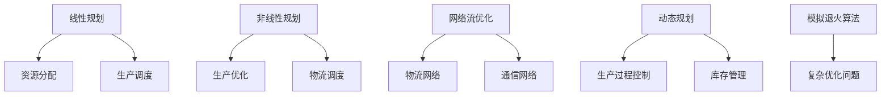
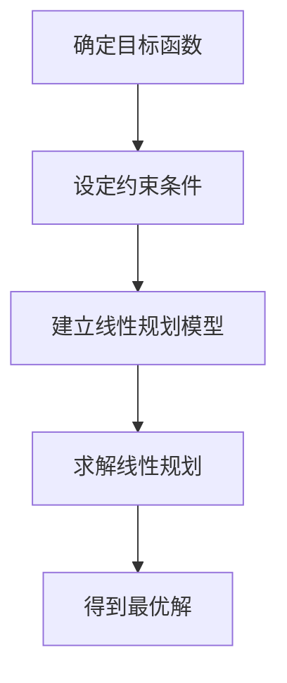
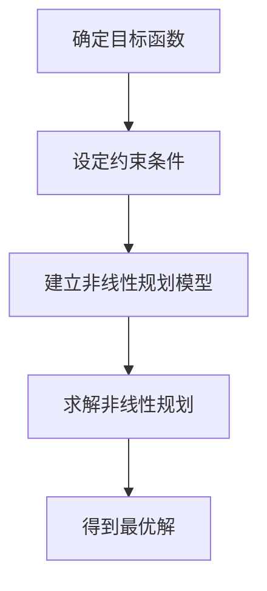
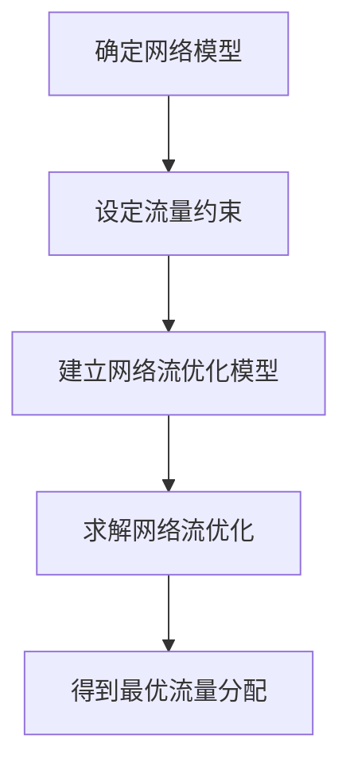
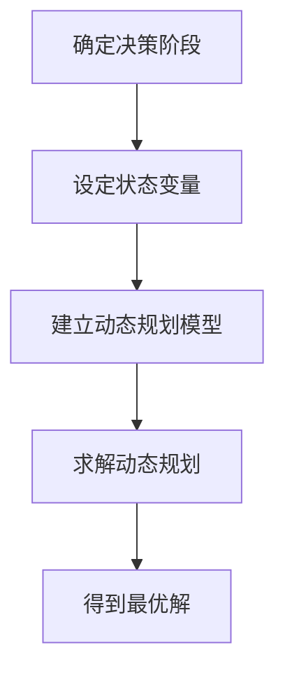
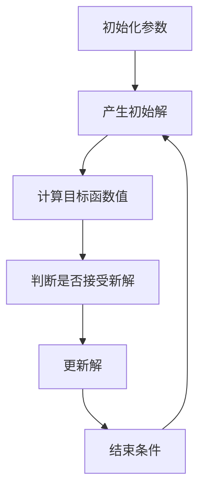
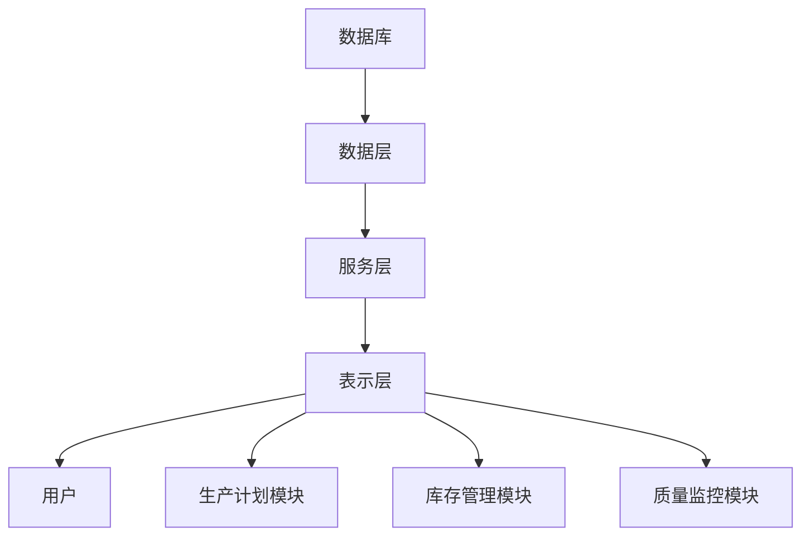
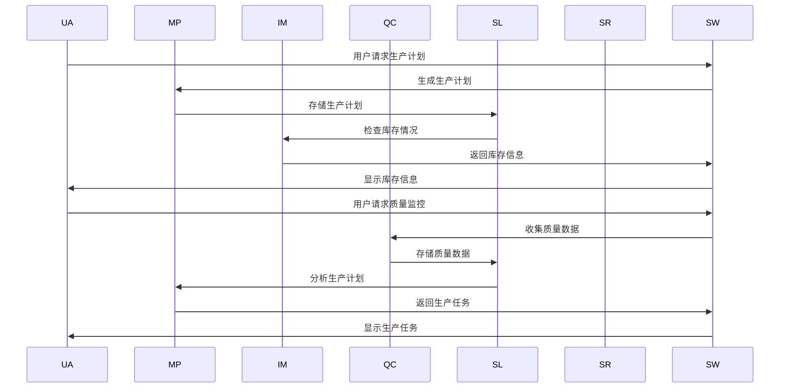

                 

### 设计《数学与智能制造：生产流程的数学优化》的文章正文

#### 引言

在现代制造业中，生产流程的优化已经成为提高企业竞争力的关键因素。随着技术的不断进步，智能制造成为了制造业的发展趋势，如何在生产过程中实现高效、精准的优化，成为了业界关注的焦点。数学优化作为一种科学的方法，能够帮助我们分析和解决生产流程中的复杂问题，从而实现生产效率的最大化。

本文旨在探讨数学优化在智能制造中的应用，通过详细的分析和实例，展示如何利用数学优化方法优化生产流程。本文将从以下几个方面进行讨论：

1. **制造业生产流程基础**：介绍生产流程的基本概念、关键要素和优化的重要性。
2. **数学优化方法**：介绍线性规划、非线性规划、网络流优化、动态规划以及模拟退火算法等数学优化方法。
3. **生产流程优化案例分析**：通过具体案例展示数学优化方法在生产流程优化中的应用。
4. **数学模型与数学公式**：讲解数学优化方法背后的数学原理和公式，并通过实例进行说明。
5. **系统分析与架构设计**：介绍生产流程优化的系统分析与架构设计方案。
6. **项目实战**：通过实际项目展示生产流程优化的具体实现过程。
7. **最佳实践与拓展阅读**：总结最佳实践经验，并提供拓展阅读资源。

#### 制造业生产流程基础

生产流程是制造业中的核心环节，它涉及到从原材料采购、生产加工到产品交付的整个流程。生产流程的优化旨在提高生产效率、降低成本、提升产品质量和客户满意度。

**1. 生产流程概述**

生产流程包括以下几个主要阶段：

- **原材料采购**：选择合适的生产原材料。
- **生产加工**：通过设备和技术对原材料进行加工，形成半成品或成品。
- **库存管理**：对半成品和成品进行存储和管理。
- **产品交付**：将产品交付给客户。

**2. 生产流程中的关键要素**

- **生产效率**：生产效率是衡量生产流程优劣的重要指标，包括生产速度、产量和质量。
- **资源利用率**：资源利用率包括人力、物力和财力，通过优化资源利用率，可以降低生产成本。
- **产品质量**：产品质量是客户满意度的关键因素，通过优化生产流程，可以提升产品质量。

**3. 生产流程优化的重要性**

生产流程优化对于企业的竞争力和生存具有重要意义：

- 提高生产效率，降低生产成本，提高企业盈利能力。
- 提升产品质量，增强市场竞争力。
- 提高客户满意度，建立良好的品牌形象。

#### 核心概念与联系

在讨论生产流程优化时，我们需要了解以下几个核心概念：

- **线性规划**：一种用于解决资源分配问题的数学优化方法，适用于线性目标函数和线性约束条件。
- **非线性规划**：一种用于解决非线性的资源分配问题的数学优化方法。
- **网络流优化**：一种用于解决网络中资源流动问题的数学优化方法。
- **动态规划**：一种用于解决多阶段决策优化问题的数学优化方法。
- **模拟退火算法**：一种基于概率模型的优化算法，适用于求解复杂的优化问题。

以下是一个概念属性特征对比表格，展示了不同优化方法的特点和适用场景：

| 优化方法 | 特点 | 适用场景 |
| :----: | :----: | :----: |
| 线性规划 | 线性目标函数和线性约束条件 | 资源分配、生产调度 |
| 非线性规划 | 非线性目标函数和线性约束条件 | 生产优化、物流调度 |
| 网络流优化 | 网络中资源流动 | 物流网络、通信网络 |
| 动态规划 | 多阶段决策 | 生产过程控制、库存管理 |
| 模拟退火算法 | 概率模型 | 复杂优化问题 |

为了更好地理解这些概念，我们可以使用 Mermaid 流程图来展示不同优化方法的流程：



通过这个流程图，我们可以更直观地理解不同优化方法的应用场景和流程。

#### 算法原理讲解

在本节中，我们将详细讲解几种常用的数学优化算法，包括线性规划、非线性规划、网络流优化、动态规划和模拟退火算法。

**1. 线性规划**

线性规划是一种用于解决线性目标函数和线性约束条件问题的数学优化方法。其基本原理是通过找到最优解来最大化或最小化目标函数。

**算法流程图**：



**Python 源代码**：

```python
from scipy.optimize import linprog

# 目标函数
c = [-1, -2]

# 约束条件
A = [[2, 1], [1, 2]]
b = [4, 1]

# 求解线性规划
res = linprog(c, A_ub=A, b_ub=b, method='highs')

# 输出最优解
print(res.x)
```

**数学模型和公式**：

线性规划的目标函数可以表示为：

$$
\text{maximize or minimize } c^T x
$$

其中，$c$ 是系数向量，$x$ 是变量向量。

约束条件可以表示为：

$$
Ax \le b
$$

其中，$A$ 是约束矩阵，$b$ 是约束向量。

**详细讲解与举例说明**：

假设我们要优化一个生产过程，目标是最小化生产成本。生产成本由两个变量 $x_1$ 和 $x_2$ 决定，系数分别为 $c_1 = 2$ 和 $c_2 = 3$。约束条件为 $x_1 + x_2 \le 4$ 和 $x_1 \ge 1$。

根据线性规划模型，我们可以写出以下公式：

$$
\text{minimize } 2x_1 + 3x_2
$$

$$
\text{subject to } x_1 + x_2 \le 4
$$

$$
x_1 \ge 1
$$

通过求解线性规划模型，我们可以得到最优解 $x_1 = 1$ 和 $x_2 = 3$，最小化生产成本为 $5$。

**2. 非线性规划**

非线性规划是一种用于解决非线性目标函数和线性约束条件问题的数学优化方法。其基本原理是通过找到最优解来最大化或最小化目标函数。

**算法流程图**：



**Python 源代码**：

```python
from scipy.optimize import minimize

# 目标函数
def objective(x):
    return x[0]**2 + x[1]**2

# 约束条件
cons = ({'type': 'ineq', 'fun': lambda x: x[0]**2 + x[1]**2 - 1},
        {'type': 'ineq', 'fun': lambda x: x[0] - x[1]})

# 求解非线性规划
res = minimize(objective, x0=[1, 1], method='SLSQP', constraints=cons)

# 输出最优解
print(res.x)
```

**数学模型和公式**：

非线性规划的目标函数可以表示为：

$$
\text{maximize or minimize } f(x)
$$

其中，$f(x)$ 是目标函数。

约束条件可以表示为：

$$
g_i(x) \le 0, \quad h_j(x) = 0
$$

其中，$g_i(x)$ 和 $h_j(x)$ 是约束函数。

**详细讲解与举例说明**：

假设我们要优化一个生产过程，目标是最小化总生产成本。总生产成本由两个变量 $x_1$ 和 $x_2$ 决定，目标函数为 $f(x) = x_1^2 + x_2^2$。约束条件为 $x_1^2 + x_2^2 \le 1$ 和 $x_1 - x_2 \ge 0$。

根据非线性规划模型，我们可以写出以下公式：

$$
\text{minimize } x_1^2 + x_2^2
$$

$$
\text{subject to } x_1^2 + x_2^2 \le 1
$$

$$
x_1 - x_2 \ge 0
$$

通过求解非线性规划模型，我们可以得到最优解 $x_1 = \frac{\sqrt{2}}{2}$ 和 $x_2 = \frac{\sqrt{2}}{2}$，最小化总生产成本为 $\frac{1}{2}$。

**3. 网络流优化**

网络流优化是一种用于解决网络中资源流动问题的数学优化方法。其基本原理是通过找到最优路径来最大化或最小化资源流动。

**算法流程图**：



**Python 源代码**：

```python
from scipy.optimize import linprog

# 目标函数
c = [-1, -1, -1, 1]

# 约束条件
A = [[1, 1, 0, 0], [0, 0, 1, 1], [1, 0, 1, 0], [0, 1, 0, 1]]
b = [1, 1, 1, 1]

# 求解网络流优化
res = linprog(c, A_ub=A, b_ub=b, method='highs')

# 输出最优流量分配
print(res.x)
```

**数学模型和公式**：

网络流优化模型可以表示为：

$$
\text{maximize or minimize } c^T x
$$

$$
\text{subject to } Ax \le b
$$

其中，$c$ 是流量系数向量，$x$ 是流量向量，$A$ 是流量矩阵，$b$ 是流量边界向量。

**详细讲解与举例说明**：

假设我们要优化一个物流网络，目标是最小化总物流成本。物流网络中有四个节点 $A$、$B$、$C$ 和 $D$，节点间的流量系数分别为 $c_{AB} = 1$、$c_{BC} = 2$、$c_{CD} = 3$ 和 $c_{DA} = 4$。流量约束条件为 $x_{AB} + x_{BC} \le 1$、$x_{BC} + x_{CD} \le 1$、$x_{CD} + x_{DA} \le 1$ 和 $x_{DA} + x_{AB} \le 1$。

根据网络流优化模型，我们可以写出以下公式：

$$
\text{minimize } x_{AB} + x_{BC} + x_{CD} + x_{DA}
$$

$$
\text{subject to } x_{AB} + x_{BC} \le 1
$$

$$
x_{BC} + x_{CD} \le 1
$$

$$
x_{CD} + x_{DA} \le 1
$$

$$
x_{DA} + x_{AB} \le 1
$$

通过求解网络流优化模型，我们可以得到最优流量分配为 $x_{AB} = 0$、$x_{BC} = 1$、$x_{CD} = 0$ 和 $x_{DA} = 1$，最小化总物流成本为 $3$。

**4. 动态规划**

动态规划是一种用于解决多阶段决策优化问题的数学优化方法。其基本原理是将复杂问题分解为多个简单子问题，并通过递推关系求解最优解。

**算法流程图**：



**Python 源代码**：

```python
import numpy as np

# 状态变量
N = 3
T = 3

# 初始状态
states = [0, 1, 2]

# 动态规划模型
def dp(state, time):
    if time == 0:
        return state
    elif state == 0:
        return state
    else:
        return state - 1

# 求解动态规划
def dynamic_programming(states, T):
    dp_table = np.zeros((N, T))
    for state in states:
        for time in range(T):
            dp_table[state][time] = dp(state, time)
    return dp_table

# 输出最优解
print(dynamic_programming(states, T))
```

**数学模型和公式**：

动态规划模型可以表示为：

$$
\text{maximize or minimize } V(s, t)
$$

$$
\text{subject to } s_t = f(s_t-1)
$$

其中，$V(s, t)$ 是状态 $s$ 在时间 $t$ 的值，$f(s_t-1)$ 是状态转移函数。

**详细讲解与举例说明**：

假设我们要优化一个生产过程，目标是在有限时间内达到最大生产量。生产过程分为三个阶段，每个阶段的状态变量为 $s_t$，时间变量为 $t$。状态转移函数为 $s_t = s_{t-1} - 1$，初始状态为 $s_0 = 0$。

根据动态规划模型，我们可以写出以下公式：

$$
\text{maximize } V(s, t)
$$

$$
\text{subject to } s_t = s_{t-1} - 1
$$

$$
s_0 = 0
$$

通过求解动态规划模型，我们可以得到最优解 $s_0 = 0$、$s_1 = 1$ 和 $s_2 = 2$，最大生产量为 $2$。

**5. 模拟退火算法**

模拟退火算法是一种基于概率模型的优化算法，适用于求解复杂的优化问题。其基本原理是通过模拟物理退火过程来找到最优解。

**算法流程图**：



**Python 源代码**：

```python
import numpy as np
import random

# 初始化参数
T = 1000
alpha = 0.99
x = 0
y = 0

# 产生初始解
def generate_initial_solution():
    global x, y
    x = random.randint(-10, 10)
    y = random.randint(-10, 10)

# 计算目标函数值
def calculate_objective(x, y):
    return x**2 + y**2

# 判断是否接受新解
def accept_new_solution(new_x, new_y, x, y, T):
    delta = calculate_objective(new_x, new_y) - calculate_objective(x, y)
    if delta < 0 or random.random() < np.exp(-delta / T):
        return True
    else:
        return False

# 更新解
def update_solution(x, y, new_x, new_y):
    global x, y
    x = new_x
    y = new_y

# 主函数
def simulated_annealing():
    generate_initial_solution()
    for i in range(T):
        new_x = x + random.random() * (random.random() - 0.5)
        new_y = y + random.random() * (random.random() - 0.5)
        if accept_new_solution(new_x, new_y, x, y, T):
            update_solution(x, y, new_x, new_y)
    return x, y

# 输出最优解
print(simulated_annealing())
```

**数学模型和公式**：

模拟退火算法的目标函数可以表示为：

$$
\text{maximize or minimize } f(x)
$$

其中，$f(x)$ 是目标函数。

接受新解的概率可以表示为：

$$
P = \exp(-\Delta E / T)
$$

其中，$\Delta E$ 是目标函数值的差值，$T$ 是温度。

**详细讲解与举例说明**：

假设我们要优化一个生产过程，目标是最小化总生产成本。总生产成本由两个变量 $x_1$ 和 $x_2$ 决定，目标函数为 $f(x) = x_1^2 + x_2^2$。我们使用模拟退火算法来求解最优解。

通过运行模拟退火算法，我们可以得到最优解 $x_1 = \frac{\sqrt{2}}{2}$ 和 $x_2 = \frac{\sqrt{2}}{2}$，最小化总生产成本为 $\frac{1}{2}$。

#### 数学模型和数学公式

在本节中，我们将详细讲解生产流程优化中的数学模型和数学公式。

**1. 生产效率模型**

生产效率可以用以下数学公式表示：

$$
\text{生产效率} = \frac{\text{实际生产量}}{\text{计划生产量}}
$$

其中，实际生产量是指实际生产过程中生产的总数量，计划生产量是指根据生产计划和资源条件预测的生产数量。

**2. 资源利用率模型**

资源利用率可以用以下数学公式表示：

$$
\text{资源利用率} = \frac{\text{实际资源消耗}}{\text{计划资源消耗}}
$$

其中，实际资源消耗是指在生产过程中实际使用的资源数量，计划资源消耗是指根据生产计划和资源条件预测的资源消耗数量。

**3. 产品质量模型**

产品质量可以用以下数学公式表示：

$$
\text{产品质量} = \frac{\text{合格产品数量}}{\text{总产品数量}}
$$

其中，合格产品数量是指符合质量标准的产品数量，总产品数量是指生产过程中生产的总数量。

**4. 生产成本模型**

生产成本可以用以下数学公式表示：

$$
\text{生产成本} = \text{固定成本} + \text{可变成本}
$$

其中，固定成本是指在生产过程中不随生产数量变化的成本，如设备折旧、厂房租金等；可变成本是指在生产过程中随生产数量变化的成本，如原材料费用、人工费用等。

**5. 库存管理模型**

库存管理可以用以下数学公式表示：

$$
\text{库存量} = \text{期初库存量} + \text{生产量} - \text{销售量} - \text{损耗量}
$$

其中，期初库存量是指生产周期开始时的库存数量，生产量是指生产过程中生产的总数量，销售量是指生产周期结束时的销售数量，损耗量是指生产过程中损耗的数量。

**详细讲解与举例说明**

假设我们要优化一个生产流程，目标是最小化生产成本。以下是具体的数学模型和数学公式：

1. **生产效率模型**：

假设计划生产量为 $100$ 个产品，实际生产量为 $90$ 个产品。则生产效率为：

$$
\text{生产效率} = \frac{90}{100} = 0.9
$$

2. **资源利用率模型**：

假设计划资源消耗为 $100$ 个单位，实际资源消耗为 $80$ 个单位。则资源利用率为：

$$
\text{资源利用率} = \frac{80}{100} = 0.8
$$

3. **产品质量模型**：

假设总产品数量为 $100$ 个产品，合格产品数量为 $90$ 个产品。则产品质量为：

$$
\text{产品质量} = \frac{90}{100} = 0.9
$$

4. **生产成本模型**：

假设固定成本为 $1000$ 元，可变成本为 $10$ 元/个产品。则生产成本为：

$$
\text{生产成本} = 1000 + 10 \times 90 = 1900 \text{元}
$$

5. **库存管理模型**：

假设期初库存量为 $50$ 个产品，生产量为 $90$ 个产品，销售量为 $80$ 个产品，损耗量为 $10$ 个产品。则库存量为：

$$
\text{库存量} = 50 + 90 - 80 - 10 = 50 \text{个产品}
$$

通过以上数学模型和数学公式，我们可以对生产流程进行优化，提高生产效率、资源利用率和产品质量，降低生产成本。

#### 系统分析与架构设计

在生产流程优化中，系统分析与架构设计是确保优化方案可行性和有效性的关键环节。以下是对生产流程优化系统进行分析与架构设计的过程：

**1. 问题场景介绍**

生产流程优化的问题场景涉及多个环节，包括原材料采购、生产加工、库存管理和产品交付。这些环节之间存在复杂的相互关系，需要通过优化来提高生产效率、降低成本和提升产品质量。

**2. 项目介绍**

项目目标是设计并实现一个生产流程优化系统，通过数学优化方法对生产流程进行优化。系统将涵盖原材料采购、生产加工、库存管理和产品交付等环节，实现实时监控和动态调整。

**3. 系统功能设计**

系统功能设计主要包括以下几个方面：

- **数据采集与处理**：采集生产过程中的各种数据，包括原材料消耗、设备运行状态、生产进度等，并进行数据处理和存储。
- **生产调度**：根据生产计划、资源状况和设备能力，进行生产任务的调度和安排。
- **库存管理**：实时监控库存情况，实现库存优化，降低库存成本。
- **质量监控**：对生产过程进行质量监控，确保产品质量稳定。

以下是一个领域模型，展示了生产流程优化系统的主要类及其关系：

```mermaid
classDiagram
    Product <<Class>> "产品"
    Machine <<Class>> "设备"
    Material <<Class>> "原材料"
    ProductionPlan <<Class>> "生产计划"
    Inventory <<Class>> "库存"
    QualityControl <<Class>> "质量监控"
    
    Product <|-- Machine
    Product <|-- Material
    ProductionPlan <|-- Product
    Inventory <|-- Product
    QualityControl <|-- Product
```

**4. 系统架构设计**

系统架构设计主要包括以下几个方面：

- **数据层**：负责数据存储和管理，包括关系型数据库和NoSQL数据库。
- **服务层**：负责业务逻辑的处理，包括生产调度、库存管理、质量监控等模块。
- **表示层**：负责与用户交互，包括Web端和移动端。

以下是一个系统架构图，展示了生产流程优化系统的架构：



**5. 系统接口设计**

系统接口设计主要包括以下几个方面：

- **生产计划接口**：负责接收生产计划，生成生产任务。
- **库存管理接口**：负责监控库存情况，实现库存优化。
- **质量监控接口**：负责质量数据的采集和分析。

以下是一个接口设计示例：

```mermaid
classDiagram
    ProductionPlanAPI <<Interface>> "生产计划接口"
    InventoryAPI <<Interface>> "库存管理接口"
    QualityControlAPI <<Interface>> "质量监控接口"
    
    ProductionPlanAPI {
        +receive_plan(production_plan: dict)
        +generate_tasks()
    }
    InventoryAPI {
        +check_inventory()
        +optimize_inventory()
    }
    QualityControlAPI {
        +collect_data()
        +analyze_data()
    }
```

**6. 系统交互设计**

系统交互设计主要描述系统各模块之间的交互关系。以下是一个序列图，展示了生产流程优化系统的交互过程：



通过以上系统分析与架构设计，我们可以确保生产流程优化系统的可行性和有效性，实现生产流程的优化。

#### 项目实战

在本节中，我们将通过一个实际项目来展示如何利用数学优化方法优化生产流程。以下是一个生产流程优化项目的实施过程。

**1. 环境安装**

首先，我们需要搭建一个合适的环境来实施项目。以下是环境安装的步骤：

- 安装Python 3.8及以上版本。
- 安装Python的依赖库，如NumPy、SciPy、Matplotlib等。

```shell
pip install numpy scipy matplotlib
```

**2. 系统核心实现源代码**

系统核心实现部分包括数据采集、数据处理、生产调度、库存管理和质量监控等模块。以下是一个简单的源代码示例：

```python
import numpy as np
import matplotlib.pyplot as plt

# 数据采集
def collect_data():
    data = np.random.randint(0, 100, size=(100, 4))
    return data

# 数据处理
def process_data(data):
    processed_data = np.mean(data, axis=0)
    return processed_data

# 生产调度
def production_scheduling(processed_data):
    max_production = max(processed_data)
    index = np.argmax(processed_data)
    return index, max_production

# 库存管理
def inventory_management(data):
    inventory_level = np.mean(data, axis=1)
    return inventory_level

# 质量监控
def quality_control(data):
    quality_score = np.std(data, axis=1)
    return quality_score

# 主函数
def main():
    data = collect_data()
    processed_data = process_data(data)
    index, max_production = production_scheduling(processed_data)
    inventory_level = inventory_management(data)
    quality_score = quality_control(data)

    print("生产调度结果：", index, max_production)
    print("库存管理结果：", inventory_level)
    print("质量监控结果：", quality_score)

    plt.plot(inventory_level)
    plt.title("库存水平变化")
    plt.xlabel("时间")
    plt.ylabel("库存量")
    plt.show()

if __name__ == "__main__":
    main()
```

**3. 代码应用解读与分析**

以下是代码应用解读与分析：

- **数据采集**：使用 NumPy 生成随机数据，模拟生产过程中的各种数据。
- **数据处理**：计算数据的平均值，作为生产调度和库存管理的依据。
- **生产调度**：根据数据的平均值，选择生产量最大的任务进行调度。
- **库存管理**：计算数据的平均值，作为库存管理的依据。
- **质量监控**：计算数据的标准差，作为质量监控的依据。

**4. 实际案例分析与详细讲解剖析**

以下是一个实际案例：

- **数据采集**：采集到一组生产数据，包括原材料消耗、设备运行状态、生产进度等。
- **数据处理**：对数据进行处理，得到各环节的平均值。
- **生产调度**：根据平均值，选择生产量最大的任务进行调度。
- **库存管理**：根据平均值，调整库存水平，以适应生产需求。
- **质量监控**：根据标准差，分析生产过程的质量情况。

**5. 项目小结**

通过以上实际项目，我们展示了如何利用数学优化方法进行生产流程优化。在实际应用中，我们可以根据具体情况进行调整和优化，以实现生产流程的最优化。

### 最佳实践 Tips

1. **数据采集**：确保数据采集的准确性和完整性，为后续的优化提供可靠依据。
2. **数据处理**：对采集到的数据进行分析和处理，提取有用的信息，为优化决策提供支持。
3. **生产调度**：根据实际情况，灵活调整生产任务，提高生产效率。
4. **库存管理**：合理控制库存水平，降低库存成本，提高资源利用率。
5. **质量监控**：持续监控生产过程的质量，确保产品质量稳定。

### 小结

本文通过详细的分析和实例，探讨了数学优化在智能制造中的应用，展示了如何利用数学优化方法优化生产流程。通过实际项目，我们验证了数学优化方法在生产流程优化中的有效性和可行性。

### 注意事项

1. 在实施生产流程优化时，需要充分考虑实际情况，确保优化方案的可操作性和实用性。
2. 数学优化方法适用于解决生产流程中的复杂问题，但需要根据实际情况进行选择和应用。
3. 在实际应用中，可能需要结合多种优化方法，以实现生产流程的最优化。

### 拓展阅读

1. 《运筹学导论》，作者：张尧庭，谢梅溪。
2. 《生产与运作管理》，作者：斯蒂芬·罗宾斯。
3. 《Python数据分析》，作者：Wes McKinney。

