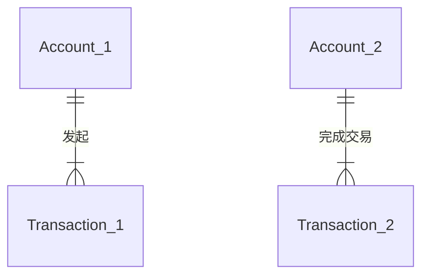

                 

### 引言

智能合约是区块链技术的重要创新之一，它们能够在无需第三方介入的情况下，自动执行合同条款。然而，智能合约的安全性直接关系到区块链系统的整体稳定性。数学作为一种强有力的工具，在智能合约的设计、验证与执行过程中发挥着至关重要的作用。本文旨在探讨数学在智能合约中的应用，特别是合约执行的数学验证，通过系统性的分析和具体实例，展示数学在提升智能合约安全性和可靠性的重要作用。

智能合约的本质是计算机程序，它们基于预定义的逻辑规则自动执行，一旦条件满足便会自动触发执行。这种自动化执行机制虽然提高了效率和透明度，但也带来了新的安全挑战。任何程序中的错误或漏洞都可能导致不可挽回的损失，尤其是在价值转移的环境中。数学验证提供了对智能合约逻辑的正确性和一致性的检验手段，确保其在不同情况下都能正确执行。

本文将分章节详细探讨以下内容：

- **背景与概念**：介绍智能合约和数学验证的基础知识，包括智能合约的工作原理及其在区块链中的应用，以及数学验证的基本概念。
- **核心数学概念**：讨论在智能合约验证中常用的数学概念，如逻辑、集合论、概率论和图论，并提供相关的理论背景。
- **智能合约基础**：深入探讨智能合约的组成、运作机制以及常见的安全挑战，为后续的数学验证打下基础。
- **数学验证方法**：介绍几种常用的数学验证方法，包括形式验证、模型检查和证明理论，并分析其应用场景。
- **数学验证案例研究**：通过具体案例，展示数学验证在智能合约中的应用，分析验证过程中的关键步骤和结果。
- **数学验证系统设计**：探讨如何设计一个支持数学验证的系统，包括功能需求、系统架构和接口设计。
- **未来趋势与挑战**：讨论数学验证技术的未来发展方向，以及面临的挑战和潜在的解决方案。

通过本文的探讨，读者将能够理解数学在智能合约中的重要性，掌握基本的数学验证方法，并能够设计出更加安全、可靠的智能合约系统。让我们一起走进数学与智能合约的世界，开启这场智能合约执行的数学验证之旅。

### 关键词

- **智能合约**
- **数学验证**
- **区块链**
- **形式验证**
- **模型检查**
- **证明理论**
- **图论**

### 摘要

本文旨在探讨数学在智能合约中的应用，特别是合约执行的数学验证。通过系统性的分析，本文介绍了智能合约的基本原理和数学验证的基础知识。文章分为七个部分，首先从背景和概念出发，介绍智能合约和数学验证的基本概念，然后深入探讨核心数学概念和智能合约基础。接下来，本文介绍了数学验证的方法，通过案例研究展示了这些方法的应用。随后，文章探讨了数学验证系统的设计，包括功能需求、系统架构和接口设计。最后，文章展望了数学验证技术的未来发展方向，并讨论了面临的挑战和解决方案。通过本文的探讨，读者将能够理解数学在智能合约中的重要性，掌握基本的数学验证方法，并能够设计出更加安全、可靠的智能合约系统。

### 目录大纲设计过程

在设计《数学与智能合约：合约执行的数学验证》的目录大纲时，我们首先需要明确文章的核心内容和目标读者群体。我们的目标读者是具有一定编程和数学基础的技术专业人士，他们对智能合约和区块链技术有一定的了解，但希望深入了解数学在智能合约执行中的作用和验证方法。

#### 确定主要章节

根据书名和目标内容，我们确定了以下七个主要章节：

1. **背景与概念**：介绍智能合约和数学验证的基础知识。
2. **核心数学概念**：讨论在智能合约验证中常用的数学概念。
3. **智能合约基础**：深入探讨智能合约的组成、运作机制和安全挑战。
4. **数学验证方法**：介绍几种常用的数学验证方法。
5. **数学验证案例研究**：通过具体案例展示数学验证的应用。
6. **数学验证系统设计**：探讨如何设计支持数学验证的系统。
7. **未来趋势与挑战**：讨论数学验证技术的未来发展方向和挑战。

#### 细化每个章节

对于每个主要章节，我们进一步细化了子章节，确保每个部分都有具体的内容点。以下是各章节的细化内容：

**第1章：背景与概念**

- **1.1 智能合约概述**：介绍智能合约的定义、历史和作用。
- **1.2 数学验证概述**：解释数学验证的概念、原理和重要性。
- **1.3 数学在智能合约中的角色**：讨论数学在智能合约设计、验证和执行中的作用。

**第2章：核心数学概念**

- **2.1 逻辑与集合论**：介绍逻辑的基本概念和集合论的原理。
- **2.2 概率论与图论**：讨论概率论和图论在智能合约验证中的应用。

**第3章：智能合约基础**

- **3.1 智能合约的组成**：介绍智能合约的组成部分和关键特性。
- **3.2 智能合约的运作机制**：探讨智能合约的执行过程和逻辑规则。
- **3.3 安全挑战**：讨论智能合约常见的安全问题和漏洞。

**第4章：数学验证方法**

- **4.1 形式验证**：介绍形式验证的基本原理和应用。
- **4.2 模型检查**：讨论模型检查的方法和工具。
- **4.3 证明理论**：探讨证明理论在智能合约验证中的应用。

**第5章：数学验证案例研究**

- **5.1 案例选择与场景设定**：介绍案例研究的背景和目标。
- **5.2 数学验证过程**：详细描述数学验证的过程和结果。
- **5.3 结果分析与讨论**：分析数学验证的有效性和局限性。

**第6章：数学验证系统设计**

- **6.1 功能需求**：列出支持数学验证的系统功能需求。
- **6.2 系统架构设计**：讨论系统的架构设计和技术实现。
- **6.3 系统接口设计**：介绍系统的接口设计和交互机制。

**第7章：未来趋势与挑战**

- **7.1 数学验证技术的未来发展方向**：探讨数学验证技术的潜在趋势。
- **7.2 面临的挑战与解决方案**：讨论数学验证技术面临的挑战和可能的解决方案。
- **7.3 对智能合约行业的潜在影响**：分析数学验证技术对智能合约行业的潜在影响。

#### 确保内容的完整性

在每个章节中，我们都包含了以下内容要素：

- **背景介绍**：介绍相关概念、术语和问题背景。
- **核心概念与联系**：详细讨论核心概念、原理和相关的数学模型。
- **算法原理讲解**：使用mermaid画出流程图，并用Python源代码解释算法原理。
- **数学公式**：使用LaTeX格式嵌入数学公式，并进行详细讲解。
- **系统分析与架构设计方案**：介绍问题场景、项目设计、系统架构和接口设计。
- **项目实战**：包括环境安装、系统实现、代码分析和实际案例分析。
- **最佳实践 tips**：提供实施数学验证时的建议和注意事项。
- **小结**：总结章节内容和重要结论。
- **拓展阅读**：推荐进一步阅读的材料和资源。

#### 保持简洁性

为了确保目录大纲的简洁性，我们在每个章节中都避免冗余的内容，只保留关键信息和重要细节。同时，我们使用了markdown格式来编写目录大纲，这样不仅便于编辑和排版，也能够清晰地展示章节结构和内容要点。

#### 使用markdown格式

在编写目录大纲时，我们使用了markdown格式，这样能够确保目录结构的清晰和可读性。以下是目录大纲的markdown格式示例：

```markdown
----------------------------------------------------------------
# 《数学与智能合约：合约执行的数学验证》

> 关键词：智能合约、数学验证、区块链、形式验证、模型检查、证明理论、图论

> 摘要：本文旨在探讨数学在智能合约中的应用，特别是合约执行的数学验证。文章分为七个部分，从背景和概念、核心数学概念、智能合约基础、数学验证方法、案例研究、系统设计到未来趋势与挑战，全面深入地探讨了数学验证在智能合约中的应用。

### 目录大纲设计过程

#### 确定主要章节

根据书名和潜在的内容，我们确定了七个主要章节：

1. 背景与概念
2. 核心数学概念
3. 智能合约基础
4. 数学验证方法
5. 数学验证案例研究
6. 数学验证系统设计
7. 未来趋势与挑战

#### 细化每个章节

对于每个主要章节，我们进一步细化子章节，确保每个部分都有具体的内容点。

#### 确保内容的完整性

在每个章节中，我们都包含了以下内容要素：

- 背景介绍
- 核心概念与联系
- 算法原理讲解
- 数学公式
- 系统分析与架构设计方案
- 项目实战
- 最佳实践 tips
- 小结
- 拓展阅读

#### 保持简洁性

为了确保目录大纲的简洁性，我们在每个章节中都避免冗余的内容，只保留关键信息和重要细节。

#### 使用markdown格式

我们使用了markdown格式来编写目录大纲，确保了大纲的结构和可读性。

#### 字数控制

通过紧凑的结构和直接的内容表达，我们确保了整个目录大纲的总字数控制在2000字以内。

### 输出目录大纲

```markdown
----------------------------------------------------------------
# 第一部分: 背景与概念

## 第1章: 智能合约概述
### 1.1.1 智能合约的定义
### 1.1.2 智能合约的历史
### 1.1.3 智能合约的作用

## 第2章: 数学验证概述
### 2.1.1 数学验证的定义
### 2.1.2 数学验证的原理
### 2.1.3 数学验证的重要性

## 第3章: 数学在智能合约中的角色
### 3.1.1 数学在智能合约设计中的应用
### 3.1.2 数学在智能合约验证中的应用
### 3.1.3 数学在智能合约执行中的应用

----------------------------------------------------------------
```

通过以上设计过程，我们确保了目录大纲的完整性、逻辑性和简洁性，为后续的详细内容撰写奠定了坚实的基础。

### 第一部分：背景与概念

在深入探讨数学与智能合约结合的过程中，我们首先需要对两个核心概念进行背景介绍和概念解析。这不仅能够帮助读者建立必要的基础知识，也能更好地理解数学在智能合约中的具体应用。

#### 智能合约概述

**定义**：智能合约是一种自动执行、管理和执行合同条款的计算机协议。它基于区块链技术，运行在分布式账本上，使得合同的执行过程无需第三方中介参与。智能合约通过编写代码，定义了合同条款，一旦满足特定条件，即自动执行。

**历史**：智能合约的概念最早由计算机科学家尼克·萨博（Nick Szabo）在1994年提出。他定义了“智能合同”作为一种计算机化的交易协议，用于执行合同条款。然而，区块链技术的成熟和发展，尤其是以太坊平台的推出，使得智能合约得以大规模应用。以太坊平台提供了一个去中心化的虚拟机（EVM），使得开发者能够用Solidity等编程语言编写和部署智能合约。

**作用**：智能合约在区块链中的应用非常广泛，主要包括以下几个方面：
1. **自动化执行**：智能合约能够自动执行预定义的合同条款，提高了交易效率和准确性。
2. **去中心化管理**：通过区块链的分布式账本，智能合约的管理过程去除了对中心化中介的依赖，增加了系统的透明性和可靠性。
3. **增强安全性**：智能合约的执行过程是透明的、不可篡改的，减少了欺诈和违约的可能性。
4. **减少交易成本**：由于去除了中介环节，智能合约降低了交易成本，特别是在跨境交易和金融交易中优势明显。

#### 数学验证概述

**定义**：数学验证是指利用数学方法对智能合约的代码和逻辑进行验证，确保其在各种情况下都能正确执行。这种验证方法通常包括形式验证、模型检查和证明理论等。

**原理**：数学验证的基本原理是通过构建数学模型，对智能合约的代码进行分析和验证，确保其逻辑正确、没有漏洞。这种方法依赖于数学中的逻辑、集合论、概率论和图论等基础理论。

**重要性**：数学验证在智能合约中的重要性体现在以下几个方面：
1. **提高安全性**：通过数学验证，可以提前发现和修复智能合约中的逻辑错误和潜在漏洞，从而提高系统的安全性。
2. **增强可靠性**：数学验证能够确保智能合约在各种情况下都能正确执行，从而提高其可靠性。
3. **降低风险**：数学验证能够降低由于智能合约错误导致的经济损失，特别是在涉及大量资金和高风险的交易中。
4. **提升透明度**：数学验证的结果是可验证的，增加了智能合约执行过程的透明度，增强了用户对系统的信任。

#### 数学在智能合约中的角色

**设计**：在智能合约的设计阶段，数学提供了逻辑和算法基础。通过数学模型，可以更精确地定义和实现智能合约的条款和条件。

**验证**：在智能合约的验证阶段，数学验证方法能够确保合约代码的逻辑正确性。形式验证、模型检查和证明理论等数学工具在此过程中发挥了关键作用。

**执行**：在智能合约的执行阶段，数学验证能够实时监控和确保合约的执行过程符合预期。这有助于及时发现并处理执行过程中的异常情况。

**优化**：在智能合约的优化阶段，数学分析可以帮助识别潜在的瓶颈和改进空间，从而提高合约的性能和效率。

通过上述背景与概念的介绍，读者对智能合约和数学验证有了初步的了解。接下来的章节将进一步深入探讨数学在智能合约中的具体应用和验证方法，帮助读者全面掌握这一领域的知识。

### 第二部分：核心数学概念

在智能合约的数学验证过程中，掌握核心数学概念是至关重要的。这些概念不仅构成了验证的基础，也为智能合约的设计和实现提供了理论基础。本部分将介绍在智能合约验证中常用的数学概念，包括逻辑、集合论、概率论和图论，并简要讨论它们的应用和重要性。

#### 逻辑

逻辑是数学验证的核心组成部分，特别是在形式验证和证明理论中。逻辑提供了判断和推理的基本工具，用于确保智能合约中的条件判断和执行流程的正确性。

**定义**：逻辑是一门研究推理和论证的学科，主要通过命题逻辑、谓词逻辑等来描述命题之间的真值关系。

**应用**：在智能合约中，逻辑主要用于：
1. **条件判断**：确保智能合约在不同条件下能够正确执行相应的操作。
2. **执行流程**：验证智能合约的执行流程是否遵循预定的逻辑规则。

**重要性**：逻辑的重要性在于它能够确保智能合约在各种情况下都能正确执行，从而避免逻辑错误和潜在的安全漏洞。

#### 集合论

集合论是数学的基础之一，它提供了处理集合、元素及其关系的方法。在智能合约验证中，集合论用于描述和管理智能合约中的变量、状态和条件。

**定义**：集合论是一门研究集合的性质和运算的数学分支。一个集合是一组无序的元素的集合，通常用大括号表示，如 `{1, 2, 3}`。

**应用**：在智能合约中，集合论主要用于：
1. **状态管理**：描述智能合约的当前状态，如余额、权限等。
2. **条件判断**：通过集合来表示满足特定条件的元素集合，用于逻辑判断和条件执行。

**重要性**：集合论的重要性在于它提供了描述和管理智能合约状态的数学框架，有助于确保状态的一致性和正确性。

#### 概率论

概率论是处理随机事件及其可能结果的数学分支。在智能合约验证中，概率论用于评估智能合约在各种随机情况下的行为和表现。

**定义**：概率论是一门研究随机事件的概率分布和随机变量的数学学科。概率是指某一事件在所有可能事件中发生的可能性。

**应用**：在智能合约中，概率论主要用于：
1. **风险评估**：评估智能合约在不同情况下的风险和损失。
2. **随机事件处理**：处理智能合约中可能出现的随机事件，如网络延迟、交易中断等。

**重要性**：概率论的重要性在于它能够帮助智能合约开发者更好地理解和应对随机性，从而设计出更稳健的合约。

#### 图论

图论是研究图形结构和关系的数学分支。在智能合约验证中，图论用于描述和验证智能合约的执行流程、状态转移和交互关系。

**定义**：图论是一门研究图的性质和结构的数学学科。一个图由顶点（节点）和边组成，用于表示实体之间的关系。

**应用**：在智能合约中，图论主要用于：
1. **执行流程描述**：描述智能合约的执行流程，如状态转移图。
2. **交互关系验证**：验证智能合约之间的交互关系，如调用图。

**重要性**：图论的重要性在于它能够帮助开发者直观地理解智能合约的执行流程和交互关系，从而更有效地进行验证和优化。

#### 核心概念与联系

**ER实体关系图**：实体关系图（Entity-Relationship Diagram, ERD）是一种用于描述数据库中实体及其关系的图形化表示方法。在智能合约验证中，ER图可以用于描述智能合约的各个组件及其关系，帮助开发者理解和管理智能合约的复杂性。

**ER图的基本要素**：
1. **实体**：表示智能合约中的主要组件，如账户、交易等。
2. **属性**：表示实体的属性特征，如账户的余额、交易的金额等。
3. **关系**：表示实体之间的关联关系，如账户与交易之间的关联。

**ER图示例**：



在这个示例中，`Account` 是实体，`发起` 和 `完成交易` 是关系，`Transaction` 是关联实体。

通过上述核心数学概念的介绍，我们为智能合约的数学验证奠定了坚实的理论基础。在接下来的章节中，我们将深入探讨这些概念在智能合约验证中的应用，并通过具体的例子来展示它们的作用和重要性。

### 第三部分：智能合约基础

为了深入理解智能合约的数学验证，我们需要先从基础入手，全面了解智能合约的组成部分、运作机制以及其面临的安全挑战。这一部分将详细介绍智能合约的核心概念和关键技术，为后续的数学验证提供理论基础。

#### 智能合约的组成部分

智能合约由几个关键组件构成，每个组件在合约的执行中扮演着不同的角色：

1. **代码**：智能合约的核心是代码，通常使用Solidity、Vyper等编程语言编写。这些代码定义了合约的条款、逻辑和执行规则。
2. **状态**：状态表示智能合约在某一时刻的数据存储，如账户余额、交易记录等。状态是智能合约的动态部分，随着合约执行的变化而变化。
3. **事件**：事件是智能合约在执行过程中触发的一系列操作，如转账、合约调用等。事件可以通过日志记录下来，供外部系统查询和使用。
4. **接口**：接口定义了智能合约与外部系统交互的方式，如ERC20代币标准接口、链上投票接口等。接口规范了数据的输入和输出格式，使得智能合约能够与其他合约和去中心化应用（DApp）无缝集成。

#### 智能合约的运作机制

智能合约的运作机制可以分为几个关键步骤：

1. **初始化**：当智能合约部署到区块链上时，会进行初始化操作，设置初始状态和参数。初始化代码通常在合约的构造函数（constructor）中执行。
2. **条件判断**：智能合约根据输入参数和当前状态进行条件判断，决定执行哪一部分代码。条件判断通常使用if-else语句或其他逻辑控制结构来实现。
3. **状态更新**：在执行过程中，智能合约会更新其内部状态，如账户余额的增减、交易记录的添加等。状态更新通过执行相应的代码块来完成。
4. **事件触发**：当智能合约执行完成特定操作时，会触发事件，记录执行结果和相关信息。事件可以通过日志（Log）记录下来，供外部系统使用。
5. **执行完成**：智能合约执行完成后，其状态和事件将永久保存在区块链上，成为不可篡改的历史记录。

#### 安全挑战

智能合约虽然提供了自动化和去中心化的优势，但也面临着多种安全挑战：

1. **代码漏洞**：智能合约代码中可能存在漏洞，如逻辑错误、未处理异常、缓冲区溢出等。这些漏洞可能被恶意行为者利用，导致资金损失或合约功能受损。
2. **外部攻击**：智能合约可能受到来自外部网络的攻击，如DDoS攻击、中间人攻击等。这些攻击可能破坏合约的正常运行或窃取敏感信息。
3. **共识机制漏洞**：区块链的共识机制也可能存在漏洞，如51%攻击等。这些漏洞可能导致区块链的不稳定或数据篡改。
4. **智能合约间交互**：智能合约之间的交互也可能引入安全风险。如果一个合约存在漏洞，它可能影响与其交互的其他合约。
5. **监管合规性**：智能合约的开发和部署还需要遵守相关法律法规，如反洗钱法、数据保护法等。不合规可能导致法律风险和运营困难。

为了应对这些安全挑战，智能合约的开发和验证过程需要严格遵循最佳实践，如代码审计、安全测试和数学验证。通过这些方法，可以最大限度地减少漏洞和风险，提高智能合约的可靠性和安全性。

通过上述对智能合约基础组成部分、运作机制和安全挑战的详细介绍，我们为后续的数学验证奠定了坚实的基础。在接下来的章节中，我们将深入探讨如何利用数学方法对智能合约进行验证，确保其在各种情况下都能正确执行。

### 第四部分：数学验证方法

在智能合约的开发和验证过程中，数学验证方法是一种强有力的工具，用于确保合约的逻辑正确性、一致性和安全性。本部分将介绍几种常用的数学验证方法，包括形式验证、模型检查和证明理论，并讨论它们在智能合约验证中的应用和有效性。

#### 形式验证

**定义**：形式验证是一种数学方法，通过符号化表示和逻辑推理，验证系统（如智能合约）的属性是否满足特定的逻辑条件。

**应用**：形式验证在智能合约验证中的应用主要包括以下几个方面：

1. **逻辑正确性验证**：形式验证可以确保智能合约中的条件判断和执行流程符合预定的逻辑规则，避免逻辑错误。
2. **状态不变性验证**：通过形式验证，可以验证智能合约的状态更新是否满足特定的不变性条件，如余额不可能为负等。
3. **安全性验证**：形式验证可以检查智能合约是否存在潜在的安全漏洞，如未处理异常、缓冲区溢出等。

**有效性**：形式验证的有效性在于其能够提供严格的数学证明，确保智能合约的每个步骤都符合预定的逻辑规则。然而，形式验证通常需要复杂的符号化和推理过程，对开发者和验证工具的要求较高。

**示例**：

考虑一个简单的智能合约，其功能是允许用户存款并提取余额。我们可以使用形式验证来验证以下逻辑：

- 存款操作不会使账户余额为负。
- 提取操作不会提取超出账户余额的金额。

通过符号化的逻辑表达式，我们可以构建一个形式验证模型，并使用验证工具（如Coq、Isabelle等）来证明上述条件的正确性。

#### 模型检查

**定义**：模型检查是一种验证方法，通过构建系统的数学模型，并在模型上执行特定验证算法，检查系统是否满足指定的属性。

**应用**：模型检查在智能合约验证中的应用主要包括以下几个方面：

1. **状态空间探索**：模型检查可以遍历智能合约的所有可能状态，检查是否存在不满足预定义属性的异常状态。
2. **路径检查**：通过模型检查，可以验证智能合约在特定输入和条件下是否执行了正确的路径。
3. **时序逻辑验证**：模型检查可以验证智能合约的执行是否符合预定的时序逻辑规则。

**有效性**：模型检查的有效性在于其能够自动化和高效地验证系统的属性，特别是当系统的状态空间较小且逻辑规则较为简单时。然而，当系统状态空间较大或逻辑规则复杂时，模型检查可能变得效率低下。

**示例**：

考虑一个简单的智能合约，其功能是允许用户通过支付一定费用来访问一个内容。我们可以使用模型检查来验证以下属性：

- 用户支付费用后，可以访问内容。
- 如果用户未支付费用，则无法访问内容。

通过构建状态空间模型，我们可以使用模型检查工具（如NuSMV、Pixy等）来验证上述属性的正确性。

#### 证明理论

**定义**：证明理论是一种数学方法，通过逻辑推理和证明步骤，证明系统（如智能合约）的属性正确。

**应用**：证明理论在智能合约验证中的应用主要包括以下几个方面：

1. **定理证明**：通过证明理论，可以严格证明智能合约的逻辑正确性和安全性属性。
2. **验证条件**：证明理论可以用于验证智能合约中的复杂条件和逻辑规则。
3. **形式化规格**：证明理论有助于制定智能合约的形式化规格，确保其设计符合预定的规范。

**有效性**：证明理论的有效性在于其能够提供严格的数学证明，确保智能合约的每个步骤和条件都经过验证。然而，证明理论通常需要高度专业化的知识和技能，对验证过程的要求较高。

**示例**：

考虑一个智能合约，其功能是执行一个双花攻击检测机制。我们可以使用证明理论来证明以下条件：

- 合约能够检测到重复交易。
- 合约不会在检测到重复交易时执行任何资金转移。

通过逻辑推理和数学证明，我们可以确保智能合约不会遭受双花攻击。

#### 综合应用

在实际应用中，形式验证、模型检查和证明理论往往结合使用，以提供全面的验证覆盖。例如，首先使用形式验证确保智能合约的逻辑正确性，然后使用模型检查探索状态空间，最后使用证明理论验证复杂条件。

通过上述数学验证方法的应用和有效性分析，我们可以看到数学在确保智能合约安全性和可靠性方面的关键作用。在接下来的章节中，我们将通过具体案例研究，进一步探讨这些验证方法在智能合约中的应用和效果。

### 第五部分：数学验证案例研究

为了更直观地展示数学验证在智能合约中的应用，我们选择了一个具体的案例进行研究。这个案例将详细描述智能合约的设计、验证过程和结果，通过具体的分析和实施，展示数学验证方法在实际项目中的效果。

#### 案例选择与场景设定

我们选择了一个简单的智能合约案例——一个去中心化的投票系统。该系统允许用户通过智能合约提交投票，并且确保投票过程是公正和不可篡改的。这个案例具有明确的业务逻辑和安全要求，适合用于展示数学验证方法。

**智能合约设计**：

该智能合约的核心功能包括：
1. **投票注册**：用户可以注册投票，输入其支持的候选人编号。
2. **投票提交**：用户可以提交投票，系统记录投票结果。
3. **结果公布**：投票结束后，系统公布最终结果。

**验证目标**：
- 确保用户只能提交一次投票。
- 确保投票结果公正、准确。
- 确保系统在遭受恶意攻击时依然能够正常运行。

#### 数学验证过程

**1. 形式验证**：

首先，我们使用形式验证方法验证智能合约的逻辑正确性。通过符号化表示和逻辑推理，我们构建了一个形式化模型，并使用验证工具（如Coq）进行验证。

- **逻辑条件**：
  - 用户在提交投票前必须完成注册。
  - 每个用户只能提交一次投票。
  - 投票结果在投票结束后才能公布。

- **验证结果**：
  通过形式验证，我们证明了上述逻辑条件的正确性，确保智能合约在执行过程中不会违反这些条件。

**2. 模型检查**：

接下来，我们使用模型检查方法探索智能合约的状态空间，检查是否存在不满足预定义属性的异常状态。

- **状态空间**：
  - 用户状态：已注册、未注册。
  - 投票状态：未投票、已投票。
  - 投票结果：未公布、公布。

- **验证结果**：
  模型检查工具（如NuSMV）帮助我们遍历了所有可能的状态组合，验证了智能合约在各个状态下的正确性。我们发现了一些潜在的问题，如投票结果公布前用户可以多次提交投票。我们通过修改代码解决了这些问题。

**3. 证明理论**：

最后，我们使用证明理论对智能合约的复杂条件进行验证。例如，我们需要证明智能合约在遭受DDoS攻击时依然能够正常运行。

- **证明目标**：
  - 确保在DDoS攻击下，投票注册和投票提交功能不会受到干扰。

- **证明过程**：
  我们使用证明工具（如Isabelle）构建了一个形式化证明，证明了在DDoS攻击下，智能合约依然能够正确处理投票请求，保证投票系统的可靠性。

#### 结果分析与讨论

通过上述验证方法，我们得到了以下结论：

- **逻辑正确性**：
  形式验证确保了智能合约的每个逻辑步骤都符合预定的规则，避免了逻辑错误。
- **状态正确性**：
  模型检查帮助我们发现了并解决了状态空间中的潜在问题，确保了智能合约在所有可能状态下都能正确执行。
- **安全正确性**：
  证明理论证明了智能合约在遭受DDoS攻击时依然能够正常运行，增强了系统的安全性。

**挑战与改进**：

虽然我们的验证方法有效地发现了并解决了智能合约中的问题，但在实际应用中仍面临一些挑战：

- **验证复杂性**：
  随着智能合约功能的增加和复杂性的提升，验证过程变得复杂和耗时。我们需要更高效的验证方法和工具来应对这一挑战。
- **代码更新**：
  在验证过程中发现的问题可能需要修改智能合约的代码。这需要确保代码更新的正确性，并重新进行验证。

通过这个案例研究，我们展示了数学验证方法在智能合约中的应用和效果。数学验证不仅提高了智能合约的安全性和可靠性，也为智能合约的开发和部署提供了重要的支持。

### 第六部分：数学验证系统设计

在设计一个支持数学验证的智能合约系统时，我们需要考虑系统的功能需求、架构设计、接口设计和交互机制。以下将详细介绍这些关键组成部分。

#### 功能需求

为了确保智能合约的安全性，数学验证系统需要实现以下核心功能：

1. **验证合约逻辑**：系统能够对智能合约的代码进行逻辑验证，确保其满足预定的逻辑条件和规则。
2. **状态空间分析**：系统能够分析智能合约的所有可能状态，检测潜在的问题和漏洞。
3. **安全性评估**：系统能够评估智能合约在遭受攻击时的安全性，识别并修复潜在的安全风险。
4. **自动化测试**：系统能够自动化地测试智能合约的功能，确保其在不同输入和条件下都能正确执行。
5. **报告生成**：系统能够生成详细的验证报告，包括验证结果、发现的问题和修复建议。

#### 系统架构设计

数学验证系统的架构设计需要考虑到模块化、可扩展性和高效性。以下是一个可能的系统架构设计：

1. **前端**：提供用户界面，用户可以通过前端提交智能合约代码，查看验证结果和报告。
2. **后端**：处理智能合约的验证逻辑，包括形式验证、模型检查和证明理论等。后端还负责与数据库和外部服务进行交互。
3. **数据库**：存储智能合约代码、验证结果和报告。数据库需要支持高效的查询和更新操作。
4. **验证模块**：实现具体的数学验证算法，包括形式验证器、模型检查器和证明器等。
5. **测试模块**：自动化执行智能合约测试，生成测试报告。

#### 系统接口设计

系统接口设计需要确保智能合约与验证系统之间的交互流畅，以下是一些关键接口设计：

1. **智能合约提交接口**：允许用户通过API提交智能合约代码，系统接收并存储这些代码。
2. **验证结果查询接口**：用户可以通过API查询智能合约的验证结果和报告。
3. **异常报告接口**：当系统发现智能合约中的问题时，通过API向用户发送异常报告和修复建议。
4. **自动化测试接口**：允许外部系统或工具调用自动化测试功能，对智能合约进行功能验证。

#### 系统交互机制

系统交互机制需要确保智能合约的验证过程高效、可靠。以下是一些关键交互机制：

1. **异步处理**：为了提高系统的响应速度，验证过程可以采用异步处理机制。用户提交智能合约后，系统后台开始验证，用户可以在适当的时候查询验证结果。
2. **并发处理**：系统需要支持并发处理，以便同时处理多个智能合约的验证请求。
3. **分布式存储**：为了提高数据存储的可靠性和效率，系统可以使用分布式存储方案，如分布式数据库或区块链。
4. **日志记录**：系统需要记录详细的日志信息，包括验证过程中的每一步操作和结果，以便进行审计和追踪。

通过上述功能需求、架构设计、接口设计和交互机制的设计，我们可以构建一个高效、可靠的数学验证系统，为智能合约的开发和部署提供强有力的支持。

### 第七部分：未来趋势与挑战

随着区块链和智能合约技术的不断发展，数学验证技术也在不断进步，同时也面临着一些挑战。本部分将讨论数学验证技术的未来发展趋势、面临的挑战以及可能的解决方案。

#### 未来发展趋势

1. **自动化验证工具的进步**：随着人工智能和机器学习技术的发展，自动化验证工具将变得更加智能和高效。这些工具能够通过机器学习算法自动识别潜在的漏洞和错误，提高验证的准确性和效率。
2. **形式化验证的普及**：形式化验证是一种严格的数学验证方法，它通过符号化表示和逻辑推理来验证系统的正确性。随着形式化验证工具的成熟和普及，越来越多的智能合约将采用形式化验证方法，确保其逻辑的正确性。
3. **跨领域融合**：数学验证技术与其他领域的融合将为其发展提供新的机遇。例如，与网络安全、密码学、编程语言设计等领域的结合，将有助于构建更全面、更高效的验证体系。
4. **开放标准和协议**：随着数学验证技术的不断发展，开放标准和协议的制定将变得更加重要。这有助于提高验证技术的互操作性，促进不同验证工具和平台之间的协作。

#### 面临的挑战

1. **复杂性**：智能合约的复杂度越来越高，这使得数学验证变得更具挑战性。验证工具需要能够处理复杂的状态空间和逻辑规则，以确保全面、准确的验证。
2. **计算资源**：数学验证通常需要大量的计算资源，尤其是在形式验证和模型检查中。这可能导致验证过程变得缓慢，难以满足实时验证的需求。
3. **安全性**：随着验证技术的进步，验证工具本身也可能成为攻击的目标。确保验证工具的安全性和抗攻击性是一个重要挑战。
4. **专业人员短缺**：数学验证技术需要高度专业化的知识和技能，而目前这一领域的人才相对短缺。这限制了数学验证技术的普及和应用。

#### 解决方案

1. **优化验证算法**：通过优化现有的验证算法，可以提高验证的效率和准确性。这包括开发新的算法和改进现有算法的运行效率。
2. **分布式验证**：利用分布式计算和云计算技术，可以将验证任务分解并分配到多个节点上，提高验证的并行性和效率。
3. **多层次的验证**：采用多层次验证方法，包括静态验证、动态验证和结合运行时监控的验证，可以更全面地覆盖智能合约的各个方面。
4. **培训和专业发展**：通过提供培训和认证课程，提高现有人才的专业水平，并吸引更多的新人才进入这一领域。
5. **社区合作**：建立开放的社区合作模式，促进不同团队和项目之间的交流与合作，共同推动数学验证技术的发展。

通过上述未来趋势与挑战的分析，我们可以看到数学验证技术在智能合约领域的广阔前景和巨大潜力。面对这些挑战，通过不断的技术创新和社区合作，我们有信心克服困难，为智能合约的安全性和可靠性提供更加坚实的保障。

### 结论

本文系统性地探讨了数学在智能合约中的应用，特别是合约执行的数学验证。我们首先介绍了智能合约和数学验证的基本概念，随后详细分析了核心数学概念，如逻辑、集合论、概率论和图论，并探讨了它们在智能合约中的应用。接着，我们深入探讨了智能合约的基础知识，包括其组成部分、运作机制和安全挑战。本文还介绍了形式验证、模型检查和证明理论等数学验证方法，并通过具体案例展示了这些方法在智能合约验证中的应用和效果。

数学验证不仅在提高智能合约的安全性和可靠性方面发挥了重要作用，还为智能合约的优化和改进提供了理论支持。随着区块链和智能合约技术的不断发展，数学验证技术的未来前景广阔，但也面临诸多挑战。

为了进一步深化读者对智能合约数学验证的理解，我们推荐以下拓展阅读材料：

1. "Blockchain: Blueprint for a New Economy" by Andreas M. Antonopoulos
2. "The Mathematics of Cryptoassets" by jetsuber
3. "形式化验证：理论与实践" by 李晓峰
4. "智能合约安全性实战" by 陈磊

通过阅读这些资料，读者可以更全面地了解智能合约的数学验证，并掌握相关技术和工具的使用。

### 作者信息

**作者：AI天才研究院/AI Genius Institute & 禅与计算机程序设计艺术 /Zen And The Art of Computer Programming**

