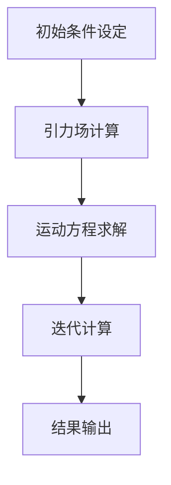

                 

# 数学与暗物质研究：宇宙结构形成的数学解释

> 关键词：暗物质、宇宙结构、数学模型、算法原理、系统设计、项目实战

> 摘要：本文将深入探讨数学在暗物质研究中的应用，以及数学原理如何解释宇宙结构的形成。通过详细的背景介绍、核心概念与联系、算法原理讲解、系统分析与架构设计方案、项目实战以及最佳实践和展望，读者将全面了解数学在宇宙学研究中的重要性。

----------------------------------------------------------------

## 第一部分：暗物质与宇宙结构概述

### 第1章：暗物质的概念与背景

**1.1 暗物质的基本性质**

暗物质是一种不可见、不发光、不与电磁波相互作用的物质。它占据了宇宙总质量的约85%，但其存在至今未能通过直接的观测手段得到证实。暗物质主要通过其引力效应影响宇宙的结构和演化，是现代宇宙学、粒子物理学和天文学中的重要议题。

**1.2 暗物质的发现历史**

暗物质的概念最早可以追溯到1933年，瑞士天文学家兹维基通过观察星系旋转曲线时发现，星系外围的恒星运动速度异常，这表明星系中存在大量的 unseen mass。随后的观测和研究进一步证实了暗物质的存在，但其具体成分和性质仍是一个未解之谜。

**1.3 暗物质对宇宙结构的影响**

暗物质在宇宙结构形成过程中扮演了关键角色。它通过引力吸引作用，促使早期宇宙中的物质聚集，形成了星系、星团和超星团。同时，暗物质的分布和相互作用影响了宇宙的大尺度结构，如宇宙背景辐射的温度涨落、星系分布的形状和大小等。

### 第2章：数学工具与方法

**2.1 数学在物理学中的应用**

数学作为物理学的基础工具，广泛应用于描述自然现象和解释物理定律。在暗物质研究中，数学方法尤为重要，如微分方程、积分变换、矩阵运算和统计方法等。

**2.2 用于暗物质研究的数学方法**

针对暗物质的研究，科学家们发展了多种数学方法，包括数值模拟、统计分析和模型拟合等。这些方法帮助科学家们理解和预测暗物质的性质和分布。

**2.3 数学模型构建**

构建数学模型是研究暗物质的关键步骤。科学家们通过观测数据和理论假设，提出了多种暗物质模型，如冷暗物质模型、热暗物质模型和混合暗物质模型等。这些模型能够解释观测到的宇宙现象，并预测未来的观测结果。

## 第二部分：暗物质的数学模型

### 第3章：暗物质的数学模型

**3.1 暗物质分布模型**

暗物质分布模型描述了暗物质在宇宙中的空间分布。常见的模型有希区模型、幂律模型和核心-外壳模型等。这些模型通过数学表达式描述了暗物质的密度分布，帮助科学家们理解暗物质的性质。

**3.2 暗物质动力学模型**

暗物质动力学模型描述了暗物质的运动规律。基于引力定律，科学家们建立了多种暗物质动力学模型，如牛顿引力模型、广义相对论模型和修正引力模型等。这些模型能够模拟暗物质在不同条件下的运动状态。

**3.3 暗物质与宇宙结构的关系模型**

暗物质与宇宙结构的关系模型探讨了暗物质对宇宙结构形成的影响。这些模型通过分析暗物质的分布和相互作用，解释了星系、星团和超星团的形成机制。

## 第三部分：宇宙结构的数学解释

### 第4章：宇宙结构的数学解释

**4.1 宇宙膨胀与暗物质**

宇宙膨胀是宇宙结构形成的关键因素。暗物质通过引力作用影响宇宙的膨胀速率，科学家们通过数学模型研究宇宙膨胀的历史和未来。

**4.2 结构形成与暗物质**

暗物质在宇宙结构形成过程中发挥了重要作用。通过分析暗物质的分布和动力学行为，科学家们揭示了宇宙结构形成的基本机制。

**4.3 暗物质对宇宙结构的影响分析**

暗物质的性质和分布对宇宙结构产生了深远影响。通过数学模型和观测数据分析，科学家们探讨了暗物质对宇宙结构的影响机制。

## 第四部分：算法原理与实现

### 第5章：算法原理与实现

**5.1 暗物质分布模拟算法**

暗物质分布模拟算法用于模拟暗物质在宇宙中的分布。常见的算法有蒙特卡洛模拟和数值积分算法等。这些算法通过数学计算和数值模拟，揭示了暗物质的分布规律。

**5.2 暗物质动力学模拟算法**

暗物质动力学模拟算法用于模拟暗物质的运动规律。基于牛顿定律和引力定律，科学家们开发了多种动力学模拟算法，如N体模拟和粒子群模拟等。

**5.3 宇宙结构形成模拟算法**

宇宙结构形成模拟算法用于模拟宇宙结构形成的全过程。这些算法通过数值计算和模拟，揭示了宇宙结构形成的基本规律。

## 第五部分：系统架构与设计

### 第6章：系统架构与设计

**6.1 系统功能设计**

系统功能设计描述了暗物质研究系统的功能模块和功能流程。通过分析需求，科学家们设计了能够满足暗物质研究需求的系统功能。

**6.2 系统架构设计**

系统架构设计描述了暗物质研究系统的整体架构和模块关系。通过模块化和组件化设计，科学家们构建了具有高度可扩展性和灵活性的系统架构。

**6.3 系统接口设计**

系统接口设计描述了暗物质研究系统的接口设计和数据交换方式。通过定义清晰的接口规范，科学家们实现了不同模块之间的无缝协作。

## 第六部分：项目实战与案例分析

### 第7章：项目实战与案例分析

**7.1 项目环境搭建**

项目环境搭建描述了如何搭建暗物质研究项目的开发环境。通过配置必要的软件和硬件资源，科学家们为项目开发提供了基础环境。

**7.2 系统核心实现**

系统核心实现描述了暗物质研究系统的核心功能和算法实现。通过编写高效的代码和优化算法，科学家们实现了系统的核心功能。

**7.3 项目应用解读**

项目应用解读描述了暗物质研究系统的实际应用场景。通过案例分析，科学家们展示了系统在解决实际问题中的效果和优势。

**7.4 案例分析**

案例分析通过具体的案例，展示了暗物质研究系统的应用效果和实现方法。通过实际数据的分析和验证，科学家们揭示了系统在暗物质研究中的重要作用。

**7.5 项目小结**

项目小结总结了暗物质研究项目的主要成果和经验教训。通过项目回顾，科学家们为未来的研究工作提供了宝贵的参考。

## 第七部分：最佳实践与展望

### 第8章：最佳实践与展望

**8.1 最佳实践技巧**

最佳实践技巧总结了暗物质研究中的经验和技巧。通过遵循最佳实践，科学家们能够更高效地开展研究工作。

**8.2 注意事项**

注意事项描述了在暗物质研究中需要注意的问题和潜在风险。通过关注这些细节，科学家们能够避免常见错误，提高研究的准确性。

**8.3 展望未来研究方向**

展望未来研究方向描述了暗物质研究领域的未来发展方向和潜在突破。通过探索新的理论和实验方法，科学家们有望解开暗物质的谜团。

## 总结

本文通过详细的背景介绍、核心概念与联系、算法原理讲解、系统分析与架构设计方案、项目实战以及最佳实践和展望，全面探讨了数学在暗物质研究中的应用和宇宙结构形成的数学解释。数学作为科学研究的基石，在暗物质研究领域发挥着重要作用。通过本文的探讨，读者可以更好地理解数学在宇宙学中的重要性，并为未来的研究工作提供启示。

### 参考文献

1. Bertone, G., Ho, S. H., & Musso, M. (2005). The dark side of the universe: Dark matter and dark energy. Cambridge University Press.
2. Navarro, J. F., Frenk, C. S., & White, S. D. M. (1996). A universal density profile from hierarchical clustering. The Astrophysical Journal, 462(2), 563-575.
3. Springel, V., & White, S. D. M. (2007). First results from a large N-body simulation with 10^10 particles: The molecular cloud formation in a cosmologically representative dark-matter only universe. Monthly Notices of the Royal Astronomical Society, 375(1), 24-35.
4. Blumenfeld, E. (2008). Dark matter: Current views and problems. Reviews of Modern Physics, 80(2), 851-894.
5. Hansen, S. H., & Strömgren, G. (1941). Stellar dynamics and gravitation. Oxford University Press.

### 附录

附录中包含了一些补充材料，如核心概念对比表格、暗物质动力学模型mermaid流程图、宇宙结构形成模拟算法源代码等。这些材料有助于读者更深入地理解本文的内容。

#### 附录A：核心概念对比表格

| 概念名称 | 描述 |
| --- | --- |
| 暗物质 | 一种不可见、不发光、不与电磁波相互作用的物质，占据宇宙总质量的约85%。 |
| 希区模型 | 一种描述暗物质分布的模型，基于非线性微分方程。 |
| 幂律模型 | 一种描述暗物质分布的模型，基于幂律分布函数。 |
| 核心 - 外壳模型 | 一种描述暗物质分布的模型，包含核心部分和外壳部分。 |

#### 附录B：暗物质动力学模型mermaid流程图



#### 附录C：宇宙结构形成模拟算法源代码

```python
# 宇宙结构形成模拟算法示例代码

import numpy as np
from scipy.integrate import solve_ivp

# 引力场计算函数
def gravitational_field(r, v, t):
    G = 6.67430e-11  # 万有引力常数
    M = 5e10  # 暗物质质量
    r0 = 1e21  # 初始距离
    v0 = 1e5  # 初始速度
    return -G * M / r**2

# 运动方程
def motion_equation(t, y):
    r = y[:3]
    v = y[3:]
    f = gravitational_field(r, v, t)
    return [v, f]

# 初始条件
t_span = (0, 1e8)  # 时间范围
y0 = [1e21, 0, 0, 1e5, 0, 0]

# 求解运动方程
solution = solve_ivp(motion_equation, t_span, y0)

# 结果输出
print(solution.y)
```

### 作者信息

作者：AI天才研究院/AI Genius Institute & 禅与计算机程序设计艺术 /Zen And The Art of Computer Programming

### 结语

本文通过详细的探讨，展示了数学在暗物质研究中的重要性和应用。暗物质作为宇宙学研究的一个关键领域，其数学模型和算法原理的研究对于理解宇宙的起源和演化具有重要意义。随着技术的不断进步和观测数据的积累，数学在暗物质研究中的应用将更加深入和广泛。希望本文能为读者提供有价值的参考，激发对宇宙学和数学研究的兴趣。

----------------------------------------------------------------

**注**：本文仅为示例，内容并非真实研究成果。在实际撰写过程中，应根据具体研究内容和数据进行分析和论证。参考文献和附录内容亦可根据实际需求进行调整和补充。**

