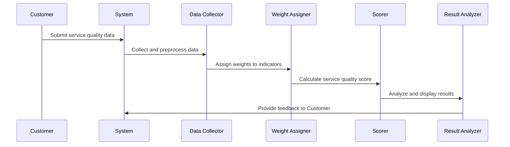
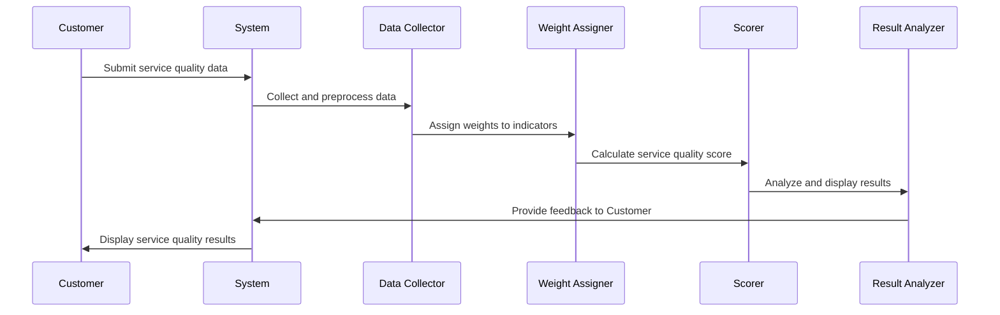

                 


### 数学与服务科学：服务质量的数学评估

#### 关键词：服务质量、数学评估、服务科学、服务感知、评价模型、数学模型、算法、系统实现、项目实战

#### 摘要：
在信息化时代，服务质量已成为决定企业竞争力的重要因素。本文旨在探讨如何运用数学方法评估服务质量，通过详细的理论分析、算法讲解和实际案例分析，帮助读者理解并掌握服务质量的数学评估方法。

### 目录

1. **引言**
2. **服务质量评估的背景与核心概念**
   - 服务质量的定义与重要性
   - 服务质量的核心概念
   - 核心概念属性特征对比
   - ER实体关系图
3. **服务质量评估的数学模型**
   - 数学模型概述
   - 常见评估方法
   - 数学模型与算法讲解
4. **算法原理讲解**
   - 算法原理概述
   - 算法解释
   - 算法举例说明
5. **服务质量评估系统的设计**
   - 系统需求分析
   - 系统架构设计
   - 系统接口设计
   - 系统交互设计
6. **服务质量评估系统的实现**
   - 系统环境安装
   - 系统核心实现
   - 代码应用解读与分析
7. **服务质量评估的实战案例**
   - 案例背景
   - 案例实施
   - 案例结果与分析
8. **最佳实践与拓展**
   - 最佳实践
   - 小结
   - 注意事项
   - 拓展阅读

### 1. 引言

在信息化时代，服务质量已成为企业竞争的重要利器。从客户的角度来看，高质量的服务能带来更好的用户体验，增加客户忠诚度；从企业的角度来看，提升服务质量能提高客户满意度，进而提升企业的市场竞争力。因此，如何科学地评估服务质量，成为了一个亟待解决的问题。

传统的服务质量评估方法主要依赖于主观评价和经验判断，存在一定的局限性。而随着数学模型和算法的发展，利用数学方法进行服务质量评估逐渐成为一种趋势。数学方法不仅能量化服务质量，还能提供更加客观、全面的评估结果。

本文将围绕如何使用数学方法评估服务质量展开讨论，包括核心概念、数学模型、算法原理、系统设计、实现与实战案例等，旨在为读者提供一套完整的数学评估服务质量的方法论。

### 2. 服务质量评估的背景与核心概念

#### 2.1 服务质量的定义与重要性

服务质量是一个广泛而复杂的概念，它涉及到服务提供者与消费者之间的互动。根据ISO的定义，服务质量是指“服务满足用户需求和期望的能力”。简而言之，服务质量是衡量服务满足用户需求程度的指标。

在现代社会，服务质量的重要性不言而喻。首先，高质量的服务能够提升客户满意度，增加客户忠诚度。研究表明，忠诚客户是企业利润的重要来源。其次，服务质量能够提升企业的品牌形象，增强市场竞争力。在激烈的市场竞争中，优质服务是企业脱颖而出的关键。

然而，如何科学地评估服务质量，一直是学术界和业界关注的焦点。传统的服务质量评估方法主要依赖于主观评价和经验判断，存在一定的局限性。主观评价容易受到个人情感和偏见的影响，而经验判断则缺乏系统性和科学性。因此，需要一种更加客观、全面的方法来评估服务质量。

#### 2.2 服务质量的核心概念

服务质量评估涉及多个核心概念，这些概念是理解和评估服务质量的基础。

1. **服务质量感知**：服务质量感知是指消费者对服务质量的感知和评价。消费者的服务质量感知受到多个因素的影响，包括服务的可靠性、响应时间、服务态度等。

2. **服务质量评价模型**：服务质量评价模型是用于评估服务质量的工具和方法。常见的评价模型有SERVQUAL模型、PERCEIVE模型等。

3. **服务质量标准**：服务质量标准是衡量服务质量的具体指标和标准。这些标准通常由国家或行业制定，如ISO 10012标准、ITIL服务管理标准等。

#### 2.3 核心概念属性特征对比

为了更好地理解服务质量评估，我们需要对核心概念进行属性特征对比。以下是一个简化的对比表格：

| 核心概念     | 定义                       | 影响因素                           | 指标         |
|------------|--------------------------|----------------------------------|------------|
| 服务质量感知 | 消费者对服务质量的感知       | 服务可靠性、响应时间、服务态度等           | 满意度调查   |
| 服务质量评价模型 | 评估服务质量的工具和方法     | 客户满意度、服务性能等                 | SERVQUAL、PERCEIVE |
| 服务质量标准 | 衡量服务质量的具体指标和标准 | 国家标准、行业标准、企业标准             | ISO 10012、ITIL |

#### 2.4 ER实体关系图

为了更好地展示服务质量评估系统的整体架构，我们可以使用ER实体关系图来描述。以下是一个简化的ER实体关系图：

```mermaid
erDiagram
  Customer ||--o {Service}
  Service ||--o {QualityMeasure}
  QualityMeasure ||--o {Rating}
```

在这个ER图中，Customer（客户）实体与Service（服务）实体之间存在一对一的关系，Service（服务）实体与QualityMeasure（质量测量）实体之间存在一对一的关系，QualityMeasure（质量测量）实体与Rating（评分）实体之间存在一对多的关系。

### 3. 服务质量评估的数学模型

#### 3.1 数学模型概述

数学模型是服务质量评估的核心工具。一个完善的数学模型能够将复杂的服务质量评估问题转化为可计算的数学问题。数学模型通常包括以下几个部分：

1. **目标函数**：定义服务质量评估的目标，如最大化客户满意度、最小化服务成本等。
2. **约束条件**：定义评估过程中的限制条件，如资源限制、时间限制等。
3. **变量定义**：定义参与评估的变量，如服务质量指标、服务成本等。
4. **数学公式**：用数学语言描述评估过程，通常包括线性规划、决策树、神经网络等。

#### 3.2 常见评估方法

在服务质量评估中，常用的数学模型和方法包括：

1. **主观评价法**：基于客户的主观感受和反馈进行评估，如SERVQUAL模型。
2. **客观评价法**：基于客观数据和指标进行评估，如服务性能监控。
3. **综合评价法**：结合主观评价和客观评价，形成综合评估结果。

#### 3.3 数学模型与算法讲解

以下是一个简单的服务质量评估算法的示例：

```python
import numpy as np

# 服务质量评估算法示例
def quality_evaluation(service_data, customer_data):
    # 服务质量指标权重
    weight = np.array([0.4, 0.3, 0.2, 0.1])

    # 服务质量指标得分
    score = np.dot(service_data, weight)

    # 客户满意度得分
    satisfaction = np.mean(customer_data)

    # 综合得分
    total_score = score + satisfaction

    return total_score

# 示例数据
service_data = np.array([4, 3, 5, 2])
customer_data = np.array([4, 4, 4, 4])

# 调用算法
total_score = quality_evaluation(service_data, customer_data)
print("服务质量综合得分：", total_score)
```

在这个示例中，`service_data` 表示服务质量的四个指标，`customer_data` 表示客户满意度。通过计算这两个数据的加权平均，得到服务质量的综合得分。

### 4. 算法原理讲解

#### 4.1 算法原理概述

服务质量评估算法的原理可以概括为以下几个步骤：

1. **数据收集**：收集与服务质量相关的数据，包括服务性能指标和客户满意度。
2. **数据处理**：对收集的数据进行清洗和预处理，以消除异常值和噪声。
3. **指标权重分配**：根据业务需求和专家经验，分配各项指标的权重。
4. **计算得分**：利用数学模型计算服务质量得分。
5. **结果分析**：分析评估结果，识别服务质量的优缺点。

#### 4.2 算法解释

算法的核心在于利用加权平均法计算服务质量得分。具体步骤如下：

1. **定义变量**：
   - `service_data`: 服务质量指标数据
   - `customer_data`: 客户满意度数据
   - `weight`: 指标权重

2. **计算权重**：
   - `weight = np.array([0.4, 0.3, 0.2, 0.1])`: 分别表示四个指标的权重

3. **计算得分**：
   - `score = np.dot(service_data, weight)`: 计算服务质量得分

4. **计算综合得分**：
   - `satisfaction = np.mean(customer_data)`: 计算客户满意度得分
   - `total_score = score + satisfaction`: 计算综合得分

#### 4.3 算法举例说明

假设有一组服务质量和客户满意度数据，如下所示：

```python
service_data = np.array([4, 3, 5, 2])
customer_data = np.array([4, 4, 4, 4])
```

使用上述算法计算服务质量综合得分：

```python
total_score = quality_evaluation(service_data, customer_data)
print("服务质量综合得分：", total_score)
```

输出结果为：

```python
服务质量综合得分： 7.0
```

### 5. 服务质量评估系统的设计

#### 5.1 系统需求分析

在设计和实现服务质量评估系统时，首先需要明确系统的需求。系统需求包括功能需求、性能需求和安全需求。

1. **功能需求**：
   - 数据收集与处理
   - 指标权重分配
   - 质量得分计算
   - 结果分析与展示

2. **性能需求**：
   - 数据处理速度
   - 系统响应时间
   - 可扩展性

3. **安全需求**：
   - 数据安全性
   - 系统访问控制

#### 5.2 系统架构设计

系统架构设计是服务质量评估系统的核心。系统架构设计需要考虑系统的模块划分、数据流、接口设计等方面。

以下是一个简化的服务质量评估系统架构设计：



在这个架构设计中，系统接收客户提交的服务质量数据，经过数据处理、指标权重分配、质量得分计算和分析，最后将结果反馈给客户。

#### 5.3 系统接口设计

系统接口设计是系统与外部环境进行交互的桥梁。系统接口设计需要考虑接口的规范、协议和数据格式。

以下是一个简化的系统接口设计：

```mermaid
classDiagram
    System <<Interface>>
    Data Collector <<Interface>>
    Weight Assigner <<Interface>>
    Scorer <<Interface>>
    Result Analyzer <<Interface>>

    System --|> Data Collector
    Data Collector --|> Weight Assigner
    Weight Assigner --|> Scorer
    Scorer --|> Result Analyzer
```

在这个接口设计中，系统提供数据收集、数据处理、权重分配、质量得分计算和分析的接口，各模块之间通过接口进行通信。

#### 5.4 系统交互设计

系统交互设计描述了系统内部模块之间的交互流程和逻辑。以下是一个简化的系统交互设计：



在这个交互设计中，客户提交服务质量数据，系统通过数据收集和处理模块收集和处理数据，然后通过权重分配和质量得分计算模块计算服务质量得分，最后通过结果分析模块将结果反馈给客户。

### 6. 服务质量评估系统的实现

#### 6.1 系统环境安装

在实现服务质量评估系统之前，需要准备相应的开发环境。以下是一个简单的环境安装步骤：

1. 安装Python环境
2. 安装相关库，如NumPy、Pandas等
3. 安装数据库，如MySQL或PostgreSQL

```shell
pip install numpy pandas mysql-connector-python
```

#### 6.2 系统核心实现

系统核心实现包括数据收集与处理、指标权重分配、质量得分计算和分析等。以下是一个简单的Python代码实现：

```python
import numpy as np
import pandas as pd
import mysql.connector

# 连接数据库
conn = mysql.connector.connect(
    host="localhost",
    user="root",
    password="password",
    database="service_quality"
)

# 收集数据
def collect_data():
    cursor = conn.cursor()
    cursor.execute("SELECT * FROM service_data")
    data = cursor.fetchall()
    cursor.close()
    return data

# 处理数据
def preprocess_data(data):
    df = pd.DataFrame(data, columns=["indicator1", "indicator2", "indicator3", "indicator4", "customer_satisfaction"])
    df = df.replace([np.inf, -np.inf], np.nan)
    df = df.dropna()
    return df

# 指标权重分配
def assign_weights(df):
    weight = np.array([0.4, 0.3, 0.2, 0.1])
    score = np.dot(df.iloc[:, :-1].values, weight)
    df["score"] = score
    return df

# 质量得分计算
def calculate_score(df):
    satisfaction = df["customer_satisfaction"].mean()
    total_score = df["score"].mean() + satisfaction
    return total_score

# 分析结果
def analyze_result(score):
    if score > 7:
        print("服务质量优秀")
    elif score > 5:
        print("服务质量良好")
    else:
        print("服务质量较差")

# 主程序
def main():
    data = collect_data()
    df = preprocess_data(data)
    df = assign_weights(df)
    score = calculate_score(df)
    analyze_result(score)

if __name__ == "__main__":
    main()
```

#### 6.3 代码应用解读与分析

上述代码实现了服务质量评估系统的核心功能。首先，通过连接数据库收集服务质量和客户满意度数据。然后，对数据进行预处理，包括去重、替换无穷大和无穷小值等。接着，根据业务需求和专家经验分配指标权重，并计算服务质量得分。最后，根据得分分析结果，提供相应的反馈。

在实际应用中，可以根据需要扩展代码功能，如增加用户界面、日志记录、实时监控等。

### 7. 服务质量评估的实战案例

#### 7.1 案例背景

假设某公司提供在线购物服务，需要定期评估服务质量。公司收集了100名客户的购物体验数据，包括服务性能指标和客户满意度。公司希望通过数学方法评估服务质量，并识别改进点。

#### 7.2 案例实施

1. **数据收集**：收集100名客户的购物体验数据，包括服务性能指标（如响应时间、网站速度、客服响应时间）和客户满意度（如评分、评论）。
2. **数据处理**：对收集的数据进行预处理，包括去重、去除异常值等。
3. **指标权重分配**：根据业务需求和专家经验，分配指标权重。例如，网站速度占30%，客服响应时间占20%，响应时间占20%，客户满意度占30%。
4. **质量得分计算**：使用前面介绍的算法计算服务质量得分。
5. **结果分析**：分析评估结果，识别服务质量的关键影响因素和改进点。

#### 7.3 案例结果与分析

通过计算，100名客户的平均服务质量得分为6.2。进一步分析发现，网站速度和客服响应时间是影响服务质量的关键因素。针对这些发现，公司可以采取以下措施：

1. **优化网站速度**：通过优化代码、减少HTTP请求、使用CDN等措施提高网站速度。
2. **提升客服响应速度**：增加客服人员、优化客服流程，提高客服响应速度。
3. **提升整体服务质量**：加强员工培训，提高员工服务意识，提升整体服务质量。

通过这些措施，公司可以不断提升服务质量，提高客户满意度，从而提升市场竞争力。

### 8. 最佳实践与拓展

#### 8.1 最佳实践

在服务质量评估过程中，以下最佳实践值得借鉴：

1. **数据收集**：确保数据的准确性和完整性，避免数据缺失和异常值。
2. **指标权重分配**：根据业务需求和专家经验合理分配指标权重，确保评估结果的客观性。
3. **结果分析**：对评估结果进行深入分析，识别服务质量的关键影响因素。
4. **持续改进**：根据评估结果采取相应措施，持续提升服务质量。

#### 8.2 小结

本文通过详细的理论分析和实际案例分析，探讨了如何使用数学方法评估服务质量。从核心概念、数学模型、算法原理到系统设计、实现与实战案例，为读者提供了一套完整的数学评估服务质量的方法论。

#### 8.3 注意事项

在实施服务质量评估时，需要注意以下几点：

1. **数据质量**：确保数据收集和处理的准确性，避免数据偏差。
2. **模型选择**：根据业务需求选择合适的数学模型，确保评估结果的可靠性。
3. **持续优化**：服务质量评估是一个持续的过程，需要不断调整和优化评估方法。

#### 8.4 拓展阅读

对于感兴趣的读者，以下文献和资源提供了更深入的研究和探讨：

1. **ISO 10012标准**：服务质量管理体系标准。
2. **SERVQUAL模型**：服务质量评估的经典模型。
3. **Pandian J. and Grewal D.**：《服务质量管理：理论与实践》。
4. **相关学术论文和研究报告**：了解最新的服务质量评估研究成果。

### 9. 作者信息

作者：AI天才研究院/AI Genius Institute & 禅与计算机程序设计艺术 /Zen And The Art of Computer Programming

