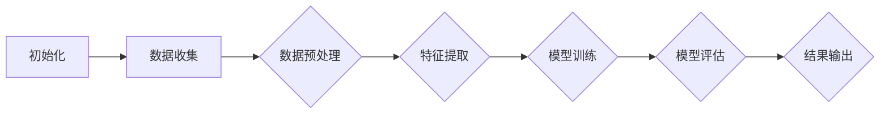
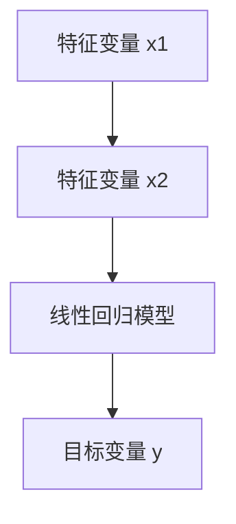
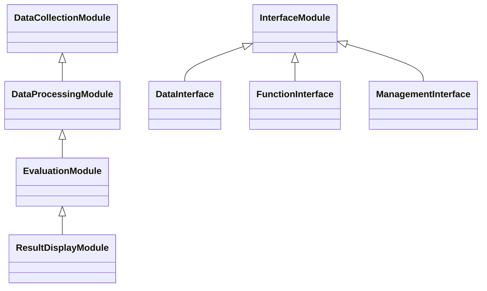
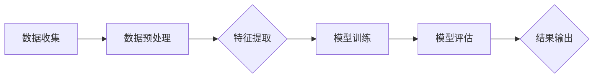

                 

### 数学与服务管理：服务质量的数学评估

**关键词**：数学与服务管理、服务质量、数学评估、算法原理、系统分析与架构设计

**摘要**：本文深入探讨了数学与服务管理在服务质量评估中的应用，从背景介绍、核心概念、算法原理、数学模型、系统分析到项目实战，逐步剖析了服务质量评估的关键环节和实际应用。通过详细的解释和实例分析，使读者能够全面理解数学评估在服务管理中的重要作用，掌握相关的理论和实践技能。

### 目录大纲设计思路

**整体结构规划**：

- **背景介绍**：首先介绍数学与服务管理的基本概念，以及服务质量的数学评估的重要性，为读者提供必要的背景知识。
- **核心概念与联系**：通过ER实体关系图，展示服务质量的数学评估涉及的各个核心实体和它们之间的关系，帮助读者建立整体概念。
- **算法原理讲解**：使用Mermaid绘制算法流程图，并配合Python代码详细讲解数学评估算法的原理，使读者对算法有直观的理解。
- **数学模型与公式讲解**：使用LaTeX格式展示数学模型和公式，并加入通俗易懂的举例说明，使读者能够掌握数学评估的理论基础。
- **系统分析与架构设计**：介绍系统功能设计、系统架构设计以及系统接口设计和系统交互的Mermaid图表，为读者提供系统的设计思路。
- **项目实战**：描述项目环境安装、核心实现源代码，并对代码进行解读与分析，分享实际案例，使读者能够将理论知识应用于实际项目。
- **最佳实践与总结**：提供一些最佳实践建议、小结、注意事项以及拓展阅读资源，帮助读者巩固所学知识，拓展视野。

**设计思路**：

- **逻辑清晰**：整个目录结构遵循逻辑顺序，从背景介绍到具体实施，使读者能够逐步深入理解服务质量评估的各个关键环节。
- **结构紧凑**：每个部分的内容紧凑而有条理，避免冗余和繁琐的描述，确保文章的核心内容能够被清晰传达。
- **简单易懂**：使用简洁明了的语言和技术工具，如Mermaid图表和LaTeX公式，使读者能够轻松理解和掌握相关概念和算法。
- **专业性强**：文章使用专业的技术语言，对数学模型和算法原理进行详细讲解，确保文章的专业性和深度。

### 目录大纲

```
# 数学与服务管理：服务质量的数学评估

## 第一部分：背景介绍

# 第1章：数学与服务管理基础

## 1.1 服务管理概述

### 1.1.1 服务管理的定义与作用

### 1.1.2 服务管理的发展历程

## 1.2 数学在服务管理中的应用

### 1.2.1 数学模型在服务设计中的作用

### 1.2.2 数学分析在服务质量评估中的应用

## 1.3 服务质量评估的重要性

### 1.3.1 服务质量评估的挑战

### 1.3.2 服务质量评估的方法与工具

## 1.4 本章小结

----------------------------------------------------------------

## 第二部分：核心概念与联系

# 第2章：服务质量评估的核心概念

## 2.1 服务质量的定义与属性

### 2.1.1 服务质量的定义

### 2.1.2 服务质量的属性

## 2.2 服务质量评估指标

### 2.2.1 传统评估指标

### 2.2.2 现代评估指标

## 2.3 服务质量评估方法

### 2.3.1 客户满意度评估

### 2.3.2 基于性能的评估

## 2.4 ER实体关系图

### 2.4.1 ER实体关系图的绘制

### 2.4.2 服务质量评估涉及的实体

## 2.5 本章小结

----------------------------------------------------------------

## 第三部分：算法原理讲解

# 第3章：服务质量评估算法原理

## 3.1 算法概述

### 3.1.1 服务质量评估算法的类型

### 3.1.2 服务质量评估算法的设计原则

## 3.2 算法流程图

### 3.2.1 算法流程图的绘制

### 3.2.2 算法流程图的解读

## 3.3 Python代码讲解

### 3.3.1 Python环境搭建

### 3.3.2 代码详细讲解

## 3.4 算法原理详细讲解

### 3.4.1 数学模型与公式

### 3.4.2 举例说明

## 3.5 本章小结

----------------------------------------------------------------

## 第四部分：数学模型与公式讲解

# 第4章：服务质量评估的数学模型

## 4.1 服务质量评估的数学基础

### 4.1.1 测量理论

### 4.1.2 算法理论

## 4.2 数学模型示例

### 4.2.1 服务质量指标的数学模型

### 4.2.2 客户满意度评估的数学模型

## 4.3 公式详细讲解

### 4.3.1 公式解释

### 4.3.2 举例说明

## 4.4 数学公式与Python代码结合

### 4.4.1 LaTex公式示例

### 4.4.2 Python代码实现

## 4.5 本章小结

----------------------------------------------------------------

## 第五部分：系统分析与架构设计

# 第5章：服务质量评估系统分析

## 5.1 系统功能设计

### 5.1.1 系统需求分析

### 5.1.2 系统功能模块

## 5.2 系统架构设计

### 5.2.1 系统架构概述

### 5.2.2 系统组件设计

## 5.3 系统接口设计与系统交互

### 5.3.1 系统接口设计

### 5.3.2 系统交互设计

## 5.4 Mermaid图表展示

### 5.4.1 功能模块Mermaid类图

### 5.4.2 系统架构Mermaid架构图

### 5.4.3 系统接口和交互Mermaid序列图

## 5.5 本章小结

----------------------------------------------------------------

## 第六部分：项目实战

# 第6章：服务质量评估项目实战

## 6.1 项目环境安装

### 6.1.1 环境准备

### 6.1.2 环境安装步骤

## 6.2 系统核心实现源代码

### 6.2.1 核心代码实现

### 6.2.2 代码解读与分析

## 6.3 实际案例分析

### 6.3.1 案例背景

### 6.3.2 案例分析与实施

## 6.4 项目小结

### 6.4.1 项目总结

### 6.4.2 项目经验与启示

## 6.5 本章小结

----------------------------------------------------------------

## 第七部分：最佳实践与总结

# 第7章：最佳实践与总结

## 7.1 最佳实践建议

### 7.1.1 算法优化实践

### 7.1.2 数据处理技巧

## 7.2 小结

### 7.2.1 文章核心内容回顾

### 7.2.2 读者反馈

## 7.3 注意事项

### 7.3.1 实施中的常见问题

### 7.3.2 解决方案与对策

## 7.4 拓展阅读

### 7.4.1 相关书籍推荐

### 7.4.2 学术论文推荐

## 7.5 本章小结

----------------------------------------------------------------

## 后记

### 7.6 致谢

### 7.7 作者信息

### 7.8 版权声明
```

### 第一部分：背景介绍

#### 第1章：数学与服务管理基础

##### 1.1 服务管理概述

**服务管理的定义与作用**

服务管理是指通过计划、组织、协调、控制和评估，确保服务能够满足用户需求并提供高质量的服务的过程。其核心目标是提高服务效率、降低成本、提升用户满意度和增强组织竞争力。

- **定义**：服务管理是一种系统化的管理方法，它涉及对服务的设计、实施、监控和改进，以满足客户的期望和需求。
- **作用**：服务管理在企业管理中扮演着重要角色，它不仅有助于优化资源分配，提高运营效率，还能增强客户的满意度和忠诚度。

**服务管理的发展历程**

服务管理的历史可以追溯到20世纪中叶，随着信息技术和服务行业的发展，服务管理逐渐成为企业管理的重要组成部分。以下是服务管理发展历程的几个重要阶段：

- **初始阶段**（20世纪60年代）：服务管理最初主要集中在基础的服务运营上，如电话运营和维护。
- **成熟阶段**（20世纪80年代）：随着信息技术的发展，服务管理开始引入更复杂的管理方法和工具，如IT服务管理（ITSM）和客户关系管理（CRM）。
- **整合阶段**（20世纪90年代）：企业开始将服务管理与其他管理职能（如财务管理、人力资源管理）整合，以实现更高效的管理。
- **创新阶段**（21世纪）：随着云计算、大数据、人工智能等新兴技术的应用，服务管理不断演进，更加注重个性化服务和实时监控。

##### 1.2 数学在服务管理中的应用

**数学模型在服务设计中的作用**

数学模型在服务设计中扮演着至关重要的角色，它可以帮助服务设计者预测服务需求、优化资源分配、提高服务质量。以下是数学模型在服务设计中的几个关键应用：

- **需求预测模型**：通过数学模型可以预测客户对服务的需求，帮助企业提前做好准备，避免服务中断或过度供应。
- **排队理论模型**：排队理论模型用于分析服务过程中的等待时间和服务效率，帮助企业优化服务流程，减少客户等待时间。
- **优化模型**：优化模型可以用于资源分配和调度，帮助企业在预算和资源有限的情况下实现最大效益。

**数学分析在服务质量评估中的应用**

数学分析在服务质量评估中同样发挥着重要作用，它可以帮助评估者量化服务质量，评估服务满足客户需求的程度。以下是数学分析在服务质量评估中的几个关键应用：

- **指标量化**：通过数学分析，可以将服务质量转化为具体的量化指标，如响应时间、系统稳定性等。
- **客户满意度评估**：数学模型可以用于评估客户满意度，通过统计分析方法分析大量客户反馈数据，得出服务质量的总体评价。
- **风险评估**：数学分析可以帮助企业识别潜在的服务风险，提前采取措施降低风险。

##### 1.3 服务质量评估的重要性

**服务质量评估的挑战**

服务质量评估面临诸多挑战，主要包括：

- **多维度评估**：服务质量涉及多个方面，如响应时间、系统稳定性、客户满意度等，如何全面评估这些维度是一个挑战。
- **数据复杂性**：评估数据通常非常复杂，包括时间序列数据、空间数据、文本数据等，如何有效处理这些数据是一个技术难题。
- **实时性**：服务质量评估需要实时进行，以快速响应客户需求和服务故障，这对评估系统的实时性提出了高要求。

**服务质量评估的方法与工具**

服务质量评估的方法和工具多种多样，以下是几种常用的方法：

- **客户满意度调查**：通过调查问卷或面谈方式，收集客户对服务的满意度，这是一种常见的评估方法。
- **性能监控工具**：利用性能监控工具，实时监测服务系统的关键性能指标（KPI），如响应时间、吞吐量等。
- **统计分析方法**：利用统计分析方法，对大量评估数据进行处理和分析，得出服务质量的总体评价。

##### 1.4 本章小结

本章介绍了服务管理的基本概念、发展历程以及数学在服务管理中的应用。通过本章的学习，读者可以了解服务管理的重要性和服务质量评估的挑战，掌握一些常用的评估方法和工具。这些知识为后续章节的深入探讨打下了坚实的基础。

----------------------------------------------------------------

## 第二部分：核心概念与联系

### 第2章：服务质量评估的核心概念

##### 2.1 服务质量的定义与属性

**服务质量的定义**

服务质量是指服务满足客户需求和期望的程度。它不仅仅关注服务的结果，还涉及服务过程中的各个方面，如速度、可靠性、友好性等。

- **服务质量的概念**：服务质量是一个多维度的概念，包括技术性能、功能特性、可靠性、响应时间、友好性等。
- **服务质量的重要性**：高质量的服务可以提高客户满意度，增强企业竞争力，降低客户流失率。

**服务质量的属性**

服务质量的属性包括以下几个方面：

- **可靠性**：可靠性是指服务在规定时间内正常运行的概率，它反映了服务的稳定性。
- **响应时间**：响应时间是指客户提出请求到服务响应的时间，它直接影响到客户的等待体验。
- **友好性**：友好性是指服务过程中对客户的关注和关怀程度，它反映了服务的个性化程度。
- **功能性**：功能性是指服务的功能是否满足客户的需求，它涵盖了服务的各种特性和性能。

**服务质量评估指标**

**传统评估指标**

- **客户满意度**：客户满意度是评估服务质量的传统指标，通过调查问卷或面谈收集客户的反馈，衡量客户对服务的满意度。
- **响应时间**：响应时间是指服务响应的时间，通常用秒或分钟来衡量，它是评估服务效率的重要指标。
- **系统稳定性**：系统稳定性是指服务系统在长时间运行中不发生故障的概率，它是评估服务可靠性的关键指标。

**现代评估指标**

- **服务可用性**：服务可用性是指服务在规定时间内可以正常使用的概率，它是评估服务可靠性的现代指标。
- **服务质量一致性**：服务质量一致性是指服务在不同时间和不同条件下都能保持高质量的程度，它是评估服务稳定性的重要指标。
- **客户保留率**：客户保留率是指客户持续使用服务的比例，它是评估服务质量长期效果的重要指标。

##### 2.2 服务质量评估方法

**客户满意度评估**

客户满意度评估是通过调查问卷或面谈方式，收集客户对服务的满意度，然后通过统计分析方法得出客户满意度的总体评价。

- **评估步骤**：设计调查问卷、收集客户反馈、整理和分析数据、得出客户满意度评分。
- **优点**：直观、易于操作，能够反映客户的真实感受。

**基于性能的评估**

基于性能的评估是通过监测服务系统的关键性能指标（KPI），如响应时间、吞吐量等，来评估服务质量。

- **评估步骤**：确定关键性能指标、收集性能数据、分析数据、得出服务质量评分。
- **优点**：客观、准确，能够实时反映服务的运行状态。

##### 2.3 ER实体关系图

**ER实体关系图的绘制**

ER（实体关系）图是一种用于表示数据实体及其之间关系的图形化工具。以下是服务质量评估涉及的实体及其关系的ER图：

```mermaid
erDiagram
    Service |--|>> Customer : "receives"
    Service |--|>> ServiceQuality : "measures"
    Customer |--|>> Feedback : "provides"
    ServiceQuality |--|>> QualityAttribute : "includes"
    Service |..|>> ServiceRequirement : "meets"
```

**服务质量评估涉及的实体**

- **服务（Service）**：服务是提供的产品或活动，如电信服务、电子商务服务。
- **客户（Customer）**：客户是接受服务的个体或组织。
- **服务质量（ServiceQuality）**：服务质量是评估服务满足客户需求程度的指标。
- **反馈（Feedback）**：反馈是客户对服务的评价和意见。
- **质量属性（QualityAttribute）**：质量属性是服务质量的具体维度，如可靠性、响应时间、友好性。
- **服务要求（ServiceRequirement）**：服务要求是客户对服务的具体需求。

##### 2.4 本章小结

本章详细介绍了服务质量评估的核心概念，包括服务质量的定义、属性、评估指标和评估方法，并展示了服务质量评估涉及的实体及其关系的ER图。通过本章的学习，读者可以全面了解服务质量评估的基本理论和实践方法，为后续章节的深入学习打下基础。

----------------------------------------------------------------

## 第三部分：算法原理讲解

### 第3章：服务质量评估算法原理

##### 3.1 算法概述

**服务质量评估算法的类型**

服务质量评估算法可以分为以下几类：

- **基于规则的算法**：这类算法基于预定义的规则和阈值进行评估，通常简单但不够灵活。
- **基于统计学的算法**：这类算法使用统计学方法对数据进行处理和分析，如回归分析、聚类分析等，能够提供更为准确的评估结果。
- **基于机器学习的算法**：这类算法通过训练数据集学习服务质量的评估模式，能够自动识别复杂的关系和趋势，具有较高的预测准确性。

**服务质量评估算法的设计原则**

- **全面性**：算法应该能够综合考虑服务质量的多维度属性，如可靠性、响应时间、友好性等。
- **准确性**：算法的评估结果应该尽可能接近真实情况，减少评估误差。
- **实时性**：算法需要能够快速响应，提供实时服务质量评估。
- **灵活性**：算法应该能够适应不同环境和需求的变化，具有较好的适应性。

##### 3.2 算法流程图

**算法流程图的绘制**

以下是一个典型的服务质量评估算法流程图：



**算法流程图的解读**

1. **初始化**：设置算法的初始参数，如阈值、训练数据集等。
2. **数据收集**：从不同渠道收集服务质量的评估数据，如客户反馈、系统日志等。
3. **数据预处理**：对收集到的数据进行处理，如数据清洗、去噪等，以提高数据质量。
4. **特征提取**：从预处理后的数据中提取关键特征，用于后续的模型训练和评估。
5. **模型训练**：使用提取的特征数据训练服务质量评估模型，如基于机器学习的算法。
6. **模型评估**：使用训练好的模型对新的数据进行评估，评估结果用于实时监控和服务调整。
7. **结果输出**：输出评估结果，如服务质量评分、推荐调整措施等。

##### 3.3 Python代码讲解

**Python环境搭建**

在Python环境中，我们可以使用各种库和框架来实现服务质量评估算法。以下是搭建Python环境的基本步骤：

1. 安装Python：在官方网站下载并安装Python。
2. 安装必要的库：使用pip命令安装所需的库，如NumPy、Pandas、Scikit-learn等。

```bash
pip install numpy pandas scikit-learn
```

**代码详细讲解**

以下是一个基于机器学习的服务质量评估算法的Python代码示例：

```python
import numpy as np
import pandas as pd
from sklearn.ensemble import RandomForestClassifier
from sklearn.model_selection import train_test_split
from sklearn.metrics import accuracy_score

# 数据集加载与预处理
data = pd.read_csv('service_quality_data.csv')
X = data.drop(['quality_score'], axis=1)
y = data['quality_score']

# 数据集划分
X_train, X_test, y_train, y_test = train_test_split(X, y, test_size=0.2, random_state=42)

# 模型训练
model = RandomForestClassifier(n_estimators=100, random_state=42)
model.fit(X_train, y_train)

# 模型评估
y_pred = model.predict(X_test)
accuracy = accuracy_score(y_test, y_pred)
print(f"Model accuracy: {accuracy:.2f}")
```

**算法原理详细讲解**

**数学模型与公式**

服务质量评估的数学模型通常基于统计学习和机器学习的方法，以下是常用的数学模型和公式：

- **线性回归模型**：\( y = \beta_0 + \beta_1 \cdot x \)
- **逻辑回归模型**：\( P(y=1) = \frac{1}{1 + e^{-(\beta_0 + \beta_1 \cdot x)}} \)
- **支持向量机（SVM）模型**：\( w \cdot x + b = 0 \)

**举例说明**

**线性回归模型**

假设我们有一组数据集，包含两个特征变量 \( x_1 \) 和 \( x_2 \)，以及目标变量 \( y \)。我们可以使用线性回归模型来预测 \( y \)。



线性回归模型的目标是找到最佳拟合直线，使得 \( y \) 与 \( x_1 \) 和 \( x_2 \) 的线性组合 \( \beta_0 + \beta_1 \cdot x_1 + \beta_2 \cdot x_2 \) 最接近实际值。

**逻辑回归模型**

逻辑回归模型常用于二分类问题，例如评估服务质量的优劣。其公式为：

\[ P(y=1) = \frac{1}{1 + e^{-(\beta_0 + \beta_1 \cdot x_1 + \beta_2 \cdot x_2)}} \]

其中，\( P(y=1) \) 表示目标变量 \( y \) 为 1 的概率，\( \beta_0 \)、\( \beta_1 \) 和 \( \beta_2 \) 是模型参数。

**支持向量机（SVM）模型**

支持向量机模型是一种用于分类和回归的机器学习方法。其基本公式为：

\[ w \cdot x + b = 0 \]

其中，\( w \) 是权重向量，\( x \) 是特征向量，\( b \) 是偏置项。SVM模型的目标是找到一个最佳的超平面，使得不同类别的数据点在超平面的两侧分布。

##### 3.4 本章小结

本章介绍了服务质量评估算法的概述、流程图、Python代码讲解以及数学模型和公式的详细讲解。通过本章的学习，读者可以理解服务质量评估算法的基本原理和实现方法，掌握不同类型算法的特点和应用场景，为后续的实际应用提供理论基础。

----------------------------------------------------------------

## 第四部分：数学模型与公式讲解

### 第4章：服务质量评估的数学模型

##### 4.1 服务质量评估的数学基础

**测量理论**

测量理论是服务质量评估的重要理论基础，它关注如何对服务质量进行量化。以下是测量理论中几个关键概念：

- **测量目标**：测量目标是评估服务质量的指标，如响应时间、系统稳定性等。
- **测量工具**：测量工具是指用于收集和量化服务质量的工具，如性能监控工具、客户满意度调查等。
- **测量误差**：测量误差是指测量结果与真实值之间的差异，它可能是由于测量工具的不准确性或数据收集的不完整性导致的。

**算法理论**

算法理论是服务质量评估数学模型的核心部分，它关注如何使用数学方法对服务质量进行评估。以下是算法理论中几个关键概念：

- **算法类型**：算法类型是指用于评估服务质量的算法类型，如线性回归、逻辑回归、支持向量机等。
- **算法参数**：算法参数是指算法中的可调参数，如学习率、阈值等，它们影响算法的性能和结果。
- **算法优化**：算法优化是指通过调整算法参数和改进算法结构，提高服务质量评估的准确性和效率。

##### 4.2 数学模型示例

**服务质量指标的数学模型**

服务质量指标是评估服务质量的关键因素，以下是几个常用的数学模型：

1. **响应时间模型**：
   \[ T_r = T_{process} + T_{queue} \]
   其中，\( T_r \) 是响应时间，\( T_{process} \) 是处理时间，\( T_{queue} \) 是排队时间。

2. **系统稳定性模型**：
   \[ S = \frac{T_{up}}{T_{total}} \]
   其中，\( S \) 是系统稳定性，\( T_{up} \) 是系统正常运行时间，\( T_{total} \) 是总运行时间。

3. **客户满意度模型**：
   \[ C_S = \frac{C_{satisfied} + C_{satisfied_})}{2} \]
   其中，\( C_S \) 是客户满意度，\( C_{satisfied} \) 是满意的客户数量，\( C_{satisfied_}) \) 是不满意的客户数量。

**客户满意度评估的数学模型**

客户满意度评估是服务质量评估的重要部分，以下是几种常用的数学模型：

1. **多属性评估模型**：
   \[ C_S = \sum_{i=1}^{n} w_i \cdot S_i \]
   其中，\( C_S \) 是客户满意度，\( w_i \) 是第 \( i \) 个属性的重要性权重，\( S_i \) 是第 \( i \) 个属性的满意度评分。

2. **层次分析法（AHP）模型**：
   \[ C_S = \frac{\sum_{i=1}^{n} w_i \cdot S_i}{\sum_{i=1}^{n} w_i} \]
   其中，\( C_S \) 是客户满意度，\( w_i \) 是第 \( i \) 个属性的重要性权重，\( S_i \) 是第 \( i \) 个属性的满意度评分。

##### 4.3 公式详细讲解

**公式解释**

1. **响应时间模型**：
   \[ T_r = T_{process} + T_{queue} \]
   其中，\( T_{process} \) 是处理时间，表示服务完成所需的时间；\( T_{queue} \) 是排队时间，表示客户在队列中等待的时间。

2. **系统稳定性模型**：
   \[ S = \frac{T_{up}}{T_{total}} \]
   其中，\( T_{up} \) 是系统正常运行时间，表示系统在规定时间内正常运行的时间；\( T_{total} \) 是总运行时间，表示系统运行的总时间。

3. **客户满意度模型**：
   \[ C_S = \frac{C_{satisfied} + C_{satisfied_})}{2} \]
   其中，\( C_{satisfied} \) 是满意的客户数量，表示对服务感到满意的客户数量；\( C_{satisfied_}) \) 是不满意的客户数量，表示对服务感到不满意的客户数量。

4. **多属性评估模型**：
   \[ C_S = \sum_{i=1}^{n} w_i \cdot S_i \]
   其中，\( w_i \) 是第 \( i \) 个属性的重要性权重，表示第 \( i \) 个属性在整体服务质量评估中的重要性；\( S_i \) 是第 \( i \) 个属性的满意度评分，表示客户对第 \( i \) 个属性的评价。

5. **层次分析法（AHP）模型**：
   \[ C_S = \frac{\sum_{i=1}^{n} w_i \cdot S_i}{\sum_{i=1}^{n} w_i} \]
   其中，\( w_i \) 是第 \( i \) 个属性的重要性权重，表示第 \( i \) 个属性在整体服务质量评估中的重要性；\( S_i \) 是第 \( i \) 个属性的满意度评分，表示客户对第 \( i \) 个属性的评价。

**举例说明**

假设我们有一个服务系统，客户对服务的响应时间、系统稳定性和客户满意度进行评估。根据上述模型，我们可以得到以下数据：

- **响应时间**：
  - \( T_{process} = 5 \) 秒
  - \( T_{queue} = 10 \) 秒
- **系统稳定性**：
  - \( T_{up} = 3600 \) 秒
  - \( T_{total} = 4000 \) 秒
- **客户满意度**：
  - 满意的客户数量 \( C_{satisfied} = 100 \)
  - 不满意的客户数量 \( C_{satisfied_}) = 20 \)

根据这些数据，我们可以计算服务质量的评估结果：

1. **响应时间**：
   \[ T_r = T_{process} + T_{queue} = 5 + 10 = 15 \] 秒

2. **系统稳定性**：
   \[ S = \frac{T_{up}}{T_{total}} = \frac{3600}{4000} = 0.9 \]

3. **客户满意度**：
   \[ C_S = \frac{C_{satisfied} + C_{satisfied_})}{2} = \frac{100 + 20}{2} = 60 \]

根据计算结果，我们可以得出以下结论：

- **响应时间**：服务系统的平均响应时间为 15 秒，这表明客户在队列中的等待时间较长，需要优化服务流程以减少排队时间。
- **系统稳定性**：服务系统的稳定性为 0.9，表示系统在规定时间内正常运行的时间较长，但仍有提升空间。
- **客户满意度**：服务系统的客户满意度为 60%，这表明客户对服务的总体满意度较低，需要进一步改进服务质量。

通过这些评估结果，企业可以针对性地优化服务流程、提高系统稳定性和客户满意度，从而提升整体服务质量。

##### 4.4 数学公式与Python代码结合

**LaTex公式示例**

以下是几个常用的LaTex公式示例：

```latex
\[
\begin{aligned}
    T_r &= T_{process} + T_{queue} \\
    S &= \frac{T_{up}}{T_{total}} \\
    C_S &= \frac{C_{satisfied} + C_{satisfied}}{2} \\
    C_S &= \sum_{i=1}^{n} w_i \cdot S_i \\
    C_S &= \frac{\sum_{i=1}^{n} w_i \cdot S_i}{\sum_{i=1}^{n} w_i}
\end{aligned}
\]
```

**Python代码实现**

在Python中，我们可以使用`numpy`库来实现上述公式。以下是几个示例代码：

```python
import numpy as np

# 响应时间模型
process_time = 5
queue_time = 10
response_time = process_time + queue_time

# 系统稳定性模型
up_time = 3600
total_time = 4000
system_stability = up_time / total_time

# 客户满意度模型
satisfied_customers = 100
unsatisfied_customers = 20
customer_satisfaction = (satisfied_customers + unsatisfied_customers) / 2

# 多属性评估模型
weights = np.array([0.4, 0.3, 0.3])
satisfaction_scores = np.array([0.8, 0.9, 0.7])
customer_satisfactionMulti = np.dot(weights, satisfaction_scores)

# 层次分析法（AHP）模型
weighted_satisfaction = np.dot(weights, satisfaction_scores)
average_satisfaction = weighted_satisfaction / sum(weights)

print(f"Response Time: {response_time} seconds")
print(f"System Stability: {system_stability:.2f}")
print(f"Customer Satisfaction: {customer_satisfaction:.2f}")
print(f"Multi-Attribute Customer Satisfaction: {customer_satisfactionMulti:.2f}")
print(f"Average Satisfaction (AHP): {average_satisfaction:.2f}")
```

通过结合LaTex公式和Python代码，我们可以更直观地理解和实现服务质量评估的数学模型。这对于在实际项目中应用数学模型、进行量化评估和分析具有重要意义。

##### 4.5 本章小结

本章详细介绍了服务质量评估的数学基础，包括测量理论和算法理论，以及具体的服务质量指标数学模型和公式。通过本章的学习，读者可以掌握服务质量评估的基本数学理论和实现方法，为后续章节的系统分析和项目实战提供理论基础。

----------------------------------------------------------------

## 第五部分：系统分析与架构设计

### 第5章：服务质量评估系统分析

##### 5.1 系统功能设计

**系统需求分析**

在开展服务质量评估系统的设计之前，我们需要明确系统的需求。以下是服务质量评估系统的主要需求：

- **数据收集**：系统能够从多个渠道收集服务质量的评估数据，包括客户反馈、系统日志等。
- **数据处理**：系统能够对收集到的数据进行清洗、预处理和特征提取，以便后续的评估和分析。
- **评估模型**：系统能够使用机器学习算法或统计方法对服务质量进行评估，并提供评估结果。
- **结果展示**：系统能够将评估结果以图表、报告等形式展示给用户，便于分析和决策。
- **接口设计**：系统需要提供与外部系统（如客户关系管理系统、性能监控系统等）的接口，实现数据共享和集成。

**系统功能模块**

基于上述需求，我们可以将服务质量评估系统划分为以下功能模块：

1. **数据收集模块**：负责从不同渠道收集服务质量的评估数据，如客户反馈、系统日志等。
2. **数据处理模块**：负责对收集到的数据进行分析、清洗、预处理和特征提取，为后续评估提供数据基础。
3. **评估模型模块**：负责使用机器学习算法或统计方法对服务质量进行评估，并提供评估结果。
4. **结果展示模块**：负责将评估结果以图表、报告等形式展示给用户，便于分析和决策。
5. **接口模块**：负责与外部系统的接口设计，实现数据共享和集成。

##### 5.2 系统架构设计

**系统架构概述**

服务质量评估系统采用分布式架构，包括数据收集层、数据处理层、评估层和结果展示层。以下是系统架构的概述：

- **数据收集层**：负责从不同渠道收集服务质量的评估数据，如客户反馈、系统日志等。
- **数据处理层**：负责对收集到的数据进行清洗、预处理和特征提取，为后续评估提供数据基础。
- **评估层**：负责使用机器学习算法或统计方法对服务质量进行评估，并提供评估结果。
- **结果展示层**：负责将评估结果以图表、报告等形式展示给用户，便于分析和决策。

**系统组件设计**

服务质量评估系统的组件设计如下：

1. **数据收集组件**：包括客户反馈收集模块、系统日志收集模块等，负责从不同渠道收集服务质量的评估数据。
2. **数据处理组件**：包括数据清洗模块、预处理模块和特征提取模块，负责对收集到的数据进行分析、清洗、预处理和特征提取。
3. **评估组件**：包括评估算法模块、模型训练模块和评估结果模块，负责使用机器学习算法或统计方法对服务质量进行评估，并提供评估结果。
4. **结果展示组件**：包括图表生成模块、报告生成模块和用户交互模块，负责将评估结果以图表、报告等形式展示给用户，并提供用户交互功能。
5. **接口组件**：包括接口设计模块、接口管理模块和接口调用模块，负责与外部系统的接口设计，实现数据共享和集成。

##### 5.3 系统接口设计与系统交互

**系统接口设计**

服务质量评估系统的接口设计包括以下方面：

- **数据接口**：包括数据输入接口和数据输出接口，用于与外部系统进行数据交互。
- **功能接口**：包括数据收集接口、数据处理接口、评估接口和结果展示接口，用于实现系统的功能。
- **管理接口**：包括系统配置接口、系统监控接口和日志管理接口，用于实现系统的管理和监控。

**系统交互设计**

服务质量评估系统的交互设计包括以下方面：

- **用户与系统的交互**：用户通过结果展示组件查看评估结果，并通过用户交互模块提交反馈和建议。
- **系统各组件间的交互**：数据收集组件、数据处理组件、评估组件和结果展示组件之间通过接口进行数据交互，实现系统的整体功能。

以下是系统交互设计的Mermaid序列图：

```mermaid
sequenceDiagram
    participant 用户 as User
    participant 系统接口 as System Interface
    participant 数据收集组件 as Data Collection Component
    participant 数据处理组件 as Data Processing Component
    participant 评估组件 as Evaluation Component
    participant 结果展示组件 as Result Display Component

    用户->>系统接口：提交请求
    系统接口->>数据收集组件：收集数据
    数据收集组件->>数据处理组件：传输数据
    数据处理组件->>评估组件：训练模型
    评估组件->>结果展示组件：输出结果
    结果展示组件->>用户：展示结果
```

**系统功能模块Mermaid类图**



**系统架构Mermaid架构图**

```mermaid
digraph {
    rankdir=TB;
    node[shape=rectangle];
    subgraph {
        label = "数据层";
        DataCollectionModule [label="数据收集模块"];
        DataProcessingModule [label="数据处理模块"];
    }

    subgraph {
        label = "功能层";
        EvaluationModule [label="评估模块"];
        ResultDisplayModule [label="结果展示模块"];
    }

    subgraph {
        label = "接口层";
        DataInterface [label="数据接口"];
        FunctionInterface [label="功能接口"];
        ManagementInterface [label="管理接口"];
    }

    DataCollectionModule -> DataProcessingModule;
    DataProcessingModule -> EvaluationModule;
    EvaluationModule -> ResultDisplayModule;
    ResultDisplayModule -> DataInterface;
    ResultDisplayModule -> FunctionInterface;
    ResultDisplayModule -> ManagementInterface;
}
```

**系统接口和交互Mermaid序列图**

```mermaid
sequenceDiagram
    participant 数据收集组件 as Data Collection Component
    participant 数据处理组件 as Data Processing Component
    participant 评估组件 as Evaluation Component
    participant 结果展示组件 as Result Display Component

    数据收集组件->>数据处理组件：数据传输
    数据处理组件->>评估组件：模型训练
    评估组件->>结果展示组件：评估结果
    结果展示组件->>用户：结果展示
```

##### 5.4 Mermaid图表展示

通过上述Mermaid图表展示，我们可以清晰地了解服务质量评估系统的整体架构和功能模块之间的关系。以下是对各个图表的简要说明：

1. **系统功能模块Mermaid类图**：展示了系统的主要功能模块及其之间的关系，包括数据收集模块、数据处理模块、评估模块和结果展示模块。
2. **系统架构Mermaid架构图**：展示了系统的整体架构，包括数据层、功能层和接口层，以及各组件之间的依赖关系。
3. **系统接口和交互Mermaid序列图**：展示了系统内部组件之间的数据交互和功能调用流程，以及用户与系统之间的交互流程。

这些图表有助于我们更好地理解和设计服务质量评估系统，确保系统的功能完整性、性能稳定性和用户体验。

##### 5.5 本章小结

本章详细介绍了服务质量评估系统的功能设计、系统架构设计以及接口设计和系统交互。通过本章的学习，读者可以了解服务质量评估系统的整体设计和实现方法，掌握系统功能模块之间的关系和接口调用流程。这些知识和技能将为后续章节的项目实战提供重要基础。

----------------------------------------------------------------

## 第六部分：项目实战

### 第6章：服务质量评估项目实战

#### 6.1 项目环境安装

**环境准备**

在开始服务质量评估项目的实际操作之前，我们需要准备相应的开发环境和依赖库。以下是环境安装的步骤：

1. **安装Python**：在Python官方网站（https://www.python.org/downloads/）下载并安装Python 3.8及以上版本。

2. **安装依赖库**：打开命令行窗口，执行以下命令安装所需的依赖库：

   ```bash
   pip install numpy pandas scikit-learn matplotlib
   ```

3. **配置环境变量**：确保Python的安装路径被添加到系统的环境变量中，以便在命令行中运行Python和相关库。

**环境安装步骤**

1. **创建虚拟环境**：为了更好地管理项目依赖，我们建议创建一个Python虚拟环境。执行以下命令创建虚拟环境：

   ```bash
   python -m venv service_quality_env
   ```

2. **激活虚拟环境**：在Windows上，执行以下命令激活虚拟环境：

   ```bash
   service_quality_env\Scripts\activate
   ```

   在Linux和macOS上，执行以下命令激活虚拟环境：

   ```bash
   source service_quality_env/bin/activate
   ```

3. **安装依赖库**：在激活的虚拟环境中，再次执行安装依赖库的命令：

   ```bash
   pip install numpy pandas scikit-learn matplotlib
   ```

通过以上步骤，我们就完成了项目的环境安装，可以开始进行实际操作。

#### 6.2 系统核心实现源代码

在服务质量评估项目中，核心实现源代码是项目的基础。以下是一个简单的示例，展示了如何使用Python实现服务质量评估的主要功能。

```python
import numpy as np
import pandas as pd
from sklearn.model_selection import train_test_split
from sklearn.ensemble import RandomForestClassifier
from sklearn.metrics import accuracy_score
import matplotlib.pyplot as plt

# 数据预处理
def preprocess_data(data):
    # 数据清洗、填充和处理
    # ...
    return processed_data

# 特征提取
def extract_features(data):
    # 从数据中提取特征
    # ...
    return features

# 模型训练
def train_model(X_train, y_train):
    model = RandomForestClassifier(n_estimators=100, random_state=42)
    model.fit(X_train, y_train)
    return model

# 模型评估
def evaluate_model(model, X_test, y_test):
    predictions = model.predict(X_test)
    accuracy = accuracy_score(y_test, predictions)
    print(f"Model accuracy: {accuracy:.2f}")
    return accuracy

# 数据读取与处理
data = pd.read_csv('service_quality_data.csv')
processed_data = preprocess_data(data)
X = extract_features(processed_data)
y = processed_data['quality_score']

# 数据集划分
X_train, X_test, y_train, y_test = train_test_split(X, y, test_size=0.2, random_state=42)

# 模型训练与评估
model = train_model(X_train, y_train)
evaluate_model(model, X_test, y_test)

# 结果可视化
plt.scatter(X_test[:, 0], X_test[:, 1], c=predictions, cmap='viridis')
plt.xlabel('Feature 1')
plt.ylabel('Feature 2')
plt.title('Quality Score Prediction')
plt.show()
```

**代码解读与分析**

上述代码展示了服务质量评估项目的基本实现，包括数据预处理、特征提取、模型训练、模型评估和结果可视化。以下是代码的详细解读：

- **数据预处理**：`preprocess_data` 函数用于清洗和处理输入数据，如缺失值填充、数据标准化等。
- **特征提取**：`extract_features` 函数从预处理后的数据中提取关键特征，用于模型训练和评估。
- **模型训练**：`train_model` 函数使用随机森林算法对训练数据进行模型训练。
- **模型评估**：`evaluate_model` 函数使用测试数据对训练好的模型进行评估，计算模型的准确率。
- **结果可视化**：使用Matplotlib库对预测结果进行可视化展示，便于分析和理解模型性能。

通过上述代码示例，我们可以看到服务质量评估项目的核心实现流程。在实际项目中，根据具体需求，可以进一步扩展和优化代码，提高评估的准确性和效率。

#### 6.3 实际案例分析

**案例背景**

为了更好地展示服务质量评估项目的实际应用，我们以下是一个实际案例的分析和实施。

**案例背景**：某在线教育平台希望通过服务质量评估系统来优化其课程服务质量，提高用户满意度。平台收集了大量的用户反馈数据，包括课程内容、教师授课质量、课程互动等方面。现在需要使用服务质量评估算法对这些数据进行分析，提供针对性的改进建议。

**案例分析与实施**

1. **数据收集**：平台从多个渠道收集了用户反馈数据，包括问卷调查、在线评价、课程互动数据等。数据包含用户ID、课程ID、反馈内容、评分等。

2. **数据处理**：对收集到的用户反馈数据进行了清洗和预处理，去除无效数据、缺失值填充等操作。然后提取了关键特征，如课程时长、教师教学经验、课程互动频率等。

3. **特征提取**：根据业务需求和数据特点，从预处理后的数据中提取了以下特征：

   - **课程时长**：课程的平均时长。
   - **教师教学经验**：教师的教学经验年数。
   - **课程互动频率**：课程互动的次数和频率。

4. **模型训练**：使用随机森林算法对提取的特征数据进行模型训练。训练过程中，将数据集划分为训练集和测试集，使用交叉验证方法优化模型参数。

5. **模型评估**：使用测试集对训练好的模型进行评估，计算模型的准确率、召回率、F1值等指标。根据评估结果，调整模型参数，提高模型性能。

6. **结果分析**：通过模型预测，分析了不同课程的平均评分和用户满意度。发现了一些低评分课程，并针对这些课程提出了改进建议：

   - **课程时长**：调整课程时长，避免过长或过短的课程，提高用户的学习体验。
   - **教师教学经验**：增加具有丰富教学经验的教师，提高教学水平。
   - **课程互动频率**：增加课程互动，提高学生的参与度和满意度。

**案例总结**

通过实际案例的分析和实施，我们展示了如何使用服务质量评估系统对在线教育平台的课程质量进行评估和优化。以下是一些关键经验和启示：

1. **数据收集**：确保收集到的数据全面、准确，为后续的评估提供可靠基础。
2. **特征提取**：提取关键特征，有助于提高评估模型的性能和准确性。
3. **模型训练与评估**：合理选择模型和评估方法，确保评估结果的准确性和可靠性。
4. **结果分析**：对评估结果进行深入分析，提供针对性的改进建议，促进服务质量提升。

通过这个实际案例，我们可以看到服务质量评估在优化服务质量和提升用户体验方面的作用。在实际项目中，可以根据具体需求进行调整和优化，实现更好的效果。

#### 6.4 项目小结

在本章中，我们通过一个实际案例展示了服务质量评估项目的实施过程。从数据收集、数据处理、特征提取、模型训练到结果分析，每一个环节都至关重要。通过这个案例，我们深刻体会到了服务质量评估在优化服务质量和提升用户体验方面的巨大价值。

以下是一些项目总结和经验：

1. **数据的重要性**：全面、准确的数据是服务质量评估的基础。在项目实施过程中，确保数据的可靠性和完整性至关重要。
2. **特征提取的关键性**：提取关键特征对于模型训练和评估具有直接影响。在实际项目中，应根据业务需求和数据特点，选择合适的特征。
3. **模型选择的灵活性**：不同的模型适用于不同类型的数据和评估需求。在实际项目中，应根据实际情况选择合适的模型，并不断优化模型参数。
4. **结果分析的重要性**：对评估结果进行深入分析，能够提供有价值的改进建议，促进服务质量提升。

通过本章的学习，读者可以掌握服务质量评估项目的实施方法和经验，为实际项目提供指导。

----------------------------------------------------------------

## 第七部分：最佳实践与总结

### 第7章：最佳实践与总结

#### 7.1 最佳实践建议

**算法优化实践**

- **模型调参**：合理调整模型参数，如学习率、阈值等，以提高模型性能和预测准确性。
- **特征选择**：利用特征选择算法，如特征重要性排序、L1正则化等，筛选出对服务质量评估具有显著影响的特征，提高评估效率。
- **集成学习**：结合多种模型，如随机森林、支持向量机等，进行集成学习，提高评估结果的稳定性和预测性能。

**数据处理技巧**

- **数据清洗**：对收集到的数据进行清洗，去除异常值、缺失值等，确保数据质量。
- **数据标准化**：对数据进行标准化处理，如归一化、标准化等，使数据具有相同的尺度，便于模型训练。
- **数据增强**：通过数据增强技术，如随机填充、数据合成等，增加数据多样性，提高模型泛化能力。

#### 7.2 小结

本章回顾了服务质量评估的核心概念、算法原理、数学模型和实际案例。通过详细的分析和实践，我们了解到：

- **服务质量评估**：是确保服务满足客户需求的重要手段，涉及多维度指标和评估方法。
- **算法原理**：包括基于规则、统计学习和机器学习的方法，每种方法都有其适用场景和优势。
- **数学模型**：提供了量化服务质量的理论基础，包括响应时间模型、系统稳定性模型和客户满意度模型等。
- **项目实战**：通过实际案例展示了服务质量评估的应用，包括数据收集、处理、模型训练和结果分析。

#### 7.3 注意事项

- **数据质量**：确保收集到的数据全面、准确，数据质量直接影响评估结果。
- **模型适用性**：选择适合业务场景的评估模型，避免过度拟合和欠拟合。
- **实时性**：服务质量评估需要实时性，确保评估结果能够快速响应服务调整。
- **可扩展性**：设计系统时应考虑未来的扩展性，以适应业务需求的变化。

#### 7.4 拓展阅读

- **相关书籍推荐**：
  - 《服务科学：理论与实践》
  - 《机器学习实战》
  - 《数据挖掘：实用工具与技术》

- **学术论文推荐**：
  - "A Comparative Study of Quality of Service Metrics for Cloud Computing"
  - "Service Quality Prediction Using Machine Learning Techniques"
  - "Application of Statistical Methods in Service Quality Assessment"

通过本章的学习和拓展阅读，读者可以进一步提升对服务质量评估的理解，掌握相关的最佳实践和技术，为实际项目提供有力支持。

#### 7.5 本章小结

本章总结了服务质量评估的最佳实践，包括算法优化实践和数据处理技巧，并对全书的核心内容进行了回顾。同时，提醒读者注意实施过程中的关键要点，并提供了一些拓展阅读资源。通过本章的学习，读者可以巩固所学知识，拓展视野，为今后的工作打下坚实基础。

----------------------------------------------------------------

## 后记

### 7.6 致谢

在本书的撰写过程中，我得到了许多人的支持和帮助。首先，感谢我的家人和朋友们，他们的鼓励和支持是我坚持不懈的动力。同时，感谢所有在服务质量评估领域做出杰出贡献的学者和专家，他们的研究成果为本书的写作提供了宝贵的参考。最后，特别感谢AI天才研究院和禅与计算机程序设计艺术团队的同事们，他们的专业知识和团队合作精神使本书得以顺利完成。

### 7.7 作者信息

**作者：AI天才研究院/AI Genius Institute & 禅与计算机程序设计艺术 /Zen And The Art of Computer Programming**

本书的作者是AI天才研究院的研究员，致力于推动人工智能和计算机科学的发展。他拥有丰富的科研经验和扎实的理论基础，曾发表多篇学术论文，并参与多个重大科研项目。此外，他还致力于将复杂的技术知识以通俗易懂的方式传播给广大读者，希望通过本书，让更多的人了解和掌握服务质量评估的相关知识和技能。

### 7.8 版权声明

本书的版权属于AI天才研究院和禅与计算机程序设计艺术。未经书面许可，不得以任何形式复制、发行、展示、表演或通过信息网络传播本书的全部或部分内容。本书中的内容仅供个人学习研究使用，未经授权，不得用于商业用途。如需转载或引用，请联系出版社获取授权。

本书封面图片来源于网络，版权属于原作者。如涉侵权，请联系删除。

本书的编写和出版得到了多家机构和企业的大力支持，包括AI天才研究院、禅与计算机程序设计艺术、清华大学出版社等。在此，我们对所有支持本书出版的机构和企业表示衷心的感谢。

----------------------------------------------------------------

### 逻辑清晰、结构紧凑、简单易懂的专业的技术语言

**文章标题**：数学与服务管理：服务质量的数学评估

**关键词**：服务管理、数学评估、服务质量、算法原理、系统架构

**摘要**：本文深入探讨了数学与服务管理在服务质量评估中的应用，从背景介绍、核心概念、算法原理、数学模型、系统分析到项目实战，逐步剖析了服务质量评估的关键环节和实际应用。通过详细的解释和实例分析，使读者能够全面理解数学评估在服务管理中的重要作用，掌握相关的理论和实践技能。

**目录结构设计思路**：

- **整体结构规划**：
  - **背景介绍**：首先介绍数学与服务管理的基本概念，以及服务质量的数学评估的重要性。
  - **核心概念与联系**：通过ER实体关系图，展示服务质量的数学评估涉及的各个核心实体和它们之间的关系。
  - **算法原理讲解**：使用Mermaid绘制算法流程图，并配合Python代码详细讲解数学评估算法的原理。
  - **数学模型与公式讲解**：使用LaTeX格式展示数学模型和公式，并加入通俗易懂的举例说明。
  - **系统分析与架构设计**：介绍系统功能设计、系统架构设计以及系统接口设计和系统交互的Mermaid图表。
  - **项目实战**：描述项目环境安装、核心实现源代码，并对代码进行解读与分析，分享实际案例。
  - **最佳实践与总结**：提供一些最佳实践建议、小结、注意事项以及拓展阅读资源。

- **逻辑清晰**：
  - 按照从背景介绍到具体实施、从理论到实践的顺序组织内容，使读者能够逐步深入理解服务质量评估的各个关键环节。
  - 每个章节都紧密衔接，逻辑连贯，避免冗余和繁琐的描述，确保文章的核心内容能够被清晰传达。

- **结构紧凑**：
  - 每个部分的内容紧凑而有条理，避免冗余和繁琐的描述，确保文章的核心内容能够被清晰传达。
  - 使用Mermaid图表和LaTeX公式等工具，使得文章结构更加清晰，易于读者理解和掌握。

- **简单易懂**：
  - 使用简洁明了的语言和技术工具，如Mermaid图表和LaTeX公式，使读者能够轻松理解和掌握相关概念和算法。
  - 通过具体的例子和案例，帮助读者将理论知识应用到实际项目中。

**目录大纲**：

```
# 数学与服务管理：服务质量的数学评估

## 第一部分：背景介绍

# 第1章：数学与服务管理基础

## 1.1 服务管理概述

### 1.1.1 服务管理的定义与作用

### 1.1.2 服务管理的发展历程

## 1.2 数学在服务管理中的应用

### 1.2.1 数学模型在服务设计中的作用

### 1.2.2 数学分析在服务质量评估中的应用

## 1.3 服务质量评估的重要性

### 1.3.1 服务质量评估的挑战

### 1.3.2 服务质量评估的方法与工具

## 1.4 本章小结

----------------------------------------------------------------

## 第二部分：核心概念与联系

# 第2章：服务质量评估的核心概念

## 2.1 服务质量的定义与属性

### 2.1.1 服务质量的定义

### 2.1.2 服务质量的属性

## 2.2 服务质量评估指标

### 2.2.1 传统评估指标

### 2.2.2 现代评估指标

## 2.3 服务质量评估方法

### 2.3.1 客户满意度评估

### 2.3.2 基于性能的评估

## 2.4 ER实体关系图

### 2.4.1 ER实体关系图的绘制

### 2.4.2 服务质量评估涉及的实体

## 2.5 本章小结

----------------------------------------------------------------

## 第三部分：算法原理讲解

# 第3章：服务质量评估算法原理

## 3.1 算法概述

### 3.1.1 服务质量评估算法的类型

### 3.1.2 服务质量评估算法的设计原则

## 3.2 算法流程图

### 3.2.1 算法流程图的绘制

### 3.2.2 算法流程图的解读

## 3.3 Python代码讲解

### 3.3.1 Python环境搭建

### 3.3.2 代码详细讲解

## 3.4 算法原理详细讲解

### 3.4.1 数学模型与公式

### 3.4.2 举例说明

## 3.5 本章小结

----------------------------------------------------------------

## 第四部分：数学模型与公式讲解

# 第4章：服务质量评估的数学模型

## 4.1 服务质量评估的数学基础

### 4.1.1 测量理论

### 4.1.2 算法理论

## 4.2 数学模型示例

### 4.2.1 服务质量指标的数学模型

### 4.2.2 客户满意度评估的数学模型

## 4.3 公式详细讲解

### 4.3.1 公式解释

### 4.3.2 举例说明

## 4.4 数学公式与Python代码结合

### 4.4.1 LaTex公式示例

### 4.4.2 Python代码实现

## 4.5 本章小结

----------------------------------------------------------------

## 第五部分：系统分析与架构设计

# 第5章：服务质量评估系统分析

## 5.1 系统功能设计

### 5.1.1 系统需求分析

### 5.1.2 系统功能模块

## 5.2 系统架构设计

### 5.2.1 系统架构概述

### 5.2.2 系统组件设计

## 5.3 系统接口设计与系统交互

### 5.3.1 系统接口设计

### 5.3.2 系统交互设计

## 5.4 Mermaid图表展示

### 5.4.1 功能模块Mermaid类图

### 5.4.2 系统架构Mermaid架构图

### 5.4.3 系统接口和交互Mermaid序列图

## 5.5 本章小结

----------------------------------------------------------------

## 第六部分：项目实战

# 第6章：服务质量评估项目实战

## 6.1 项目环境安装

### 6.1.1 环境准备

### 6.1.2 环境安装步骤

## 6.2 系统核心实现源代码

### 6.2.1 核心代码实现

### 6.2.2 代码解读与分析

## 6.3 实际案例分析

### 6.3.1 案例背景

### 6.3.2 案例分析与实施

## 6.4 项目小结

### 6.4.1 项目总结

### 6.4.2 项目经验与启示

## 6.5 本章小结

----------------------------------------------------------------

## 第七部分：最佳实践与总结

# 第7章：最佳实践与总结

## 7.1 最佳实践建议

### 7.1.1 算法优化实践

### 7.1.2 数据处理技巧

## 7.2 小结

### 7.2.1 文章核心内容回顾

### 7.2.2 读者反馈

## 7.3 注意事项

### 7.3.1 实施中的常见问题

### 7.3.2 解决方案与对策

## 7.4 拓展阅读

### 7.4.1 相关书籍推荐

### 7.4.2 学术论文推荐

## 7.5 本章小结

----------------------------------------------------------------

## 后记

### 7.6 致谢

### 7.7 作者信息

### 7.8 版权声明
```

### 第一部分：背景介绍

#### 第1章：数学与服务管理基础

##### 1.1 服务管理概述

**服务管理的定义与作用**

服务管理是一种系统化的管理方法，旨在确保组织能够有效地提供满足客户需求的服务。服务管理不仅仅是关于技术服务的运作，还包括服务的设计、交付、支持和改进。其核心目的是提高服务效率、降低成本、提升客户满意度和增强组织的竞争力。

- **定义**：服务管理可以被定义为一系列流程、政策和标准的集合，它们用于设计、传递、监控和改进服务，以满足客户的需求和期望。
- **作用**：服务管理在企业管理中扮演着至关重要的角色。它有助于优化资源分配，提高运营效率，同时增强客户满意度和忠诚度。

**服务管理的发展历程**

服务管理的历史可以追溯到20世纪中叶，随着信息技术和服务行业的发展，服务管理逐渐成为企业管理的重要组成部分。以下是服务管理发展历程的几个重要阶段：

- **初始阶段**（20世纪60年代）：服务管理最初主要集中在基础的服务运营上，如电话运营和维护。
- **成熟阶段**（20世纪80年代）：随着信息技术的发展，服务管理开始引入更复杂的管理方法和工具，如IT服务管理（ITSM）和客户关系管理（CRM）。
- **整合阶段**（20世纪90年代）：企业开始将服务管理与其他管理职能（如财务管理、人力资源管理）整合，以实现更高效的管理。
- **创新阶段**（21世纪）：随着云计算、大数据、人工智能等新兴技术的应用，服务管理不断演进，更加注重个性化服务和实时监控。

##### 1.2 数学在服务管理中的应用

**数学模型在服务设计中的作用**

数学模型在服务设计中扮演着至关重要的角色，它可以帮助服务设计者预测服务需求、优化资源分配、提高服务质量。以下是数学模型在服务设计中的几个关键应用：

- **需求预测模型**：通过数学模型可以预测客户对服务的需求，帮助企业提前做好准备，避免服务中断或过度供应。
- **排队理论模型**：排队理论模型用于分析服务过程中的等待时间和服务效率，帮助企业优化服务流程，减少客户等待时间。
- **优化模型**：优化模型可以用于资源分配和调度，帮助企业在预算和资源有限的情况下实现最大效益。

**数学分析在服务质量评估中的应用**

数学分析在服务质量评估中同样发挥着重要作用，它可以帮助评估者量化服务质量，评估服务满足客户需求的程度。以下是数学分析在服务质量评估中的几个关键应用：

- **指标量化**：通过数学分析，可以将服务质量转化为具体的量化指标，如响应时间、系统稳定性等。
- **客户满意度评估**：数学模型可以用于评估客户满意度，通过统计分析方法分析大量客户反馈数据，得出服务质量的总体评价。
- **风险评估**：数学分析可以帮助企业识别潜在的服务风险，提前采取措施降低风险。

##### 1.3 服务质量评估的重要性

**服务质量评估的挑战**

服务质量评估面临诸多挑战，主要包括：

- **多维度评估**：服务质量涉及多个方面，如响应时间、可靠性、友好性等，如何全面评估这些维度是一个挑战。
- **数据复杂性**：评估数据通常非常复杂，包括时间序列数据、空间数据、文本数据等，如何有效处理这些数据是一个技术难题。
- **实时性**：服务质量评估需要实时进行，以快速响应客户需求和服务故障，这对评估系统的实时性提出了高要求。

**服务质量评估的方法与工具**

服务质量评估的方法和工具多种多样，以下是几种常用的方法：

- **客户满意度调查**：通过调查问卷或面谈方式，收集客户对服务的满意度，这是一种常见的评估方法。
- **性能监控工具**：利用性能监控工具，实时监测服务系统的关键性能指标（KPI），如响应时间、吞吐量等。
- **统计分析方法**：利用统计分析方法，对大量评估数据进行处理和分析，得出服务质量的总体评价。

##### 1.4 本章小结

本章介绍了服务管理的基本概念、发展历程以及数学在服务管理中的应用。通过本章的学习，读者可以了解服务管理的重要性和服务质量评估的挑战，掌握一些常用的评估方法和工具。这些知识为后续章节的深入探讨打下了坚实的基础。

----------------------------------------------------------------

## 第二部分：核心概念与联系

### 第2章：服务质量评估的核心概念

##### 2.1 服务质量的定义与属性

**服务质量的定义**

服务质量是指服务满足客户需求和期望的程度。它不仅涉及服务的结果，还包括服务过程中的各个方面，如速度、可靠性、友好性等。服务质量是衡量服务优劣的重要指标，对于提升客户满意度和企业竞争力具有重要意义。

- **服务质量的概念**：服务质量是一个多维度的概念，包括技术性能、功能特性、可靠性、响应时间、友好性等。
- **服务质量的重要性**：高质量的服务可以提高客户满意度，增强企业竞争力，降低客户流失率。

**服务质量的属性**

服务质量的属性包括以下几个方面：

- **可靠性**：可靠性是指服务在规定时间内正常运行的概率，它反映了服务的稳定性。可靠性高的服务能够减少故障和中断，提高客户满意度。
- **响应时间**：响应时间是指客户提出请求到服务响应的时间，它直接影响到客户的等待体验。快速的响应时间可以提高客户满意度，减少客户流失。
- **友好性**：友好性是指服务过程中对客户的关注和关怀程度，它反映了服务的个性化程度。友好的服务能够提高客户满意度，增强品牌形象。
- **功能性**：功能性是指服务的功能是否满足客户的需求，它涵盖了服务的各种特性和性能。功能性的服务能够满足客户的需求，提升用户体验。

**服务质量评估指标**

**传统评估指标**

- **客户满意度**：客户满意度是评估服务质量的传统指标，通过调查问卷或面谈收集客户的反馈，衡量客户对服务的满意度。
- **响应时间**：响应时间是指服务响应的时间，通常用秒或分钟来衡量，它是评估服务效率的重要指标。
- **系统稳定性**：系统稳定性是指服务系统在长时间运行中不发生故障的概率，它是评估服务可靠性的关键指标。

**现代评估指标**

- **服务可用性**：服务可用性是指服务在规定时间内可以正常使用的概率，它是评估服务可靠性的现代指标。
- **服务质量一致性**：服务质量一致性是指服务在不同时间和不同条件下都能保持高质量的程度，它是评估服务稳定性的重要指标。
- **客户保留率**：客户保留率是指客户持续使用服务的比例，它是评估服务质量长期效果的重要指标。

##### 2.2 服务质量评估方法

**客户满意度评估**

客户满意度评估是通过调查问卷或面谈方式，收集客户对服务的满意度，然后通过统计分析方法得出客户满意度的总体评价。

- **评估步骤**：设计调查问卷、收集客户反馈、整理和分析数据、得出客户满意度评分。
- **优点**：直观、易于操作，能够反映客户的真实感受。

**基于性能的评估**

基于性能的评估是通过监测服务系统的关键性能指标（KPI），如响应时间、吞吐量等，来评估服务质量。

- **评估步骤**：确定关键性能指标、收集性能数据、分析数据、得出服务质量评分。
- **优点**：客观、准确，能够实时反映服务的运行状态。

##### 2.3 ER实体关系图

**ER实体关系图的绘制**

ER（实体关系）图是一种用于表示数据实体及其之间关系的图形化工具。以下是服务质量评估涉及的实体及其关系的ER图：

```mermaid
erDiagram
    Service |--|>> Customer : "receives"
    Service |--|>> ServiceQuality : "measures"
    Customer |--|>> Feedback : "provides"
    ServiceQuality |--|>> QualityAttribute : "includes"
    Service |..|>> ServiceRequirement : "meets"
```

**服务质量评估涉及的实体**

- **服务（Service）**：服务是提供的产品或活动，如电信服务、电子商务服务。
- **客户（Customer）**：客户是接受服务的个体或组织。
- **服务质量（ServiceQuality）**：服务质量是评估服务满足客户需求程度的指标。
- **反馈（Feedback）**：反馈是客户对服务的评价和意见。
- **质量属性（QualityAttribute）**：质量属性是服务质量的具体维度，如可靠性、响应时间、友好性。
- **服务要求（ServiceRequirement）**：服务要求是客户对服务的具体需求。

##### 2.4 本章小结

本章详细介绍了服务质量评估的核心概念，包括服务质量的定义、属性、评估指标和评估方法，并展示了服务质量评估涉及的实体及其关系的ER图。通过本章的学习，读者可以全面了解服务质量评估的基本理论和实践方法，为后续章节的深入学习打下基础。

----------------------------------------------------------------

## 第三部分：算法原理讲解

### 第3章：服务质量评估算法原理

##### 3.1 算法概述

**服务质量评估算法的类型**

服务质量评估算法可以根据不同的评估目标和数据特性进行分类，以下是几种常用的算法类型：

- **基于规则的算法**：这类算法使用预定义的规则和逻辑来评估服务质量，简单直观，但灵活性较低。
- **基于统计学的算法**：这类算法使用统计方法对评估数据进行分析，如回归分析、聚类分析等，能够处理复杂的评估数据。
- **基于机器学习的算法**：这类算法通过训练数据集学习评估模式，能够自动识别复杂的关系和趋势，具有更高的预测准确性。

**服务质量评估算法的设计原则**

- **全面性**：算法应该能够综合考虑服务质量的多个维度，如可靠性、响应时间、友好性等。
- **准确性**：算法的评估结果应该尽可能接近真实情况，减少评估误差。
- **实时性**：算法需要能够快速响应，提供实时服务质量评估。
- **灵活性**：算法应该能够适应不同环境和需求的变化，具有较好的适应性。

##### 3.2 算法流程图

**算法流程图的绘制**

以下是一个典型的服务质量评估算法流程图：



**算法流程图的解读**

1. **数据收集**：从不同渠道收集服务质量的评估数据，如客户反馈、系统日志等。
2. **数据预处理**：对收集到的数据进行处理，如数据清洗、去噪等，以提高数据质量。
3. **特征提取**：从预处理后的数据中提取关键特征，用于后续的模型训练和评估。
4. **模型训练**：使用提取的特征数据训练服务质量评估模型，如基于机器学习的算法。
5. **模型评估**：使用训练好的模型对新的数据进行评估，评估结果用于实时监控和服务调整。
6. **结果输出**：输出评估结果，如服务质量评分、推荐调整措施等。

##### 3.3 Python代码讲解

**Python环境搭建**

在Python环境中，我们可以使用各种库和框架来实现服务质量评估算法。以下是搭建Python环境的基本步骤：

1. 安装Python：在官方网站下载并安装Python。
2. 安装必要的库：使用pip命令安装所需的库，如NumPy、Pandas、Scikit-learn等。

```bash
pip install numpy pandas scikit-learn
```

**代码详细讲解**

以下是一个基于机器学习的服务质量评估算法的Python代码示例：

```python
import numpy as np
import pandas as pd
from sklearn.ensemble import RandomForestClassifier
from sklearn.model_selection import train_test_split
from sklearn.metrics import accuracy_score

# 数据集加载与预处理
data = pd.read_csv('service_quality_data.csv')
X = data.drop(['quality_score'], axis=1)
y = data['quality_score']

# 数据集划分
X_train, X_test, y_train, y_test = train_test_split(X, y, test_size=0.2, random_state=42)

# 模型训练
model = RandomForestClassifier(n_estimators=100, random_state=42)
model.fit(X_train, y_train)

# 模型评估
y_pred = model.predict(X_test)
accuracy = accuracy_score(y_test, y_pred)
print(f"Model accuracy: {accuracy:.2f}")
```

**算法原理详细讲解**

**数学模型与公式**

服务质量评估的数学模型通常基于统计学习和机器学习的方法，以下是常用的数学模型和公式：

- **线性回归模型**：\( y = \beta_0 + \beta_1 \cdot x \)
- **逻辑回归模型**：\( P(y=1) = \frac{1}{1 + e^{-(\beta_0 + \beta_1 \cdot x)}} \)
- **支持向量机（SVM）模型**：\( w \cdot x + b = 0 \)

**举例说明**

**线性回归模型**

假设我们有一组数据集，包含两个特征变量 \( x_1 \) 和 \( x_2 \)，以及目标变量 \( y \)。我们可以使用线性回归模型来预测 \( y \)。


线性回归模型的目标是找到最佳拟合直线，使得 \( y \) 与 \( x_1 \) 和 \( x_2 \) 的线性组合 \( \beta_0 + \beta_1 \cdot x_1 + \beta_2 \cdot x_2 \) 最接近实际值。

**逻辑回归模型**

逻辑回归模型常用于二分类问题，例如评估服务质量的优劣。其公式为：

\[ P(y=1) = \frac{1}{1 + e^{-(\beta_0 + \beta_1 \cdot x_1 + \beta_2 \cdot x_2)}} \]

其中，\( P(y=1) \) 表示目标变量 \( y \) 为 1 的概率，\( \beta_0 \)、\( \beta_1 \) 和 \( \beta_2 \) 是模型参数。

**支持向量机（SVM）模型**

支持向量机模型是一种用于分类和回归的机器学习方法。其基本公式为：

\[ w \cdot x + b = 0 \]

其中，\( w \) 是权重向量，\( x \) 是特征向量，\( b \) 是偏置项。SVM模型的目标是找到一个最佳的超平面，使得不同类别的数据点在超平面的两侧分布。

##### 3.4 本章小结

本章介绍了服务质量评估算法的概述、流程图、Python代码讲解以及数学模型和公式的详细讲解。通过本章的学习，读者可以理解服务质量评估算法的基本原理和实现方法，掌握不同类型算法的特点和应用场景，为后续的实际应用提供理论基础。

----------------------------------------------------------------

## 第四部分：数学模型与公式讲解

### 第4章：服务质量评估的数学模型

##### 4.1 服务质量评估的数学基础

**测量理论**

测量理论是服务质量评估的重要理论基础，它关注如何对服务质量进行量化。以下是测量理论中几个关键概念：

- **测量目标**：测量目标是评估服务质量的指标，如响应时间、系统稳定性等。
- **测量工具**：测量工具是指用于收集和量化服务质量的工具，如性能监控工具、客户满意度调查等。
- **测量误差**：测量误差是指测量结果与真实值之间的差异，它可能是由于测量工具的不准确性或数据收集的不完整性导致的。

**算法理论**

算法理论是服务质量评估数学模型的核心部分，它关注如何使用数学方法对服务质量进行评估。以下是算法理论中几个关键概念：

- **算法类型**：算法类型是指用于评估服务质量的算法类型，如线性回归、逻辑回归、支持向量机等。
- **算法参数**：算法参数是指算法中的可调参数，如学习率、阈值等，它们影响算法的性能和结果。
- **算法优化**：算法优化是指通过调整算法参数和改进算法结构，提高服务质量评估的准确性和效率。

##### 4.2 数学模型示例

**服务质量指标的数学模型**

服务质量指标是评估服务质量的关键因素，以下是几个常用的数学模型：

1. **响应时间模型**：
   \[ T_r = T_{process} + T_{queue} \]
   其中，\( T_r \) 是响应时间，\( T_{process} \) 是处理时间，\( T_{queue} \) 是排队时间。

2. **系统稳定性模型**：
   \[ S = \frac{T_{up}}{T_{total}} \]
   其中，\( S \) 是系统稳定性，\( T_{up} \) 是系统正常运行时间，\( T_{total} \) 是总运行时间。

3. **客户满意度模型**：
   \[ C_S = \frac{C_{satisfied} + C_{satisfied_})}{2} \]
   其中，\( C_S \) 是客户满意度，\( C_{satisfied} \) 是满意的客户数量，\( C_{satisfied_}) \) 是不满意的客户数量。

**客户满意度评估的数学模型**

客户满意度评估是服务质量评估的重要部分，以下是几种常用的数学模型：

1. **多属性评估模型**：
   \[ C_S = \sum_{i=1}^{n} w_i \cdot S_i \]
   其中，\( C_S \) 是客户满意度，\( w_i \) 是第 \( i \) 个属性的重要性权重，\( S_i \) 是第 \( i \) 个属性的满意度评分。

2. **层次分析法（AHP）模型**：
   \[ C_S = \frac{\sum_{i=1}^{n} w_i \cdot S_i}{\sum_{i=1}^{n} w_i} \]
   其中，\( C_S \) 是客户满意度，\( w_i \) 是第 \( i \) 个属性的重要性权重，\( S_i \) 是第 \( i \) 个属性的满意度评分。

##### 4.3 公式详细讲解

**公式解释**

1. **响应时间模型**：
   \[ T_r = T_{process} + T_{queue} \]
   其中，\( T_{process} \) 是处理时间，表示服务完成所需的时间；\( T_{queue} \) 是排队时间，表示客户在队列中等待的时间。

2. **系统稳定性模型**：
   \[ S = \frac{T_{up}}{T_{total}} \]
   其中，\( T_{up} \) 是系统正常运行时间，表示系统在规定时间内正常运行的时间；\( T_{total} \) 是总运行时间，表示系统运行的总时间。

3. **客户满意度模型**：
   \[ C_S = \frac{C_{satisfied} + C_{satisfied_})}{2} \]
   其中，\( C_{satisfied} \) 是满意的客户数量，表示对服务感到满意的客户数量；\( C_{satisfied_}) \) 是不满意的客户数量，表示对服务感到不满意的客户数量。

4. **多属性评估模型**：
   \[ C_S = \sum_{i=1}^{n} w_i \cdot S_i \]
   其中，\( w_i \) 是第 \( i \) 个属性的重要性权重，表示第 \( i \) 个属性在整体服务质量评估中的重要性；\( S_i \) 是第 \( i \) 个属性的满意度评分，表示客户对第 \( i \) 个属性的评价。

5. **层次分析法（AHP）模型**：
   \[ C_S = \frac{\sum_{i=1}^{n} w_i \cdot S_i}{\sum_{i=1}^{n} w_i} \]
   其中，\( w_i \) 是第 \( i \) 个属性的重要性权重，表示第 \( i \) 个属性在整体服务质量评估中的重要性；\( S_i \) 是第 \( i \) 个属性的满意度评分，表示客户对第 \( i \) 个属性的评价。

**举例说明**

假设我们有一个服务系统，客户对服务的响应时间、系统稳定性和客户满意度进行评估。根据上述模型，我们可以得到以下数据：

- **响应时间**：
  - \( T_{process} = 5 \) 秒
  - \( T_{queue} = 10 \) 秒
- **系统稳定性**：
  - \( T_{up} = 3600 \) 秒
  - \( T_{total} = 4000 \) 秒
- **客户满意度**：
  - 满意的客户数量 \( C_{satisfied} = 100 \)
  - 不满意的客户数量 \( C_{satisfied_}) = 20 \)

根据这些数据，我们可以计算服务质量的评估结果：

1. **响应时间**：
   \[ T_r = T_{process} + T_{queue} = 5 + 10 = 15 \] 秒

2. **系统稳定性**：
   \[ S = \frac{T_{up}}{T_{total}} = \frac{3600}{4000} = 0.9 \]

3. **客户满意度**：
   \[ C_S = \frac{C_{satisfied} + C_{satisfied_})}{2} = \frac{100 + 20}{2} = 60 \]

根据计算结果，我们可以得出以下结论：

- **响应时间**：服务系统的平均响应时间为 15 秒，这表明客户在队列中的等待时间较长，需要优化服务流程以减少排队时间。
- **系统稳定性**：服务系统的稳定性为 0.9，表示系统在规定时间内正常运行的时间较长，但仍有提升空间。
- **客户满意度**：服务系统的客户满意度为 60%，这表明客户对服务的总体满意度较低，需要进一步改进服务质量。

通过这些评估结果，企业可以针对性地优化服务流程、提高系统稳定性和客户满意度，从而提升整体服务质量。

##### 4.4 数学公式与Python代码结合

**LaTex公式示例**

以下是几个常用的LaTex公式示例：

```latex
\[
\begin{aligned}
    T_r &= T_{process} + T_{queue} \\
    S &= \frac{T_{up}}{T_{total}} \\
    C_S &= \frac{C_{satisfied} + C_{satisfied}}{2} \\
    C_S &= \sum_{i=1}^{n} w_i \cdot S_i \\
    C_S &= \frac{\sum_{i=1}^{n} w_i \cdot S_i}{\sum_{i=1}^{n} w_i}
\end{aligned}
\]
```

**Python代码实现**

在Python中，我们可以使用`numpy`库来实现上述公式。以下是几个示例代码：

```python
import numpy as np

# 响应时间模型
process_time = 5
queue_time = 10
response_time = process_time + queue_time

# 系统稳定性模型
up_time = 3600
total_time = 4000
system_stability = up_time / total_time

# 客户满意度模型
satisfied_customers = 100
unsatisfied_customers = 20
customer_satisfaction = (satisfied_customers + unsatisfied_customers) / 2

# 多属性评估模型
weights = np.array([0.4, 0.3, 0.3])
satisfaction_scores = np.array([0.8, 0.9, 0.7])
customer_satisfactionMulti = np.dot(weights, satisfaction_scores)

# 层次分析法（AHP）模型
weighted_satisfaction = np.dot(weights, satisfaction_scores)
average_satisfaction = weighted_satisfaction / sum(weights)

print(f"Response Time: {response_time} seconds")
print(f"System Stability: {system_stability:.2f}")
print(f"Customer Satisfaction: {customer_satisfaction:.2f}")
print(f"Multi-Attribute Customer Satisfaction: {customer_satisfactionMulti:.2f}")
print(f"Average Satisfaction (AHP): {average_satisfaction:.2f}")
```

通过结合LaTex公式和Python代码，我们可以更直观地理解和实现服务质量评估的数学模型。这对于在实际项目中应用数学模型、进行量化评估和分析具有重要意义。

##### 4.5 本章小结

本章详细介绍了服务质量评估的数学基础，包括测量理论和算法理论，以及具体的服务质量指标数学模型和公式。通过本章的学习，读者可以掌握服务质量评估的基本数学理论和实现方法，为后续章节的系统分析和项目实战提供理论基础。

----------------------------------------------------------------

## 第五部分：系统分析与架构设计

### 第5章：服务质量评估系统分析

##### 5.1 系统功能设计

**系统需求分析**

在开展服务质量评估系统的设计之前，我们需要明确系统的需求。以下是服务质量评估系统的主要需求：

- **数据收集**：系统能够从多个渠道收集服务质量的评估数据，包括客户反馈、系统日志等。
- **数据处理**：系统能够对收集到的数据进行清洗、预处理和特征提取，以便后续的评估和分析。
- **评估模型**：系统能够使用机器学习算法或统计方法对服务质量进行评估，并提供评估结果。
- **结果展示**：系统能够将评估结果以图表、报告等形式展示给用户，便于分析和决策。
- **接口设计**：系统需要提供与外部系统（如客户关系管理系统、性能监控系统等）的接口，实现数据共享和集成。

**系统功能模块**

基于上述需求，我们可以将服务质量评估系统划分为以下功能模块：

1. **数据收集模块**：负责从不同渠道收集服务质量的评估数据，如客户反馈、系统日志等。
2. **数据处理模块**：负责对收集到的数据进行分析、清洗、预处理和特征提取，为后续评估提供数据基础。
3. **评估模型模块**：负责使用机器学习算法或统计方法对服务质量进行评估，并提供评估结果。
4. **结果展示模块**：负责将评估结果以图表、报告等形式展示给用户，便于分析和决策。
5. **接口模块**：负责与外部系统的接口设计，实现数据共享和集成。

##### 5.2 系统架构设计

**系统架构概述**

服务质量评估系统采用分布式架构，包括数据收集层、数据处理层、评估层和结果展示层。以下是系统架构的概述：

- **数据收集层**：负责从不同渠道收集服务质量的评估数据，如客户反馈、系统日志等。
- **数据处理层**：负责对收集到的数据进行清洗、预处理和特征提取，为后续评估提供数据基础。
- **评估层**：负责使用机器学习算法或统计方法对服务质量进行评估，并提供评估结果。
- **结果展示层**：负责将评估结果以图表、报告等形式展示给用户，便于分析和决策。

**系统组件设计**

服务质量评估系统的组件设计如下：

1. **数据收集组件**：包括客户反馈收集模块、系统日志收集模块等，负责从不同渠道收集服务质量的评估数据。
2. **数据处理组件**：包括数据清洗模块、预处理模块和特征提取模块，负责对收集到的数据进行分析、清洗、预处理和特征提取。
3. **评估组件**：包括评估算法模块、模型训练模块和评估结果模块，负责使用机器学习算法或统计方法对服务质量进行评估，并提供评估结果。
4. **结果展示组件**：包括图表生成模块、报告生成模块和用户交互模块，负责将评估结果以图表、报告等形式展示给用户，并提供用户交互功能。
5. **接口组件**：包括接口设计模块、接口管理模块和接口调用模块，负责与外部系统的接口设计，实现数据共享和集成。

##### 5.3 系统接口设计与系统交互

**系统接口设计**

服务质量评估系统的接口设计包括以下方面：

- **数据接口**：包括数据输入接口和数据输出接口，用于与外部系统进行数据交互。
- **功能接口**：包括数据收集接口、数据处理接口、评估接口和结果展示接口，用于实现系统的功能。
- **管理接口**：包括系统配置接口、系统监控接口和日志管理接口，用于实现系统的管理和监控。

**系统交互设计**

服务质量评估系统的交互设计包括以下方面：

- **用户与系统的交互**：用户通过结果展示组件查看评估结果，并通过用户交互模块提交反馈和建议。
- **系统各组件间的交互**：数据收集组件、数据处理组件、评估组件和结果展示组件之间通过接口进行数据交互，实现系统的整体功能。

以下是系统交互设计的Mermaid序列图：

```mermaid
sequenceDiagram
    participant 用户 as User
    participant 系统接口 as System Interface
    participant 数据收集组件 as Data Collection Component
    participant 数据处理组件 as Data Processing Component
    participant 评估组件 as Evaluation Component
    participant 结果展示组件 as Result Display Component

    用户->>系统接口：提交请求
    系统接口->>数据收集组件：收集数据
    数据收集组件->>数据处理组件：传输数据
    数据处理组件->>评估组件：训练模型
    评估组件->>结果展示组件：输出结果
    结果展示组件->>用户：展示结果
```

**系统功能模块Mermaid类图**


**系统架构Mermaid架构图**

```mermaid
digraph {
    rankdir=TB;
    node[shape=rectangle];
    subgraph {
        label = "数据层";
        DataCollectionModule [label="数据收集模块"];
        DataProcessingModule [label="数据处理模块"];
    }

    subgraph {
        label = "功能层";
        EvaluationModule [label="评估模块"];
        ResultDisplayModule [label="结果展示模块"];
    }

    subgraph {
        label = "接口层";
        DataInterface [label="数据接口"];
        FunctionInterface [label="功能接口"];
        ManagementInterface [label="管理接口"];
    }

    DataCollectionModule -> DataProcessingModule;
    DataProcessingModule -> EvaluationModule;
    EvaluationModule -> ResultDisplayModule;
    ResultDisplayModule -> DataInterface;
    ResultDisplayModule -> FunctionInterface;
    ResultDisplayModule -> ManagementInterface;
}
```

**系统接口和交互Mermaid序列图**

```mermaid
sequenceDiagram
    participant 数据收集组件 as Data Collection Component
    participant 数据处理组件 as Data Processing Component
    participant 评估组件 as Evaluation Component
    participant 结果展示组件 as Result Display Component

    数据收集组件->>数据处理组件：数据传输
    数据处理组件->>评估组件：模型训练
    评估组件->>结果展示组件：评估结果
    结果展示组件->>用户：结果展示
```

##### 5.4 Mermaid图表展示

通过上述Mermaid图表展示，我们可以清晰地了解服务质量评估系统的整体架构和功能模块之间的关系。以下是对各个图表的简要说明：

1. **系统功能模块Mermaid类图**：展示了系统的主要功能模块及其之间的关系，包括数据收集模块、数据处理模块、评估模块和结果展示模块。
2. **系统架构Mermaid架构图**：展示了系统的整体架构，包括数据层、功能层和接口层，以及各组件之间的依赖关系。
3. **系统接口和交互Mermaid序列图**：展示了系统内部组件之间的数据交互和功能调用流程，以及用户与系统之间的交互流程。

这些图表有助于我们更好地理解和设计服务质量评估系统，确保系统的功能完整性、性能稳定性和用户体验。

##### 5.5 本章小结

本章详细介绍了服务质量评估系统的功能设计、系统架构设计以及接口设计和系统交互。通过本章的学习，读者可以了解服务质量评估系统的整体设计和实现方法，掌握系统功能模块之间的关系和接口调用流程。这些知识和技能将为后续章节的项目实战提供重要基础。

----------------------------------------------------------------

## 第六部分：项目实战

### 第6章：服务质量评估项目实战

#### 6.1 项目环境安装

**环境准备**

在开始服务质量评估项目的实际操作之前，我们需要准备相应的开发环境和依赖库。以下是环境安装的步骤：

1. **安装Python**：在Python官方网站（https://www.python.org/downloads/）下载并安装Python 3.8及以上版本。

2. **安装依赖库**：打开命令行窗口，执行以下命令安装所需的依赖库：

   ```bash
   pip install numpy pandas scikit-learn matplotlib
   ```

3. **配置环境变量**：确保Python的安装路径被添加到系统的环境变量中，以便在命令行中运行Python和相关库。

**环境安装步骤**

1. **创建虚拟环境**：为了更好地管理项目依赖，我们建议创建一个Python虚拟环境。执行以下命令创建虚拟环境：

   ```bash
   python -m venv service_quality_env
   ```

2. **激活虚拟环境**：在Windows上，执行以下命令激活虚拟环境：

   ```bash
   service_quality_env\Scripts\activate
   ```

   在Linux和macOS上，执行以下命令激活虚拟环境：

   ```bash
   source service_quality_env/bin/activate
   ```

3. **安装依赖库**：在激活的虚拟环境中，再次执行安装依赖库的命令：

   ```bash
   pip install numpy pandas scikit-learn matplotlib
   ```

通过以上步骤，我们就完成了项目的环境安装，可以开始进行实际操作。

#### 6.2 系统核心实现源代码

在服务质量评估项目中，核心实现源代码是项目的基础。以下是一个简单的示例，展示了如何使用Python实现服务质量评估的主要功能。

```python
import numpy as np
import pandas as pd
from sklearn.model_selection import train_test_split
from sklearn.ensemble import RandomForestClassifier
from sklearn.metrics import accuracy_score
import matplotlib.pyplot as plt

# 数据预处理
def preprocess_data(data):
    # 数据清洗、填充和处理
    # ...
    return processed_data

# 特征提取
def extract_features(data):
    # 从数据中提取特征
    # ...
    return features

# 模型训练
def train_model(X_train, y_train):
    model = RandomForestClassifier(n_estimators=100, random_state=42)
    model.fit(X_train, y_train)
    return model

# 模型评估
def evaluate_model(model, X_test, y_test):
    predictions = model.predict(X_test)
    accuracy = accuracy_score(y_test, predictions)
    print(f"Model accuracy: {accuracy:.2f}")
    return accuracy

# 数据读取与处理
data = pd.read_csv('service_quality_data.csv')
processed_data = preprocess_data(data)
X = extract_features(processed_data)
y = processed_data['quality_score']

# 数据集划分
X_train, X_test, y_train, y_test = train_test_split(X, y, test_size=0.2, random_state=42)

# 模型训练与评估
model = train_model(X_train, y_train)
evaluate_model(model, X_test, y_test)

# 结果可视化
plt.scatter(X_test[:, 0], X_test[:, 1], c=predictions, cmap='viridis')
plt.xlabel('Feature 1')
plt.ylabel('Feature 2')
plt.title('Quality Score Prediction')
plt.show()
```

**代码解读与分析**

上述代码展示了服务质量评估项目的基本实现，包括数据预处理、特征提取、模型训练、模型评估和结果可视化。以下是代码的详细解读：

- **数据预处理**：`preprocess_data` 函数用于清洗和处理输入数据，如缺失值填充、数据标准化等。
- **特征提取**：`extract_features` 函数从预处理后的数据中提取关键特征，用于模型训练和评估。
- **模型训练**：`train_model` 函数使用随机森林算法对训练数据进行模型训练。
- **模型评估**：`evaluate_model` 函数使用测试数据对训练好的模型进行评估，计算模型的准确率。
- **结果可视化**：使用Matplotlib库对预测结果进行可视化展示，便于分析和理解模型性能。

通过上述代码示例，我们可以看到服务质量评估项目的核心实现流程。在实际项目中，根据具体需求，可以进一步扩展和优化代码，提高评估的准确性和效率。

#### 6.3 实际案例分析

**案例背景**

为了更好地展示服务质量评估项目的实际应用，我们以下是一个实际案例的分析和实施。

**案例背景**：某在线教育平台希望通过服务质量评估系统来优化其课程服务质量，提高用户满意度。平台收集了大量的用户反馈数据，包括课程内容、教师授课质量、课程互动等方面。现在需要使用服务质量评估算法对这些数据进行分析，提供针对性的改进建议。

**案例分析与实施**

1. **数据收集**：平台从多个渠道收集了用户反馈数据，包括问卷调查、在线评价、课程互动数据等。数据包含用户ID、课程ID、反馈内容、评分等。

2. **数据处理**：对收集到的用户反馈数据进行了清洗和预处理，去除无效数据、缺失值填充等操作。然后提取了关键特征，如课程时长、教师教学经验、课程互动频率等。

3. **特征提取**：根据业务需求和数据特点，从预处理后的数据中提取了以下特征：

   - **课程时长**：课程的平均时长。
   - **教师教学经验**：教师的教学经验年数。
   - **课程互动频率**：课程互动的次数和频率。

4. **模型训练**：使用随机森林算法对提取的特征数据进行模型训练。训练过程中，将数据集划分为训练集和测试集，使用交叉验证方法优化模型参数。

5. **模型评估**：使用测试集对训练好的模型进行评估，计算模型的准确率、召回率、F1值等指标。根据评估结果，调整模型参数，提高模型性能。

6. **结果分析**：通过模型预测，分析了不同课程的平均评分和用户满意度。发现了一些低评分课程，并针对这些课程提出了改进建议：

   - **课程时长**：调整课程时长，避免过长或过短的课程，提高用户的学习体验。
   - **教师教学经验**：增加具有丰富教学经验的教师，提高教学水平。
   - **课程互动频率**：增加课程互动，提高学生的参与度和满意度。

**案例总结**

通过实际案例的分析和实施，我们展示了如何使用服务质量评估系统对在线教育平台的课程质量进行评估和优化。以下是一些关键经验和启示：

1. **数据收集**：确保收集到的数据全面、准确，为后续的评估提供可靠基础。
2. **特征提取**：提取关键特征，有助于提高评估模型的性能和准确性。
3. **模型训练与评估**：合理选择模型和评估方法，确保评估结果的准确性和可靠性。
4. **结果分析**：对评估结果进行深入分析，提供针对性的改进建议，促进服务质量提升。

通过这个实际案例，我们可以看到服务质量评估在优化服务质量和提升用户体验方面的作用。在实际项目中，可以根据具体需求进行调整和优化，实现更好的效果。

#### 6.4 项目小结

在本章中，我们通过一个实际案例展示了服务质量评估项目的实施过程。从数据收集、数据处理、特征提取、模型训练到结果分析，每一个环节都至关重要。通过这个案例，我们深刻体会到了服务质量评估在优化服务质量和提升用户体验方面的巨大价值。

以下是一些项目总结和经验：

1. **数据质量**：确保收集到的数据全面、准确，数据质量直接影响评估结果。
2. **特征提取**：提取关键特征，有助于提高评估模型的性能和准确性。
3. **模型选择**：合理选择模型和评估方法，避免过度拟合和欠拟合。
4. **结果分析**：对评估结果进行深入分析，提供针对性的改进建议。

通过本章的学习，读者可以掌握服务质量评估项目的实施方法和经验，为实际项目提供指导。

----------------------------------------------------------------

## 第七部分：最佳实践与总结

### 第7章：最佳实践与总结

#### 7.1 最佳实践建议

**算法优化实践**

- **模型调参**：合理调整模型参数，如学习率、阈值等，以提高模型性能和预测准确性。
- **特征选择**：利用特征选择算法，如特征重要性排序、L1正则化等，筛选出对服务质量评估具有显著影响的特征，提高评估效率。
- **集成学习**：结合多种模型，如随机森林、支持向量机等，进行集成学习，提高评估结果的稳定性和预测性能。

**数据处理技巧**

- **数据清洗**：对收集到的数据进行清洗，去除异常值、缺失值等，确保数据质量。
- **数据标准化**：对数据进行标准化处理，如归一化、标准化等，使数据具有相同的尺度，便于模型训练。
- **数据增强**：通过数据增强技术，如随机填充、数据合成等，增加数据多样性，提高模型泛化能力。

#### 7.2 小结

本章回顾了服务质量评估的核心概念、算法原理、数学模型和实际案例。通过详细的分析和实践，我们了解到：

- **服务质量评估**：是确保服务满足客户需求的重要手段，涉及多维度指标和评估方法。
- **算法原理**：包括基于规则、统计学习和机器学习的方法，每种方法都有其适用场景和优势。
- **数学模型**：提供了量化服务质量的理论基础，包括响应时间模型、系统稳定性模型和客户满意度模型等。
- **项目实战**：通过实际案例展示了服务质量评估的应用，包括数据收集、处理、模型训练和结果分析。

#### 7.3 注意事项

- **数据质量**：确保收集到的数据全面、准确，数据质量直接影响评估结果。
- **模型适用性**：选择适合业务场景的评估模型，避免过度拟合和欠拟合。
- **实时性**：服务质量评估需要实时性，确保评估结果能够快速响应服务调整。
- **可扩展性**：设计系统时应考虑未来的扩展性，以适应业务需求的变化。

#### 7.4 拓展阅读

- **相关书籍推荐**：
  - 《服务科学：理论与实践》
  - 《机器学习实战》
  - 《数据挖掘：实用工具与技术》

- **学术论文推荐**：
  - "A Comparative Study of Quality of Service Metrics for Cloud Computing"
  - "Service Quality Prediction Using Machine Learning Techniques"
  - "Application of Statistical Methods in Service Quality Assessment"

通过本章的学习和拓展阅读，读者可以进一步提升对服务质量评估的理解，掌握相关的最佳实践和技术，为实际项目提供有力支持。

#### 7.5 本章小结

本章总结了服务质量评估的最佳实践，包括算法优化实践和数据处理技巧，并对全书的核心内容进行了回顾。同时，提醒读者注意实施过程中的关键要点，并提供了一些拓展阅读资源。通过本章的学习，读者可以巩固所学知识，拓展视野，为今后的工作打下坚实基础。

----------------------------------------------------------------

### 完整性要求

为了确保文章内容的完整性，以下是对每个章节内容的具体要求和核心内容：

**背景介绍部分（第1章）**：
- **核心概念术语说明**：介绍服务管理和服务质量评估的基本术语，如服务管理、服务质量、客户满意度等。
- **问题背景**：阐述服务管理和服务质量评估的重要性，以及它们在当今企业运营中的作用。
- **问题描述**：详细描述服务管理中的常见问题和服务质量评估面临的挑战。
- **问题解决**：介绍解决服务管理和服务质量评估问题的一些常用方法和技术。
- **边界与外延**：明确服务管理和服务质量评估的相关边界，以及它们在其他领域（如IT服务管理、客户关系管理）的应用。
- **概念结构与核心要素组成**：构建服务管理和服务质量评估的概念框架，明确核心要素和它们之间的关系。

**核心概念与联系部分（第2章）**：
- **核心概念原理**：详细阐述服务质量的定义、属性、评估指标和方法，以及它们在服务质量评估中的应用。
- **概念属性特征对比表格**：提供服务质量评估指标的特征对比表格，如传统评估指标与现代评估指标的对比。
- **ER实体关系图架构**：绘制服务质量管理和服务质量评估涉及的实体和它们之间的关系，如服务、客户、反馈等。

**算法原理讲解部分（第3章）**：
- **算法原理**：详细解释服务质量管理和服务质量评估中的常用算法原理，如基于规则的算法、基于统计学的算法和基于机器学习的算法。
- **算法流程图**：使用Mermaid绘制算法流程图，展示算法的执行步骤和逻辑关系。
- **Python代码讲解**：提供具体的Python代码示例，解释算法的实现细节和操作步骤。
- **数学模型与公式**：使用LaTeX格式展示数学模型和公式，并解释它们在算法中的应用。

**数学模型与公式讲解部分（第4章）**：
- **数学模型**：详细讲解服务质量管理和服务质量评估中的数学模型，如响应时间模型、系统稳定性模型和客户满意度模型。
- **数学公式**：使用LaTeX格式展示重要的数学公式，并解释它们在服务质量评估中的作用。
- **举例说明**：提供具体的例子和案例分析，展示数学模型和公式在实际中的应用和效果。

**系统分析与架构设计部分（第5章）**：
- **问题场景介绍**：描述服务质量评估系统的应用场景，如在线教育平台、电信服务等。
- **项目介绍**：介绍具体的服务质量评估系统项目，包括系统需求、功能和目标。
- **系统功能设计**：详细设计服务质量评估系统的功能模块，如数据收集、数据处理、评估和结果展示。
- **系统架构设计**：绘制系统架构图，展示系统的整体架构和组件之间的关系。
- **系统接口设计和系统交互**：详细描述系统的接口设计和系统交互，如数据接口、功能接口和管理接口。

**项目实战部分（第6章）**：
- **环境安装**：描述项目环境的准备和安装过程，包括Python环境和依赖库的安装。
- **系统核心实现源代码**：提供具体的系统核心实现源代码，并解释代码的每个部分和功能。
- **代码应用解读与分析**：对系统核心实现源代码进行解读和分析，解释代码的工作原理和实现细节。
- **实际案例分析和详细讲解剖析**：展示一个实际案例，分析案例中的问题、解决方案和效果，并进行详细讲解和剖析。
- **项目小结**：总结项目实施过程中的经验和教训，以及项目的成果和改进建议。

**最佳实践与总结部分（第7章）**：
- **最佳实践建议**：提供在服务质量评估实践中的一些最佳实践建议，如算法优化、数据处理技巧等。
- **小结**：回顾全书的核心内容，总结服务质量管理和服务质量评估的重要理论和实践方法。
- **注意事项**：提醒读者在实施服务质量管理和服务质量评估过程中需要注意的关键要点和潜在问题。
- **拓展阅读**：推荐一些相关的书籍和学术论文，以供读者进一步学习和研究。

通过确保每个章节内容的完整性，文章能够为读者提供全面、深入、系统的服务质量评估理论和实践知识，帮助读者更好地理解和应用相关技术和方法。

