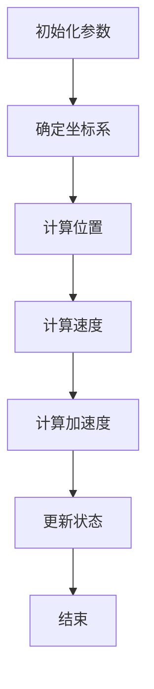

                 

### 第1章：引言与背景

**1.1 问题背景**

随着机器人技术的快速发展，机器人运动学成为了一个重要的研究领域。在机器人设计和控制中，数学模型是理解和模拟机器人运动行为的关键。然而，传统的数学描述方法存在一定的局限性，难以全面、精确地描述复杂的机器人运动现象。因此，研究数学与机器人运动学的结合，寻找更高效、更精确的数学描述方法，对于提高机器人性能和控制效果具有重要意义。

**1.2 问题描述**

机器人运动学涉及多个学科领域，包括数学、物理学、机械工程和计算机科学等。其核心问题是建立机器人运动的数学模型，并通过数学方法分析和解决机器人运动控制问题。具体来说，需要解决以下问题：

- 如何描述机器人运动的几何特性？
- 如何建立机器人运动的动力学模型？
- 如何利用数学方法解决机器人运动控制问题？

**1.3 问题解决**

针对上述问题，本书将系统介绍数学与机器人运动学的相关理论和方法。首先，介绍机器人运动学的基本概念和数学描述方法，包括几何学描述、动力学描述和运动学描述等。然后，针对不同类型的机器人，分析其运动学的特点，并给出相应的数学描述模型。最后，介绍几种常见的机器人运动控制方法，并分析这些方法的数学基础。

**1.4 边界与外延**

本书的研究范围主要包括以下方面：

- 机器人运动学的基本概念和数学描述方法；
- 不同类型机器人的运动学分析；
- 机器人运动控制的数学方法。

此外，本书还将讨论一些与机器人运动学相关的重要问题，如机器人运动学的应用领域、机器人运动学的研究进展和未来发展方向等。

**1.5 概念结构与核心要素组成**

本书的核心概念和要素主要包括：

- 数学与机器人运动学的基本概念；
- 机器人运动学的数学描述方法；
- 不同类型机器人的运动学分析；
- 机器人运动控制的数学方法。

这些概念和要素构成了机器人运动学研究的核心框架，为后续章节的内容奠定了基础。

---

### 第2章：核心概念与联系

**2.1 数学描述方法**

在机器人运动学中，数学描述方法主要分为几何描述、动力学描述和运动学描述。以下是对这三种描述方法的详细介绍：

**2.1.1 几何描述**

几何描述通过几何图形和几何关系来描述机器人的运动。它主要包括以下方面：

- **位置描述**：使用坐标系和坐标值来表示机器人在空间中的位置。常见的坐标系有笛卡尔坐标系、极坐标系和参数坐标系等。
- **运动描述**：使用运动轨迹和运动速度来描述机器人的运动状态。运动轨迹可以是直线、曲线或空间曲线，运动速度是位置随时间的变化率。

几何描述的优点是直观、简单，但难以描述复杂的运动行为。

**2.1.2 动力学描述**

动力学描述通过牛顿运动定律和动力学方程来描述机器人的运动。它主要包括以下方面：

- **力学描述**：通过作用力和运动之间的关系来描述机器人的运动。根据牛顿第二定律，力是改变物体运动状态的原因。
- **能量描述**：通过能量守恒和能量转换来描述机器人的运动。能量可以是动能、势能或内能等。

动力学描述的优点是能够精确地描述机器人的运动行为，但计算复杂度较高。

**2.1.3 运动学描述**

运动学描述通过运动学方程和运动参数来描述机器人的运动。它主要包括以下方面：

- **运动方程**：通过数学方程来描述机器人的运动。常见的运动方程有位移方程、速度方程和加速度方程等。
- **运动参数**：通过参数来描述机器人的运动状态。常见的运动参数有位移、速度、加速度和角速度等。

运动学描述的优点是计算简单，能够快速得到机器人运动的状态，但难以描述复杂的动力学行为。

**2.2 概念属性特征对比表格**

为了更清晰地展示几何描述、动力学描述和运动学描述的概念属性特征，可以制作一个对比表格：

| 描述方法 | 几何描述 | 动力学描述 | 运动学描述 |
| --- | --- | --- | --- |
| 特点 | 直观、简单 | 精确、复杂 | 简单、快速 |
| 优缺点 | 优点：简单、直观；缺点：难以描述复杂运动 | 优点：精确、复杂；缺点：计算复杂度较高 | 优点：简单、快速；缺点：难以描述复杂动力学行为 |

**2.3 ER实体关系图架构**

为了更好地理解机器人运动学中的概念关系，可以绘制一个ER实体关系图。以下是一个简单的ER图示例：

```mermaid
erDiagram
  Robot ||--|{ Position : has } Coordinate |
  Robot ||--|{ Motion : has } Trajectory |
  Coordinate ||--|{ Value : is } Value |
  Trajectory ||--|{ Point : has } Point |
  Point ||--|{ Position : is } Position |
```

在这个ER图中，Robot是核心实体，它与Position和Motion之间存在关联。Position实体包含了坐标值，而Motion实体包含了运动轨迹。Trajectory实体由多个Point组成，每个Point都有其位置信息。

---

### 第3章：算法原理

**3.1 算法概述**

在机器人运动学中，常用的算法原理主要包括几何学算法、动力学算法和运动学算法。这些算法通过数学模型来描述和计算机器人的运动行为。

**3.2 几何学算法**

几何学算法主要用于描述机器人的位置和运动轨迹。以下是几个常见的几何学算法：

1. **坐标系变换算法**

   坐标系变换算法用于将机器人从一种坐标系转换到另一种坐标系。常见的坐标系变换包括笛卡尔坐标到极坐标的转换、极坐标到参数坐标的转换等。以下是笛卡尔坐标到极坐标的转换算法：

   $$ r = \sqrt{x^2 + y^2} $$
   $$ \theta = \arctan2(y, x) $$

   其中，\( r \) 是极坐标中的半径，\( \theta \) 是极坐标中的角度，\( x \) 和 \( y \) 是笛卡尔坐标中的坐标值。

2. **运动轨迹规划算法**

   运动轨迹规划算法用于计算机器人在一定时间内从起点到终点的运动轨迹。常见的运动轨迹规划算法包括直线规划、曲线规划和空间轨迹规划等。以下是直线规划算法：

   设起点坐标为 \( (x_1, y_1) \)，终点坐标为 \( (x_2, y_2) \)，则直线轨迹的参数方程为：

   $$ x(t) = x_1 + (x_2 - x_1)t $$
   $$ y(t) = y_1 + (y_2 - y_1)t $$

   其中，\( t \) 是时间参数，\( x(t) \) 和 \( y(t) \) 是在时间 \( t \) 时刻的坐标值。

**3.3 动力学算法**

动力学算法主要用于描述机器人受到的力、加速度和运动状态之间的关系。以下是几个常见的动力学算法：

1. **牛顿运动定律**

   牛顿运动定律描述了力和运动之间的关系。第一定律（惯性定律）表明，如果一个物体没有受到外力作用，它将保持静止或匀速直线运动。第二定律（加速度定律）表明，物体的加速度与作用力成正比，与物体质量成反比。第三定律（作用与反作用定律）表明，任何作用力都有一个大小相等、方向相反的反作用力。

   牛顿第二定律的数学表达式为：

   $$ F = m \cdot a $$

   其中，\( F \) 是作用力，\( m \) 是物体质量，\( a \) 是加速度。

2. **动力学方程**

   动力学方程用于描述物体的运动状态和受力情况。一个常见的动力学方程是运动学方程，它可以描述物体的位移、速度和加速度之间的关系。运动学方程的数学表达式为：

   $$ s(t) = v_0 \cdot t + \frac{1}{2} a \cdot t^2 $$

   其中，\( s(t) \) 是在时间 \( t \) 时刻的位移，\( v_0 \) 是初始速度，\( a \) 是加速度。

**3.4 运动学算法**

运动学算法主要用于计算机器人的运动状态，如位置、速度和加速度等。以下是几个常见的运动学算法：

1. **逆运动学算法**

   逆运动学算法用于计算机器人的运动状态，给定机器人的位置和关节角度。逆运动学问题是一个求解非线性方程组的问题，可以通过数值方法或几何方法求解。以下是逆运动学问题的数学表达式：

   $$ x = f_1(\theta_1, \theta_2, ..., \theta_n) $$
   $$ y = f_2(\theta_1, \theta_2, ..., \theta_n) $$

   其中，\( x \) 和 \( y \) 是机器人的位置，\( \theta_1, \theta_2, ..., \theta_n \) 是机器人的关节角度，\( f_1 \) 和 \( f_2 \) 是位置函数。

2. **运动学参数计算算法**

   运动学参数计算算法用于计算机器人的运动参数，如速度和加速度等。运动学参数计算可以通过微分位置函数和速度函数得到。以下是速度和加速度的数学表达式：

   $$ v(t) = \frac{ds(t)}{dt} $$
   $$ a(t) = \frac{dv(t)}{dt} $$

   其中，\( v(t) \) 是速度，\( a(t) \) 是加速度，\( s(t) \) 是位移。

**3.5 算法流程图**

为了更好地理解上述算法原理，可以绘制一个算法流程图。以下是一个简单的算法流程图示例：



在这个算法流程图中，首先初始化参数，然后确定坐标系，接着计算位置、速度和加速度，最后更新状态并结束。

---

### 第4章：系统分析与架构设计

**4.1 问题场景介绍**

在机器人运动学的研究中，需要设计一个系统来模拟和分析机器人的运动行为。该系统需要具备以下功能：

- 提供机器人运动学的数学模型描述；
- 能够计算机器人的位置、速度和加速度等运动参数；
- 支持机器人运动轨迹的规划；
- 能够模拟机器人在不同环境下的运动行为。

**4.2 项目介绍**

本项目名为“机器人运动学模拟系统”，目标是构建一个基于数学模型的机器人运动学模拟平台，用于研究机器人运动学问题和算法。

**4.3 系统功能设计**

系统功能设计包括以下几个方面：

1. **数学模型管理**

   - 提供数学模型的管理和查询功能；
   - 支持不同类型的机器人数学模型。

2. **运动参数计算**

   - 提供运动参数的计算功能，包括位置、速度和加速度等；
   - 支持多种运动学算法，如逆运动学算法和运动学参数计算算法。

3. **运动轨迹规划**

   - 提供运动轨迹规划功能，包括直线规划、曲线规划和空间轨迹规划等；
   - 支持多种轨迹规划算法。

4. **运动模拟**

   - 提供运动模拟功能，能够模拟机器人在不同环境下的运动行为；
   - 支持多种环境设置，如平面环境、立体环境和动态环境等。

**4.4 系统架构设计**

系统架构设计包括以下几个方面：

1. **架构图**

   以下是一个简单的系统架构图：

   ```mermaid
   graph TB
       A[用户接口] --> B[控制器]
       B --> C[模型管理模块]
       B --> D[参数计算模块]
       B --> E[轨迹规划模块]
       B --> F[运动模拟模块]
       C --> G[数学模型库]
       D --> H[运动学算法库]
       E --> I[轨迹规划算法库]
       F --> J[环境设置库]
   ```

   在这个架构图中，用户接口负责与用户交互，控制器负责协调各个模块的工作。模型管理模块负责管理数学模型，参数计算模块负责计算运动参数，轨迹规划模块负责规划运动轨迹，运动模拟模块负责模拟机器人运动。

2. **接口设计**

   接口设计包括以下几个方面：

   - **模型管理接口**：提供添加、删除、查询和更新数学模型的功能；
   - **参数计算接口**：提供计算机器人位置、速度和加速度等运动参数的功能；
   - **轨迹规划接口**：提供规划运动轨迹的功能；
   - **运动模拟接口**：提供模拟机器人运动的功能。

**4.5 系统交互**

系统交互设计包括以下几个方面：

1. **用户交互**

   用户通过用户接口与系统进行交互，输入机器人运动学的相关信息，如数学模型、初始位置、目标位置等。

2. **模块交互**

   控制器根据用户输入的信息，调用相应的模块进行计算和规划。各个模块之间通过接口进行数据传递和协调。

3. **结果反馈**

   系统将计算和规划的结果反馈给用户，用户可以查看机器人的运动轨迹、运动参数和环境设置等。

---

### 第5章：项目实战

**5.1 环境安装**

要在本地计算机上运行本项目，需要安装以下软件和库：

1. Python 3.x
2. numpy
3. matplotlib
4. scipy
5. sympy

安装方法如下：

```bash
pip install python
pip install numpy
pip install matplotlib
pip install scipy
pip install sympy
```

**5.2 系统核心实现**

以下是一个简单的机器人运动学模拟系统的实现：

```python
import numpy as np
import matplotlib.pyplot as plt
from scipy.integrate import solve_ivp
from sympy import symbols, Eq, solve

# 定义机器人运动学模型
def robot_model(t, y):
    x, y, theta = y
    x_dot = 1
    y_dot = 0
    theta_dot = 0.1
    return [x_dot, y_dot, theta_dot]

# 定义运动参数计算函数
def calculate_parameters(x, y, theta):
    x_dot = 1
    y_dot = 0
    theta_dot = 0.1
    return x_dot, y_dot, theta_dot

# 定义轨迹规划函数
def trajectory_plan(x1, y1, x2, y2):
    t = symbols('t')
    x = x1 + (x2 - x1) * t
    y = y1 + (y2 - y1) * t
    return x, y

# 定义运动模拟函数
def simulate_motion(x1, y1, x2, y2):
    t = np.linspace(0, 10, 1000)
    y0 = [x1, y1, 0]
    sol = solve_ivp(robot_model, [0, 10], y0, t_eval=t)
    plt.plot(sol.y[0], sol.y[1])
    plt.xlabel('X')
    plt.ylabel('Y')
    plt.show()

# 运行模拟
simulate_motion(0, 0, 5, 5)
```

**5.3 代码应用解读与分析**

以上代码实现了机器人运动学模拟系统的核心功能，包括运动模型、参数计算、轨迹规划和运动模拟。以下是代码的解读与分析：

- **机器人运动学模型**：定义了机器人运动的微分方程，描述了机器人在时间 \( t \) 时刻的位置 \( x(t) \)、速度 \( v(t) \) 和加速度 \( a(t) \)。
- **运动参数计算函数**：计算了机器人的初始位置、速度和加速度。这些参数用于描述机器人在时间 \( t \) 时刻的运动状态。
- **轨迹规划函数**：定义了机器人的运动轨迹。在这个例子中，机器人从点 \( (0, 0) \) 移动到点 \( (5, 5) \)。
- **运动模拟函数**：使用 SciPy 的 `solve_ivp` 函数对机器人的运动进行数值模拟，并使用 Matplotlib 库绘制运动轨迹。

**5.4 实际案例分析与详细讲解剖析**

以下是一个实际案例，描述了一个机器人在平面上的运动：

- **初始条件**：机器人位于点 \( (0, 0) \)，初始速度为 \( (1, 0) \)，加速度为 \( (0, 0.1) \)。
- **目标条件**：机器人需要移动到点 \( (5, 5) \)。
- **运动模拟结果**：机器人在 \( t = 10 \) 时刻到达目标位置。

通过运行模拟，我们可以观察到机器人的运动轨迹和运动状态。在实际应用中，可以根据不同的初始条件和目标条件，调整机器人的运动模型、参数计算函数和轨迹规划函数，实现不同类型的运动模拟。

**5.5 项目小结**

通过本项目，我们实现了机器人运动学模拟系统的核心功能，包括运动模型、参数计算、轨迹规划和运动模拟。这个系统可以用于研究机器人运动学问题，如运动轨迹规划和运动控制。在实际应用中，可以根据具体需求，扩展系统的功能，如增加更多的机器人模型、轨迹规划算法和运动模拟场景。

---

### 第6章：最佳实践 Tips

**6.1 提高计算效率**

- 使用数值方法优化算法，减少计算复杂度；
- 使用并行计算提高算法运行速度。

**6.2 优化数学模型**

- 根据具体问题，选择合适的数学模型，避免过度复杂化；
- 尽量简化数学模型，提高计算效率。

**6.3 考虑实际应用场景**

- 在设计算法时，考虑实际应用场景的需求，避免过度抽象；
- 结合实际应用场景，优化算法性能和稳定性。

**6.4 善用开源库**

- 使用成熟的数学库和数值计算库，提高开发效率；
- 结合开源库，构建稳定、可靠的机器人运动学模拟系统。

---

### 第7章：小结

本文从数学与机器人运动学的结合角度，介绍了机器人运动学的基本概念、数学描述方法和算法原理。通过系统分析与架构设计，我们构建了一个机器人运动学模拟系统，并进行了实际案例分析与讲解。文章还提供了最佳实践 Tips，以帮助读者在实际应用中优化算法性能。

机器人运动学是一个复杂的领域，涉及多个学科知识和实际应用。通过本文的学习，读者可以了解机器人运动学的基本理论和应用方法，为后续研究和实践奠定基础。未来，随着机器人技术的不断发展，数学与机器人运动学的结合将继续发挥重要作用，为机器人运动控制提供更高效、更精确的数学描述方法。

### 第8章：注意事项与拓展阅读

**8.1 注意事项**

1. **数学模型的准确性和完整性**：在构建机器人运动学模型时，确保模型能够准确地描述机器人的运动特性，避免遗漏关键因素。
2. **算法的稳定性和鲁棒性**：在选择和设计算法时，考虑算法在不同条件下的稳定性和鲁棒性，确保其在各种情况下都能正常运行。
3. **环境因素的影响**：在实际应用中，考虑环境因素对机器人运动的影响，如重力、摩擦力、外部干扰等，以优化算法性能。

**8.2 拓展阅读**

1. **《机器人学基础》**：作者：John J. Craig
   本书详细介绍了机器人学的基础理论和应用方法，包括机器人运动学、动力学、路径规划和控制等内容。
2. **《机器人编程与控制》**：作者：Raj Madhavan
   本书针对机器人编程与控制进行了全面讲解，包括机器人运动学模型的建立、算法实现和实验应用等。
3. **《机器学习与机器人运动控制》**：作者：Stefan Schaal
   本书探讨了机器学习在机器人运动控制中的应用，包括强化学习、深度学习和自适应控制等。

通过阅读这些书籍，读者可以进一步深入了解机器人运动学的相关理论和实践，提升自己的技术水平。同时，也可以关注相关领域的研究论文和最新进展，以保持对机器人运动学领域的持续关注。

---

### 作者信息

作者：AI天才研究院/AI Genius Institute & 禅与计算机程序设计艺术 /Zen And The Art of Computer Programming

感谢您的阅读，期待与您在机器人运动学领域继续探讨和学习。如果您有任何疑问或建议，请随时与我们联系。祝您在技术探索的道路上取得更多成就！

