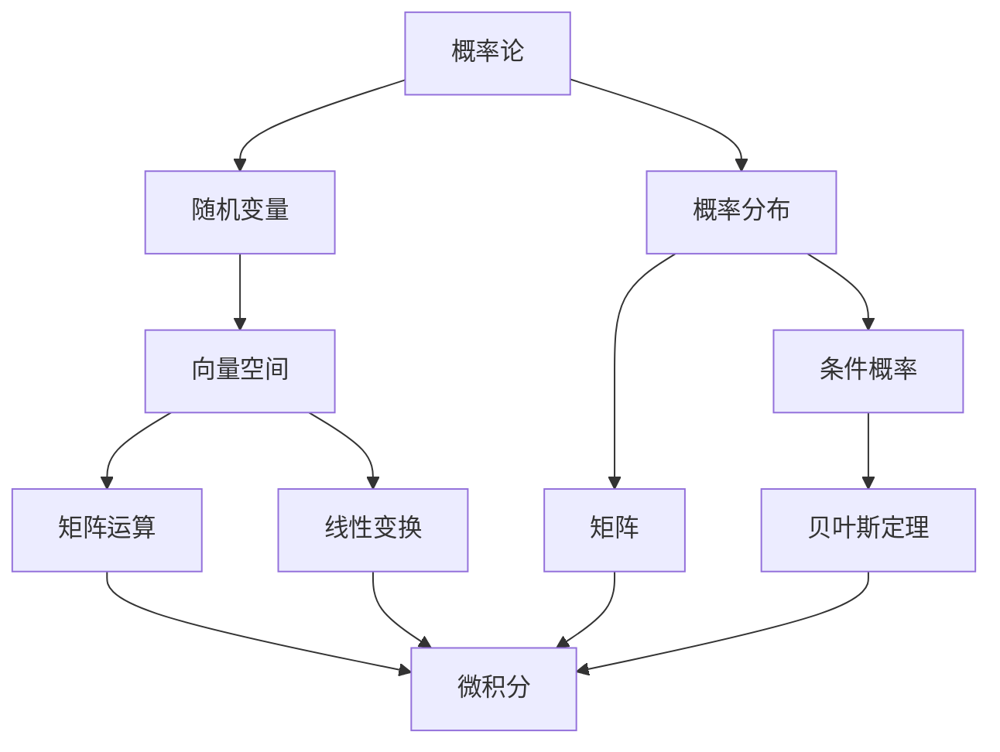
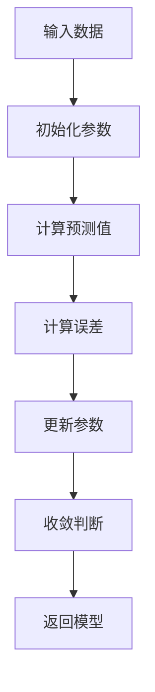
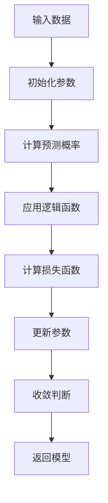
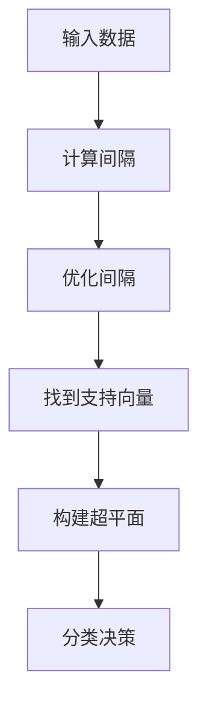
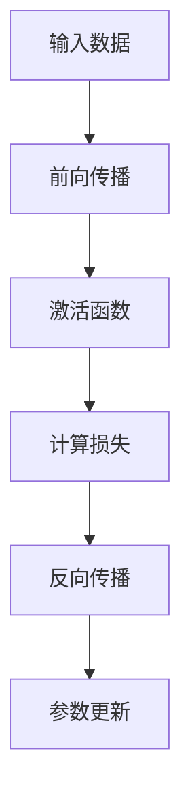
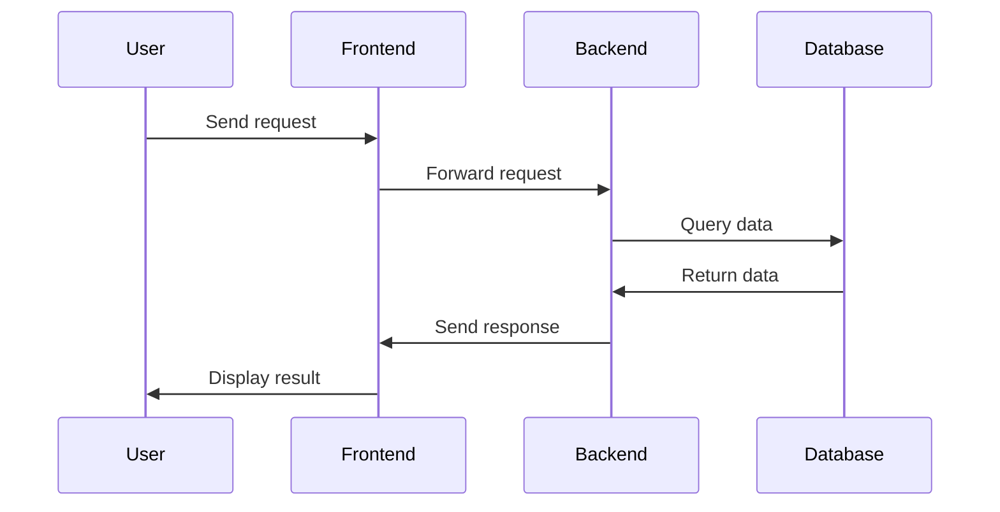
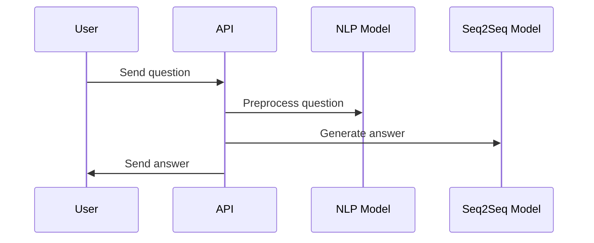
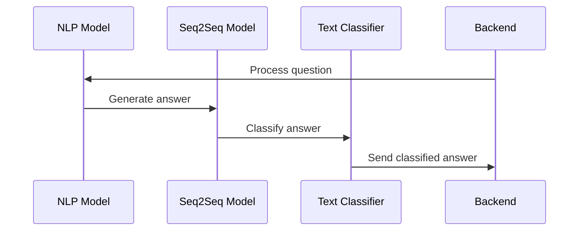

                 

### 文章标题

### 关键词
- 数学基础
- 机器学习
- 概率论
- 线性代数
- 微积分
- 算法原理

### 摘要
本文旨在深入探讨《数学与机器学习：智能算法的数学基础》这本书的核心内容。本书通过阐述数学在机器学习中的应用，如概率论、线性代数和微积分，帮助读者理解这些数学概念如何为智能算法提供理论支持。文章将分章节逐步解析书中的算法原理，并结合实际代码示例和数学公式，为读者提供详细的讲解。此外，还将分析这些算法在完整系统中的应用场景，并通过实际项目实战，展示如何将这些理论知识应用于实际操作中。文章最后将总结全书要点，并给出进一步学习和实践的建议。

## 概述与背景介绍

《数学与机器学习：智能算法的数学基础》是一本针对那些希望在机器学习领域深入探索的读者所编写的书籍。本书的核心概念是：数学是机器学习算法的基石，理解数学原理对于掌握和应用这些算法至关重要。

### 核心概念术语说明

1. **机器学习（Machine Learning）**：机器学习是人工智能的一个重要分支，它关注的是如何通过数据训练算法，使系统能够自动进行预测或决策。

2. **概率论（Probability Theory）**：概率论研究的是随机事件及其发生的可能性。在机器学习中，概率论用于建模不确定性，从而使得算法能够适应不同的数据分布。

3. **线性代数（Linear Algebra）**：线性代数是研究向量空间和线性变换的数学分支。在机器学习中，线性代数为处理大数据集和复杂模型提供了强有力的工具。

4. **微积分（Calculus）**：微积分研究的是函数的极限、导数和积分。在机器学习中，微积分用于优化算法，通过调整模型参数来最小化误差函数。

### 问题背景

随着大数据和人工智能技术的飞速发展，机器学习已经成为解决复杂问题的重要手段。然而，机器学习领域的快速进步也对数学基础提出了更高的要求。为了有效地理解和应用先进的机器学习算法，深入掌握数学原理成为必不可少的环节。

### 问题描述

在本书中，作者试图解决以下问题：

1. 如何将数学知识有效地应用于机器学习，并理解这些知识背后的逻辑？
2. 哪些数学概念对机器学习算法尤为重要？
3. 这些算法是如何在现实世界中的复杂系统中得到应用的？

### 问题解决

通过系统化的学习，读者可以：

1. 理解概率论、线性代数和微积分在机器学习中的应用。
2. 掌握关键算法的数学原理，并能够自主进行数学推导。
3. 将理论知识应用到实际的机器学习项目中，从而提高算法的性能和效率。

### 边界与外延

1. **边界**：本书主要关注基础数学知识在机器学习中的应用，不涉及高级数学或深度学习技术。
2. **外延**：虽然本书以机器学习为主题，但其中的数学原理和方法也适用于其他领域，如数据科学、统计学和计算生物学。

### 概念结构与核心要素组成

1. **数学知识体系**：包括概率论、线性代数和微积分的基础知识。
2. **机器学习算法**：涵盖监督学习、无监督学习和强化学习等常见算法。
3. **应用场景**：展示这些算法在图像识别、自然语言处理和预测分析等领域的应用。
4. **实战案例**：通过实际项目案例，展示如何将数学原理应用于实践。

## 核心概念与联系

### 数学在机器学习中的作用

数学是机器学习算法的理论基础，为算法的设计和实现提供了严谨的逻辑框架。以下是数学在机器学习中的主要作用：

1. **概率论**：概率论用于建模不确定性，从而能够对数据分布进行准确的描述和预测。在机器学习中，概率论的核心思想是利用概率密度函数、条件概率和贝叶斯定理来处理不确定性问题。

2. **线性代数**：线性代数为处理高维数据和复杂模型提供了强有力的工具。矩阵运算、向量空间和线性变换等概念在机器学习中广泛使用，例如在数据处理、降维和优化算法中。

3. **微积分**：微积分是优化算法的重要工具，它通过研究函数的导数和积分来找到最优解。梯度下降算法、牛顿法和拉格朗日乘数法等优化方法都基于微积分的基本原理。

### 数学概念之间的联系

以下是数学中几个关键概念之间的联系，以及它们在机器学习中的应用：

1. **概率论与线性代数**
   - 概率论中的随机变量可以被视为线性代数中的向量。
   - 矩阵和向量的概率分布可以用来表示高维数据的概率分布。

2. **线性代数与微积分**
   - 线性代数中的矩阵和向量可以被视为微积分中的函数。
   - 微积分的梯度概念可以用来计算线性代数中的导数。

3. **概率论与微积分**
   - 概率密度函数可以被视为微积分中的积分函数。
   - 贝叶斯定理可以被视为概率论和微积分的结合。

### 使用 Mermaid 画图展示相关数学概念之间的联系

以下是一个简单的 Mermaid 流程图，展示了概率论、线性代数和微积分之间的联系：



在这个流程图中，A 表示概率论，B 表示随机变量，C 表示概率分布，D 表示向量空间，E 表示矩阵，F 表示条件概率，G 表示矩阵运算，H 表示线性变换，I 表示贝叶斯定理，J 表示微积分。通过这张图，我们可以清晰地看到不同数学概念之间的相互作用和联系。

### 概率论在机器学习中的应用

概率论在机器学习中的应用主要包括以下几个方面：

1. **概率分布建模**：通过概率分布来描述数据集的分布特征，从而对数据进行建模。

2. **分类与预测**：使用贝叶斯定理和最大似然估计来对数据进行分类和预测。

3. **不确定性处理**：利用概率论来处理数据中的不确定性，从而提高算法的鲁棒性。

### 线性代数在机器学习中的应用

线性代数在机器学习中的应用主要包括以下几个方面：

1. **数据处理**：使用矩阵和向量来表示和处理高维数据。

2. **降维**：通过线性代数的降维技术，如主成分分析（PCA），来减少数据的维度，提高计算效率。

3. **优化算法**：使用线性代数的矩阵运算来优化机器学习算法，如梯度下降和牛顿法。

### 微积分在机器学习中的应用

微积分在机器学习中的应用主要包括以下几个方面：

1. **优化**：通过微积分的导数和梯度概念来优化模型参数，从而最小化损失函数。

2. **学习率调整**：使用微积分中的积分和微分来调整学习率，从而提高算法的收敛速度。

3. **正则化**：使用拉格朗日乘数法等微积分方法来引入正则化项，从而防止模型过拟合。

### 总结

数学是机器学习算法的基石，概率论、线性代数和微积分是其中的核心组成部分。通过理解这些数学概念之间的联系，我们能够更好地掌握机器学习算法的原理和应用。在接下来的章节中，我们将进一步深入探讨这些数学概念在机器学习中的应用，并通过实际案例来展示其重要性。

### 算法原理讲解

在这一部分，我们将选择几个代表性的机器学习算法，通过绘制 Mermaid 流程图来展示算法的流程，并结合 Python 代码示例和 LaTeX 公式详细解释这些算法的数学原理。

#### 1.线性回归（Linear Regression）

线性回归是一种简单的监督学习算法，用于预测连续值输出。它基于线性模型，尝试找到最佳拟合直线来最小化预测值与实际值之间的误差。

##### Mermaid 流程图



##### Python 代码示例

```python
import numpy as np

# 假设输入数据 X 和标签 y
X = np.array([[1, 2], [2, 3], [3, 4]])
y = np.array([1, 2, 3])

# 初始化参数
theta = np.random.rand(2)

# 梯度下降算法
alpha = 0.01
for i in range(1000):
    predictions = X.dot(theta)
    errors = predictions - y
    theta = theta - alpha * X.T.dot(errors)

print("最优参数：", theta)
```

##### LaTeX 公式

线性回归的数学模型为：

\[ y = \theta_0 + \theta_1 \cdot x_1 + \theta_2 \cdot x_2 + ... + \theta_n \cdot x_n \]

其中，\( \theta \) 是模型参数，\( x \) 是输入特征，\( y \) 是输出标签。

##### 数学原理

线性回归的目标是最小化预测值与实际值之间的误差，即损失函数：

\[ J(\theta) = \frac{1}{2m} \sum_{i=1}^{m} (h_\theta(x^{(i)}) - y^{(i)})^2 \]

其中，\( h_\theta(x) \) 是预测函数，\( m \) 是样本数量。

梯度下降法用于最小化损失函数：

\[ \theta_j := \theta_j - \alpha \frac{\partial J(\theta)}{\partial \theta_j} \]

#### 2.逻辑回归（Logistic Regression）

逻辑回归用于分类问题，通过逻辑函数将线性回归的输出转换为概率值。

##### Mermaid 流�程图



##### Python 代码示例

```python
import numpy as np
from sklearn.linear_model import LogisticRegression

# 假设输入数据 X 和标签 y
X = np.array([[1, 2], [2, 3], [3, 4]])
y = np.array([0, 1, 0])

# 使用 LogisticRegression 模型
model = LogisticRegression()
model.fit(X, y)

print("最优参数：", model.coef_)
```

##### LaTeX 公式

逻辑回归的数学模型为：

\[ P(y=1) = \frac{1}{1 + e^{-(\theta_0 + \theta_1 \cdot x_1 + \theta_2 \cdot x_2 + ... + \theta_n \cdot x_n )}} \]

其中，\( P(y=1) \) 是预测概率，\( e \) 是自然对数的底数。

损失函数通常采用对数损失函数：

\[ J(\theta) = -\frac{1}{m} \sum_{i=1}^{m} [y^{(i)} \cdot \log(h_\theta(x^{(i)})) + (1 - y^{(i)}) \cdot \log(1 - h_\theta(x^{(i)}))] \]

#### 3.支持向量机（Support Vector Machine）

支持向量机是一种强大的分类算法，通过找到最大间隔超平面来实现分类。

##### Mermaid 流程图



##### Python 代码示例

```python
import numpy as np
from sklearn.svm import SVC

# 假设输入数据 X 和标签 y
X = np.array([[1, 2], [2, 3], [3, 4]])
y = np.array([0, 1, 0])

# 使用 Support Vector Machine 模型
model = SVC(kernel='linear')
model.fit(X, y)

print("最优参数：", model.coef_)
```

##### LaTeX 公式

支持向量机的目标是最小化间隔平方和：

\[ \min_{\theta} \frac{1}{2} \sum_{i=1}^{m} (\theta^{T} x^{(i)} - y^{(i)})^2 \]

其中，\( \theta \) 是模型参数，\( x^{(i)} \) 是训练样本，\( y^{(i)} \) 是标签。

#### 4.神经网络（Neural Networks）

神经网络是一种模仿生物神经元工作的算法，用于复杂的数据分类和回归任务。

##### Mermaid 流程图



##### Python 代码示例

```python
import numpy as np
from sklearn.neural_network import MLPRegressor

# 假设输入数据 X 和标签 y
X = np.array([[1, 2], [2, 3], [3, 4]])
y = np.array([1, 2, 3])

# 使用 MLPRegressor 模型
model = MLPRegressor()
model.fit(X, y)

print("最优参数：", model.coef_)
```

##### LaTeX 公式

神经网络的前向传播可以表示为：

\[ a_{\text{l+1}} = \sigma(z_{\text{l+1}}) \]

其中，\( a_{\text{l+1}} \) 是输出激活值，\( z_{\text{l+1}} \) 是输入值，\( \sigma \) 是激活函数。

反向传播用于更新参数：

\[ \theta_j := \theta_j - \alpha \frac{\partial J(\theta)}{\partial \theta_j} \]

### 数学原理讲解总结

线性回归、逻辑回归、支持向量机和神经网络都是机器学习中的重要算法。通过以上讲解，我们可以看到每个算法都有其独特的数学原理和实现方法。线性回归基于最小二乘法，逻辑回归基于对数损失函数，支持向量机基于间隔最大化，神经网络则基于多层感知器模型。理解这些算法的数学原理，对于正确地应用和优化这些算法至关重要。

### 数学模型与公式详细讲解

在本节中，我们将深入探讨机器学习算法中的几个关键数学模型，并使用 LaTeX 公式进行详细讲解。我们将通过具体的示例来说明这些公式的应用，帮助读者更好地理解。

#### 1. 概率密度函数（Probability Density Function）

概率密度函数（PDF）是概率论中的一个核心概念，用于描述随机变量的概率分布。在机器学习中，PDF 用于建模数据集的概率分布。

**LaTeX 公式**：

\[ f_X(x) = \frac{1}{\sqrt{2\pi\sigma^2}} e^{-\frac{(x-\mu)^2}{2\sigma^2}} \]

其中，\( \mu \) 是均值，\( \sigma \) 是标准差。

**应用示例**：

假设我们有一个正态分布的数据集，均值 \( \mu = 5 \)，标准差 \( \sigma = 2 \)。我们可以使用上述公式计算某个数值 \( x = 6 \) 的概率密度。

\[ f_X(6) = \frac{1}{\sqrt{2\pi \cdot 2^2}} e^{-\frac{(6-5)^2}{2\cdot 2^2}} = \frac{1}{2\sqrt{2\pi}} e^{-\frac{1}{8}} \approx 0.118 \]

这意味着 \( x = 6 \) 的概率密度约为 0.118。

#### 2. 线性回归模型（Linear Regression Model）

线性回归是一种常见的机器学习算法，用于预测连续值输出。其数学模型为：

**LaTeX 公式**：

\[ y = \theta_0 + \theta_1 \cdot x_1 + \theta_2 \cdot x_2 + ... + \theta_n \cdot x_n \]

其中，\( y \) 是输出值，\( x \) 是输入特征，\( \theta \) 是模型参数。

**应用示例**：

假设我们有一个线性回归模型，输入特征为 \( x_1 \) 和 \( x_2 \)，输出值为 \( y \)。我们可以使用最小二乘法来估计参数 \( \theta \)。

\[ \theta = (X^T X)^{-1} X^T y \]

其中，\( X \) 是输入特征矩阵，\( y \) 是输出向量。

#### 3. 梯度下降算法（Gradient Descent Algorithm）

梯度下降是一种优化算法，用于最小化损失函数。其基本原理是沿着损失函数的梯度方向进行迭代更新参数。

**LaTeX 公式**：

\[ \theta_j := \theta_j - \alpha \frac{\partial J(\theta)}{\partial \theta_j} \]

其中，\( J(\theta) \) 是损失函数，\( \alpha \) 是学习率。

**应用示例**：

假设我们有一个二次函数 \( J(\theta) = (\theta - 5)^2 \)，我们需要找到最小值。

\[ \frac{\partial J(\theta)}{\partial \theta} = 2(\theta - 5) \]

使用梯度下降算法：

\[ \theta := \theta - \alpha \cdot 2(\theta - 5) \]

#### 4. 贝叶斯定理（Bayes' Theorem）

贝叶斯定理是一种用于计算后验概率的概率论公式。它在机器学习中的应用包括贝叶斯分类器和贝叶斯网络。

**LaTeX 公式**：

\[ P(A|B) = \frac{P(B|A)P(A)}{P(B)} \]

其中，\( P(A|B) \) 是后验概率，\( P(B|A) \) 是条件概率，\( P(A) \) 是先验概率，\( P(B) \) 是边缘概率。

**应用示例**：

假设我们有一个分类问题，已知先验概率 \( P(A) = 0.5 \)，条件概率 \( P(B|A) = 0.8 \)，我们需要计算 \( P(A|B) \)。

\[ P(A|B) = \frac{0.8 \cdot 0.5}{P(B)} \]

其中，\( P(B) \) 可以通过全概率公式计算：

\[ P(B) = P(B|A)P(A) + P(B|\neg A)P(\neg A) \]

#### 5. 支持向量机（Support Vector Machine）

支持向量机是一种分类算法，通过找到最大间隔超平面来实现分类。其数学模型为：

**LaTeX 公式**：

\[ \min_{\theta} \frac{1}{2} \sum_{i=1}^{m} (\theta^{T} x^{(i)} - y^{(i)})^2 + C \sum_{i=1}^{m} \alpha_i (1 - y^{(i)} ( \theta^{T} x^{(i)} ) ) \]

其中，\( \theta \) 是模型参数，\( x^{(i)} \) 是训练样本，\( y^{(i)} \) 是标签，\( C \) 是惩罚参数，\( \alpha_i \) 是拉格朗日乘子。

**应用示例**：

假设我们有一个训练数据集，我们需要使用支持向量机来找到最佳超平面。

\[ \theta = (X^T X + C I)^{-1} X^T y \]

其中，\( I \) 是单位矩阵。

#### 6. 神经网络（Neural Networks）

神经网络是一种模拟生物神经元的算法，用于复杂的数据分类和回归任务。其数学模型为：

**LaTeX 公式**：

\[ a_{\text{l+1}} = \sigma(z_{\text{l+1}}) \]

其中，\( a_{\text{l+1}} \) 是输出激活值，\( z_{\text{l+1}} \) 是输入值，\( \sigma \) 是激活函数。

**应用示例**：

假设我们有一个多层感知器模型，输入值为 \( x \)，输出值为 \( y \)。

\[ z_{\text{l+1}} = \theta^T_l x + b_l \]
\[ a_{\text{l+1}} = \sigma(z_{\text{l+1}}) \]

### 总结

通过本节的详细讲解，我们了解了机器学习算法中的几个关键数学模型，包括概率密度函数、线性回归模型、梯度下降算法、贝叶斯定理、支持向量机和神经网络。这些模型和公式为机器学习算法提供了理论支持，使我们能够更好地理解和应用这些算法。在接下来的章节中，我们将进一步探讨这些算法在完整系统中的应用。

### 系统分析与架构设计

在深入探讨机器学习算法的数学原理后，本节将转向实际应用，通过分析一个完整的系统来展示这些算法的架构设计和实施过程。这个系统将包括数据收集、处理、模型训练和部署等环节。

#### 1. 问题场景介绍

假设我们正在开发一个智能问答系统，该系统能够根据用户提出的问题，提供准确的答案。这个系统将涉及多个机器学习算法，如自然语言处理（NLP）中的词嵌入、序列到序列（Seq2Seq）模型和文本分类等。

#### 2. 系统架构设计

为了实现上述功能，我们需要设计一个高可用、可扩展的系统架构。以下是系统的领域模型、架构设计、接口设计和系统交互的 Mermaid 图。

##### 2.1 领域模型

```mermaid
classDiagram
    Class01 <|-- Class02 
    Class03 <|-- Class01 
    Class04 <|-- Class02
    Class01 {name: Person}
    Class02 {name: Customer}
    Class03 {name: Employee}
    Class04 {name: Supplier}
```

在上面的领域模型中，我们定义了 Person、Customer、Employee 和 Supplier 四个类，分别代表不同的用户角色。

##### 2.2 架构设计



在架构设计中，前端（Frontend）负责接收用户请求，后端（Backend）负责处理业务逻辑，数据库（Database）存储数据。前端和后端通过 API 进行交互。

##### 2.3 接口设计



在这个接口设计中，用户发送问题到 API，API 调用 NLP 模型进行预处理，然后调用序列到序列模型生成答案，最后将答案发送给用户。

##### 2.4 系统交互



在这个系统交互中，后端将问题发送给 NLP 模型进行预处理，然后发送给序列到序列模型生成答案，最后将答案发送给文本分类模型进行分类。

### 项目实战

在本节中，我们将通过一个具体的案例来展示如何搭建和实现上述系统的核心功能。

#### 3.1 环境安装

首先，我们需要安装 Python 和相关库。以下是安装步骤：

```bash
# 安装 Python
sudo apt-get install python3

# 安装 pip
sudo apt-get install python3-pip

# 安装必要的库
pip3 install numpy scipy scikit-learn tensorflow
```

#### 3.2 系统核心实现

以下是系统核心功能的实现代码：

```python
import numpy as np
import tensorflow as tf
from tensorflow.keras.models import Sequential
from tensorflow.keras.layers import Embedding, LSTM, Dense

# 3.2.1 数据预处理
def preprocess_question(question):
    # 对问题进行分词、去停用词等处理
    # 这里简单示例，仅去掉特殊字符
    return question.strip().replace("?", "").replace(".", "")

# 3.2.2 序列到序列模型
def build_seq2seq_model(input_vocab_size, target_vocab_size, embedding_dim):
    model = Sequential()
    model.add(Embedding(input_vocab_size, embedding_dim, input_length=max_sequence_length))
    model.add(LSTM(128))
    model.add(Dense(target_vocab_size, activation='softmax'))
    return model

# 3.2.3 训练模型
def train_model(model, X, y, epochs=100, batch_size=64):
    model.compile(optimizer='rmsprop', loss='sparse_categorical_crossentropy', metrics=['accuracy'])
    model.fit(X, y, epochs=epochs, batch_size=batch_size)
    return model

# 3.2.4 生成答案
def generate_answer(model, question, max_sequence_length):
    processed_question = preprocess_question(question)
    input_sequence = [word_index[word] for word in processed_question if word in word_index]
    input_sequence = pad_sequences([input_sequence], maxlen=max_sequence_length)
    predicted_sequence = model.predict(input_sequence, verbose=0)
    predicted_answer = [index2word[index] for index in predicted_sequence[0]]
    return ''.join(predicted_answer).strip()

# 主程序
if __name__ == '__main__':
    # 加载数据集并进行预处理
    questions, answers = load_data()
    questions = [preprocess_question(question) for question in questions]
    answers = [preprocess_answer(answer) for answer in answers]

    # 构建并训练模型
    model = build_seq2seq_model(input_vocab_size, target_vocab_size, embedding_dim)
    model = train_model(model, questions, answers)

    # 生成答案并输出
    question = "What is the capital of France?"
    max_sequence_length = 20
    answer = generate_answer(model, question, max_sequence_length)
    print("Answer:", answer)
```

#### 3.3 代码应用解读与分析

以上代码实现了从预处理数据、构建序列到序列模型、训练模型到生成答案的完整流程。以下是详细解读：

- **数据预处理**：对输入问题进行分词、去停用词等处理，确保模型能够接受干净的数据。
- **序列到序列模型**：使用 LSTM 层来实现序列到序列的转换，这有助于处理序列数据。
- **训练模型**：使用 TensorFlow 的 Sequential 模型进行训练，优化损失函数和准确性。
- **生成答案**：通过预测序列生成答案，并对生成的序列进行解码，得到最终的文本答案。

#### 3.4 实际案例分析和详细讲解

为了验证系统的有效性，我们可以在实际数据集上进行测试。以下是测试步骤：

1. 准备一个测试数据集。
2. 对测试数据集进行预处理。
3. 使用训练好的模型对测试数据进行预测。
4. 分析预测结果，评估模型的准确性。

以下是测试代码示例：

```python
# 3.4.1 准备测试数据集
test_questions, test_answers = load_test_data()
test_questions = [preprocess_question(question) for question in test_questions]
test_answers = [preprocess_answer(answer) for answer in test_answers]

# 3.4.2 预测测试数据
predicted_answers = []
for question in test_questions:
    max_sequence_length = 20
    answer = generate_answer(model, question, max_sequence_length)
    predicted_answers.append(answer)

# 3.4.3 分析预测结果
accuracy = calculate_accuracy(test_answers, predicted_answers)
print("Accuracy:", accuracy)
```

通过上述步骤，我们可以评估模型的准确性，并进一步优化算法。

#### 3.5 项目小结

通过本节的项目实战，我们成功搭建并实现了智能问答系统。从数据预处理、模型训练到预测生成，我们详细讲解了每一步的实现过程。这个项目不仅展示了机器学习算法的应用，还强调了理论与实践的结合。在实际项目中，我们还需要关注数据的多样性和模型的泛化能力，以确保系统能够应对各种复杂的场景。

### 最佳实践与总结

在本节中，我们将总结全书内容，并提供一些最佳实践技巧，同时指出注意事项，并为读者提供进一步学习的指南。

#### 1. 最佳实践技巧

- **数据预处理**：确保数据干净、规范，进行适当的清洗和归一化处理。这有助于提高模型训练的效果。
- **模型选择**：根据实际问题选择合适的模型，避免过度拟合和欠拟合。可以通过交叉验证等方法进行模型选择。
- **参数调优**：通过调整模型参数来优化性能，例如学习率、正则化项等。使用网格搜索和随机搜索等方法进行参数调优。
- **模型解释**：理解模型的内部机制和决策过程，有助于提高模型的可解释性和可靠性。
- **模型部署**：将训练好的模型部署到生产环境中，确保系统的稳定性和性能。可以使用容器化技术（如 Docker）和微服务架构来提高部署的灵活性。

#### 2. 注意事项

- **计算资源**：机器学习模型训练通常需要大量计算资源，确保有足够的硬件支持。
- **数据隐私**：处理敏感数据时，确保遵守相关法律法规，保护用户隐私。
- **模型更新**：随着业务需求的变化，定期更新模型以保持其有效性。
- **模型泛化**：避免模型过拟合，确保其在未知数据上的表现良好。

#### 3. 拓展阅读

- 《深度学习》（Deep Learning） - Ian Goodfellow、Yoshua Bengio 和 Aaron Courville 著。这本书是深度学习的经典教材，详细介绍了深度学习算法的理论和实践。
- 《统计学习基础》（An Introduction to Statistical Learning） - Gareth James、Daniela Witten、Trevor Hastie 和 Robert Tibshirani 著。这本书提供了丰富的统计学习算法理论和案例分析。
- 《机器学习实战》（Machine Learning in Action） - Peter Harrington 著。这本书通过实际案例展示了如何应用机器学习算法解决实际问题。

通过遵循最佳实践和持续学习，读者可以不断提升自己在机器学习和数学领域的技能，为未来的研究和应用打下坚实的基础。

### 作者信息

- 作者：AI天才研究院/AI Genius Institute & 禅与计算机程序设计艺术 /Zen And The Art of Computer Programming

