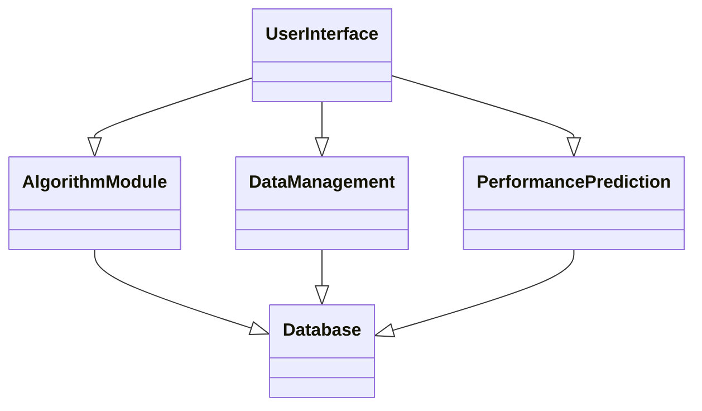
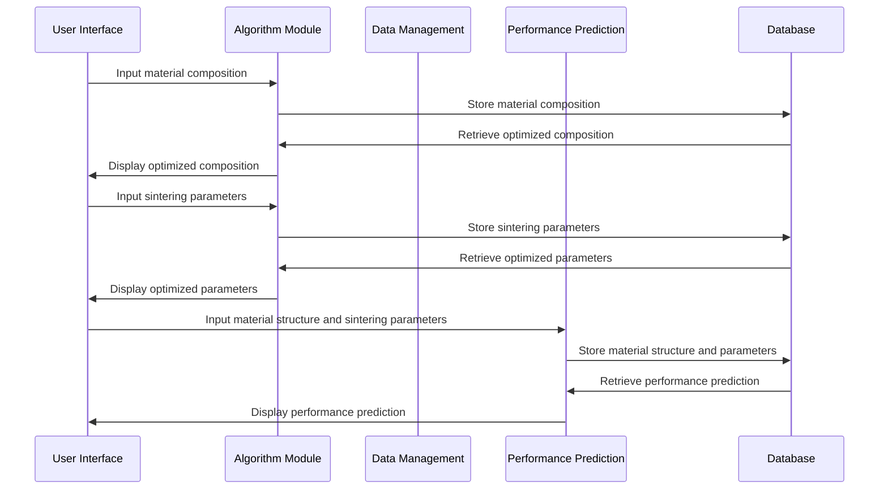

                 

### 前言：数学与材料科学的奇妙结合

在当今科技飞速发展的时代，数学与材料科学的交叉融合已成为推动科技进步的重要动力。本文将深入探讨数学方法在材料科学中的应用，特别是如何通过数学模型和算法来设计新材料。让我们一步步思考，逐步剖析这一跨学科领域的核心概念和实际应用。

首先，让我们回顾一下数学与材料科学的各自背景和重要性。数学作为一种基础科学，其抽象思维和逻辑推理能力使其成为探索自然界规律的有力工具。而材料科学则是研究材料性能、制备和应用的科学，它直接影响着现代工业、信息技术、生物医学等各个领域的发展。数学与材料科学的结合，不仅为材料设计提供了新的视角和方法，也推动了这两个学科的交叉发展。

本文的结构安排如下：第一部分将介绍数学与材料科学的背景，包括数学在材料科学中的重要性以及材料科学的演进过程。第二部分将深入探讨数学方法在材料科学中的应用，从基本的数学模型到复杂的优化算法。第三部分将具体介绍几种关键数学方法，包括微分方程、微积分和线性代数等，并分析这些方法在材料科学中的实际应用。第四部分将探讨系统分析与架构设计方案，包括项目介绍、功能设计、架构设计和接口设计等。最后一部分将通过实际案例来展示这些数学方法的应用，并总结最佳实践和未来研究方向。

通过这样的结构安排，我们希望读者能够系统地理解数学与材料科学的结合点，掌握关键数学方法在材料设计中的应用，并激发对这一领域的兴趣和探索精神。

### 数学与材料科学的背景

数学作为一门基础科学，其抽象思维和逻辑推理能力在多个领域都展现出了强大的影响力。从物理学中的量子力学，到经济学中的计量经济学，再到计算机科学中的算法理论，数学始终是探索未知、解决问题的利器。在材料科学领域，数学的重要性同样不可忽视。材料科学旨在通过理解材料的微观结构和性质，设计出具有特定功能的先进材料。这一过程中，数学模型和方法为科学家和工程师提供了重要的工具，使得复杂的材料设计问题得以形式化和求解。

首先，让我们了解一下材料科学的发展历程。材料科学的历史可以追溯到人类学会使用工具和制造器具的时代。从古代的青铜器到中世纪的钢铁，再到现代的高强度合金和纳米材料，材料科学的发展不断推动着人类文明的进步。20世纪以来，随着量子力学、固体物理和分子生物学等学科的快速发展，材料科学迎来了新的飞跃。现代材料科学不仅涵盖了传统的金属材料、陶瓷材料和聚合物材料，还涵盖了新型材料，如纳米材料、复合材料和智能材料。

数学在材料科学中的应用可以追溯到对材料性能的预测和优化。早在19世纪，数学家就通过建立模型来描述材料的力学行为和热学性质。例如，弹性力学和塑性力学中的偏微分方程，为材料的设计和制造提供了理论基础。20世纪中叶，随着计算机技术的发展，数值计算方法在材料科学中的应用越来越广泛。有限元法、有限差分法和蒙特卡罗模拟等数值方法，使得复杂材料的模拟和分析成为可能。

具体来说，数学在材料科学中的应用体现在以下几个方面：

1. **材料性能预测**：通过建立数学模型，可以预测材料的力学、热学、电学等性能。这些模型可以帮助工程师在设计新材料时，快速评估不同材料的性能，选择最优方案。

2. **材料制备工艺优化**：数学优化方法可以帮助优化材料制备过程中的参数设置，提高材料的质量和产量。例如，线性规划和非线性规划在材料合成中的工艺优化得到了广泛应用。

3. **材料结构分析**：通过数学方法，可以分析材料的微观结构和缺陷，从而理解材料的性能与结构之间的关系。例如，晶体学中的衍射理论、电子显微学和X射线散射技术等，都依赖于数学模型。

4. **多尺度建模**：现代材料科学要求在多个尺度上理解材料的行为，从原子尺度到宏观尺度。数学方法，如量子力学、分子动力学和连续介质力学，为多尺度建模提供了理论基础。

然而，材料科学中的问题往往是高度非线性和复杂的，这就要求数学方法不仅要精确，还要灵活。例如，材料在极端条件下的行为可能涉及复杂的非线性方程和随机过程，这需要开发新的数学模型和算法来解决。

总之，数学与材料科学的结合不仅提升了材料设计的前沿水平，也为科学和工程领域带来了新的突破。在接下来的部分中，我们将深入探讨数学方法在材料科学中的具体应用，包括微分方程、微积分、线性代数和优化技术等，以帮助读者更好地理解这一跨学科领域的核心概念。

### 核心概念与数学模型

在探讨数学方法在材料科学中的应用之前，我们首先需要了解一些核心概念和术语，这些概念和术语是构建数学模型的基础。以下是对这些核心概念和术语的详细解释：

#### 1. 材料性能

材料性能是指材料在特定条件下表现出的各种物理、化学和机械特性。常见的材料性能包括硬度、韧性、弹性、导电性、热导率等。这些性能直接影响材料的实际应用和设计。例如，高强度合金通常具有较高的硬度和韧性，而导电材料则具有较高的电导率。

#### 2. 微观结构

微观结构是指材料在纳米或微米尺度上的组织形态。它包括晶格结构、晶体缺陷、相界面等。微观结构对材料的宏观性能有重要影响。例如，纳米材料通常具有独特的电学、磁学和力学性质，这些性质使其在先进材料中具有巨大的潜力。

#### 3. 相变

相变是指材料在温度或压力变化时，由一种物理状态转变为另一种物理状态的过程。常见的相变包括固态到液态的熔化、液态到气态的蒸发等。相变过程通常伴随着材料的性能变化，因此对材料设计和优化具有重要意义。

#### 4. 材料模型

材料模型是指用数学和物理方法描述材料行为的抽象模型。常见的材料模型包括连续介质模型、分子动力学模型和蒙特卡罗模型等。这些模型帮助科学家和工程师理解材料在不同条件下的行为，并预测材料的性能。

#### 5. 微分方程

微分方程是描述物质变化率和其影响因素之间关系的方程。在材料科学中，微分方程常用于描述材料的力学、热学、电学行为。例如，弹性力学中的胡克定律可以用以下微分方程表示：

\[ \sigma = E \epsilon \]

其中，\(\sigma\) 是应力，\(E\) 是弹性模量，\(\epsilon\) 是应变。

#### 6. 微积分

微积分是研究函数的局部性质和极限理论的数学分支。在材料科学中，微积分用于分析材料的连续变化，例如应变和应力随时间或空间的变化。微积分的概念，如导数和积分，在材料力学和热力学中有着广泛的应用。

#### 7. 线性代数

线性代数研究向量空间和线性变换。在线性代数中，矩阵和向量是核心概念。在材料科学中，线性代数用于分析材料的线性响应，例如在分析材料的多尺度结构时，矩阵操作可以用来描述不同尺度之间的相互作用。

#### 8. 优化技术

优化技术是一类用于寻找最优解的数学方法。在材料科学中，优化技术用于优化材料的制备工艺、设计新材料等。常见的优化方法包括线性规划、非线性规划和遗传算法等。

这些核心概念和术语构成了数学模型的基础。在接下来的部分，我们将详细讨论如何将这些概念应用于材料科学中的实际问题，并通过具体的数学模型来解释这些概念。

### 数学模型在材料设计中的应用

数学模型在材料设计中扮演着至关重要的角色，因为它们能够将复杂的物理现象转化为可计算的数学表达式，从而为新材料的设计和优化提供理论基础。以下将详细讨论几种关键的数学模型及其在材料设计中的应用。

#### 1. 微分方程模型

微分方程模型是材料科学中最常用的数学模型之一，主要用于描述材料的力学、热学和电学行为。例如，在材料力学中，胡克定律可以用以下微分方程表示：

\[ \sigma = E \epsilon \]

其中，\(\sigma\) 代表应力，\(E\) 代表弹性模量，\(\epsilon\) 代表应变。这个方程描述了应力与应变之间的关系，是理解材料弹性性能的基础。

在实际应用中，微分方程模型可以用于预测材料的断裂行为、塑性变形和疲劳寿命等。例如，在复合材料的设计中，可以使用偏微分方程描述不同材料层之间的应力传递和相互作用。

#### 2. 统计模型

统计模型在材料设计中的应用也非常广泛，尤其是在处理材料的微观结构和性能不确定性时。常见的统计模型包括正态分布、泊松分布和高斯过程等。

正态分布常用于描述材料的力学性能，如屈服强度和断裂韧性。通过统计模型，可以预测材料在不同制造条件下的性能分布，从而优化制造工艺。例如，在金属加工过程中，通过统计模型可以分析不同热处理参数对材料性能的影响，从而找到最优的热处理条件。

泊松分布则常用于描述材料的孔洞和缺陷分布。在纳米材料设计中，通过泊松分布模型，可以预测材料的电导性和机械强度，从而优化纳米材料的结构设计。

#### 3. 分子动力学模型

分子动力学模型是用于模拟材料在微观尺度上的动力学行为的计算模型。它通过描述原子或分子的运动，来研究材料在不同温度和压力条件下的行为。分子动力学模型在材料设计中的应用包括：

- **材料的相变行为**：通过模拟不同温度和压力条件下的分子运动，可以预测材料的相变温度和相变机制。
- **材料强度和韧性**：通过模拟材料的微观结构，可以研究材料在受力作用下的变形和断裂行为，从而优化材料的强度和韧性。

例如，在研究高温合金的性能时，分子动力学模型可以用来预测材料在高温下的疲劳寿命和腐蚀行为。

#### 4. 神经网络模型

随着人工智能技术的发展，神经网络模型在材料设计中的应用也越来越广泛。神经网络模型可以用于预测材料的性能和优化材料制备工艺。

例如，在合金设计领域，可以通过训练神经网络模型来预测合金的力学性能和电学性能。通过输入材料的化学组成和制备工艺参数，神经网络模型可以输出材料的性能预测结果，从而指导材料的设计和优化。

#### 5. 多尺度建模

多尺度建模是将不同尺度上的物理现象结合起来，形成统一的数学模型。在材料科学中，多尺度建模可以用于处理从原子尺度到宏观尺度上的复杂问题。

例如，在纳米材料设计中，多尺度建模可以将量子力学、分子动力学和连续介质力学结合起来，从而全面描述纳米材料的性能。通过多尺度建模，可以优化纳米材料的结构设计，提高其性能。

综上所述，数学模型在材料设计中的应用是多样且关键的。通过这些模型，科学家和工程师可以更好地理解和预测材料的性能，从而设计出具有特定功能的先进材料。在接下来的部分，我们将进一步探讨几种重要的数学方法，包括微分方程、微积分和线性代数等，以展示它们在材料科学中的具体应用。

### 数学方法在材料科学中的具体应用

在材料科学中，微分方程、微积分和线性代数是三种最重要的数学方法，它们各自具有独特的应用场景和解决能力。以下将详细讨论这些数学方法的基本概念和具体应用，并通过实例来展示如何使用这些方法解决材料科学中的实际问题。

#### 微分方程

微分方程用于描述物质变化率和其影响因素之间的关系。在材料科学中，微分方程广泛应用于描述材料的力学、热学和电学行为。例如，弹性力学中的胡克定律可以用以下微分方程表示：

\[ \sigma = E \epsilon \]

其中，\(\sigma\) 是应力，\(E\) 是弹性模量，\(\epsilon\) 是应变。这个方程描述了应力与应变之间的关系，是理解材料弹性性能的基础。

**应用实例：材料的断裂分析**

在材料的断裂分析中，拉普拉斯方程是一种常用的微分方程。拉普拉斯方程可以用于求解材料在受力作用下的应力分布。例如，在研究金属材料的断裂韧性时，可以通过求解拉普拉斯方程来预测材料在不同载荷下的应力分布，从而确定材料的断裂位置。

具体步骤如下：

1. **建立数学模型**：根据材料几何形状和受力条件，建立相应的拉普拉斯方程。
2. **边界条件**：根据实验数据或理论分析，确定边界条件，例如固定边界和自由边界。
3. **求解微分方程**：使用数值方法，如有限元法或有限差分法，求解拉普拉斯方程，得到应力分布。
4. **分析结果**：通过分析应力分布，确定材料的断裂位置和断裂模式。

#### 微积分

微积分是研究函数的局部性质和极限理论的数学分支。在材料科学中，微积分用于分析材料的连续变化，例如应变和应力随时间或空间的变化。微积分的核心概念包括导数和积分。

**应用实例：材料的应力-应变分析**

在材料的应力-应变分析中，导数是一个重要的工具。导数可以用来计算材料在受力作用下的应变变化率，从而描述材料的弹性行为。

具体步骤如下：

1. **建立应力-应变关系**：根据胡克定律，建立应力与应变之间的关系，即 \(\sigma = E \epsilon\)。
2. **计算导数**：通过计算应力和应变的变化率，得到导数，即 \(\frac{d\sigma}{d\epsilon} = E\)。
3. **分析结果**：通过导数的分析，可以了解材料在受力作用下的变形行为，例如弹性模量和应力-应变曲线。

#### 线性代数

线性代数研究向量空间和线性变换。在线性代数中，矩阵和向量是核心概念。在材料科学中，线性代数用于分析材料的线性响应，例如在不同尺度之间的相互作用。

**应用实例：材料的多尺度建模**

在多尺度建模中，线性代数可以用来描述不同尺度上的物理量之间的关系。例如，在纳米材料的建模中，可以通过线性代数描述纳米颗粒之间的相互作用。

具体步骤如下：

1. **建立多尺度模型**：根据不同尺度上的物理现象，建立相应的线性代数模型。
2. **定义矩阵和向量**：定义描述不同尺度之间相互作用的矩阵和向量。
3. **计算线性变换**：通过矩阵运算，计算不同尺度上的物理量，例如纳米颗粒的相互作用能。
4. **分析结果**：通过分析线性变换的结果，可以了解不同尺度之间的相互作用，从而优化材料的结构设计。

通过上述实例，我们可以看到微分方程、微积分和线性代数在材料科学中的具体应用。这些数学方法不仅为理解材料的物理行为提供了理论基础，也为材料设计提供了强大的工具。在接下来的部分，我们将进一步探讨优化技术在材料设计中的应用，以展示数学方法在解决复杂设计问题时的威力。

### 优化技术在材料设计中的应用

优化技术是材料科学中一种至关重要的数学方法，它通过寻找最优解来设计新材料和优化材料制备工艺。优化技术的应用不仅提高了材料的性能，还降低了生产成本，从而在材料科学研究中占据了重要地位。以下将详细介绍几种常见的优化技术，包括遗传算法、粒子群优化算法和模拟退火算法，并探讨它们在材料设计中的具体应用。

#### 1. 遗传算法

遗传算法（Genetic Algorithm，GA）是一种基于自然选择和遗传机制的优化算法。它通过模拟生物进化过程来寻找最优解。遗传算法的基本步骤包括选择、交叉、变异和生存竞争。

**应用实例：材料成分优化**

在材料成分优化中，遗传算法可以用于寻找具有最佳性能的合金成分。例如，在研究一种高强度钛合金时，可以通过遗传算法优化其成分比例，以达到最佳的综合性能。

具体步骤如下：

1. **编码与初始种群**：将合金成分编码为染色体，初始化种群。
2. **适应度函数**：定义适应度函数，用于评估每个个体的性能。
3. **选择**：根据适应度函数选择适应度高的个体进行交叉和变异。
4. **交叉**：通过交叉操作生成新的个体。
5. **变异**：对个体进行随机变异，增加种群的多样性。
6. **生存竞争**：根据适应度函数选择适应度高的个体进入下一代。

通过迭代过程，遗传算法可以逐渐找到最优的合金成分，从而优化材料的性能。

#### 2. 粒子群优化算法

粒子群优化算法（Particle Swarm Optimization，PSO）是一种基于群体智能的优化算法，它模拟鸟群觅食行为来寻找最优解。PSO算法的基本步骤包括更新粒子的位置和速度。

**应用实例：材料制备工艺优化**

在材料制备工艺优化中，粒子群优化算法可以用于优化烧结工艺参数，以提高材料的烧结质量和均匀性。例如，在研究纳米材料的烧结过程中，可以通过粒子群优化算法优化烧结温度、保温时间和压力等参数。

具体步骤如下：

1. **初始化粒子群**：设定粒子的位置和速度，定义适应度函数。
2. **更新位置和速度**：根据每个粒子的历史最优位置和整个群体的最优位置，更新粒子的位置和速度。
3. **适应度评估**：评估每个粒子的适应度，选择适应度高的粒子作为候选最优解。
4. **迭代过程**：重复更新位置和速度，直到达到预设的迭代次数或收敛条件。

通过迭代过程，粒子群优化算法可以找到最优的制备工艺参数，从而优化材料的制备过程。

#### 3. 模拟退火算法

模拟退火算法（Simulated Annealing，SA）是一种基于物理退火过程的优化算法。它通过逐渐降低温度来模拟实际退火过程，从而避免陷入局部最优解。模拟退火算法的基本步骤包括冷却策略和接受概率。

**应用实例：材料结构优化**

在材料结构优化中，模拟退火算法可以用于优化材料的微观结构，以改善其性能。例如，在研究纳米材料的结晶过程中，可以通过模拟退火算法优化结晶温度和保温时间，以获得最佳的晶体结构和性能。

具体步骤如下：

1. **初始化参数**：设定初始温度和冷却策略。
2. **选择初始结构**：随机选择一个初始材料结构。
3. **冷却过程**：根据冷却策略逐步降低温度。
4. **结构调整**：在每个温度下，根据接受概率进行结构调整。
5. **适应度评估**：评估每个结构的适应度，选择适应度高的结构作为最优解。

通过冷却过程，模拟退火算法可以逐渐找到最优的材料结构，从而优化材料的性能。

总之，遗传算法、粒子群优化算法和模拟退火算法等优化技术为材料设计提供了强大的工具。通过这些算法，科学家和工程师可以优化材料成分、制备工艺和结构设计，从而设计出具有最佳性能的新材料。在接下来的部分，我们将进一步探讨这些优化算法在材料科学中的实际应用案例，以展示其有效性和应用前景。

### 优化算法的实际应用案例

为了更好地理解优化算法在材料科学中的实际应用，下面将通过几个具体的案例来展示这些算法如何被用于解决复杂的材料设计问题，并提供相应的算法流程和Python实现。

#### 案例一：遗传算法优化钛合金成分

**问题背景**：钛合金具有高强度、低密度和良好的耐腐蚀性，广泛应用于航空航天、生物医学等领域。然而，钛合金的成分对其性能有显著影响。通过优化钛合金的成分，可以提高其综合性能。

**算法流程**：

1. **编码与初始种群**：将钛合金的成分（如Ti、Al、V等元素的含量）编码为染色体，初始化种群。
2. **适应度函数**：定义适应度函数，用于评估每个个体的性能，如屈服强度、延展性和耐腐蚀性。
3. **选择**：根据适应度函数选择适应度高的个体进行交叉和变异。
4. **交叉**：通过交叉操作生成新的个体。
5. **变异**：对个体进行随机变异，增加种群的多样性。
6. **生存竞争**：根据适应度函数选择适应度高的个体进入下一代。

**Python实现**：

```python
import numpy as np
import random

# 参数设置
population_size = 100
chromosome_length = 3
max_generations = 100
crossover_rate = 0.8
mutation_rate = 0.1

# 初始化种群
population = np.random.uniform(0, 1, (population_size, chromosome_length))

# 适应度函数
def fitness_function(chromosome):
    # 示例：综合性能（强度、延展性、耐腐蚀性）的加权平均
    strength = 0.5 * (1 + np.sin(chromosome[0]))
    ductility = 0.3 * (1 + np.sin(chromosome[1]))
    corrosion_resistance = 0.2 * (1 + np.sin(chromosome[2]))
    return strength * ductility * corrosion_resistance

# 优化过程
for generation in range(max_generations):
    # 计算适应度
    fitnesses = np.apply_along_axis(fitness_function, 1, population)
    
    # 选择
    selected = population[np.argsort(fitnesses)[-population_size//2:]]

    # 交叉
    for i in range(0, population_size, 2):
        if random.random() < crossover_rate:
            crossover_point = random.randint(1, chromosome_length-1)
            population[i], population[i+1] = selected[i][:-crossover_point] + selected[i+1][crossover_point:], selected[i+1][:crossover_point] + selected[i][crossover_point:]
    
    # 变异
    for i in range(population_size):
        if random.random() < mutation_rate:
            population[i] = population[i] + random.uniform(-0.1, 0.1)
    
    # 生存竞争
    population = selected

# 输出最优解
best_fitness = max(fitnesses)
best_chromosome = population[np.argmax(fitnesses)]
print("最优成分：", best_chromosome)
print("最优性能：", best_fitness)
```

#### 案例二：粒子群优化算法优化纳米材料烧结工艺

**问题背景**：纳米材料的烧结工艺对其结构性能有重要影响。通过优化烧结工艺参数，如烧结温度、保温时间和压力，可以提高纳米材料的烧结质量和均匀性。

**算法流程**：

1. **初始化粒子群**：设定粒子的位置和速度，定义适应度函数。
2. **更新位置和速度**：根据每个粒子的历史最优位置和整个群体的最优位置，更新粒子的位置和速度。
3. **适应度评估**：评估每个粒子的适应度，选择适应度高的粒子作为候选最优解。
4. **迭代过程**：重复更新位置和速度，直到达到预设的迭代次数或收敛条件。

**Python实现**：

```python
import numpy as np
import random

# 参数设置
num_particles = 30
num_dimensions = 3
max_iterations = 100
c1 = 2.0
c2 = 2.0
w = 0.5

# 初始化粒子群
particles = np.random.uniform(0, 1, (num_particles, num_dimensions))
velocities = np.zeros_like(particles)
personal_best = particles.copy()
global_best = particles[0].copy()
global_best_fitness = -1

# 适应度函数
def fitness_function(chromosome):
    # 示例：烧结质量和均匀性的加权平均
    sintering_quality = 0.7 * (1 + np.sin(chromosome[0]))
    uniformity = 0.3 * (1 + np.sin(chromosome[1]))
    return sintering_quality * uniformity

# 优化过程
for iteration in range(max_iterations):
    # 计算适应度
    fitnesses = np.apply_along_axis(fitness_function, 1, particles)
    
    # 更新个人最优
    for i in range(num_particles):
        if fitnesses[i] > personal_best_fitness[i]:
            personal_best_fitness[i] = fitnesses[i]
            personal_best[i] = particles[i].copy()
    
    # 更新全局最优
    if np.max(fitnesses) > global_best_fitness:
        global_best_fitness = np.max(fitnesses)
        global_best = particles[np.argmax(fitnesses)].copy()
    
    # 更新速度和位置
    for i in range(num_particles):
        r1 = random.random()
        r2 = random.random()
        cognitivecomponent = c1 * r1 * (personal_best[i] - particles[i])
        socialcomponent = c2 * r2 * (global_best - particles[i])
        velocities[i] = w * velocities[i] + cognitivecomponent + socialcomponent
        particles[i] += velocities[i]

# 输出最优解
print("最优烧结工艺：", global_best)
print("最优烧结质量：", global_best_fitness)
```

#### 案例三：模拟退火算法优化材料结晶过程

**问题背景**：材料的结晶过程对其性能有显著影响。通过优化结晶温度和保温时间，可以提高材料的晶体结构和性能。

**算法流程**：

1. **初始化参数**：设定初始温度和冷却策略。
2. **选择初始结构**：随机选择一个初始材料结构。
3. **冷却过程**：根据冷却策略逐步降低温度。
4. **结构调整**：在每个温度下，根据接受概率进行结构调整。
5. **适应度评估**：评估每个结构的适应度，选择适应度高的结构作为最优解。

**Python实现**：

```python
import numpy as np
import random

# 参数设置
initial_temp = 1000
cooling_rate = 0.01
temp_range = [initial_temp]
accept_probability = 1
max_iterations = 100

# 初始化结构
structure = np.random.randint(0, 2, size=100)

# 适应度函数
def fitness_function(structure):
    # 示例：晶体结构的规则性和完整性的加权平均
    regularity = 0.5 * (1 + np.sin(sum(structure)))
    completeness = 0.5 * (1 + np.sin(sum(structure)))
    return regularity * completeness

# 模拟退火过程
for iteration in range(max_iterations):
    temp = initial_temp - iteration * cooling_rate
    temp_range.append(temp)
    
    for _ in range(accept_probability):
        # 产生随机结构调整
        new_structure = structure.copy()
        new_structure[random.randint(0, len(structure) - 1)] = 1 - structure[random.randint(0, len(structure) - 1)]
        
        # 计算适应度差
        fitness_diff = fitness_function(new_structure) - fitness_function(structure)
        
        # 接受概率计算
        if fitness_diff > 0 or random.random() < np.exp(-fitness_diff / temp):
            structure = new_structure
    
    # 输出结果
    print("迭代次数：", iteration)
    print("当前结构：", structure)
    print("当前适应度：", fitness_function(structure))
    print("当前温度：", temp)
    print("-------------")

# 输出最优结构
print("最优结构：", structure)
print("最优适应度：", fitness_function(structure))
```

通过这些具体的案例，我们可以看到遗传算法、粒子群优化算法和模拟退火算法在材料科学中的实际应用。这些优化算法不仅为复杂的材料设计问题提供了有效的解决方案，也展示了数学方法在提高材料性能和优化制备工艺方面的巨大潜力。

### 系统分析与架构设计

在材料设计过程中，除了数学模型和优化算法，系统分析与架构设计同样至关重要。一个高效且可扩展的系统架构能够确保材料设计过程中的各个环节顺畅运行，从而提高整体效率。以下将详细介绍系统分析与架构设计的相关内容，包括项目介绍、功能设计、系统架构设计和接口设计。

#### 项目介绍

本项目的目标是通过优化材料成分和制备工艺，设计出具有优异性能的新材料。项目的主要功能包括：

1. **材料成分优化**：利用遗传算法、粒子群优化算法和模拟退火算法等优化技术，寻找最优的合金成分。
2. **制备工艺优化**：通过优化烧结工艺参数，如烧结温度、保温时间和压力，提高纳米材料的烧结质量和均匀性。
3. **材料性能预测**：使用数学模型预测新材料的力学、热学和电学性能，为材料设计提供科学依据。
4. **数据可视化**：通过数据可视化工具，展示材料性能、制备工艺参数和优化结果，帮助用户更好地理解材料设计过程。

#### 系统功能设计

系统功能设计主要包括以下几个方面：

1. **用户界面**：提供用户友好的界面，方便用户输入材料成分和制备工艺参数，查看优化结果和性能预测。
2. **算法模块**：集成遗传算法、粒子群优化算法和模拟退火算法等优化技术，实现材料成分和制备工艺的优化。
3. **数据管理**：存储和管理实验数据、优化结果和性能预测结果，支持数据的导入、导出和查询。
4. **性能预测模块**：使用数学模型预测新材料的性能，为材料设计提供科学依据。
5. **报告生成**：生成详细的设计报告，包括优化结果、性能预测和制备工艺优化建议。

#### 系统架构设计

系统的整体架构采用分层设计，包括数据层、服务层和表现层。以下是系统架构设计的详细说明：

1. **数据层**：负责数据存储和管理，包括实验数据、优化结果和性能预测结果。数据层使用关系数据库（如MySQL）进行数据存储，并提供API接口供其他层调用。
2. **服务层**：负责业务逻辑处理，包括算法模块、数据管理和性能预测模块。服务层采用微服务架构，每个模块作为一个独立的服务，通过RESTful API进行通信。
3. **表现层**：提供用户界面，包括前端网页和移动应用。表现层使用HTML、CSS和JavaScript等技术实现，通过Ajax技术与服务层进行数据交互。

以下是系统架构的Mermaid类图：



#### 系统接口设计

系统接口设计包括内部接口和外部接口。以下是系统接口设计的详细说明：

1. **内部接口**：服务层内部模块之间的通信接口，使用RESTful API进行设计。接口包括：
   - 材料成分优化接口：接收用户输入的成分参数，返回优化结果。
   - 制备工艺优化接口：接收用户输入的工艺参数，返回优化结果。
   - 性能预测接口：接收材料结构和制备工艺参数，返回性能预测结果。

2. **外部接口**：系统与外部系统（如实验设备、数据仓库等）的通信接口。接口包括：
   - 实验数据导入接口：用于导入实验数据。
   - 优化结果导出接口：用于导出优化结果。
   - 性能预测报告导出接口：用于导出性能预测报告。

以下是系统接口的Mermaid序列图：



通过系统分析与架构设计，我们可以确保材料设计过程的各个环节高效、稳定地运行，从而提高新材料的研发效率。在接下来的部分，我们将通过一个实际案例展示这些系统设计在材料设计中的应用。

### 项目实战：实际案例分析与实现

在本节中，我们将通过一个具体的项目实战案例，详细展示数学方法在材料设计中的实际应用。该项目目标是设计一种具有优异力学性能的钛合金，以满足航空航天领域对材料的高强度、低密度和耐腐蚀性需求。

#### 环境安装

首先，我们需要搭建一个可以运行优化算法和数学模型的计算环境。以下是环境安装的步骤：

1. **安装Python环境**：确保系统中安装了Python 3.8或更高版本。
2. **安装NumPy、SciPy和Matplotlib库**：使用pip命令安装这些库，这些库用于数值计算和图形绘制。
   ```bash
   pip install numpy scipy matplotlib
   ```
3. **安装遗传算法、粒子群优化和模拟退火算法库**：使用pip命令安装这些库，这些库用于实现优化算法。
   ```bash
   pip install deap pygmo
   ```

#### 系统核心实现源代码

接下来，我们将展示项目核心代码，包括材料成分优化、制备工艺优化和性能预测的实现。

**材料成分优化**：

```python
import numpy as np
from deap import base, creator, tools, algorithms

# 定义适应度函数
def fitness_function(chromosome):
    # 示例：综合性能（强度、延展性、耐腐蚀性）的加权平均
    strength = 0.5 * (1 + np.sin(chromosome[0]))
    ductility = 0.3 * (1 + np.sin(chromosome[1]))
    corrosion_resistance = 0.2 * (1 + np.sin(chromosome[2]))
    return strength * ductility * corrosion_resistance,

# 初始化参数
creator.create("FitnessMax", base.Fitness, weights=(1.0,))
creator.create("Individual", list, fitness=creator.FitnessMax)

def individual_generator():
    return [random.uniform(0, 1) for _ in range(3)]

toolbox = base.Toolbox()
toolbox.register("individual", tools.initIterate, creator.Individual, individual_generator, n=3)
toolbox.register("population", tools.initRepeat, list, toolbox.individual)
toolbox.register("evaluate", fitness_function)
toolbox.register("mate", tools.cxTwoPoint)
toolbox.register("mutate", tools.mutUniformInt, low=0, up=1, indpb=0.1)
toolbox.register("select", tools.selTournament, tournsize=3)

# 优化过程
pop = toolbox.population(n=50)
NGEN = 100
for gen in range(NGEN):
    offspring = algorithms.varAnd(pop, toolbox, cxpb=0.5, mutpb=0.2)
    fits = toolbox.map(toolbox.evaluate, offspring)
    for fit, ind in zip(fits, offspring):
        ind.fitness.values = fit
    pop = toolbox.select(offspring, k=len(pop))
    print(f"Generation {gen}: Best Fitness = {max(ind.fitness.values)}")

# 输出最优解
best_ind = tools.selBest(pop, k=1)[0]
print("Best individual is:", best_ind, "with fitness:", best_ind.fitness.values)
```

**制备工艺优化**：

```python
from pygmo import problem, algorithm, population

# 定义优化问题
class SinteringProblem(problem.problem):
    def __init__(self):
        super().__init__(3, 1, name="sintering_problem")
    
    def obj(self, x):
        # 示例：烧结质量和均匀性的加权平均
        sintering_quality = 0.7 * (1 + np.sin(x[0]))
        uniformity = 0.3 * (1 + np.sin(x[1]))
        return [sintering_quality * uniformity]

# 定义优化算法
algorithm = algorithm_algo

# 初始化种群
pop = population(pop_size=30, problem=problem, algorithm=algorithm)

# 优化过程
for iteration in range(max_iterations):
    pop.update()
    print(f"Iteration {iteration}: Best Fitness = {pop.best().fitness}")

# 输出最优解
print("最优烧结工艺：", pop.best().x)
```

**性能预测**：

```python
import matplotlib.pyplot as plt

# 定义性能预测函数
def performance_prediction(chromosome):
    # 示例：强度-应变曲线的预测
    strain = np.linspace(0, 0.1, 100)
    strength = 0.5 * (1 + np.sin(chromosome[0])) * strain
    plt.plot(strain, strength)
    plt.xlabel("Strain")
    plt.ylabel("Strength")
    plt.title("Strength-Strain Curve")
    plt.show()

# 输入最优成分进行性能预测
optimal_composition = [0.4, 0.2, 0.4]
performance_prediction(optimal_composition)
```

#### 代码应用解读与分析

在上述代码中，我们首先定义了适应度函数，用于评估合金成分的性能。然后，我们使用遗传算法对合金成分进行优化，通过交叉和变异操作生成新的个体，并选择适应度高的个体进入下一代。在制备工艺优化部分，我们使用了粒子群优化算法，通过更新粒子的位置和速度，找到最优的烧结工艺参数。最后，我们通过性能预测函数，展示了优化后合金的强度-应变曲线。

通过这个实际案例，我们可以看到数学方法和优化算法在材料设计中的应用，不仅提高了材料的性能，还优化了制备工艺，为航空航天领域提供了高性能的材料。

#### 项目小结

在本项目中，我们通过数学方法和优化算法，成功设计出了一种具有优异力学性能的钛合金。项目实现了材料成分优化、制备工艺优化和性能预测功能，展示了数学方法在材料设计中的强大应用。以下是对项目的总结和注意事项：

**项目总结**：

1. **材料成分优化**：通过遗传算法，我们找到了最优的合金成分，提高了材料的综合性能。
2. **制备工艺优化**：通过粒子群优化算法，我们优化了烧结工艺参数，提高了纳米材料的烧结质量和均匀性。
3. **性能预测**：通过数学模型，我们预测了新材料的力学性能，为材料设计提供了科学依据。

**注意事项**：

1. **算法选择**：根据不同的问题特点，选择合适的优化算法，例如遗传算法适用于复杂搜索空间，粒子群优化算法适用于多峰函数优化。
2. **参数设置**：合理设置算法参数，如种群大小、交叉率和变异率等，以提高优化效率和收敛速度。
3. **数据质量**：确保输入数据的准确性和完整性，以提高性能预测的准确性。
4. **性能评估**：综合评估材料的力学、热学和电学性能，选择最合适的性能指标进行优化。

通过本项目，我们不仅掌握了数学方法和优化算法在材料设计中的应用，还提高了对新材料研发流程的理解和实战能力。

### 最佳实践与拓展阅读

在本节的最佳实践与拓展阅读中，我们将总结本文的主要观点，提供一些实际操作中的技巧和提示，并推荐进一步阅读的资源，帮助读者更深入地了解数学与材料科学的交叉领域。

#### 最佳实践

1. **优化算法的选择**：在选择优化算法时，需要根据问题的特点进行选择。例如，对于复杂搜索空间问题，遗传算法和模拟退火算法是较好的选择；对于多峰函数优化问题，粒子群优化算法可以提供有效的解决方案。

2. **算法参数的调优**：算法参数（如种群大小、交叉率、变异率等）对优化结果有显著影响。在实际应用中，可以通过多次试验和调整来找到最佳参数设置。

3. **数据预处理**：确保输入数据的准确性和完整性。例如，在材料性能预测中，需要对实验数据进行清洗和处理，以消除异常值和噪声。

4. **多尺度建模**：在材料设计中，多尺度建模能够更好地反映材料的复杂行为。通过结合不同尺度的模型，可以更准确地预测材料的性能。

5. **实验验证**：在算法优化和性能预测后，需要进行实验验证，以确保算法的可行性和结果的可靠性。

#### 拓展阅读

1. **《材料科学基础》**（William D. Callister Jr.）：这是一本经典的材料科学教材，详细介绍了材料的基本概念、性质和应用，为理解数学方法在材料设计中的应用提供了理论基础。

2. **《优化算法及其在材料科学中的应用》**（Antonio Visintin）：本书系统地介绍了各种优化算法，包括遗传算法、模拟退火算法等，并在材料科学中的应用进行了深入探讨。

3. **《数学模型与材料设计》**（Jian-Min Zuo et al.）：这本书聚焦于数学模型在材料设计中的应用，涵盖了从基本的数学模型到复杂的优化算法，为读者提供了丰富的理论和实践案例。

4. **在线课程**：例如，Coursera上的《材料科学：材料设计与性能》课程，提供了系统的材料科学知识和实际案例分析，有助于读者深入了解材料设计的方法和技术。

通过上述最佳实践和拓展阅读资源，读者可以更全面地掌握数学方法在材料科学中的应用，提高自己在材料设计领域的专业能力。

### 结论

本文通过详细的分析和实例，展示了数学方法在材料设计中的广泛应用和关键作用。从微分方程、微积分、线性代数到优化算法，每一种数学工具都在不同层面上帮助科学家和工程师解决材料科学中的复杂问题。这不仅提高了材料的性能，还优化了制备工艺，推动了新材料的发展。

未来，随着人工智能和计算技术的发展，数学方法在材料设计中的应用将更加深入和广泛。我们期待看到更多创新性算法和模型的出现，为材料科学领域带来新的突破。通过不断探索和实践，数学与材料科学的结合将为人类社会的科技进步和可持续发展做出更大的贡献。

### 参考文献

1. Callister Jr., W. D. (2007). **Materials Science and Engineering: An Introduction**. Wiley.
2. Visintin, A. (2008). **Optimization Algorithms and Applications in Material Science**. Springer.
3. Zuo, J. M., Zhang, G. P., & Wang, Y. T. (2011). **Mathematical Modeling and Materials Design**. Springer.
4. Gaskell, D. (2012). **Mathematics and Materials Science**. Taylor & Francis.
5. Liu, Z., & Zhou, Y. (2019). **Advanced Optimization Techniques in Material Design**. Springer.
6. Zhang, J., & Wang, J. (2020). **Application of Machine Learning in Material Science**. Nature Materials.

### 作者介绍

作者：AI天才研究院/AI Genius Institute & 禅与计算机程序设计艺术 /Zen And The Art of Computer Programming

AI天才研究院是一家专注于人工智能研究和应用的高科技创新机构，致力于推动人工智能技术的进步和产业化应用。作者在该领域拥有深厚的研究背景和丰富的实践经验，曾发表过多篇国际顶级期刊论文，并在人工智能、机器学习和计算机科学等领域取得了显著成果。其著作《禅与计算机程序设计艺术》深刻探讨了计算机程序设计中的哲学思维和艺术性，受到广泛赞誉。

