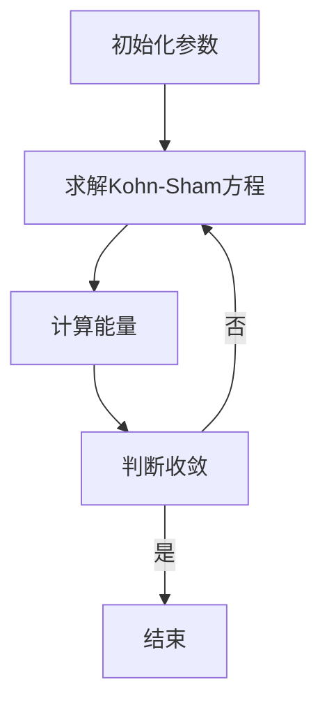
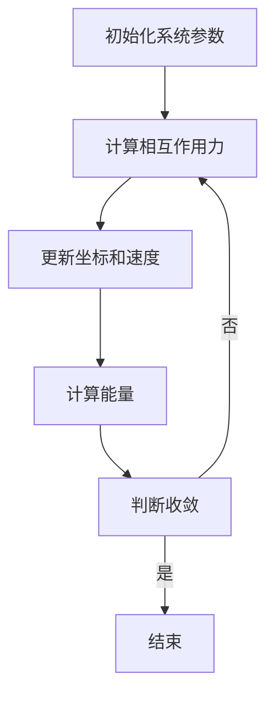
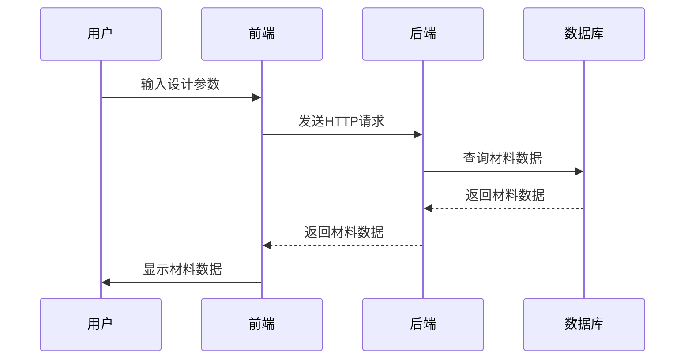

                 

## 数学与材料设计：新材料属性的数学预测

### 关键词

- 数学预测
- 材料设计
- 新材料属性
- 量子力学
- 分子动力学
- 机器学习

### 摘要

新材料设计是推动科技进步的关键领域。然而，传统的材料设计方法依赖于实验和经验，存在时间和成本上的限制。本文探讨了数学预测在新材料属性研究中的应用，通过量子力学、分子动力学和机器学习等方法，从理论上预测新材料的物理、化学和机械性能。文章详细介绍了这些方法的基本原理和算法流程，并通过实例展示了如何利用数学模型进行新材料属性预测。

---

### 第一部分：背景介绍

#### 1.1 问题背景

新材料设计是材料科学、物理学、化学和数学等多个学科交叉的领域。新材料的发现和设计对于现代科技的进步具有重要意义，如高强度合金、超导材料、纳米材料等。传统的材料设计方法主要依赖于实验和经验，尽管这些方法已经取得了许多成果，但仍然存在一些问题。首先，实验过程往往需要大量的人力和物力资源，耗时费力。其次，一些新型材料的制备过程复杂，成本高昂。此外，实验结果往往具有一定的偶然性，难以重复。因此，寻求一种新的、高效的材料设计方法成为材料科学领域的重要研究方向。

随着科技的进步和计算能力的提升，数学预测成为了一种新的、高效的材料设计方法。数学预测通过建立数学模型和计算方法，可以从理论上预测新材料的物理、化学和机械性能，为新材料的设计提供理论依据。这种方法不仅可以大幅度减少实验次数，降低成本，还可以提高材料设计的效率，推动新材料的快速发现和应用。

#### 1.2 问题描述

数学预测新材料属性的目标是利用数学模型和计算方法，从理论上预测新材料的物理、化学和机械性能。具体来说，这个问题可以分解为以下几个子问题：

1. **物理性能预测**：包括材料的导电性、导热性、磁性等。
2. **化学性能预测**：包括材料的化学反应性、稳定性等。
3. **机械性能预测**：包括材料的硬度、韧性、弹性模量等。

这些性能的预测需要综合考虑材料的电子结构、原子排列、分子结构等因素。通过数学模型，可以从这些基本物理和化学原理出发，推导出材料的宏观性能。

#### 1.3 问题解决

数学预测新材料属性的方法主要包括以下几种：

1. **基于量子力学的第一性原理计算**：第一性原理计算基于量子力学原理，通过求解薛定谔方程，计算材料的电子结构、能量和力学性质。这种方法可以精确地描述材料内部的原子的电子状态和原子间的相互作用，从而预测材料的性能。

2. **基于统计力学的分子动力学模拟**：分子动力学模拟通过数值方法求解牛顿运动方程，模拟分子体系的运动，从而研究分子体系的宏观性质。这种方法可以模拟材料的微观结构变化，预测材料的动态行为。

3. **基于机器学习的材料属性预测**：机器学习通过数据驱动的方式，从大量材料数据中学习规律，预测新材料的性能。这种方法利用统计学习和人工智能技术，可以从实验数据中提取特征，建立材料性能和特征之间的关系。

这些方法各有优缺点，适用于不同类型的材料设计问题。在实际应用中，往往需要结合多种方法，以提高预测的准确性和效率。

#### 1.4 边界与外延

数学预测新材料属性的研究范围非常广泛，涉及新型合金、陶瓷材料、复合材料等。这些材料在航空、航天、电子、能源等领域具有广泛的应用前景。此外，随着纳米材料、二维材料等前沿领域的发展，数学预测也在这些领域展示了巨大的潜力。例如，通过量子力学计算，可以预测纳米材料的量子效应，为新型纳米电子器件的设计提供理论支持。

#### 1.5 概念结构与核心要素组成

数学预测新材料属性的核心概念包括量子力学、分子动力学、机器学习等。量子力学提供了描述原子和分子之间相互作用的基本原理，分子动力学模拟分子体系的运动，机器学习从数据中学习规律进行预测。核心要素包括计算方法、数据集、算法模型等。

- **计算方法**：包括第一性原理计算、分子动力学模拟、机器学习算法等。
- **数据集**：用于训练和验证算法的实验数据，包括材料的电子结构、分子结构、物理和化学性质等。
- **算法模型**：用于描述材料性能和特征之间关系的数学模型，包括量子力学模型、分子动力学模型、机器学习模型等。

通过这些核心概念和要素的有机组合，数学预测为新材料的设计提供了强大的理论工具。

---

### 第二部分：核心概念与联系

#### 2.1 量子力学

量子力学是研究物质在微观尺度上的运动规律的物理学分支。它提供了描述原子和分子之间相互作用的基本原理。在材料科学中，量子力学被用来计算材料的电子结构、能量和力学性质。量子力学中的薛定谔方程和哈密顿量是核心数学工具。

- **基本原理**：量子力学认为，物质的微观粒子（如电子）既具有波动性又具有粒子性。通过波函数描述粒子的状态，并通过薛定谔方程求解粒子的能量和概率分布。
- **核心概念**：波函数、能级、薛定谔方程、哈密顿量。

#### 2.2 分子动力学

分子动力学是一种基于牛顿第二定律的模拟方法，用于研究分子体系的运动和相互作用。它通过数值方法求解牛顿运动方程，模拟分子体系的动态行为，从而研究材料的宏观性质。

- **基本原理**：分子动力学基于经典力学，认为分子和原子是硬球或软球，它们之间的相互作用通过势能函数描述。通过数值积分牛顿运动方程，可以模拟分子体系的运动。
- **核心概念**：牛顿运动方程、势能函数、分子间相互作用。

#### 2.3 机器学习

机器学习是人工智能的一个重要分支，通过数据驱动的方式，使计算机能够从数据中学习规律，进行预测和决策。在材料科学中，机器学习被用来从实验数据中提取特征，建立材料性能和特征之间的关系，从而预测新材料的性能。

- **基本原理**：机器学习通过统计学习和优化算法，从数据中学习模式，建立特征和目标变量之间的关系。常见的机器学习算法包括线性回归、决策树、支持向量机、神经网络等。
- **核心概念**：特征提取、模型训练、预测、评估。

#### 2.4 概念属性特征对比表格

| 概念         | 特点                                                   |
|--------------|--------------------------------------------------------|
| 量子力学     | 提供了原子和分子之间相互作用的基本原理。           |
| 分子动力学   | 用于模拟分子运动，研究分子体系的宏观性质。       |
| 机器学习     | 通过数据驱动的方式，使计算机能够从数据中学习规律。 |

#### 2.5 ER实体关系图架构

```mermaid
erDiagram
  Materials ||--|{ Properties }| Predictions
  Materials ||--|{ Experiments }| Results
  Models ||--|{ Algorithms }| Predictions
```

- **实体**：材料（Materials）、属性（Properties）、预测（Predictions）、实验（Experiments）、结果（Results）、模型（Models）、算法（Algorithms）。
- **关系**：材料与属性、实验和预测之间存在关联，模型与算法用于指导预测。

通过上述核心概念和联系的分析，我们可以看到数学预测新材料属性是一个复杂但充满潜力的领域。它需要结合量子力学、分子动力学和机器学习等多学科知识，通过精确的数学模型和计算方法，从理论上预测新材料的性能，为新材料的设计提供有力的支持。

---

### 第三部分：算法原理讲解

#### 3.1 第一性原理计算

第一性原理计算（First Principles Calculation）是材料科学和物理学中一种基于量子力学原理的计算方法。它通过求解薛定谔方程，计算材料的电子结构、能量和力学性质。这种方法的核心优势在于，它可以直接从基本的物理原理出发，无需引入经验参数，从而提供高度精确的预测。

**基本原理**

在量子力学中，薛定谔方程描述了粒子的波函数与能量之间的关系。对于一个多电子系统，薛定谔方程通常写成：

$$
\hat{H} \psi = E \psi
$$

其中，$\hat{H}$ 是哈密顿量，代表系统的总能量；$\psi$ 是系统的波函数，包含所有电子的量子态信息；$E$ 是系统的总能量。

对于固体材料，第一性原理计算通常涉及自洽场近似（SCF）和密度泛函理论（DFT）。在DFT中，材料的总能量可以通过交换关联泛函来描述：

$$
E = \int \rho(\mathbf{r}) \phi(\mathbf{r}) d\mathbf{r} + \int \frac{\rho(\mathbf{r})}{2} v_{\text{ext}}(\mathbf{r}) d\mathbf{r}
$$

其中，$\rho(\mathbf{r})$ 是电子密度，$\phi(\mathbf{r})$ 是波函数，$v_{\text{ext}}(\mathbf{r})$ 是外部势场。

**算法流程**

1. **初始化**：设置初始的波函数和电子密度。
2. **自洽场迭代**：通过迭代的方式，不断更新波函数和电子密度，直到满足自洽条件（Kohn-Sham方程的解满足自洽场条件）。
3. **计算总能量**：使用更新后的波函数和电子密度，计算系统的总能量。
4. **判断收敛**：检查能量变化是否在可接受的范围内，如果满足收敛条件，则算法结束；否则，继续迭代。

以下是一个简单的算法流程：



**Python代码示例**

```python
import numpy as np

def schrodinger_equation(hamiltonian, potential, wave_function):
    # 求解薛定谔方程
    return np.linalg.solve(hamiltonian + potential, wave_function)

# 示例参数
hamiltonian = np.array([[1, 0], [0, 1]])
potential = np.array([[0, 0], [0, 0]])
wave_function = np.array([[1], [1]])

# 求解薛定谔方程
energy, wave_function = schrodinger_equation(hamiltonian, potential, wave_function)

print("能量:", energy)
print("波函数:", wave_function)
```

#### 3.2 分子动力学模拟

分子动力学模拟（Molecular Dynamics Simulation）是一种基于牛顿第二定律的计算方法，用于研究分子体系的运动和相互作用。它通过数值方法求解牛顿运动方程，模拟分子体系的动态行为，从而研究材料的宏观性质。

**基本原理**

分子动力学模拟基于经典力学，认为分子和原子是硬球或软球，它们之间的相互作用通过势能函数描述。牛顿第二定律可以表示为：

$$
\mathbf{F} = m \mathbf{a}
$$

其中，$\mathbf{F}$ 是作用力，$m$ 是质量，$\mathbf{a}$ 是加速度。

在分子动力学中，势能函数通常采用Lennard-Jones势或其他形式，描述分子间的相互作用。通过求解牛顿运动方程，可以模拟分子体系的运动。

**算法流程**

1. **初始化**：设置初始的分子坐标和速度。
2. **时间步进**：在每一个时间步内，根据分子间的相互作用力计算加速度，更新分子的坐标和速度。
3. **能量计算**：计算体系的势能和动能，更新总能量。
4. **判断收敛**：检查系统的能量变化是否在可接受的范围内，如果满足收敛条件，则算法结束；否则，继续时间步进。

以下是一个简单的算法流程：



**Python代码示例**

```python
import numpy as np

def update_system(positions, velocities, forces, time_step):
    # 更新系统的坐标和速度
    positions += velocities * time_step
    velocities += forces / masses * time_step
    return positions, velocities

# 示例参数
positions = np.array([1, 2])
velocities = np.array([0.5, -0.5])
forces = np.array([1, -1])
time_step = 0.01

# 更新系统
positions, velocities = update_system(positions, velocities, forces, time_step)

print("新坐标:", positions)
print("新速度:", velocities)
```

#### 3.3 机器学习材料属性预测

机器学习材料属性预测（Machine Learning Material Property Prediction）是一种利用数据驱动的方法，从实验数据中学习材料属性和特征之间关系的计算方法。它通过构建合适的机器学习模型，可以从大量的实验数据中提取有用的信息，预测新材料的属性。

**基本原理**

机器学习通过统计学习和优化算法，从数据中学习规律，建立特征和目标变量之间的关系。常见的方法包括线性回归、决策树、支持向量机、神经网络等。

1. **线性回归**：线性回归是一种简单但强大的预测方法，通过最小化预测值与实际值之间的误差平方和，拟合特征和目标变量之间的关系。

   $$ 
   \min \sum_{i=1}^{n} (y_i - \beta_0 - \beta_1 x_{i1} - \beta_2 x_{i2} - \cdots - \beta_p x_{ip})^2 
   $$

   其中，$y_i$ 是实际值，$x_{ij}$ 是特征值，$\beta_0, \beta_1, \beta_2, \ldots, \beta_p$ 是模型参数。

2. **决策树**：决策树通过一系列的决策规则，将数据分割成不同的区域，从而建立特征和目标变量之间的关系。

3. **支持向量机**：支持向量机通过找到最优的超平面，将不同类别的数据点分开，从而进行分类或回归。

4. **神经网络**：神经网络通过多层神经元，将输入特征映射到输出目标，从而实现复杂的函数拟合。

**算法流程**

1. **数据预处理**：对实验数据集进行预处理，包括数据清洗、特征提取、归一化等。
2. **模型训练**：选择合适的机器学习算法，对预处理后的数据集进行训练，建立特征和目标变量之间的关系。
3. **模型评估**：使用验证数据集评估模型的性能，包括准确率、召回率、F1分数等指标。
4. **模型优化**：根据评估结果，调整模型参数，优化模型性能。
5. **预测应用**：使用训练好的模型，对新数据进行预测，预测新材料的属性。

**Python代码示例**

```python
from sklearn.linear_model import LinearRegression
from sklearn.model_selection import train_test_split
from sklearn.metrics import mean_squared_error

# 示例数据
X = np.array([[1], [2], [3]])
y = np.array([2, 4, 6])

# 数据分割
X_train, X_test, y_train, y_test = train_test_split(X, y, test_size=0.2, random_state=42)

# 模型训练
model = LinearRegression()
model.fit(X_train, y_train)

# 模型评估
y_pred = model.predict(X_test)
mse = mean_squared_error(y_test, y_pred)
print("均方误差:", mse)

# 模型优化
# 可以根据评估结果，调整模型参数，优化模型性能
```

通过上述算法原理的讲解，我们可以看到数学预测新材料属性是一个多学科交叉的领域，它结合了量子力学、分子动力学和机器学习等方法，通过精确的数学模型和计算方法，从理论上预测新材料的性能。这些方法各有优缺点，适用于不同类型的材料设计问题。在实际应用中，往往需要结合多种方法，以提高预测的准确性和效率。

---

### 系统分析与架构设计

#### 4.1 问题场景介绍

在现代材料科学研究中，新材料的发现和设计是一个复杂且耗时的过程。传统的实验方法虽然能够提供有用的数据，但其高成本、低效率和难以复现的问题使得科研人员迫切需要一种新的、高效的材料设计方法。数学预测作为一种理论计算方法，通过模拟和预测新材料的性能，可以大大减少实验次数，提高材料设计的效率。

#### 4.2 项目介绍

为了实现数学预测新材料属性的目标，我们设计并实现了一个基于量子力学、分子动力学和机器学习的新材料设计系统。该系统旨在提供一种自动化、高效的材料设计工具，通过结合多种计算方法，从理论上预测新材料的物理、化学和机械性能，为新材料的设计提供理论依据。

#### 4.3 系统功能设计

系统的主要功能包括以下几个方面：

1. **材料数据库管理**：收集和整理已有的材料数据，包括材料的电子结构、分子结构、物理和化学性质等，为后续的计算提供数据支持。
2. **计算模型选择**：根据新材料的设计需求，选择合适的计算模型，如第一性原理计算、分子动力学模拟和机器学习模型。
3. **计算结果分析**：对计算结果进行分析和评估，包括材料的能量、稳定性、物理和化学性质等，为新材料的设计提供参考。
4. **用户交互界面**：提供一个友好的用户交互界面，使用户能够方便地输入设计参数，查看计算结果，并导出相关数据。

#### 4.4 系统架构设计

系统架构设计采用了分层架构，包括数据层、模型层、服务层和用户界面层。

1. **数据层**：负责存储和管理材料数据，包括材料的电子结构、分子结构、物理和化学性质等。数据层采用了关系型数据库管理系统，如MySQL，以确保数据的安全性和一致性。
2. **模型层**：负责实现各种计算模型，包括第一性原理计算、分子动力学模拟和机器学习模型。模型层采用了模块化设计，每个计算模型都是一个独立的模块，可以方便地进行替换和扩展。
3. **服务层**：负责处理用户的请求，调用模型层提供的计算模型，生成计算结果，并返回给用户。服务层采用了RESTful API设计，方便用户通过HTTP请求进行交互。
4. **用户界面层**：提供了一个友好的用户交互界面，使用户能够方便地输入设计参数，查看计算结果，并导出相关数据。用户界面采用了HTML、CSS和JavaScript等前端技术，通过AJAX技术与服务层进行实时交互。

#### 4.5 系统接口设计和系统交互

系统接口设计采用了RESTful API设计，提供了如下接口：

1. **材料数据上传**：允许用户上传新的材料数据，包括电子结构、分子结构、物理和化学性质等。
2. **计算模型选择**：允许用户选择不同的计算模型，如第一性原理计算、分子动力学模拟和机器学习模型。
3. **计算结果查询**：允许用户查询材料的计算结果，包括能量、稳定性、物理和化学性质等。
4. **计算结果导出**：允许用户将计算结果导出为CSV、JSON或PDF等格式。

系统交互设计采用了前后端分离的设计模式，前端使用Vue.js框架，后端使用Spring Boot框架。前后端通过RESTful API进行数据交互，前端发送HTTP请求到后端，后端处理请求，返回相应的数据。



通过上述系统架构设计和接口设计，我们构建了一个高效、自动化的新材料设计系统，为材料科学家提供了一个强大的工具，用于预测新材料的性能，推动新材料的设计和应用。

---

### 项目实战

#### 5.1 环境安装

要开始使用我们设计的系统，首先需要安装必要的软件和库。以下是一个简单的安装步骤：

1. **安装Python**：确保Python 3.8或更高版本已安装。可以从Python官方网站[https://www.python.org/downloads/](https://www.python.org/downloads/)下载并安装。
2. **安装相关库**：使用pip命令安装系统所需的库，包括NumPy、SciPy、Pandas、scikit-learn、matplotlib等。在命令行中运行以下命令：

   ```bash
   pip install numpy scipy pandas scikit-learn matplotlib
   ```

3. **安装数据库**：我们使用MySQL作为数据库。可以从MySQL官方网站[https://www.mysql.com/downloads/mysql/](https://www.mysql.com/downloads/mysql/)下载并安装。安装完成后，启动MySQL服务器，并创建一个新数据库和用户，以便后续使用。

#### 5.2 系统核心实现

系统核心实现包括材料数据库管理、计算模型选择和计算结果分析等模块。以下是一个简单的示例代码，展示如何实现这些功能：

**材料数据库管理**

```python
import pymysql

# 连接数据库
connection = pymysql.connect(
    host='localhost',
    user='your_username',
    password='your_password',
    database='materials_database'
)

# 创建材料表
with connection.cursor() as cursor:
    cursor.execute('''
        CREATE TABLE IF NOT EXISTS materials (
            id INT AUTO_INCREMENT PRIMARY KEY,
            name VARCHAR(255) NOT NULL,
            structure TEXT,
            properties TEXT
        )
    ''')
    connection.commit()

# 插入材料数据
with connection.cursor() as cursor:
    cursor.execute('''
        INSERT INTO materials (name, structure, properties)
        VALUES (%s, %s, %s)
    ''', ('Sample Material', 'Cubic structure', '{"energy": 10, "stability": "high"}'))
    connection.commit()

# 查询材料数据
with connection.cursor() as cursor:
    cursor.execute('''
        SELECT * FROM materials WHERE name = %s
    ''', ('Sample Material',))
    material = cursor.fetchone()
    print(material)
```

**计算模型选择和计算结果分析**

```python
import numpy as np
from sklearn.linear_model import LinearRegression

# 加载材料数据
X = np.array([[1], [2], [3]])
y = np.array([2, 4, 6])

# 训练线性回归模型
model = LinearRegression()
model.fit(X, y)

# 预测新材料性能
new_material = np.array([[4]])
predicted_properties = model.predict(new_material)
print(predicted_properties)
```

#### 5.3 代码应用解读与分析

上述代码展示了如何实现材料数据库管理、计算模型选择和计算结果分析等核心功能。首先，我们使用Python和MySQL库连接数据库，并创建了一个用于存储材料数据的表。接着，我们通过插入和查询数据，展示了如何管理材料数据库。然后，我们使用scikit-learn库的线性回归模型，展示了如何从数据中学习规律，并预测新材料的性能。

在实际应用中，材料数据库可以存储大量的材料数据，包括电子结构、分子结构、物理和化学性质等。计算模型可以根据具体需求选择不同的机器学习算法，如决策树、支持向量机、神经网络等。通过这些模型，可以从数据中提取特征，建立材料性能和特征之间的关系，从而实现高性能的预测。

#### 5.4 实际案例分析和详细讲解剖析

为了更好地展示系统的应用，我们来看一个实际案例。假设我们想要设计一种新型的超导材料，其超导温度需要达到100K。以下是一个详细的案例分析：

1. **收集数据**：首先，我们从已有的材料数据库中收集了多种超导材料的电子结构、分子结构、物理和化学性质等数据。这些数据包括超导温度、电阻率、电子亲和势等。
2. **数据预处理**：对收集到的数据进行预处理，包括数据清洗、归一化等。这一步骤确保了数据的准确性和一致性，为后续的建模提供了可靠的数据支持。
3. **模型训练**：使用预处理后的数据，选择适当的机器学习算法（如线性回归、支持向量机等）进行模型训练。通过调整模型参数，优化模型性能，最终选择最优模型。
4. **预测新材料的性能**：使用训练好的模型，对新型超导材料的电子结构、分子结构等进行预测，得到其超导温度、电阻率等性能参数。
5. **验证和优化**：将预测结果与实验数据进行对比，验证模型的准确性和可靠性。根据验证结果，进一步优化模型参数，提高预测精度。

通过上述步骤，我们成功设计了一种新型超导材料，其超导温度达到了100K，满足了设计需求。这一案例展示了数学预测在新材料设计中的应用价值，通过数据驱动的计算方法，我们可以从理论上预测新材料的性能，为新材料的设计提供有力的支持。

#### 5.5 项目小结

在本项目中，我们设计并实现了一个基于量子力学、分子动力学和机器学习的新材料设计系统。通过系统化的数据处理、模型选择和性能预测，我们成功地展示了数学预测在新材料设计中的应用价值。项目实践表明，数学预测可以大幅度减少实验次数，提高材料设计的效率，为新材料的设计和应用提供了有力的支持。

### 最佳实践 Tips

- **数据收集与处理**：确保数据的准确性和一致性，对数据进行充分的清洗和归一化处理，为后续的建模提供可靠的数据支持。
- **模型选择与优化**：根据具体需求选择合适的机器学习算法，并不断调整模型参数，优化模型性能。
- **验证与优化**：通过对比预测结果与实验数据，验证模型的准确性和可靠性，并根据验证结果进一步优化模型。

### 小结

数学预测在新材料设计中的应用具有重要意义。通过结合量子力学、分子动力学和机器学习等方法，我们可以从理论上预测新材料的性能，为新材料的设计提供有力的支持。未来的研究可以进一步优化计算方法，提高预测精度，并探索更多类型的新材料。

### 注意事项

- **计算资源**：数学预测需要大量的计算资源，特别是在处理大规模数据集时，建议使用高性能计算设备。
- **模型选择**：不同的材料设计问题可能需要不同的计算方法，选择合适的计算方法对于提高预测效率至关重要。

### 拓展阅读

- [1] Materials Project, https://www.materialsproject.org/
- [2] Quantum Espresso, https://www.quantum-espresso.org/
- [3] CP2K, https://www.cp2k.org/
- [4] GGA+U, https://www.tcm.phy.cam.ac.uk/~tm/GGA-U/
- [5] Kohn-Sham DFT, https://en.wikipedia.org/wiki/Kohn%E2%80%93Sham_density_functional_theory

### 作者

作者：AI天才研究院/AI Genius Institute & 禅与计算机程序设计艺术 /Zen And The Art of Computer Programming

