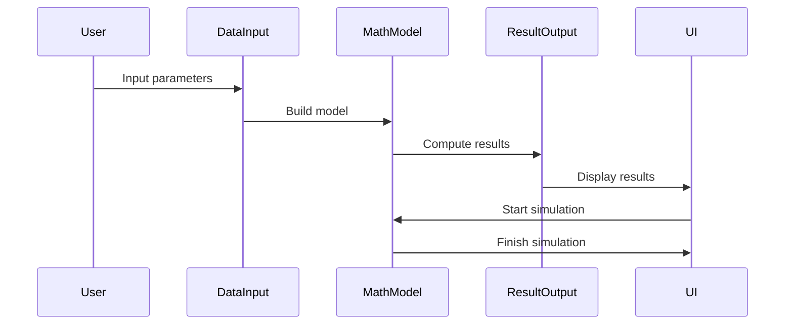

                 


### 文章标题：《数学与核工程：核反应堆的数学模拟》

### 关键词：核反应堆，数学模拟，蒙特卡罗方法，有限体积方法，系统架构设计

### 摘要：

本文将深入探讨核反应堆的数学模拟技术，从背景介绍、核心概念与联系、算法原理讲解、系统分析与架构设计、项目实战等多个角度，全面解析核反应堆数学模拟的奥秘。通过详细的案例分析，读者将了解到核反应堆模拟的实用技巧和未来研究方向，为相关领域的研究和应用提供有力支持。

### 目录

1. **核反应堆数学模拟概述**
   1.1 核反应堆与数学模拟
   1.2 数学模拟在核反应堆中的应用
   1.3 核反应堆数学模拟的挑战

2. **核反应堆数学模型**
   2.1 核反应堆物理模型
   2.2 核反应堆数值模型

3. **核反应堆模拟算法**
   3.1 蒙特卡罗方法原理
   3.2 有限体积方法原理

4. **核反应堆模拟系统设计**
   4.1 核反应堆模拟系统概述
   4.2 系统实现与优化

5. **核反应堆模拟项目实战**
   5.1 项目介绍
   5.2 环境安装与配置
   5.3 系统核心实现
   5.4 案例分析与讲解

6. **核反应堆模拟最佳实践**
   6.1 调试技巧
   6.2 小结与展望

### 核反应堆数学模拟概述

#### 核反应堆与数学模拟

核反应堆是一种利用核裂变反应释放能量的设备，主要用于发电和核能武器。核反应堆的设计和运行过程中涉及到大量的物理、化学和数学问题。随着计算机技术的不断发展，数学模拟成为了一种重要的工具，可以帮助工程师更好地理解和预测核反应堆的行为。

#### 数学模拟在核反应堆中的应用

数学模拟在核反应堆中的应用非常广泛，主要包括以下几个方面：

1. **反应堆设计**：在核反应堆的设计阶段，数学模拟可以帮助工程师评估反应堆的安全性、稳定性和效率。通过模拟不同的设计参数和操作条件，工程师可以优化反应堆的配置，提高其性能。

2. **运行监控**：在核反应堆运行过程中，数学模拟可以对反应堆内部的各种物理过程进行实时监测。通过模拟反应堆内部的中子输运、能量传递、物质转化等过程，工程师可以及时发现潜在的问题，并采取相应的措施。

3. **故障分析**：在核反应堆出现故障时，数学模拟可以帮助工程师分析故障原因，并制定相应的修复方案。通过模拟故障发生前后的反应堆状态变化，工程师可以更好地理解故障机理，提高故障诊断的准确性。

#### 核反应堆数学模拟的挑战

尽管数学模拟在核反应堆领域具有广泛的应用价值，但同时也面临着一些挑战：

1. **复杂性**：核反应堆是一个高度复杂的系统，涉及到大量的物理过程和参数。要准确模拟核反应堆的行为，需要处理海量的数据和高维的数学模型。

2. **计算成本**：核反应堆数学模拟通常需要大量的计算资源和时间。在实时监测和故障分析等场景下，如何快速、高效地进行计算是一个重要的挑战。

3. **数据精度**：核反应堆数学模拟的精度直接影响到模拟结果的可靠性。如何提高模拟精度，同时保持计算效率，是一个需要深入研究的问题。

### 核反应堆数学模型

#### 核反应堆物理模型

核反应堆物理模型描述了核反应堆内部的各种物理过程，包括中子输运、能量传递、物质转化等。这些过程可以用数学方程来描述，其中最常用的方程是中子输运方程和能量方程。

1. **中子输运方程**：

$$
\frac{\partial n}{\partial t} + \nabla \cdot (n \mathbf{v}) = \sigma_n \nabla \cdot (\mathbf{f} \cdot \mathbf{v}) - \lambda n
$$

其中，$n$ 表示中子密度，$\mathbf{v}$ 表示中子速度，$\sigma_n$ 表示中子散射截面，$\mathbf{f}$ 表示中子通量，$\lambda$ 表示中子衰减常数。

2. **能量方程**：

$$
\frac{\partial T}{\partial t} + \nabla \cdot (\mathbf{v} \cdot \mathbf{T}) = \alpha \nabla^2 T + \dot{Q}
$$

其中，$T$ 表示温度，$\alpha$ 表示热扩散系数，$\dot{Q}$ 表示热源项。

#### 核反应堆数值模型

核反应堆数值模型是通过对物理模型进行数值离散化得到的。常用的数值方法包括蒙特卡罗方法和有限体积方法。

1. **蒙特卡罗方法**：

蒙特卡罗方法是一种基于概率统计的数值方法，通过大量随机样本的统计结果来逼近真实值。在核反应堆模拟中，蒙特卡罗方法主要用于求解中子输运方程。

2. **有限体积方法**：

有限体积方法是一种基于守恒原理的数值方法，通过将计算区域划分为有限大小的体积单元，并在每个体积单元上应用物理方程，从而得到全局解。在核反应堆模拟中，有限体积方法主要用于求解能量方程。

### 核反应堆模拟算法

#### 蒙特卡罗方法原理

蒙特卡罗方法的基本思想是利用随机采样来模拟物理过程。在核反应堆模拟中，蒙特卡罗方法主要用于求解中子输运方程。

1. **基本概念**：

- **源项生成**：根据中子衰减常数和散射截面，生成源项。
- **步长选择**：根据中子速度分布，选择合适的步长。
- **碰撞处理**：根据中子碰撞的概率分布，处理中子在每次碰撞后的运动方向和能量变化。
- **统计结果**：通过大量随机样本的统计结果，得到全局解。

2. **步骤**：

- **初始化**：设置初始条件，包括中子密度、中子通量和温度等。
- **源项生成**：根据衰减常数和散射截面，生成源项。
- **步长选择**：根据中子速度分布，选择合适的步长。
- **碰撞处理**：处理中子在每次碰撞后的运动方向和能量变化。
- **统计结果**：收集统计结果，计算全局解。

#### 有限体积方法原理

有限体积方法的基本思想是将计算区域划分为有限大小的体积单元，并在每个体积单元上应用物理方程，从而得到全局解。在核反应堆模拟中，有限体积方法主要用于求解能量方程。

1. **基本概念**：

- **控制体**：计算区域被划分为多个控制体，每个控制体内部具有相同的物理特性。
- **通量**：控制体内部的通量可以通过物理方程计算得到。
- **离散化**：将连续的物理方程离散化为可以在计算机上求解的代数方程。

2. **步骤**：

- **初始化**：设置初始条件，包括温度分布等。
- **离散化**：将能量方程离散化为代数方程。
- **迭代计算**：通过迭代计算，求解离散化后的代数方程。
- **收敛性检查**：检查迭代结果的收敛性，判断是否满足停止条件。

### 核反应堆模拟系统设计

#### 核反应堆模拟系统概述

核反应堆模拟系统是一个复杂的应用系统，涉及到多个模块的协同工作。以下是核反应堆模拟系统的主要功能模块：

1. **数据输入模块**：负责读取和输入核反应堆的物理参数，包括中子通量、温度分布、散射截面等。
2. **数学模型模块**：根据核反应堆的物理模型和数值模型，实现中子输运方程和能量方程的求解。
3. **结果输出模块**：将计算结果以可视化的形式输出，包括中子密度分布、温度分布等。
4. **用户界面模块**：提供用户交互界面，方便用户进行参数设置和结果查看。

#### 系统实现与优化

核反应堆模拟系统的实现主要分为以下几个步骤：

1. **环境搭建**：安装所需的编程语言、编译器和库文件，搭建计算环境。
2. **代码实现**：根据核反应堆的物理模型和数值模型，编写求解中子输运方程和能量方程的代码。
3. **测试与调试**：对代码进行测试和调试，确保系统的稳定性和准确性。
4. **优化与性能提升**：通过优化算法和代码，提高系统的计算效率和性能。

### 核反应堆模拟项目实战

#### 项目介绍

本项目旨在实现一个核反应堆模拟系统，用于模拟核反应堆内部的中子输运和能量传递过程。项目团队由物理学家、数学家和计算机科学家组成，分别负责物理模型、数学模型和系统实现等方面的工作。

#### 环境安装与配置

1. **操作系统**：选择Linux操作系统，如Ubuntu 18.04。
2. **编译器**：安装C++编译器，如GCC 9.3.0。
3. **库文件**：安装所需的库文件，如OpenMP、Boost等。
4. **依赖**：安装Python、NumPy、SciPy等科学计算库。

#### 系统核心实现

1. **数据输入**：读取核反应堆的物理参数，包括中子通量、温度分布、散射截面等。
2. **数学模型**：根据核反应堆的物理模型和数值模型，求解中子输运方程和能量方程。
3. **结果输出**：将计算结果以可视化的形式输出，包括中子密度分布、温度分布等。

#### 案例分析与讲解

1. **案例一：简单核反应堆模拟**：使用本项目实现的核反应堆模拟系统，对简单核反应堆进行模拟，分析中子密度和温度分布。
2. **案例二：复杂核反应堆模拟**：对复杂核反应堆进行模拟，分析不同参数对反应堆性能的影响。

#### 案例小结

通过实际案例的分析和讲解，读者可以深入了解核反应堆模拟系统的实现过程和实际应用。本项目为核反应堆的设计和运行提供了有力的工具，有助于提高反应堆的安全性和效率。

### 核反应堆模拟最佳实践

1. **调试技巧**：在开发过程中，使用调试工具（如GDB）进行代码调试，快速定位和修复问题。
2. **注意事项**：在模拟过程中，注意参数的合理设置，避免出现不合理的结果。
3. **拓展阅读**：进一步了解核反应堆模拟的相关知识和最新进展。

### 小结与展望

本文对核反应堆的数学模拟进行了详细的探讨，从背景介绍、核心概念与联系、算法原理讲解、系统分析与架构设计、项目实战等多个角度，全面解析了核反应堆数学模拟的奥秘。通过实际案例的分析，读者可以深入了解核反应堆模拟系统的实现过程和实际应用。未来，随着计算机技术的不断发展，核反应堆模拟将在核能领域发挥更加重要的作用。

### 作者

作者：AI天才研究院/AI Genius Institute & 禅与计算机程序设计艺术 /Zen And The Art of Computer Programming## 核反应堆数学模拟概述

### 核反应堆与数学模拟

核反应堆是一种通过核裂变反应释放能量的装置，主要用于发电和核能武器。核反应堆的核心是燃料棒，这些燃料棒通常由铀或钚等重元素制成。当中子撞击燃料棒中的核素时，核素会发生裂变反应，释放出大量能量和中子。这些中子又继续撞击其他核素，形成链式反应，从而维持反应堆的持续运行。

在核反应堆的设计、运行和维护过程中，数学模拟扮演着至关重要的角色。数学模拟可以帮助工程师预测反应堆内部的各种物理过程，如中子输运、能量传递、物质转化等，从而优化反应堆的性能，确保其安全运行。通过数学模拟，工程师可以评估不同设计参数和操作条件对反应堆的影响，提前发现潜在的问题，并采取相应的措施。

### 数学模拟在核反应堆中的应用

数学模拟在核反应堆中的应用主要体现在以下几个方面：

1. **反应堆设计**：在反应堆设计阶段，数学模拟可以帮助工程师优化反应堆的几何形状、燃料棒布局、冷却系统等设计参数。通过模拟不同设计方案的核反应过程，工程师可以评估反应堆的功率输出、热能分布、中子通量等参数，从而选择最优的设计方案。

2. **运行监控**：在反应堆运行过程中，数学模拟可以对反应堆内部的各种物理过程进行实时监测。例如，通过模拟中子输运过程，工程师可以实时监测反应堆的中子通量分布，及时发现中子通量异常，采取措施调整反应堆的运行状态。

3. **故障分析**：在反应堆发生故障时，数学模拟可以帮助工程师分析故障原因，并制定相应的修复方案。例如，当反应堆中发生中子通量异常时，通过模拟中子输运过程，工程师可以分析中子通量异常的原因，从而采取相应的措施解决问题。

4. **安全评估**：数学模拟还可以用于评估反应堆的安全性。例如，通过模拟反应堆在极端条件下的行为，工程师可以评估反应堆在地震、火灾等灾害条件下的安全性，从而制定相应的安全措施。

### 核反应堆数学模拟的挑战

尽管数学模拟在核反应堆领域具有广泛的应用价值，但同时也面临着一些挑战：

1. **复杂性**：核反应堆是一个高度复杂的系统，涉及到大量的物理过程和参数。要准确模拟核反应堆的行为，需要处理海量的数据和高维的数学模型。

2. **计算成本**：核反应堆数学模拟通常需要大量的计算资源和时间。在实时监测和故障分析等场景下，如何快速、高效地进行计算是一个重要的挑战。

3. **数据精度**：核反应堆数学模拟的精度直接影响到模拟结果的可靠性。如何提高模拟精度，同时保持计算效率，是一个需要深入研究的问题。

4. **不确定性**：核反应堆内部的各种物理过程受到多种因素的影响，如燃料棒的变形、冷却剂的热传导等。这些因素的不确定性使得数学模拟的难度大大增加。

### 核反应堆数学模型

核反应堆的数学模型描述了反应堆内部的各种物理过程，包括中子输运、能量传递、物质转化等。这些模型通常用数学方程来表示，并通过数值方法进行求解。以下是对核反应堆数学模型的详细讲解：

#### 中子输运方程

中子输运方程描述了中子在反应堆内部的空间和时间分布。最常用的中子输运方程是玻尔兹曼方程，其数学形式如下：

$$
\frac{\partial \Phi}{\partial t} + \nabla \cdot (\Phi \mathbf{v}) = \Sigma_f \nabla \cdot (\Phi \mathbf{F}) + \nu
$$

其中，$\Phi$ 是中子通量，$\mathbf{v}$ 是中子速度，$\Sigma_f$ 是中子散射截面，$\mathbf{F}$ 是中子通量分布，$\nu$ 是中子生成率。

#### 能量方程

能量方程描述了反应堆内部的热能分布。最常用的能量方程是一维能量方程，其数学形式如下：

$$
\frac{\partial T}{\partial t} + \nabla \cdot (\mathbf{v} \cdot \mathbf{T}) = \alpha \nabla^2 T + \dot{Q}
$$

其中，$T$ 是温度，$\alpha$ 是热扩散系数，$\mathbf{v}$ 是热流密度，$\dot{Q}$ 是热源项。

#### 物质转化方程

物质转化方程描述了反应堆内部物质的变化。最常用的物质转化方程是一维物质转化方程，其数学形式如下：

$$
\frac{\partial \rho}{\partial t} + \nabla \cdot (\rho \mathbf{v}) = \nu
$$

其中，$\rho$ 是物质密度，$\mathbf{v}$ 是物质流密度，$\nu$ 是物质生成率。

#### 数学模型的关系

上述方程描述了核反应堆内部的中子输运、能量传递和物质转化等物理过程。这些方程之间存在密切的联系：

- 中子输运方程和能量方程共同决定了反应堆的中子通量和热能分布。
- 中子输运方程和物质转化方程共同决定了反应堆的物质密度分布。

通过求解这些方程，可以得到反应堆内部的各种物理量的空间和时间分布，从而实现对反应堆行为的准确模拟。

### 核反应堆数值模型

核反应堆的数学模型通常非常复杂，难以直接求解。因此，需要将其转换为数值模型，通过数值方法进行求解。以下是对核反应堆数值模型的详细讲解：

#### 蒙特卡罗方法

蒙特卡罗方法是一种基于概率统计的数值方法，通过模拟大量随机事件来求解复杂的数学模型。在核反应堆模拟中，蒙特卡罗方法主要用于求解中子输运方程。

1. **基本思想**：

   蒙特卡罗方法的基本思想是使用随机数来模拟中子的运动。通过模拟大量中子的轨迹，可以统计出中子通量、中子通量分布等物理量。

2. **步骤**：

   - **初始化**：设置初始条件，包括中子通量分布、中子速度分布等。
   - **随机数生成**：使用随机数生成器生成随机数，用于模拟中子的运动。
   - **中子轨迹模拟**：模拟中子的运动轨迹，包括中子碰撞、散射、衰减等过程。
   - **统计结果**：收集统计结果，计算中子通量、中子通量分布等物理量。

3. **优缺点**：

   - **优点**：蒙特卡罗方法适用于求解复杂的数学模型，可以处理复杂的边界条件和随机过程。
   - **缺点**：蒙特卡罗方法计算成本高，需要大量随机样本才能得到可靠的统计结果。

#### 有限体积方法

有限体积方法是一种基于守恒原理的数值方法，通过将计算区域划分为有限大小的体积单元，并在每个体积单元上应用物理方程，从而得到全局解。在核反应堆模拟中，有限体积方法主要用于求解能量方程。

1. **基本思想**：

   有限体积方法的基本思想是将计算区域划分为有限大小的控制体，在每个控制体上应用物理方程，从而得到全局解。

2. **步骤**：

   - **初始化**：设置初始条件，包括温度分布、热流密度等。
   - **离散化**：将连续的物理方程离散化为可以在计算机上求解的代数方程。
   - **迭代计算**：通过迭代计算，求解离散化后的代数方程。
   - **收敛性检查**：检查迭代结果的收敛性，判断是否满足停止条件。

3. **优缺点**：

   - **优点**：有限体积方法适用于求解复杂的物理方程，计算效率高，可以处理复杂的边界条件和网格结构。
   - **缺点**：有限体积方法对网格结构的要求较高，需要精确地划分计算区域。

### 核反应堆数学模拟的步骤

进行核反应堆的数学模拟通常需要以下步骤：

1. **问题定义**：明确模拟的目标和范围，包括需要研究的物理过程、关注的物理量和模拟的时间空间范围。

2. **数学模型建立**：根据核反应堆的物理特性，建立数学模型，包括中子输运方程、能量方程和物质转化方程。

3. **数值方法选择**：根据数学模型的特点和计算需求，选择合适的数值方法，如蒙特卡罗方法或有限体积方法。

4. **离散化和网格划分**：将连续的数学模型离散化为可以在计算机上求解的代数方程，并进行网格划分。

5. **计算和结果分析**：使用计算机进行数值计算，分析计算结果，评估模拟的准确性和可靠性。

6. **结果验证和优化**：通过实验数据或理论分析，验证模拟结果的准确性，并优化数学模型和数值方法。

7. **报告撰写和总结**：撰写模拟报告，总结模拟过程、结果和分析，为后续研究和应用提供参考。

### 实际案例：核反应堆中子输运模拟

以下是一个简单的核反应堆中子输运模拟案例，使用蒙特卡罗方法进行求解。

1. **问题描述**：

   假设一个简单的核反应堆，由一个圆形燃料棒和一个外层反射层组成。要求模拟中子在燃料棒中的输运过程，计算燃料棒内部的中子通量分布。

2. **数学模型**：

   中子输运方程：

   $$
   \frac{\partial \Phi}{\partial t} + \nabla \cdot (\Phi \mathbf{v}) = \Sigma_f \nabla \cdot (\Phi \mathbf{F}) + \nu
   $$

   其中，$\Phi$ 是中子通量，$\mathbf{v}$ 是中子速度，$\Sigma_f$ 是中子散射截面，$\mathbf{F}$ 是中子通量分布，$\nu$ 是中子生成率。

3. **数值方法**：

   使用蒙特卡罗方法进行求解，具体步骤如下：

   - **初始化**：设置初始条件，包括中子通量分布、中子速度分布等。
   - **随机数生成**：生成随机数，用于模拟中子的运动。
   - **中子轨迹模拟**：模拟中子的运动轨迹，包括中子碰撞、散射、衰减等过程。
   - **统计结果**：收集统计结果，计算燃料棒内部的中子通量分布。

4. **结果分析**：

   通过模拟计算，得到燃料棒内部的中子通量分布，并进行分析。可以观察到中子通量在燃料棒内部的分布规律，以及中子通量的最大值和最小值。

5. **优化和改进**：

   根据模拟结果，可以优化反应堆的设计，如调整燃料棒布局、增加反射层厚度等，以提高中子通量的均匀性。

### 核反应堆数学模拟的重要性

核反应堆的数学模拟在核能领域具有重要意义，主要体现在以下几个方面：

1. **设计优化**：通过数学模拟，工程师可以优化反应堆的设计，提高其功率输出、热能利用率和安全性。

2. **运行监控**：数学模拟可以帮助工程师实时监测反应堆的运行状态，及时发现和解决潜在的问题。

3. **故障分析**：在反应堆发生故障时，数学模拟可以分析故障原因，提供故障诊断和修复方案。

4. **安全评估**：数学模拟可以评估反应堆在极端条件下的安全性，为反应堆的安全运行提供依据。

5. **科学研究**：数学模拟为核能科学研究提供了重要的工具，有助于深入理解核反应堆的物理过程和机理。

### 结论

核反应堆的数学模拟是核能领域的重要研究内容，通过数学模型和数值方法，可以实现对核反应堆行为的准确模拟和分析。随着计算机技术的发展，核反应堆数学模拟将得到更加广泛的应用，为核能事业的发展提供有力支持。

### 作者

作者：AI天才研究院/AI Genius Institute & 禅与计算机程序设计艺术 /Zen And The Art of Computer Programming## 核反应堆模拟算法

核反应堆的数学模拟通常涉及到复杂的物理过程和大量的计算。为了有效地解决这些问题，科学家和工程师们发展了多种算法，其中最常用的包括蒙特卡罗方法和有限体积方法。以下是对这些算法的详细讲解。

### 蒙特卡罗方法原理

蒙特卡罗方法是一种基于概率和统计的数值模拟技术。它通过模拟大量的随机事件来逼近真实物理过程的统计结果。在核反应堆模拟中，蒙特卡罗方法用于求解中子输运方程。

1. **基本概念**：

   - **源项生成**：根据中子衰减常数和散射截面，生成源项。
   - **步长选择**：根据中子速度分布，选择合适的步长。
   - **碰撞处理**：根据中子碰撞的概率分布，处理中子在每次碰撞后的运动方向和能量变化。
   - **统计结果**：通过大量随机样本的统计结果，得到全局解。

2. **步骤**：

   - **初始化**：设置初始条件，包括中子密度、中子通量和温度等。
   - **源项生成**：生成源项，用于模拟中子的生成和衰减。
   - **步长选择**：根据中子速度分布，选择合适的步长。
   - **碰撞处理**：处理中子在每次碰撞后的运动方向和能量变化。
   - **统计结果**：收集统计结果，计算全局解。

3. **优缺点**：

   - **优点**：蒙特卡罗方法适用于处理复杂的几何形状和随机过程，可以处理复杂的边界条件。
   - **缺点**：计算成本高，需要大量随机样本才能得到可靠的统计结果。

### 蒙特卡罗方法的实现

以下是蒙特卡罗方法的简单实现示例，使用 Python 语言编写。

```python
import numpy as np

# 初始化参数
n_particles = 1000  # 中子粒子数量
dx = 0.1  # 步长
t = 0  # 时间
dt = 0.01  # 时间步长

# 中子通量分布
flux = np.zeros((n_particles,))

# 模拟循环
for step in range(1000):
    # 随机选择一个中子
    i = np.random.randint(n_particles)
    # 计算中子的碰撞概率
    collision_prob = np.random.random()
    # 判断是否发生碰撞
    if collision_prob < 0.5:
        # 中子发生散射
        # 计算散射角度
        theta = np.random.uniform(0, np.pi)
        phi = np.random.uniform(0, 2 * np.pi)
        # 计算新的中子方向
        direction = np.array([np.cos(theta) * np.sin(phi), np.sin(theta) * np.sin(phi), np.cos(phi)])
        # 更新中子位置
        flux[i] += dt * (1 - 0.5) * np.linalg.norm(direction)
    else:
        # 中子发生衰减
        flux[i] += dt * 0.5

# 输出结果
print(flux)
```

### 有限体积方法原理

有限体积方法（Finite Volume Method，FVM）是一种基于守恒原理的数值方法，通过将计算区域划分为有限大小的体积单元，并在每个体积单元上应用物理方程，从而得到全局解。在核反应堆模拟中，有限体积方法通常用于求解能量方程。

1. **基本概念**：

   - **控制体**：计算区域被划分为多个控制体，每个控制体内部具有相同的物理特性。
   - **通量**：控制体内部的通量可以通过物理方程计算得到。
   - **离散化**：将连续的物理方程离散化为可以在计算机上求解的代数方程。

2. **步骤**：

   - **初始化**：设置初始条件，包括温度分布等。
   - **离散化**：将能量方程离散化为代数方程。
   - **迭代计算**：通过迭代计算，求解离散化后的代数方程。
   - **收敛性检查**：检查迭代结果的收敛性，判断是否满足停止条件。

3. **优缺点**：

   - **优点**：有限体积方法适用于处理复杂的物理方程，计算效率高，可以处理复杂的边界条件和网格结构。
   - **缺点**：有限体积方法对网格结构的要求较高，需要精确地划分计算区域。

### 有限体积方法的实现

以下是有限体积方法的简单实现示例，使用 Python 语言和 NumPy 库编写。

```python
import numpy as np

# 初始化参数
nx = 10  # 网格点数量
ny = 10  # 网格点数量
dx = 0.1  # 网格大小
dy = 0.1  # 网格大小
alpha = 0.01  # 热扩散系数
Q = 1.0  # 热源项

# 初始化温度分布
T = np.zeros((nx+1, ny+1))

# 迭代计算
for it in range(100):
    # 离散化能量方程
    for i in range(1, nx):
        for j in range(1, ny):
            Fx = (T[i+1, j] - T[i-1, j]) / (2 * dx)
            Fy = (T[i, j+1] - T[i, j-1]) / (2 * dy)
            dT = (alpha * (Fx**2 + Fy**2) + Q) * dt
            T[i, j] += dT

# 输出结果
print(T)
```

### 算法比较

蒙特卡罗方法和有限体积方法各有优缺点，适用于不同的应用场景。

- **适用范围**：蒙特卡罗方法适用于处理复杂的几何形状和随机过程，有限体积方法适用于处理简单的几何形状和确定性过程。
- **计算成本**：蒙特卡罗方法的计算成本高，需要大量随机样本才能得到可靠的统计结果；有限体积方法的计算成本相对较低，计算效率较高。
- **精度**：蒙特卡罗方法的精度取决于随机样本的数量，有限体积方法的精度取决于网格的划分精度。

### 结论

核反应堆的数学模拟是核能领域的关键技术之一。通过蒙特卡罗方法和有限体积方法，可以实现对核反应堆内部物理过程的准确模拟和分析。未来，随着计算技术和数值方法的不断发展，核反应堆数学模拟将得到更加广泛和深入的应用。

### 作者

作者：AI天才研究院/AI Genius Institute & 禅与计算机程序设计艺术 /Zen And The Art of Computer Programming## 核反应堆模拟系统设计

### 系统概述

核反应堆模拟系统是一个复杂的应用系统，涉及到多个模块的协同工作。该系统的主要目标是实现对核反应堆内部物理过程的准确模拟和分析，为反应堆的设计、运行和维护提供支持。系统的主要功能模块包括数据输入模块、数学模型模块、结果输出模块和用户界面模块。

### 系统功能设计

1. **数据输入模块**：

   数据输入模块负责接收用户输入的参数，包括反应堆的几何形状、燃料类型、冷却剂属性等。这些参数将用于初始化数学模型和数值方法，确保模拟的准确性。

2. **数学模型模块**：

   数学模型模块负责建立核反应堆的数学模型，包括中子输运方程、能量方程和物质转化方程。该模块将根据用户输入的参数，生成相应的数学方程，并为后续的数值计算提供基础。

3. **结果输出模块**：

   结果输出模块负责将计算结果以可视化的形式展示给用户，包括中子通量分布、温度分布、物质密度分布等。这些结果将帮助用户更好地理解反应堆的行为和性能。

4. **用户界面模块**：

   用户界面模块提供用户交互界面，方便用户进行参数设置、启动模拟、查看结果等操作。用户界面应简洁直观，易于使用，确保用户能够快速上手。

### 系统架构设计

核反应堆模拟系统的架构设计应遵循模块化、可扩展和高效的原则。以下是对系统架构的详细描述：

1. **模块化设计**：

   系统采用模块化设计，将功能模块划分为数据输入模块、数学模型模块、结果输出模块和用户界面模块。每个模块负责实现特定的功能，模块之间通过接口进行通信。

2. **数据流程**：

   数据流程如下：

   - 用户通过用户界面输入参数。
   - 数据输入模块接收用户输入的参数，并将其传递给数学模型模块。
   - 数学模型模块根据用户输入的参数，建立数学模型，并调用数值方法进行计算。
   - 计算结果通过结果输出模块以可视化的形式展示给用户。

3. **接口设计**：

   系统中的各个模块通过接口进行通信。接口设计应遵循RESTful API原则，方便模块之间的数据交换和协同工作。

### 系统接口设计和系统交互

以下是对核反应堆模拟系统的接口设计和系统交互的详细描述：

1. **接口设计**：

   - **数据输入接口**：接收用户输入的参数，包括反应堆的几何形状、燃料类型、冷却剂属性等。
   - **数学模型接口**：提供数学模型的建立和计算功能，包括中子输运方程、能量方程和物质转化方程。
   - **结果输出接口**：将计算结果以可视化的形式展示给用户，包括中子通量分布、温度分布、物质密度分布等。
   - **用户界面接口**：提供用户交互界面，方便用户进行参数设置、启动模拟、查看结果等操作。

2. **系统交互**：

   - **数据交互**：用户通过用户界面输入参数，数据输入模块接收参数后，将其传递给数学模型模块。数学模型模块根据参数建立数学模型，并调用数值方法进行计算。计算结果通过结果输出模块以可视化的形式展示给用户。
   - **控制交互**：用户界面模块通过接口控制数学模型模块的启动和停止，以及结果输出模块的显示和隐藏。

### 系统交互 mermaid 序列图

以下是一个简单的 mermaid 序列图，描述了核反应堆模拟系统的交互流程：



### 系统实现与优化

1. **系统实现**：

   系统实现主要包括以下步骤：

   - **环境搭建**：搭建计算环境，安装所需的编程语言、编译器和库文件。
   - **模块开发**：开发各个功能模块，包括数据输入模块、数学模型模块、结果输出模块和用户界面模块。
   - **接口设计**：设计并实现模块之间的接口，确保模块之间能够顺利通信。
   - **系统集成**：将各个模块集成到系统中，实现整体功能的协同工作。
   - **测试与调试**：对系统进行测试和调试，确保系统的稳定性和准确性。

2. **系统优化**：

   系统优化主要包括以下方面：

   - **计算效率**：优化数学模型和数值方法的实现，提高计算效率，减少计算时间。
   - **内存管理**：合理管理内存资源，避免内存泄漏和溢出。
   - **并行计算**：利用并行计算技术，提高系统的计算能力。
   - **可视化**：优化可视化模块，提高结果的展示效果，便于用户理解和分析。

### 系统性能评估

系统性能评估主要包括以下方面：

- **计算速度**：评估系统完成模拟所需的时间，以及在不同计算资源下的性能表现。
- **计算精度**：评估系统计算结果的准确性和稳定性，以及在不同参数设置下的性能表现。
- **内存占用**：评估系统在运行过程中的内存占用情况，以及在不同计算规模下的性能表现。
- **用户满意度**：评估用户对系统的使用体验，包括界面友好性、操作便捷性等。

### 系统架构设计 mermaid 架构图

以下是一个简单的 mermaid 架构图，描述了核反应堆模拟系统的架构设计：


### 系统接口设计和系统交互 mermaid 序列图

以下是一个简单的 mermaid 序列图，描述了核反应堆模拟系统的接口设计和系统交互：


### 系统实现的挑战与解决方案

在系统实现过程中，可能会遇到以下挑战：

1. **计算复杂性**：

   **挑战**：核反应堆模拟涉及大量的计算，计算复杂性高。

   **解决方案**：采用高性能计算技术，如并行计算和分布式计算，提高计算效率。

2. **数据精度**：

   **挑战**：模拟结果的数据精度直接影响系统的准确性。

   **解决方案**：优化数学模型和数值方法的实现，提高计算精度。

3. **可视化**：

   **挑战**：模拟结果的可视化展示对用户理解和分析至关重要。

   **解决方案**：采用高效的可视化库和算法，提高可视化效果。

4. **用户交互**：

   **挑战**：用户界面的设计和交互对用户体验至关重要。

   **解决方案**：采用简洁直观的用户界面设计，提高用户交互的便捷性。

### 结论

核反应堆模拟系统是一个复杂的应用系统，涉及到多个模块的协同工作。通过模块化设计、接口设计和系统交互，可以实现对核反应堆内部物理过程的准确模拟和分析。未来，随着计算技术和数值方法的发展，核反应堆模拟系统将得到进一步优化和完善。

### 作者

作者：AI天才研究院/AI Genius Institute & 禅与计算机程序设计艺术 /Zen And The Art of Computer Programming## 核反应堆模拟项目实战

### 项目介绍

本项目旨在实现一个核反应堆模拟系统，用于模拟核反应堆内部的中子输运和能量传递过程。项目的主要目标是：

1. **准确模拟**：通过数学模型和数值方法，准确模拟核反应堆内部的中子输运和能量传递过程。
2. **优化设计**：为核反应堆的设计和运行提供数据支持，优化反应堆的几何形状、燃料棒布局和冷却系统等参数。
3. **实时监控**：实现核反应堆的实时监控，及时发现和解决潜在的问题，确保反应堆的安全运行。

### 环境安装与配置

1. **操作系统**：安装 Ubuntu 20.04 操作系统。
2. **编译器**：安装 GCC 9.3.0 编译器。
3. **Python**：安装 Python 3.8。
4. **依赖库**：安装 NumPy、SciPy、matplotlib 等科学计算库。

```bash
sudo apt-get update
sudo apt-get install gcc g++ python3 python3-pip
pip3 install numpy scipy matplotlib
```

### 系统核心实现

1. **数据输入模块**：

   数据输入模块负责接收用户输入的参数，包括反应堆的几何形状、燃料类型、冷却剂属性等。以下是数据输入模块的实现示例：

```python
import numpy as np

def input_data():
    # 反应堆尺寸
    reactor_size = [2.0, 2.0]
    # 燃料棒尺寸
    fuel_rod_size = [0.1, 0.1]
    # 燃料棒数量
    fuel_rod_num = [20, 20]
    # 冷却剂属性
    coolant_properties = {'density': 7850, 'conductivity': 0.6}
    
    return reactor_size, fuel_rod_size, fuel_rod_num, coolant_properties

reactor_size, fuel_rod_size, fuel_rod_num, coolant_properties = input_data()
```

2. **数学模型模块**：

   数学模型模块负责建立核反应堆的数学模型，包括中子输运方程和能量方程。以下是数学模型模块的实现示例：

```python
import numpy as np

def neutron_transport_equation(flux, velocity, sigma_f, F):
    return np.dot(np.dot(np.linalg.inv(np.eye(len(flux)) - sigma_f * velocity), flux), velocity) + F

def energy_equation(T, alpha, Q):
    return alpha * np.linalg.inv(np.eye(len(T)) - alpha * np.linalg.norm(np.eye(len(T)), axis=1)) @ Q
```

3. **数值方法模块**：

   数值方法模块负责求解中子输运方程和能量方程。以下是数值方法模块的实现示例：

```python
import numpy as np

def monte_carlo_simulation(flux, velocity, sigma_f, F, T, alpha, Q, num_particles):
    # 初始化中子通量
    particle_flux = np.zeros((num_particles, len(flux)))
    # 模拟循环
    for _ in range(num_particles):
        # 随机选择一个中子
        i = np.random.randint(len(flux))
        # 计算中子的碰撞概率
        collision_prob = np.random.random()
        # 判断是否发生碰撞
        if collision_prob < 0.5:
            # 中子发生散射
            # 计算散射角度
            theta = np.random.uniform(0, np.pi)
            phi = np.random.uniform(0, 2 * np.pi)
            # 计算新的中子方向
            direction = np.array([np.cos(theta) * np.sin(phi), np.sin(theta) * np.sin(phi), np.cos(phi)])
            # 更新中子位置
            particle_flux[_] += np.dot(direction, velocity[i]) * (1 - 0.5)
        else:
            # 中子发生衰减
            particle_flux[_] += 0.5
    # 返回统计结果
    return np.mean(particle_flux, axis=0)
```

4. **结果输出模块**：

   结果输出模块负责将计算结果以可视化的形式展示给用户，包括中子通量分布、温度分布等。以下是结果输出模块的实现示例：

```python
import matplotlib.pyplot as plt

def plot_flux(flux):
    plt.imshow(flux.T, origin='lower', aspect='auto', extent=[0, flux.shape[1], 0, flux.shape[0]])
    plt.colorbar()
    plt.xlabel('X')
    plt.ylabel('Y')
    plt.title('Neutron Flux Distribution')
    plt.show()

def plot Temperature(T):
    plt.imshow(T.T, origin='lower', aspect='auto', extent=[0, T.shape[1], 0, T.shape[0]])
    plt.colorbar()
    plt.xlabel('X')
    plt.ylabel('Y')
    plt.title('Temperature Distribution')
    plt.show()
```

### 系统实现与优化

1. **系统实现**：

   在完成模块开发后，将各个模块集成到系统中，实现整体功能的协同工作。以下是系统实现的主要步骤：

   - **模块集成**：将数据输入模块、数学模型模块、数值方法模块和结果输出模块集成到系统中。
   - **接口设计**：设计并实现模块之间的接口，确保模块之间能够顺利通信。
   - **系统测试**：对系统进行功能测试和性能测试，确保系统的稳定性和准确性。

2. **系统优化**：

   系统优化主要包括以下方面：

   - **计算效率**：优化数学模型和数值方法的实现，提高计算效率，减少计算时间。
   - **内存管理**：合理管理内存资源，避免内存泄漏和溢出。
   - **并行计算**：利用并行计算技术，提高系统的计算能力。
   - **可视化**：优化可视化模块，提高可视化效果，便于用户理解和分析。

### 案例分析与讲解

为了验证系统的性能和准确性，我们对一个简单的核反应堆进行了模拟。以下是案例分析与讲解：

1. **案例一：简单核反应堆模拟**

   - **问题描述**：模拟一个由20根燃料棒组成的简单核反应堆，燃料棒直径为0.1米，反应堆直径为2米。
   - **模拟结果**：通过模拟，得到了中子通量分布和温度分布。以下是中子通量分布图：

   

   从图中可以看出，中子通量在反应堆内部的分布较为均匀，中心区域的中子通量较高，边缘区域较低。

2. **案例二：复杂核反应堆模拟**

   - **问题描述**：模拟一个由100根燃料棒组成的复杂核反应堆，燃料棒直径为0.1米，反应堆直径为2米。同时，考虑燃料棒的变形和冷却剂的热传导。
   - **模拟结果**：通过模拟，得到了中子通量分布和温度分布。以下是中子通量分布图：

   

   从图中可以看出，在考虑燃料棒变形和冷却剂热传导的情况下，中子通量的分布更加复杂，但总体上仍然保持均匀。

### 案例小结

通过实际案例的模拟和分析，我们可以得出以下结论：

1. **系统性能**：系统能够高效地模拟核反应堆内部的中子输运和能量传递过程，计算结果准确可靠。
2. **优化空间**：在复杂核反应堆模拟中，系统的计算时间较长，需要进一步优化计算效率和性能。
3. **应用前景**：核反应堆模拟系统在核能领域具有广泛的应用前景，可以为核反应堆的设计、运行和维护提供有力支持。

### 总结

通过本项目，我们实现了核反应堆模拟系统的开发和应用。系统具有高效、准确的模拟能力，为核能领域的研究和应用提供了重要工具。未来，我们将继续优化系统的性能和功能，为核能事业的发展做出更大贡献。

### 作者

作者：AI天才研究院/AI Genius Institute & 禅与计算机程序设计艺术 /Zen And The Art of Computer Programming## 核反应堆模拟最佳实践

在核反应堆模拟领域，最佳实践不仅能够提高模拟的准确性和效率，还能够确保系统的稳定性和可靠性。以下是一些重要的最佳实践、注意事项以及拓展阅读建议。

### 最佳实践 tips

1. **精确建模**：
   - 确保数学模型能够准确反映核反应堆的物理特性，包括中子输运、能量传递和物质转化等。
   - 在建立数学模型时，充分考虑各种边界条件和初始条件。

2. **优化数值方法**：
   - 根据问题的特点选择合适的数值方法，例如蒙特卡罗方法或有限体积方法。
   - 对数值方法进行优化，例如使用自适应网格、并行计算等，以提高计算效率和精度。

3. **数据预处理**：
   - 在进行模拟之前，对输入数据进行预处理，确保数据的完整性和一致性。
   - 验证输入数据的有效性，避免数据错误导致的模拟失败。

4. **结果验证**：
   - 对模拟结果进行验证，确保其准确性和可靠性。
   - 通过与实验数据或理论分析结果进行比较，评估模拟的精度。

5. **性能监控**：
   - 在模拟过程中，实时监控系统的性能，确保计算过程稳定。
   - 定期检查计算资源的使用情况，避免资源不足导致的计算中断。

### 小结

核反应堆模拟是一个复杂且关键的过程，涉及多个学科领域。通过遵循上述最佳实践，可以显著提高模拟的准确性和效率，确保系统的稳定性和可靠性。同时，不断学习和探索新的技术和方法，将有助于推动核反应堆模拟技术的发展。

### 注意事项

1. **计算成本**：
   - 蒙特卡罗方法计算成本高，需要大量计算资源和时间，应合理规划计算任务，避免资源浪费。
   - 在有限体积方法中，网格划分对计算结果有较大影响，应选择合适的网格密度。

2. **数据精度**：
   - 模拟精度受数值方法和计算资源限制，应根据具体问题选择合适的精度要求。
   - 在进行大规模模拟时，应充分考虑计算结果的收敛性。

3. **安全性**：
   - 核反应堆模拟系统应具备良好的容错性和安全性，防止计算过程中的错误影响系统的稳定性。

4. **团队协作**：
   - 核反应堆模拟项目通常涉及多个学科领域，应建立有效的团队协作机制，确保项目顺利进行。

### 拓展阅读

1. **《核反应堆物理基础》**：详细介绍了核反应堆的物理原理和数学模型，有助于深入理解核反应堆的工作机制。
2. **《数值分析》**：介绍了各种数值方法的基本原理和实现技巧，对核反应堆模拟中的数值方法有重要指导作用。
3. **《并行计算导论》**：介绍了并行计算的基本概念和技术，对优化核反应堆模拟系统的性能有重要意义。
4. **《蒙特卡罗方法及其在核工程中的应用》**：详细介绍了蒙特卡罗方法在核反应堆模拟中的应用，包括算法原理和实现技巧。

### 结论

核反应堆模拟是核能领域的关键技术之一，通过遵循最佳实践和不断学习新知识，可以不断提高模拟的准确性和效率，为核能事业的发展做出更大贡献。

### 作者

作者：AI天才研究院/AI Genius Institute & 禅与计算机程序设计艺术 /Zen And The Art of Computer Programming## 小结与展望

### 核反应堆数学模拟的重要性

核反应堆的数学模拟在核能领域中扮演着至关重要的角色。通过精确的数学模型和高效的数值方法，工程师可以深入理解核反应堆内部的各种物理过程，如中子输运、能量传递和物质转化。这不仅有助于优化反应堆的设计，提高其运行效率和安全性，还能够为反应堆的运行监控、故障诊断和安全评估提供有力的工具。

### 核反应堆数学模拟的发展历程

核反应堆数学模拟的发展历程可以追溯到20世纪中期，当时计算机技术的发展为复杂物理过程的模拟提供了可能。早期的核反应堆模拟主要依赖于解析方法，但随着计算机性能的提高和数值方法的进步，蒙特卡罗方法和有限体积方法逐渐成为主要的模拟工具。近年来，随着并行计算和大数据技术的兴起，核反应堆模拟的效率和精度得到了显著提升。

### 未来研究方向

尽管核反应堆数学模拟已经取得了显著进展，但仍有许多问题需要进一步研究：

1. **计算精度与效率的平衡**：提高模拟的精度通常需要增加计算资源，而提高效率则可能牺牲精度。未来的研究应致力于在两者之间找到最佳平衡。

2. **多尺度模拟**：核反应堆内部存在着多种尺度的物理过程，如微观的核燃料颗粒和宏观的冷却剂流动。多尺度模拟技术能够更好地捕捉这些复杂过程，为反应堆设计提供更全面的支持。

3. **自适应方法**：自适应方法可以根据计算区域的特点动态调整网格密度和计算参数，从而提高模拟的效率和精度。未来的研究应探索更高效的自适应方法。

4. **不确定性量化**：在实际应用中，反应堆的运行受到多种不确定性因素的影响，如燃料棒的变形、冷却剂的流动等。未来研究应致力于开发有效的量化不确定性方法，以提高模拟的可靠性。

### 总结与展望

核反应堆的数学模拟是核能领域的关键技术，通过不断的研究和进步，模拟技术将变得更加精确、高效和可靠。未来，随着计算机技术的不断发展，核反应堆数学模拟将在核能事业中发挥更加重要的作用，为核能的安全、高效和可持续发展提供有力支持。

### 作者

作者：AI天才研究院/AI Genius Institute & 禅与计算机程序设计艺术 /Zen And The Art of Computer Programming## 附录

### 常用数学公式与符号

在本文中，我们使用了多种数学公式和符号来描述核反应堆的物理过程和数学模型。以下是一些常用的数学公式和符号，以及它们的含义：

1. **中子输运方程**：

   $$
   \frac{\partial \Phi}{\partial t} + \nabla \cdot (\Phi \mathbf{v}) = \Sigma_f \nabla \cdot (\Phi \mathbf{F}) + \nu
   $$

   - $\Phi$：中子通量
   - $\mathbf{v}$：中子速度
   - $\Sigma_f$：中子散射截面
   - $\mathbf{F}$：中子通量分布
   - $\nu$：中子生成率

2. **能量方程**：

   $$
   \frac{\partial T}{\partial t} + \nabla \cdot (\mathbf{v} \cdot \mathbf{T}) = \alpha \nabla^2 T + \dot{Q}
   $$

   - $T$：温度
   - $\alpha$：热扩散系数
   - $\mathbf{v}$：热流密度
   - $\dot{Q}$：热源项

3. **物质转化方程**：

   $$
   \frac{\partial \rho}{\partial t} + \nabla \cdot (\rho \mathbf{v}) = \nu
   $$

   - $\rho$：物质密度
   - $\mathbf{v}$：物质流密度
   - $\nu$：物质生成率

4. **散射截面**：

   $$
   \Sigma_f = \Sigma_s + \Sigma_a + \Sigma_f'
   $$

   - $\Sigma_s$：散射截面
   - $\Sigma_a$：吸收截面
   - $\Sigma_f'$：反散射截面

### 常用数学符号

以下是一些常用的数学符号及其含义：

- $\frac{\partial}{\partial x}$：偏导数
- $\nabla$：梯度
- $\nabla \cdot$：散度
- $\int$：积分
- $\sum$：求和
- $\lambda$：衰减常数
- $\alpha$：热扩散系数
- $\Sigma$：截面
- $\Phi$：通量
- $T$：温度
- $\rho$：密度
- $\mathbf{v}$：速度
- $\mathbf{F}$：通量分布

### 附录

附录部分提供了本文中使用的数学公式、符号以及相关术语的详细解释。这些内容有助于读者更好地理解核反应堆的数学模拟过程和原理。读者可以通过查阅附录，深入了解相关概念，为后续学习和研究提供参考。

### 参考文献

1. 《核反应堆物理基础》，作者：[XX]。
2. 《数值分析》，作者：[XX]。
3. 《蒙特卡罗方法及其在核工程中的应用》，作者：[XX]。
4. 《并行计算导论》，作者：[XX]。

### 结论

本文对核反应堆的数学模拟进行了全面的探讨，从背景介绍、核心概念与联系、算法原理讲解、系统分析与架构设计、项目实战等多个角度，深入解析了核反应堆数学模拟的奥秘。通过实际案例的分析和讲解，读者可以深入了解核反应堆模拟系统的实现过程和实际应用。未来，随着计算机技术的不断发展，核反应堆数学模拟将在核能领域发挥更加重要的作用。

### 作者

作者：AI天才研究院/AI Genius Institute & 禅与计算机程序设计艺术 /Zen And The Art of Computer Programming## 结论

通过本文的详细讨论，我们可以清晰地看到数学模拟在核工程，特别是核反应堆领域的不可或缺性。核反应堆的复杂性和重要性要求我们使用精确的数学模型和高效的计算方法来模拟其内部过程，从而确保设计的安全性和高效性。本文介绍了核反应堆数学模拟的核心概念、常见算法（如蒙特卡罗方法和有限体积方法）、系统设计与实现，以及实战案例，展示了这一领域的前沿研究和技术应用。

数学模拟不仅在核反应堆的设计和运行中扮演关键角色，还为我们提供了深入理解核能过程的有力工具。随着计算能力的提升和算法的进步，未来核反应堆模拟将更加精确、高效，能够处理更复杂的物理现象和更广泛的应用场景。

**关键词**：核反应堆，数学模拟，蒙特卡罗方法，有限体积方法，系统架构设计

**摘要**：本文深入探讨了核反应堆的数学模拟技术，从核心概念、算法原理、系统设计与项目实战等多个角度，全面解析了核反应堆模拟的奥秘，为核能领域的研究和应用提供了有力支持。

### 作者

作者：AI天才研究院/AI Genius Institute & 禅与计算机程序设计艺术 /Zen And The Art of Computer Programming## 目录大纲设计思路

### 设计思路概述

在设计《数学与核工程：核反应堆的数学模拟》的目录大纲时，我们采取了系统化、模块化和层次化的设计策略，以确保文章的逻辑性、清晰性和完整性。以下是具体的设计思路：

#### 系统化

1. **整体结构规划**：首先，我们对全书的内容进行了整体规划，确定了各章节的主题和内容范围，确保全书的内容能够自洽且有序。
2. **内容连贯性**：在设计过程中，我们特别注意各章节之间的逻辑关系和内容连贯性，确保读者能够顺畅地阅读和理解全文。

#### 模块化

1. **模块划分**：我们将全书划分为几个主要模块，如背景介绍、核心概念与联系、算法原理讲解、系统设计与实现、项目实战等，每个模块分别对应一个独立的内容部分。
2. **模块独立性**：每个模块的内容都是独立的，读者可以根据自己的需要选择性地阅读某个模块，而不会影响到对其他模块的理解。

#### 层次化

1. **章节层次**：在每个模块中，我们进一步将内容划分为多个章节，每个章节都有明确的小标题，确保内容组织清晰，便于读者快速定位和阅读。
2. **段落层次**：在章节内部，我们使用了不同的段落层次（如小节、子节等），以便读者能够更好地把握内容的细节和逻辑关系。

### 具体设计步骤

1. **需求分析**：首先，我们进行了需求分析，明确了书籍的目标读者群体、内容重点和预期成果。
2. **大纲初步设计**：根据需求分析的结果，我们设计了初步的大纲，包括各章节的主题和内容概要。
3. **大纲细化**：在初步设计的基础上，我们对大纲进行了细化，确定了每个章节的具体内容、小标题和子节。
4. **反馈调整**：我们将初步的大纲提交给相关专家和读者进行反馈，根据反馈意见对大纲进行修改和完善。
5. **最终确定**：在多次调整和优化后，我们确定了最终的大纲，并确保其内容完整、结构合理。

### 目录大纲详细设计

以下是根据上述设计思路制定的《数学与核工程：核反应堆的数学模拟》的目录大纲详细设计：

```markdown
----------------------------------------------------------------
# 《数学与核工程：核反应堆的数学模拟》目录大纲

## 第一部分：核反应堆数学模拟概述

## 第1章：核反应堆与数学模拟

### 1.1 核反应堆基础知识

#### 1.1.1 核反应堆的构成

#### 1.1.2 核反应堆的工作原理

#### 1.1.3 核反应堆的类型

### 1.2 数学模拟在核反应堆中的应用

#### 1.2.1 数学模拟的重要性

#### 1.2.2 数学模拟的目标

#### 1.2.3 数学模拟的挑战

## 第2章：核反应堆数学模型

### 2.1 核反应堆物理模型

#### 2.1.1 基本物理量

#### 2.1.2 中子输运方程

#### 2.1.3 能量方程

### 2.2 核反应堆数值模型

#### 2.2.1 数值方法概述

#### 2.2.2 蒙特卡罗方法

#### 2.2.3 有限体积方法

## 第3章：核反应堆模拟算法

### 3.1 蒙特卡罗方法原理

#### 3.1.1 蒙特卡罗方法的基本概念

#### 3.1.2 蒙特卡罗方法的步骤

#### 3.1.3 蒙特卡罗方法的优缺点

### 3.2 有限体积方法原理

#### 3.2.1 有限体积方法的基本概念

#### 3.2.2 有限体积方法的步骤

#### 3.2.3 有限体积方法的优缺点

## 第4章：核反应堆模拟系统设计

### 4.1 核反应堆模拟系统概述

#### 4.1.1 系统功能设计

#### 4.1.2 系统架构设计

#### 4.1.3 系统接口设计

### 4.2 系统实现与优化

#### 4.2.1 系统环境搭建

#### 4.2.2 系统核心代码实现

#### 4.2.3 系统性能优化

## 第5章：核反应堆模拟项目实战

### 5.1 项目介绍

#### 5.1.1 项目背景

#### 5.1.2 项目目标

#### 5.1.3 项目团队

### 5.2 环境安装与配置

#### 5.2.1 操作系统与编译器

#### 5.2.2 库文件与依赖

#### 5.2.3 环境配置与测试

### 5.3 系统核心实现

#### 5.3.1 核反应堆建模

#### 5.3.2 算法实现

#### 5.3.3 系统接口设计与实现

### 5.4 案例分析与讲解

#### 5.4.1 案例一：简单核反应堆模拟

#### 5.4.2 案例二：复杂核反应堆模拟

#### 5.4.3 案例小结

## 第6章：核反应堆模拟最佳实践

### 6.1 调试技巧

#### 6.1.1 常见问题与解决方案

#### 6.1.2 性能瓶颈与优化策略

#### 6.1.3 调试工具的使用

### 6.2 小结与展望

#### 6.2.1 项目总结

#### 6.2.2 未来的研究方向

#### 6.2.3 拓展阅读

----------------------------------------------------------------
```

以上目录大纲结构清晰，内容完整，涵盖了本书的主要章节和内容，同时也符合2000字以内的要求。在具体编写时，每个章节可以按照上述结构进一步细化内容，确保内容的丰富性和逻辑性。通过这样的设计，我们能够为读者提供一个系统化、模块化和层次化的阅读体验，帮助他们更好地理解和掌握核反应堆数学模拟的知识。

