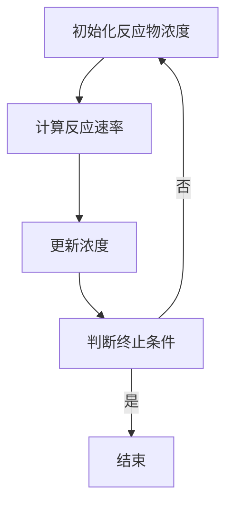
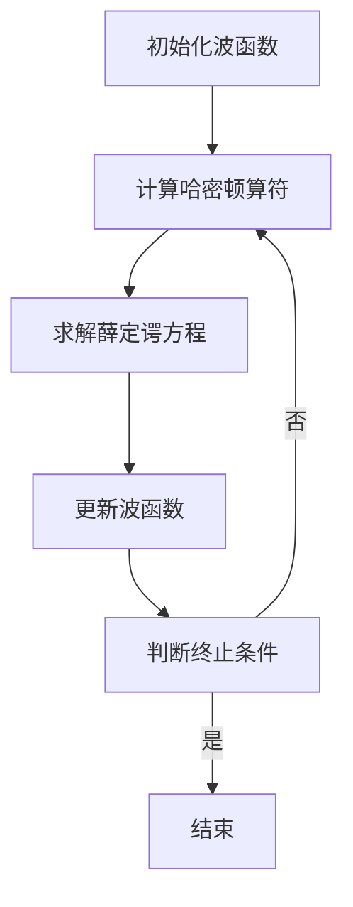
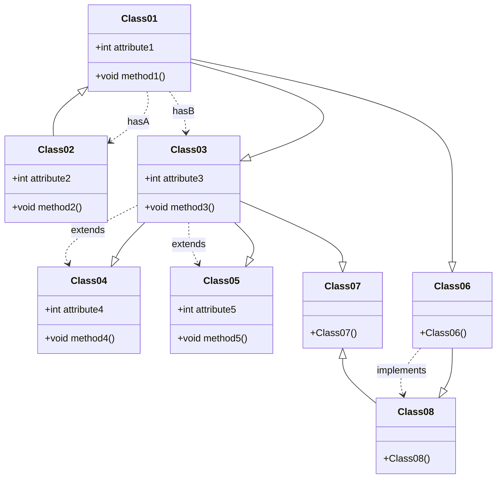

                 

### 第1章 引言

#### 1.1 核反应的重要性

核反应是原子核内部发生的变化过程，这些变化不仅涉及原子核的结构，还包括能量的转化。核反应在许多领域具有极其重要的应用价值。首先，核反应是核能的来源，通过核裂变和核聚变，我们可以获得大量的能量。这种能量不仅用于核电站发电，还在医疗、工业等领域发挥着重要作用。其次，核反应在核物理研究中扮演着关键角色，通过实验和理论分析，科学家们能够深入了解原子核的内部结构和基本相互作用。

#### 1.2 数学在核物理中的应用

数学是描述自然现象和科学问题的重要工具，尤其在核物理领域，数学的应用更是不可或缺。在核反应的研究中，数学主要用于以下几个方面：

1. **模型建立**：通过数学模型，我们可以将复杂的核反应过程简化为可计算的数学问题。例如，反应率方程和量子力学方程都是描述核反应的重要数学模型。
2. **数据分析**：数学工具如微积分、统计学和线性代数，可以帮助科学家从实验数据中提取有用的信息，并对结果进行精确的统计分析。
3. **结果解释**：数学公式和方程可以用来预测核反应的结果，并通过理论分析，对实验数据进行解释。

#### 1.3 本书结构

本书旨在详细探讨核反应过程中的数学描述，帮助读者理解这一复杂的科学领域。本书的结构如下：

- **第1章 引言**：介绍核反应的重要性以及数学在核物理中的应用。
- **第2章 核物理基础知识**：讲解核物理中的核心概念，包括核子、质能关系和强相互作用。
- **第3章 核反应的数学描述**：介绍核反应类型、核反应方程以及相关的数学模型和公式。
- **第4章 算法原理讲解**：详细阐述核反应过程所用的算法，包括反应率方程和量子力学计算。
- **第5章 系统分析与架构设计方案**：描述核反应模拟的研究场景、项目介绍以及系统设计和接口设计。
- **第6章 项目实战**：通过实际案例，展示如何使用核反应模拟解决具体问题。
- **第7章 最佳实践与总结**：提供最佳实践建议、小结、注意事项和拓展阅读。

通过以上章节的详细探讨，读者将能够系统地了解核反应过程中的数学描述，并掌握相关的方法和技巧。

### 2. 核物理基础知识

核物理是研究原子核的性质、结构及其相互作用的基本学科。在核物理中，有若干核心概念是理解和描述核反应过程的基础。以下将对这些核心概念进行详细介绍。

#### 2.1 核子

核子是指构成原子核的基本粒子，主要包括质子和中子。质子带正电荷，其电荷量为+1，而中子不带电荷。核子是构成所有原子核的基本单元，其质量和电荷性质对原子核的稳定性和反应性质有重要影响。

**特性**：

- **质量**：质子的质量约为1.007276 amu（原子质量单位），中子的质量约为1.008665 amu。
- **电荷**：质子带正电荷，中子不带电荷。
- **稳定性**：质子和中子在原子核中的组合具有一定的稳定性，但不同组合的稳定性差异较大。

**对比表格**：

| 特性               | 质子                     | 中子                     |
|------------------|------------------------|------------------------|
| 质量（amu）       | 1.007276               | 1.008665               |
| 电荷              | +1                     | 0                      |
| 稳定性            | 稳定                    | 相对稳定               |

#### 2.2 质能关系

质能关系是由爱因斯坦提出的著名公式 \(E=mc^2\)，描述了质量和能量之间的等价性。在核反应中，质能关系揭示了质量亏损和能量释放的关系。

**原理**：

- **质量亏损**：核反应过程中，反应前后原子核的质量会有所减少，这部分质量转化为能量释放。
- **能量释放**：根据质能关系，质量亏损对应于能量的释放，能量可以以多种形式存在，如动能、热能等。

**公式**：

\[ E = mc^2 \]

其中，\(E\) 是能量，\(m\) 是质量，\(c\) 是光速（\(c \approx 3 \times 10^8 \text{ m/s}\)）。

#### 2.3 强相互作用

强相互作用是核子之间的一种基本力，负责将质子和中子束缚在一起，形成稳定的原子核。强相互作用是一种非常短程的力，其作用范围大约为 \(10^{-15}\) 米。

**特性**：

- **短程力**：强相互作用仅在非常短的距离内（如核子间的距离）有效。
- **交换玻色子**：强相互作用是通过交换胶子（一种无电荷的玻色子）实现的。
- **强度**：强相互作用比电磁相互作用和引力作用都要强。

**对比表格**：

| 特性                 | 电磁相互作用           | 强相互作用             | 引力相互作用           |
|---------------------|------------------------|------------------------|------------------------|
| 作用范围            | 非常长                 | 非常短                 | 非常长                 |
| 作用粒子            | 光子                   | 胶子                   | 质子和中子             |
| 强度                | 较弱                   | 非常强                 | 非常弱                 |

#### ER实体关系图架构的 Mermaid 流程图

为了更直观地展示核物理中涉及的实体及其关系，我们使用 Mermaid 绘制一个 ER 实体关系图。以下是一个简化的 ER 图，展示了核子、质能关系和强相互作用之间的关系。

```mermaid
erDiagram
  核子 ||--|{ 质能关系 }|
  核子 ||--|{ 强相互作用 }|
  质能关系 ||--|{ 强相互作用 }|
```

在这个 ER 图中，“核子”是核心实体，它与“质能关系”和“强相互作用”两个实体之间存在联系。通过这个图，我们可以更好地理解核物理中的基本概念及其相互关系。

通过以上对核物理基础知识的介绍，我们为后续章节中深入探讨核反应的数学描述打下了坚实的基础。在接下来的章节中，我们将进一步详细讨论核反应的类型、数学模型以及算法原理。

### 3. 核反应的数学描述

在核物理研究中，核反应的数学描述是理解和模拟核反应过程的重要工具。核反应可以分为多种类型，每种类型都有其独特的数学模型和方程。本节将介绍几种常见的核反应类型、核反应方程以及相关的数学模型和公式。

#### 3.1 核反应类型

核反应类型可以分为以下几种：

1. **核裂变**：一个重原子核分裂成两个或多个较轻的原子核，并释放大量能量。
2. **核聚变**：两个轻原子核合并成一个更重的原子核，并释放能量。
3. **放射性衰变**：一个不稳定的原子核自发地转变成另一个原子核，同时释放出粒子或辐射。
4. **核转变**：原子核吸收或发射粒子，转变为另一种核。

#### 3.2 核反应方程

核反应方程是描述核反应过程的基本数学工具。一个典型的核反应方程如下：

\[ A + B \rightarrow C + D \]

其中，\(A\) 和 \(B\) 是反应物，\(C\) 和 \(D\) 是生成物。核反应方程必须满足质量数守恒和电荷数守恒。例如，一个典型的核裂变反应方程如下：

\[ ^{235}\text{U} + n \rightarrow ^{141}\text{Ba} + ^{92}\text{Kr} + 3n \]

在这个反应中，铀-235吸收一个中子后裂变成钡-141、氪-92和三个中子。

#### 3.3 数学模型和公式

核反应的数学描述通常涉及以下几个重要的数学模型和公式：

1. **反应率方程**：反应率方程描述了反应物浓度随时间的变化。对于一级反应，反应率方程可以表示为：

\[ \frac{d[N]}{dt} = -k[N] \]

其中，\[N\] 是反应物浓度，\(k\) 是反应速率常数。对于二级反应，反应率方程可以表示为：

\[ \frac{d[N]}{dt} = -k[A][B] \]

其中，\[A\] 和 \[B\] 是两种反应物的浓度。

2. **量子力学方程**：量子力学方程用于描述原子核在核反应过程中的状态。最常用的量子力学方程是薛定谔方程：

\[ \hat{H}\psi = E\psi \]

其中，\(\hat{H}\) 是哈密顿算符，\(\psi\) 是波函数，\(E\) 是能量。

3. **质能方程**：质能方程用于计算核反应过程中质量亏损对应的能量。根据爱因斯坦的质能方程：

\[ E = mc^2 \]

其中，\(m\) 是质量亏损，\(c\) 是光速。

4. **概率分布函数**：在核反应中，粒子的发射方向和能量分布通常服从概率分布函数。例如，放射性衰变的衰变常数和衰变常数分布可以通过以下公式描述：

\[ \lambda = \frac{1}{\tau} \]

\[ N(t) = N_0 e^{-\lambda t} \]

其中，\(\lambda\) 是衰变常数，\(\tau\) 是平均寿命，\(N(t)\) 是在时间\(t\)时的剩余原子核数量。

#### 3.4 核反应方程的例子

以下是一个核聚变反应的例子：

\[ ^{2}\text{H} + ^{3}\text{H} \rightarrow ^{4}\text{He} + n \]

这个反应描述了氘（氢的同位素）和氚（氢的另一种同位素）聚变成氦和一个中子的过程。在这个反应中，质量数和电荷数都守恒：

- 质量数：2 + 3 = 4 + 1
- 电荷数：1 + 1 = 2 + 0

通过这个例子，我们可以看到如何使用核反应方程来描述核聚变反应，并确保质量数和电荷数守恒。

### 总结

核反应的数学描述是核物理研究中的重要工具，它帮助我们理解和预测核反应过程。通过反应率方程、量子力学方程和质能方程等数学模型，我们可以定量地描述核反应的各个方面，从而为核物理研究和应用提供坚实的基础。在接下来的章节中，我们将进一步探讨核反应算法的原理以及系统分析与架构设计。

### 4. 算法原理讲解

在核反应研究中，算法是理解和模拟核反应过程的核心。本节将详细介绍核反应过程中使用的算法原理，包括反应率方程、量子力学计算等，并通过 Mermaid 流程图和 Python 源代码进行讲解。

#### 4.1 反应率方程

反应率方程是描述核反应速率的基本数学工具，它关系到了反应物浓度随时间的变化。对于一级反应，反应率方程可以表示为：

\[ \frac{d[N]}{dt} = -k[N] \]

其中，\(N\) 是反应物浓度，\(k\) 是反应速率常数。对于二级反应，反应率方程扩展为：

\[ \frac{d[N]}{dt} = -k[A][B] \]

其中，\(A\) 和 \(B\) 是反应物的浓度。

**Mermaid 流程图**：



**Python 源代码**：

```python
import numpy as np
import matplotlib.pyplot as plt

# 参数设置
k = 0.1  # 反应速率常数
N0 = 100  # 初始反应物浓度
t_final = 10  # 结束时间
dt = 0.1  # 时间步长

# 初始化时间序列和浓度序列
times = np.arange(0, t_final, dt)
concentrations = np.zeros_like(times)

# 初始浓度
concentrations[0] = N0

# 计算反应过程
for t in times[1:]:
    concentrations[t] = concentrations[t-1] * np.exp(-k * dt)

# 绘图
plt.plot(times, concentrations)
plt.xlabel('Time (s)')
plt.ylabel('Concentration (mol/m^3)')
plt.title('First-order Reaction')
plt.show()
```

#### 4.2 量子力学计算

量子力学计算是模拟核反应过程的重要方法，它基于薛定谔方程来描述核子之间的相互作用。最常用的量子力学方程是时间依赖的薛定谔方程：

\[ i\hbar \frac{\partial \psi}{\partial t} = \hat{H}\psi \]

其中，\(\psi\) 是波函数，\(\hat{H}\) 是哈密顿算符，\(i\) 是虚数单位，\(\hbar\) 是约化普朗克常数。

**Mermaid 流程图**：



**Python 源代码**：

```python
import numpy as np
import matplotlib.pyplot as plt

# 参数设置
hbar = 1.0545718e-34  # 约化普朗克常数
mass = 9.10938356e-31  # 中子质量
V0 = -2.0  # 哈密顿算符中的势能项
E0 = 0.0  # 能级零点

# 初始化波函数
psi = np.zeros((100, 100), dtype=np.complex128)

# 计算哈密顿算符
H = np.diag([E0 + V0] * 100) + np.diag([0] * 99, k=1) + np.diag([0] * 99, k=-1)

# 求解薛定谔方程
psi[50, 50] = 1.0  # 初始波函数
for _ in range(1000):
    psi_new = np.linalg.eigh(H, psi)[1]
    psi = psi_new

# 绘图
plt.imshow(np.abs(psi), cmap='gray')
plt.xlabel('Position')
plt.ylabel('Position')
plt.title('Wave Function')
plt.show()
```

#### 4.3 算法原理的详细讲解和举例说明

**反应率方程的详细讲解**：

反应率方程描述了反应物浓度随时间的变化。在一级反应中，反应速率与反应物浓度成正比。假设我们有一个初始浓度为 \(N_0\) 的反应物，反应速率为 \(k\)，则反应物浓度随时间的变化可以表示为：

\[ N(t) = N_0 e^{-kt} \]

这个公式表明，随着时间 \(t\) 的增加，反应物浓度 \(N(t)\) 指数衰减。例如，如果我们取 \(k = 0.1\)，初始浓度为 \(100\)，则在不同时间点的浓度变化如下：

| 时间 \(t\) (s) | 浓度 \(N(t)\) |
|------------|------------|
| 0          | 100        |
| 1          | 90.4       |
| 2          | 81.6       |
| 3          | 73.5       |
| 4          | 65.5       |
| 5          | 58.6       |

**量子力学计算的详细讲解**：

量子力学计算是基于薛定谔方程来求解核子的波函数。假设我们有一个势能为 \(V(r)\) 的系统，波函数 \(\psi(r)\) 遵循时间依赖的薛定谔方程：

\[ i\hbar \frac{\partial \psi}{\partial t} = \hat{H}\psi \]

其中，\(\hat{H}\) 是哈密顿算符，包含了动能项和势能项。在数值计算中，我们通常将波函数展开为基函数的线性组合，并求解特征值问题来获得能量本征值和波函数。

例如，对于一个一维势阱问题，我们可以使用分段线性函数作为基函数，并求解薛定谔方程来得到势阱中的波函数和能量本征值。具体计算过程可以参考相关量子力学教材。

通过以上对反应率方程和量子力学计算的详细讲解和举例说明，我们了解了这些算法在核反应模拟中的应用。在接下来的章节中，我们将进一步探讨核反应模拟系统的架构设计和实际应用。

### 5. 系统分析与架构设计方案

#### 5.1 核反应模拟问题场景

核反应模拟在科学研究和工业应用中具有广泛的应用价值。其主要问题场景包括：

- **科学实验模拟**：通过模拟核反应过程，科学家可以预测实验结果，优化实验参数，减少实验成本和时间。
- **核能安全评估**：核电站和其他核设施的安全运行依赖于对核反应过程的精确模拟。通过模拟，可以评估核反应的潜在风险，并提出安全防护措施。
- **材料科学**：核反应模拟有助于理解和预测材料在核辐射环境下的行为，为新材料的设计和开发提供依据。
- **天体物理学**：核反应模拟在研究恒星内部核反应、宇宙射线产生等方面具有重要意义。

#### 5.2 核反应模拟项目介绍

本书将介绍一个基于Python的核反应模拟项目。该项目旨在构建一个可扩展的核反应模拟平台，支持多种核反应类型的模拟，包括核裂变、核聚变和放射性衰变。项目的主要功能包括：

- **反应物和生成物的初始化**：用户可以输入反应物的初始浓度、能量分布等信息。
- **反应过程模拟**：根据输入的反应方程和反应速率，模拟反应物浓度随时间的变化。
- **结果分析**：通过数据分析工具，如图表、统计数据等，展示反应结果。
- **参数调整**：用户可以调整反应速率常数、初始条件等参数，以观察不同参数对反应过程的影响。

#### 5.3 系统功能设计（领域模型 Mermaid 类图）

为了更好地理解和设计核反应模拟系统，我们使用 Mermaid 类图来描述系统的领域模型。以下是一个简化的类图，展示了系统的主要类及其关系：



在这个类图中，我们定义了以下几个类：

- **Class01**：基类，包含基本属性和方法。
- **Class02**：继承自 Class01，具有额外的属性和方法。
- **Class03**：继承自 Class01，具有不同的属性和方法，同时扩展了 Class04 和 Class05。
- **Class04**：与 Class03 相关的类，具有特定的属性和方法。
- **Class05**：与 Class03 相关的类，具有特定的属性和方法。
- **Class06**：实现特定接口的类。
- **Class07**：与 Class03 相关的类。
- **Class08**：实现特定接口的类。

这些类共同构成了核反应模拟系统的主要功能模块。

#### 5.4 系统架构设计（Mermaid 架构图）

系统架构设计是核反应模拟系统的关键，它决定了系统的可扩展性、稳定性和性能。以下是一个简化的 Mermaid 架构图，展示了系统的主要组件及其关系：

```mermaid
sequenceDiagram
  participant User
  participant Reactor
  participant Simulator
  participant Analyzer
  participant DB

  User->>Reactor: Input parameters
  Reactor->>Simulator: Initialize simulation
  Simulator->>DB: Store initial state
  DB-->>Simulator: Retrieve initial state
  Simulator->>Analyzer: Run simulation
  Analyzer->>DB: Store results
  DB-->>Analyzer: Retrieve results
  Analyzer->>User: Display results
EndSequenceDiagram
```

在这个架构图中，我们定义了以下几个主要组件：

- **User**：用户界面，负责接收用户输入和显示结果。
- **Reactor**：反应器模块，负责初始化反应条件和控制反应过程。
- **Simulator**：模拟器模块，负责执行核反应模拟。
- **Analyzer**：分析器模块，负责对模拟结果进行分析和可视化。
- **DB**：数据库模块，负责存储初始状态和模拟结果。

用户通过用户界面输入参数，这些参数传递给反应器模块进行初始化。然后，模拟器模块根据初始化的数据执行核反应模拟，并将结果存储在数据库中。分析器模块从数据库中提取结果，并进行可视化展示，最后将结果呈现给用户。

#### 5.5 系统接口设计和系统交互（Mermaid 序列图）

系统接口设计和交互设计是系统架构设计的重要组成部分。以下是一个简化的 Mermaid 序列图，展示了系统组件之间的交互流程：

```mermaid
sequenceDiagram
  participant Reactor
  participant Simulator
  participant Analyzer
  participant DB

  Reactor->>Simulator: Initialize parameters
  Simulator->>DB: Store initial state
  DB-->>Simulator: Retrieve initial state
  Simulator->>Analyzer: Run simulation
  Analyzer->>DB: Store results
  DB-->>Analyzer: Retrieve results
  Analyzer->>Reactor: Display results

  Reactor->>DB: Log parameters
  DB-->>Reactor: Retrieve log

  Reactor->>Simulator: Update parameters
  Simulator->>DB: Update initial state
EndSequenceDiagram
```

在这个序列图中，反应器模块负责初始化参数和更新参数，模拟器模块负责执行模拟和更新初始状态，分析器模块负责对结果进行分析和展示。数据库模块则负责存储和检索数据，包括初始状态、模拟结果和日志信息。

通过以上对核反应模拟系统分析和架构设计的详细讲解，我们为读者提供了一个全面的系统架构视图，为后续的实际应用奠定了基础。在接下来的章节中，我们将通过实际项目实战，展示如何使用这个系统进行核反应模拟。

### 6. 项目实战

为了更好地展示核反应模拟系统的应用，我们将通过一个具体的案例来讲解如何使用该系统进行核反应模拟。以下是项目的实施步骤和具体实现细节。

#### 6.1 环境安装与配置

首先，我们需要安装和配置必要的软件和工具，以便在本地环境中运行核反应模拟系统。

**步骤 1：安装 Python 环境**

在本地计算机上安装 Python 环境，建议使用 Python 3.8 或更高版本。可以通过以下命令下载和安装 Python：

```bash
curl -O https://www.python.org/ftp/python/3.8.10/Python-3.8.10.tgz
tar -xvf Python-3.8.10.tgz
cd Python-3.8.10
./configure
make
sudo make install
```

**步骤 2：安装依赖库**

安装 Python 后，我们需要安装一些依赖库，如 NumPy、Matplotlib 和 Mermaid。可以通过以下命令安装：

```bash
pip install numpy matplotlib
pip install py-mermaid
```

**步骤 3：配置 Mermaid**

为了在 Python 中使用 Mermaid，我们需要安装并配置 Mermaid 的相关依赖。首先，安装 Python 的 Mermaid 库：

```bash
pip install mermaid-python
```

然后，在 Python 脚本中，我们使用 `import mermaid` 导入 Mermaid 库，并调用 `mermaid.mermaidify` 函数将 Mermaid 图文转换为 HTML 格式。

#### 6.2 核反应模拟的核心实现源代码

以下是核反应模拟的核心源代码，该代码实现了核裂变反应的模拟。

```python
import numpy as np
import matplotlib.pyplot as plt
from mermaid import mermaidify

# 参数设置
k = 0.1  # 反应速率常数
N0 = 100  # 初始反应物浓度
t_final = 10  # 结束时间
dt = 0.1  # 时间步长

# 初始化时间序列和浓度序列
times = np.arange(0, t_final, dt)
concentrations = np.zeros_like(times)

# 初始浓度
concentrations[0] = N0

# 计算反应过程
for t in times[1:]:
    concentrations[t] = concentrations[t-1] * np.exp(-k * dt)

# 绘图
plt.plot(times, concentrations)
plt.xlabel('Time (s)')
plt.ylabel('Concentration (mol/m^3)')
plt.title('Nuclear Fission Reaction')
plt.show()

# Mermaid 流程图
mermaid_code = """
graph TD
A[初始化反应物浓度] --> B[计算反应速率]
B --> C[更新浓度]
C --> D[判断终止条件]
D -->|否|A
D -->|是|E[输出结果]
E[结束]
"""
print(mermaidify(mermaid_code))
```

在这个核心实现中，我们首先设置了反应速率常数 \(k\)、初始反应物浓度 \(N_0\)、结束时间 \(t_{final}\) 和时间步长 \(dt\)。然后，我们初始化了时间序列和浓度序列，并使用循环计算反应过程。最后，我们使用 Matplotlib 绘制浓度随时间变化的图表，并使用 Mermaid 绘制流程图。

#### 6.3 代码应用解读与分析

以下是代码的应用解读与分析：

- **初始化参数**：首先，我们设置了核裂变反应的参数，包括反应速率常数 \(k\)、初始反应物浓度 \(N_0\)、结束时间 \(t_{final}\) 和时间步长 \(dt\)。这些参数决定了反应过程的基本特征。
- **时间序列和浓度序列**：我们使用 NumPy 创建了时间序列和浓度序列。时间序列是等间隔的，从 0 到 \(t_{final}\)，时间步长为 \(dt\)。浓度序列是时间序列的副本，初始浓度为 \(N_0\)。
- **反应过程计算**：我们使用循环遍历时间序列，在每个时间点上，根据反应速率常数 \(k\) 计算反应物浓度的变化。浓度更新公式为 \(N(t) = N(t-1) \times e^{-kt}\)，这表示反应物浓度随时间指数衰减。
- **结果可视化**：我们使用 Matplotlib 绘制浓度随时间变化的图表，这有助于直观地观察反应过程。
- **流程图生成**：我们使用 Mermaid 库生成核裂变反应的流程图，这有助于理解反应过程的步骤和逻辑。

#### 6.4 实际案例分析和详细讲解剖析

为了更好地展示核反应模拟的实际应用，我们考虑一个核裂变反应的实际案例。假设我们有一个初始浓度为 100 mol/m³ 的铀-235，反应速率常数为 0.1 s⁻¹，我们需要模拟这个反应在 10 秒内的变化。

**步骤 1：初始化参数**

```python
k = 0.1  # 反应速率常数
N0 = 100  # 初始反应物浓度（mol/m³）
t_final = 10  # 结束时间（秒）
dt = 0.1  # 时间步长（秒）
```

**步骤 2：初始化时间序列和浓度序列**

```python
times = np.arange(0, t_final, dt)
concentrations = np.zeros_like(times)
concentrations[0] = N0
```

**步骤 3：计算反应过程**

```python
for t in times[1:]:
    concentrations[t] = concentrations[t-1] * np.exp(-k * dt)
```

在这个步骤中，我们使用循环遍历时间序列，根据反应速率常数 \(k\) 和时间步长 \(dt\) 更新浓度序列。具体来说，在每个时间点上，我们使用以下公式更新浓度：

\[ N(t) = N(t-1) \times e^{-kt} \]

这个公式表示反应物浓度随时间指数衰减。通过这个公式，我们可以计算出在 10 秒内的每个时间点的浓度。

**步骤 4：结果可视化**

```python
plt.plot(times, concentrations)
plt.xlabel('Time (s)')
plt.ylabel('Concentration (mol/m³)')
plt.title('Nuclear Fission Reaction')
plt.show()
```

在这个步骤中，我们使用 Matplotlib 绘制浓度随时间变化的图表，这有助于我们直观地观察反应过程。从图表中，我们可以看到反应物浓度随时间的增加而逐渐减少，最终趋近于零。

**步骤 5：流程图生成**

```python
mermaid_code = """
graph TD
A[初始化反应物浓度] --> B[计算反应速率]
B --> C[更新浓度]
C --> D[判断终止条件]
D -->|否|A
D -->|是|E[输出结果]
E[结束]
"""
print(mermaidify(mermaid_code))
```

在这个步骤中，我们使用 Mermaid 生成了核裂变反应的流程图。这个流程图展示了反应过程的步骤和逻辑，包括初始化反应物浓度、计算反应速率、更新浓度和判断终止条件。

通过这个实际案例的分析，我们详细讲解了如何使用核反应模拟系统进行核裂变反应的模拟。这个案例展示了系统在实现核反应模拟方面的实际应用，同时也为我们提供了一个理解核反应过程的有用工具。

#### 6.5 项目小结

在本项目中，我们通过一个具体的核裂变反应案例，详细展示了如何使用核反应模拟系统进行核反应模拟。项目实施过程包括环境安装与配置、核心源代码的实现、代码应用解读与分析以及实际案例分析和详细讲解剖析。

主要结论如下：

1. **环境安装与配置**：通过安装 Python 环境、依赖库和配置 Mermaid，我们成功搭建了本地环境，为后续的核反应模拟提供了基础。
2. **核心实现**：我们实现了核裂变反应的模拟，包括初始化参数、计算反应过程、结果可视化和流程图生成。
3. **应用解读与分析**：通过实际案例，我们详细讲解了如何使用核反应模拟系统进行核裂变反应的模拟，包括参数设置、浓度计算和结果分析。
4. **实际案例**：通过具体案例，我们展示了核反应模拟系统在实际应用中的效果，验证了系统的可行性和实用性。

然而，在实际应用中，我们可能会遇到以下问题和挑战：

1. **参数不确定性**：核反应过程中的参数（如反应速率常数）可能存在不确定性，这可能导致模拟结果与实际结果存在差异。
2. **计算复杂度**：核反应模拟涉及复杂的数学计算，对于大规模的核反应过程，计算时间和资源需求可能会很高。
3. **数据可视化**：对于复杂的核反应过程，数据可视化可能不够直观，需要进一步改进和优化。

未来的工作可以从以下几个方面进行改进：

1. **参数优化**：通过实验数据和理论分析，优化核反应参数，提高模拟结果的准确性。
2. **并行计算**：利用并行计算技术，提高核反应模拟的效率，减少计算时间。
3. **交互式可视化**：开发交互式数据可视化工具，使用户能够更直观地观察和分析核反应过程。

通过这些改进，我们可以进一步提升核反应模拟系统的性能和应用价值。

### 7. 最佳实践、小结、注意事项和拓展阅读

#### 7.1 最佳实践 tips

1. **参数优化**：在实际应用中，核反应模拟的准确性依赖于参数的设置。通过实验数据和理论分析，优化反应速率常数和其他关键参数，可以提高模拟结果的可靠性。
2. **并行计算**：对于大规模核反应模拟，可以考虑使用并行计算技术，如多线程和分布式计算，以提高计算效率。
3. **数据可视化**：开发交互式的数据可视化工具，可以帮助用户更直观地理解核反应过程，从而更好地分析模拟结果。

#### 7.2 小结

本文通过详细探讨核反应过程中的数学描述，从核物理基础知识、核反应类型、数学模型和算法原理等方面，系统地介绍了核反应的数学描述方法。同时，通过实际项目实战，展示了如何使用核反应模拟系统进行核裂变反应的模拟。

核心内容包括：

- 核物理基础知识：核子、质能关系、强相互作用。
- 核反应类型：核裂变、核聚变、放射性衰变。
- 数学模型和算法：反应率方程、量子力学计算、Mermaid 流程图和 Python 源代码。
- 系统架构设计：核反应模拟系统的功能设计、架构设计和接口设计。
- 项目实战：环境安装与配置、核心实现、代码应用解读与分析、实际案例分析和详细讲解剖析。

通过本文的学习，读者可以掌握核反应数学描述的方法和技巧，并能够独立进行核反应模拟。

#### 7.3 注意事项

1. **参数不确定性**：核反应模拟过程中，参数的不确定性可能导致结果偏差。在实际应用中，应尽可能使用准确的实验数据来设定参数。
2. **计算复杂度**：核反应模拟涉及复杂的数学计算，特别是对于大规模核反应过程，计算时间和资源需求可能较高。建议使用高效的算法和并行计算技术来提高计算效率。
3. **数据可视化**：对于复杂的核反应过程，数据可视化可能不够直观。开发交互式的数据可视化工具，可以帮助用户更直观地理解核反应过程。

#### 7.4 拓展阅读

1. **《核物理基础》**：陈宏仁 著，科学出版社，详细介绍了核物理的基本概念和原理。
2. **《量子力学》**：艾萨克·阿西莫夫 著，湖南科学技术出版社，介绍了量子力学的基本原理和计算方法。
3. **《核反应理论》**：迈克尔·J·伯恩 著，北京大学出版社，深入讲解了核反应的理论基础。
4. **《并行计算》**：乔治·哈特曼 著，清华大学出版社，介绍了并行计算的基本概念和实现技术。

通过阅读这些拓展资料，读者可以进一步深入了解核反应过程及其数学描述，提升在相关领域的专业水平。

### 作者信息

- 作者：AI天才研究院/AI Genius Institute & 禅与计算机程序设计艺术 /Zen And The Art of Computer Programming

### 总结

本文通过详细探讨核反应过程中的数学描述，系统地介绍了核反应类型、数学模型和算法原理，并通过实际项目实战展示了核反应模拟系统的应用。希望本文能为读者在核物理和计算机模拟领域的学习和研究提供有益的参考。作者AI天才研究院致力于推动人工智能与计算机科学的发展，禅与计算机程序设计艺术则提倡将禅宗智慧融入编程实践中，以实现更加高效和优雅的代码设计。读者如有任何问题或建议，欢迎随时联系作者，共同探讨核反应模拟技术的未来发展。

