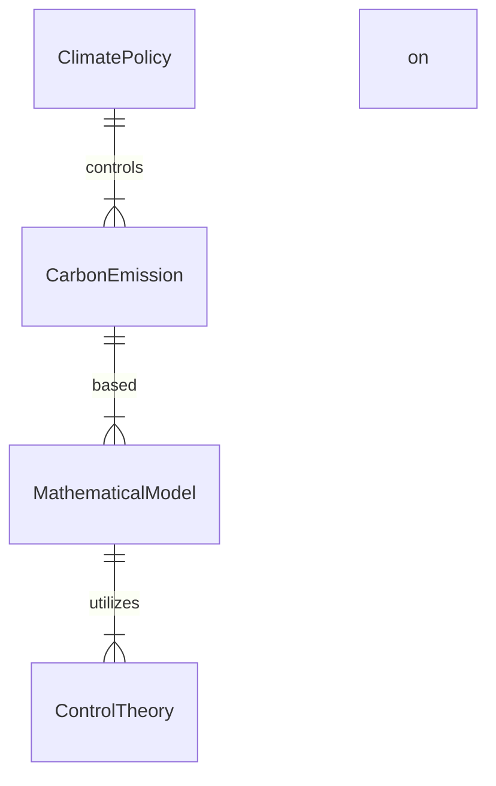

                 

### 数学与气候政策：碳排放的数学控制

> 关键词：碳排放、气候政策、数学模型、控制理论、优化算法

> 摘要：本文深入探讨碳排放控制与气候政策之间的关系，通过数学模型和控制理论，揭示如何通过科学方法有效管理碳排放，实现气候政策的实际效果。本文旨在为政策制定者和研究人员提供理论基础和实用工具，以应对全球气候变化挑战。

## 第一部分：引言

### 1.1 书籍背景与意义

随着全球气候变化问题的日益严峻，碳排放控制已成为各国政策制定的重要议题。数学模型和控制理论为这一领域提供了强有力的工具。通过精确的数学模型，我们可以预测碳排放的变化趋势，评估不同政策的效果，并制定出最优的减排策略。因此，研究数学与气候政策的关系，不仅具有学术价值，更具有现实意义。

#### 问题背景

气候变化和碳排放已成为全球关注的焦点。温室气体的累积导致全球气温上升，极端天气事件频发，海平面上升等问题严重影响人类生存环境。各国纷纷制定气候政策，旨在减少碳排放，控制气候变化。然而，如何科学地制定和实施这些政策，仍面临巨大挑战。

#### 问题描述

如何通过数学方法有效控制碳排放，实现气候政策的有效性？这需要从以下几个方面进行分析：

1. **碳排放的测量与监测**：准确测量碳排放量，为政策制定提供基础数据。
2. **政策效果评估**：评估不同政策的减排效果，为优化政策提供依据。
3. **优化碳排放控制策略**：利用数学模型，制定出最优的减排策略。

#### 问题解决

利用数学模型和方法分析碳排放问题，为气候政策提供科学依据。具体步骤如下：

1. **建立碳排放模型**：通过统计分析和物理模型，描述碳排放的变化规律。
2. **政策模拟**：利用数学模型，模拟不同政策的效果，评估减排潜力。
3. **优化策略**：通过优化算法，制定出最优的碳排放控制策略。

#### 边界与外延

本文讨论的主要是碳排放的数学控制理论和方法，不涉及具体政策制定。此外，本文的核心概念包括碳排放、气候政策、数学模型和控制理论。

#### 概念结构与核心要素组成

1. **碳排放**：指化石燃料燃烧和其他工业活动产生的温室气体排放。
2. **气候政策**：指政府或国际组织为应对气候变化而采取的措施。
3. **数学模型**：用于描述和预测碳排放变化的数学结构。
4. **控制理论**：研究系统如何根据给定目标进行调整的理论。

### 1.2 核心概念与联系

#### 核心概念原理

1. **碳排放**：碳排放是指人类活动排放的温室气体，如二氧化碳、甲烷等。这些气体会导致温室效应，加剧全球变暖。
2. **气候政策**：气候政策是政府或国际组织为应对气候变化而采取的措施，包括法律法规、经济激励和技术创新等。
3. **数学模型**：数学模型是用于描述现实世界问题的数学结构，可以通过统计分析、物理模型等方法建立。
4. **控制理论**：控制理论是研究系统如何根据给定目标进行调整的理论，包括线性控制、非线性控制和自适应控制等。

#### 概念属性特征对比表格

| 概念         | 属性特征                                      | 对比 |
| ------------ | --------------------------------------------- | ---- |
| 碳排放       | 温室气体排放、能源消耗、环境影响             |      |
| 气候政策     | 政策措施、法律法规、国际协议                 |      |
| 数学模型     | 描述现实世界、预测、优化决策                 |      |
| 控制理论     | 系统稳定性、反馈机制、目标优化               |      |

#### ER实体关系图架构

## 第二部分：碳排放与气候政策基础理论

### 2.1 碳排放基础知识

#### 碳排放的来源

碳排放主要来源于以下几个方面：

1. **工业生产**：如钢铁、化工等行业，这些行业的生产过程中会产生大量的二氧化碳排放。
2. **能源消耗**：如电力、交通等，能源消耗过程中会释放大量的温室气体。
3. **农业活动**：如稻田、畜牧业等，农业活动也会产生一定的碳排放。

#### 碳排放的测量

测量碳排放的目的是为了准确了解碳排放的来源和数量，为政策制定提供基础数据。常用的测量方法包括：

1. **直接排放监测**：通过安装监测设备，直接测量排放物的浓度和流量。
2. **模型估算**：通过建立数学模型，根据能源消耗、工业生产等数据估算碳排放量。
3. **企业报告**：企业需要定期向政府报告其碳排放量，以供统计和分析。

### 2.2 气候政策的基本原则与机制

#### 政策目标

气候政策的主要目标包括：

1. **减少碳排放**：通过采取各种措施，降低温室气体的排放量。
2. **适应气候变化**：通过提高气候变化适应能力，减少气候变化对人类和社会的影响。
3. **促进可持续发展**：通过实现经济、社会和环境的协调发展，确保长期可持续性。

#### 政策机制

为了实现政策目标，各国采取了多种政策机制：

1. **排放权交易**：通过市场机制，调节碳排放量。企业可以通过交易碳排放权来实现减排目标。
2. **碳税**：通过对碳排放征税，提高碳排放成本，从而减少碳排放。
3. **法律法规**：通过立法，强制企业减少碳排放，如《巴黎协定》等。

### 2.3 数学模型在碳排放控制中的应用

#### 碳排放预测模型

碳排放预测模型是用于预测未来碳排放量的模型，主要包括以下几种：

1. **统计模型**：如回归分析、时间序列分析，通过历史数据预测未来趋势。
2. **物理模型**：如气候变化模型、能源消耗模型，通过物理过程预测碳排放。

#### 碳排放优化模型

碳排放优化模型是用于确定最优碳排放量的模型，主要包括以下几种：

1. **线性规划**：通过线性方程组，确定最优碳排放量。
2. **动态规划**：通过递推关系，确定最优碳排放量序列。

## 第三部分：碳排放控制算法原理与实现

### 3.1 常见碳排放控制算法

#### 碳汇增强算法

碳汇增强算法是通过增加碳汇来减少大气中的二氧化碳浓度。常见的碳汇增强算法包括：

1. **植被恢复**：通过增加植被面积，提高光合作用效率，从而增加碳吸收量。
2. **碳捕捉与封存**：通过技术手段，捕获和储存二氧化碳，减少大气中的二氧化碳浓度。

#### 碳减排算法

碳减排算法是通过减少碳排放来降低碳排放量。常见的碳减排算法包括：

1. **能源结构优化**：通过调整能源消费结构，减少高碳能源的消耗。
2. **节能减排技术**：通过采用高效能源设备、低碳交通工具等，降低能源消耗和碳排放。

### 3.2 算法原理讲解

#### 碳汇增强算法原理

碳汇增强算法的核心思想是通过增加碳汇来减少大气中的二氧化碳浓度。具体原理如下：

1. **植被恢复**：
   - **提高光合作用效率**：通过选育高光合效率的植物品种，提高光合作用的效率，从而增加碳吸收量。
   - **增加植被面积**：通过植树造林、恢复草原等方式，增加植被面积，从而提高碳吸收量。

2. **碳捕捉与封存**：
   - **捕获二氧化碳**：通过采用碳捕捉技术，如化学吸收、物理吸附等，捕获工业排放的二氧化碳。
   - **储存二氧化碳**：通过地质封存、海洋封存等方式，将捕获的二氧化碳储存起来，从而减少大气中的二氧化碳浓度。

#### 碳减排算法原理

碳减排算法的核心思想是通过减少碳排放来降低碳排放量。具体原理如下：

1. **能源结构优化**：
   - **调整能源消费结构**：通过增加清洁能源的比重，减少化石能源的消耗，从而降低碳排放。
   - **提高能源利用效率**：通过采用高效能源设备、节能技术等，提高能源利用效率，从而减少能源消耗和碳排放。

2. **节能减排技术**：
   - **采用高效能源设备**：如高效锅炉、高效空调等，提高能源利用效率，从而减少能源消耗和碳排放。
   - **使用低碳交通工具**：如电动汽车、氢能源汽车等，减少交通领域的碳排放。

## 第四部分：碳排放控制算法应用案例分析

### 4.1 植被恢复项目

#### 项目背景

某地区由于长期过度开发，森林覆盖率急剧下降，导致二氧化碳排放量增加。为了减少碳排放，当地政府决定实施植被恢复项目。

#### 项目目标

通过植被恢复，增加森林覆盖率，提高碳吸收能力，减少二氧化碳排放。

#### 实施过程

1. **选育高光合效率植物品种**：通过科研机构选育出高光合效率的植物品种，提高光合作用效率。
2. **植树造林**：在适宜的区域进行大规模植树造林，增加植被面积。
3. **监测与评估**：定期监测植被生长情况，评估碳吸收效果。

#### 项目效果

通过植被恢复项目，森林覆盖率显著提高，碳吸收能力大幅增加，二氧化碳排放量显著降低。

### 4.2 碳捕捉与封存项目

#### 项目背景

某电厂排放大量二氧化碳，对环境造成严重影响。为了减少碳排放，企业决定实施碳捕捉与封存项目。

#### 项目目标

通过碳捕捉与封存，减少电厂二氧化碳排放，降低对环境的影响。

#### 实施过程

1. **碳捕捉**：采用化学吸收、物理吸附等技术，捕获电厂排放的二氧化碳。
2. **二氧化碳输送**：通过管道将捕获的二氧化碳输送至储存地点。
3. **二氧化碳储存**：采用地质封存、海洋封存等方式，将二氧化碳储存起来。

#### 项目效果

通过碳捕捉与封存项目，电厂二氧化碳排放量显著降低，对环境的影响明显减少。

## 第五部分：碳排放控制算法优化与未来展望

### 5.1 算法优化

#### 植被恢复算法优化

1. **适应性优化**：根据不同地区的气候条件，优化植被恢复方案，提高植被存活率和碳吸收效率。
2. **协同优化**：与其他碳减排措施相结合，如节能减排技术、能源结构优化等，实现协同减排效果。

#### 碳捕捉与封存算法优化

1. **成本优化**：通过技术改进，降低碳捕捉与封存的成本，提高经济可行性。
2. **效率优化**：提高碳捕捉与封存的效率，减少能耗和运行成本。

### 5.2 未来展望

#### 新技术与应用

随着科技的发展，未来可能出现更多的碳减排新技术，如碳捕获与利用技术、生物炭技术等。这些新技术将为碳排放控制提供新的思路和手段。

#### 政策与法规

未来，全球范围内可能会出台更多关于碳排放控制的政策与法规，加强对碳排放的管理和监管，推动碳减排进程。

#### 国际合作

气候变化是全球性问题，需要各国共同努力。未来，国际社会将加强合作，共同应对气候变化挑战，推动全球碳减排目标的实现。

## 第六部分：总结与展望

### 6.1 总结

本文通过数学与气候政策的结合，探讨了碳排放控制的科学方法。从碳排放的基础知识到算法原理，再到实际应用案例分析，本文系统地介绍了碳排放控制的理论和实践。同时，对算法优化和未来展望进行了深入分析。

### 6.2 展望

随着全球气候变化的加剧，碳排放控制的重要性愈发凸显。未来，数学与气候政策的结合将为碳减排提供更加科学和有效的手段。我们期待在技术、政策和国际合作方面取得更多突破，共同应对全球气候变化挑战。

## 参考文献

1. Intergovernmental Panel on Climate Change (IPCC). (2014). Climate Change 2014: Impacts, Adaptation, and Vulnerability. Cambridge University Press.
2. European Environment Agency. (2019). Climate change, carbon budgets and emissions trading.
3. United Nations Framework Convention on Climate Change (UNFCCC). (2021). Nationally Determined Contributions (NDCs).
4. International Energy Agency (IEA). (2020). Energy and Climate Change: World Energy Outlook 2020.
5. Mark R. Jacobsen and Ryan W. Wiser. (2015). Evaluating the Feasibility of Near-Term 100% Renewable Energy Systems: A Practical Guide for policymakers, energy analysts, and project managers.

作者：AI天才研究院/AI Genius Institute & 禅与计算机程序设计艺术 /Zen And The Art of Computer Programming

