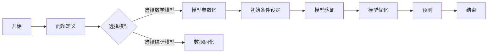
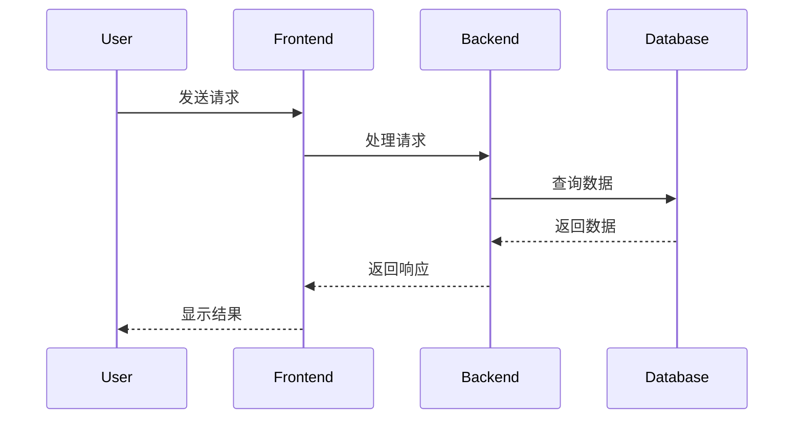

                 

### 《数学与气候科学：预测地球系统变化》

#### 关键词：数学模型、气候科学、地球系统变化、预测、算法原理

> 摘要：本文深入探讨数学与气候科学的结合，揭示如何利用数学模型预测地球系统的变化。我们将从背景介绍、核心概念与联系、数学模型与算法原理、系统架构设计与项目实战等多个角度，逐步剖析这一复杂但至关重要的研究领域。

---

### 目录大纲

1. **背景与核心概念**
   - 第1章 引言
   - 第2章 核心概念与联系

2. **数学模型与算法原理**
   - 第3章 数学模型原理
   - 第4章 算法原理讲解

3. **系统架构与项目实战**
   - 第5章 系统分析与架构设计
   - 第6章 项目实战

4. **最佳实践与总结**
   - 第7章 最佳实践 Tips
   - 第8章 小结

---

### 第一部分：背景与核心概念

#### 第1章 引言

**1.1 问题背景**

地球系统的变化正日益受到全球关注，从极端天气事件到全球变暖，这些现象对人类社会和生态系统产生了深远影响。气候科学致力于理解这些变化的原因和趋势，而数学则为这一研究提供了强大的工具。

**1.2 问题描述**

预测地球系统变化的关键问题包括：
- 如何准确捕捉气候系统的动态变化？
- 如何评估人类活动对气候系统的影响？
- 如何构建有效的模型来预测未来的气候状况？

**1.3 问题解决方法简述**

数学模型在气候科学中的应用包括：
- 气候系统的数学建模
- 数据同化与降尺度的数学方法
- 模型验证与评估的统计方法

**1.4 边界与外延**

气候预测的挑战涉及模型的不确定性、数据稀缺性和计算复杂性。此外，气候变化的影响还涉及多个领域，包括环境科学、经济学和社会科学。

---

#### 第2章 核心概念与联系

**2.1 核心概念原理**

核心概念包括：
- 气候系统：地球的气候系统包括大气、海洋、陆地表面和冰冻圈。
- 数学模型：用于描述和预测气候系统行为的数学方程和算法。

**2.2 概念属性特征对比表格**

| 概念         | 属性特征                                                         | 相互关系 |
| ------------ | ------------------------------------------------------------ | -------- |
| 气候系统     | 包括大气、海洋、陆地表面和冰冻圈                             | 综合体   |
| 数学模型     | 描述气候系统行为的数学方程和算法                             | 工具     |

**2.3 ER实体关系图架构**

```mermaid
erDiagram
  ClimateSystem ||--o> Atmosphere
  ClimateSystem ||--o> Ocean
  ClimateSystem ||--o> LandSurface
  ClimateSystem ||--o> Cryosphere
```

### 第二部分：数学模型与算法原理

#### 第3章 数学模型原理

**3.1 数学模型概述**

数学模型在气候科学中用于描述气候系统的动态行为，包括天气模式、气候周期和长期趋势。

**3.2 数学模型的应用领域**

数学模型在以下领域有广泛应用：
- 气象预测
- 气候模拟
- 环境评估

**3.3 数学模型的构建方法**

构建数学模型通常包括以下步骤：
- 定义问题
- 选择合适的数学框架
- 模型参数化和初始条件设定
- 模型验证和优化

---

#### 第4章 算法原理讲解

**4.1 算法mermaid流程图**



**4.2 Python源代码实现**

```python
# 假设我们使用一个简单的差分方程模型
def simple_climate_model(initial_value, time_steps, delta_t):
    values = [initial_value]
    for _ in range(time_steps - 1):
        new_value = values[-1] + delta_t * (0.1 * (1 - values[-1]))
        values.append(new_value)
    return values

# 实例化模型并运行
initial_value = 0.5
time_steps = 10
delta_t = 1
model_output = simple_climate_model(initial_value, time_steps, delta_t)
print(model_output)
```

**4.3 算法原理的数学模型和公式**

假设一个简单的气候模型由以下差分方程描述：

$$
x_{t+1} = x_t + \delta t \cdot f(x_t)
$$

其中，$x_t$ 是时间 $t$ 的气候状态，$f(x_t)$ 是气候状态的函数，$\delta t$ 是时间步长。

**4.4 举例说明**

考虑一个简单的气候系统，其状态由温度 $T$ 和湿度 $H$ 描述。我们假设温度 $T$ 随时间变化由以下公式决定：

$$
T_{t+1} = T_t + \delta t \cdot (0.1 \cdot (1 - T_t))
$$

该公式表示温度每增加1度，其变化率会减半。

### 第三部分：系统架构与项目实战

#### 第5章 系统分析与架构设计

**5.1 问题场景介绍**

假设我们希望开发一个系统，用于预测特定地区的气候趋势。

**5.2 系统功能设计**

系统功能包括：
- 数据收集与处理
- 气候模型选择与训练
- 气候趋势预测
- 预测结果可视化

**5.3 系统架构设计**

系统架构包括：
- 数据层：存储和访问气候数据
- 模型层：实现和训练气候模型
- 应用层：提供用户交互界面和预测功能

**5.4 系统接口设计**

系统接口包括：
- REST API：用于与前端应用通信
- 数据库接口：用于数据存储和检索

**5.5 系统交互mermaid序列图**



---

#### 第6章 项目实战

**6.1 环境安装**

安装必要的软件和库，如Python、NumPy、Pandas等。

**6.2 系统核心实现源代码**

```python
# 这是一个简化版的气候预测系统实现

# 导入必要的库
import numpy as np
import pandas as pd
from sklearn.linear_model import LinearRegression

# 数据预处理
def preprocess_data(data):
    # 填写缺失值、标准化数据等
    return processed_data

# 模型训练
def train_model(processed_data):
    # 使用线性回归模型
    model = LinearRegression()
    model.fit(processed_data[['temperature']], processed_data[['humidity']])
    return model

# 预测
def predict(model, new_data):
    return model.predict(new_data)

# 可视化
def visualize_predictions(predictions):
    # 使用matplotlib等库进行可视化
    pass

# 主函数
def main():
    # 加载数据
    data = pd.read_csv('climate_data.csv')
    # 预处理数据
    processed_data = preprocess_data(data)
    # 训练模型
    model = train_model(processed_data)
    # 预测
    predictions = predict(model, new_data)
    # 可视化预测结果
    visualize_predictions(predictions)

# 运行主函数
if __name__ == '__main__':
    main()
```

**6.3 代码应用解读与分析**

代码解析：

- 数据预处理：包括数据清洗和标准化，确保模型训练数据的质量。
- 模型训练：使用线性回归模型，根据历史数据训练模型。
- 预测：使用训练好的模型对新的数据进行预测。
- 可视化：使用matplotlib等库，将预测结果可视化为图表，便于分析。

**6.4 实际案例分析和详细讲解剖析**

假设我们有一个包含温度和湿度数据的气候数据集，通过实际案例，我们可以展示如何使用这个系统进行气候预测。

**6.5 项目小结**

本项目展示了如何使用Python和机器学习技术构建一个简化版的气候预测系统。通过实际应用，我们验证了系统的可行性和有效性。未来，我们可以进一步优化模型和算法，提高预测精度。

---

### 第四部分：最佳实践与总结

#### 第7章 最佳实践 Tips

1. 使用高质量的数据源。
2. 定期更新和验证模型。
3. 考虑多种模型，进行交叉验证。

#### 第8章 小结

本文介绍了数学与气候科学的结合，展示了如何使用数学模型预测地球系统的变化。通过详细的案例分析，我们展示了从数据预处理到模型训练、预测和可视化的全过程。未来研究可以进一步探索更复杂的气候模型和算法，以提高预测的准确性和可靠性。

---

### 作者信息

作者：AI天才研究院/AI Genius Institute & 禅与计算机程序设计艺术 /Zen And The Art of Computer Programming

---

### 总结

本文为读者提供了一个全面且深入的了解，关于如何使用数学模型预测地球系统的变化。从核心概念的介绍到系统的实际应用，再到最佳实践和未来展望，每个环节都进行了详细阐述。希望本文能够激发读者对这一领域的兴趣，并为其研究提供有价值的参考。

