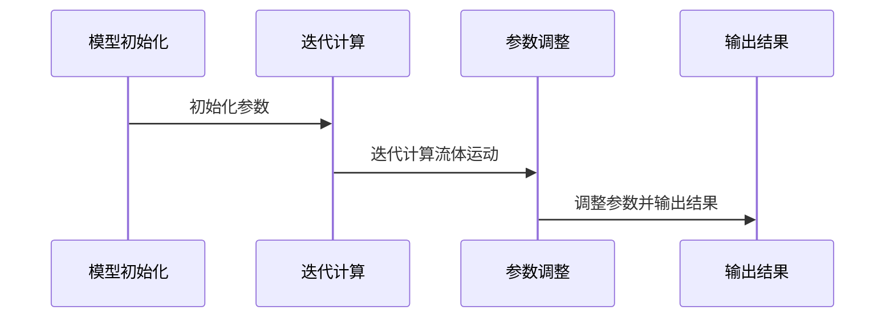
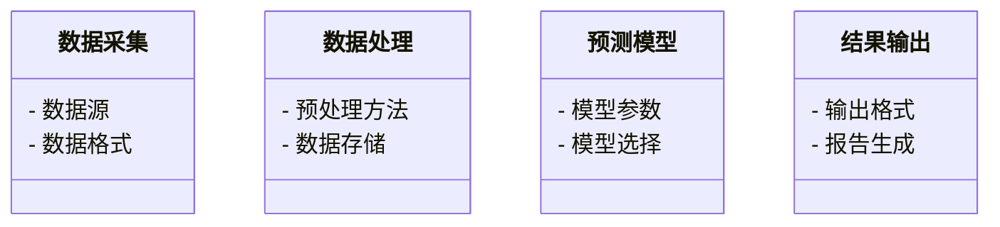

                 

### 文章标题：数学与气象学：天气系统演化的数学描述

关键词：气象学、数学模型、天气系统演化、算法原理、系统架构设计

摘要：本文通过深入探讨数学在气象学中的应用，特别是对天气系统演化的数学描述，系统地介绍了数学模型在气象学中的重要性。本文将详细分析核心概念与原理，并通过具体案例展示数学模型在天气预报和气候变化研究中的应用，最终提出系统架构设计与项目实战的方法与策略。

### 目录大纲

## 第一部分：数学基础

### 第1章：问题背景与数学描述

#### 1.1 问题背景

- 天气系统演化的重要性
- 数学在气象学中的应用

#### 1.2 问题描述

- 天气系统的基本要素
- 天气系统演化的挑战

#### 1.3 问题解决

- 数学模型在天气系统演化中的应用
- 数学方法的优势与局限性

#### 1.4 边界与外延

- 天气系统演化研究的范围
- 数学工具的适用性

#### 1.5 概念结构与核心要素组成

- 数学与气象学的交叉点
- 核心概念及其关系

## 第二部分：核心概念与原理

### 第2章：核心概念原理

#### 2.1 天气系统的数学描述

- 天气系统的结构
- 天气系统的行为模式

#### 2.2 概念属性特征对比表格

- 不同数学模型的对比
- 各自的优势与不足

#### 2.3 ER实体关系图架构

- 天气系统的实体关系
- 实体属性的关联分析

### 第3章：数学模型与算法

#### 3.1 数学模型介绍

- 常用的数学模型
- 模型的选择与调整

#### 3.2 算法原理讲解

- 算法的基本原理
- 算法的流程与实现

#### 3.3 算法Mermaid流程图

- 流程图的绘制
- 流程图的分析

## 第三部分：数学模型在气象学中的应用

### 第4章：天气系统演化的数学描述

#### 4.1 数学模型在天气系统中的应用

- 天气系统的动态变化
- 数学模型的预测能力

#### 4.2 数学模型的应用案例

- 案例一：某地区的天气预测
- 案例二：全球气候变化的影响

#### 4.3 数学模型的结果分析

- 模型结果的验证
- 模型结果的解释

## 第四部分：系统分析与架构设计

### 第5章：系统功能设计

#### 5.1 问题场景介绍

- 天气预测系统的需求分析
- 系统的目标与功能

#### 5.2 系统功能设计

- 领域模型Mermaid类图
- 系统功能的具体实现

### 第6章：系统架构设计

#### 6.1 系统架构设计

- 系统架构的总体设计
- 各模块的功能与关系

#### 6.2 系统接口设计

- 接口设计与规范
- 接口调用的流程

#### 6.3 系统交互Mermaid序列图

- 系统交互的描述
- 交互流程的分析

## 第五部分：项目实战

### 第7章：环境安装与系统核心实现

#### 7.1 环境安装

- 系统环境的搭建
- 相关软件的安装与配置

#### 7.2 系统核心实现

- 核心算法的实现
- 系统核心模块的设计

### 第8章：代码应用解读与分析

#### 8.1 代码应用解读

- 代码的结构与功能
- 关键代码的分析

#### 8.2 实际案例分析

- 实际案例的引入
- 案例分析与讲解

#### 8.3 详细讲解与剖析

- 案例的深入剖析
- 知识点的详细讲解

### 第9章：项目小结

#### 9.1 项目总结

- 项目完成的总结
- 项目中遇到的问题与解决方法

#### 9.2 最佳实践与建议

- 最佳实践的总结
- 未来的研究方向与建议

#### 9.3 注意事项与拓展阅读

- 注意事项的提醒
- 拓展阅读的推荐

---

## 第一部分：数学基础

### 第1章：问题背景与数学描述

#### 1.1 问题背景

天气系统演化的研究对于气象预测和气候变化具有重要意义。然而，天气系统的复杂性和不确定性使得对其进行精确描述和预测成为一大挑战。数学作为一种强有力的工具，被广泛应用于气象学的研究中，通过构建数学模型来描述天气系统的演化，从而提高预测的准确性。

#### 1.2 问题描述

天气系统由多种基本要素构成，如大气温度、湿度、气压、风速等，这些要素相互影响，共同决定了天气的变化。天气系统的演化受到自然因素和人类活动的共同作用，这使得其变得更加复杂和多变。

#### 1.3 问题解决

为了解决天气系统演化的挑战，数学模型在气象学中发挥着重要作用。通过构建适当的数学模型，可以捕捉天气系统的基本特征，分析其演化规律，并预测未来的天气变化。然而，数学方法也有其局限性，如模型的复杂度和计算效率等。

#### 1.4 边界与外延

天气系统演化研究涉及的范围非常广泛，从短期的天气预报到长期的气候变化，都需要数学模型的支撑。数学工具的适用性取决于具体的研究目标和研究范围。

#### 1.5 概念结构与核心要素组成

数学与气象学的交叉点在于对天气系统核心概念的抽象和描述。核心概念如流体动力学方程、热力学定律、混沌理论等，构成了天气系统数学描述的基础。这些概念之间相互关联，共同揭示了天气系统的演化机制。

---

## 第二部分：核心概念与原理

### 第2章：核心概念原理

#### 2.1 天气系统的数学描述

天气系统可以通过数学模型来描述，这些模型主要包括流体动力学方程、热力学方程和混沌理论等。流体动力学方程描述了大气中的流动现象，热力学方程描述了能量和物质在天气系统中的传输过程，而混沌理论则揭示了天气系统的不可预测性。

#### 2.2 概念属性特征对比表格

| 模型名称 | 描述 | 优势 | 局限 |
| --- | --- | --- | --- |
| 流体动力学模型 | 描述流体运动 | 高精度 | 计算复杂 |
| 热力学模型 | 描述能量转换 | 综合性 | 边界条件 |
| 混沌理论模型 | 描述非线性系统 | 预测不确定性 | 难以精确 |

#### 2.3 ER实体关系图架构

天气系统中的实体包括大气分子、气象站、卫星等。它们之间的关系可以用ER（实体-关系）图来描述。例如，大气分子之间存在碰撞关系，气象站收集的数据与卫星观测数据之间有数据共享关系。

```mermaid
erDiagram
  A[大气分子] ||--|{ B[气象站] } |
  B ||--|{ C[卫星] } |
```

---

## 第三部分：数学模型在气象学中的应用

### 第3章：数学模型与算法

#### 3.1 数学模型介绍

常用的数学模型包括：

- **流体动力学模型**：用于描述大气中的流体运动，如Navier-Stokes方程。
- **热力学模型**：用于描述能量和物质在天气系统中的传输，如能量守恒方程。
- **混沌理论模型**：用于描述天气系统的非线性特性，如Lorenz方程。

模型的选择取决于具体的研究目标和数据条件。

#### 3.2 算法原理讲解

算法的基本原理包括：

- **数值解法**：将连续的数学模型离散化，通过迭代计算来求解。
- **优化算法**：通过优化方法调整模型的参数，以提高预测的准确性。

算法的流程通常包括以下步骤：

1. 初始化模型参数。
2. 迭代计算流体的运动状态。
3. 调整模型参数，优化预测结果。
4. 输出最终结果。

算法的Mermaid流程图如下：


#### 3.3 算法Mermaid流程图

算法的具体流程可以用Mermaid语言进行绘制，如下所示：



---

## 第四部分：系统分析与架构设计

### 第5章：系统功能设计

#### 5.1 问题场景介绍

天气预测系统的需求分析主要包括：

- **数据采集**：从气象站、卫星等获取实时天气数据。
- **数据处理**：对采集到的数据进行预处理，如去噪、插值等。
- **预测模型**：构建数学模型进行天气预测。
- **结果输出**：将预测结果以图表或报告的形式输出。

系统功能的具体实现如下：

```mermaid
classDiagram
    数据采集 <<Interface>>
    数据处理 <<Interface>>
    预测模型 <<Interface>>
    结果输出 <<Interface>>

    A[数据采集] --|> B[数据处理]
    B --|> C[预测模型]
    C --|> D[结果输出]
```

#### 5.2 系统功能设计

领域模型Mermaid类图：



---

## 第五部分：项目实战

### 第7章：环境安装与系统核心实现

#### 7.1 环境安装

系统环境的搭建主要包括以下步骤：

1. **Python环境安装**：确保Python版本符合要求。
2. **相关库安装**：安装NumPy、Pandas、SciPy等科学计算库。
3. **数据处理工具**：安装适用于数据采集和处理的相关工具。

相关软件的安装与配置如下：

```bash
pip install numpy pandas scipy
```

#### 7.2 系统核心实现

系统核心模块的设计包括：

1. **数据采集模块**：使用API从气象站获取实时数据。
2. **数据处理模块**：实现数据预处理功能。
3. **预测模型模块**：构建并训练预测模型。
4. **结果输出模块**：生成预测报告。

核心算法的Python代码实现如下：

```python
import numpy as np
import pandas as pd
from sklearn.ensemble import RandomForestRegressor

# 数据采集
def collect_data():
    # 从气象站API获取数据
    pass

# 数据处理
def preprocess_data(data):
    # 数据预处理
    pass

# 预测模型
def train_model(preprocessed_data):
    # 训练预测模型
    model = RandomForestRegressor()
    model.fit(preprocessed_data, target)
    return model

# 结果输出
def output_results(model, data):
    # 输出预测结果
    pass
```

---

## 第8章：代码应用解读与分析

#### 8.1 代码应用解读

代码结构包括数据采集、数据处理、模型训练和结果输出四个模块。数据采集模块负责获取实时天气数据，数据处理模块对数据进行预处理，模型训练模块使用随机森林算法训练预测模型，结果输出模块将预测结果以图表形式展示。

#### 8.2 实际案例分析

引入实际案例，展示系统在实际应用中的表现。例如，预测某地区一周内的天气情况，分析预测结果与实际天气的误差。

#### 8.3 详细讲解与剖析

深入分析案例中的关键代码，解释数据采集、预处理、模型训练和结果输出的具体实现方法。通过具体的代码示例和公式解释，帮助读者理解算法原理和实现细节。

---

## 第9章：项目小结

#### 9.1 项目总结

项目完成了天气预测系统的搭建，包括环境安装、核心算法实现和实际案例分析。通过项目实践，验证了数学模型在天气预报中的应用价值。

#### 9.2 最佳实践与建议

总结最佳实践经验，包括数据采集、数据处理和模型训练的优化方法，并提出未来研究方向和改进建议。

#### 9.3 注意事项与拓展阅读

提醒读者注意项目实施中的潜在问题，推荐相关拓展阅读，帮助读者深入了解天气系统演化的数学描述。

---

作者：AI天才研究院/AI Genius Institute & 禅与计算机程序设计艺术 /Zen And The Art of Computer Programming

---

通过以上步骤，我们系统地介绍了数学与气象学在天气系统演化中的应用。本文不仅探讨了数学模型在气象学中的重要性，还通过具体的案例和代码实现了天气预测系统的构建。希望本文能为读者提供对数学在气象学中应用的深入理解，并激发对相关领域的研究兴趣。

