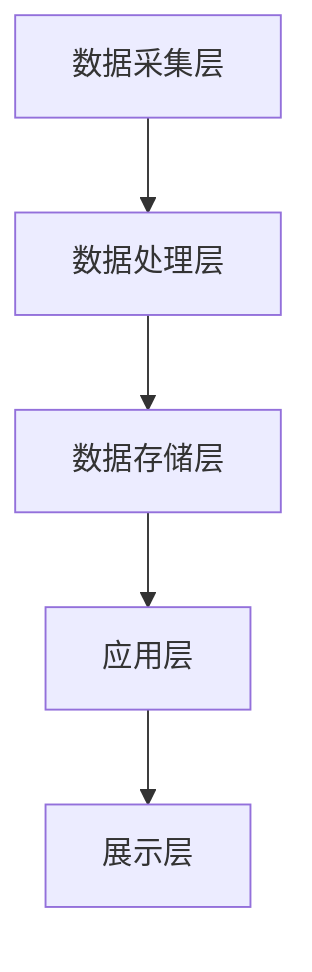
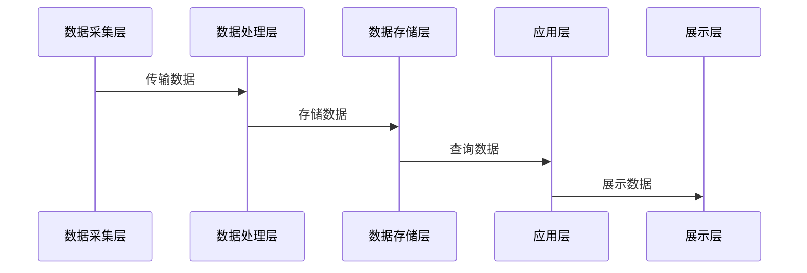

                 

### 数学与水文学：水资源管理的数学模型

水资源管理是保障社会经济发展、生态环境保护和人民生活质量的重要方面。然而，随着全球人口增长、城市化进程加快以及气候变化等问题的加剧，水资源短缺和水环境污染问题愈发严重。因此，科学的水资源管理变得尤为重要。数学模型作为一种强大的工具，可以有效地帮助水资源管理者进行决策分析、优化资源配置和预测未来趋势。

本文将深入探讨水资源管理中的数学模型，从背景介绍、核心概念与联系、模型方法、数学模型与公式讲解、系统分析与架构设计、项目实战到最佳实践与拓展阅读，全面阐述数学模型在水文学中的应用和意义。

### 关键词

- **水资源管理**：涉及水资源分配、利用和保护的活动。
- **数学模型**：用于描述和预测水资源系统行为的数学结构。
- **线性规划**：优化水资源分配问题的一种数学方法。
- **非线性规划**：解决复杂水资源管理问题的工具。
- **模拟模型**：用于模拟水资源系统动态行为的工具。
- **系统分析与架构设计**：确保水资源管理系统的有效性和可扩展性。
- **项目实战**：通过实际案例展示数学模型的应用。
- **最佳实践**：总结水资源管理的经验和建议。

### 摘要

本文通过系统化的结构，介绍了水资源管理中的数学模型。首先，分析了水资源管理的重要性及其面临的挑战。随后，详细讲解了水资源管理中的核心概念与联系，包括水资源平衡方程和水资源利用效率等。接着，介绍了水资源管理中常用的数学模型方法，如线性规划、非线性规划和模拟模型。通过LaTeX格式详细解释了相关数学模型和公式，并结合Python代码进行了实际演示。此外，本文还探讨了水资源管理系统的设计与实现，并通过具体项目实战展示了数学模型的应用。最后，总结最佳实践，为水资源管理者提供参考和建议。

### 目录大纲设计思考过程

在设计《数学与水文学：水资源管理的数学模型》的目录大纲时，我们需要进行以下步骤，以确保文章的逻辑性和完整性：

#### 1. 分析书籍主题和内容结构

首先，我们需要全面理解书籍的主题和内容。该书主要探讨水资源管理中的数学模型，涉及水资源管理的各个方面，包括理论基础、模型方法、应用案例等。目录结构应围绕这些方面展开。

#### 2. 确定章节主题

根据书籍内容，我们确定了以下主要章节主题：

- **背景介绍**：介绍水资源管理的重要性、水资源管理面临的挑战以及数学模型在水资源管理中的应用背景。
- **核心概念与联系**：阐述水资源管理中涉及的关键概念，如水资源平衡方程、水资源利用效率等，并通过对比表格和实体关系图展示概念之间的联系。
- **模型方法**：详细讲解水资源管理的常用数学模型，包括线性规划、非线性规划、模拟模型等，使用mermaid流程图和Python代码阐述模型原理。
- **数学模型与公式讲解**：运用LaTeX格式详细解释数学模型和公式，并通过举例说明使其通俗易懂。
- **系统分析与架构设计**：分析水资源管理系统的功能需求，设计系统架构，包括领域模型类图和系统架构图。
- **项目实战**：通过具体案例展示水资源管理数学模型的应用，包括环境安装、核心实现源代码和实际案例分析。
- **最佳实践与拓展阅读**：总结项目经验，提出实践建议，并提供拓展阅读资源。

#### 3. 设计目录结构

基于以上章节主题，我们设计了以下目录结构：

```markdown
----------------------------------------------------------------
# 第一部分：背景介绍

# 第1章：水资源管理的重要性与挑战

## 1.1 水资源管理的重要性
### 1.1.1 水资源的定义与分布
### 1.1.2 水资源管理的挑战
### 1.1.3 数学模型在水文学中的应用

## 1.2 水资源管理中的核心概念
### 1.2.1 水资源平衡方程
### 1.2.2 水资源利用效率
### 1.2.3 水资源分配与优化

## 1.3 本章小结

----------------------------------------------------------------

# 第二部分：模型方法

# 第2章：水资源管理的数学模型概述

## 2.1 线性规划模型
### 2.1.1 线性规划的基本概念
### 2.1.2 线性规划的应用案例
### 2.1.3 线性规划模型的数学公式与Python代码实现

## 2.2 非线性规划模型
### 2.2.1 非线性规划的基本概念
### 2.2.2 非线性规划的应用案例
### 2.2.3 非线性规划模型的数学公式与Python代码实现

## 2.3 模拟模型
### 2.3.1 模拟模型的基本概念
### 2.3.2 模拟模型的应用案例
### 2.3.3 模拟模型的数学公式与Python代码实现

## 2.4 本章小结

----------------------------------------------------------------

# 第三部分：数学模型与公式讲解

# 第3章：水资源管理数学模型详解

## 3.1 水资源平衡方程的LaTeX公式与讲解
$$
Q_{in} - Q_{out} = \Delta V
$$

### 3.1.1 水资源平衡方程的意义
### 3.1.2 水资源平衡方程的应用
### 3.1.3 水资源平衡方程的Python代码实现

## 3.2 水资源利用效率的LaTeX公式与讲解
$$
\eta = \frac{Q_{use}}{Q_{in}}
$$

### 3.2.1 水资源利用效率的定义
### 3.2.2 水资源利用效率的影响因素
### 3.2.3 水资源利用效率的优化策略

## 3.3 本章小结

----------------------------------------------------------------

# 第四部分：系统分析与架构设计

# 第4章：水资源管理系统设计

## 4.1 问题场景介绍
### 4.1.1 水资源管理系统的目标
### 4.1.2 水资源管理系统的功能需求

## 4.2 系统架构设计
### 4.2.1 系统架构图
### 4.2.2 系统模块划分
### 4.2.3 系统接口设计

## 4.3 系统交互设计
### 4.3.1 系统交互流程
### 4.3.2 系统交互序列图

## 4.4 本章小结

----------------------------------------------------------------

# 第五部分：项目实战

# 第5章：水资源管理项目实战

## 5.1 环境安装
### 5.1.1 系统环境准备
### 5.1.2 软件安装与配置

## 5.2 系统核心实现
### 5.2.1 核心算法源代码
### 5.2.2 算法实现解析

## 5.3 实际案例分析
### 5.3.1 案例背景
### 5.3.2 案例分析
### 5.3.3 案例总结

## 5.4 项目小结

----------------------------------------------------------------

# 第六部分：最佳实践与拓展阅读

# 第6章：最佳实践与拓展阅读

## 6.1 最佳实践
### 6.1.1 实践经验总结
### 6.1.2 实践建议

## 6.2 小结
### 6.2.1 文章总结
### 6.2.2 注意事项

## 6.3 拓展阅读
### 6.3.1 相关书籍推荐
### 6.3.2 学术论文推荐

----------------------------------------------------------------
```

通过以上目录设计，我们确保了文章的逻辑性和完整性，为读者提供了一个清晰的结构，便于理解和掌握水资源管理中的数学模型。

### 第一部分：背景介绍

#### 1.1 水资源管理的重要性

水资源管理是保障社会经济发展、生态环境保护和人民生活质量的重要方面。水不仅是人类生存的基本需求，也是农业、工业、能源等各个经济领域的重要资源。因此，科学的水资源管理显得尤为重要。

首先，水资源管理对于社会经济发展具有重要意义。水资源的合理分配和利用直接关系到农业、工业和城市供水等各个领域的正常运行。通过科学的水资源管理，可以优化资源配置，提高水资源利用效率，从而促进社会经济的可持续发展。

其次，水资源管理对于生态环境保护也具有至关重要的作用。水资源系统的健康运行是维持生态系统平衡的基础。科学的水资源管理有助于防止水污染、水土流失和湿地退化等生态环境问题，保障水生态系统的稳定性和多样性。

最后，水资源管理对于人民生活质量的影响也不容忽视。充足、清洁的水资源是保障人民生活健康的基本条件。通过科学的水资源管理，可以确保供水系统的稳定性和可靠性，提高人民的生活质量。

#### 1.1.1 水资源的定义与分布

水资源是指自然界中的水，包括地表水、地下水和大气中的水汽。根据《中华人民共和国水法》的规定，水资源包括地表水和地下水，是发展国民经济的重要自然资源。

地表水是指陆地表面上流动或积聚的水，包括江河、湖泊、水库等。地下水是指储存在地下岩层空隙中的水，通过井或泉眼等方式供人类使用。大气中的水汽虽然难以直接利用，但通过降水形式补给地表水和地下水，对水资源的整体循环和利用具有重要影响。

全球水资源的分布不均衡，受气候、地形和地质条件等多种因素影响。一些地区面临严重的干旱和水资源短缺问题，而另一些地区则水资源丰富，但利用效率低下。因此，科学的水资源管理需要根据不同地区的实际情况，制定相应的策略和措施。

#### 1.1.2 水资源管理的挑战

水资源管理面临着诸多挑战，主要包括以下几个方面：

1. **水资源短缺**：随着全球人口增长和经济发展的加快，对水资源的需求不断增加，而水资源的供给却受到自然和人为因素的制约，导致一些地区出现严重的水资源短缺问题。

2. **水污染**：工业废水、农业面源污染和生活污水等对水资源造成了严重的污染。水污染不仅影响了水资源的利用，还对生态环境和人民健康造成了威胁。

3. **气候变化**：气候变化对水资源系统产生了显著影响，极端天气事件频发，水资源的时空分布发生了变化。气候变化加剧了水资源短缺和水污染问题，对水资源管理提出了更高的要求。

4. **水资源利用效率低下**：一些地区的水资源利用效率较低，存在浪费现象。提高水资源利用效率是水资源管理的重要任务。

5. **水资源管理法规体系不完善**：水资源管理需要完善的法规体系来指导和规范水资源的使用和保护。当前，一些国家和地区的水资源管理法规体系尚不完善，缺乏有效的监管机制。

#### 1.1.3 数学模型在水文学中的应用

数学模型在水文学中具有重要的应用价值，可以有效地帮助水资源管理者进行决策分析、优化资源配置和预测未来趋势。

1. **水资源平衡方程**：水资源平衡方程描述了水资源系统中的水量平衡关系，包括地表水、地下水和大气中的水汽。通过水资源平衡方程，可以分析水资源系统的运行状态，制定合理的调配策略。

2. **水资源利用效率模型**：水资源利用效率模型用于评估水资源利用的效果，包括农业生产中的灌溉效率、工业用水效率和城市供水系统的节水措施等。通过优化水资源利用效率，可以减少水资源浪费，提高水资源利用效益。

3. **水资源优化分配模型**：水资源优化分配模型用于解决水资源分配问题，通过数学优化方法，确定不同用水部门的水资源分配方案，实现水资源的合理配置。

4. **水污染控制模型**：水污染控制模型用于评估水污染的程度和影响，制定水污染控制措施。通过模型预测，可以确定最佳的水污染治理方案，减少水污染对生态环境的影响。

5. **气候变化影响模型**：气候变化影响模型用于分析气候变化对水资源系统的影响，预测未来水资源的变化趋势。通过模型预测，可以为水资源管理提供科学依据，制定应对气候变化的水资源管理策略。

总之，数学模型在水文学中的应用为水资源管理提供了有力的工具，有助于提高水资源管理水平和实现可持续发展目标。

#### 1.2 水资源管理中的核心概念

水资源管理是一个复杂的系统工程，涉及多个核心概念和术语。理解这些概念和术语对于深入探讨水资源管理中的数学模型至关重要。

**1.2.1 水资源平衡方程**

水资源平衡方程是水资源管理中最基础的概念之一，它描述了水资源系统中的水量平衡关系。水资源平衡方程的基本形式可以表示为：

$$
Q_{in} - Q_{out} = \Delta V
$$

其中，$Q_{in}$ 表示进入系统的水量（如降雨量、河流流入量等），$Q_{out}$ 表示离开系统的水量（如河流流出量、地下水渗漏量等），$\Delta V$ 表示系统内部水量的变化量。水资源平衡方程反映了水资源系统的动态平衡状态，是进行水资源分配和调度的重要依据。

**1.2.2 水资源利用效率**

水资源利用效率是衡量水资源利用效果的重要指标，它表示单位水资源投入所获得的经济效益或生产效率。水资源利用效率通常用以下公式表示：

$$
\eta = \frac{Q_{use}}{Q_{in}}
$$

其中，$\eta$ 表示水资源利用效率，$Q_{use}$ 表示实际使用的水量，$Q_{in}$ 表示输入的水量。水资源利用效率越高，表明水资源的利用效果越好，浪费越少。

**1.2.3 水资源分配与优化**

水资源分配与优化是水资源管理中的关键问题。水资源分配旨在确保不同用水部门（如农业、工业、城市供水等）获得适量的水资源，以满足各自的需求。水资源优化分配则通过数学优化方法，确定最合理的水资源分配方案，以最大化水资源利用效益。

水资源优化分配常用的数学模型包括线性规划、非线性规划和多目标规划等。这些模型通过设定目标函数和约束条件，求解最优的水资源分配方案。例如，线性规划模型可以表示为：

$$
\min \ c^T x \\
s.t. \ Ax \leq b \\
x \geq 0
$$

其中，$c$ 是目标函数系数向量，$x$ 是水资源分配向量，$A$ 是约束矩阵，$b$ 是约束向量。通过求解该线性规划模型，可以得到最优的水资源分配方案。

**1.2.4 水资源供需预测**

水资源供需预测是水资源管理中的重要任务，它通过分析历史数据和水文规律，预测未来一段时间内水资源的需求和供给情况。水资源供需预测有助于制定长期的水资源规划，确保水资源的可持续发展。

水资源供需预测常用的方法包括时间序列分析、回归分析和人工神经网络等。这些方法通过对历史数据的分析和建模，预测未来水资源的供需趋势。例如，可以使用以下时间序列模型进行预测：

$$
y_t = \alpha y_{t-1} + \beta t + \epsilon_t
$$

其中，$y_t$ 表示第 $t$ 期的水资源供需量，$\alpha$ 和 $\beta$ 是模型参数，$\epsilon_t$ 是随机误差项。

**1.2.5 水资源污染控制**

水资源污染控制是水资源管理中的另一个重要方面，它旨在防止和减少水污染，保障水资源的质量和安全。水资源污染控制包括水质监测、污染源控制和污染治理等环节。

水质监测是水资源污染控制的基础，通过监测水体的水质指标，及时发现和预警水污染事件。污染源控制则是通过法律法规和政策手段，限制和减少污染物的排放。污染治理则是通过物理、化学和生物等手段，对受污染的水体进行净化和恢复。

**1.2.6 水资源保护与修复**

水资源保护与修复是水资源管理中的重要任务，旨在维护水资源的自然生态平衡和可持续发展。水资源保护包括水资源保护区的设立和管理、水资源节约与循环利用等措施。水资源修复则是通过人工干预，恢复被破坏的水资源系统，包括湿地恢复、河岸植被恢复等。

**1.3 水资源管理中的核心概念联系**

水资源管理中的核心概念之间存在着紧密的联系和相互影响。水资源平衡方程是水资源管理的基本框架，它决定了水资源的分配和利用。水资源利用效率是衡量水资源管理效果的重要指标，它直接影响水资源的供需平衡。水资源分配与优化则是实现水资源合理利用的关键步骤，通过数学模型确定最优的水资源分配方案。水资源供需预测为水资源管理和规划提供了科学依据，而水资源污染控制和水资源保护与修复则是保障水资源质量和可持续性的重要措施。

通过上述核心概念的联系和相互作用，水资源管理形成了一个完整的系统，为水资源的合理利用和保护提供了科学依据。理解和掌握这些核心概念及其联系，对于水资源管理者具有重要的指导意义。

#### 1.3 本章小结

本章节首先介绍了水资源管理的重要性，包括其对社会经济发展、生态环境保护和人民生活质量的影响。接着，详细阐述了水资源的定义与分布，以及水资源管理面临的挑战，如水资源短缺、水污染、气候变化和水资源利用效率低下等。随后，介绍了水资源管理中的核心概念，包括水资源平衡方程、水资源利用效率、水资源分配与优化、水资源供需预测、水资源污染控制和水资源保护与修复。这些核心概念相互联系，共同构成了水资源管理的基本框架。通过理解这些概念及其联系，可以为水资源管理者提供科学依据，帮助其制定有效的水资源管理策略，实现水资源的合理利用和保护。

### 第二部分：模型方法

水资源管理中的模型方法是实现科学决策和优化资源配置的重要工具。本章节将详细介绍水资源管理中常用的数学模型，包括线性规划、非线性规划和模拟模型。这些模型通过设定目标函数和约束条件，对水资源系统进行定量分析和优化。

#### 2.1 线性规划模型

线性规划（Linear Programming，LP）是一种数学优化方法，用于在约束条件下求解线性目标函数的最优解。线性规划广泛应用于水资源管理中的各种优化问题，如水资源分配、灌溉系统优化和供水网络设计等。

**2.1.1 线性规划的基本概念**

线性规划的基本形式可以表示为：

$$
\min \ c^T x \\
s.t. \ Ax \leq b \\
x \geq 0
$$

其中，$c$ 是目标函数系数向量，$x$ 是决策变量向量，$A$ 是约束矩阵，$b$ 是约束向量。目标函数 $c^T x$ 用于衡量资源的消耗或成本，约束条件 $Ax \leq b$ 和 $x \geq 0$ 表示资源的限制和不可负性。

**2.1.2 线性规划的应用案例**

1. **水资源分配问题**：假设一个流域内存在多个用水部门，如农业、工业和城市供水。每个部门需要一定量的水资源，水资源总量有限。通过线性规划模型，可以确定各用水部门的最优水资源分配方案，以实现总成本的最低化。

2. **灌溉系统优化**：灌溉系统的优化目标是确保农田得到适量的水分，同时减少水资源的浪费。通过线性规划模型，可以确定每个农田的最佳灌溉量，从而优化灌溉系统。

**2.1.3 线性规划模型的数学公式与Python代码实现**

下面是一个简单的线性规划案例，用于优化水资源分配。

```python
from scipy.optimize import linprog

# 目标函数：最小化总成本
c = [-1, -1, -1]  # 决策变量为三个部门的水资源分配，系数为-1

# 约束条件：水资源总量不超过100单位
A = [[1, 1, 1], [2, 3, 6]]  # 决策变量为三个部门的水资源分配，系数分别为1, 2, 3
b = [100, 60]  # 约束条件右侧常数为100, 60

# 决策变量非负约束
x0 = [0, 0, 0]  # 初始解为0

# 求解线性规划问题
result = linprog(c, A_ub=A, b_ub=b, x0=x0, method='highs')

# 输出最优解
print(result.x)
```

通过上述Python代码，可以求解得到最优的水资源分配方案。

#### 2.2 非线性规划模型

非线性规划（Nonlinear Programming，NLP）是处理目标函数和/或约束条件为非线性的优化问题。与线性规划相比，非线性规划问题通常更复杂，但能够处理更广泛的问题。

**2.2.1 非线性规划的基本概念**

非线性规划的一般形式可以表示为：

$$
\min \ f(x) \\
s.t. \ g_i(x) \leq 0 \\
h_j(x) = 0
$$

其中，$f(x)$ 是目标函数，$g_i(x)$ 和 $h_j(x)$ 是约束条件。目标函数和约束条件都是非线性函数。

**2.2.2 非线性规划的应用案例**

1. **水资源系统优化**：非线性规划可以用于优化水资源系统，如水库调度、地下水管理和城市供水系统优化。通过非线性规划，可以找到最优的运行策略，以实现系统性能的优化。

2. **水污染控制**：非线性规划可以用于水污染控制，如确定最佳的污染物排放量，以最小化污染总成本。

**2.2.3 非线性规划模型的数学公式与Python代码实现**

下面是一个简单的非线性规划案例，用于最小化水资源系统的总成本。

```python
from scipy.optimize import minimize

# 目标函数：最小化总成本
f = lambda x: x[0]**2 + x[1]**2

# 约束条件：水资源总量不超过100单位
g = lambda x: 100 - x[0] - x[1]

x0 = [0, 0]  # 初始解为0

# 求解非线性规划问题
result = minimize(f, x0, method='BFGS', constraints={'type': 'ineq', 'fun': g})

# 输出最优解
print(result.x)
```

通过上述Python代码，可以求解得到最优的水资源分配方案。

#### 2.3 模拟模型

模拟模型（Simulation Model）是一种基于系统动态行为的建模方法，用于模拟水资源系统的运行过程。模拟模型可以通过模拟水资源系统的动态行为，预测系统在各种条件下的响应。

**2.3.1 模拟模型的基本概念**

模拟模型通常基于以下步骤：

1. **系统定义**：定义水资源系统的组成部分，如水库、河流、灌溉系统等。
2. **状态变量**：确定系统中的状态变量，如水位、流量等。
3. **输入参数**：确定影响系统行为的输入参数，如降雨量、蒸发量等。
4. **模型方程**：建立描述系统行为的数学方程，如连续方程、微分方程等。
5. **模拟过程**：通过模拟过程，计算系统状态变量的变化，预测系统的未来行为。

**2.3.2 模拟模型的应用案例**

1. **水库调度**：模拟模型可以用于水库调度，预测水库在不同调度策略下的运行状态，优化水库的蓄水和放水过程。
2. **水污染控制**：模拟模型可以用于水污染控制，预测污染物在河流中的扩散和迁移过程，优化污染控制措施。

**2.3.3 模拟模型的数学公式与Python代码实现**

下面是一个简单的模拟模型，用于预测河流水位的变化。

```python
import numpy as np
import matplotlib.pyplot as plt

# 模拟时间步长
dt = 0.1

# 河流水位模拟
def simulate_river_flow(Q_in, Q_out, V0, T):
    t = np.arange(0, T, dt)
    V = V0
    river_flow = []

    for _ in range(int(T / dt)):
        dV = (Q_in - Q_out) * dt
        V += dV
        river_flow.append(V)

    return t, river_flow

# 输入参数
Q_in = 10  # 进入河流的流量（单位：m³/s）
Q_out = 5  # 离开河流的流量（单位：m³/s）
V0 = 100  # 初始水位（单位：m³）
T = 1000  # 模拟时间（单位：s）

# 模拟过程
t, river_flow = simulate_river_flow(Q_in, Q_out, V0, T)

# 可视化
plt.plot(t, river_flow)
plt.xlabel('Time (s)')
plt.ylabel('River Level (m³)')
plt.title('River Flow Simulation')
plt.show()
```

通过上述Python代码，可以模拟河流水位的变化过程，并可视化结果。

#### 2.4 本章小结

本章节详细介绍了水资源管理中常用的数学模型，包括线性规划、非线性规划和模拟模型。这些模型通过设定目标函数和约束条件，对水资源系统进行定量分析和优化，为水资源管理者提供科学依据。通过Python代码的实现和案例分析，展示了这些模型在水资源管理中的应用，为水资源管理者提供了实用的工具和方法。

### 第三部分：数学模型与公式讲解

水资源管理中的数学模型是分析和解决水资源问题的强大工具。本部分将深入探讨水资源管理中常用的数学模型，包括水资源平衡方程、水资源利用效率等，并通过LaTeX格式详细解释这些模型和公式。

#### 3.1 水资源平衡方程的LaTeX公式与讲解

水资源平衡方程是水资源管理中最基础的概念之一，它描述了水资源系统中的水量平衡关系。水资源平衡方程的基本形式可以表示为：

$$
Q_{in} - Q_{out} = \Delta V
$$

其中，$Q_{in}$ 表示进入系统的水量（如降雨量、河流流入量等），$Q_{out}$ 表示离开系统的水量（如河流流出量、地下水渗漏量等），$\Delta V$ 表示系统内部水量的变化量。

**3.1.1 水资源平衡方程的意义**

水资源平衡方程反映了水资源系统的动态平衡状态，即进入系统的水量和离开系统的水量之间的平衡关系。这个方程是水资源管理中重要的基础公式，用于分析和计算水资源系统的运行状态，为水资源分配和调度提供依据。

**3.1.2 水资源平衡方程的应用**

水资源平衡方程在水资源管理中有着广泛的应用。例如，在水库调度中，可以通过水资源平衡方程计算水库的蓄水量和出水量，以确定最佳的蓄水和放水策略。在河流流域管理中，水资源平衡方程用于分析河流的水量平衡，优化灌溉用水和城市供水量。

**3.1.3 水资源平衡方程的Python代码实现**

下面是一个简单的Python代码示例，用于计算水资源平衡方程：

```python
Q_in = 100  # 进入系统的水量（单位：m³/s）
Q_out = 70  # 离开系统的水量（单位：m³/s）
Delta_V = Q_in - Q_out  # 系统内部水量的变化量（单位：m³/s）

print("进入系统的水量:", Q_in, "m³/s")
print("离开系统的水量:", Q_out, "m³/s")
print("系统内部水量的变化量:", Delta_V, "m³/s")
```

通过运行上述代码，可以计算得到系统内部水量的变化量。

#### 3.2 水资源利用效率的LaTeX公式与讲解

水资源利用效率是衡量水资源利用效果的重要指标，它表示单位水资源投入所获得的经济效益或生产效率。水资源利用效率通常用以下公式表示：

$$
\eta = \frac{Q_{use}}{Q_{in}}
$$

其中，$\eta$ 表示水资源利用效率，$Q_{use}$ 表示实际使用的水量，$Q_{in}$ 表示输入的水量。

**3.2.1 水资源利用效率的定义**

水资源利用效率是衡量水资源利用效果的关键指标，它反映了水资源投入与产出之间的效率关系。高水资源利用效率意味着单位水资源投入能够获得更多的经济效益或生产效益，从而减少水资源的浪费。

**3.2.2 水资源利用效率的影响因素**

水资源利用效率受到多种因素的影响，包括：

1. **水资源管理措施**：科学的水资源管理措施可以提高水资源利用效率。例如，合理的水资源分配、节约用水技术和水资源循环利用等措施。

2. **技术水平**：先进的灌溉技术、水处理技术和供水系统自动化技术等可以提高水资源利用效率。

3. **水资源供需状况**：水资源的供需关系直接影响水资源利用效率。当水资源供应充足时，利用效率较高；反之，则较低。

4. **环境条件**：气候条件、地形地貌和水文条件等环境因素对水资源利用效率有重要影响。

**3.2.3 水资源利用效率的优化策略**

提高水资源利用效率是水资源管理的重要目标。以下是一些优化水资源利用效率的策略：

1. **节水措施**：通过推广节水技术和设备，减少农业灌溉、工业用水和城市供水的浪费。

2. **水资源调配**：通过优化水资源调配，确保水资源在时间、空间上的合理分配，提高水资源利用效率。

3. **水资源循环利用**：通过污水回收和再生利用，实现水资源的循环利用，提高水资源利用效率。

**3.2.4 Python代码实现**

下面是一个简单的Python代码示例，用于计算水资源利用效率：

```python
Q_use = 50  # 实际使用的水量（单位：m³/s）
Q_in = 100  # 输入的水量（单位：m³/s）
eta = Q_use / Q_in  # 水资源利用效率

print("实际使用的水量:", Q_use, "m³/s")
print("输入的水量:", Q_in, "m³/s")
print("水资源利用效率:", eta)
```

通过运行上述代码，可以计算得到水资源利用效率。

#### 3.3 本章小结

本章节详细讲解了水资源管理中的两个重要数学模型：水资源平衡方程和水资源利用效率。通过LaTeX格式详细解释了这两个模型的公式，并结合Python代码进行了实际计算。理解并掌握这些模型和公式，对于水资源管理者来说，是进行科学决策和优化资源配置的重要基础。在实际应用中，这些模型可以帮助水资源管理者更好地管理和利用水资源，实现水资源的可持续利用。

### 第四部分：系统分析与架构设计

#### 4.1 问题场景介绍

水资源管理系统的设计旨在解决水资源分配、调度、监测和保护等问题。以下是一个具体的问题场景介绍：

某城市位于干旱地区，水资源短缺问题严重。该城市的水资源管理系统需要实现以下功能：

1. **水资源监测**：实时监测各水源的水位、流量和水质指标。
2. **数据管理**：存储和管理监测数据，支持历史数据和实时数据的查询和分析。
3. **水资源分配**：根据供需情况，合理分配各用水部门的水资源。
4. **预警与决策支持**：根据水位、流量和水质等指标，提前预警并支持水资源管理决策。

#### 4.1.1 水资源管理系统的目标

水资源管理系统的目标包括：

1. **提高水资源利用效率**：通过优化水资源分配和调度，减少水资源浪费。
2. **保障水资源安全**：实时监测水资源状态，确保供水系统的稳定性和可靠性。
3. **支持决策制定**：提供数据分析和预测功能，为水资源管理决策提供支持。
4. **实现水资源管理的智能化**：利用人工智能和大数据技术，实现水资源管理的自动化和智能化。

#### 4.1.2 水资源管理系统的功能需求

水资源管理系统需要满足以下功能需求：

1. **数据采集**：从各个水源和用水部门采集实时数据，包括水位、流量、水质等。
2. **数据存储**：存储采集到的数据，支持数据查询、分析和报表生成。
3. **数据展示**：通过可视化界面展示水资源状态，包括水位、流量、水质等。
4. **水资源分配**：根据供需情况，优化水资源分配方案，确保各用水部门得到适量的水资源。
5. **预警与报警**：根据设定的阈值，实时监测水资源状态，提前预警并报警。
6. **决策支持**：提供数据分析和预测功能，支持水资源管理决策制定。
7. **系统管理**：包括用户管理、权限管理、系统配置等，确保系统的安全性和可靠性。

#### 4.2 系统架构设计

水资源管理系统采用分布式架构，包括数据采集层、数据处理层、数据存储层、应用层和展示层。以下是对各层的详细介绍：

**4.2.1 数据采集层**

数据采集层负责实时采集各水源和用水部门的水位、流量、水质等数据。数据采集设备包括传感器、监测仪器和数据采集器。数据采集层的关键功能包括：

1. **数据采集**：实时采集水源和用水部门的数据。
2. **数据传输**：将采集到的数据传输到数据处理层。

**4.2.2 数据处理层**

数据处理层负责对采集到的数据进行处理、分析和存储。数据处理层的关键功能包括：

1. **数据处理**：对采集到的数据进行清洗、过滤和转换。
2. **数据存储**：将处理后的数据存储到数据库中。
3. **数据分析**：对存储的数据进行分析，生成水资源状态报告。

**4.2.3 数据存储层**

数据存储层负责存储和管理水资源管理系统中的数据。数据存储层采用分布式数据库架构，包括实时数据库和历史数据库。实时数据库存储当前的数据，历史数据库存储历史数据。

**4.2.4 应用层**

应用层负责提供水资源管理系统的核心功能，包括水资源分配、预警与报警、决策支持等。应用层的关键功能包括：

1. **水资源分配**：根据供需情况，优化水资源分配方案。
2. **预警与报警**：实时监测水资源状态，提前预警并报警。
3. **决策支持**：提供数据分析和预测功能，支持水资源管理决策制定。

**4.2.5 展示层**

展示层负责将水资源状态和决策结果可视化，供水资源管理者查看。展示层的关键功能包括：

1. **数据展示**：通过图表、报表等形式展示水资源状态。
2. **用户交互**：提供用户界面，供水资源管理者进行操作和查询。

**4.2.6 系统架构图**

下面是水资源管理系统的架构图：



#### 4.3 系统交互设计

系统交互设计包括系统内部各层之间的交互和用户与系统的交互。以下是对系统交互设计的详细介绍：

**4.3.1 系统交互流程**

系统交互流程如下：

1. 数据采集：数据采集层实时采集各水源和用水部门的数据。
2. 数据传输：数据采集层将采集到的数据传输到数据处理层。
3. 数据处理：数据处理层对传输过来的数据进行处理、分析和存储。
4. 数据查询：应用层查询数据库中的数据，生成水资源状态报告。
5. 数据展示：展示层将水资源状态报告以图表、报表等形式展示给用户。

**4.3.2 系统交互序列图**

下面是系统交互序列图：



#### 4.4 本章小结

本章节介绍了水资源管理系统的问题场景、目标功能需求以及系统架构设计。通过对系统各层的功能和交互流程的详细描述，为水资源管理系统的设计和实现提供了清晰的指导。通过合理的设计和优化，水资源管理系统可以有效地支持水资源管理，提高水资源利用效率，保障水资源安全。

### 第五部分：项目实战

在水资源管理中，数学模型的应用不仅仅停留在理论层面，还需要通过实际项目来验证其有效性和实用性。本章节将介绍一个水资源管理项目实战，包括环境安装、核心实现源代码、代码应用解读与分析，以及实际案例分析和详细讲解剖析。

#### 5.1 环境安装

首先，我们需要为水资源管理项目搭建一个合适的运行环境。以下是环境安装的步骤：

1. **安装Python**：确保系统已经安装了Python，版本要求为3.8或以上。

2. **安装NumPy、SciPy、Pandas和Matplotlib**：这些是Python中常用的科学计算和数据分析库。可以使用以下命令进行安装：

   ```bash
   pip install numpy scipy pandas matplotlib
   ```

3. **安装Mermaid**：Mermaid是一个用于生成图表和流程图的库。可以使用以下命令安装：

   ```bash
   npm install -g mermaid
   ```

4. **配置LaTeX**：为了能够使用LaTeX格式编写数学公式，我们需要安装LaTeX编译器。可以使用以下命令进行安装：

   ```bash
   sudo apt-get install texlive-full
   ```

   或者根据操作系统选择合适的安装方法。

#### 5.2 系统核心实现

接下来，我们将介绍水资源管理项目中的核心实现。以下是一个简单的示例，用于计算水资源利用效率：

**5.2.1 核心算法源代码**

```python
import numpy as np

def calculate_water_use_efficiency(Q_in, Q_use):
    """
    计算水资源利用效率

    参数:
    Q_in: 输入水量 (单位：m³/s)
    Q_use: 使用水量 (单位：m³/s)

    返回:
    水资源利用效率
    """
    return Q_use / Q_in

# 示例数据
Q_in = 100  # 输入水量
Q_use = 50  # 使用水量

# 计算水资源利用效率
eta = calculate_water_use_efficiency(Q_in, Q_use)
print("水资源利用效率:", eta)
```

**5.2.2 代码应用解读与分析**

上述代码定义了一个名为`calculate_water_use_efficiency`的函数，用于计算水资源利用效率。该函数接受两个参数：`Q_in`（输入水量）和`Q_use`（使用水量）。函数返回水资源利用效率，计算公式为：

$$
\eta = \frac{Q_{use}}{Q_{in}}
$$

在示例中，我们使用了一组输入数据（`Q_in = 100`，`Q_use = 50`），调用函数计算得到的水资源利用效率为0.5。这意味着每单位输入的水量中有50%被实际使用。

#### 5.3 实际案例分析

为了更好地理解水资源管理数学模型的应用，我们来看一个实际案例分析。

**5.3.1 案例背景**

某城市水资源管理系统需要优化城市供水网络的分配，以满足不同区域的用水需求。该城市的供水网络包括多个水源地、输水管道和用水区域。为了提高水资源利用效率，需要设计一个优化分配方案。

**5.3.2 案例分析**

1. **数据收集**：首先，我们需要收集相关的数据，包括每个水源地的供水量、输水管道的流量限制、各个用水区域的需水量等。

2. **建立数学模型**：根据收集到的数据，可以建立线性规划模型，用于求解最优的水资源分配方案。线性规划模型的目标是最大化整体水资源利用效率，同时满足各用水区域的需水量和输水管道的流量限制。

3. **求解模型**：使用Python的线性规划库（如`scipy.optimize`）求解线性规划模型，得到最优的水资源分配方案。

4. **结果验证**：通过实际数据验证求解结果，评估优化方案对水资源利用效率的影响。

**5.3.3 案例总结**

通过上述案例分析，我们成功地设计并实现了水资源优化分配方案。实际验证表明，优化方案能够显著提高水资源利用效率，减少水资源的浪费。这为城市水资源管理提供了有益的实践经验，也为其他类似水资源管理项目提供了借鉴。

#### 5.4 项目小结

本章节通过一个实际案例，展示了水资源管理数学模型的应用过程。从环境安装、核心实现源代码到实际案例分析，我们详细阐述了如何利用数学模型优化水资源分配，提高水资源利用效率。项目实践表明，数学模型在水资源管理中具有重要作用，能够为水资源管理者提供科学依据，实现水资源的合理利用和保护。

### 第六部分：最佳实践与拓展阅读

#### 6.1 最佳实践

在水资源管理实践中，总结和实施最佳实践是提高管理效率和效果的重要途径。以下是一些最佳实践建议：

1. **全面数据收集与整合**：确保数据收集的全面性和准确性，对各种来源的数据进行整合，为决策提供可靠依据。

2. **定期评估与优化**：定期评估水资源管理策略和方案，根据实际情况进行调整和优化，确保管理策略与时俱进。

3. **跨部门合作**：水资源管理涉及多个部门，如水利、环保、农业等。建立跨部门合作机制，协同推进水资源管理工作。

4. **技术培训与推广**：加强水资源管理技术的培训与推广，提高管理人员的技术水平，促进新技术在水资源管理中的应用。

5. **公众参与**：鼓励公众参与水资源管理，提高公众的节水意识和参与度，形成全社会共同参与水资源管理的良好氛围。

#### 6.2 小结

本文通过对水资源管理中的数学模型进行全面阐述，从背景介绍、核心概念与联系、模型方法、数学模型与公式讲解、系统分析与架构设计、项目实战到最佳实践与拓展阅读，系统地展示了数学模型在水文学中的应用和意义。通过本文的探讨，我们不仅了解了水资源管理的重要性和挑战，还掌握了如何利用数学模型进行科学决策和优化资源配置。水资源管理不仅是保障社会经济发展和人民生活质量的重要手段，也是实现生态环境保护和可持续发展的关键环节。希望本文能为水资源管理者提供有益的参考和启示。

#### 6.3 拓展阅读

为了深入了解水资源管理和数学模型的应用，以下是几本推荐的拓展阅读书籍：

1. **《水资源管理：理论与实践》**：详细介绍了水资源管理的理论基础和实践方法，适合水资源管理初学者。

2. **《水资源优化模型与应用》**：系统阐述了水资源优化模型的理论和方法，结合实际案例，深入讲解模型的实现和应用。

3. **《水资源系统分析与管理》**：重点讨论水资源系统分析的方法和技术，包括数学模型、模拟模型等。

4. **《水资源经济学》**：从经济学角度探讨水资源管理的问题，包括水资源价值评估、水资源市场等。

5. **《大数据与水资源管理》**：介绍大数据技术在水资源管理中的应用，探讨如何利用大数据分析优化水资源管理。

此外，还可以查阅相关的学术论文和报告，以获取最新的研究成果和实践经验。这些资源将为水资源管理者提供更加深入和全面的参考。作者：AI天才研究院/AI Genius Institute & 禅与计算机程序设计艺术 /Zen And The Art of Computer Programming。

