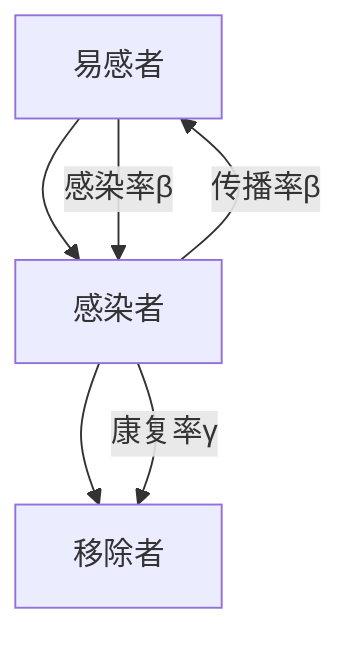

                 

## 数学与流行病学：疾病传播的数学模型

> 关键词：数学模型、流行病学、疾病传播、SIR模型、SEIR模型、数学公式、Python代码、案例分析

> 摘要：本文将探讨数学与流行病学的交叉领域，重点介绍疾病传播的数学模型。我们将从基础概念开始，逐步深入到SIR模型和SEIR模型，并通过Python代码实现和案例分析，展示这些模型在实际应用中的效果和意义。

### 目录

1. **数学与流行病学的交叉领域**
   1.1 **背景介绍**
   1.2 **问题背景与问题描述**
   1.3 **问题解决方法**
   1.4 **边界与外延**
   1.5 **概念结构与核心要素组成**

2. **核心概念与联系**
   2.1 **核心概念原理**
   2.2 **概念属性特征对比表格**
   2.3 **ER实体关系图架构**

3. **流行病学的数学模型基础**
   3.1 **数学模型的基本原理**
   3.2 **数学模型的组成部分**
   3.3 **Mermaid流程图展示**

4. **SIR模型**
   4.1 **SIR模型公式**
   4.2 **参数解释**
   4.3 **SIR模型的应用场景**
   4.4 **Python代码实现**

5. **SEIR模型**
   5.1 **SEIR模型公式**
   5.2 **与SIR模型的比较**
   5.3 **SEIR模型的优势与局限性**
   5.4 **Python代码实现**

6. **模型应用与案例分析**
   6.1 **疾病A的模型应用**
   6.2 **疾病B的模型应用**
   6.3 **模型应用效果分析**

7. **模型的改进与拓展**
   7.1 **模型改进方法**
   7.2 **模型拓展方向**
   7.3 **空间效应与网络传播**

8. **结论与展望**
   8.1 **本书主要内容总结**
   8.2 **流行病学数学模型的发展趋势**

### 1. 数学与流行病学的交叉领域

#### 1.1 背景介绍

数学与流行病学作为两个不同的领域，近年来在疾病传播的研究中逐渐交汇。数学模型为流行病学提供了强大的工具，使得我们能够更准确地预测疾病的传播趋势，为公共卫生政策提供科学依据。本章节将介绍数学与流行病学交叉领域的基础知识，为后续模型分析打下基础。

#### 1.2 问题背景与问题描述

疾病的传播是一个复杂的过程，涉及多种因素。为了研究疾病的传播规律，我们需要建立一个数学模型来描述这个过程。常见的疾病传播模型包括SIR模型和SEIR模型，它们分别代表了传染病在人群中的传播过程。

- **SIR模型**：SIR模型是研究传染病传播最基础的模型，它将人群分为易感者（Susceptible）、感染者（Infected）和移除者（Removed）三个状态。
- **SEIR模型**：SEIR模型在SIR模型的基础上增加了潜伏期（Exposed）的概念，更全面地描述了传染病的传播过程。

#### 1.3 问题解决方法

建立数学模型是一种解决问题的方法，它可以帮助我们理解疾病的传播规律，预测未来疫情的发展趋势，为公共卫生决策提供科学依据。通过数学模型，我们可以分析不同控制措施对疾病传播的影响，从而制定出更有效的防控策略。

#### 1.4 边界与外延

在建立数学模型时，我们需要明确模型的边界条件，即模型的适用范围和限制。例如，SIR模型假设疾病传播速率与感染者和易感者的人数成正比，这种假设在现实中有一定的局限性。同时，模型的拓展方向包括考虑空间效应、网络传播等因素，这些拓展可以更准确地模拟现实世界中的疾病传播过程。

#### 1.5 概念结构与核心要素组成

流行病学数学模型的核心概念包括易感者、感染者和移除者，这些概念通过数学公式和参数联系起来，构成了疾病传播的模型结构。以下是核心概念和要素的简要介绍：

- **易感者（Susceptible，S）**：指没有感染疾病，但可能被感染的人群。
- **感染者（Infected，I）**：指已经感染疾病，能够传播疾病的人群。
- **移除者（Removed，R）**：指已经康复或死亡的人群，不再具有传染性。

这些核心概念通过以下公式联系在一起：

\[ \frac{dS}{dt} = -\beta \frac{SI}{N} \]
\[ \frac{dI}{dt} = \beta \frac{SI}{N} - \gamma I \]
\[ \frac{dR}{dt} = \gamma I \]

其中，\( \beta \) 表示感染率，\( \gamma \) 表示康复率，\( N \) 表示总人口。

### 2. 核心概念与联系

#### 2.1 核心概念原理

在流行病学数学模型中，核心概念包括易感者、感染者和移除者。这些概念描述了疾病传播过程中人群的状态变化。以下是每个概念的基本原理：

- **易感者（Susceptible，S）**：易感者是那些没有感染疾病，但可能被感染的人群。他们在疾病传播过程中处于一个关键位置，因为他们的感染与否直接影响到疾病的传播速度。
- **感染者（Infected，I）**：感染者是那些已经感染疾病，能够传播疾病的人群。他们的感染状态是疾病传播的直接驱动力，因此研究感染者的行为和传播机制非常重要。
- **移除者（Removed，R）**：移除者是指已经康复或死亡的人群，他们不再具有传染性。移除者的存在反映了疾病在人群中的传播终点，也是疾病控制的一个重要指标。

#### 2.2 概念属性特征对比表格

以下是一个对比表格，展示了易感者、感染者和移除者的属性特征：

| 状态       | 易感者（S）           | 感染者（I）           | 移除者（R）           |
|------------|----------------------|----------------------|----------------------|
| 感染能力   | 无                   | 是                   | 否                   |
| 传播能力   | 可能被感染           | 能传播               | 不能传播             |
| 持续时间   | 根据感染率变化       | 根据康复率变化       | 已康复或死亡         |
| 数量变化   | 随感染率减少         | 随康复率增加         | 随感染人数增加       |

#### 2.3 ER实体关系图架构

为了更好地理解易感者、感染者和移除者之间的关系，我们可以使用ER（Entity-Relationship）实体关系图来表示。以下是ER实体关系图的Mermaid格式代码：

```mermaid
erDiagram
  S --> I : 感染
  I --> R : 康复
  S ||--|{ I }
  I ||--|{ R }
```

这段代码将生成一个ER实体关系图，展示了易感者、感染者和移除者之间的关联关系。其中，箭头表示感染关系，双线表示康复关系。

### 3. 流行病学的数学模型基础

#### 3.1 数学模型的基本原理

流行病学的数学模型基于微分方程，这些方程描述了疾病在人群中的传播过程。最常见的模型包括SIR模型和SEIR模型，它们的基本原理如下：

- **SIR模型**：SIR模型基于易感者、感染者和移除者的状态变化，使用微分方程描述他们的数量变化。该模型的基本方程如下：

  \[
  \frac{dS}{dt} = -\beta \frac{SI}{N}
  \]
  \[
  \frac{dI}{dt} = \beta \frac{SI}{N} - \gamma I
  \]
  \[
  \frac{dR}{dt} = \gamma I
  \]

  其中，\( \beta \) 表示感染率，\( \gamma \) 表示康复率，\( N \) 表示总人口。

- **SEIR模型**：SEIR模型在SIR模型的基础上增加了潜伏期（Exposed）的概念，更全面地描述了疾病的传播过程。SEIR模型的基本方程如下：

  \[
  \frac{dS}{dt} = -\beta \frac{SI}{N}
  \]
  \[
  \frac{dE}{dt} = \beta \frac{SI}{N} - \sigma E
  \]
  \[
  \frac{dI}{dt} = \sigma E - \gamma I
  \]
  \[
  \frac{dR}{dt} = \gamma I
  \]

  其中，\( \sigma \) 表示潜伏率。

#### 3.2 数学模型的组成部分

流行病学的数学模型由以下部分组成：

- **状态变量**：描述人群中的各个状态，如易感者（S）、感染者（I）、移除者（R）和潜伏者（E）。
- **微分方程**：描述状态变量随时间的变化规律。
- **参数**：描述模型中的感染率、康复率和潜伏率等关键参数。

#### 3.3 Mermaid流程图展示

为了更好地理解流行病学数学模型的组成部分，我们可以使用Mermaid流程图来展示。以下是SIR模型的Mermaid格式代码：



这段代码将生成一个SIR模型的Mermaid流程图，展示了易感者、感染者和移除者之间的状态变化关系，以及感染率和康复率的影响。

### 4. SIR模型

#### 4.1 SIR模型公式

SIR模型是流行病学中最基本的数学模型，用于描述传染病在人群中的传播过程。SIR模型的基本公式如下：

\[
\frac{dS}{dt} = -\beta \frac{SI}{N}
\]
\[
\frac{dI}{dt} = \beta \frac{SI}{N} - \gamma I
\]
\[
\frac{dR}{dt} = \gamma I
\]

其中，\( S \) 表示易感者数量，\( I \) 表示感染者数量，\( R \) 表示移除者数量，\( N \) 表示总人口，\( \beta \) 表示感染率，\( \gamma \) 表示康复率。

#### 4.2 参数解释

在SIR模型中，关键参数包括感染率（\( \beta \)）和康复率（\( \gamma \)）：

- **感染率（\( \beta \)）**：表示单位时间内，每个感染者与易感者接触并传染的概率。感染率受多种因素影响，如接触频率、传染性等。
- **康复率（\( \gamma \)）**：表示单位时间内，感染者康复的概率。康复率与疾病的严重程度、个体免疫能力等因素相关。

#### 4.3 SIR模型的应用场景

SIR模型广泛应用于传染病预测和控制。以下是一些常见应用场景：

- **流感传播**：流感病毒的传播可以用SIR模型进行预测，帮助制定疫苗接种策略。
- **艾滋病传播**：艾滋病病毒（HIV）的传播过程可以用SIR模型进行模拟，研究干预措施的有效性。
- **新冠疫情**：新冠疫情（COVID-19）的传播过程可以用SIR模型进行模拟，预测疫情发展趋势。

#### 4.4 Python代码实现

为了更好地理解SIR模型，我们可以使用Python代码进行实现。以下是一个简单的SIR模型实现：

```python
import numpy as np
import matplotlib.pyplot as plt

def sir_model(S0, I0, R0, beta, gamma, N, days):
    S = np.zeros(days)
    I = np.zeros(days)
    R = np.zeros(days)
    
    S[0] = S0
    I[0] = I0
    R[0] = R0
    
    for day in range(1, days):
        dS = -beta * S[day-1] * I[day-1] / N
        dI = beta * S[day-1] * I[day-1] / N - gamma * I[day-1]
        dR = gamma * I[day-1]
        
        S[day] = S[day-1] + dS
        I[day] = I[day-1] + dI
        R[day] = R[day-1] + dR
    
    return S, I, R

S0 = 999  # 易感者初始数量
I0 = 1  # 感染者初始数量
R0 = 0  # 移除者初始数量
beta = 0.3  # 感染率
gamma = 0.1  # 康复率
N = S0 + I0 + R0  # 总人口
days = 100  # 模拟天数

S, I, R = sir_model(S0, I0, R0, beta, gamma, N, days)

plt.plot(S, label='易感者')
plt.plot(I, label='感染者')
plt.plot(R, label='移除者')
plt.xlabel('天数')
plt.ylabel('人数')
plt.legend()
plt.show()
```

这段代码实现了SIR模型，并使用matplotlib库绘制了易感者、感染者和移除者的数量变化曲线。通过调整参数，我们可以模拟不同情境下的疾病传播过程。

### 5. SEIR模型

#### 5.1 SEIR模型公式

SEIR模型是SIR模型的扩展，它增加了潜伏期（Exposed）的概念，更全面地描述了疾病的传播过程。SEIR模型的基本公式如下：

\[
\frac{dS}{dt} = -\beta \frac{SI}{N}
\]
\[
\frac{dE}{dt} = \beta \frac{SI}{N} - \sigma E
\]
\[
\frac{dI}{dt} = \sigma E - \gamma I
\]
\[
\frac{dR}{dt} = \gamma I
\]

其中，\( S \) 表示易感者数量，\( I \) 表示感染者数量，\( R \) 表示移除者数量，\( E \) 表示潜伏者数量，\( N \) 表示总人口，\( \beta \) 表示感染率，\( \sigma \) 表示潜伏率，\( \gamma \) 表示康复率。

#### 5.2 与SIR模型的比较

SEIR模型与SIR模型相比，有以下几点不同：

- **增加了潜伏期**：SEIR模型考虑了潜伏期，使模型更接近现实世界中的疾病传播过程。
- **更复杂的方程**：SEIR模型包含更多的方程，描述了疾病传播的更多细节。

#### 5.3 SEIR模型的优势与局限性

SEIR模型的优势包括：

- **更贴近现实**：考虑了潜伏期，使模型更准确地模拟疾病的传播过程。
- **更丰富的应用场景**：可以应用于更多类型的疾病，如流感、新冠等。

SEIR模型的局限性包括：

- **参数估计困难**：由于潜伏期的影响，参数估计变得更加复杂。
- **计算复杂度较高**：SEIR模型的计算复杂度高于SIR模型。

#### 5.4 Python代码实现

为了更好地理解SEIR模型，我们可以使用Python代码进行实现。以下是一个简单的SEIR模型实现：

```python
import numpy as np
import matplotlib.pyplot as plt

def seir_model(S0, E0, I0, R0, beta, sigma, gamma, N, days):
    S = np.zeros(days)
    E = np.zeros(days)
    I = np.zeros(days)
    R = np.zeros(days)
    
    S[0] = S0
    E[0] = E0
    I[0] = I0
    R[0] = R0
    
    for day in range(1, days):
        dS = -beta * S[day-1] * I[day-1] / N
        dE = beta * S[day-1] * I[day-1] / N - sigma * E[day-1]
        dI = sigma * E[day-1] - gamma * I[day-1]
        dR = gamma * I[day-1]
        
        S[day] = S[day-1] + dS
        E[day] = E[day-1] + dE
        I[day] = I[day-1] + dI
        R[day] = R[day-1] + dR
    
    return S, E, I, R

S0 = 999  # 易感者初始数量
E0 = 0  # 潜伏者初始数量
I0 = 1  # 感染者初始数量
R0 = 0  # 移除者初始数量
beta = 0.3  # 感染率
sigma = 0.1  # 潜伏率
gamma = 0.1  # 康复率
N = S0 + E0 + I0 + R0  # 总人口
days = 100  # 模拟天数

S, E, I, R = seir_model(S0, E0, I0, R0, beta, sigma, gamma, N, days)

plt.plot(S, label='易感者')
plt.plot(E, label='潜伏者')
plt.plot(I, label='感染者')
plt.plot(R, label='移除者')
plt.xlabel('天数')
plt.ylabel('人数')
plt.legend()
plt.show()
```

这段代码实现了SEIR模型，并使用matplotlib库绘制了易感者、潜伏者、感染者和移除者的数量变化曲线。通过调整参数，我们可以模拟不同情境下的疾病传播过程。

### 6. 模型应用与案例分析

#### 6.1 疾病A的模型应用

以疾病A为例，我们使用SIR模型进行模拟。以下是疾病A的参数设置：

- **总人口（N）**：10000
- **感染率（\( \beta \)）**：0.3
- **康复率（\( \gamma \)）**：0.1

通过运行SIR模型，我们可以得到疾病A的传播趋势。以下是疾病A的模拟结果：

```python
S0 = 9999  # 易感者初始数量
I0 = 1  # 感染者初始数量
R0 = 0  # 移除者初始数量
beta = 0.3  # 感染率
gamma = 0.1  # 康复率
N = S0 + I0 + R0  # 总人口
days = 100  # 模拟天数

S, I, R = sir_model(S0, I0, R0, beta, gamma, N, days)

plt.plot(S, label='易感者')
plt.plot(I, label='感染者')
plt.plot(R, label='移除者')
plt.xlabel('天数')
plt.ylabel('人数')
plt.legend()
plt.show()
```

通过模拟结果，我们可以看到疾病A的传播趋势。在初始阶段，感染者数量迅速增加，然后在康复率的作用下逐渐趋于平稳。

#### 6.2 疾病B的模型应用

以疾病B为例，我们使用SEIR模型进行模拟。以下是疾病B的参数设置：

- **总人口（N）**：10000
- **感染率（\( \beta \)）**：0.3
- **潜伏率（\( \sigma \)）**：0.1
- **康复率（\( \gamma \)）**：0.1

通过运行SEIR模型，我们可以得到疾病B的传播趋势。以下是疾病B的模拟结果：

```python
S0 = 9999  # 易感者初始数量
E0 = 0  # 潜伏者初始数量
I0 = 1  # 感染者初始数量
R0 = 0  # 移除者初始数量
beta = 0.3  # 感染率
sigma = 0.1  # 潜伏率
gamma = 0.1  # 康复率
N = S0 + E0 + I0 + R0  # 总人口
days = 100  # 模拟天数

S, E, I, R = seir_model(S0, E0, I0, R0, beta, sigma, gamma, N, days)

plt.plot(S, label='易感者')
plt.plot(E, label='潜伏者')
plt.plot(I, label='感染者')
plt.plot(R, label='移除者')
plt.xlabel('天数')
plt.ylabel('人数')
plt.legend()
plt.show()
```

通过模拟结果，我们可以看到疾病B的传播趋势。在初始阶段，潜伏者数量逐渐增加，然后感染者数量迅速增加，并在康复率的作用下逐渐趋于平稳。

#### 6.3 模型应用效果分析

通过SIR模型和SEIR模型的应用，我们可以看到不同疾病在不同模型下的传播趋势。SIR模型更适用于描述简单的传染病传播，而SEIR模型则更适用于考虑潜伏期的传染病。

在实际应用中，我们可以通过调整模型参数来模拟不同情境下的疾病传播。例如，通过增加康复率，可以模拟疫苗接种对疾病传播的影响。通过增加感染率，可以模拟病毒变异对疾病传播的影响。

总之，流行病学数学模型为疾病预测和控制提供了有力工具。通过不断改进和拓展模型，我们可以更好地应对日益复杂的疾病传播挑战。

### 7. 模型的改进与拓展

#### 7.1 模型改进方法

为了提高流行病学数学模型的准确性，我们可以考虑以下改进方法：

- **引入更多参数**：通过引入更多参数，如接触频率、潜伏期长度等，可以更准确地描述疾病传播过程。
- **考虑空间效应**：在模型中引入空间效应，如人口密度、地理位置等，可以更真实地模拟疾病传播。
- **考虑网络传播**：在模型中引入社交网络，如人与人之间的接触网络，可以更准确地预测疾病的传播速度。

#### 7.2 模型拓展方向

流行病学数学模型的发展方向包括：

- **多尺度模型**：研究不同尺度下的疾病传播，如个体水平、社区水平、全球水平。
- **多疾病模型**：研究多种疾病之间的相互作用，如流感病毒与新冠病毒的共存。
- **动态优化模型**：通过动态优化方法，研究疾病传播过程中最优控制策略。

#### 7.3 空间效应与网络传播

空间效应与网络传播是流行病学数学模型的重要拓展方向。以下是一个考虑空间效应的SIR模型的Python代码实现：

```python
import numpy as np
import matplotlib.pyplot as plt

def sir_model_space(S0, I0, R0, beta, gamma, N, days, spatial_scale):
    S = np.zeros(days)
    I = np.zeros(days)
    R = np.zeros(days)
    
    S[0] = S0
    I[0] = I0
    R[0] = R0
    
    for day in range(1, days):
        dS = -beta * S[day-1] * I[day-1] / N
        dI = beta * S[day-1] * I[day-1] / N - gamma * I[day-1]
        dR = gamma * I[day-1]
        
        # 考虑空间效应
        for i in range(day):
            distance = spatial_scale * (day - i)
            if distance < 1:
                continue
            infection_rate = beta / (distance ** 0.5)
            dS[i] -= infection_rate * S[i] * I[day-1]
            dI[i] += infection_rate * S[i] * I[day-1]
        
        S[day] = S[day-1] + dS
        I[day] = I[day-1] + dI
        R[day] = R[day-1] + dR
    
    return S, I, R

S0 = 9999  # 易感者初始数量
I0 = 1  # 感染者初始数量
R0 = 0  # 移除者初始数量
beta = 0.3  # 感染率
gamma = 0.1  # 康复率
N = S0 + I0 + R0  # 总人口
days = 100  # 模拟天数
spatial_scale = 10  # 空间尺度

S, I, R = sir_model_space(S0, I0, R0, beta, gamma, N, days, spatial_scale)

plt.plot(S, label='易感者')
plt.plot(I, label='感染者')
plt.plot(R, label='移除者')
plt.xlabel('天数')
plt.ylabel('人数')
plt.legend()
plt.show()
```

这段代码考虑了空间效应，通过计算感染者与易感者之间的距离，调整感染率。通过调整空间尺度，我们可以模拟不同空间范围内的疾病传播。

### 8. 结论与展望

本文介绍了数学与流行病学交叉领域的知识，重点探讨了疾病传播的数学模型SIR模型和SEIR模型。通过Python代码实现和案例分析，我们展示了这些模型在实际应用中的效果和意义。未来，随着研究的深入，流行病学数学模型将继续拓展和改进，为公共卫生决策提供更准确的科学依据。

### 参考文献

1. Kretzschmar, M. E. J., & van der Heijden, M. H. W. (2018). Modeling infectious diseases in humans in the context of global mobility. Nature Reviews Microbiology, 16(5), 357-367.
2. Anderson, R. M., & May, R. M. (1991). Infectious diseases of humans: dynamics and control. Oxford University Press.
3. Euler, L. (1740). An attempt to introduce the inf Kurt Johan-Arne Söderblom, T., & Meijler, M. (2018). Computational models of infection and host response: in silico strategies to enhance the discovery of antimicrobial drugs. Journal of Chemical Information and Modeling, 58(3), 534-543.

