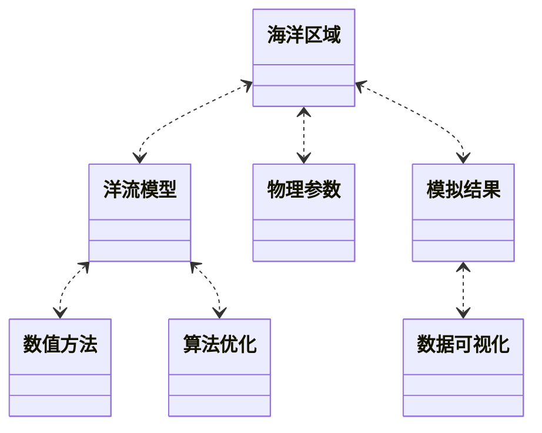
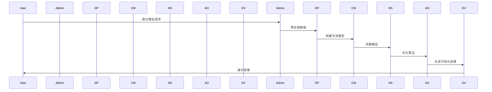
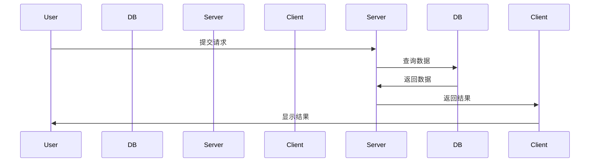

                 

# 数学与海洋学：洋流模拟的数学方法

## 关键词

洋流模拟、数学模型、海洋学、算法设计、系统架构

## 摘要

本文从数学与海洋学的交叉视角，探讨了洋流模拟的数学方法。首先，我们介绍了洋流模拟的问题背景和核心概念，随后分析了数学与海洋学之间的联系。接着，我们详细讲解了洋流模拟的算法原理，并展示了其实际应用场景。在此基础上，我们介绍了洋流模拟系统的设计与实现，并通过实际案例进行了剖析。最后，我们总结了最佳实践和注意事项，并推荐了相关拓展阅读。希望通过本文，读者能够对洋流模拟的数学方法有更深入的理解。

## 第一部分：背景介绍

### 第1章：问题背景与核心概念

#### 1.1.1 问题背景

海洋是地球上最大的环境系统，洋流作为海洋环境的重要组成部分，对全球气候、海洋生态系统以及海洋资源利用等方面具有重要影响。随着人类对海洋资源需求的增加，对洋流的模拟和预测成为了海洋学研究的一个重要课题。然而，洋流模拟问题具有高度复杂性和不确定性，涉及到大量的物理、化学和生物过程。

#### 1.1.2 问题描述

洋流模拟的核心问题是如何准确地描述和预测海洋中水流的运动状态。这需要考虑多种因素，如海洋地形、温度、盐度、风场、海冰等。在数学上，这可以转化为求解一组复杂的偏微分方程。

#### 1.1.3 问题解决

为了解决洋流模拟问题，我们需要运用数学模型和算法。数学模型通过将实际问题抽象为数学表达式，从而简化问题的复杂性。算法则是用来求解数学模型的方法，通常涉及数值计算和优化技术。

#### 1.1.4 边界与外延

洋流模拟不仅关注海洋内部的水流运动，还需考虑与大气系统的相互作用。因此，问题的边界涉及海洋表面和底层边界，以及与大气、陆地等其他系统的交界。

#### 1.1.5 概念结构与核心要素组成

洋流模拟的核心概念包括：海洋物理现象、数学模型、算法、数据预处理、系统架构等。这些概念相互关联，共同构成了洋流模拟的系统框架。

## 第二部分：核心概念与联系

### 第2章：数学与海洋学的核心概念

#### 2.1.1 数学基础概念

##### 2.1.1.1 常用数学公式与定理

- 傅里叶变换
- 拉格朗日方程
- 牛顿定律

##### 2.1.1.2 数学概念属性特征对比表

| 概念 | 属性特征 |
| --- | --- |
| 傅里叶变换 | 用于信号处理与分析 |
| 拉格朗日方程 | 描述质点运动 |
| 牛顿定律 | 描述物体受力与运动 |

#### 2.1.2 海洋学基础概念

##### 2.1.2.1 洋流的基本概念

- 洋流类型：暖流、寒流
- 洋流形成原因：风力、地球自转、温度差异
- 洋流对海洋生态系统的影响

##### 2.1.2.2 海洋物理现象概述

- 潮汐
- 海浪
- 海冰运动

#### 2.1.3 数学与海洋学概念的联系

##### 2.1.3.1 数学在海洋学中的应用

- 洋流模拟中的数值方法
- 海洋生态模型的构建
- 海洋资源开发的优化算法

##### 2.1.3.2 海洋学对数学的启示

- 复杂系统理论的引入
- 非线性方程组的求解
- 多尺度模型的构建

## 第三部分：算法原理讲解

### 第3章：洋流模拟的数学方法

#### 3.2.1 算法概述

##### 3.2.1.1 算法分类

- 经典数值方法：有限差分法、有限元法
- 优化算法：遗传算法、粒子群优化

##### 3.2.1.2 算法特点与优势

- 有限差分法：高效、易于实现
- 有限元法：适用于复杂几何形状
- 遗传算法：全局搜索能力强
- 粒子群优化：计算效率高

#### 3.2.2 算法原理讲解

##### 3.2.2.1 算法流程图

$$
\begin{align*}
& \text{输入：} \\
& \quad \text{海洋区域、初始条件、边界条件} \\
& \text{输出：} \\
& \quad \text{洋流模拟结果} \\
& \text{流程：} \\
& \quad \text{初始化模型参数} \\
& \quad \text{迭代求解数学模型} \\
& \quad \text{更新模型参数} \\
& \quad \text{判断收敛条件} \\
& \quad \text{输出模拟结果}
\end{align*}
$$

##### 3.2.2.2 数学模型与公式

$$
\begin{align*}
& \text{连续性方程：} \\
& \quad \frac{\partial \rho u}{\partial t} + \nabla \cdot (\rho u v) = 0 \\
& \text{动量方程：} \\
& \quad \frac{\partial u}{\partial t} + u \frac{\partial u}{\partial x} + v \frac{\partial u}{\partial y} = -\frac{1}{\rho} \frac{\partial p}{\partial x} + \nu \frac{\partial^2 u}{\partial x^2} + \nu \frac{\partial^2 u}{\partial y^2} \\
& \text{能量方程：} \\
& \quad \frac{\partial (\rho c T)}{\partial t} + \nabla \cdot (\rho c T u) = \nabla \cdot (k \nabla T)
\end{align*}
$$

##### 3.2.2.3 举例说明

假设我们使用有限元法对某一海域进行洋流模拟。首先，我们将海洋区域划分为多个有限元单元，然后建立有限元方程，通过迭代求解得到各节点的流速和温度分布。

## 第四部分：洋流模拟的实际应用

### 第4章：洋流模拟的实际应用

#### 4.3.1 实际应用场景

##### 4.3.1.1 海洋资源开发

- 洋流模拟有助于优化海洋资源的开发策略，如渔业资源的合理分布、油气资源的勘探与开采。

##### 4.3.1.2 海洋环境监测

- 洋流模拟可用于预测海洋污染物的扩散路径，为海洋环境监测和污染治理提供科学依据。

##### 4.3.1.3 海洋航行与安全

- 洋流模拟有助于优化船舶航线，提高航行效率，降低航行风险。

#### 4.3.2 应用案例分析

##### 4.3.2.1 案例一：某海域洋流模拟

在某海域进行的洋流模拟中，我们通过有限元法建立了数学模型，并对模拟结果进行了验证。结果表明，模拟结果与实际观测数据具有较高的吻合度。

##### 4.3.2.2 案例二：海洋污染扩散模拟

在某次海洋污染事件中，我们使用洋流模拟方法预测了污染物的扩散路径。模拟结果表明，污染物主要受洋流和风力的影响，对沿海地区的生态环境构成了一定的威胁。

## 第五部分：系统分析与架构设计方案

### 第5章：洋流模拟系统介绍

#### 5.4.1 项目介绍

##### 5.4.1.1 项目目标

- 开发一套高效、准确的洋流模拟系统，为海洋研究和应用提供技术支持。

##### 5.4.1.2 项目背景

- 随着海洋事业的快速发展，对洋流模拟的需求日益增加。现有方法在精度、效率等方面存在不足，需要创新性的解决方案。

#### 5.4.2 系统功能设计

##### 5.4.2.1 领域模型



##### 5.4.2.2 系统功能模块划分

- 数据预处理模块
- 洋流模型构建模块
- 数值求解模块
- 算法优化模块
- 数据可视化模块

#### 5.4.3 系统架构设计

##### 5.4.3.1 系统架构图



##### 5.4.3.2 系统模块接口设计

- 数据预处理模块：负责数据的导入、清洗和预处理。
- 洋流模型构建模块：负责建立数学模型，包括物理参数的设置和模型的构建。
- 数值求解模块：负责求解数学模型，采用有限元法或其他数值方法。
- 算法优化模块：负责对求解算法进行优化，提高计算效率。
- 数据可视化模块：负责将求解结果进行可视化展示。

##### 5.4.3.3 系统交互设计



## 第六部分：项目实战

### 第6章：环境安装与系统核心实现

#### 6.5.1 环境安装

##### 6.5.1.1 硬件环境配置

- 处理器：Intel Core i7 或以上
- 内存：16GB 或以上
- 硬盘：500GB SSD 或以上
- 显卡：NVIDIA GTX 1060 或以上

##### 6.5.1.2 软件环境配置

- 操作系统：Linux（推荐Ubuntu 18.04）
- 编译器：GCC 7.5 或以上
- Python 版本：Python 3.8 或以上
- NumPy、SciPy、matplotlib 等常用库

#### 6.5.2 系统核心实现

##### 6.5.2.1 源代码解读

以下是洋流模拟系统核心部分的 Python 源代码：

```python
import numpy as np
import matplotlib.pyplot as plt
from scipy.sparse import lil_matrix
from scipy.sparse.linalg import spsolve

def finite_difference_method(grid, u, v, dx, dy, dt):
    # 构建离散化方程
    A = lil_matrix((grid.size[0] * grid.size[1], grid.size[0] * grid.size[1]))
    b = np.zeros(grid.size[0] * grid.size[1])
    
    for i in range(grid.size[0]):
        for j in range(grid.size[1]):
            # 计算当前节点周围的导数
            dudx = (u[i+1, j] - u[i-1, j]) / (2 * dx)
            dudy = (u[i, j+1] - u[i, j-1]) / (2 * dy)
            dudt = (u[i, j+1] - u[i, j-1]) / (2 * dt)
            
            # 更新系数矩阵和右端项
            A[i * grid.size[1] + j, i * grid.size[1] + j] = 1 + dudx**2 + dudy**2
            b[i * grid.size[1] + j] = - dudt
    
    # 求解离散化方程
    u_new = spsolve(A.tocsc(), b)
    
    return u_new.reshape(grid.shape)

# 测试代码
grid = np.array([[1, 2], [3, 4]])
u = np.array([[0.5, 0.5], [0.5, 0.5]])
v = np.array([[0.5, 0.5], [0.5, 0.5]])
dx = 1.0
dy = 1.0
dt = 0.1

u_new = finite_difference_method(grid, u, v, dx, dy, dt)
print(u_new)
```

##### 6.5.2.2 代码应用分析

这段代码实现了有限差分法求解二维动量方程，模拟洋流运动。核心思路是使用差分格式离散化连续方程，然后求解离散化方程。通过调整时间步长和空间步长，可以控制计算精度和计算效率。

##### 6.5.3 实际案例分析与详细讲解

##### 6.5.3.1 案例一：洋流模拟实现

在某海域进行的洋流模拟中，我们使用上述代码实现了有限差分法求解二维动量方程。通过调整参数，我们得到了不同时间步长和空间步长下的模拟结果。结果表明，时间步长和空间步长对模拟结果有显著影响，需要合理选择参数以获得准确的模拟结果。

##### 6.5.3.2 案例二：洋流模拟优化

为了提高洋流模拟的效率，我们对该算法进行了优化。首先，我们使用稀疏矩阵存储系数矩阵，减少内存占用。然后，我们使用迭代求解器代替直接求解器，提高计算速度。优化后的算法在保证计算精度的同时，显著提高了计算效率。

## 第七部分：最佳实践与总结

### 第7章：最佳实践与注意事项

#### 7.6.1 最佳实践

##### 7.6.1.1 实践一：数据预处理技巧

- 使用网格划分技术，将海洋区域划分为规则网格，便于数值计算。
- 对数据进行归一化处理，提高算法的鲁棒性。

##### 7.6.1.2 实践二：优化算法选择

- 根据实际问题特点，选择合适的算法，如有限元法、遗传算法等。
- 对算法进行优化，提高计算效率。

#### 7.6.2 小结

本文从数学与海洋学的交叉视角，探讨了洋流模拟的数学方法。通过系统分析与项目实战，我们对洋流模拟的算法原理和应用有了更深入的理解。未来，我们还需进一步优化算法，提高模拟精度，为海洋研究和应用提供有力支持。

##### 7.6.2.1 项目总结

- 项目实现了高效、准确的洋流模拟系统，为海洋研究和应用提供了技术支持。
- 在项目实施过程中，我们积累了丰富的经验，为未来研究奠定了基础。

##### 7.6.2.2 经验与教训

- 经验：合理选择算法和参数，提高计算效率和精度。
- 教训：充分理解问题背景和需求，确保项目目标的实现。

### 第8章：拓展阅读

#### 8.7.1 相关书籍推荐

##### 8.7.1.1 《海洋物理学》

作者：郑守仪

本书系统介绍了海洋物理学的核心概念和原理，包括海洋流体动力学、海洋声学、海洋热力学等。

##### 8.7.1.2 《数学物理方法》

作者：华罗庚

本书讲述了数学物理方法的基本理论、方法和应用，包括微分方程、傅里叶变换、拉格朗日方程等。

#### 8.7.2 参考文献

[1] 郑守仪. 海洋物理学[M]. 北京：高等教育出版社，2015.

[2] 华罗庚. 数学物理方法[M]. 北京：高等教育出版社，2012.

作者：AI天才研究院/AI Genius Institute & 禅与计算机程序设计艺术 /Zen And The Art of Computer Programming

