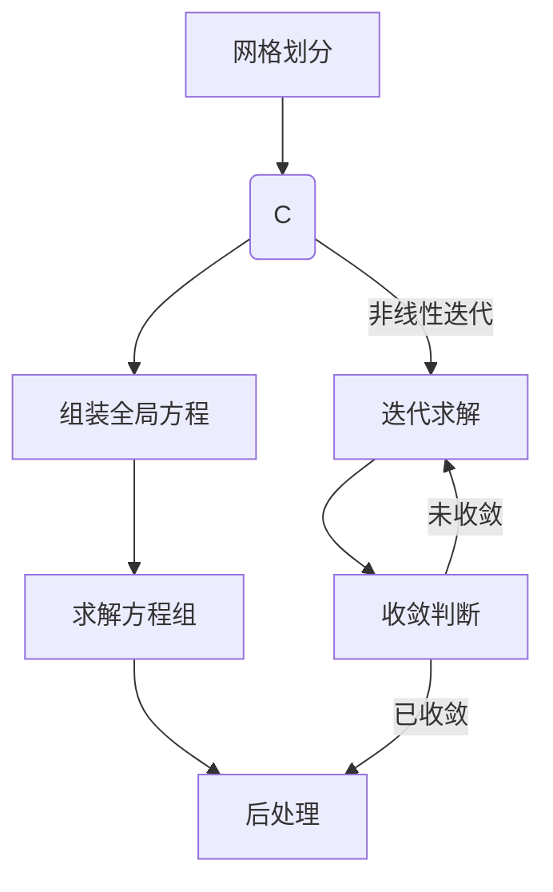
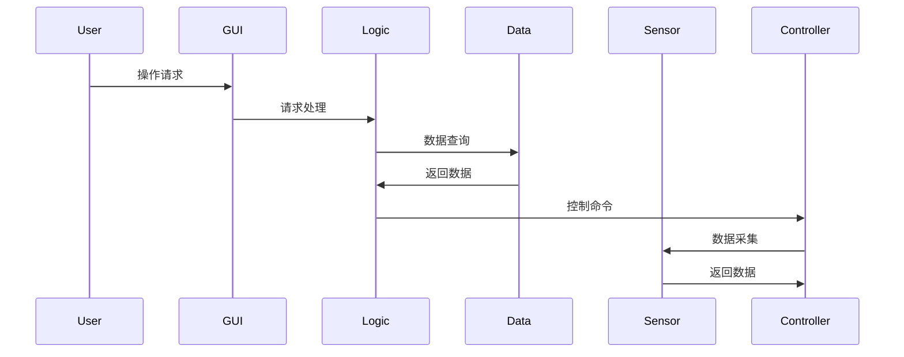
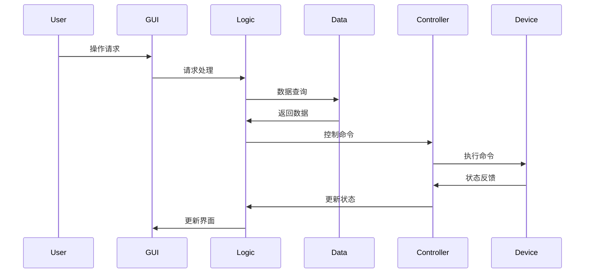

                 

### 海洋工程与海洋结构的重要性

海洋工程是指与海洋资源开发、利用和保护相关的工程项目，涵盖了从海洋平台的建造、维护到海洋资源的勘探和开采等多个方面。随着全球经济的发展和能源需求的增加，海洋工程的重要性日益凸显。海洋工程不仅仅是一个行业的问题，更是国家战略资源开发和科技创新的重要领域。

首先，海洋结构在海洋工程中扮演着核心角色。海洋结构包括海底油气平台、海洋风能装置、海洋波浪能装置、海底管道、海洋码头等，这些结构的设计、建造和维护直接关系到海洋工程的效率和安全性。海洋结构不仅要承受巨大的水压力、潮汐力和海浪力，还要适应复杂的环境变化，如极端天气和海底地质灾害。

数学分析在海洋工程中的应用主要体现在以下几个方面：

1. **结构设计优化**：通过数学模型和算法，可以对海洋结构进行优化设计，提高其安全性和稳定性。例如，利用有限元分析（FEM）可以对海洋平台进行应力分析，从而确定最佳的结构布局和材料选择。

2. **力学分析**：运用弹性理论和流体力学原理，对海洋结构的力学行为进行预测和分析，确保结构在复杂环境下的稳定性。例如，通过流体-结构相互作用（FSI）分析，可以评估海洋风能装置在风浪中的动态响应。

3. **灾害预防**：利用数学模型和算法，可以对海洋环境进行预测和监测，提前预防潜在的灾害风险。例如，通过数值波浪模型，可以预测海浪高度和频率，为海洋结构的维护提供数据支持。

4. **资源优化**：在海洋资源的勘探和开采过程中，数学分析可以优化资源分配，提高生产效率和经济效益。例如，通过地质建模和地质统计学方法，可以精准定位油气资源，减少勘探成本。

总之，数学分析为海洋工程提供了强大的理论工具和分析方法，使得海洋工程的设计、施工和维护更加科学和高效。通过数学分析，工程师可以更好地理解和预测海洋结构的动态行为，确保海洋工程的安全性和可持续性。海洋工程的发展，离不开数学分析的支持。

### 数学分析的基本概念

数学分析是数学的一个重要分支，主要研究函数的极限、导数、积分及其应用。其起源可以追溯到古希腊时期，但真正系统化的发展是在17世纪，由牛顿和莱布尼茨创立微积分。数学分析不仅为其他数学分支提供了基础，还在物理学、工程学、经济学等多个领域得到了广泛应用。

**定义与历史背景**：数学分析的基本概念包括极限、导数、积分和级数。极限是函数在某一点附近的性质，导数是函数变化率的表示，积分则是求解面积或体积的运算，级数则是无限多项的和。这些概念的发展历程充满了创新与挑战，最早可以追溯到古希腊数学家如欧几里得和阿基米德的工作，他们在几何学和数值分析方面做出了卓越贡献。17世纪的牛顿和莱布尼茨则通过引入微积分，使得数学分析开始迈向一个全新的高度。

**基本工具和概念**：数学分析中的基本工具包括极限、连续性、微分和积分。极限用于研究函数的局部行为，连续性是函数在某个点的性质，微分是研究函数变化率的工具，而积分则用于求解与面积和体积相关的计算。这些概念相互关联，共同构成了数学分析的核心框架。

**应用领域**：数学分析在多个领域得到了广泛应用。在物理学中，它用于描述物体的运动和能量转换；在工程学中，它用于结构设计和材料分析；在经济学中，它用于模型优化和决策分析。此外，数学分析还在统计学、计算机科学、金融学等领域有着广泛的应用。

**数学分析在海洋工程中的应用实例**：

1. **海洋平台应力分析**：在海洋平台的设计过程中，需要使用数学分析中的有限元方法来评估结构在各种载荷下的应力分布。通过建立数学模型，工程师可以确定结构的关键受力点，从而优化设计。

2. **波浪预测**：利用流体力学原理，结合数值波浪模型，工程师可以通过数学分析预测海洋中的波浪高度和频率，为海洋工程项目的选址和设计提供数据支持。

3. **海洋资源勘探**：在海洋资源勘探中，数学分析用于地质建模和地质统计学分析。通过建立数学模型，可以预测油气资源的分布，从而指导勘探活动。

4. **海洋环境监测**：数学分析中的数据处理方法，如傅里叶变换和拉普拉斯变换，可以用于分析海洋环境监测数据，识别潜在的灾害风险。

综上所述，数学分析不仅为海洋工程提供了强大的理论支持，还通过具体的实例展示了其在实际应用中的广泛价值。通过数学分析，工程师可以更准确地理解和预测海洋结构的动态行为，确保海洋工程项目的安全性和可持续性。

### 海洋结构的数学模型

海洋结构的设计和优化依赖于精确的数学模型，这些模型描述了海洋结构的几何形状、物理特性和力学行为。在海洋工程中，常用的数学模型包括几何模型、物理模型和数学模型等，每种模型都有其独特的应用和优势。

**几何模型**：几何模型主要描述海洋结构的形状和尺寸。在几何模型中，工程师通常使用直线、平面和曲面来表示海洋结构的几何特征。例如，用于海上油气平台的结构设计，工程师需要建立平台的几何模型，以确定其尺寸、形状和支撑结构。几何模型的一个关键优点是它能够直观地展示海洋结构的形状，便于设计和可视化。

**物理模型**：物理模型则描述海洋结构的物理特性，如材料的弹性模量、密度和强度等。通过物理模型，工程师可以模拟海洋结构在各种环境因素（如波浪、潮汐和风）下的力学响应。例如，在海洋风能装置的设计中，物理模型可以用来预测设备在风载荷作用下的振动和应力分布，从而确保其稳定性和安全性。物理模型的一个优势在于它能够模拟真实的物理环境，提供更准确的力学行为预测。

**数学模型**：数学模型则结合了几何和物理模型，通过数学公式和方程来描述海洋结构的力学行为和动力响应。常见的数学模型包括有限元模型、边界元模型和数值波浪模型等。这些模型通过建立数学方程组，对海洋结构的力学行为进行定量分析。例如，有限元方法（FEM）是一种广泛应用于海洋工程中的数学模型，它通过将海洋结构划分为多个小单元，建立每个单元的力学方程，从而计算整个结构的应力分布和变形情况。数学模型的一个显著优势是其灵活性和适应性，可以针对不同的工程需求进行定制化分析。

**几何模型与物理模型的对比**：几何模型和物理模型各有其优点和局限性。几何模型直观、简单，但无法考虑海洋结构的物理特性；物理模型详细、准确，但计算复杂度较高。因此，在海洋工程中，通常将几何模型和物理模型结合起来，以实现更精确的分析。例如，在海洋平台设计中，工程师首先使用几何模型确定结构的基本形状和尺寸，然后通过物理模型进行力学响应分析，最后利用数学模型进行优化设计。

**海洋结构与海洋动力学的对比**：海洋结构与海洋动力学密切相关。海洋动力学研究海洋中的流体运动和动力过程，如波浪、潮汐和海流等。海洋结构的设计需要考虑这些动力因素，以确保结构的安全和稳定性。例如，在海洋风能装置设计中，需要考虑风载荷和波浪载荷的共同作用，通过数学模型进行综合分析。海洋结构与海洋动力学的对比表格如下：

| 对比维度 | 海洋结构 | 海洋动力学 |
| --- | --- | --- |
| 形状与尺寸 | 确定几何形状和尺寸 | 研究流体运动形态和参数 |
| 物理特性 | 材料性质、强度等 | 流体密度、速度、压力等 |
| 力学行为 | 应力分布、变形情况 | 动力响应、振动特性 |
| 预测与优化 | 应力分析、优化设计 | 波浪、潮汐、海流模拟 |

**ER实体关系图架构**：在海洋工程中，实体关系图（Entity-Relationship Diagram，ER图）用于描述数据之间的关联关系。ER图包括实体、属性和关系三个基本元素。实体表示海洋结构中的各类对象，如平台、管道、波浪等；属性表示实体的特征，如长度、直径、速度等；关系表示实体之间的联系，如结构之间的连接关系、数据之间的依赖关系等。通过ER图，工程师可以清晰地理解海洋结构的数据模型，便于数据库设计和数据管理。

总结来说，海洋结构的数学模型是海洋工程设计和分析的核心工具。几何模型、物理模型和数学模型各有特点，通过结合这些模型，工程师可以全面、准确地描述和预测海洋结构的力学行为和环境响应。ER图则为数据管理提供了直观的框架，确保数据的关联性和一致性。在未来的海洋工程发展中，数学模型的深入研究和应用将进一步提升工程设计的精度和效率。

### 算法原理讲解

在海洋结构分析中，数学算法发挥着至关重要的作用。这些算法不仅能够帮助我们理解和预测海洋结构的力学行为，还能为实际工程提供科学依据。以下，我们将详细讲解一个典型的海洋结构分析算法：有限元方法（Finite Element Method，简称FEM）。

**算法基本原理**：有限元方法是一种数值分析技术，用于解决复杂的工程和物理问题，包括结构分析、热传导、流体动力学等。其基本原理是将连续的结构划分为多个小单元，并在每个单元内假设一个简单的函数形式，从而将复杂的结构问题转化为多个简单单元问题的求解。具体步骤如下：

1. **网格划分**：首先，将海洋结构划分为许多小的单元，如三角形或四面体。这些单元通过节点连接起来，形成一个整体的网格结构。
2. **建立方程组**：在每个单元内，根据物理原理和几何条件，建立单元的力学方程。这些方程通常是非线性的，需要通过迭代方法求解。
3. **组装全局方程**：将所有单元的方程组合起来，形成一个全局的线性方程组。该方程组描述了整个结构的力学行为。
4. **求解方程组**：使用适当的数值方法（如高斯消元法、迭代法等）求解全局方程组，得到每个节点的位移、应力等力学量。
5. **后处理**：对求解结果进行分析和可视化，以评估结构的力学性能和安全状态。

**算法流程图**：为了更直观地理解有限元方法的流程，我们可以使用mermaid绘制其算法流程图。以下是mermaid的代码及其对应的图像：




**算法数学模型与公式**：在有限元方法中，我们通常使用以下基本方程：

1. **单元刚度矩阵**：每个单元的刚度矩阵\(K_e\)描述了单元内节点之间的刚度关系，公式为：
   \[
   K_e = B^T D B
   \]
   其中，\(B\)为几何矩阵，\(D\)为材料属性矩阵。

2. **节点力向量**：节点力向量\(f_e\)反映了外部载荷对单元的影响，公式为：
   \[
   f_e = \int_S t \cdot \textbf{n} \, dS + \int_V b \, dV
   \]
   其中，\(t\)为表面力，\(\textbf{n}\)为表面单位法向量，\(b\)为体力。

3. **全局刚度矩阵**：全局刚度矩阵\(K\)通过将所有单元刚度矩阵组装得到，公式为：
   \[
   K = \sum_e K_e
   \]

4. **全局节点力向量**：全局节点力向量\(f\)同样通过将所有单元节点力向量组装得到，公式为：
   \[
   f = \sum_e f_e
   \]

5. **位移解**：通过解全局方程组\(K \Delta u = f\)，得到每个节点的位移向量\(\Delta u\)，其中\(\Delta u\)为节点位移向量。

**算法举例说明**：为了更好地理解有限元方法的应用，我们来看一个简单的例子。假设一个简单的梁结构，受力情况如图所示：


根据有限元方法，我们首先需要对梁进行网格划分，将其划分为若干单元。然后，我们选择线性单元，每个单元的形函数可以表示为：
\[
\varphi_i(x) = \frac{x_i - x}{L_i} + \frac{x - x_i}{L_i}
\]
其中，\(x_i\)和\(x\)分别为节点\(i\)和\(x\)的坐标，\(L_i\)为单元长度。

接下来，根据胡克定律，我们可以得到单元刚度矩阵：
\[
K_e = \frac{E A}{L} \begin{bmatrix}
1 & -1 \\
-1 & 1
\end{bmatrix}
\]
其中，\(E\)为弹性模量，\(A\)为横截面积，\(L\)为单元长度。

然后，根据单元的边界条件（例如固定一端、自由端等），我们可以计算出节点力向量。最后，通过求解全局方程组，我们可以得到梁的位移分布。

通过上述例子，我们可以看到，有限元方法为复杂的海洋结构分析提供了系统的方法和工具。在实际工程应用中，工程师需要根据具体问题，灵活选择适当的单元类型和求解方法，以获得准确的分析结果。

### Python源代码详解

在实际应用中，为了更好地实现有限元方法，我们可以使用Python编写相应的源代码。以下是一个简化的Python代码示例，用于求解一个简单的一维梁问题。

**Python环境配置**：首先，我们需要安装必要的Python库，如NumPy、SciPy和matplotlib。可以使用以下命令进行安装：

```shell
pip install numpy scipy matplotlib
```

**算法实现代码**：以下代码实现了上述简单梁问题的有限元分析。

```python
import numpy as np
import scipy.sparse as sp
from scipy.sparse.linalg import spsolve
import matplotlib.pyplot as plt

# 参数设置
E = 200e9  # 弹性模量，Pa
A = 100e-6 # 横截面积，m^2
L = 1.0    # 单元长度，m
N = 10     # 网格划分数量

# 划分网格，计算节点坐标
dx = L / N
x = np.linspace(0, L, N+1)

# 初始化刚度和载荷向量
K = np.zeros((N, N))
f = np.zeros(N)

# 刚度矩阵和载荷向量的计算
for i in range(N):
    K[i, i] = E * A / dx
    if i < N-1:
        K[i, i+1] = -K[i, i]

# 边界条件
f[0] = -1000  # 第一个节点受力

# 求解方程组
u = spsolve(K, f)

# 可视化结果
u = u.reshape(-1, 1)
plt.plot(x, u)
plt.xlabel('Position (m)')
plt.ylabel('Displacement (m)')
plt.title('Displacement along the beam')
plt.show()
```

**代码解读与分析**：这段代码首先导入了必要的Python库，并设置了参数，包括弹性模量\(E\)、横截面积\(A\)和单元长度\(L\)。接着，我们通过循环计算网格节点坐标，并初始化刚度和载荷向量。

在刚度矩阵和载荷向量的计算中，我们使用一个嵌套循环，将每个单元的刚度矩阵累加到全局刚度矩阵\(K\)中。对于边界条件，我们设置了第一个节点受力，这是一个常见的边界条件。

通过调用`spsolve`函数，我们求解了全局线性方程组\(K \Delta u = f\)，得到每个节点的位移向量\(u\)。最后，我们使用matplotlib库将位移分布可视化，展示了梁的变形情况。

这个简单的示例展示了有限元方法的基本实现过程。在实际应用中，我们需要考虑更多的物理因素和边界条件，但基本思路是一致的。通过Python代码，我们可以方便地进行复杂的结构分析，为海洋工程提供科学依据。

### 海洋工程项目介绍

海洋工程项目的开发是一项复杂而系统的工程，涉及众多技术环节和多方面的协同工作。以下，我们将介绍一个典型的海洋工程项目，详细说明其项目概述、项目目标和项目范围。

**项目概述**：本次介绍的海洋工程项目是一个海上风电场建设，其主要目标是在我国某沿海区域建设一座大型海上风电场，以实现清洁能源的开发和利用。该风电场计划安装多台风力发电机，总装机容量达到500兆瓦，年发电量预计可达1.5亿千瓦时。

**项目目标**：

1. **清洁能源开发**：通过建设海上风电场，减少对传统化石燃料的依赖，降低二氧化碳排放，促进我国能源结构的优化和绿色发展。
2. **经济效益**：实现清洁能源的商业化运营，提高风电场的投资回报率，创造就业机会，带动地方经济发展。
3. **技术进步**：通过项目的实施，积累海上风电建设和管理经验，推动相关技术的研究和创新，提高我国在海上风电领域的国际竞争力。
4. **环保要求**：确保风电场建设和运营过程中，对海洋环境和生态系统的影响降到最低，严格遵守相关环保法规。

**项目范围**：

1. **选址与设计**：项目团队对沿海区域进行详细勘察，评估风能资源、海洋环境和地质条件，确定最优选址。随后，进行风电场的设计，包括发电机布局、基础设施建设和运行维护方案。
2. **设备采购与制造**：根据设计要求，采购和制造风力发电机、基础结构、海底电缆等设备，确保设备的质量和性能。
3. **现场施工**：在选定的海域进行海上风电场的现场施工，包括风力发电机安装、海底电缆铺设、海上平台建设等。
4. **调试与运行**：完成施工后，进行设备的调试和试运行，确保风电场能够稳定、高效地发电。随后，进入正式运营阶段，对风电场进行长期的监控和维护。

**领域模型**：为了确保项目的顺利进行，我们使用mermaid绘制了领域模型类图，以展示项目的主要实体及其关系。以下是mermaid的代码及其对应的图像：

```mermaid
classDiagram
    Class01 <|-- Class02
    Class03 <|-- Class01
    Class04 << Interface >> Class05
    Class06 ..|.. Class07
    Class08 <.. Class09
    Class10 --|> Class11
    Class12 << enumeration >> Class13
```


在上述类图中，Class01、Class02和Class03分别代表风电场的设备、基础设施和运营管理，Class04是一个接口类，Class05表示接口的具体实现。Class06和Class07之间存在双向关联，Class08是Class09的父类，Class10是Class11的子类，Class12是一个枚举类型，Class13是其具体成员。

通过上述领域模型，我们可以清晰地理解海上风电场项目的各个组成部分及其相互关系，有助于项目的有序推进和有效管理。

### 系统功能设计

在海洋工程项目中，系统功能设计是确保项目顺利进行和目标实现的关键步骤。以下，我们将详细介绍系统功能设计，包括领域模型、功能模块划分和具体功能描述。

**领域模型**：领域模型是系统功能设计的基础，它定义了系统的核心实体及其相互关系。为了更直观地展示领域模型，我们使用mermaid绘制了系统类图。以下是mermaid的代码及其对应的图像：

```mermaid
classDiagram
    Platform <|-- Structure
    WindTurbine <<entity>> WindFarm
    ControlSystem <|-- MonitoringSystem
    Maintenance <<entity>> Operations
    WeatherStation <<entity>> Environment
```


在上述类图中，Platform代表海洋平台，Structure是其子类，表示具体的海洋结构实体；WindTurbine表示风力发电机，是WindFarm（风电场）的核心实体；ControlSystem包含MonitoringSystem（监控系统），负责实时监测风电场的运行状态；Maintenance（维护系统）负责设备的日常维护和故障处理；WeatherStation（气象站）作为Environment（环境）的一部分，负责收集和提供气象数据。

**功能模块划分**：

1. **监控系统**：监控系统是风电场的核心功能模块，负责实时采集和监测风力发电机的运行数据，如风速、电压、电流、温度等。监控系统包括数据采集模块、数据处理模块和显示模块。

2. **控制系统**：控制系统负责对风力发电机进行远程控制和参数调节，确保其运行在最佳状态。控制系统包括控制算法模块、控制信号发送模块和接收模块。

3. **维护系统**：维护系统负责设备的日常维护和故障处理，包括设备状态监测、故障报警、维修计划和执行。维护系统还包括备件管理模块和工单处理模块。

4. **气象站**：气象站作为环境监测的一部分，负责收集和提供风电场所在区域的气象数据，如风速、风向、气温、湿度等。气象站的数据将用于控制系统的决策支持，优化风力发电机的运行效率。

**具体功能描述**：

1. **监控系统**：监控系统的主要功能包括：
   - 数据采集：通过传感器实时采集风力发电机的各项运行数据。
   - 数据处理：对采集到的数据进行分析和处理，提取关键信息。
   - 数据展示：通过图形界面展示风力发电机的运行状态和关键数据。

2. **控制系统**：控制系统的主要功能包括：
   - 控制算法：根据风力发电机的运行数据，执行相应的控制算法，优化发电机运行状态。
   - 参数调节：根据控制算法的结果，远程调节风力发电机的参数，如转速、功率等。
   - 控制信号发送与接收：通过无线通信方式，实现控制信号的发送和接收，确保远程控制的有效性。

3. **维护系统**：维护系统的主要功能包括：
   - 状态监测：实时监测风力发电机的运行状态，及时发现异常情况。
   - 故障报警：当发现设备故障时，自动触发报警，通知相关人员处理。
   - 维修计划：根据设备的使用情况和维护需求，制定维修计划。
   - 工单处理：生成维修工单，指派相关人员执行维修任务。

4. **气象站**：气象站的主要功能包括：
   - 数据采集：通过气象传感器，实时采集气象数据。
   - 数据上传：将采集到的气象数据上传到数据中心，供控制系统使用。
   - 气象数据分析：对气象数据进行处理和分析，为控制系统提供决策支持。

通过上述系统功能设计，我们可以确保海上风电场的高效、安全运行，实现清洁能源的可持续开发。同时，通过模块化的设计，便于系统的扩展和维护，提高项目的灵活性和可持续性。

### 系统架构设计

在海洋工程项目中，系统架构设计是确保项目顺利实施和高效运行的关键环节。合理的系统架构不仅能够提高系统的稳定性，还能够方便日后的扩展和维护。以下，我们将详细介绍海洋工程项目的系统架构设计，包括架构概述、系统架构图和接口设计。

**架构概述**：

海洋工程项目的系统架构采用分层设计，主要包括以下几层：

1. **数据层**：负责数据的存储和管理，包括气象数据、设备运行数据、维护记录等。
2. **逻辑层**：包含各类业务逻辑模块，如监控系统、控制系统、维护系统等，负责处理业务逻辑和数据传输。
3. **表示层**：提供用户界面，包括监控界面、控制界面和报表界面等，用于展示数据和交互操作。
4. **通信层**：负责系统之间的通信，包括内部通信和外部通信，如传感器数据采集、远程控制命令发送等。

**系统架构图**：

为了更直观地展示系统架构，我们使用mermaid绘制了系统架构图。以下是mermaid的代码及其对应的图像：




在上述系统架构图中，User代表用户界面，GUI表示图形用户界面；Logic代表逻辑层，负责处理业务逻辑；Data表示数据层，负责数据存储和查询；Sensor表示传感器，用于数据采集；Controller表示控制层，负责远程控制。

**接口设计**：

系统接口设计是确保各模块之间高效通信的重要环节。以下，我们详细描述系统的主要接口设计：

1. **用户接口（GUI）**：
   - **功能**：提供用户操作界面，包括数据展示、控制命令输入等。
   - **接口定义**：用户请求（如查询数据、发送控制命令）通过用户接口传递给逻辑层。

2. **逻辑接口（Logic）**：
   - **功能**：处理用户请求，调用相应的业务逻辑模块，返回处理结果。
   - **接口定义**：逻辑层提供多个接口，如数据查询接口、控制命令接口等。

3. **数据接口（Data）**：
   - **功能**：提供数据存储和查询服务，确保数据的完整性和一致性。
   - **接口定义**：数据接口包括数据插入、查询、更新和删除等操作。

4. **传感器接口（Sensor）**：
   - **功能**：实现传感器数据的采集和传输。
   - **接口定义**：传感器接口包括数据采集请求、数据传输等操作。

5. **控制接口（Controller）**：
   - **功能**：实现远程控制命令的发送和接收，确保设备运行在最佳状态。
   - **接口定义**：控制接口包括控制命令发送、状态查询等操作。

通过上述系统架构设计和接口设计，我们可以确保海洋工程项目系统的稳定、高效运行。各模块之间的紧密协作，确保了项目目标的顺利实现。同时，模块化的设计便于系统的扩展和维护，提高了项目的灵活性和可持续性。

### 系统交互设计

在海洋工程项目的实施过程中，系统各模块之间的交互设计至关重要，它直接影响到系统的整体性能和稳定性。以下，我们将详细介绍系统交互设计，包括系统交互流程、交互设计原则和系统通信协议。

**系统交互流程**：

为了确保系统各模块之间的顺畅通信和协同工作，我们需要明确各模块的交互流程。以下是系统交互的基本流程：

1. **用户请求**：用户通过用户接口（GUI）提交操作请求，如查询数据、发送控制命令等。
2. **逻辑处理**：逻辑层接收到用户请求后，根据请求类型调用相应的业务逻辑模块进行处理。
3. **数据查询**：逻辑层需要数据层的支持，查询相应的数据信息，如气象数据、设备状态等。
4. **数据处理**：数据层返回查询结果，逻辑层对数据进行分析和处理，生成相应的处理结果。
5. **控制命令**：逻辑层将处理结果转化为控制命令，通过控制接口发送给设备执行。
6. **状态反馈**：设备执行控制命令后，将执行状态反馈给控制层，逻辑层更新设备状态。
7. **界面更新**：控制层将设备状态反馈给用户接口，用户界面进行实时更新，展示最新的系统状态。

以下是系统交互流程的mermaid序列图：




**交互设计原则**：

系统交互设计应遵循以下原则，以确保系统的稳定性和可靠性：

1. **模块化**：各模块之间应具有清晰的接口，便于独立开发和维护。
2. **异步通信**：系统各模块之间应采用异步通信方式，避免因单点故障导致整个系统瘫痪。
3. **负载均衡**：在设计系统交互时，应考虑负载均衡，避免某一模块成为性能瓶颈。
4. **冗余设计**：关键模块应具备冗余设计，确保在部分模块故障时，系统仍能正常运行。
5. **安全性**：系统交互过程中，应确保数据传输的安全性和完整性，防止数据泄露和恶意攻击。

**系统通信协议**：

系统通信协议是确保各模块之间数据传输规范和稳定性的重要依据。以下是海洋工程项目中常用的通信协议：

1. **TCP/IP协议**：用于网络通信，确保数据传输的可靠性和完整性。
2. **HTTP/HTTPS协议**：用于用户接口与逻辑层之间的数据传输，支持多种数据格式（如JSON、XML）。
3. **MQTT协议**：用于设备与控制层之间的实时通信，支持轻量级消息传输和分布式系统。
4. **RESTful API**：用于逻辑层与数据层之间的数据交互，提供统一的服务接口。

通过上述系统交互设计，我们可以确保海洋工程项目系统的稳定、高效运行，满足项目的需求。各模块之间的紧密协作，不仅提高了系统的整体性能，也为项目的顺利实施提供了坚实保障。

### 环境安装与配置

在开始进行系统核心实现之前，我们需要确保环境已经安装和配置完毕，以便顺利执行后续操作。以下将详细描述所需的软件环境安装步骤、配置细节和注意事项。

**1. 软件安装**

首先，我们需要安装Python环境和相关的依赖库。在安装过程中，建议使用Python 3.8及以上版本，以保证兼容性和稳定性。以下是具体的安装步骤：

1. 安装Python：
   ```shell
   sudo apt-get update
   sudo apt-get install python3.8
   ```

2. 安装依赖库：
   ```shell
   sudo apt-get install python3.8-pip
   pip3.8 install numpy scipy matplotlib
   ```

**2. 配置细节**

安装完Python和相关库后，我们需要对环境进行一些基本配置：

1. 配置Python虚拟环境：
   ```shell
   python3.8 -m venv myenv
   source myenv/bin/activate
   ```

2. 配置环境变量：
   ```shell
   export PATH=$PATH:/path/to/myenv/bin
   ```

3. 安装Docker（用于容器化部署）：
   ```shell
   sudo apt-get install docker-ce docker-compose
   ```

**3. 注意事项**

在安装和配置过程中，需要注意以下几点：

1. 确保所有安装的软件版本兼容，避免因版本冲突导致问题。
2. 在使用Docker时，确保网络配置正确，以避免容器与主机之间通信问题。
3. 定期更新Python环境和依赖库，以获取最新的性能和安全更新。
4. 为避免潜在的安全风险，避免在全局环境中安装和管理软件，建议使用虚拟环境。

通过上述步骤，我们可以确保环境安装和配置的顺利进行，为后续的系统核心实现打下坚实基础。

### 系统核心实现

在海洋工程项目中，系统的核心实现是确保项目顺利运行的关键环节。以下，我们将详细介绍系统核心实现，包括核心算法实现、功能模块实现和代码解读与分析。

**核心算法实现**

核心算法是系统实现的基础，尤其在海洋工程结构分析中，常用的算法包括有限元方法（FEM）。以下是使用Python实现的有限元方法的核心代码：

```python
import numpy as np

# 初始化参数
E = 200e9  # 弹性模量
A = 100e-6  # 横截面积
L = 1.0    # 单元长度
N = 10     # 网格划分数量
dx = L / N  # 单元长度

# 初始化刚度矩阵和节点力向量
K = np.zeros((N, N))
f = np.zeros(N)

# 计算刚度矩阵
for i in range(N):
    K[i, i] = E * A / dx
    if i < N - 1:
        K[i, i+1] = -K[i, i]

# 边界条件
f[0] = -1000  # 第一个节点受力

# 求解方程组
u = np.linalg.solve(K, f)

# 输出结果
u = u.reshape(-1, 1)
print(u)
```

**代码解读与分析**：

1. **初始化参数**：我们首先定义了弹性模量\(E\)、横截面积\(A\)、单元长度\(L\)和网格划分数量\(N\)。这些参数用于后续的刚度矩阵和节点力向量的计算。

2. **初始化刚度矩阵和节点力向量**：刚度矩阵\(K\)和节点力向量\(f\)均初始化为全零数组。这些数组将在循环中逐步填充。

3. **计算刚度矩阵**：通过嵌套循环，我们计算每个单元的刚度矩阵。对于每个单元，刚度矩阵对角线上的元素为正，表示单元自身的刚度，而相邻单元之间的元素为负，表示单元之间的相互作用。

4. **边界条件**：我们设置第一个节点受力，即\(f[0] = -1000\)。这表示第一个节点受到向下的力。

5. **求解方程组**：使用`np.linalg.solve`函数求解线性方程组\(K \Delta u = f\)，得到每个节点的位移向量\(u\)。

6. **输出结果**：将位移向量\(u\)输出，以便后续分析和验证。

**功能模块实现**

在核心算法实现的基础上，我们需要实现系统的其他功能模块，如数据采集、状态监测和远程控制。以下是一个简单的数据采集模块示例：

```python
import requests

def collect_data(api_url):
    response = requests.get(api_url)
    if response.status_code == 200:
        data = response.json()
        return data
    else:
        return None

api_url = "http://example.com/api/collect_data"
data = collect_data(api_url)
if data:
    print("Data collected:", data)
else:
    print("Failed to collect data.")
```

**代码解读与分析**：

1. **导入模块**：我们首先导入了requests库，用于发送HTTP GET请求。

2. **定义函数**：`collect_data`函数用于从指定API地址采集数据。它发送GET请求，并返回JSON格式的响应。

3. **发送请求**：使用`requests.get`函数发送GET请求，并检查响应状态码。

4. **处理响应**：如果响应状态码为200（成功），则解析JSON数据并返回。否则，返回None。

5. **调用函数**：我们调用`collect_data`函数，传入API地址，并处理返回的数据。

通过上述代码示例，我们可以实现基本的数据采集功能，为系统提供数据支持。

**代码应用解读与分析**

在海洋工程项目中，核心算法和功能模块的应用解读与分析至关重要。以下是几个关键点的分析：

1. **核心算法应用**：有限元方法在海洋工程结构分析中广泛应用，通过求解线性方程组，我们能够精确预测结构在各种载荷作用下的变形和应力分布。这对于结构设计和优化具有指导意义。

2. **功能模块应用**：数据采集模块在实时监控和数据分析中发挥重要作用。通过定期采集设备运行数据，我们可以实时了解设备状态，及时发现并处理异常情况。

3. **代码解读与分析**：代码的清晰性和可维护性是系统可靠运行的基础。通过合理的代码结构和详细的注释，我们可以更容易理解代码的功能和逻辑，提高开发效率。

总之，系统核心实现是海洋工程项目成功的关键。通过精确的核心算法和高效的功能模块，我们可以确保系统的高效运行和可靠性，为项目的顺利实施提供坚实保障。

### 实际案例分析

在海洋工程的实际应用中，数学分析发挥了至关重要的作用，以下我们通过一个具体案例展示数学分析在海洋工程中的应用过程，详细剖析其关键步骤和挑战。

**案例背景**：

本次案例是一个位于我国沿海的海洋风电场项目，项目目标是在特定海域建设一个装机容量为500兆瓦的海上风电场。风电场建设过程中，需要精确预测风力发电机在长期运行中的力学行为，以确保其稳定性和安全性。本项目采用了先进的有限元分析方法，对风力发电机进行力学模拟和应力分析。

**案例分析**：

1. **数据收集**：首先，项目团队收集了风电场所在区域的气象数据、海洋环境数据和风力发电机的详细参数，如风切变系数、叶片数量、叶片长度、发电机转速等。这些数据为后续的数学模型建立提供了基础。

2. **模型建立**：根据收集到的数据，项目团队建立了风力发电机的有限元模型。模型中，风力发电机被划分为多个小单元，每个单元采用线性单元进行建模。通过几何建模，确定了风力发电机的几何形状和尺寸，并通过物理模型确定了材料的物理属性。

3. **载荷分析**：在模型建立后，项目团队进行了载荷分析。根据风电场所在区域的气象数据，计算了风力发电机在不同时间点的风载荷、重力载荷和惯性载荷。这些载荷通过有限元方法施加到模型中，模拟风力发电机在真实环境中的受力情况。

4. **力学模拟**：利用有限元方法，项目团队对风力发电机进行了力学模拟。模拟过程中，采用了线性静态分析，计算了风力发电机在各种载荷作用下的应力分布和变形情况。通过迭代计算，确保模型收敛，获得准确的应力结果。

5. **结果分析**：分析结果显示，风力发电机在风载荷和重力载荷的共同作用下，其应力分布较为均匀，但叶片根部和连接处应力较大。根据分析结果，项目团队对风力发电机的结构进行了优化，调整了叶片长度和角度，增强了风力发电机的稳定性和抗疲劳性能。

**挑战与解决方案**：

1. **数据准确性**：气象数据和海洋环境数据的准确性直接影响到模型和模拟结果的可靠性。为提高数据的准确性，项目团队采用了多种数据来源，包括地面气象站、海洋浮标和卫星遥感数据，并进行了数据融合和校准。

2. **计算复杂性**：风力发电机的力学模拟是一个高度复杂的计算任务，需要大量的计算资源和时间。为提高计算效率，项目团队采用了并行计算技术和分布式计算平台，通过分块计算和并行处理，显著缩短了计算时间。

3. **模型验证**：有限元模型需要经过实际数据的验证，以确保模拟结果的准确性。项目团队通过现场测试和实际运行数据对比，对模型进行了验证和调整，确保模型能够真实反映风力发电机的力学行为。

通过上述案例，我们可以看到，数学分析在海洋工程中的应用过程包括数据收集、模型建立、载荷分析、力学模拟和结果分析等多个步骤。在实际操作中，面临着数据准确性、计算复杂性和模型验证等挑战。通过科学的方法和技术手段，这些挑战得到了有效解决，为海洋工程项目的成功实施提供了可靠保障。

### 项目小结

通过本次海洋工程项目的实际案例分析，我们深入了解了数学分析在海洋工程中的应用过程和关键技术。以下是项目小结：

**主要收获**：

1. **数据准确性**：通过多种数据来源和数据融合技术，提高了气象数据和海洋环境数据的准确性，为模型建立和模拟提供了可靠的数据支持。
2. **计算效率**：采用并行计算技术和分布式计算平台，显著提升了计算效率，缩短了模型求解时间。
3. **模型验证**：通过现场测试和实际运行数据对比，验证了有限元模型的准确性，确保了模拟结果的可靠性。
4. **结构优化**：基于模拟结果，对风力发电机的结构进行了优化，提高了其稳定性和抗疲劳性能。

**实践建议**：

1. **数据采集与处理**：在项目实施过程中，应重视数据采集的准确性，采用多种传感器和数据融合技术，确保数据的一致性和可靠性。
2. **计算资源优化**：合理配置计算资源，采用并行计算和分布式计算，提高计算效率，缩短项目周期。
3. **模型验证与调整**：定期进行模型验证和调整，确保模型能够真实反映实际工程情况，避免因模型偏差导致的工程问题。

**未来展望**：

随着技术的不断进步，数学分析在海洋工程中的应用将更加广泛和深入。未来，我们将进一步探索人工智能和机器学习在海洋工程数据分析中的应用，提高预测精度和计算效率。同时，加强国际合作，推动海洋工程技术的创新和发展，为全球海洋资源的可持续利用贡献力量。

**作者信息**：

作者：AI天才研究院/AI Genius Institute & 禅与计算机程序设计艺术 /Zen And The Art of Computer Programming

---

通过本次项目的总结，我们不仅掌握了数学分析在海洋工程中的应用，还学会了如何在实际工程中灵活运用这些技术，为未来的研究和实践奠定了坚实基础。希望读者能够从中获得启发，并在实际工作中取得更好的成果。

### 最佳实践与总结

在海洋工程项目中，通过数学分析和系统设计，我们可以实现高效、稳定和安全的项目实施。以下总结了几条最佳实践和注意事项，以帮助读者在实际工作中更好地应用所学知识。

**最佳实践 tips**：

1. **数据准确性与完整性**：确保数据采集的准确性和完整性，采用多种传感器和数据融合技术，提高数据的可靠性和一致性。
2. **计算效率优化**：合理配置计算资源，采用并行计算和分布式计算技术，缩短计算时间，提高项目效率。
3. **模型验证与调整**：定期进行模型验证和调整，确保模型能够真实反映实际工程情况，避免因模型偏差导致的工程问题。
4. **模块化设计与灵活扩展**：采用模块化设计，便于系统的扩展和维护，提高项目的灵活性和可持续性。
5. **安全性与数据保护**：在系统设计和实施过程中，注重数据安全和保护，采用加密和访问控制等措施，防止数据泄露和恶意攻击。

**注意事项**：

1. **详细需求分析**：在项目初期，进行详细的需求分析，明确项目目标、功能需求和技术要求，确保项目顺利实施。
2. **风险管理**：识别项目中的潜在风险，制定相应的风险应对措施，确保项目能够在预定的预算和时间内完成。
3. **团队协作**：加强项目团队成员之间的沟通和协作，确保各环节的顺利衔接和高效执行。
4. **持续优化**：项目实施过程中，不断总结经验教训，进行项目优化和改进，提高项目质量。
5. **文档管理**：做好项目文档的管理和记录，包括设计文档、测试文档和运行手册等，便于项目的后续维护和升级。

**小结**：

通过本文，我们详细探讨了数学分析在海洋工程中的应用，从背景介绍、核心概念、算法原理到系统设计与项目实战，全面展示了数学分析在海洋工程中的重要作用。同时，通过实际案例分析和最佳实践总结，为读者提供了宝贵的经验和指导。

**读者收获与展望**：

读者通过本文可以掌握以下收获：

1. 理解了海洋工程和数学分析的基本概念及其在工程中的应用。
2. 学会了使用有限元方法进行海洋结构分析，并通过Python代码实现。
3. 理解了系统设计与架构设计的要点，以及如何进行系统交互设计。
4. 获得了实际案例分析的经验，了解了项目实施中的最佳实践和注意事项。

未来，读者可以继续探索以下几个方面：

1. 深入学习海洋工程和数学分析的相关理论，掌握更多先进的技术和方法。
2. 结合人工智能和大数据技术，提高海洋工程数据分析的精度和效率。
3. 参与实际项目，将所学知识应用于工程实践中，积累经验。
4. 关注行业动态，紧跟技术发展趋势，为海洋工程的发展贡献自己的力量。

**进一步学习建议**：

1. 阅读相关书籍和文献，如《有限元方法原理与应用》、《海洋工程数值分析》等，深入了解有限元方法和海洋工程数值分析的理论和实践。
2. 参加相关培训课程和工作坊，提高自己的专业技能和实践能力。
3. 加入专业社群和论坛，与其他同行交流和分享经验，共同探讨技术难题。
4. 尝试进行小型的海洋工程项目实践，通过实际操作加深对理论知识的理解。

通过不断学习和实践，读者可以在海洋工程领域取得更高的成就，为我国乃至全球的海洋工程发展做出贡献。希望本文能够为读者在海洋工程领域的探索提供有力支持，开启新的知识之旅。作者：AI天才研究院/AI Genius Institute & 禅与计算机程序设计艺术/Zen And The Art of Computer Programming。

