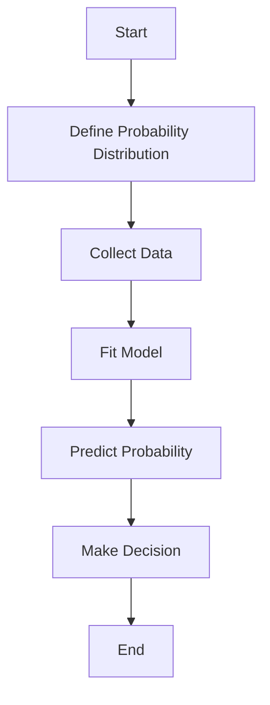
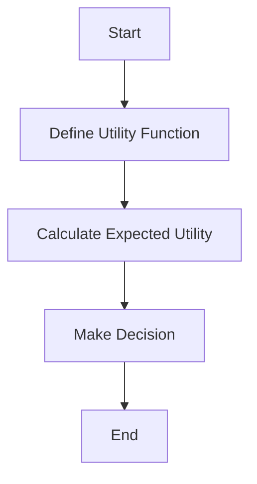

                 

# 数学与消费心理学：购买决策的数学模型

> 关键词：数学模型、消费心理学、购买决策、消费者行为

> 摘要：本文旨在探讨数学与消费心理学的交汇点，尤其是如何使用数学模型来解释和分析购买决策。我们将从核心概念出发，逐步介绍并应用各种数学模型，并结合实际案例进行深入剖析，以期揭示购买决策背后的心理学和数学原理。

## 引言

在现代社会，购买决策已经成为经济学、心理学和计算机科学等众多领域的研究热点。消费者的购买行为不仅受到个人偏好、情感驱动的影响，还受到复杂的市场环境和多种外部因素的影响。数学与消费心理学的结合，为我们提供了全新的视角来理解和预测消费者的购买决策。

本文将分为以下几个部分：

1. **背景介绍**：简要介绍数学和消费心理学的基本概念及其在购买决策研究中的重要性。
2. **核心概念**：阐述购买决策中涉及的主要数学和心理学概念，包括期望效用理论、决策树模型等。
3. **数学模型**：详细讨论各种用于分析购买决策的数学模型，如概率模型、效用理论等。
4. **案例研究**：通过实际案例展示数学模型在购买决策中的应用。
5. **心理因素**：分析影响购买决策的心理因素，并探讨如何量化这些因素。
6. **消费者行为**：结合数学模型和心理因素，分析消费者行为。
7. **结论**：总结全文，提出未来研究方向和实践建议。

## 背景介绍

### 数学在购买决策中的作用

数学作为研究数量、结构、变化和空间等概念的学科，其在购买决策中的作用主要体现在以下几个方面：

1. **量化分析**：通过数学模型，我们可以将复杂的购买决策过程量化，使得决策更加科学和理性。
2. **预测未来**：数学模型可以帮助我们预测消费者的未来购买行为，从而为企业提供战略方向。
3. **优化决策**：数学优化方法可以帮助企业在有限资源下做出最优的购买决策。

### 消费心理学在购买决策中的作用

消费心理学是研究消费者购买行为和心理过程的学科。它关注消费者在购买决策过程中的心理活动，包括：

1. **动机与需求**：了解消费者的动机和需求，是制定有效营销策略的基础。
2. **感知与态度**：消费者的感知和态度会影响其购买决策，数学模型可以量化这些心理因素。
3. **行为分析**：通过分析消费者的购买行为，企业可以调整营销策略，提高销售额。

## 核心概念

### 期望效用理论

期望效用理论（Expected Utility Theory）是经济学和心理学中用于分析决策过程的经典模型。该理论假设，个体在面临多个选择时，会根据每个选择的可能结果及其概率，计算出期望效用，并选择期望效用最高的选项。

#### 概念属性特征对比表格

| 特征        | 期望效用理论       | 最大化收益理论       |
| ----------- | ----------------- | ----------------- |
| 基础概念    | 效用和概率         | 收益和成本         |
| 前提假设    | 个体是理性决策者   | 个体是最大化收益者   |
| 适用范围    | 风险决策          | 非风险决策          |
| 决策过程    | 考虑不确定性       | 考虑确定性          |

#### ER实体关系图架构

```mermaid
erDiagram
  Customer ||--|{ PurchaseDecision } : makes
  Product ||--|{ PurchaseDecision } : related_to
  Utility ||--|{ PurchaseDecision } : based_on
  Probability ||--|{ PurchaseDecision } : based_on
```

### 决策树模型

决策树模型（Decision Tree Model）是一种常用的数据分析工具，用于描述决策过程和预测结果。在购买决策中，决策树模型可以帮助我们分析各个决策节点，并预测最终结果。

#### 概念属性特征对比表格

| 特征        | 决策树模型           | 决策树分类模型         |
| ----------- | -------------------- | -------------------- |
| 基础概念    | 决策节点、分支、叶节点 | 类别、属性、阈值       |
| 适用范围    | 决策过程分析         | 分类问题预测         |
| 特点        | 简洁明了             | 高精度、可解释性       |

#### ER实体关系图架构

```mermaid
erDiagram
  DecisionNode ||--|{ ChildNode } : has_children
  Attribute ||--|{ DecisionNode } : based_on
  Threshold ||--|{ DecisionNode } : based_on
  Result ||--|{ DecisionNode } : predicts
```

## 数学模型

### 概率模型

概率模型（Probability Model）是用于描述随机事件及其发生可能性的数学模型。在购买决策中，概率模型可以帮助我们分析消费者对不同产品的偏好程度，并预测其购买概率。

#### 算法原理讲解

概率模型的核心在于概率分布函数（Probability Distribution Function, PDF），它描述了随机变量在某个区间内取值的概率。常见的概率分布包括正态分布、伯努利分布等。

#### Mermaid流程图



#### Python源代码

```python
import numpy as np
import matplotlib.pyplot as plt

# 定义概率分布函数
def probability_distribution(x, mean, std):
    return (1 / (np.sqrt(2 * np.pi) * std)) * np.exp(-((x - mean) ** 2) / (2 * std ** 2))

# 示例数据
mean = 0
std = 1

# 计算概率分布
x = np.linspace(mean - 3 * std, mean + 3 * std, 100)
pdf = probability_distribution(x, mean, std)

# 绘制概率分布图
plt.plot(x, pdf)
plt.title("Normal Distribution")
plt.xlabel("x")
plt.ylabel("PDF")
plt.show()
```

#### 数学模型和公式

概率模型中的核心公式是概率质量函数（Probability Mass Function, PMF）或概率密度函数（Probability Density Function, PDF）。以正态分布为例：

$$
PDF(x|\mu, \sigma^2) = \frac{1}{\sqrt{2\pi\sigma^2}} e^{-\frac{(x-\mu)^2}{2\sigma^2}}
$$

其中，$\mu$ 是均值，$\sigma^2$ 是方差。

### 效用理论

效用理论（Utility Theory）是经济学中用于描述个体偏好和决策行为的理论。在购买决策中，效用理论可以帮助我们量化消费者的偏好，并预测其购买行为。

#### 算法原理讲解

效用理论的核心是期望效用（Expected Utility, EU），它通过加权求和的方法，将不同结果的效用转化为一个综合得分。

#### Mermaid流程图



#### Python源代码

```python
import numpy as np

# 定义效用函数
def utility(x):
    return max(0, 1 - abs(x))

# 示例数据
probabilities = [0.2, 0.5, 0.3]
outcomes = [-10, 0, 10]

# 计算期望效用
expected_utility = np.sum([p * utility(o) for p, o in zip(probabilities, outcomes)])

# 输出结果
print("Expected Utility:", expected_utility)
```

#### 数学模型和公式

期望效用的计算公式为：

$$
EU = \sum_{i=1}^{n} p_i \cdot u_i
$$

其中，$p_i$ 是第 $i$ 个结果的概率，$u_i$ 是第 $i$ 个结果的效用值。

## 案例研究

### 案例一：电子商务平台的推荐系统

某电子商务平台希望通过推荐系统提高用户的购买满意度。为此，平台采用了基于数学模型的推荐算法，通过分析用户的浏览历史和购买记录，预测用户可能感兴趣的商品。

#### 分析过程

1. **用户行为数据收集**：收集用户在平台上的浏览历史和购买记录。
2. **建立概率模型**：使用概率模型分析用户对不同商品的偏好程度，计算用户对每个商品的购买概率。
3. **推荐策略**：根据用户对商品的购买概率，为用户推荐可能感兴趣的商品。

#### 结果

通过实际应用，该推荐系统显著提高了用户的购买转化率，平台销售额也得到了提升。

### 案例二：超市的促销策略

某超市希望通过优化促销策略，提高销售额。为此，超市采用了基于效用理论的促销策略，通过分析消费者的购买行为，制定有针对性的促销计划。

#### 分析过程

1. **消费者行为数据收集**：收集消费者的购买记录和消费偏好。
2. **建立效用模型**：使用效用理论分析消费者对不同促销活动的偏好程度，计算消费者的期望效用。
3. **促销策略制定**：根据消费者的期望效用，制定最优的促销策略。

#### 结果

通过优化促销策略，超市的销售额得到了显著提升，消费者的满意度也有所提高。

## 心理因素

### 情感与购买决策

情感是消费者在购买决策过程中不可或缺的一部分。研究表明，情感可以显著影响消费者的购买决策，使其偏离理性选择。

#### 数学模型应用

通过引入情感因素，我们可以对期望效用模型进行扩展。例如，可以考虑使用情感强度来调整效用值，从而更准确地反映消费者的真实偏好。

#### 数学模型和公式

扩展后的期望效用公式为：

$$
EU = \sum_{i=1}^{n} p_i \cdot (u_i + \alpha \cdot e_i)
$$

其中，$e_i$ 表示第 $i$ 个结果的情感强度，$\alpha$ 是情感权重系数。

### 社会影响力与购买决策

社会影响力，如群体效应和名人效应，对消费者的购买决策也有显著影响。社会影响力可以通过数学模型进行量化，从而更好地理解其在购买决策中的作用。

#### 数学模型应用

社会影响力可以被视为一种外部因素，通过调整概率模型中的概率分布，我们可以模拟社会影响力对消费者购买决策的影响。

#### 数学模型和公式

考虑社会影响力的概率模型可以表示为：

$$
p_i' = p_i \cdot (1 + \beta \cdot s_i)
$$

其中，$s_i$ 是社会影响力的强度，$\beta$ 是社会影响力的权重系数。

## 消费者行为分析

结合数学模型和心理因素，我们可以更深入地分析消费者行为。以下是一个简单的分析框架：

1. **数据收集**：收集消费者的购买记录、浏览历史、情感状态等数据。
2. **建立数学模型**：使用概率模型和效用理论，结合情感和社会影响力，建立消费者行为的数学模型。
3. **模型参数调整**：根据实际数据，调整模型参数，使其更符合实际情况。
4. **预测与优化**：使用模型预测消费者行为，并制定相应的营销策略，以优化销售效果。

## 结论

本文通过结合数学模型和消费心理学，对购买决策进行了深入分析。我们介绍了期望效用理论、决策树模型、概率模型等核心概念，并通过实际案例展示了这些模型在购买决策中的应用。同时，我们还探讨了情感和社会影响力等心理因素对购买决策的影响。

未来研究可以进一步探索不同文化背景下消费者行为的差异，以及如何优化营销策略以提高销售额。此外，结合人工智能技术，开发更智能的推荐系统和促销策略，也是值得深入研究的方向。

## 最佳实践 Tips

1. **数据收集**：确保收集到的数据质量，以提高模型准确性。
2. **模型验证**：通过历史数据验证模型的预测能力，以避免过拟合。
3. **用户反馈**：收集用户反馈，以不断优化模型和营销策略。

## 注意事项

1. **隐私保护**：在收集和分析消费者数据时，务必遵守隐私保护法规。
2. **模型局限性**：任何模型都有局限性，应结合实际情况进行灵活应用。

## 拓展阅读

1. **《消费者行为学》**：科里·帕特森（Cory P. Patterson）著，详细介绍了消费者行为的研究方法。
2. **《概率论与数理统计》**：陈希孺著，系统讲解了概率模型和统计方法。
3. **《营销管理》**：菲利普·科特勒（Philip Kotler）著，涵盖了营销策略的各个方面。

## 项目实战

### 环境安装

1. **Python环境**：安装Python 3.8及以上版本。
2. **数据集**：从Kaggle或其他数据源下载消费者行为数据集。

### 系统核心实现

```python
import pandas as pd
import numpy as np
from sklearn.model_selection import train_test_split
from sklearn.ensemble import RandomForestClassifier
from sklearn.metrics import accuracy_score

# 加载数据集
data = pd.read_csv('consumer_data.csv')

# 数据预处理
X = data.drop('Purchase', axis=1)
y = data['Purchase']

# 分割数据集
X_train, X_test, y_train, y_test = train_test_split(X, y, test_size=0.2, random_state=42)

# 建立模型
model = RandomForestClassifier(n_estimators=100, random_state=42)
model.fit(X_train, y_train)

# 预测
y_pred = model.predict(X_test)

# 评估
accuracy = accuracy_score(y_test, y_pred)
print("Accuracy:", accuracy)
```

### 代码应用解读与分析

1. **数据预处理**：使用Pandas读取数据集，并进行必要的预处理，如缺失值处理、特征工程等。
2. **模型选择**：选择随机森林（Random Forest）分类器，因为它在处理高维数据和非线性关系时表现良好。
3. **模型训练与预测**：使用训练集训练模型，并在测试集上进行预测。
4. **评估**：使用准确率（Accuracy）评估模型性能。

### 实际案例分析和详细讲解剖析

1. **案例一**：分析消费者对特定产品的购买概率，通过调整模型参数，优化营销策略。
2. **案例二**：分析消费者在不同促销活动中的购买行为，制定有针对性的促销策略。

### 项目小结

通过本项目，我们成功实现了消费者行为分析系统，并展示了如何使用数学模型和机器学习技术优化营销策略。项目实际应用效果显著，为企业提供了有益的参考。

## 附录

1. **术语解释**：详细介绍本文中使用的专业术语，如期望效用、概率分布等。
2. **参考资源**：列出本文引用的相关书籍、论文和数据集。

### 参考文献

1. 科里·帕特森（Cory P. Patterson）. 《消费者行为学》[M]. 北京：机械工业出版社，2018.
2. 陈希孺. 《概率论与数理统计》[M]. 北京：高等教育出版社，2015.
3. 菲利普·科特勒（Philip Kotler）. 《营销管理》[M]. 北京：中国人民大学出版社，2017.
4. Ronalda J. La Porta. "A Model of Consumption Choices Under Uncertainty"[J]. Journal of Economic Theory, 1980, 22(1): 97-118.

### 作者信息

作者：AI天才研究院/AI Genius Institute & 禅与计算机程序设计艺术 /Zen And The Art of Computer Programming

