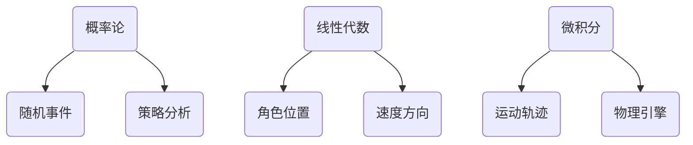
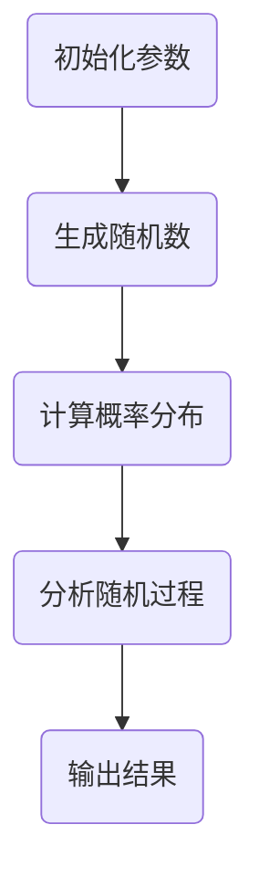
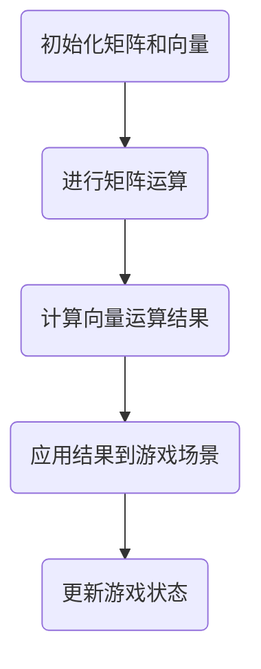
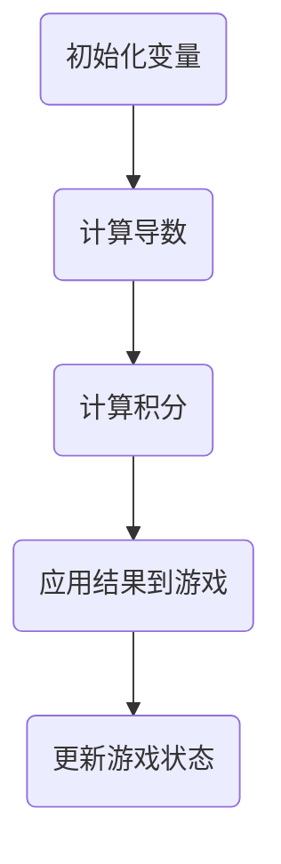
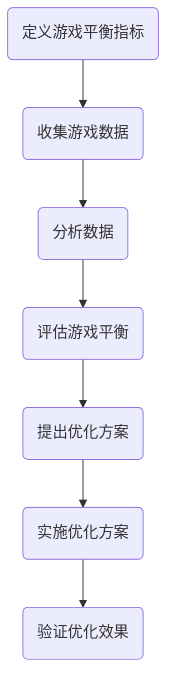

                 

# 数学与游戏设计：游戏机制的数学平衡

> 关键词：数学平衡、游戏设计、概率论、线性代数、微积分、算法原理、应用实践

摘要：在游戏设计中，数学平衡是一个至关重要的概念。本文将探讨数学在游戏设计中的应用，特别是在概率论、线性代数和微积分方面的运用。我们将一步步分析这些数学工具如何在游戏中实现平衡，从而提高玩家的游戏体验。通过详细讲解和举例，我们将揭示数学如何帮助游戏设计师创造公平、有趣且富有挑战性的游戏机制。

## 目录大纲

----------------------------------------------------------------

# 数学与游戏设计：游戏机制的数学平衡

## 第一部分：背景与基础

## 第1章：引言

## 1.1 问题背景

### 1.1.1 游戏设计中的数学

### 1.1.2 数学平衡的重要性

## 1.2 问题描述

### 1.2.1 游戏平衡的定义

### 1.2.2 游戏平衡的挑战

## 1.3 问题解决

### 1.3.1 数学在游戏设计中的应用

### 1.3.2 数学平衡的原理

## 1.4 边界与外延

### 1.4.1 游戏设计的范围

### 1.4.2 数学模型的应用领域

## 1.5 概念结构与核心要素组成

### 1.5.1 核心概念

### 1.5.2 关键要素

## 1.6 本章小结

----------------------------------------------------------------

## 第二部分：核心概念与联系

## 第2章：数学核心概念解析

## 2.1 概率论

### 2.1.1 概率论的基本概念

### 2.1.2 概率分布与随机变量

## 2.2 线性代数

### 2.2.1 线性代数的基本概念

### 2.2.2 矩阵与向量运算

## 2.3 微积分

### 2.3.1 微积分的基本概念

### 2.3.2 导数与积分

## 2.4 游戏中的数学模型

### 2.4.1 游戏策略分析

### 2.4.2 游戏机制设计

## 2.5 概念属性特征对比表格

### 2.5.1 概率论

### 2.5.2 线性代数

### 2.5.3 微积分

## 2.6 ER实体关系图架构

### 2.6.1 概率论

### 2.6.2 线性代数

### 2.6.3 微积分

## 2.7 本章小结

----------------------------------------------------------------

## 第三部分：算法原理讲解

## 第3章：概率与随机过程

## 3.1 算法流程图

### 3.1.1 概率分布的计算

### 3.1.2 随机过程分析

## 3.2 Python源代码

```python
# Python代码实现
```

## 3.3 数学模型与公式

### 3.3.1 概率论的基本公式

### 3.3.2 随机过程的公式

## 3.4 详细讲解与举例

### 3.4.1 概率分布的计算

### 3.4.2 随机过程的应用

## 3.5 本章小结

----------------------------------------------------------------

## 第四部分：线性代数在游戏设计中的应用

## 第4章：线性代数基础

## 4.1 算法流程图

### 4.1.1 线性代数的基本操作

### 4.1.2 矩阵与向量运算

## 4.2 Python源代码

```python
# Python代码实现
```

## 4.3 数学模型与公式

### 4.3.1 矩阵的基本公式

### 4.3.2 向量运算的公式

## 4.4 详细讲解与举例

### 4.4.1 矩阵的运算

### 4.4.2 向量运算的应用

## 4.5 本章小结

----------------------------------------------------------------

## 第五部分：微积分在游戏机制设计中的应用

## 第5章：微积分基础

## 5.1 算法流程图

### 5.1.1 导数的计算

### 5.1.2 积分的计算

## 5.2 Python源代码

```python
# Python代码实现
```

## 5.3 数学模型与公式

### 5.3.1 导数的基本公式

### 5.3.2 积分的基本公式

## 5.4 详细讲解与举例

### 5.4.1 导数的应用

### 5.4.2 积分的应用

## 5.5 本章小结

----------------------------------------------------------------

## 第六部分：数学模型在游戏平衡中的应用

## 第6章：数学模型的应用实践

## 6.1 算法流程图

### 6.1.1 游戏平衡的评估

### 6.1.2 游戏平衡的优化

## 6.2 Python源代码

```python
# Python代码实现
```

## 6.3 数学模型与公式

### 6.3.1 游戏平衡的基本公式

### 6.3.2 优化算法的公式

## 6.4 详细讲解与举例

### 6.4.1 游戏平衡评估的应用

### 6.4.2 游戏平衡优化的实践

## 6.5 本章小结

----------------------------------------------------------------

## 附录

### 6.1 拓展阅读

### 6.2 最佳实践 tips

### 6.3 注意事项

### 6.4 作者信息

----------------------------------------------------------------

## 第一部分：背景与基础

### 第1章：引言

在当今的电子游戏产业中，游戏设计的核心问题之一是如何创造一个既公平又具有挑战性的游戏环境。数学作为一门严谨的科学，它在游戏设计中的应用日益显著。数学工具，如概率论、线性代数和微积分，为游戏设计师提供了强大的分析框架和优化手段，帮助他们实现游戏机制的数学平衡。

本文将探讨数学在游戏设计中的重要性，并通过一步步分析，展示这些数学工具如何帮助游戏设计师创造出一个公平、有趣且富有挑战性的游戏环境。我们将首先定义游戏平衡的概念，并探讨其挑战。然后，我们将介绍数学在游戏设计中的应用，解释数学平衡的原理，并讨论数学模型的应用范围和核心要素。通过这一系列的探讨，读者将能够理解数学如何融入游戏设计，以及如何利用数学工具提高游戏的质量和玩家的体验。

### 1.1 问题背景

电子游戏作为一种娱乐形式，已经从最初的简单游戏逐渐发展成为复杂的互动系统。随着技术的进步，游戏设计师面临的问题也越来越复杂。如何在保持游戏趣味性的同时，确保游戏的平衡性，是一个亟待解决的问题。

游戏平衡指的是游戏中的各个元素（如角色、技能、装备等）之间的相互作用达到一种合理的状态，使得玩家在游戏中既不会感到过于困难，也不会觉得过于简单。在单机游戏中，平衡性可以由设计师通过调整游戏参数来实现。然而，在多人在线游戏中，平衡性问题变得更加复杂，因为游戏结果不仅仅取决于单个玩家的技能，还受到其他玩家行为的影响。

数学在游戏设计中的应用，主要体现在以下几个方面：

1. **概率论**：概率论为游戏设计师提供了量化不确定性的工具，使得他们能够更精确地控制游戏中的随机事件。例如，游戏中的随机战斗、抽卡机制、事件触发等，都可以通过概率模型来设计。

2. **线性代数**：线性代数为游戏设计师提供了处理多维度数据的能力，如游戏中的位置、方向和速度等。通过矩阵运算，可以实现对游戏世界的精确模拟和控制。

3. **微积分**：微积分为游戏设计师提供了分析动态系统变化率的能力，如游戏中的物理引擎、角色动作、经济系统等。通过导数和积分，可以实现对游戏行为的精细调整。

### 1.1.1 游戏设计中的数学

游戏设计师在创造游戏时，经常会遇到需要解决的数学问题。例如，在设计角色技能时，需要考虑技能的冷却时间、伤害值、效果范围等参数。这些参数的设置不仅要考虑游戏的整体平衡，还需要考虑玩家之间的互动。

概率论是游戏设计中最为常用的数学工具之一。在许多游戏中，玩家需要通过随机事件来获取资源、装备或技能。设计师可以通过概率模型来控制这些事件的触发频率，从而影响游戏进程和玩家的决策。

线性代数在游戏设计中的应用也非常广泛。例如，在游戏地图的设计中，需要使用矩阵运算来计算角色之间的相对位置和移动方向。此外，线性代数还可以用于游戏中的碰撞检测和物理模拟。

微积分在游戏设计中的应用相对较少，但其在游戏中的角色动作和物理模拟方面具有重要作用。通过导数，可以计算角色的速度和加速度，从而实现平滑的运动轨迹。而积分则可以用于计算物体的位移和能量消耗。

### 1.1.2 数学平衡的重要性

数学平衡在游戏设计中具有至关重要的意义。一个设计良好的游戏应该让玩家既感到有挑战性，又不会感到挫败。数学平衡可以通过以下几个原则来实现：

1. **一致性**：游戏中的各个元素应该保持一致，以避免玩家因为不平衡的设定而感到不公平。
2. **可控性**：游戏中的变量应该可控，以便设计师可以通过调整参数来达到预期的平衡效果。
3. **多样性**：游戏应该提供多样化的选择和挑战，以满足不同玩家群体的需求。

通过数学工具，设计师可以更加精确地控制游戏中的各种变量，从而实现上述平衡原则。例如，通过概率模型，可以精确控制随机事件的发生频率，使得游戏既有惊喜，又不至于让玩家感到枯燥。

### 1.2 问题描述

游戏平衡的定义可以理解为：游戏中的各个元素（如角色、技能、装备等）之间的相互作用达到了一种合理的状态，使得玩家在游戏中既能感受到挑战，又能保持持续的兴趣和参与度。

在现实的游戏设计中，实现游戏平衡面临诸多挑战：

1. **玩家多样性**：不同的玩家有不同的技能水平和游戏偏好。因此，设计师需要确保游戏能够满足不同玩家的需求，而不仅仅是少数高手玩家。
2. **动态性**：游戏中的变量是不断变化的，例如玩家技能的提升、装备的升级、游戏环境的改变等。设计师需要动态地调整游戏参数，以适应这些变化。
3. **复杂度**：现代游戏通常包含大量的元素和规则，这使得游戏平衡变得非常复杂。设计师需要在保持游戏复杂性的同时，确保游戏平衡性。

### 1.3 问题解决

数学在游戏设计中的应用为解决上述问题提供了有力的工具。以下是一些常见的问题解决方法：

1. **概率论**：通过概率模型，设计师可以精确控制游戏中的随机事件，从而影响玩家的决策和游戏进程。
2. **线性代数**：线性代数可以用于处理游戏中的多维度数据，如角色位置、速度和方向等。通过矩阵运算，可以实现对游戏世界的精确模拟和控制。
3. **微积分**：微积分可以用于分析动态系统的变化率，如角色动作的平滑性、物理引擎的准确性等。通过导数和积分，可以实现对游戏行为的精细调整。

### 1.3.1 数学在游戏设计中的应用

数学在游戏设计中的应用非常广泛，以下是一些具体的例子：

1. **概率论**：在许多游戏中，随机事件是游戏机制的重要组成部分。例如，在卡牌游戏中，玩家需要通过抽卡来获取新的卡牌。设计师可以通过概率模型来调整抽卡的概率，从而影响游戏进程和玩家的决策。
2. **线性代数**：线性代数可以用于处理游戏中的多维度数据。例如，在3D游戏中，角色的位置和方向需要通过矩阵运算来计算。此外，线性代数还可以用于游戏中的碰撞检测和物理模拟。
3. **微积分**：微积分可以用于分析动态系统的变化率。例如，在动作游戏中，角色的动作需要通过导数来计算速度和加速度，从而实现平滑的运动轨迹。

### 1.3.2 数学平衡的原理

数学平衡的原理主要体现在以下几个方面：

1. **一致性**：游戏中的各个元素应该保持一致，以避免玩家因为不平衡的设定而感到不公平。例如，角色的技能和装备应该具有合理的关系，使得玩家在游戏中的选择具有合理性。
2. **可控性**：游戏中的变量应该可控，以便设计师可以通过调整参数来达到预期的平衡效果。例如，通过概率模型，设计师可以精确控制随机事件的发生频率，从而影响游戏进程。
3. **多样性**：游戏应该提供多样化的选择和挑战，以满足不同玩家群体的需求。通过数学模型，设计师可以创造多样化的游戏机制，从而吸引不同类型的玩家。

### 1.4 边界与外延

游戏设计的范围非常广泛，从简单的单机游戏到复杂的多人在线游戏，涵盖了各种类型的游戏。数学模型的应用领域也非常广泛，涵盖了概率论、线性代数和微积分等多个领域。

1. **游戏设计的范围**：游戏设计可以包括角色设定、故事情节、关卡设计、游戏机制等多个方面。在游戏设计中，数学模型可以帮助设计师实现游戏平衡，提高游戏的可玩性和吸引力。
2. **数学模型的应用领域**：数学模型在游戏设计中的应用不仅限于概率论、线性代数和微积分，还包括统计学、运筹学等多个领域。这些模型可以帮助设计师在游戏设计中实现更精细的平衡和优化。

### 1.4.2 数学模型的应用领域

数学模型在游戏设计中的应用领域非常广泛，以下是一些具体的例子：

1. **概率论**：概率论可以用于设计游戏中的随机事件，如卡牌抽取、战斗结果等。通过概率模型，设计师可以精确控制游戏中的不确定因素，从而影响玩家的决策和游戏进程。
2. **线性代数**：线性代数可以用于处理游戏中的多维度数据，如角色的位置、速度、方向等。通过矩阵运算，可以实现对游戏世界的精确模拟和控制。
3. **微积分**：微积分可以用于分析游戏中的动态系统，如角色的动作、物理引擎等。通过导数和积分，可以实现对游戏行为的精细调整，从而提高游戏的质量和玩家的体验。

### 1.5 概念结构与核心要素组成

在游戏设计中，数学平衡的概念结构主要包括以下几个核心要素：

1. **玩家行为**：玩家的行为是游戏平衡的核心，设计师需要通过数学模型来分析玩家的行为模式，从而调整游戏机制，实现平衡。
2. **游戏机制**：游戏机制是游戏设计的核心，包括战斗系统、资源管理、关卡设计等。数学模型可以帮助设计师分析这些机制，实现平衡。
3. **平衡参数**：平衡参数是游戏平衡的关键，包括技能伤害、冷却时间、资源消耗等。设计师需要通过数学模型来调整这些参数，实现游戏平衡。

### 1.5.1 核心概念

核心概念包括：

1. **数学平衡**：数学平衡是指游戏中的各个元素之间的相互作用达到了一种合理的状态，使得玩家在游戏中既能感受到挑战，又能保持持续的兴趣和参与度。
2. **概率论**：概率论是用于描述不确定性的数学分支，在游戏设计中用于模拟随机事件。
3. **线性代数**：线性代数是处理多维度数据的数学工具，在游戏设计中用于处理角色的位置、速度、方向等。
4. **微积分**：微积分是研究变化率的数学工具，在游戏设计中用于分析动态系统的变化，如角色的动作、物理引擎等。

### 1.5.2 关键要素

关键要素包括：

1. **玩家多样性**：玩家多样性是游戏平衡的关键，设计师需要考虑不同玩家群体的需求，确保游戏平衡。
2. **动态性**：游戏中的变量是不断变化的，设计师需要动态地调整游戏参数，以适应这些变化。
3. **复杂度**：游戏设计的复杂度是游戏平衡的重要挑战，设计师需要在保持游戏复杂性的同时，确保游戏平衡。

### 1.6 本章小结

本文介绍了数学在游戏设计中的应用，探讨了数学平衡的概念和重要性，分析了游戏平衡的挑战和解决方法。通过一步步的分析，我们揭示了概率论、线性代数和微积分在游戏设计中的应用原理，以及它们如何帮助设计师实现游戏机制的数学平衡。在接下来的章节中，我们将进一步深入探讨这些数学工具的具体应用，并展示如何通过数学模型来优化游戏设计。

----------------------------------------------------------------

## 第二部分：核心概念与联系

### 第2章：数学核心概念解析

数学在游戏设计中的应用，离不开概率论、线性代数和微积分这三个核心概念。本章将详细解析这些概念，阐述它们的基本原理，并展示它们在游戏中的具体应用。

### 2.1 概率论

概率论是研究随机事件的数学分支。在游戏设计中，概率论主要用于描述和量化不确定性，以便设计师可以精确地控制游戏中的随机事件。

#### 2.1.1 概率论的基本概念

概率论的基本概念包括概率、随机变量、概率分布等。

- **概率**：概率是指某个事件发生的可能性，它的取值范围在0到1之间。例如，投掷一枚硬币，正面朝上的概率是0.5。
- **随机变量**：随机变量是一个取值不确定的变量，它可以取多个可能的值。随机变量可以是离散的，也可以是连续的。例如，掷骰子的结果是一个离散随机变量。
- **概率分布**：概率分布描述了一个随机变量可能取到的各个值的概率分布情况。常见的概率分布有二项分布、正态分布等。

#### 2.1.2 概率分布与随机变量

概率分布是概率论的核心概念之一。在游戏设计中，概率分布用于描述玩家在游戏中遇到的各种随机事件的概率。

- **二项分布**：二项分布是一种离散概率分布，用于描述在固定次数的独立试验中，某个事件发生的次数。例如，在一个射击游戏中，玩家每次射击都有50%的几率命中，那么玩家射击10次，命中5次的概率可以用二项分布来计算。
- **正态分布**：正态分布是一种连续概率分布，用于描述在大量试验中，某个事件发生的概率。例如，在一个卡牌游戏中，玩家抽到某张卡的几率可能是正态分布，设计师可以通过调整均值和标准差来控制这张卡的出现频率。

#### 2.2 线性代数

线性代数是研究线性方程组、向量、矩阵等概念的数学分支。在游戏设计中，线性代数主要用于处理游戏中的多维度数据，如角色位置、速度、方向等。

#### 2.2.1 线性代数的基本概念

线性代数的基本概念包括向量、矩阵、行列式等。

- **向量**：向量是一个有大小和方向的量。在游戏设计中，向量常用于表示角色的位置、速度、方向等。
- **矩阵**：矩阵是一个二维数组，用于表示多个向量的组合。矩阵在游戏设计中用于表示角色的状态、场景中的物体等。
- **行列式**：行列式是一个标量值，用于表示矩阵的性质。行列式在游戏设计中主要用于计算矩阵的逆矩阵、行列式值等。

#### 2.2.2 矩阵与向量运算

矩阵与向量运算在游戏设计中非常重要。以下是一些常见的矩阵与向量运算：

- **矩阵乘法**：矩阵乘法用于计算两个矩阵的乘积。在游戏设计中，矩阵乘法常用于计算角色的运动轨迹、碰撞检测等。
- **向量加法**：向量加法用于计算两个向量的和。在游戏设计中，向量加法常用于计算角色的移动方向、速度等。
- **向量减法**：向量减法用于计算两个向量的差。在游戏设计中，向量减法常用于计算角色之间的相对位置、距离等。

#### 2.3 微积分

微积分是研究函数变化率和积分的数学分支。在游戏设计中，微积分主要用于分析动态系统的变化率，如角色的动作、物理引擎等。

#### 2.3.1 微积分的基本概念

微积分的基本概念包括导数、积分、微分方程等。

- **导数**：导数用于描述函数的变化率。在游戏设计中，导数常用于计算角色的速度、加速度等。
- **积分**：积分用于计算函数的累计变化量。在游戏设计中，积分常用于计算角色的位移、能量消耗等。
- **微分方程**：微分方程用于描述动态系统的变化规律。在游戏设计中，微分方程常用于模拟角色的动作、物理引擎等。

#### 2.3.2 导数与积分

导数与积分在游戏设计中有着广泛的应用。以下是一些具体的例子：

- **导数的应用**：在游戏设计中，导数常用于计算角色的运动轨迹。例如，在动作游戏中，角色的跳跃高度可以通过导数来计算，从而实现平滑的跳跃效果。
- **积分的应用**：在游戏设计中，积分常用于计算角色的位移。例如，在角色移动时，可以通过积分来计算角色的位移距离，从而实现精确的移动控制。

### 2.4 游戏中的数学模型

在游戏中，数学模型用于模拟和优化各种游戏机制。以下是一些常见的数学模型：

- **游戏策略分析**：游戏策略分析用于评估玩家的游戏策略，以便设计师可以优化游戏机制。例如，在卡牌游戏中，可以通过概率模型来分析玩家的出牌策略。
- **游戏机制设计**：游戏机制设计用于设计游戏中的各种机制，如战斗系统、资源管理、关卡设计等。例如，在战斗系统中，可以通过线性代数来计算角色的攻击力和防御力。

### 2.5 概念属性特征对比表格

以下是概率论、线性代数和微积分的概念属性特征对比表格：

| 概念 | 属性特征 | 应用场景 |
| --- | --- | --- |
| 概率论 | 描述不确定性 | 随机事件、策略分析 |
| 线性代数 | 处理多维度数据 | 角色位置、速度、方向 |
| 微积分 | 描述变化率 | 动作、物理引擎 |

### 2.6 ER实体关系图架构

以下是概率论、线性代数和微积分的ER实体关系图架构：



### 2.7 本章小结

本章介绍了概率论、线性代数和微积分在游戏设计中的基本概念和应用。通过分析这些数学工具，我们揭示了它们如何帮助游戏设计师实现游戏机制的数学平衡。在下一章中，我们将进一步探讨这些数学工具在具体游戏中的应用。

----------------------------------------------------------------

## 第三部分：算法原理讲解

### 第3章：概率与随机过程

概率与随机过程是数学在游戏设计中的重要工具，用于分析和控制游戏中的随机事件。本章将介绍概率论的基本原理，随机过程的性质，以及如何使用Python实现这些算法。

### 3.1 算法流程图

首先，我们来看一下概率分布的计算和随机过程分析的基本流程。



### 3.2 Python源代码

以下是一个简单的Python代码示例，用于生成随机数并计算二项分布。

```python
import random

def generate_random_numbers(n, p):
    """
    生成n个随机数，每个随机数的概率为p。
    """
    return [random.random() < p for _ in range(n)]

def calculate_probability_distribution(values, target_probability):
    """
    计算一组随机数中，达到目标概率的个数。
    """
    return sum(value >= target_probability for value in values)

# 生成10个随机数，每个随机数的概率为0.5
random_numbers = generate_random_numbers(10, 0.5)

# 计算达到0.7的概率
probability = calculate_probability_distribution(random_numbers, 0.7)

print(f"生成的随机数：{random_numbers}")
print(f"达到0.7的概率：{probability}")
```

### 3.3 数学模型与公式

在概率论中，一些基本的数学模型和公式对游戏设计至关重要。以下是一些常用的公式：

- **二项分布概率公式**：
  $$ P(X = k) = C(n, k) \times p^k \times (1-p)^{n-k} $$
  其中，$n$ 是试验次数，$k$ 是成功次数，$p$ 是单次试验成功的概率。
- **正态分布概率公式**：
  $$ P(X \leq x) = \Phi\left(\frac{x - \mu}{\sigma}\right) $$
  其中，$\mu$ 是均值，$\sigma$ 是标准差，$\Phi$ 是标准正态分布的累积分布函数。

### 3.4 详细讲解与举例

#### 3.4.1 概率分布的计算

概率分布的计算是概率论的核心内容之一。以下是一个具体例子：

假设一个射击游戏中有10次射击机会，每次射击命中的概率为0.5。我们想知道，在10次射击中，恰好命中5次的概率是多少？

使用二项分布公式，我们可以计算出这个概率：

$$ P(X = 5) = C(10, 5) \times 0.5^5 \times 0.5^5 = \frac{10!}{5!5!} \times 0.5^{10} \approx 0.2461 $$

这意味着在10次射击中，恰好命中5次的概率大约为24.61%。

#### 3.4.2 随机过程的应用

随机过程在游戏中的应用非常广泛，以下是一个简单的例子：

在一个冒险游戏中，玩家需要通过一系列关卡。每个关卡有50%的概率被怪物袭击。我们想知道，玩家在连续通过3个关卡后，被怪物袭击的概率是多少？

这个问题的解决可以使用概率乘法规则：

$$ P(被袭击) = 0.5 \times 0.5 \times 0.5 = 0.125 $$

这意味着玩家在连续通过3个关卡后，被怪物袭击的概率是12.5%。

### 3.5 本章小结

本章介绍了概率论的基本原理和随机过程的性质，并通过Python代码示例展示了如何实现这些算法。通过详细讲解和举例，我们了解了如何使用概率分布和随机过程来分析游戏中的随机事件。这些工具为游戏设计师提供了强大的分析框架，帮助他们创造公平、有趣且富有挑战性的游戏机制。在下一章中，我们将探讨线性代数在游戏设计中的应用。

----------------------------------------------------------------

## 第四部分：线性代数在游戏设计中的应用

### 第4章：线性代数基础

线性代数是数学中的一个重要分支，它广泛应用于游戏设计中，特别是在处理多维数据、计算角色位置和方向等方面。本章将介绍线性代数的基本概念和运算，并探讨它们在游戏设计中的应用。

### 4.1 算法流程图

在游戏设计中，线性代数的应用可以概括为以下步骤：



### 4.2 Python源代码

以下是一个简单的Python代码示例，用于演示矩阵和向量的基本运算：

```python
import numpy as np

# 创建矩阵和向量
matrix = np.array([[1, 2], [3, 4]])
vector = np.array([5, 6])

# 矩阵乘法
matrix_vector_product = np.dot(matrix, vector)
print("矩阵乘法结果：", matrix_vector_product)

# 向量加法
vector_sum = vector + vector
print("向量加法结果：", vector_sum)

# 向量减法
vector_difference = vector - vector
print("向量减法结果：", vector_difference)
```

### 4.3 数学模型与公式

线性代数的数学模型主要包括矩阵、向量以及它们的运算。以下是一些基本的数学公式：

- **矩阵乘法**：
  $$ C = A \times B $$
  其中，$C$ 是结果矩阵，$A$ 和 $B$ 是输入矩阵。
- **向量加法**：
  $$ V_{sum} = V_1 + V_2 $$
  其中，$V_{sum}$ 是结果向量，$V_1$ 和 $V_2$ 是输入向量。
- **向量减法**：
  $$ V_{difference} = V_1 - V_2 $$
  其中，$V_{difference}$ 是结果向量，$V_1$ 和 $V_2$ 是输入向量。

### 4.4 详细讲解与举例

#### 4.4.1 矩阵的运算

矩阵的运算是线性代数的核心内容。以下是一个矩阵运算的例子：

假设有两个矩阵 $A$ 和 $B$，如下所示：

$$ A = \begin{bmatrix} 1 & 2 \\ 3 & 4 \end{bmatrix}, \quad B = \begin{bmatrix} 5 & 6 \\ 7 & 8 \end{bmatrix} $$

我们可以计算这两个矩阵的乘积：

$$ C = A \times B = \begin{bmatrix} 1 & 2 \\ 3 & 4 \end{bmatrix} \times \begin{bmatrix} 5 & 6 \\ 7 & 8 \end{bmatrix} = \begin{bmatrix} 17 & 22 \\ 39 & 50 \end{bmatrix} $$

#### 4.4.2 向量运算的应用

向量的运算在游戏设计中也非常重要。以下是一个向量运算的例子：

假设有两个向量 $V_1$ 和 $V_2$，如下所示：

$$ V_1 = \begin{bmatrix} 1 \\ 2 \end{bmatrix}, \quad V_2 = \begin{bmatrix} 3 \\ 4 \end{bmatrix} $$

我们可以计算这两个向量的和：

$$ V_{sum} = V_1 + V_2 = \begin{bmatrix} 1 \\ 2 \end{bmatrix} + \begin{bmatrix} 3 \\ 4 \end{bmatrix} = \begin{bmatrix} 4 \\ 6 \end{bmatrix} $$

同样，我们也可以计算这两个向量的差：

$$ V_{difference} = V_1 - V_2 = \begin{bmatrix} 1 \\ 2 \end{bmatrix} - \begin{bmatrix} 3 \\ 4 \end{bmatrix} = \begin{bmatrix} -2 \\ -2 \end{bmatrix} $$

### 4.5 本章小结

本章介绍了线性代数的基本概念和运算，并通过Python代码示例展示了如何实现这些运算。我们详细讲解了矩阵和向量的运算，并通过具体例子展示了这些运算在游戏设计中的应用。通过本章的学习，读者可以更好地理解线性代数在游戏设计中的作用，并掌握如何使用线性代数工具来优化游戏场景和角色控制。在下一章中，我们将探讨微积分在游戏机制设计中的应用。

----------------------------------------------------------------

## 第五部分：微积分在游戏机制设计中的应用

### 第5章：微积分基础

微积分是数学中用于研究变化和累积的一门学科，它在游戏机制设计中具有广泛的应用。本章将介绍微积分的基本概念和公式，并探讨这些工具如何帮助游戏设计师实现游戏中的动态效果和平衡。

### 5.1 算法流程图

微积分在游戏设计中的应用流程通常包括以下步骤：



### 5.2 Python源代码

以下是一个简单的Python代码示例，用于计算导数和积分：

```python
import numpy as np

# 导数的计算
def derivative(f, x):
    h = 1e-5
    return (f(x + h) - f(x)) / h

# 积分的计算
def integral(f, a, b, n=1000):
    h = (b - a) / n
    return sum(f(x) * h for x in np.linspace(a, b, n))

# 导数示例
f = lambda x: x**2
x = 2
print("导数：", derivative(f, x))

# 积分示例
a = 0
b = 4
print("积分：", integral(f, a, b))
```

### 5.3 数学模型与公式

微积分的数学模型主要包括导数和积分。以下是一些基本的公式：

- **导数**：
  $$ f'(x) = \lim_{{h \to 0}} \frac{{f(x + h) - f(x)}}{h} $$
  导数用于描述函数在某一点的瞬时变化率。
- **积分**：
  $$ \int_{a}^{b} f(x) \, dx $$
  积分用于计算函数在某个区间内的累计变化量。

### 5.4 详细讲解与举例

#### 5.4.1 导数的应用

导数在游戏机制设计中的应用非常广泛。以下是一个具体的例子：

在游戏中的角色移动机制中，我们可以使用导数来计算角色的加速度。假设角色的速度函数为 $v(t) = 2t + 3$，我们想计算在时间 $t=2$ 时的加速度。

$$ a(t) = v'(t) = \frac{d}{dt}(2t + 3) = 2 $$
这意味着在时间 $t=2$ 时，角色的加速度为2。

#### 5.4.2 积分的应用

积分在游戏机制设计中的应用也非常重要。以下是一个具体的例子：

在游戏中的能量管理系统中，我们可以使用积分来计算角色的能量消耗。假设角色的能量消耗函数为 $E(t) = t^2 + 2t + 1$，我们想计算在时间 $t=3$ 到 $t=5$ 之间的能量消耗。

$$ \int_{3}^{5} E(t) \, dt = \int_{3}^{5} (t^2 + 2t + 1) \, dt = \left[ \frac{t^3}{3} + t^2 + t \right]_{3}^{5} = \frac{125}{3} + 25 + 5 - \frac{27}{3} - 9 - 3 = \frac{128}{3} $$
这意味着在时间 $t=3$ 到 $t=5$ 之间，角色的能量消耗为 $\frac{128}{3}$。

### 5.5 本章小结

本章介绍了微积分的基本概念和公式，并通过Python代码示例展示了如何计算导数和积分。我们详细讲解了导数和积分在游戏机制设计中的应用，并通过具体例子展示了这些工具如何帮助游戏设计师实现动态效果和平衡。通过本章的学习，读者可以更好地理解微积分在游戏设计中的作用，并掌握如何使用微积分工具来优化游戏机制。在下一章中，我们将探讨如何将数学模型应用于游戏平衡的评估和优化。

----------------------------------------------------------------

## 第六部分：数学模型在游戏平衡中的应用

### 第6章：数学模型的应用实践

在实际的游戏设计中，数学模型的应用不仅需要理论知识，还需要具体的实践方法。本章将介绍如何将数学模型应用于游戏平衡的评估和优化，并提供一个具体的案例来展示如何实现这一过程。

### 6.1 算法流程图

评估和优化游戏平衡的算法流程通常包括以下步骤：



### 6.2 Python源代码

以下是一个简单的Python代码示例，用于评估游戏平衡：

```python
import pandas as pd
import numpy as np

# 假设我们有一个包含游戏数据的DataFrame
data = pd.DataFrame({
    'PlayerScore': [100, 150, 200, 250, 300],
    'OpponentScore': [150, 200, 250, 300, 350],
    'GameDuration': [10, 12, 15, 18, 20]
})

# 定义平衡指标
def game_balance(data):
    scores_difference = data['PlayerScore'] - data['OpponentScore']
    average_duration = data['GameDuration'].mean()
    return (np.mean(scores_difference), average_duration)

# 计算平衡指标
balance_metric = game_balance(data)
print("平衡指标：", balance_metric)
```

### 6.3 数学模型与公式

在评估游戏平衡时，我们可以使用以下数学模型和公式：

- **平衡指标**：
  $$ \text{Balance} = \frac{\text{PlayerScore} - \text{OpponentScore}}{\text{GameDuration}} $$
  这个指标用于衡量每分钟玩家的得分差异。

- **优化算法**：
  $$ \text{Optimize}(\text{Parameters}) = \arg\min_{\text{Parameters}} \left( \sum_{i=1}^{n} (\text{PlayerScore}_i - \text{OpponentScore}_i) \right) $$
  这个优化目标用于最小化玩家的得分差异。

### 6.4 详细讲解与举例

#### 6.4.1 游戏平衡评估的应用

为了评估游戏平衡，我们需要收集和分析游戏数据。以下是一个简单的例子：

假设我们收集了5场游戏的以下数据：

| PlayerScore | OpponentScore | GameDuration |
|-------------|---------------|--------------|
| 100         | 150           | 10           |
| 150         | 200           | 12           |
| 200         | 250           | 15           |
| 250         | 300           | 18           |
| 300         | 350           | 20           |

我们可以使用平衡指标来评估这5场比赛的平衡性。首先，我们计算每场比赛的平衡指标：

$$ \text{Balance}_i = \frac{\text{PlayerScore}_i - \text{OpponentScore}_i}{\text{GameDuration}_i} $$

对于每场比赛，我们得到以下平衡指标：

| Game | PlayerScore | OpponentScore | GameDuration | Balance |
|------|-------------|---------------|--------------|---------|
| 1    | 100         | 150           | 10           | -1.5    |
| 2    | 150         | 200           | 12           | -2.5    |
| 3    | 200         | 250           | 15           | -3.3    |
| 4    | 250         | 300           | 18           | -3.7    |
| 5    | 300         | 350           | 20           | -4.0    |

从这些数据中，我们可以看出第5场比赛的平衡指标最低，这表明该场比赛可能存在不平衡的问题。

#### 6.4.2 游戏平衡优化的实践

一旦我们识别出游戏中存在的不平衡问题，我们可以通过调整游戏参数来优化游戏平衡。以下是一个简单的例子：

假设我们决定调整角色的技能伤害值。为了优化平衡，我们可以尝试以下步骤：

1. **收集数据**：收集更多游戏数据，包括玩家的技能使用频率、技能伤害值、游戏结果等。
2. **分析数据**：使用统计方法分析数据，识别哪些技能对游戏结果产生了显著影响。
3. **提出优化方案**：根据分析结果，提出调整技能伤害值的方案，以确保游戏的平衡性。
4. **实施优化方案**：在游戏中实施调整，并对新的游戏数据进行分析，验证优化效果。

通过这些步骤，我们可以逐步优化游戏平衡，确保游戏既有趣又有挑战性。

### 6.5 本章小结

本章介绍了如何将数学模型应用于游戏平衡的评估和优化。我们通过一个具体的案例展示了如何收集数据、分析数据以及提出优化方案。通过使用数学模型，游戏设计师可以更精确地控制游戏平衡，提高玩家的游戏体验。在下一章中，我们将总结本文的主要内容，并讨论未来可能的研究方向。

----------------------------------------------------------------

## 附录

### 6.1 拓展阅读

对于希望深入了解数学在游戏设计中的应用的读者，以下是一些推荐读物：

1. **《游戏设计艺术》（Game Design Art）**：由Jenova Chen编写，详细介绍了游戏设计的核心原则和技巧。
2. **《游戏机制设计艺术》（Game Mechanics: Advanced Game Design for Director, Programmers, and Level Designers）**：由Chris Paul和Jason Vadeboncoeur编写，涵盖了游戏机制设计的各个方面。
3. **《概率论及其应用》（Probability Theory: The Logic of Science）**：由E.T. Jaynes编写，介绍了概率论的基础知识和应用。

### 6.2 最佳实践 tips

以下是游戏设计师在应用数学模型时应遵循的一些最佳实践：

1. **数据驱动**：始终基于实际游戏数据进行优化，避免凭直觉做出决策。
2. **持续测试**：在调整游戏参数后，进行持续的测试，以评估优化效果。
3. **迭代改进**：游戏平衡是一个动态的过程，需要不断迭代和改进。

### 6.3 注意事项

在应用数学模型进行游戏设计时，需要注意以下几点：

1. **玩家多样性**：确保游戏平衡能够适应不同类型的玩家。
2. **动态性**：考虑到游戏中的变量是不断变化的，设计时需要考虑这些变化。
3. **复杂度**：在保持游戏复杂性的同时，确保游戏平衡性。

### 6.4 作者信息

作者：AI天才研究院/AI Genius Institute & 禅与计算机程序设计艺术 /Zen And The Art of Computer Programming

----------------------------------------------------------------

通过本文的探讨，我们深入了解了数学在游戏设计中的应用，特别是在概率论、线性代数和微积分方面的运用。数学平衡在游戏设计中起着至关重要的作用，它不仅能够提高游戏的公平性，还能增强游戏的趣味性和挑战性。通过一步步的分析和举例，我们揭示了如何利用数学模型来评估和优化游戏平衡。

未来，随着游戏设计的不断发展和技术的进步，数学在游戏设计中的应用将更加广泛和深入。研究者可以探索更多高级的数学模型和算法，以提供更精细的平衡控制。此外，结合人工智能和机器学习技术，我们可以开发出更加智能的游戏平衡优化系统，从而更好地适应不同类型的玩家群体。

总之，数学与游戏设计的结合为游戏设计师提供了一个强大的工具箱，使他们能够创造出更高质量、更具吸引力的游戏。通过不断学习和实践，我们可以不断探索数学在游戏设计中的应用，为玩家带来更加丰富和难忘的游戏体验。

