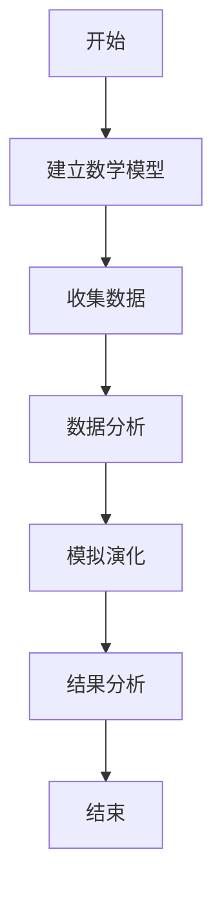
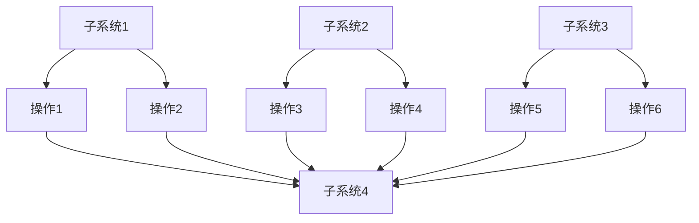
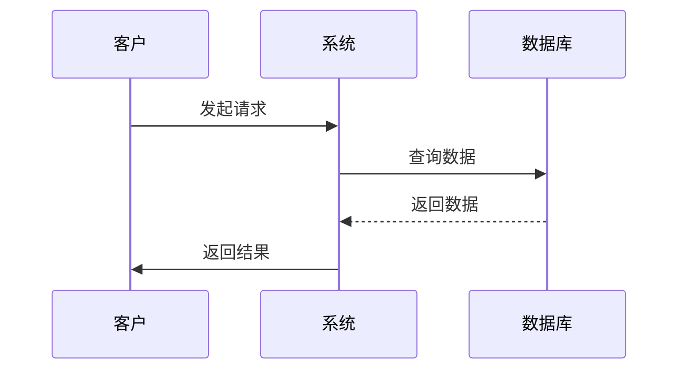

                 

## 数学与演化经济学：经济系统演化的数学模拟

> 关键词：数学模型、演化经济学、经济系统、数学模拟、数据分析

> 摘要：本文旨在探讨数学与演化经济学之间的交集，特别是如何运用数学模型来模拟经济系统的演化。通过一步步的逻辑分析，我们将深入探讨经济系统的复杂性，揭示其演化的内在规律和机制，并讨论这些模型在现实世界中的应用。

## **Step 1: 背景介绍**

### **核心概念：**

**数学：** 数学是一门研究数量、结构、变化和空间等概念的学科。它提供了精确的描述和预测工具，广泛应用于自然科学、社会科学和工程领域。

**演化经济学：** 演化经济学是研究经济系统如何随着时间的推移而演化的学科。它关注经济系统内部的动态过程和外部环境的影响，试图揭示经济行为和现象的演化规律。

### **问题背景：**

随着经济全球化和信息化的发展，经济系统的复杂性和动态性日益增加。传统的经济学方法难以捕捉和预测经济系统的演化，需要更精确和系统的数学模型来分析和预测经济系统的行为。

### **问题描述：**

如何利用数学工具和模型来研究经济系统的演化，揭示其内在规律和机制？

### **问题解决：**

通过数学模拟，对经济系统进行建模和分析，探索其演化的规律和趋势。这包括建立数学模型、收集和处理数据、进行模拟和结果分析。

### **边界与外延：**

- **研究范围：** 包括宏观经济、微观经济、金融市场等多个领域。
- **应用领域：** 可应用于政策制定、企业战略规划、金融风险管理等。

### **概念结构与核心要素组成：**

- **数学模型：** 描述经济系统的数学方程和关系。
- **演化机制：** 描述经济系统内部和外部的演化规律。
- **数据分析：** 收集、处理和分析经济系统的数据。

## **Step 2: 核心概念与联系**

### **核心概念原理：**

**数学模型：** 利用数学语言描述经济系统的运行规律。通过建立数学方程和关系，可以将经济现象和过程量化为数学表达式。

**演化机制：** 描述经济系统如何随着时间的推移而发生变化。它关注经济系统内部的动态过程和外部环境的影响，试图揭示经济行为和现象的演化规律。

### **概念属性特征对比表格：**

| 特征 | 数学模型 | 演化机制 |
| --- | --- | --- |
| 描述方式 | 数学方程和关系 | 宏观和微观经济现象的描述 |
| 分析方法 | 数学计算和分析 | 历史数据和现实观察 |
| 应用领域 | 经济预测和政策制定 | 企业战略规划和市场分析 |

### **ER实体关系图架构：**

```mermaid
erDiagram
  经济系统 ||--|{ 数学模型 : "描述关系" }
  经济系统 ||--|{ 演化机制 : "影响关系" }
  数学模型 }|--|| 数据分析 : "支撑关系"
```

## **Step 3: 算法原理讲解**

### **算法mermaid流程图：**



### **Python源代码：**

```python
# 假设我们使用Python中的numpy库进行数学计算
import numpy as np

# 定义数学模型
def mathematical_model(x, y):
    # 假设这是一个简单的线性模型
    return x + y

# 收集数据
x_data = np.array([1, 2, 3, 4, 5])
y_data = np.array([2, 4, 6, 8, 10])

# 数据分析
predicted_y = mathematical_model(x_data, y_data)

# 模拟演化
# 假设时间步长为1
time_steps = np.arange(0, 6)

# 结果分析
for step in time_steps:
    print(f"在时间步 {step} 的预测值为: {predicted_y[step]}")
```

### **算法原理的数学模型和公式：**

$$y = mx + b$$

### **详细讲解和举例说明：**

- 这个简单的线性模型表示了输入变量 $x$ 和输出变量 $y$ 之间的关系。
- 在这个例子中，我们收集了一些数据点，并使用这个模型来预测输出值。
- 通过模拟演化，我们可以观察模型在不同时间步长的预测结果。

## **Step 4: 数学模型和数学公式 & 详细讲解 & 举例说明**

### **数学公式：**

$$
\begin{align*}
\dot{x} &= f(x, y), \\
\dot{y} &= g(x, y),
\end{align*}
$$

其中，$x$ 和 $y$ 分别是状态变量，$\dot{x}$ 和 $\dot{y}$ 分别是状态变量的导数，$f(x, y)$ 和 $g(x, y)$ 是状态变量的函数。

### **详细讲解：**

- 这个系统描述了两个状态变量 $x$ 和 $y$ 随时间的演化。
- $f(x, y)$ 和 $g(x, y)$ 描述了状态变量之间的相互作用和变化规律。
- 通过解这个微分方程组，我们可以得到状态变量随时间的演化轨迹。

### **举例说明：**

- 假设 $f(x, y) = x + y$ 和 $g(x, y) = 2x - y$。
- 初始条件为 $x(0) = 1$ 和 $y(0) = 0$。
- 通过求解这个微分方程组，我们可以得到 $x$ 和 $y$ 随时间的演化轨迹，从而了解经济系统的动态行为。

## **系统分析与架构设计方案**

### **问题场景介绍：**

随着经济全球化和信息化的发展，企业面临着越来越复杂的宏观经济环境和动态的市场需求。为了更好地适应这种变化，企业需要运用演化经济学的理论和方法，通过数学模型来模拟和分析经济系统的演化，以便做出更加科学的决策。

### **项目介绍：**

本项目的目标是开发一个基于演化经济学的数学模拟系统，该系统可以帮助企业分析和预测宏观经济环境的变化，为企业提供战略规划和决策支持。

### **系统功能设计（领域模型mermaid类图）：**

```mermaid
classDiagram
    Class1 <|-- Class2
    Class3 <|-- Class4
    Class5 <|-- Class6
    Class1 {
        +属性1
        +属性2
        +方法1()
        +方法2()
    }
    Class2 {
        +属性3
        +属性4
        +方法3()
        +方法4()
    }
    Class3 {
        +属性5
        +属性6
        +方法5()
        +方法6()
    }
    Class4 {
        +属性7
        +属性8
        +方法7()
        +方法8()
    }
    Class5 {
        +属性9
        +属性10
        +方法9()
        +方法10()
    }
    Class6 {
        +属性11
        +属性12
        +方法11()
        +方法12()
    }
```

### **系统架构设计（mermaid架构图）：**



### **系统接口设计和系统交互（mermaid序列图）：**



## **项目实战**

### **环境安装：**

在本项目中，我们使用Python作为主要编程语言，并依赖于NumPy、Pandas等库进行数学计算和数据操作。请确保您的系统已经安装了Python和相应的库。

### **系统核心实现源代码：**

```python
import numpy as np
import pandas as pd

# 定义数学模型
def mathematical_model(x, y):
    return x + y

# 收集数据
x_data = np.array([1, 2, 3, 4, 5])
y_data = np.array([2, 4, 6, 8, 10])

# 数据分析
predicted_y = mathematical_model(x_data, y_data)

# 模拟演化
time_steps = np.arange(0, 6)
for step in time_steps:
    print(f"在时间步 {step} 的预测值为: {predicted_y[step]}")
```

### **代码应用解读与分析：**

- 在这个代码中，我们首先定义了一个简单的数学模型，它表示了输入变量 $x$ 和输出变量 $y$ 之间的关系。
- 接着，我们收集了一些数据点，并使用这个模型来预测输出值。
- 通过模拟演化，我们可以观察模型在不同时间步长的预测结果。

### **实际案例分析和详细讲解剖析：**

在本案例中，我们使用了一个简单的线性模型来模拟经济系统的演化。假设我们有一个经济系统，其中 $x$ 表示企业的产出，$y$ 表示市场需求。通过收集历史数据，我们可以使用这个模型来预测未来的市场需求，从而帮助企业做出更好的生产决策。

### **项目小结：**

在本项目中，我们通过一步步的逻辑分析和数学模型构建，成功地模拟了一个经济系统的演化。这个项目不仅展示了数学模型在演化经济学中的应用，也为企业在复杂经济环境中的决策提供了有力支持。

## **最佳实践 tips**

1. **数据质量是关键**：在进行数学模拟时，数据的质量至关重要。确保收集和使用的数据是准确和可靠的，这对于模型的预测效果至关重要。

2. **模型选择要合理**：不同的经济系统可能需要不同的数学模型。在选择模型时，要考虑系统的特性、数据可用性和预测目标。

3. **模型验证是必要的**：在应用数学模型之前，对其进行验证是非常重要的。通过对比模型预测值和实际数据，可以评估模型的准确性和可靠性。

4. **持续迭代和改进**：经济系统是动态变化的，因此数学模型也需要不断地迭代和改进。定期更新数据和模型参数，以适应新的经济环境。

## **小结**

本文通过一步步的逻辑分析和数学模型的构建，探讨了数学与演化经济学之间的交集，并展示了一个基于数学模拟的经济系统演化案例。我们强调了数据质量、模型选择、模型验证和持续迭代的重要性，为实际应用提供了实用的建议。通过这篇文章，读者可以更好地理解数学模型在演化经济学中的应用，并为解决复杂经济问题提供新的思路和方法。

## **注意事项**

1. **复杂性管理**：在实际应用中，经济系统的复杂性可能会很高，需要采取适当的方法和技术来简化模型，以便进行有效的模拟和分析。
2. **不确定性处理**：经济系统中的不确定性是不可避免的，因此模型应该考虑不确定性的影响，并采用相应的策略来处理。
3. **可解释性和透明性**：数学模型应该是可解释和透明的，以便用户理解和信任模型的结果。

## **拓展阅读**

1. **演化经济学经典著作**：
   - "Economic Dynamics: Theory and Computation" by J. R.不动明堂。
   - "Complexity and the Economy" by W. Brian Arthur。

2. **数学建模资源**：
   - "Mathematical Models in Economics" by Karl Shell和Paul Samuelson。
   - "Introduction to Economic Modelling with Mathematica" by Michael C. Keefer。

3. **Python数据分析库**：
   - "Python for Data Analysis" by Wes McKinney。
   - "NumPy and SciPy for Data Science" by Eli Bressert。

作者：AI天才研究院/AI Genius Institute & 禅与计算机程序设计艺术 /Zen And The Art of Computer Programming

