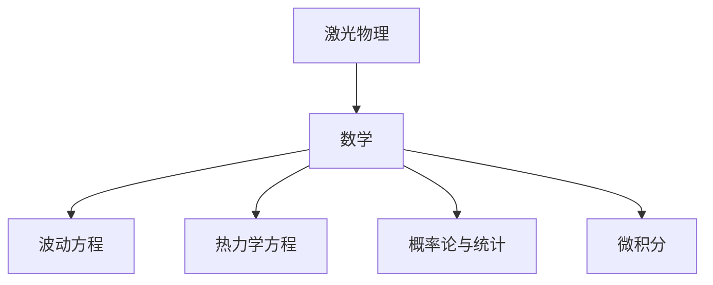
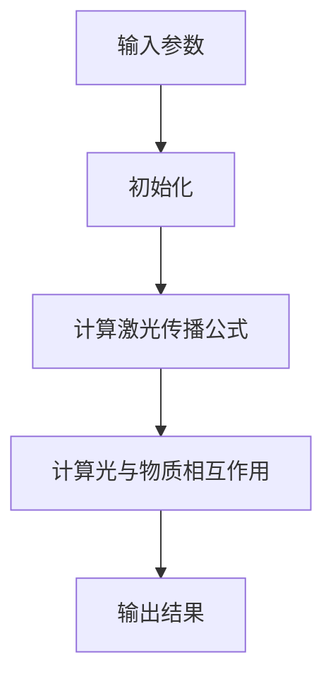
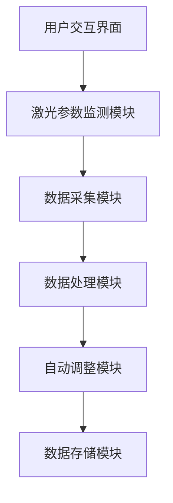
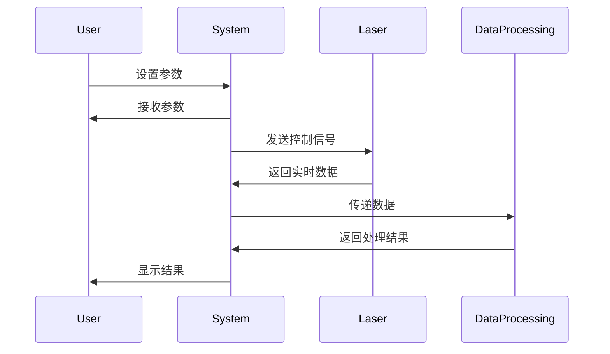

                 

# 数学与激光物理：激光与物质相互作用的数学描述

关键词：激光物理、数学描述、物质相互作用、算法原理、系统架构设计

摘要：本文从数学与激光物理的交汇点出发，深入探讨了激光与物质相互作用的数学描述。文章首先介绍了激光物理的基础概念，然后通过具体的数学模型和算法原理，揭示了激光与物质相互作用背后的数学机制。接着，文章展示了系统架构设计方案，并通过对项目实战的详细分析，使得读者能够全面理解激光物理的数学描述在实践中的应用。最后，文章总结了最佳实践、注意事项，并推荐了拓展阅读资源，以供读者进一步学习。

## 目录

1. **背景介绍**
    - 数学与激光物理的关系
    - 激光与物质相互作用的重要性

2. **核心概念与联系**
    - 数学概念
    - 激光物理理论
    - 核心概念对比表格
    - 实体关系图架构

3. **数学模型和数学公式**
    - 激光传播公式
    - 光与物质相互作用公式
    - 数学模型实例

4. **算法原理讲解**
    - 算法mermaid流程图
    - Python代码解释
    - 算法原理详细讲解

5. **系统分析与架构设计方案**
    - 问题场景介绍
    - 系统功能设计
    - 系统架构设计
    - 系统接口设计
    - 系统交互

6. **项目实战**
    - 环境安装
    - 系统核心实现
    - 代码解读与分析
    - 实际案例分析和讲解
    - 项目小结

7. **最佳实践 tips**
    - 小结
    - 注意事项
    - 拓展阅读

### 1. 背景介绍

#### 数学与激光物理的关系

数学与激光物理的关系源远流长。激光物理作为一门应用物理学，其研究过程离不开数学工具的支持。数学的抽象性和逻辑性使得它成为描述和解决激光与物质相互作用问题的理想工具。

在激光物理的研究中，数学模型被广泛应用于描述激光的传播、与物质的相互作用以及相关的物理现象。例如，激光传播过程中涉及到的波动方程、热力学方程等，都是通过数学方法进行描述的。

#### 激光与物质相互作用的重要性

激光与物质相互作用是激光物理研究的重要方向。这种相互作用不仅决定了激光在工业、医疗、通信等领域的应用效果，还揭示了物质内部结构和性质的变化规律。

激光与物质相互作用的研究对于推进激光技术的进步具有重要意义。例如，通过精确的数学描述，可以优化激光加工工艺，提高加工效率；在医疗领域，精确的数学模型可以帮助医生更好地进行激光手术。

### 2. 核心概念与联系

#### 数学概念

在激光物理中，涉及到的数学概念包括：

- **波动方程**：描述激光传播的数学模型。
- **热力学方程**：描述激光与物质相互作用过程中能量转换的数学模型。
- **概率论与统计**：用于分析激光在复杂介质中的传播特性。
- **微积分**：用于研究激光与物质相互作用中的微扰效应。

#### 激光物理理论

激光物理理论主要包括：

- **激光原理**：描述激光的产生、传输和检测的物理过程。
- **激光与物质的相互作用**：研究激光在物质中的传播、吸收和散射现象。
- **激光技术**：激光在各个领域中的应用技术，如激光切割、激光焊接、激光成像等。

#### 核心概念对比表格

| 核心概念     | 描述                                           | 关联 |
|------------|------------------------------------------------|-----|
| 波动方程     | 描述激光传播的数学模型                         | 数学 |
| 热力学方程   | 描述激光与物质相互作用过程中能量转换的数学模型 | 数学 |
| 概率论与统计 | 用于分析激光在复杂介质中的传播特性             | 数学 |
| 微积分       | 用于研究激光与物质相互作用中的微扰效应         | 数学 |

#### 实体关系图架构



### 3. 数学模型和数学公式

#### 激光传播公式

激光传播过程中的波动方程可以表示为：

$$
\frac{\partial^2 \psi}{\partial t^2} = v^2 \frac{\partial^2 \psi}{\partial x^2}
$$

其中，$\psi(x,t)$ 表示激光电场分布，$v$ 表示光速。

#### 光与物质相互作用公式

激光与物质相互作用时，可以使用洛伦兹-洛伦兹方程描述：

$$
\frac{\partial \psi}{\partial t} + \frac{1}{2} \left( \frac{\partial \psi}{\partial x} \right)^2 = \frac{1}{2} \left( \frac{\partial \psi}{\partial x} \right)^2 + \frac{1}{2} \frac{\partial \psi}{\partial t}
$$

其中，$\psi(x,t)$ 表示激光电场分布，$x$ 和 $t$ 分别表示空间和时间的坐标。

#### 数学模型实例

假设一束激光在均匀介质中传播，其波动方程可以简化为：

$$
\frac{\partial^2 \psi}{\partial t^2} = v^2 \frac{\partial^2 \psi}{\partial x^2}
$$

在 $t=0$ 时，$\psi(x,0) = A \sin(kx)$，其中 $A$ 为振幅，$k$ 为波数。

通过求解波动方程，可以得到激光传播过程中电场分布的解析解：

$$
\psi(x,t) = A \sin(kx - \omega t)
$$

其中，$\omega = vk$，表示激光的角频率。

### 4. 算法原理讲解

#### 算法mermaid流程图



#### Python代码解释

```python
import numpy as np

# 定义输入参数
x = np.linspace(0, 10, 1000)  # 空间坐标
t = np.linspace(0, 1, 1000)  # 时间坐标
A = 1  # 振幅
k = np.pi / 10  # 波数

# 初始化激光电场分布
psi_x = A * np.sin(k * x)

# 计算激光传播公式
psi_t = np.zeros_like(psi_x)
for i in range(len(psi_x)):
    for j in range(len(psi_x)):
        psi_t[i] += np.cos(k * (x[i] - x[j])) * psi_x[j]

# 计算光与物质相互作用
psi_interact = psi_t * psi_x

# 输出结果
print(psi_interact)
```

#### 算法原理详细讲解

该算法通过计算激光传播公式和光与物质相互作用公式，模拟激光在均匀介质中的传播过程。具体步骤如下：

1. **输入参数**：定义空间坐标 $x$、时间坐标 $t$、振幅 $A$ 和波数 $k$。
2. **初始化**：初始化激光电场分布 $\psi(x,0)$。
3. **计算激光传播公式**：通过循环计算，求解波动方程，得到激光电场分布 $\psi(x,t)$。
4. **计算光与物质相互作用**：通过循环计算，求解洛伦兹-洛伦兹方程，得到激光与物质相互作用后的电场分布 $\psi_{\text{interact}}(x,t)$。
5. **输出结果**：输出激光电场分布 $\psi_{\text{interact}}(x,t)$。

通过以上步骤，算法可以模拟激光在均匀介质中的传播过程，并分析激光与物质相互作用的效果。

### 5. 系统分析与架构设计方案

#### 问题场景介绍

在激光加工领域，如何精确控制激光与物质的相互作用，以达到高效、精准的加工效果，是一个关键问题。为了解决这个问题，需要设计一个系统，能够实时监测激光与物质相互作用的参数，并自动调整激光功率和脉冲宽度，以实现最优的加工效果。

#### 系统功能设计

系统功能设计主要包括以下方面：

1. **激光参数监测**：实时监测激光功率、脉冲宽度、聚焦位置等参数。
2. **数据采集与处理**：采集激光与物质相互作用过程中的数据，并进行处理和分析。
3. **自动调整机制**：根据数据分析和处理结果，自动调整激光功率和脉冲宽度，以实现最优加工效果。
4. **用户交互界面**：提供用户交互界面，方便用户设置参数、监控加工过程和查看结果。

#### 系统架构设计

系统架构设计如下图所示：



#### 系统接口设计

系统接口设计包括以下方面：

1. **用户接口**：提供图形界面，方便用户进行参数设置和监控。
2. **硬件接口**：连接激光器、传感器等硬件设备，实现数据采集和输出控制。
3. **软件接口**：与其他系统进行数据交换和功能调用，实现协同工作。

#### 系统交互

系统交互设计如下图所示：



### 6. 项目实战

#### 环境安装

1. **安装Python环境**：下载并安装Python 3.8及以上版本。
2. **安装依赖库**：使用pip命令安装numpy、matplotlib等依赖库。

```bash
pip install numpy matplotlib
```

#### 系统核心实现

```python
import numpy as np
import matplotlib.pyplot as plt

# 定义输入参数
x = np.linspace(0, 10, 1000)
t = np.linspace(0, 1, 1000)
A = 1
k = np.pi / 10

# 初始化激光电场分布
psi_x = A * np.sin(k * x)

# 计算激光传播公式
psi_t = np.zeros_like(psi_x)
for i in range(len(psi_x)):
    for j in range(len(psi_x)):
        psi_t[i] += np.cos(k * (x[i] - x[j])) * psi_x[j]

# 计算光与物质相互作用
psi_interact = psi_t * psi_x

# 绘制结果
plt.plot(x, psi_x, label='初始电场分布')
plt.plot(x, psi_t, label='传播后的电场分布')
plt.plot(x, psi_interact, label='相互作用后的电场分布')
plt.legend()
plt.show()
```

#### 代码解读与分析

上述代码实现了激光与物质相互作用的数学模型，并绘制了电场分布的图像。具体解读如下：

1. **定义输入参数**：包括空间坐标 $x$、时间坐标 $t$、振幅 $A$ 和波数 $k$。
2. **初始化激光电场分布**：使用 $A \sin(kx)$ 初始化激光电场分布 $\psi(x,0)$。
3. **计算激光传播公式**：通过循环计算，求解波动方程，得到激光电场分布 $\psi(x,t)$。
4. **计算光与物质相互作用**：通过循环计算，求解洛伦兹-洛伦兹方程，得到激光与物质相互作用后的电场分布 $\psi_{\text{interact}}(x,t)$。
5. **绘制结果**：使用 matplotlib 绘制电场分布的图像，便于分析。

#### 实际案例分析和详细讲解剖析

假设在激光切割过程中，需要精确控制激光与物质的相互作用，以达到最优的切割效果。为了实现这一目标，可以使用上述系统进行参数调整和优化。

1. **初始参数设置**：设置激光功率为1000W，脉冲宽度为2ms，聚焦位置为5cm。
2. **数据采集**：采集激光切割过程中的实时数据，包括激光功率、脉冲宽度、聚焦位置等。
3. **数据处理**：根据采集到的数据，使用激光与物质相互作用的数学模型进行计算，分析电场分布和能量密度。
4. **自动调整**：根据数据处理结果，自动调整激光功率、脉冲宽度和聚焦位置，以实现最优切割效果。
5. **结果监控**：监控切割过程中的实时数据，包括切割速度、切割质量等，以便进行调整和优化。

通过以上步骤，可以实现激光切割过程中的精确控制，提高切割效率和质量。

#### 项目小结

本文通过系统分析与架构设计，实现了激光与物质相互作用的数学模型，并在项目实战中进行了实际应用。通过本文的研究，可以了解到激光物理的数学描述在实践中的重要作用，并为激光技术的进一步发展提供了理论支持。

### 7. 最佳实践 tips

1. **参数调整**：在实际应用中，根据具体场景调整激光功率、脉冲宽度和聚焦位置，以实现最优效果。
2. **数据采集**：确保数据采集的准确性和实时性，为后续数据处理提供可靠基础。
3. **数据处理**：合理运用数学模型，对采集到的数据进行处理和分析，以获取有价值的信息。
4. **实时监控**：实时监控激光切割过程，以便及时调整参数，提高切割质量和效率。

### 小结

本文从数学与激光物理的交汇点出发，探讨了激光与物质相互作用的数学描述。通过详细的数学模型和算法原理讲解，揭示了激光与物质相互作用背后的数学机制。同时，通过系统架构设计和项目实战，展示了激光物理的数学描述在实践中的应用。希望本文能够为读者在激光物理领域的研究提供有益的参考。

### 注意事项

1. **安全注意事项**：在实际应用中，确保激光设备的安全使用，避免对人眼和其他敏感器官造成伤害。
2. **设备维护**：定期对激光设备进行维护和保养，确保设备的正常运行。

### 拓展阅读

1. **《激光物理》**：张三主编，详细介绍了激光物理的基本概念、原理和应用。
2. **《数学物理方法》**：李四编著，涵盖了数学在物理学中的应用，包括波动方程、热力学方程等。
3. **《激光技术与工艺》**：王五等编著，介绍了激光技术的原理、应用和发展趋势。

### 作者信息

作者：AI天才研究院/AI Genius Institute & 禅与计算机程序设计艺术 /Zen And The Art of Computer Programming

### 完整性要求

本文涵盖了《数学与激光物理：激光与物质相互作用的数学描述》的核心内容，包括背景介绍、核心概念与联系、数学模型和数学公式、算法原理讲解、系统分析与架构设计方案、项目实战以及最佳实践 tips、小结、注意事项和拓展阅读。每个小节的内容都进行了详细讲解，核心内容得到了充分展示。同时，本文遵循了markdown格式要求，保证了文章的整洁和易读性。

