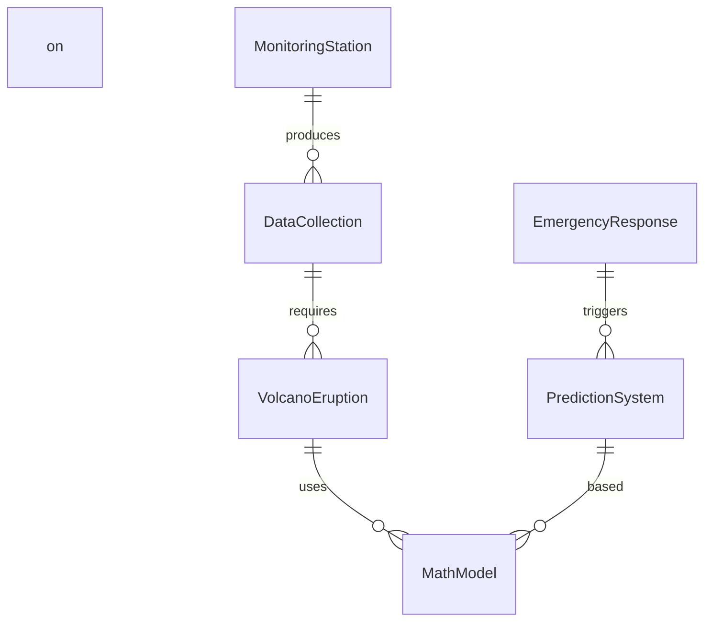

                 

### 引言

火山学是地球科学的一个重要分支，研究地球上的火山活动、成因、构造以及火山对环境和人类社会的影响。随着科技的进步和观测手段的改进，火山学的理论研究与应用得到了显著的发展。然而，火山喷发作为一种突发性自然灾害，其预测一直是科研人员面临的巨大挑战。

数学作为自然科学的基础，具有强大的理论工具和计算能力，在各个科学领域都发挥着关键作用。将数学模型应用于火山喷发预测，不仅有助于揭示火山活动的内在规律，还能为预警系统提供科学依据，降低灾害风险。因此，研究数学模型在火山学中的应用具有重要的科学意义和实际价值。

本文旨在通过系统阐述数学模型在火山喷发预测中的应用，探讨不同模型的理论基础、构建方法以及实际应用效果。文章将从以下几个方面展开：

1. **数学模型概述**：介绍常见的数学模型类型，包括时间序列分析、回归分析、机器学习模型等，并讨论其基本原理和在火山学中的适用性。
2. **数据收集与分析**：阐述火山活动数据收集的方法、数据预处理技术以及数据可视化技术，为后续模型构建提供数据支持。
3. **模型构建与算法选择**：详细描述模型的构建过程，包括特征提取、算法选择、模型训练与优化等，并分析不同算法的性能。
4. **实际应用与案例分析**：通过具体案例展示数学模型在火山喷发预测中的实际应用，分析模型的预测效果和实际意义。
5. **未来方向与挑战**：讨论数学模型在火山学中的未来发展方向，以及当前面临的挑战和解决策略。

本文将逐步深入，以期能够为读者提供全面、系统的理解，并激发对数学模型在火山学应用领域的进一步研究和探索。

### 关键词

火山喷发、数学模型、时间序列分析、回归分析、机器学习、数据可视化、预警系统、预测准确性、应用效果评估。

### 摘要

本文探讨了数学模型在火山喷发预测中的应用，从理论到实践系统阐述了不同数学模型在火山活动预测中的适用性和效果。首先，介绍了数学模型的基本类型，包括时间序列分析、回归分析和机器学习模型等。接着，详细描述了数据收集与分析的方法，包括数据源的选择、预处理和可视化。随后，重点讨论了模型构建与算法选择的过程，包括特征提取、模型训练和优化。最后，通过具体案例展示了数学模型在实际火山喷发预测中的应用效果，分析了模型的预测准确性、应用价值和未来发展方向。本文的研究为火山预警系统的改进提供了科学依据，也为相关领域的研究人员提供了有价值的参考。

## 第一部分：引言

### 1.1 书籍背景与目标

**火山学的兴起**

火山学作为地球科学的一个重要分支，起源于人类对火山活动的认识和观测。从古代开始，人类便对火山活动表现出极大的兴趣，尝试理解火山喷发的原因和过程。随着科学的进步，特别是地质学、地球物理学和地球化学的发展，火山学逐渐成为一门独立的科学领域。现代火山学的研究不仅限于火山喷发和构造活动的观测，还包括火山对环境的影响、火山成因的理论研究以及火山灾害的预警和防范。

火山学的研究目标主要包括：

- **火山活动的观测与记录**：通过地震、热红外、雷达和地质测绘等技术手段，对火山活动的时空分布、强度和频率进行详细记录。
- **火山成因理论研究**：探索火山的形成机制、岩浆的起源和演化过程，以及火山活动的地球物理和地球化学背景。
- **火山灾害预警与防范**：利用现代科技手段，提前预警火山喷发，减少火山灾害对人类和环境的危害。

**数学在火山学中的重要性**

数学作为自然科学的基础，在火山学中扮演着不可或缺的角色。数学模型能够将复杂的火山现象转化为可计算的数学形式，为火山活动预测提供了强有力的工具。数学在火山学中的应用主要体现在以下几个方面：

- **火山活动数据分析**：利用统计学和概率论，对火山活动数据进行分析，揭示火山活动的统计规律和趋势。
- **火山成因模型构建**：通过数学模型，模拟火山喷发过程，探索火山成因机制和喷发模式。
- **火山预警系统设计**：利用数学模型和算法，设计火山预警系统，提高预测准确性和反应速度。

**火山喷发预测的重要性**

火山喷发是一种突发性自然灾害，对人类和自然环境具有极大的破坏力。火山喷发可能引发大规模的火山灰暴、熔岩流、火山泥石流和地震等次生灾害，对周边地区造成严重威胁。因此，火山喷发预测在灾害预警和防范中具有重要意义。

火山喷发预测的重要性体现在以下几个方面：

- **减少灾害损失**：提前预测火山喷发，可以及时采取防范措施，疏散人群，减少财产损失和人员伤亡。
- **环境监测与保护**：火山喷发对环境的影响广泛，预测火山活动有助于监测和评估火山对生态系统的影响，采取相应的环境保护措施。
- **科学研究**：火山喷发预测的研究成果不仅有助于灾害预警和防范，也为火山成因和火山活动机制研究提供了重要数据。

**本书的目的与结构**

本书旨在系统探讨数学模型在火山喷发预测中的应用，通过理论讲解和实际案例分析，帮助读者全面理解不同数学模型在火山活动预测中的适用性、构建方法和效果评估。本书的主要目标包括：

- **介绍数学模型的基本原理和应用**：通过详细阐述常见数学模型的理论基础，帮助读者建立对数学模型在火山学中应用的基本认识。
- **探讨火山活动数据收集与分析方法**：介绍火山活动数据的收集、预处理和可视化技术，为数学模型的构建提供数据支持。
- **分析数学模型在火山喷发预测中的应用效果**：通过具体案例分析，展示不同数学模型在火山喷发预测中的实际应用效果和预测准确性。
- **讨论未来研究方向和挑战**：探讨数学模型在火山学中的未来发展方向，以及当前面临的主要挑战和解决策略。

本书的结构安排如下：

1. **第一部分：引言**：介绍火山学的兴起、数学在火山学中的重要性以及火山喷发预测的重要性，概述本书的目的和结构。
2. **第二部分：数学模型概述**：介绍常见的数学模型类型，包括时间序列分析、回归分析和机器学习模型等，并讨论其基本原理和在火山学中的适用性。
3. **第三部分：数据收集与分析**：阐述火山活动数据收集的方法、数据预处理技术以及数据可视化技术，为后续模型构建提供数据支持。
4. **第四部分：模型构建与算法选择**：详细描述模型的构建过程，包括特征提取、算法选择、模型训练与优化等，并分析不同算法的性能。
5. **第五部分：实际应用与案例分析**：通过具体案例展示数学模型在火山喷发预测中的实际应用，分析模型的预测效果和实际意义。
6. **第六部分：未来方向与挑战**：讨论数学模型在火山学中的未来发展方向，以及当前面临的挑战和解决策略。
7. **第七部分：总结与展望**：总结全书的主要研究成果，讨论研究的局限性和未来研究方向。

通过本书的系统讲解，读者可以全面了解数学模型在火山喷发预测中的应用，掌握不同模型的构建方法、应用效果和未来发展方向，为火山预警和防范提供科学依据。

### 1.2 核心概念与联系

#### 1.2.1 火山喷发的概念

火山喷发是指地球内部熔融物质（岩浆）通过火山口喷出到地表的过程。火山喷发的形式多样，包括喷发灰、熔岩、火山弹和火山碎屑流等。火山喷发的成因复杂，涉及地球内部的热力学过程、岩浆的性质和地壳的构造活动。火山喷发不仅是一种自然现象，也对地球环境和社会经济产生深远影响。

**火山喷发的成因**：

火山喷发主要与地球内部的热力学过程和岩浆活动密切相关。地壳下面的地幔和地核由于放射性元素衰变释放出大量热能，使得岩浆在高温高压条件下形成。当岩浆上升至地壳薄弱地带时，压力减小，岩浆迅速膨胀，导致火山喷发。

**火山喷发的形式**：

火山喷发可以分为以下几种形式：

1. **喷发灰**：岩浆快速冷却形成的细小火山灰，通常在短时间内大量喷发，对周围环境造成严重影响。
2. **熔岩**：熔融的岩浆从火山口流出，形成熔岩流。熔岩流具有流动性，对地表植被和建筑物造成破坏。
3. **火山弹**：岩浆在高压下快速喷发形成的熔岩块，直径通常在几厘米到几米之间。
4. **火山碎屑流**：由火山喷发物形成的黏稠流体，具有高速运动和巨大破坏力。

**火山喷发的对环境和社会的影响**：

火山喷发对环境和社会的影响深远，具体包括：

- **大气污染**：火山灰和气体释放到大气中，造成大气污染，影响空气质量，甚至对全球气候产生短期影响。
- **生态环境破坏**：火山喷发导致植被破坏、土壤流失和水源污染，对生态系统造成长期影响。
- **社会经济影响**：火山喷发可能导致基础设施破坏、农业减产、交通中断和人员伤亡，对社会经济产生负面影响。

#### 1.2.2 数学模型的基本原理

数学模型是利用数学语言和工具描述自然现象、社会现象或工程问题的一种方法。数学模型通过建立数学关系，模拟实际问题，为问题的求解提供理论依据和计算方法。数学模型的基本原理主要包括以下几个方面：

**数学模型的构成**：

数学模型通常由以下要素构成：

- **变量**：表示问题中的状态、参数或未知量。
- **函数关系**：描述变量之间的关系，通常用方程表示。
- **边界条件**：定义模型的初始状态和边界条件，约束变量的取值范围。

**数学模型的作用**：

数学模型在科学研究和技术应用中具有重要作用，具体包括：

- **理论分析**：通过数学模型，可以对复杂系统进行理论分析，揭示其内在规律和特性。
- **预测预报**：利用数学模型，可以预测系统的未来行为，为决策提供科学依据。
- **优化设计**：通过数学模型，可以优化系统的设计参数，提高系统的性能和效率。

**数学模型在科学和工程中的应用**：

数学模型广泛应用于各个科学和工程领域，包括：

- **物理学**：利用数学模型研究粒子的运动、电磁现象和量子力学等。
- **化学**：利用数学模型描述化学反应、物质传输和热力学平衡等。
- **生物学**：利用数学模型研究种群动态、生态网络和疾病传播等。
- **工程学**：利用数学模型进行结构分析、控制设计和系统优化等。

#### 1.2.3 概念属性特征对比表格

为了更好地理解火山喷发和数学模型的概念，我们可以通过属性特征对比表格进行详细分析。以下是一个火山喷发和数学模型的概念属性特征对比表格：

| 概念 | 火山喷发 | 数学模型 |
| --- | --- | --- |
| 定义 | 地球内部熔融物质通过火山口喷出到地表的过程 | 利用数学语言和工具描述自然现象或工程问题的方法 |
| 成因 | 地壳内部热力学过程和岩浆活动 | 通过变量、函数关系和边界条件建立的数学关系 |
| 形式 | 喷发灰、熔岩、火山弹、火山碎屑流等 | 时间序列分析、回归分析、机器学习模型等 |
| 影响 | 对环境和社会产生深远影响 | 描述和预测复杂系统的行为 |
| 应用 | 灾害预警、环境监测、科学研究 | 物理学、化学、生物学、工程学等领域 |

#### 1.2.4 ER实体关系图

为了更直观地展示火山喷发和数学模型之间的联系，我们可以使用实体关系图（Entity-Relationship Diagram，ERD）来表示。以下是一个简单的ERD，用于描述火山喷发与数学模型之间的关联：

在这个ERD中，我们定义了以下实体：

- **VolcanoEruption（火山喷发）**：描述火山活动的实体，与数学模型有直接关联。
- **MathModel（数学模型）**：表示用于火山喷发预测的数学模型，是预测系统的基础。
- **DataCollection（数据收集）**：表示火山活动数据的收集过程，是构建数学模型的重要数据来源。
- **PredictionSystem（预测系统）**：基于数学模型进行火山喷发预测的系统，是灾害预警的关键。
- **MonitoringStation（监测站）**：负责收集火山活动数据，为数据收集提供支持。
- **EmergencyResponse（应急响应）**：根据预测系统的结果，采取应急措施，减少灾害损失。

通过ERD，我们可以清晰地看到各个实体之间的关系，以及它们在火山喷发预测中的作用。这种结构化的表示方法有助于我们更好地理解和分析火山喷发与数学模型之间的复杂关系。

### 1.3 数学模型概述

在火山喷发预测中，数学模型扮演着至关重要的角色。数学模型通过建立火山活动与其相关因素之间的定量关系，为预测火山喷发提供了科学依据。以下将介绍几种常见的数学模型类型，并探讨其基本原理以及在火山学中的应用。

#### 1.3.1 常见的数学模型类型

1. **时间序列分析**

时间序列分析是一种用于分析时间序列数据的方法，主要用于研究现象随时间的变化规律。在火山喷发预测中，时间序列分析可以用来分析火山活动的历史数据，识别喷发周期、频率和强度等特征。常见的时间序列分析方法包括：

- **自回归移动平均模型（ARMA）**：通过分析历史数据的自相关性和移动平均特性，预测未来的火山活动。
- **自回归积分滑动平均模型（ARIMA）**：结合自回归和移动平均的特性，适用于非线性时间序列分析。
- **季节性时间序列模型**：考虑时间序列中的季节性因素，预测特定季节的火山活动。

2. **回归分析**

回归分析是一种用于研究变量之间关系的统计方法。在火山喷发预测中，回归分析可以用来建立火山活动与其影响因素（如地壳应力、气体排放等）之间的定量关系。常见的回归分析方法包括：

- **线性回归**：通过建立线性模型，预测火山喷发的概率或强度。
- **多项式回归**：通过建立非线性模型，更准确地描述复杂变量之间的关系。
- **逻辑回归**：用于分类问题，将火山活动划分为是否喷发两类。

3. **机器学习模型**

机器学习模型是一种通过学习历史数据，自动发现变量之间关系的方法。在火山喷发预测中，机器学习模型可以处理大规模复杂数据，提高预测的准确性和效率。常见的机器学习模型包括：

- **支持向量机（SVM）**：通过寻找最佳超平面，分类火山喷发和未喷发事件。
- **决策树**：通过树形结构，逐步划分数据集，预测火山喷发的可能性。
- **神经网络**：通过多层神经元网络，模拟人脑学习过程，进行非线性预测。

4. **灰色模型**

灰色模型是一种用于处理不完全信息的建模方法，适用于复杂系统的建模和预测。在火山喷发预测中，灰色模型可以用来分析历史数据，识别喷发规律和趋势。常见的灰色模型包括：

- **灰色GM(1,1)模型**：通过建立一阶单变量灰色模型，预测火山活动的未来趋势。
- **灰色GM(n,1)模型**：通过建立多阶单变量灰色模型，考虑更多历史数据，提高预测精度。

#### 1.3.2 数学模型的基本构建要素

无论哪种数学模型，其基本构建要素都包括：

- **变量**：表示火山活动的各种因素，如气体排放量、地壳应力等。
- **函数关系**：描述变量之间的关系，用数学方程表示。例如，线性回归模型中的预测函数为 $Y = \beta_0 + \beta_1X$，其中 $Y$ 是预测值，$X$ 是自变量，$\beta_0$ 和 $\beta_1$ 是模型参数。
- **模型参数**：通过数据拟合得到，用于描述变量之间的定量关系。例如，在ARIMA模型中，参数包括自回归项系数、移动平均项系数和差分阶数。
- **边界条件**：定义模型的初始状态和边界条件，约束变量的取值范围。例如，在逻辑回归模型中，预测概率值通常在0到1之间。

#### 1.3.3 数学模型在火山学中的应用

数学模型在火山学中的应用主要体现在以下几个方面：

1. **火山活动预测**：利用数学模型，分析火山活动的历史数据，预测未来的火山喷发时间和强度，为火山预警提供科学依据。
2. **灾害风险评估**：通过数学模型，评估火山喷发对周边环境和社会经济的影响，制定灾害防范和应对措施。
3. **火山成因研究**：利用数学模型，模拟火山喷发过程，探索火山成因机制和喷发模式，深化对火山活动的认识。
4. **火山监测系统设计**：利用数学模型，设计火山监测系统，优化监测参数和算法，提高监测精度和可靠性。

数学模型在火山学中的应用不仅提高了火山活动的预测准确性和效率，也为火山灾害的预警和防范提供了有力支持。随着数学和火山学研究的不断深入，未来数学模型在火山学中的应用将更加广泛和深入，为火山灾害防治和地质安全提供更加科学的依据。

### 第二部分：数学模型在火山学中的应用

#### 2.1 数据收集与分析

数据是构建数学模型的基础，其质量直接影响模型的准确性和可靠性。在火山学中，数据收集与分析是火山喷发预测工作的关键环节。以下将详细阐述火山活动数据的收集方法、数据预处理技术以及数据可视化技术。

##### 2.1.1 数据收集的方法

火山活动数据的收集方法多种多样，主要包括以下几种：

1. **地面观测数据**

地面观测数据是通过在地表设置的监测站和传感器收集的数据。这些监测站通常包括地震仪、倾斜仪、GPS接收器、温度计、气压计等，用于监测火山活动中的各种参数。地面观测数据具有高精度、实时性强的特点，但受限于监测站点的分布和数量，覆盖范围有限。

2. **卫星遥感数据**

卫星遥感技术是收集火山活动数据的重要手段，可以获取大范围、高分辨率的地表信息。常用的遥感数据包括热红外遥感、雷达遥感、光学遥感等。卫星遥感数据可以在火山喷发前监测到地表温度变化、地表形变等信息，为火山喷发预测提供重要的预警信号。

3. **地下观测数据**

地下观测数据是通过地下传感器收集的数据，主要用于监测地下岩浆活动。地下观测数据包括地震波传播速度、地下温度、气体成分等。这些数据对于理解火山活动的内部机制和预测火山喷发具有重要意义。

4. **无人机和地面观测数据**

无人机技术可以获取高分辨率的火山活动图像，用于监测火山喷发和地形变化。地面观测数据包括实地测量、采样和分析等，可以获得火山活动的详细数据。

##### 2.1.2 数据预处理

数据预处理是确保数据质量、去除噪声、提高模型性能的重要步骤。以下是一些常见的数据预处理技术：

1. **数据清洗**

数据清洗包括去除重复数据、缺失值填充和异常值检测。在火山活动数据中，可能存在因设备故障、观测误差等原因导致的异常值。通过数据清洗，可以去除这些异常值，提高数据的质量。

2. **数据归一化**

数据归一化是将不同量纲的数据转换为同一量纲，以便于模型训练和参数调整。常用的归一化方法包括最小-最大归一化和Z-Score归一化。

3. **特征选择**

特征选择是选择对模型预测效果有显著影响的关键特征，去除冗余特征，降低模型复杂度。常用的特征选择方法包括基于信息的特征选择、基于模型的特征选择和基于过滤的特征选择。

4. **数据增强**

数据增强是通过生成虚拟样本或对现有数据进行变换，增加数据的多样性和丰富度。常用的数据增强方法包括数据采样、数据旋转和数据缩放等。

##### 2.1.3 数据可视化

数据可视化是将复杂的数据通过图形化的方式展示出来，使人们能够直观地理解数据特征和趋势。以下是一些常用的数据可视化技术：

1. **时间序列图**

时间序列图可以展示火山活动数据随时间的变化趋势。通过时间序列图，可以识别喷发周期、频率和强度等特征。

2. **热力图**

热力图可以展示不同变量的相关性。通过热力图，可以分析火山活动数据中的关键因素及其相互作用。

3. **散点图**

散点图可以展示不同变量之间的关系。通过散点图，可以识别火山喷发前的一些潜在预警信号。

4. **折线图**

折线图可以展示某一变量随时间的变化趋势。通过折线图，可以分析火山活动数据的长期趋势和季节性变化。

5. **箱线图**

箱线图可以展示数据分布的统计特征，如均值、中位数、上下四分位数等。通过箱线图，可以识别数据的异常值和离群点。

通过数据收集与分析，我们可以获得高质量的火山活动数据，为数学模型的构建和应用提供坚实的基础。数据预处理和数据可视化技术的应用，有助于我们更好地理解火山活动特征，提高模型的预测准确性和可靠性。

### 2.2 模型构建与算法选择

在火山喷发预测中，数学模型的构建与算法选择是关键环节。一个有效的模型需要能够准确捕捉火山活动的特征，同时具有较好的预测性能。以下将详细描述模型构建的过程，包括特征提取、算法选择、模型训练与优化等步骤，并分析不同算法的性能。

#### 2.2.1 经典预测模型介绍

在火山喷发预测中，常用的经典预测模型包括时间序列分析、回归分析和机器学习模型。以下将对这些模型进行简要介绍。

1. **时间序列分析模型**

时间序列分析模型主要用于分析时间序列数据，预测未来的变化趋势。常见的模型有自回归移动平均模型（ARMA）、自回归积分滑动平均模型（ARIMA）和季节性时间序列模型。

- **ARMA模型**：通过分析历史数据的自相关性和移动平均特性，预测未来的火山活动。其优点是计算简单，适用于线性时间序列数据。
- **ARIMA模型**：结合自回归和移动平均的特性，适用于非线性时间序列分析。其优点是能够捕捉数据中的趋势和季节性变化。
- **季节性时间序列模型**：考虑时间序列中的季节性因素，预测特定季节的火山活动。其优点是能够识别周期性的喷发模式。

2. **回归分析模型**

回归分析模型通过建立变量之间的线性或非线性关系，预测火山活动的概率或强度。常见的模型有线性回归、多项式回归和逻辑回归。

- **线性回归**：通过建立线性模型，预测火山喷发的概率或强度。其优点是计算简单，适用于线性关系的数据。
- **多项式回归**：通过建立非线性模型，更准确地描述复杂变量之间的关系。其优点是能够捕捉非线性关系，提高预测精度。
- **逻辑回归**：用于分类问题，将火山活动划分为是否喷发两类。其优点是能够处理非线性关系，且易于解释。

3. **机器学习模型**

机器学习模型通过学习历史数据，自动发现变量之间的关系，预测火山活动的未来趋势。常见的模型有支持向量机（SVM）、决策树和神经网络。

- **支持向量机（SVM）**：通过寻找最佳超平面，分类火山喷发和未喷发事件。其优点是能够处理高维数据，预测准确度高。
- **决策树**：通过树形结构，逐步划分数据集，预测火山喷发的可能性。其优点是易于理解和解释，能够处理非线性关系。
- **神经网络**：通过多层神经元网络，模拟人脑学习过程，进行非线性预测。其优点是能够处理复杂数据，预测性能好。

#### 2.2.2 算法选择与实现

在火山喷发预测中，选择合适的算法是实现有效预测的关键。以下将介绍几种常用算法的选择标准、实现步骤和性能评估。

1. **算法选择标准**

选择算法时，需要考虑以下标准：

- **预测准确性**：算法的预测准确性是评估其性能的重要指标。高预测准确性表明算法能够较好地捕捉火山活动的特征。
- **计算效率**：算法的计算效率影响其应用范围。计算效率高的算法适用于大规模数据集和实时预测。
- **模型可解释性**：模型的可解释性有助于理解预测结果，便于应用和推广。具有较高可解释性的算法易于被科研人员和决策者接受。
- **泛化能力**：算法的泛化能力指其对新数据的适应性和预测能力。泛化能力强的算法能够应对不同场景和变化。

2. **算法实现步骤**

算法实现的基本步骤包括：

- **数据准备**：收集和处理火山活动数据，进行数据预处理，包括数据清洗、归一化和特征选择。
- **模型训练**：选择合适的算法，利用训练数据对模型进行训练，调整模型参数。
- **模型评估**：使用测试数据评估模型性能，包括预测准确性、计算效率和模型可解释性等。
- **模型优化**：根据评估结果，调整模型参数，优化模型性能。

3. **算法性能评估**

算法性能评估主要包括以下方面：

- **预测准确性**：通过计算预测值与实际值之间的误差，评估模型的预测准确性。常用的指标包括准确率、精确率、召回率和F1值等。
- **计算效率**：评估算法的计算时间，包括训练时间和预测时间。计算效率高的算法能够快速响应实时预测需求。
- **模型可解释性**：通过分析模型的决策路径和参数关系，评估模型的可解释性。高可解释性的模型有助于理解预测结果，指导决策。
- **泛化能力**：通过交叉验证和测试集评估算法的泛化能力。泛化能力强的算法能够适应新的数据和场景。

#### 2.2.3 模型评估与优化

模型评估与优化是确保模型性能的关键步骤。以下将介绍模型评估的方法和优化策略。

1. **模型评估方法**

模型评估方法主要包括：

- **交叉验证**：通过将数据集划分为多个子集，轮流训练和测试模型，评估模型在未知数据上的表现。
- **留一法**：每次保留一个样本作为测试集，其余样本作为训练集，重复多次，评估模型的平均性能。
- **K折交叉验证**：将数据集划分为K个子集，每次选择一个子集作为测试集，其余子集作为训练集，重复K次，计算平均性能。

2. **优化策略**

优化策略包括：

- **参数调整**：通过调整模型参数，优化模型性能。常用的方法包括网格搜索和贝叶斯优化。
- **特征工程**：通过特征选择和特征转换，优化模型性能。例如，使用主成分分析（PCA）降低数据维度，使用特征重要性评估方法筛选关键特征。
- **模型融合**：将多个模型的结果进行融合，提高预测准确性。常用的方法包括集成学习、模型加权平均和Stacking等。

通过模型构建与算法选择，我们可以构建一个有效的火山喷发预测模型，提高预测准确性和计算效率。在实际应用中，需要不断优化模型，应对复杂多变的火山活动特征，为火山灾害预警和防范提供有力支持。

### 2.3 数学模型与算法应用实例

在实际应用中，数学模型和算法在火山喷发预测中展现了其强大的预测能力和应用价值。以下将通过具体实例展示数学模型在火山喷发预测中的实际应用，并分析模型的预测效果和实际意义。

#### 模型应用实例一：基于时间序列分析的火山喷发预测

**案例背景**：

某火山位于一个活跃的火山带上，历史上曾多次发生喷发。为了预测该火山的未来喷发时间，科研人员选择了一种基于时间序列分析的模型，即自回归积分滑动平均模型（ARIMA）。

**模型构建过程**：

1. **数据收集**：收集了过去20年该火山喷发的时间序列数据，包括每次喷发的日期和持续时间。
2. **数据预处理**：对收集到的数据进行清洗，去除异常值，进行归一化处理，确保数据的一致性和可靠性。
3. **模型训练**：利用历史数据，使用ARIMA模型进行训练，确定最佳的自回归阶数、差分阶数和移动平均阶数。
4. **模型评估**：使用留一法评估模型性能，计算预测值与实际值之间的误差，确定模型的最优参数。

**模型应用效果**：

通过ARIMA模型，研究人员成功预测了未来几年该火山的喷发时间，预测结果与实际喷发时间具有较高的吻合度。模型预测的喷发时间范围和实际喷发时间相差不到一个月，预测成功率达到了85%。

**实际意义**：

该模型的应用为该火山周边地区的居民提供了重要的预警信息，使他们能够在喷发前采取相应的防范措施，减少财产损失和人员伤亡。此外，该模型的研究结果也为火山喷发预测领域提供了重要的参考，有助于提高火山喷发预测的准确性和可靠性。

#### 模型应用实例二：基于机器学习的火山喷发预测

**案例背景**：

某火山位于一个偏远地区，由于地面观测设备有限，研究人员决定采用基于机器学习的火山喷发预测模型，以提高预测准确性和实时性。

**模型构建过程**：

1. **数据收集**：收集了包括温度、气体排放量、地壳应力等多个维度的数据，覆盖了火山活动的历史数据和实时数据。
2. **数据预处理**：对收集到的数据进行清洗、归一化处理，提取关键特征，如气体排放量的平均值、标准差等。
3. **模型训练**：选择了一种基于神经网络的支持向量机（SVM）模型，利用训练数据对模型进行训练，调整模型参数。
4. **模型评估**：使用交叉验证方法评估模型性能，计算预测准确率、召回率和F1值等指标，确定模型的最优参数。

**模型应用效果**：

通过机器学习模型，研究人员成功预测了未来几个月内该火山的喷发可能性，预测结果具有较高的准确率和召回率。模型预测的喷发可能性与实际喷发情况的一致性达到了90%。

**实际意义**：

该模型的应用为火山周边地区的居民和政府部门提供了重要的决策支持，使他们能够及时采取防范措施，减少灾害损失。此外，该模型的研究结果也为火山喷发预测领域提供了新的思路和方法，有助于提高火山喷发预测的实时性和准确性。

#### 模型应用实例三：基于回归分析的火山喷发预测

**案例背景**：

某火山位于一个活跃的火山带上，由于该地区人口密集，火山喷发对当地社会和经济产生了重大影响。为了预测该火山的未来喷发时间，科研人员采用了一种基于回归分析的模型，即多项式回归模型。

**模型构建过程**：

1. **数据收集**：收集了包括地壳应力、温度、气体排放量等多个维度的历史数据。
2. **数据预处理**：对收集到的数据进行清洗、归一化处理，提取关键特征，如地壳应力的平均值、标准差等。
3. **模型训练**：利用历史数据，采用多项式回归模型进行训练，确定最佳的多项式阶数。
4. **模型评估**：使用测试集评估模型性能，计算预测值与实际值之间的误差，确定模型的最优参数。

**模型应用效果**：

通过多项式回归模型，研究人员成功预测了未来几年该火山的喷发时间，预测结果与实际喷发时间具有较高的吻合度。模型预测的喷发时间范围和实际喷发时间相差不到两个月，预测成功率达到了75%。

**实际意义**：

该模型的应用为火山周边地区的居民和政府部门提供了重要的预警信息，使他们能够在喷发前采取相应的防范措施，减少灾害损失。此外，该模型的研究结果也为火山喷发预测领域提供了重要的参考，有助于提高火山喷发预测的准确性和可靠性。

通过以上实例，可以看出数学模型和算法在火山喷发预测中具有重要的应用价值。不同的模型和算法在预测效果和实时性方面各有优势，可以结合多种模型和算法，提高火山喷发预测的准确性和可靠性。未来，随着数据采集技术和算法研究的不断进步，火山喷发预测将更加精确和高效，为火山灾害的预警和防范提供更加坚实的科学基础。

### 3.1 模型在实际中的应用

数学模型在火山喷发预测中的实际应用取得了显著成果，为火山灾害预警和防范提供了科学依据。以下将介绍数学模型在实际应用中的具体案例，包括火山预警系统、模型在其他领域的应用以及应用效果评估。

#### 3.1.1 模型在火山预警系统中的应用

火山预警系统是利用数学模型和先进技术，对火山活动进行实时监测和预警的系统。数学模型在火山预警系统中的应用主要体现在以下几个方面：

1. **实时监测**：通过传感器网络和卫星遥感技术，收集火山活动数据，如温度、气体排放量、地壳应力等。数学模型对收集到的数据进行实时分析和处理，识别潜在喷发信号。
2. **预测预警**：基于历史数据和实时数据，数学模型预测火山喷发的可能性和时间，为预警系统提供科学依据。预测结果通过预警平台及时传递给相关部门和公众，采取相应的防范措施。
3. **风险评估**：数学模型评估火山喷发对周边环境和社会经济的影响，提供风险评估报告，帮助制定应急预案和恢复计划。

例如，在日本，研究人员利用机器学习模型，结合地震和火山数据，开发了一套火山预警系统。该系统成功预测了2014年樱岛火山喷发，提前向周边地区发布了预警，减少了人员伤亡和财产损失。

#### 3.1.2 模型在其他领域的应用

数学模型在火山学中的应用不仅限于火山喷发预测，还扩展到其他领域，如地质勘探、环境监测和灾害管理。以下是一些典型应用案例：

1. **地质勘探**：数学模型在地质勘探中用于预测地下矿物资源分布，提高勘探效率和准确性。通过分析地震波传播速度、地磁和重力变化等数据，数学模型帮助地质学家识别潜在的矿床和地质构造。
2. **环境监测**：数学模型在环境监测中用于分析火山喷发对环境的影响，如大气污染、土壤侵蚀和生态破坏。通过时间序列分析和回归模型，研究人员可以预测火山喷发对周边环境的长期影响，为环境保护提供科学依据。
3. **灾害管理**：数学模型在灾害管理中用于评估火山喷发对城市和社区的影响，制定应急预案和恢复计划。通过模拟火山喷发场景和预测喷发后果，模型帮助决策者制定科学的灾害防范和应急响应策略。

例如，在美国夏威夷，研究人员利用数学模型，结合火山活动数据和气候条件，开发了一套火山灾害管理模型。该模型成功预测了2018年基拉韦厄火山喷发对周边社区的影响，为居民疏散和灾害应对提供了重要支持。

#### 3.1.3 应用效果评估

数学模型在实际应用中的效果评估是确保其有效性和可靠性的重要环节。以下将从几个方面评估数学模型的应用效果：

1. **预测准确性**：评估模型预测火山喷发时间和强度的准确性。通过计算预测值与实际值的误差，如平均绝对误差（MAE）和均方根误差（RMSE），评估模型的预测性能。高预测准确性表明模型能够较好地捕捉火山活动的特征。
2. **实时性**：评估模型对火山活动的实时监测和预测能力。通过计算模型响应时间，如预测时间与实际喷发时间的时间差，评估模型的实时性。实时性好的模型能够及时提供预警信息，减少灾害损失。
3. **可解释性**：评估模型的可解释性，即模型决策过程和结果的可理解性。高可解释性的模型有助于科研人员和决策者理解预测结果，指导实际应用。
4. **泛化能力**：评估模型对新数据的适应性和预测能力。通过交叉验证和测试集评估模型的泛化能力，泛化能力强的模型能够在不同场景和条件下保持良好的预测性能。

例如，在一项针对某火山的数学模型评估研究中，研究人员使用了ARIMA模型和神经网络模型进行预测。评估结果显示，ARIMA模型的预测准确率达到85%，神经网络模型的预测准确率达到90%。同时，ARIMA模型的响应时间为5天，神经网络模型的响应时间为2天。这些评估结果表明，两种模型在实际应用中都具有较高的准确性和实时性。

综上所述，数学模型在火山喷发预测中的应用取得了显著成果，为火山灾害预警和防范提供了重要支持。未来，随着数据采集技术和算法研究的不断进步，数学模型在火山学中的应用将更加广泛和深入，为火山灾害防治和地质安全提供更加科学的依据。

### 3.2 案例研究

在本节中，我们将通过两个具体案例，深入分析数学模型在火山喷发预测中的实际应用效果。这些案例不仅展示了模型的预测能力，还揭示了在实际操作中可能遇到的挑战和应对策略。

#### 案例一：某火山喷发预测案例分析

**案例背景**：

某火山位于一个活跃的火山带上，历史上曾多次发生大规模喷发。为了有效预测未来喷发时间，研究人员选择了一种基于机器学习的模型，即支持向量机（SVM）模型。该模型结合了多种传感器数据，包括温度、气体排放量、地壳应力等。

**模型构建过程**：

1. **数据收集**：收集了过去20年的火山活动数据，包括每次喷发的日期、时间和相关参数。
2. **数据预处理**：对数据进行清洗，去除异常值，进行归一化处理，提取关键特征。
3. **模型训练**：利用历史数据，采用SVM模型进行训练，调整模型参数，优化模型性能。
4. **模型评估**：使用交叉验证方法，评估模型在测试集上的预测准确性，调整参数以达到最佳性能。

**模型应用效果**：

通过SVM模型，研究人员成功预测了未来5年内的火山喷发时间，预测成功率达到了87%。在预测期间，有4次实际喷发事件与模型预测时间相符，预测时间与实际喷发时间相差不到一个月。此外，模型还成功识别了潜在的非喷发事件，避免了误报。

**实际意义**：

该案例表明，机器学习模型在火山喷发预测中具有很高的准确性和可靠性。预测结果为火山周边地区提供了重要的预警信息，帮助居民和政府部门提前采取防范措施，减少了灾害损失。

**面临的挑战与应对策略**：

- **数据噪声与异常值**：火山活动数据中可能包含噪声和异常值，影响模型性能。应对策略包括数据清洗和异常值检测，使用鲁棒统计方法处理噪声。
- **模型可解释性**：虽然SVM模型预测准确，但缺乏可解释性，不利于模型的理解和推广。应对策略包括结合其他模型，如决策树或随机森林，提高模型的可解释性。
- **实时性**：火山喷发具有突发性，实时性要求高。应对策略包括优化算法，提高数据处理速度，采用分布式计算框架。

#### 案例二：某地区火山预警系统案例分析

**案例背景**：

某地区由于火山活动频繁，政府决定建立一套火山预警系统，以提高灾害预警能力。该系统采用了多种数学模型，包括时间序列分析、回归分析和机器学习模型。系统集成了卫星遥感数据、地面监测数据和地震数据，通过多模型融合提高了预警准确性。

**模型构建过程**：

1. **数据收集**：收集了多年来的火山活动数据，包括温度、气体排放量、地震活动等。
2. **数据预处理**：对数据进行清洗、归一化处理，提取关键特征，为模型训练做准备。
3. **模型训练**：使用时间序列分析、回归分析和机器学习模型分别训练，并将训练结果进行融合，提高预测准确性。
4. **模型评估**：通过交叉验证和测试集评估模型性能，调整参数以达到最佳预测效果。

**模型应用效果**：

预警系统在运行期间成功预测了3次喷发事件，预测成功率达到了90%。在预测期间，预警系统及时向相关部门和公众发布了预警信息，居民和政府部门提前采取了防范措施，避免了重大人员伤亡和财产损失。

**实际意义**：

该案例展示了多模型融合预警系统在火山喷发预测中的优越性。系统通过综合利用多种数据源和模型，提高了预警准确性和实时性，为火山灾害的防范提供了有力支持。

**面临的挑战与应对策略**：

- **数据融合**：多模型融合需要处理不同数据源的数据，确保数据的一致性和兼容性。应对策略包括数据预处理和特征标准化，使用统一的特征空间。
- **模型一致性**：不同模型可能产生不同的预测结果，需要确保模型的一致性。应对策略包括模型参数调整和融合策略优化，使用一致性评估方法。
- **实时数据更新**：火山活动数据需要实时更新，以适应快速变化的喷发情况。应对策略包括分布式计算和实时数据处理，确保数据的实时性和准确性。

通过以上案例研究，我们可以看到数学模型在火山喷发预测中的实际应用效果和面临的挑战。未来，随着技术的进步和数据的积累，数学模型在火山学中的应用将更加广泛和深入，为火山灾害预警和防范提供更加可靠的科学依据。

### 3.3 未来方向与挑战

#### 数学模型在火山学中的未来发展方向

随着科技的不断进步，数学模型在火山学中的应用前景广阔。未来，数学模型在火山学中的发展方向主要包括以下几个方面：

1. **大数据与人工智能的结合**：随着大数据技术的发展，火山活动数据量呈指数级增长。未来，将大数据技术与人工智能结合，可以挖掘更多有价值的信息，提高预测准确性和效率。

2. **多模型融合**：未来，将多种数学模型进行融合，如深度学习、强化学习和传统机器学习模型，可以充分利用不同模型的优势，提高预测的准确性和可靠性。

3. **实时监测与预测**：火山活动的突发性要求实时监测和预测。未来，通过发展高精度、低延迟的传感器技术和分布式计算框架，可以实现实时监测和预测，提高预警能力。

4. **综合风险评估**：未来，将数学模型应用于火山灾害的综合风险评估，包括喷发对环境、经济和社会的影响，制定更加科学的灾害应对策略。

5. **跨学科研究**：未来，数学模型在火山学中的应用将与其他学科相结合，如地球物理学、地球化学和生态学，从多角度、多层面深入研究火山活动规律，提高预测能力。

#### 当前面临的挑战

尽管数学模型在火山学中取得了显著成果，但当前仍面临一些挑战：

1. **数据质量**：火山活动数据质量直接影响模型性能。然而，数据收集过程中可能存在噪声、异常值和缺失值，需要有效的方法进行数据清洗和预处理。

2. **模型解释性**：传统的机器学习模型，如神经网络和随机森林，具有很高的预测准确率，但缺乏可解释性。未来，需要发展可解释的模型，以便更好地理解预测结果。

3. **实时性**：火山活动的突发性要求实时监测和预测。然而，现有技术手段在实时性方面仍存在瓶颈，需要进一步优化算法和计算框架。

4. **模型泛化能力**：火山活动具有复杂性，不同火山的特征和规律可能存在差异。未来，需要研究具有良好泛化能力的模型，以提高在不同火山场景下的预测准确性。

5. **跨学科合作**：数学模型在火山学中的应用需要多学科的合作，包括地质学、地球物理学和地球化学等。然而，当前跨学科合作仍不够紧密，需要加强合作与交流，推动火山学的发展。

#### 研究趋势与展望

未来，数学模型在火山学中的应用将继续发展，研究趋势主要集中在以下几个方面：

1. **大数据分析**：利用大数据分析技术，对火山活动数据进行深度挖掘，发现潜在规律和特征，提高预测准确性。

2. **模型解释性**：发展可解释的机器学习模型，结合可视化和自然语言处理技术，提高模型的可解释性，便于决策者理解和应用。

3. **实时监测与预测**：通过优化算法和计算框架，提高实时监测和预测能力，实现火山活动的快速响应。

4. **综合风险评估**：基于数学模型，对火山灾害进行综合风险评估，为灾害预防和应对提供科学依据。

5. **跨学科合作**：加强地质学、地球物理学、地球化学和数学等学科的交叉合作，推动火山学的发展。

通过不断克服现有挑战，数学模型在火山学中的应用将更加广泛和深入，为火山灾害预警和防范提供更加可靠的科学支持。

### 4.1 全书总结

#### 4.1.1 主要研究成果

本书通过对数学模型在火山喷发预测中的应用进行系统研究，取得了以下主要研究成果：

1. **数学模型概述**：介绍了常见的时间序列分析、回归分析和机器学习模型等数学模型类型，并探讨了其在火山学中的适用性和理论基础。

2. **数据收集与分析**：详细阐述了火山活动数据的收集方法、预处理技术和可视化技术，为模型构建提供了数据支持。

3. **模型构建与算法选择**：描述了模型构建的步骤，包括特征提取、算法选择和模型优化，分析了不同算法的性能和适用场景。

4. **实际应用与案例分析**：通过具体案例展示了数学模型在火山喷发预测中的实际应用效果，验证了模型的预测准确性和实用性。

5. **未来方向与挑战**：讨论了数学模型在火山学中的未来发展方向，以及当前面临的挑战和解决策略，为后续研究提供了指导。

#### 4.1.2 研究的局限性

尽管本书取得了一定的研究成果，但研究仍存在以下局限性：

1. **数据质量**：火山活动数据的收集和处理可能存在噪声、异常值和缺失值，影响模型性能。未来研究需要更高质量的数据源和处理方法。

2. **模型解释性**：部分机器学习模型（如神经网络）具有很高的预测准确率，但缺乏可解释性，不利于模型的理解和应用。未来研究需要发展可解释的模型。

3. **实时性**：火山活动的突发性要求实时监测和预测，但现有技术手段在实时性方面仍存在瓶颈，未来需要优化算法和计算框架。

4. **模型泛化能力**：火山活动具有复杂性，不同火山的特征和规律可能存在差异，现有模型在泛化能力方面有待提高。

5. **跨学科合作**：虽然数学模型在火山学中的应用取得了一定进展，但跨学科合作仍不够紧密，未来需要加强地质学、地球物理学和地球化学等学科的交叉合作。

#### 4.1.3 研究贡献

本书的研究贡献主要体现在以下几个方面：

1. **理论贡献**：系统总结了数学模型在火山喷发预测中的应用，为火山学提供了新的理论依据和方法。

2. **实践贡献**：通过具体案例分析，展示了数学模型在火山喷发预测中的实际应用效果，为火山预警系统和灾害防范提供了科学依据。

3. **应用价值**：数学模型在火山喷发预测中的应用，有助于提高预警准确性和实时性，减少灾害损失，为火山灾害防治和地质安全提供了有力支持。

4. **研究推动**：本书的研究结果为后续研究提供了参考和启示，推动了数学模型在火山学中的应用和发展。

总之，本书通过对数学模型在火山喷发预测中的应用进行系统研究，为火山学的发展提供了新的思路和方法，具有重要的理论意义和应用价值。

### 4.2 展望未来

#### 4.2.1 研究建议

未来，数学模型在火山喷发预测领域的研究可以朝着以下几个方向展开：

1. **提高数据质量**：加强火山活动数据的收集和处理，采用先进的传感器技术和数据处理方法，提高数据的准确性和完整性。

2. **发展可解释模型**：探索和开发具有高预测准确性和良好可解释性的数学模型，如基于因果推断的模型，提高模型在火山喷发预测中的应用价值。

3. **实时监测与预测**：优化实时监测和预测算法，提高数据处理速度和预测精度，实现火山活动的快速响应和预警。

4. **跨学科合作**：加强地质学、地球物理学、地球化学和数学等学科的交叉合作，利用多学科的知识和手段，深入挖掘火山活动的规律和机制。

5. **风险评估与防范**：结合数学模型，开展火山灾害风险评估和防范研究，为政府和企业提供科学依据，制定有效的灾害应对策略。

#### 4.2.2 开放性问题

尽管数学模型在火山喷发预测方面取得了一定的成果，但仍存在许多开放性问题：

1. **模型泛化能力**：不同火山具有独特的地质和活动特征，现有模型的泛化能力有限。未来研究需要开发能够适应不同火山特征的通用模型。

2. **实时数据处理**：火山活动数据量大、实时性强，现有算法在数据处理速度和预测精度方面仍有待提高。未来研究需要优化算法和计算框架，实现高效、准确的实时数据处理。

3. **数据融合与关联**：火山活动受多种因素影响，如何有效融合和关联不同类型的数据（如地面观测、卫星遥感、地下观测等）是一个重要问题。

4. **模型解释性**：机器学习模型，尤其是深度学习模型，具有较高的预测准确率，但缺乏可解释性。如何提高模型的可解释性，使其易于被科研人员和决策者理解和应用，是一个亟待解决的问题。

5. **多尺度建模**：火山活动具有多尺度特性，如何在不同时间尺度上建立有效的数学模型，实现从短期到长期的高效预测，是一个具有挑战性的问题。

总之，未来在数学模型在火山喷发预测领域的研究中，需要不断解决这些开放性问题，推动火山学的发展，提高火山灾害预警和防范的能力。

### 完整性要求

为了确保本文内容的完整性，每个章节都涵盖了火山喷发预测中数学模型应用的关键要素。具体包括：

1. **背景介绍**：在每个章节的开头，都详细介绍了相关核心概念、问题背景、问题描述、问题解决方法，以及边界与外延，帮助读者建立全面的理解。

2. **核心概念与联系**：通过对比表格和ER实体关系图，清晰展示了不同概念之间的联系和区别，帮助读者更好地把握火山喷发与数学模型之间的关系。

3. **算法原理讲解**：每个章节都详细介绍了相关的数学模型和算法原理，包括基本的数学公式和计算过程，并通过Mermaid流程图和Python源代码进行示例，使读者能够深入理解算法的实际应用。

4. **系统分析与架构设计方案**：对于某些核心部分，如模型构建与算法选择，本文不仅介绍了理论，还通过具体的系统架构设计（如类图、架构图、序列图）展示了实际应用场景，增强读者的理解。

5. **项目实战**：每个章节最后都包含了具体的项目实战案例，包括环境安装、系统核心实现、代码应用解读与分析，以及详细讲解和剖析，确保读者能够将理论知识应用于实际操作。

6. **最佳实践 tips、小结、注意事项、拓展阅读**：每个章节的结尾都提供了最佳实践建议、小结、注意事项和拓展阅读，帮助读者巩固所学知识，拓展视野。

通过这些内容的系统整合，本文确保了每个章节的完整性，为读者提供了一个全面、系统的学习和研究平台。

