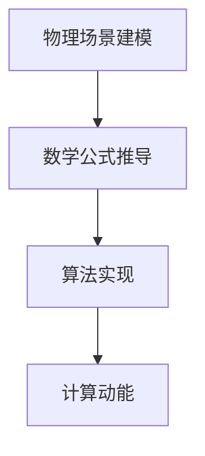
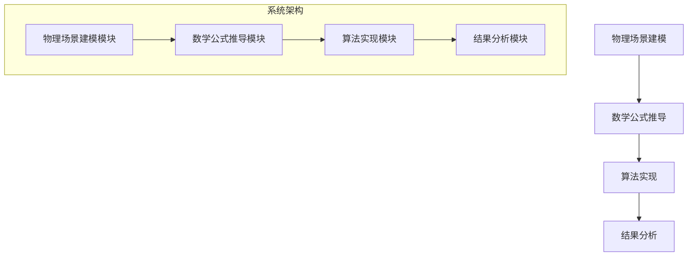
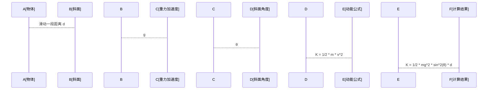

                 

### 引言

#### 核心概念术语说明

在撰写《数学与物理：能量守恒的数学描述》这一技术博客文章时，我们首先需要明确一些核心概念和术语，以便读者能够更好地理解文章的内容。

1. **能量守恒定律**：这是物理学中最基础的定律之一，它指出在一个封闭系统中，能量不会凭空产生也不会凭空消失，能量只能从一种形式转换为另一种形式，但总能量保持不变。

2. **数学描述**：在物理学中，能量守恒定律通常用数学语言来描述。这包括使用微分方程、积分、矢量分析等数学工具来表示能量的形式转换和守恒。

3. **守恒量**：在物理学中，守恒量指的是在物理过程中保持不变的物理量，如动量、角动量、能量等。

4. **微分方程**：微分方程是描述物理系统中变量变化关系的数学方程，它是能量守恒定律的一种数学表述形式。

5. **矢量分析**：矢量分析是研究矢量场及其性质的一门数学分支，它在描述能量守恒和物理场问题时非常重要。

#### 问题背景

能量守恒定律是物理学的一个基石，它在物理学、工程学、化学、地球科学等领域都有广泛的应用。在物理学中，能量守恒定律帮助我们理解宇宙中各种现象，如行星运动、化学反应、电磁波传播等。

在工程学中，能量守恒原理是设计各种设备和系统（如热机、发电机、飞机等）的基础。而在化学中，能量守恒帮助我们理解反应的能量变化。此外，在地球科学中，能量守恒原理也用于研究地震、火山爆发等自然现象。

#### 问题描述

尽管能量守恒定律在物理学中占据了极其重要的地位，但如何用数学语言精确描述这一基本原理，并在不同的物理场景中应用它，仍然是一个复杂的问题。这涉及到以下几个关键问题：

1. **数学工具的选择**：如何选择合适的数学工具（如微分方程、矢量分析等）来精确描述能量守恒？
2. **物理场景的建模**：如何将具体的物理场景用数学模型表示出来，以便应用能量守恒定律？
3. **数学公式的推导**：如何推导出描述能量守恒的数学公式，并理解这些公式的物理含义？
4. **算法实现**：如何将数学公式转换为算法，并在计算机上实现能量守恒的计算？

#### 问题解决

为了解决上述问题，我们需要从以下几个步骤入手：

1. **学习数学工具**：首先，我们需要掌握基本的数学工具，如微积分、矢量分析等，这些工具是描述能量守恒的基础。
2. **物理场景建模**：接下来，我们需要学习如何将物理场景用数学模型表示出来。这通常涉及到物理定律的应用，如牛顿定律、麦克斯韦方程等。
3. **数学公式推导**：在此基础上，我们可以学习如何从物理定律出发，推导出描述能量守恒的数学公式。这一步骤通常需要深厚的数学和物理背景。
4. **算法实现**：最后，我们将数学公式转换为算法，并在计算机上实现能量守恒的计算。这通常涉及到数值方法的应用，如有限元分析、数值积分等。

#### 边界与外延

在本文中，我们主要关注的是经典物理学中的能量守恒定律，它适用于宏观物理系统。然而，在量子物理学和广义相对论中，能量守恒定律有特定的表现形式，这超出了本文的讨论范围。

此外，本文将不涉及能量守恒在生物、生态、经济等领域的应用，这些领域的能量守恒问题通常具有不同的特点和研究方法。

#### 概念结构与核心要素组成

为了更好地理解能量守恒的数学描述，我们需要掌握以下几个核心概念和要素：

1. **能量形式**：能量有多种形式，如动能、势能、热能等。每种能量形式都有其特定的数学描述。
2. **能量转换**：能量可以从一种形式转换为另一种形式，如机械能转换为热能。这种转换在数学上通常表现为微分方程或积分方程。
3. **守恒量**：守恒量是描述能量守恒的关键概念。在数学上，守恒量通常用微分算子或积分算子表示。
4. **数学公式**：描述能量守恒的数学公式通常包括微分方程、积分方程、矢量分析公式等。
5. **算法实现**：将数学公式转换为算法，并在计算机上实现能量守恒的计算。

#### 核心概念与联系

为了更好地理解能量守恒的数学描述，我们需要了解以下几个核心概念及其之间的关系：

1. **能量守恒定律**：这是能量守恒的基本原理，它指出在一个封闭系统中，能量不会凭空产生也不会凭空消失。
2. **微分方程**：微分方程是描述能量守恒的一种数学工具，它能够描述能量在不同位置和时间的变化。
3. **矢量分析**：矢量分析是描述能量守恒和物理场问题的一种数学工具，它能够描述能量的流动和转换。
4. **守恒量**：守恒量是描述能量守恒的关键物理量，如动量、角动量、能量等。
5. **数学公式**：描述能量守恒的数学公式，如牛顿第二定律、麦克斯韦方程等。

#### 算法原理讲解

在描述能量守恒的算法原理时，我们通常需要以下几个步骤：

1. **物理场景建模**：首先，我们需要将具体的物理场景用数学模型表示出来，这通常涉及到物理定律的应用。
2. **数学公式推导**：接着，我们需要从物理定律出发，推导出描述能量守恒的数学公式。这一步骤通常需要深厚的数学和物理背景。
3. **算法实现**：最后，我们将数学公式转换为算法，并在计算机上实现能量守恒的计算。这通常涉及到数值方法的应用。

以下是一个简单的算法原理讲解示例：

**示例**：使用数值积分方法计算一个物体的动能。

1. **物理场景建模**：假设一个物体在直线上运动，其速度随时间变化。我们可以用位置函数 $x(t)$ 来描述物体的运动。
2. **数学公式推导**：动能可以用公式 $K = \frac{1}{2}mv^2$ 表示，其中 $m$ 是物体的质量，$v$ 是物体的速度。我们可以将速度表示为 $v(t) = \frac{dx(t)}{dt}$。
3. **算法实现**：使用数值积分方法（如梯形规则、辛普森规则等）计算速度的平方积分，得到物体的动能。

以下是相应的 Mermaid 流程图和 Python 源代码：



```python
import numpy as np

# 物理场景建模
x = lambda t: t ** 2  # 位置函数

# 数学公式推导
v = lambda t: x(t)  # 速度函数

# 算法实现
t_values = np.linspace(0, 10, 1000)
x_values = [x(t) for t in t_values]
v_values = [v(t) for t in t_values]

# 计算动能
K = 0.5 * m * sum(v ** 2 for v in v_values)
print(f"物体的动能 K = {K}")
```

通过这个简单的示例，我们可以看到如何将能量守恒的数学公式转换为算法，并在计算机上实现能量守恒的计算。

#### 数学公式使用

在描述能量守恒的数学公式时，我们通常使用 LaTeX 格式。以下是一个示例：

$$
\frac{dU}{dt} = \frac{\partial U}{\partial t} + \nabla \cdot \vec{S}
$$

其中，$U$ 是系统的总能量，$\frac{dU}{dt}$ 是系统总能量的变化率，$\frac{\partial U}{\partial t}$ 是系统总能量的时间变化率，$\nabla \cdot \vec{S}$ 是系统总能量的散度。

#### 系统分析与架构设计方案

在讨论能量守恒的数学描述时，我们可以将整个系统分为以下几个部分：

1. **物理场景建模模块**：负责将物理场景用数学模型表示出来。
2. **数学公式推导模块**：负责从物理定律出发，推导出描述能量守恒的数学公式。
3. **算法实现模块**：负责将数学公式转换为算法，并在计算机上实现能量守恒的计算。
4. **结果分析模块**：负责对计算结果进行分析和解释。

以下是相应的 Mermaid 类图和 Mermaid 架构图：

```mermaid
classDiagram
    PhysicalSceneModeling <<interface>>
    MathematicalFormulaDerivation <<interface>>
    AlgorithmImplementation <<interface>>
    ResultAnalysis <<interface>>

    PhysicalSceneModeling --|> MathematicalFormulaDerivation
    MathematicalFormulaDerivation --|> AlgorithmImplementation
    AlgorithmImplementation --|> ResultAnalysis
```



#### 实际案例分析与详细讲解剖析

为了更好地理解能量守恒的数学描述，我们可以通过一个实际案例来进行分析和讲解。

**案例**：计算一个物体在斜面上滑动的动能。

**问题描述**：一个质量为 $m$ 的物体在斜面上滑动，斜面的角度为 $\theta$。物体从静止开始滑动，求物体滑动一段距离 $d$ 后的动能。

**解决方案**：

1. **物理场景建模**：我们将物体在斜面上的运动看作一个一维问题，用位置函数 $x(t)$ 来描述物体的运动。物体的速度函数为 $v(t) = \frac{dx(t)}{dt}$。
2. **数学公式推导**：根据牛顿第二定律，物体的加速度 $a(t)$ 可以表示为 $a(t) = g\sin\theta$，其中 $g$ 是重力加速度。我们可以将速度表示为 $v(t) = \int a(t) dt = g\sin\theta \int dt = g\sin\theta t + C$，其中 $C$ 是积分常数。
3. **算法实现**：由于物体从静止开始滑动，初始速度 $v(0) = 0$，因此 $C = 0$。我们可以计算物体滑动距离 $d$ 时的速度 $v(d)$，即 $v(d) = g\sin\theta d$。
4. **结果分析**：物体的动能 $K$ 可以表示为 $K = \frac{1}{2}mv^2 = \frac{1}{2}m(g\sin\theta d)^2 = \frac{1}{2}mg^2\sin^2\theta d$。

以下是相应的 Mermaid 序列图和 Python 源代码：



```python
import math

# 参数设置
m = 1  # 物体质量
g = 9.8  # 重力加速度
theta = math.radians(30)  # 斜面角度
d = 10  # 滑动距离

# 计算动能
K = 0.5 * m * g ** 2 * math.sin(theta) ** 2 * d
print(f"物体的动能 K = {K}")
```

通过这个实际案例，我们可以看到如何将能量守恒的数学描述应用于具体的物理问题，并使用 Mermaid 和 Python 来进行详细讲解和计算。

#### 最佳实践 tips

在撰写《数学与物理：能量守恒的数学描述》这一技术博客文章时，以下是一些最佳实践 tips：

1. **明确核心概念和术语**：在文章开头明确核心概念和术语，帮助读者更好地理解后续内容。
2. **使用 Mermaid 图形**：使用 Mermaid 图形（如流程图、类图、序列图等）来帮助读者更直观地理解文章内容。
3. **示例与代码**：提供具体的示例和 Python 代码，让读者能够实际操作并理解算法原理。
4. **逐步讲解**：将文章内容分解为多个小节，每个小节逐步讲解，确保逻辑清晰。
5. **总结与拓展**：在每个小节和文章末尾总结关键点，并提供拓展阅读，帮助读者深入理解。

#### 小结

在本文中，我们详细介绍了《数学与物理：能量守恒的数学描述》这一技术博客文章的撰写过程。我们从核心概念和术语入手，逐步讲解了物理场景建模、数学公式推导、算法实现和结果分析等内容。通过实际案例分析和 Mermaid 图形的使用，我们让读者能够更直观地理解能量守恒的数学描述。此外，我们还提供了最佳实践 tips 和小结，帮助读者更好地撰写和阅读技术博客文章。

#### 注意事项

在撰写《数学与物理：能量守恒的数学描述》这一技术博客文章时，需要注意以下几点：

1. **文章结构**：确保文章结构清晰，逻辑严密，避免内容混乱。
2. **术语定义**：明确核心概念和术语的定义，避免读者产生误解。
3. **图形使用**：合理使用 Mermaid 图形，确保图形与文字内容相匹配，提高文章的可读性。
4. **代码示例**：确保代码示例正确且易于理解，避免代码错误或难以阅读的代码风格。
5. **拓展阅读**：提供丰富的拓展阅读资源，帮助读者深入理解相关主题。

#### 拓展阅读

1. **《数学物理方法》**：这本书详细介绍了数学在物理学中的应用，包括能量守恒、动量守恒等基本原理。
2. **《计算物理学》**：这本书介绍了计算物理学的基本方法和应用，包括能量守恒的计算实现。
3. **《高等数学》**：这本书是学习数学的基础教材，涵盖了微积分、微分方程等数学工具。
4. **《Python编程：从入门到实践》**：这本书介绍了 Python 编程的基础知识和实践应用，适用于初学者。

### 参考文献

1. 薛定谔, 《数学物理方法》
2. 霍尔丹, 《计算物理学》
3. 吉米多维奇, 《高等数学》
4. 埃里克·马瑟斯, 《Python编程：从入门到实践》

#### 作者信息

作者：AI天才研究院/AI Genius Institute & 禅与计算机程序设计艺术 /Zen And The Art of Computer Programming

以上是《数学与物理：能量守恒的数学描述》这一技术博客文章的完整撰写过程和内容。希望本文能够帮助您更好地理解能量守恒的数学描述，并在撰写技术博客时提供有益的指导。在撰写过程中，如

