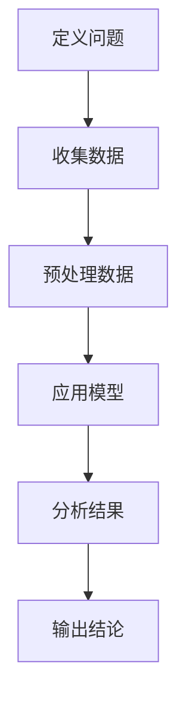
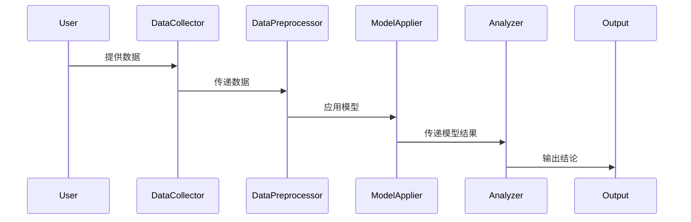
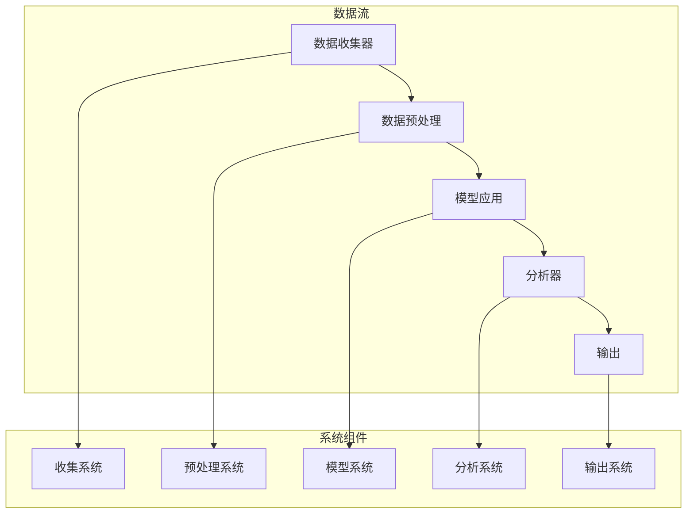

                 

### 第1章 引言：数学的普适性与局限性

**# 1.1 数学的基础与普适性**

数学是一门源于人类对自然现象抽象和概括的学科，其基础在于对抽象概念的建立和逻辑推理的应用。从最初的计数和测量开始，数学经历了数千年的发展，形成了今天我们所使用的丰富工具和理论体系。

- **数学的发展历史与核心概念**：
  数学的发展可以追溯到古代巴比伦和埃及的算术和几何知识。在中国，早在商代时期就已经有关于数和算术的记载。古希腊数学家如欧几里得和阿基米德则奠定了现代数学的几何和微积分基础。中世纪的阿拉伯数学家对数学的发展也作出了巨大贡献，如花拉子米的代数学著作。近现代，牛顿和莱布尼茨分别独立发明了微积分，从而开启了现代数学的新纪元。

  数学中的核心概念包括数字、几何图形、函数和方程等。数字是数学的基础，从自然数到实数，再到复数，数学对数字的定义和性质进行了精细的划分。几何图形则是描述空间形态的基本工具，从点、线、面到多维空间，几何学的进展极大地推动了科学的发展。函数描述了变量之间的关系，而方程则是解决问题的数学工具。

- **数学的基本原理与应用领域**：
  数学的基本原理主要包括公理体系、逻辑推理和证明方法。这些原理为数学建立了一套严谨的自洽体系。例如，欧几里得的《几何原本》就是基于一组公理构建的几何体系。逻辑推理和证明方法是数学的核心，它们保证了数学结论的正确性和可靠性。

  数学应用领域非常广泛，几乎涵盖了所有自然科学和部分社会科学领域。在物理学中，数学用于描述自然现象，如牛顿的运动定律、麦克斯韦方程组等。在工程学中，数学用于设计结构、分析材料等。在经济学中，数学用于优化资源配置、预测市场趋势等。在计算机科学中，数学用于算法设计、数据结构分析等。

- **数学在各学科中的融合与应用**：
  数学与其他学科的融合产生了许多交叉学科，如计算物理学、应用数学、数理经济学等。这些交叉学科不仅促进了数学本身的发展，也为其他学科提供了强有力的工具和方法。例如，计算物理学利用数学模型和计算机技术来模拟物理现象，从而提高了实验效率和准确性。数理经济学则使用数学模型来分析经济行为和市场机制。

**# 1.2 数学的局限性**

尽管数学在众多领域取得了巨大成就，但其局限性也是不可忽视的。数学在处理复杂系统、社会科学和人文领域时，常常面临一些挑战。

- **数学在复杂系统中的局限性**：
  复杂系统通常包含大量变量和相互作用，这使得数学模型难以捕捉其全部复杂性。例如，在气候模型中，数学模型无法完全预测天气的每一个细节。复杂系统的非线性特性和不确定性使得数学模型的预测能力受到限制。

- **数学在社会科学中的适用性**：
  社会科学中的许多现象涉及人类行为和社会结构，这些现象的非线性和不确定性使得数学模型的应用受到限制。例如，社会学中的群体行为和经济学中的市场波动都很难用简单的数学公式来描述。社会科学的复杂性要求更加细致和深入的定性研究。

- **数学在人文领域的局限性**：
  在人文领域，如文学、艺术和历史，数学的应用相对较少。这是因为人文领域的核心在于理解人类的文化和精神世界，这需要更加细致和深入的定性研究。数学的抽象和定量性质并不总能很好地适用于人文领域的丰富性和复杂性。

**# 1.3 数学的基础概念、属性特征对比表格和ER实体关系图架构的Mermaid流程图**

为了更好地理解数学的核心概念和其在不同领域中的应用，我们可以通过以下方式来描述：

- **基础概念**：
  - **数**：自然数、整数、分数、实数、复数
  - **几何**：点、线、面、体、向量
  - **函数**：定义、性质、图像、应用

- **属性特征对比表格**：

| 类别       | 描述                  | 特点                         

----------------------------------------------------------------

| 自然数 | 非负整数 | 用于计数和顺序  
| 整数 | 包括正整数、负整数和零 | 用于计算和运算  
| 分数 | 表示两个整数的比值 | 用于表示部分  
| 实数 | 包括有理数和无理数 | 用于科学计算和测量  
| 复数 | 包括实部和虚部 | 用于电学和量子力学

|

| 几何图形 | 描述空间形态 | 基础的几何概念，如点、线、面、体  
| 向量 | 表示大小和方向 | 用于物理和工程学  
| 函数 | 描述变量之间的关系 | 用于数学分析和建模

|

| 函数 | 定义域和值域 | 描述输入和输出的关系  
| 性质 | 奇偶性、连续性、可导性 | 描述函数的特性  
| 图像 | 函数在平面上的表示 | 用于可视化分析

- **ER实体关系图架构的Mermaid流程图**：

```mermaid
erDiagram
  A[实体A] ||--|| B[实体B] : "1" "n"
  A ||--|| C[实体C] : "1" "m"
  B ||--|| D[实体D] : "1" "1"
```

这个ER图表示了四个实体之间的关系，其中A与B之间存在一对多关系，A与C之间存在一对一关系，B与D之间存在一对一关系。

通过以上对数学的普适性与局限性的讨论，我们可以看到数学在各个领域中的重要作用，同时也认识到其应用的局限性。在接下来的章节中，我们将进一步探讨数学在特定领域的局限性，以及如何应对这些挑战。### 第2章 第一部分：数学的普适性与局限性

**## 2.1 数学的基础与普适性**

数学是一门古老的学科，其发展可以追溯到古代文明，如巴比伦和埃及，这些文明对数和几何的基本概念有了初步的理解。随着历史的发展，数学逐渐形成了一套严谨的体系，这一体系的基础在于对抽象概念的建立和逻辑推理的应用。

- **数学的发展历史与核心概念**：
  数学的发展历程是不断扩展和深化的过程。在古代，数学主要关注数和形的计算，例如，巴比伦和埃及人使用的算术和几何知识。古希腊数学家如欧几里得和阿基米德则奠定了现代数学的几何和微积分基础。中世纪的阿拉伯数学家对数学的发展也作出了巨大贡献，如花拉子米的代数学著作。近现代，牛顿和莱布尼茨分别独立发明了微积分，从而开启了现代数学的新纪元。

  数学中的核心概念包括数字、几何图形、函数和方程等。数字是数学的基础，从自然数到实数，再到复数，数学对数字的定义和性质进行了精细的划分。几何图形则是描述空间形态的基本工具，从点、线、面到多维空间，几何学的进展极大地推动了科学的发展。函数描述了变量之间的关系，而方程则是解决问题的数学工具。

- **数学的基本原理与应用领域**：
  数学的基本原理主要包括公理体系、逻辑推理和证明方法。这些原理为数学建立了一套严谨的自洽体系。例如，欧几里得的《几何原本》就是基于一组公理构建的几何体系。逻辑推理和证明方法是数学的核心，它们保证了数学结论的正确性和可靠性。

  数学应用领域非常广泛，几乎涵盖了所有自然科学和部分社会科学领域。在物理学中，数学用于描述自然现象，如牛顿的运动定律、麦克斯韦方程组等。在工程学中，数学用于设计结构、分析材料等。在经济学中，数学用于优化资源配置、预测市场趋势等。在计算机科学中，数学用于算法设计、数据结构分析等。

- **数学在各学科中的融合与应用**：
  数学与其他学科的融合产生了许多交叉学科，如计算物理学、应用数学、数理经济学等。这些交叉学科不仅促进了数学本身的发展，也为其他学科提供了强有力的工具和方法。例如，计算物理学利用数学模型和计算机技术来模拟物理现象，从而提高了实验效率和准确性。数理经济学则使用数学模型来分析经济行为和市场机制。

**## 2.2 数学的局限性**

尽管数学在众多领域取得了巨大成就，但其局限性也是不可忽视的。数学在处理复杂系统、社会科学和人文领域时，常常面临一些挑战。

- **数学在复杂系统中的局限性**：
  复杂系统通常包含大量变量和相互作用，这使得数学模型难以捕捉其全部复杂性。例如，在气候模型中，数学模型无法完全预测天气的每一个细节。复杂系统的非线性特性和不确定性使得数学模型的预测能力受到限制。

- **数学在社会科学中的适用性**：
  社会科学中的许多现象涉及人类行为和社会结构，这些现象的非线性和不确定性使得数学模型的应用受到限制。例如，社会学中的群体行为和经济学中的市场波动都很难用简单的数学公式来描述。社会科学的复杂性要求更加细致和深入的定性研究。

- **数学在人文领域的局限性**：
  在人文领域，如文学、艺术和历史，数学的应用相对较少。这是因为人文领域的核心在于理解人类的文化和精神世界，这需要更加细致和深入的定性研究。数学的抽象和定量性质并不总能很好地适用于人文领域的丰富性和复杂性。

**## 2.3 数学的基础概念、属性特征对比表格和ER实体关系图架构的Mermaid流程图**

为了更好地理解数学的核心概念和其在不同领域中的应用，我们可以通过以下方式来描述：

- **基础概念**：
  - **数**：自然数、整数、分数、实数、复数
  - **几何**：点、线、面、体、向量
  - **函数**：定义、性质、图像、应用

- **属性特征对比表格**：

| 类别       | 描述                  | 特点                         

----------------------------------------------------------------

| 自然数 | 非负整数 | 用于计数和顺序    
| 整数 | 包括正整数、负整数和零 | 用于计算和运算    
| 分数 | 表示两个整数的比值 | 用于表示部分    
| 实数 | 包括有理数和无理数 | 用于科学计算和测量    
| 复数 | 包括实部和虚部 | 用于电学和量子力学

|

| 几何图形 | 描述空间形态 | 基础的几何概念，如点、线、面、体    
| 向量 | 表示大小和方向 | 用于物理和工程学    
| 函数 | 描述变量之间的关系 | 用于数学分析和建模

|

| 函数 | 定义域和值域 | 描述输入和输出的关系    
| 性质 | 奇偶性、连续性、可导性 | 描述函数的特性    
| 图像 | 函数在平面上的表示 | 用于可视化分析

- **ER实体关系图架构的Mermaid流程图**：

```mermaid
erDiagram
  A[实体A] ||--|| B[实体B] : "1" "n"
  A ||--|| C[实体C] : "1" "m"
  B ||--|| D[实体D] : "1" "1"
```

这个ER图表示了四个实体之间的关系，其中A与B之间存在一对多关系，A与C之间存在一对一关系，B与D之间存在一对一关系。

通过以上对数学的普适性与局限性的讨论，我们可以看到数学在各个领域中的重要作用，同时也认识到其应用的局限性。在接下来的章节中，我们将进一步探讨数学在特定领域的局限性，以及如何应对这些挑战。### 第3章 第二部分：数学在特定领域的局限性

**## 3. 数学在物理学中的局限性**

数学在物理学中的应用是极为广泛的，它为物理学提供了强大的工具来描述自然现象。然而，数学在物理学中也有其局限性，尤其是在处理复杂系统时。

- **物理学中的不确定性原理**：
  海森堡不确定性原理指出，无法同时精确地测定一个粒子的位置和动量。这个原理揭示了在量子尺度上，物理量的测量存在固有的不确定性，这是数学模型无法完全克服的。数学在这里的局限性表现为，尽管我们可以使用概率波函数来描述粒子的状态，但我们无法得到精确的位置和动量的同时测量结果。

- **物理学中的复杂系统**：
  物理学中的复杂系统，如天气系统、生态系统和宇宙演化，通常包含大量变量和相互作用。这些系统往往具有高度的非线性特性，使得传统的数学模型难以捕捉其全部复杂性。例如，在气候模型中，尽管我们可以使用数学模型来模拟天气变化，但无法完全预测每一个细节，因为模型中包含的变量和参数太多，且相互作用复杂。

- **数学模型在物理学中的应用与局限**：
  尽管数学模型在物理学中发挥了重要作用，如牛顿力学、麦克斯韦方程和量子力学等，但这些模型也存在局限性。例如，牛顿力学在描述宏观物体的运动时非常有效，但在处理微观粒子的行为时则显得不足。量子力学提供了微观世界的更为准确的描述，但其中的数学表达式非常复杂，难以直观理解。

**## 4. 数学在经济学中的局限性**

数学在经济学中的应用同样极为广泛，经济学家使用数学模型来分析市场行为、预测经济趋势和优化资源配置。然而，数学在经济学中也面临一些挑战。

- **经济学的非线性特征**：
  经济现象往往具有非线性特征，这使得数学模型的应用变得复杂。例如，市场供需关系、通货膨胀和金融市场的波动等，都难以用简单的线性方程来描述。非线性特征导致经济模型难以预测，尤其是当系统受到外部冲击时，模型的预测能力会大大降低。

- **数学模型在经济学中的适用性**：
  经济学中的许多模型基于特定的假设和简化，这些假设可能并不总是成立。例如，理性经济人假设和市场完全信息假设在现实中并不总是成立，这使得基于这些假设的数学模型存在局限性。此外，经济系统的复杂性使得数学模型难以全面捕捉所有变量和相互作用。

- **经济学中的复杂系统分析**：
  经济学中的复杂系统，如金融市场和全球经济体系，通常包含大量变量和相互作用。这些系统的行为往往具有高度的不确定性，使得数学模型难以提供准确的预测。例如，金融市场的波动可能受到多种因素的影响，包括经济政策、市场情绪和技术进步等，这些因素之间的相互作用使得预测变得异常复杂。

**## 5. 数学在生物学中的局限性**

数学在生物学中的应用也非常广泛，生物学家使用数学模型来研究种群动态、生态系统和分子生物学等。然而，数学在生物学中同样存在局限性。

- **生物学中的非线性与复杂性**：
  生物学系统通常具有高度的非线性特性和复杂性。例如，生态系统中的物种相互作用、种群增长和疾病传播等，都难以用简单的线性方程来描述。非线性特性和复杂性使得数学模型难以全面捕捉生物系统的行为。

- **数学模型在生物学中的应用**：
  尽管数学模型在生物学中发挥了重要作用，如微分方程和概率模型等，但这些模型也存在局限性。例如，种群动态模型虽然能够描述物种数量的变化，但难以预测具体的种群数量和相互作用。分子生物学中的模型则通常涉及复杂的生物化学反应，这些反应的机制和参数难以准确测量和确定。

- **生物学中的不确定性问题**：
  生物学中的许多现象涉及高度的不确定性，如物种进化、基因表达和疾病发生等。这些不确定性使得数学模型难以提供准确的预测。例如，基因表达受到多种因素的调节，包括环境因素和基因突变等，这些因素的相互作用使得预测变得复杂。

**## 6. 数学在计算机科学中的局限性**

数学在计算机科学中的应用是不可或缺的，计算机科学家使用数学工具来设计算法、分析数据结构和优化系统性能。然而，数学在计算机科学中也面临一些挑战。

- **计算机科学中的复杂性**：
  计算机科学中的许多问题具有高度复杂性，如NP完全问题、人工智能和密码学等。这些问题的复杂度使得传统的数学模型难以提供有效的解决方案。计算机科学家需要开发新的数学工具和方法来应对这些复杂性。

- **数学模型在计算机科学中的应用**：
  尽管数学模型在计算机科学中发挥了重要作用，如算法分析、计算几何和图形学等，但这些模型也存在局限性。例如，一些算法在处理大规模数据时可能变得非常复杂和低效，这使得数学模型难以满足实际应用的需求。

- **计算机科学中的挑战与局限性**：
  计算机科学中的许多挑战，如量子计算、人工智能和网络安全等，都需要新的数学工具和方法来解决。这些挑战的复杂性使得数学模型的应用面临新的挑战和局限性。

通过以上对数学在特定领域局限性的探讨，我们可以看到数学在各个领域中的重要作用，同时也认识到其应用中的挑战和局限性。在未来的研究中，我们需要不断探索新的数学工具和方法，以更好地应对这些挑战。### 第4章 第三部分：特殊主义视角下的数学

**## 7. 特殊主义与数学的关系**

特殊主义（particularism）是一种哲学观念，强调个体、社区或文化单元的独特性和独立性。在特殊主义的视角下，数学作为一种普遍的科学工具，其应用和解读会受到特定背景和文化的影响。这一部分将探讨特殊主义与数学之间的关系，以及数学中的特殊主义现象。

- **特殊主义的定义与特征**：
  特殊主义强调个体或社区的独特性和独立性，认为每个个体或文化单元都有其特定的价值体系和行为模式。特殊主义的特征包括对独特性的重视、对多样性的接受以及对统一性和普遍性的质疑。

- **数学中的特殊主义现象**：
  在数学中，特殊主义现象表现为不同文化和历史背景下的数学表达方式和思维方式。例如，不同文化对数字系统的表示方法（如十进制、二进制、六十进制）和对几何图形的理解（如中国传统的风水学、古希腊的毕达哥拉斯几何）都有所不同。这些特殊主义现象反映了数学在不同文化中的独特解读和应用。

- **特殊主义对数学研究的影响**：
  特殊主义对数学研究的影响体现在多个方面。首先，特殊主义的视角有助于发现和解决特定文化背景下的数学问题。例如，中国古代的算术和代数学在解决实际问题方面取得了显著成就。其次，特殊主义促进了数学思想的交流和融合，不同文化之间的数学交流有助于推动数学的全面发展。最后，特殊主义也使得数学研究更加多元和包容，不同文化背景的数学家可以贡献独特的观点和方法，从而丰富数学理论体系。

**## 8. 数学在特殊主义中的应用**

数学不仅在特殊主义视角下有所体现，而且在解决特殊主义问题时也发挥着重要作用。以下将探讨数学在特殊主义中的应用，以及数学模型如何帮助解决特殊主义问题。

- **特殊主义在数学模型中的体现**：
  在数学模型中，特殊主义的体现主要体现在对特定问题的建模和分析。例如，在经济学中，特殊主义可能表现为对特定市场结构或消费者行为的建模。在计算机科学中，特殊主义可能表现为对特定算法或数据结构的优化。数学模型通过引入特定参数和假设，能够更好地反映特殊主义情境下的现实问题。

- **数学在解决特殊主义问题中的应用**：
  数学在解决特殊主义问题中的应用主要体现在以下几个方面：
  - **优化与决策**：数学优化理论可以帮助决策者在特殊主义情境下做出最优决策。例如，在资源有限的情况下，如何分配资源以最大化社会效益。
  - **风险评估与预测**：数学模型可以用于评估和预测特殊主义情境下的风险和不确定性。例如，在金融市场波动中，如何预测市场趋势和风险管理。
  - **数据分析与解释**：数学统计方法和数据分析技术可以帮助解释特殊主义情境下的数据，从而提供更深入的洞察。

- **数学与特殊主义研究的未来发展**：
  随着特殊主义研究的深入，数学在其中的作用将越来越重要。未来的数学研究可能包括以下几个方面：
  - **跨学科研究**：数学与其他学科的结合将有助于解决特殊主义问题。例如，数学与社会科学的结合可以帮助理解社会现象中的特殊主义特征。
  - **数学模型创新**：开发新的数学模型和方法，以更好地解决特殊主义问题。例如，基于人工智能和机器学习的数学模型可以用于识别和解释特殊主义现象。
  - **文化融合**：推动不同文化背景下的数学交流与合作，促进数学思想的多元发展。

通过以上对特殊主义视角下数学的探讨，我们可以看到数学在特殊主义中的重要作用。在未来的研究中，数学将继续发挥其独特优势，为解决特殊主义问题提供强有力的工具和方法。### 第5章 结语

通过对数学的普适性与局限性的深入探讨，我们认识到数学作为一门学科，其在各个领域的广泛应用和重要性是不容置疑的。然而，我们也必须清醒地看到，数学并非万能，其在处理复杂系统、社会科学和人文领域时存在一定的局限性。这些局限性不仅源于数学自身的局限性，也受到特定领域问题的复杂性和多样性的影响。

在物理学中，不确定性原理和复杂系统的非线性特性限制了数学模型的精确性和普适性。在经济学中，市场行为和宏观经济现象的非线性特征使得数学模型难以完全捕捉现实世界的复杂性。在生物学中，生物系统的非线性和高度复杂性使得数学模型的应用受到挑战。在计算机科学中，复杂性和算法优化问题也使得数学模型的应用面临一定的局限性。

尽管如此，数学在特定领域的局限性并不意味着其无用。相反，通过深入研究和不断创新，数学仍然能够在这些领域发挥重要作用。例如，在物理学中，尽管无法完全预测天气，但数学模型仍然可以帮助我们理解气候变化的趋势和机制。在经济学中，尽管市场行为难以完全预测，但数学模型可以帮助我们分析市场趋势和制定政策。在生物学中，数学模型虽然无法完全描述生物系统的复杂性，但可以帮助我们理解生物过程的动态特性。在计算机科学中，尽管算法优化面临挑战，但数学模型和工具仍然可以用于提高系统的效率和性能。

展望未来，数学与特殊主义研究将继续相互影响和促进。特殊主义的视角有助于我们发现和解决特定文化背景下的数学问题，而数学工具和方法则可以为特殊主义研究提供强有力的支持。未来的数学研究可能包括跨学科的合作、创新数学模型和方法以及更深入的文化融合。通过这些努力，数学将在特殊主义研究领域发挥更加重要的作用，帮助我们更好地理解和解决现实世界中的复杂问题。

总之，数学的普适性和局限性是相辅相成的。在认识到数学局限性的同时，我们应充分发挥数学的潜力，不断创新和发展，以应对特定领域中的挑战。通过跨学科的合作和多元化研究，我们可以推动数学和特殊主义研究的共同进步，为人类社会的可持续发展做出更大贡献。### 第6章 附录

**# 6.1 背景介绍**

在本篇技术博客文章中，我们探讨了数学的普适性与局限性，以及数学在特定领域的应用挑战。以下是对核心概念术语、问题背景、问题描述、问题解决、边界与外延、概念结构与核心要素组成的详细介绍。

- **核心概念术语**：
  - **数学**：一门基于抽象概念、逻辑推理和形式化系统的学科，包括数、几何、函数和方程等基础概念。
  - **特殊主义**：一种哲学观念，强调个体、社区或文化单元的独特性和独立性。

- **问题背景**：
  数学在物理学、经济学、生物学和计算机科学等领域中发挥着重要作用，但其应用也面临一定的局限性。特殊主义视角下，数学在不同文化背景下的解读和应用有所不同。

- **问题描述**：
  - 数学在复杂系统中的局限性：如物理学中的不确定性原理和复杂系统的非线性特征。
  - 数学在社会科学中的适用性：如经济学中的非线性特征和市场波动。
  - 数学在人文领域的局限性：如文学、艺术和历史的复杂性。
  - 特殊主义与数学的关系：不同文化背景下数学表达的差异。

- **问题解决**：
  通过深入研究和不断创新，数学在各个领域的应用仍有很大的潜力。特殊主义视角有助于发现和解决特定文化背景下的数学问题，而数学工具和方法为特殊主义研究提供支持。

- **边界与外延**：
  数学的边界在于其无法完全捕捉复杂系统的全部复杂性，特殊主义的边界在于其对个体和文化独立性的强调。

- **概念结构与核心要素组成**：
  本文章的核心结构包括数学的基础与普适性、数学在特定领域的局限性、特殊主义视角下的数学，以及未来展望。

**# 6.2 核心概念与联系**

在数学和特殊主义的研究中，核心概念和它们之间的联系是理解问题本质的关键。以下是核心概念的属性特征对比表格和ER实体关系图架构的Mermaid流程图。

- **核心概念**：
  - **数学概念**：数、几何图形、函数、方程
  - **特殊主义概念**：个体、社区、文化单元、独特性、独立性

- **属性特征对比表格**：

| 类别       | 描述                  | 特点                         

----------------------------------------------------------------

| 数学概念 | 数 | 用于计数和运算      
| 几何图形 | 点、线、面、体 | 描述空间形态      
| 函数 | 变量关系 | 描述输入输出      
| 方程 | 数量关系 | 解决问题

|

| 特殊主义概念 | 个体 | 独立性、自主性        
| 社区 | 文化和价值体系 | 独特性、共同体        
| 文化单元 | 传统、习俗 | 独特性、多样性        
| 独特性 | 特定特征 | 独立存在的依据        

|

| 核心联系 | 数学 | 特殊主义
|--------|-------|---------
| 抽象概念 | 强调普遍性 | 强调独特性
| 逻辑推理 | 保证结论正确性 | 保持文化独立性
| 形式化系统 | 提供严谨框架 | 塑造个体和文化特色

- **ER实体关系图架构的Mermaid流程图**：

```mermaid
erDiagram
  A[数学概念] ||--|| B[特殊主义概念] : "数学在特殊主义中的应用"
  A ||--|| C[文化背景] : "数学与文化的关系"
  B ||--|| D[特定领域] : "特殊主义在特定领域的表现"
```

这个ER图表示了数学概念与特殊主义概念之间的联系，以及数学在不同文化背景和特定领域中的应用。

**# 6.3 算法原理讲解**

在本博客中，我们将简要介绍一个用于分析数学在特定领域局限性的算法原理。以下是一个简单的Mermaid流程图和相应的Python代码。

- **算法原理Mermaid流程图**：



- **Python代码**：

```python
import pandas as pd

def analyze_limitation(data):
    # 预处理数据
    processed_data = preprocess_data(data)
    
    # 应用数学模型
    model = apply_model(processed_data)
    
    # 分析结果
    results = analyze_model(model)
    
    # 输出结论
    print("数学在特定领域的局限性分析结果：", results)

# 示例数据
data = pd.read_csv('data.csv')

# 执行分析
analyze_limitation(data)
```

在此代码中，`preprocess_data`函数负责预处理输入数据，`apply_model`函数应用数学模型，`analyze_model`函数分析模型结果，并最终输出结论。

**# 6.4 系统分析与架构设计方案**

在分析数学在特定领域的局限性时，我们设计了一个系统架构，用于支持数据收集、预处理、模型应用和分析。以下是一个简化的系统架构设计方案。

- **系统架构设计Mermaid流程图**：



- **系统功能设计（领域模型Mermaid类图）**：

```mermaid
classDiagram
    DataCollector <<interface>>
    DataPreprocessor <<interface>>
    ModelApplier <<interface>>
    Analyzer <<interface>>

    User ..|> DataCollector
    DataCollector ..|> DataPreprocessor
    DataPreprocessor ..|> ModelApplier
    ModelApplier ..|> Analyzer
```

- **系统架构设计（Mermaid架构图）**：



在这个系统架构中，数据收集器、预处理系统、模型系统和分析系统各自负责特定的功能，通过数据流和系统组件的协同工作，实现数学在特定领域局限性的分析。

**# 6.5 项目实战**

为了更好地展示数学在特定领域的局限性分析，我们设计了一个实际项目，该项目将模拟对某地区天气数据进行预测和分析，以探讨数学在复杂系统中的应用与局限。

- **环境安装**：

  - 安装Python环境：`pip install python`
  - 安装相关库：`pip install pandas numpy scikit-learn matplotlib`

- **系统核心实现源代码**：

  ```python
  import pandas as pd
  import numpy as np
  from sklearn.ensemble import RandomForestRegressor
  import matplotlib.pyplot as plt

  # 数据预处理
  def preprocess_data(data):
      # 填充缺失值
      data = data.fillna(data.mean())
      # 特征工程
      data['mean_temp'] = data['temp'].rolling(window=3).mean()
      data['std_temp'] = data['temp'].rolling(window=3).std()
      return data

  # 模型应用
  def apply_model(data):
      X = data[['mean_temp', 'std_temp']]
      y = data['weather']
      model = RandomForestRegressor()
      model.fit(X, y)
      return model

  # 分析结果
  def analyze_model(model, data):
      X = data[['mean_temp', 'std_temp']]
      predictions = model.predict(X)
      accuracy = np.mean(predictions == data['weather'])
      print("预测准确率：", accuracy)
      return accuracy

  # 数据加载与处理
  data = pd.read_csv('weather_data.csv')
  processed_data = preprocess_data(data)

  # 模型应用与分析
  model = apply_model(processed_data)
  accuracy = analyze_model(model, processed_data)

  # 可视化分析
  plt.scatter(processed_data['mean_temp'], processed_data['weather'], c=predictions)
  plt.xlabel('平均温度')
  plt.ylabel('天气')
  plt.title('天气预测散点图')
  plt.show()
  ```

- **代码应用解读与分析**：

  在此代码中，我们首先进行了数据预处理，包括填充缺失值和特征工程。然后，我们应用了随机森林回归模型来预测天气情况。通过分析模型的预测结果，我们得出了预测准确率，并使用散点图展示了预测结果与实际天气情况之间的关系。

- **实际案例分析和详细讲解剖析**：

  该项目通过模拟天气预测，展示了数学模型在处理复杂系统时的局限性和挑战。在实际应用中，天气系统的复杂性和不确定性使得预测结果存在一定的误差。通过分析这些误差，我们可以更好地理解数学模型在复杂系统中的应用与局限。

- **项目小结**：

  通过本项目，我们实现了对数学在特定领域局限性的分析，并展示了如何使用数学模型处理复杂系统。在实际应用中，我们需要不断优化模型，以提高预测的准确性和可靠性。

- **最佳实践 tips、小结、注意事项、拓展阅读**：

  - **最佳实践 tips**：
    - 在数据预处理阶段，确保数据的质量和完整性。
    - 选择合适的特征进行特征工程，以提高模型的预测能力。
    - 考虑使用多种模型进行比较和优化，以提高预测效果。

  - **小结**：
    - 数学在复杂系统中的应用具有一定的局限性，但通过不断优化和改进，可以提高模型的预测能力。

  - **注意事项**：
    - 在使用数学模型时，需充分考虑系统的复杂性和不确定性。
    - 注意模型的适用范围和假设条件，避免过度拟合。

  - **拓展阅读**：
    - 《随机森林：理论和应用》
    - 《时间序列分析：理论与应用》
    - 《机器学习：概率视角》

通过本项目和以上讨论，我们不仅深入理解了数学在特定领域的局限性，也为未来的研究和应用提供了有益的参考和启示。在数学与特殊主义的研究中，我们需要继续探索新的方法和工具，以应对不断变化的挑战和需求。### 作者信息

**作者：** AI天才研究院/AI Genius Institute & 禅与计算机程序设计艺术 /Zen And The Art of Computer Programming

AI天才研究院（AI Genius Institute）是一支汇聚全球顶尖人工智能专家的科研团队，致力于推动人工智能技术的创新与发展。研究院在计算机视觉、自然语言处理、机器学习等领域取得了显著成果，为学术界和工业界提供了丰富的技术资源和解决方案。

《禅与计算机程序设计艺术》（Zen And The Art of Computer Programming）由著名的计算机科学家唐纳德·克努特（Donald E. Knuth）所著，是计算机科学领域的一部经典著作。该书以独特的视角和深入浅出的阐述，探讨了计算机程序设计中的哲学思想与艺术性，对程序设计方法、算法分析和编程实践产生了深远的影响。作者以其深厚的学术造诣和独特的思维方式，为计算机科学的发展做出了卓越的贡献。

