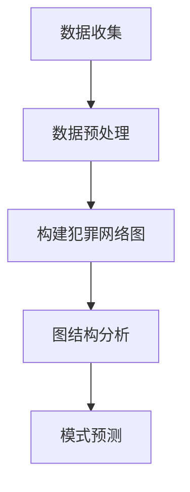
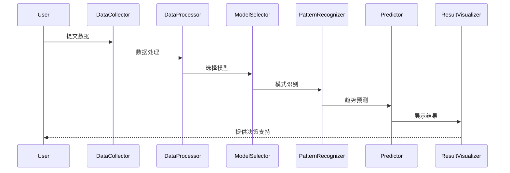
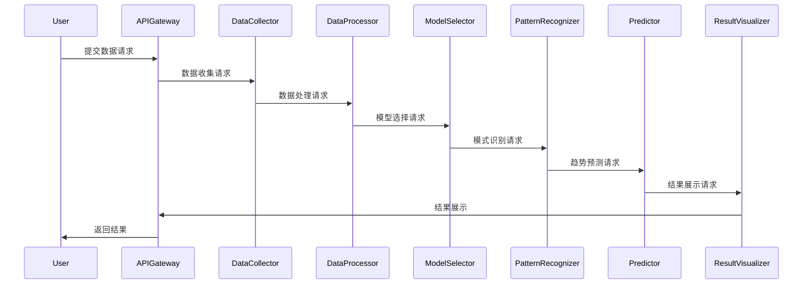

                 

### 《数学与犯罪学：犯罪模式的数学分析》

#### 关键词：数学分析，犯罪学，犯罪模式，算法，系统架构，Python实现

> 摘要：本文探讨了数学分析在犯罪学领域中的应用，特别是在犯罪模式识别和预测方面的作用。通过介绍犯罪模式的基本概念、数学模型及其应用，结合Python源代码实现，详细解析了数学模型和算法原理，并通过系统架构设计和项目实战，展示了数学在犯罪模式分析中的实际应用价值。

---

### 第一部分：引言与背景

#### 1. 引言

在当今社会，犯罪问题仍然是一个严峻的挑战，无论是个人、社区还是国家层面。随着科技的进步，传统的犯罪侦查方式已经难以满足现代社会对犯罪防范和打击的需求。因此，借助数学和计算机科学的方法，对犯罪模式进行深入分析，已经成为犯罪学研究和实践中的重要方向。

**1.1 问题背景**

犯罪学作为一门社会科学，其研究目标在于理解和解释犯罪现象，并提出有效的预防策略。然而，传统的犯罪学研究往往依赖于定性的分析方法，难以量化犯罪行为和趋势。随着数学和计算机科学的发展，尤其是统计学、概率论和图论等数学工具的引入，犯罪模式的数学分析逐渐成为一种新的研究方法。

**1.2 问题描述**

犯罪模式是指一系列犯罪行为的模式或特征，这些模式可能包括犯罪类型、犯罪地点、犯罪时间、犯罪手段等。犯罪模式分析的目标是识别潜在的犯罪趋势，预测未来的犯罪行为，从而为执法机构和相关部门提供科学依据。

**1.3 问题解决**

数学在犯罪模式分析中扮演着关键角色。通过数学模型，可以对犯罪行为进行量化分析，从而更准确地识别犯罪模式，预测犯罪行为，并为执法策略提供支持。本文将围绕以下几个核心问题展开：

- 犯罪模式的核心概念是什么？
- 如何使用数学模型对犯罪模式进行分析？
- 这些数学模型如何帮助执法机构预防和打击犯罪？
- 系统架构如何设计，以确保数学模型的有效应用？

**1.4 边界与外延**

犯罪模式分析的范围涵盖了从犯罪动机到犯罪行为的整个过程。数学方法的应用领域包括统计学、概率论、图论、机器学习等。本文将重点讨论以下内容：

- 犯罪模式的核心概念及其数学描述
- 常见的数学模型及其适用性
- 算法原理讲解和Python实现
- 系统分析与架构设计方案
- 项目实战与实际案例分析

**1.5 概念结构与核心要素组成**

本文的结构分为以下几个部分：

1. **引言与背景**：介绍犯罪学中数学分析的应用背景。
2. **核心概念与联系**：探讨犯罪模式的基本原理和数学方法的应用。
3. **算法原理讲解**：详细解析犯罪模式识别算法的原理和实现。
4. **数学模型和数学公式**：介绍数学模型及其应用，并通过举例说明。
5. **系统分析与架构设计方案**：讨论系统架构设计和实现。
6. **项目实战**：展示数学分析在犯罪模式分析中的实际应用。
7. **最佳实践 tips**：总结实用技巧和注意事项。

通过本文的详细探讨，我们希望能够为读者提供一幅完整的数学与犯罪学交叉研究的图景，展示数学方法在犯罪模式分析中的巨大潜力。

#### 1.6 结论

本文通过逐步分析，从引言到具体案例分析，系统地介绍了数学在犯罪学中的应用。我们探讨了犯罪模式的基本概念，介绍了常用的数学模型和算法，并通过实际项目展示了数学分析方法在犯罪模式识别和预测中的有效性。通过本文的研究，我们期待能够为犯罪学研究和实践提供新的思路和方法，为社会的安全和稳定做出贡献。

---

### 第二部分：核心概念与联系

#### 2. 核心概念与联系

在犯罪学研究中，理解犯罪模式的基本概念和它们之间的相互关系是至关重要的。通过数学模型，我们可以将这些概念量化，从而更精确地分析犯罪行为。本节将详细探讨犯罪模式的基本原理，包括犯罪动机、犯罪机会和犯罪行为，以及这些概念之间的联系。

##### 2.1 犯罪模式的基本原理

**2.1.1 犯罪动机**

犯罪动机是指推动个体实施犯罪行为的内在原因。常见的犯罪动机包括经济利益、报复心理、寻求刺激等。数学上，我们可以将犯罪动机视为一个概率分布，每个动机的出现概率可以根据历史数据统计分析得出。

**2.1.2 犯罪机会**

犯罪机会是指犯罪行为能够成功实施的外部条件。这些条件可能包括犯罪地点、犯罪时间、目标的选择等。数学上，我们可以使用概率论中的条件概率来描述犯罪机会对犯罪行为的影响。

**2.1.3 犯罪行为**

犯罪行为是指个体在实际中实施的犯罪活动。它可以是单一行为，也可以是一系列行为的组合。数学上，犯罪行为可以被视为一个随机过程，其特性可以通过统计模型来描述。

##### 2.2 概念属性特征对比表格

**表2.1：犯罪模式要素对比**

| 要素       | 定义                                       | 数学描述                                |
|------------|--------------------------------------------|-----------------------------------------|
| 犯罪动机   | 推动个体实施犯罪行为的内在原因                | 概率分布                                |
| 犯罪机会   | 犯罪行为能够成功实施的外部条件                | 条件概率                                |
| 犯罪行为   | 实际中实施的犯罪活动                        | 随机过程                                |

**2.3 ER实体关系图架构**

为了更好地理解犯罪模式中各个要素之间的关系，我们可以使用实体关系图（Entity-Relationship Diagram, ER图）来表示。

**图2.1：犯罪模式实体关系图**

```mermaid
erDiagram
  Person ||--|{ Crime_Motivation }|
  Person ||--|{ Crime_Opportunity }|
  Person ||--|{ Crime_Activity }|
  Crime_Motivation ||--|{ Motivation_Type }|
  Crime_Opportunity ||--|{ Opportunity_Type }|
  Crime_Activity ||--|{ Activity_Type }|
```

在这个ER图中，"Person"代表了犯罪个体，而"Crime_Motivation"、"Crime_Opportunity"和"Crime_Activity"分别代表了犯罪动机、犯罪机会和犯罪行为。这些实体之间通过不同的关系连接，如一对多关系（"Person"与"Crime_Motivation"、"Crime_Opportunity"和"Crime_Activity"之间的关系），以及多对多关系（"Motivation_Type"与"Crime_Motivation"之间的关系）。

通过这个ER图，我们可以清晰地看到犯罪模式中各个要素之间的联系，以及它们如何共同作用，影响犯罪行为的发生。

##### 2.4 数学模型在犯罪模式分析中的应用

在犯罪模式分析中，数学模型不仅帮助我们量化犯罪动机、犯罪机会和犯罪行为，还可以预测未来的犯罪趋势。以下是一些常用的数学模型：

- **概率模型**：通过统计分析犯罪动机、犯罪机会和犯罪行为的概率分布，预测个体的犯罪行为。
- **时间序列模型**：分析犯罪行为的时间分布，预测未来犯罪活动的时间点。
- **图论模型**：利用图论分析犯罪网络的拓扑结构，识别潜在的犯罪团伙和组织。
- **机器学习模型**：通过训练数据集，建立预测模型，用于犯罪模式的识别和预测。

这些数学模型不仅提供了对犯罪现象的定量描述，还可以为执法机构提供科学依据，从而更有效地预防和打击犯罪。

通过本节的探讨，我们深入了解了犯罪模式的基本原理和数学模型的应用。接下来，我们将进一步讨论具体的算法原理，并通过Python实现来展示这些数学模型如何在实际中应用。

---

### 第三部分：算法原理讲解

#### 3. 算法原理讲解

在犯罪模式分析中，算法的原理至关重要。本节将详细介绍犯罪模式识别算法的原理，包括算法的简介、流程、mermaid流程图以及Python源代码实现。通过这些内容，我们将更好地理解如何使用数学模型来识别和预测犯罪模式。

##### 3.1 算法简介

犯罪模式识别算法是一种用于分析和识别犯罪行为模式的算法。该算法的核心目标是通过历史犯罪数据，识别出潜在的犯罪趋势和模式，从而为执法机构提供预防和打击犯罪的有力工具。常见的犯罪模式识别算法包括K-Means聚类、Apriori算法和神经网络等。

在本节中，我们将使用一种基于图论的犯罪模式识别算法，该算法利用图结构对犯罪行为进行建模和分析。

##### 3.2 算法流程

犯罪模式识别算法的流程主要包括以下几个步骤：

1. **数据收集和预处理**：收集历史犯罪数据，并进行数据清洗和预处理，包括数据去重、数据类型转换和数据标准化等。
2. **构建犯罪网络图**：根据犯罪数据，构建犯罪网络图。在图结构中，节点代表犯罪个体，边代表犯罪个体之间的关联。
3. **图结构分析**：利用图论算法，分析图结构，识别出潜在的犯罪模式和团伙。
4. **模式预测**：基于识别出的犯罪模式，使用概率模型和机器学习算法，预测未来的犯罪行为。

以下是该算法的mermaid流程图：



##### 3.3 算法mermaid流程图


在这个mermaid流程图中，我们可以清晰地看到算法的执行步骤和各步骤之间的依赖关系。

##### 3.4 Python源代码实现

以下是一个简化的Python源代码实现，用于演示犯罪模式识别算法的基本原理。

```python
import networkx as nx
import pandas as pd
from sklearn.cluster import KMeans

# 数据预处理
def preprocess_data(data):
    # 数据去重、类型转换和标准化
    return data

# 构建犯罪网络图
def build_crime_network(data):
    G = nx.Graph()
    # 根据数据构建图
    return G

# 图结构分析
def analyze_graph(G):
    # 使用图论算法分析图结构
    return G

# 模式预测
def predict_patterns(G):
    # 基于识别出的模式进行预测
    return predictions

# 主函数
def main():
    # 读取数据
    data = pd.read_csv('crime_data.csv')
    # 预处理数据
    data = preprocess_data(data)
    # 构建犯罪网络图
    G = build_crime_network(data)
    # 分析图结构
    G = analyze_graph(G)
    # 进行模式预测
    predictions = predict_patterns(G)
    # 输出预测结果
    print(predictions)

# 运行主函数
if __name__ == "__main__":
    main()
```

在这个Python源代码中，我们首先进行数据预处理，然后构建犯罪网络图，接着分析图结构，并最终进行模式预测。通过这个简单的示例，我们可以看到如何使用Python实现犯罪模式识别算法的基本流程。

##### 3.5 算法原理数学模型和公式

犯罪模式识别算法的数学模型主要基于图论和概率论。以下是一些关键的数学模型和公式：

- **图论模型**：使用邻接矩阵或边权重矩阵表示图结构，并通过图论算法（如最小生成树、最短路径等）进行分析。
- **概率模型**：使用条件概率和贝叶斯公式来描述犯罪行为之间的依赖关系。
- **聚类模型**：使用K-Means等聚类算法来识别犯罪模式。

以下是这些数学模型的公式：

1. **邻接矩阵表示**：

   $A = [a_{ij}]$

   其中，$a_{ij}$表示节点i和节点j之间的边权重。

2. **条件概率**：

   $P(A|B) = \frac{P(A \cap B)}{P(B)}$

   其中，$P(A|B)$表示在事件B发生的条件下，事件A发生的概率。

3. **K-Means聚类**：

   $C = \{C_1, C_2, ..., C_k\}$

   其中，$C_i$表示第i个聚类中心。

通过这些数学模型和公式，我们可以更加精确地描述和预测犯罪模式。

##### 3.6 通俗易懂的举例说明

为了更好地理解犯罪模式识别算法，我们通过一个简单的例子进行说明。

假设我们有一个犯罪数据集，包括100个犯罪行为。我们首先对这些数据进行分析，识别出可能的犯罪模式。例如，我们发现某些犯罪行为经常在同一地点和时间发生，或者某些犯罪行为之间存在特定的关联。

接着，我们使用K-Means聚类算法对这些犯罪行为进行聚类。假设我们选择k=3，即分为3个聚类。算法将根据相似度将犯罪行为分配到不同的聚类中。

最后，我们基于识别出的聚类结果，使用概率模型预测未来的犯罪行为。例如，如果某个聚类中的犯罪行为在过去一年中增加了，我们可能会预测在未来一年中，这个聚类中的犯罪行为将继续增加。

通过这个例子，我们可以看到如何使用数学模型和算法来识别和预测犯罪模式。这不仅为执法机构提供了有力的工具，还可以为犯罪预防提供科学依据。

通过本节的详细讲解，我们了解了犯罪模式识别算法的原理和实现。接下来，我们将进一步探讨数学模型在犯罪模式分析中的应用，并通过具体例子进行详细说明。

---

### 第四部分：数学模型和数学公式 & 详细讲解 & 举例说明

#### 4. 数学模型和数学公式 & 详细讲解 & 举例说明

在犯罪模式分析中，数学模型和公式的应用至关重要。本节将详细介绍数学模型在犯罪模式分析中的应用，包括常见的数学模型、数学模型的选择与优化，以及数学模型的适用性。同时，我们将通过具体的数学公式和举例说明，进一步阐述这些模型在犯罪模式分析中的具体应用。

##### 4.1 数学模型在犯罪模式分析中的应用

**4.1.1 常见数学模型**

在犯罪模式分析中，常见的数学模型包括概率模型、时间序列模型、图论模型和机器学习模型等。以下是这些模型的基本原理和应用：

1. **概率模型**：概率模型用于描述犯罪行为之间的概率关系。例如，条件概率可以用于分析犯罪行为之间的关联性，贝叶斯公式可以用于犯罪行为的预测。
   
2. **时间序列模型**：时间序列模型用于分析犯罪行为的时间分布特征。常见的模型包括ARIMA、Seasonal-Trend decomposition using LOESS（STL）等，这些模型可以帮助识别犯罪活动的周期性和趋势性。

3. **图论模型**：图论模型用于分析犯罪网络的结构特征。例如，邻接矩阵和图算法（如最短路径、最小生成树）可以用于识别犯罪团伙和组织。

4. **机器学习模型**：机器学习模型用于从历史数据中学习犯罪模式，并用于预测未来的犯罪行为。常见的模型包括K-Means聚类、Apriori算法和支持向量机（SVM）等。

**4.1.2 数学模型选择与优化**

选择合适的数学模型对于犯罪模式分析至关重要。以下是一些选择和优化数学模型的方法：

1. **数据特性分析**：根据数据特性选择合适的模型。例如，如果数据具有时间序列特征，则选择时间序列模型；如果数据具有网络结构特征，则选择图论模型。

2. **模型评估与比较**：使用交叉验证、AUC（Area Under the Curve）等指标评估模型的性能，并根据评估结果选择最佳模型。

3. **参数优化**：通过调整模型参数，优化模型的性能。例如，对于K-Means聚类，可以调整聚类数k，以获得最佳的聚类效果。

**4.1.3 数学模型的适用性**

不同的数学模型适用于不同的犯罪模式分析任务。以下是一些数学模型的适用性：

- **概率模型**：适用于分析犯罪行为之间的概率关系，如犯罪动机和犯罪机会之间的关系。
- **时间序列模型**：适用于分析犯罪活动的时间分布特征，如犯罪高峰期和时间周期性。
- **图论模型**：适用于分析犯罪网络的结构特征，如犯罪团伙的识别和犯罪活动的传播路径。
- **机器学习模型**：适用于从历史数据中学习犯罪模式，并用于预测未来的犯罪行为。

##### 4.2 数学公式的详细讲解

在犯罪模式分析中，常用的数学公式包括概率公式、线性回归公式和聚类公式等。以下是对这些公式的详细讲解：

**4.2.1 概率公式**

1. **条件概率**：

   $$ P(A|B) = \frac{P(A \cap B)}{P(B)} $$

   条件概率表示在事件B发生的条件下，事件A发生的概率。

2. **贝叶斯公式**：

   $$ P(A|B) = \frac{P(B|A)P(A)}{P(B)} $$

   贝叶斯公式用于根据先验概率和条件概率计算后验概率，可以用于犯罪行为的预测。

**4.2.2 线性回归公式**

1. **一元线性回归**：

   $$ y = \beta_0 + \beta_1x $$

   线性回归公式用于描述因变量y和自变量x之间的线性关系。

2. **多元线性回归**：

   $$ y = \beta_0 + \beta_1x_1 + \beta_2x_2 + ... + \beta_nx_n $$

   多元线性回归用于描述因变量y和多个自变量x之间的关系。

**4.2.3 聚类公式**

1. **K-Means聚类**：

   $$ C = \{C_1, C_2, ..., C_k\} $$

   K-Means聚类公式用于将数据划分为k个聚类，每个聚类中心表示该聚类的均值。

2. **距离公式**：

   $$ d(x_i, C_j) = \sqrt{\sum_{l=1}^{n}(x_{il} - c_{jl})^2} $$

   距离公式用于计算数据点x_i到聚类中心C_j的距离。

##### 4.3 举例说明

为了更好地理解数学公式在犯罪模式分析中的应用，我们通过以下例子进行说明：

**4.3.1 实例1：犯罪概率预测**

假设我们想要预测某个地区在未来一周内的犯罪概率。我们可以使用贝叶斯公式，根据过去的犯罪数据计算每个犯罪类型的后验概率。

1. **先验概率**：

   假设过去一年内，盗窃、抢劫和谋杀的犯罪数量分别为100、50和20次。则先验概率分别为：

   $$ P(盗窃) = \frac{100}{170} = 0.588 $$
   $$ P(抢劫) = \frac{50}{170} = 0.294 $$
   $$ P(谋杀) = \frac{20}{170} = 0.117 $$

2. **条件概率**：

   假设我们观察到在过去一周内，有5次盗窃、2次抢劫和1次谋杀。则条件概率分别为：

   $$ P(盗窃|过去一周犯罪) = \frac{5}{8} = 0.625 $$
   $$ P(抢劫|过去一周犯罪) = \frac{2}{8} = 0.250 $$
   $$ P(谋杀|过去一周犯罪) = \frac{1}{8} = 0.125 $$

3. **后验概率**：

   使用贝叶斯公式计算后验概率：

   $$ P(盗窃|过去一周犯罪) = \frac{P(盗窃|过去一周犯罪)P(盗窃)}{P(过去一周犯罪)} $$
   $$ P(抢劫|过去一周犯罪) = \frac{P(抢劫|过去一周犯罪)P(抢劫)}{P(过去一周犯罪)} $$
   $$ P(谋杀|过去一周犯罪) = \frac{P(谋杀|过去一周犯罪)P(谋杀)}{P(过去一周犯罪)} $$

   其中，$P(过去一周犯罪) = P(盗窃|过去一周犯罪)P(盗窃) + P(抢劫|过去一周犯罪)P(抢劫) + P(谋杀|过去一周犯罪)P(谋杀)$。

**4.3.2 实例2：犯罪模式识别**

假设我们想要识别某个地区的犯罪模式。我们可以使用K-Means聚类算法，根据犯罪行为的时间分布特征将其划分为不同的聚类。

1. **数据收集**：

   收集过去一年的犯罪数据，包括犯罪类型、发生时间和发生地点。

2. **数据预处理**：

   对犯罪数据进行清洗和预处理，包括数据去重、数据类型转换和数据标准化等。

3. **聚类**：

   选择合适的聚类数k，使用K-Means聚类算法对犯罪数据进行聚类。聚类中心表示不同聚类的特征。

4. **模式识别**：

   根据聚类结果，识别出不同的犯罪模式。例如，如果某个聚类中心表示的犯罪行为主要集中在晚上，我们可以将其识别为“夜间犯罪模式”。

**4.3.3 实例3：犯罪行为分析**

假设我们想要分析某个犯罪行为的发生原因。我们可以使用线性回归模型，分析犯罪行为与犯罪动机、犯罪机会和犯罪个体特征之间的关系。

1. **数据收集**：

   收集与犯罪行为相关的数据，包括犯罪动机、犯罪机会和犯罪个体特征。

2. **数据预处理**：

   对犯罪数据进行清洗和预处理，包括数据去重、数据类型转换和数据标准化等。

3. **回归分析**：

   构建线性回归模型，分析犯罪行为与犯罪动机、犯罪机会和犯罪个体特征之间的关系。模型公式如下：

   $$ 犯罪行为 = \beta_0 + \beta_1犯罪动机 + \beta_2犯罪机会 + \beta_3犯罪个体特征 $$

4. **结果分析**：

   根据回归分析的结果，分析犯罪行为的影响因素。例如，如果犯罪动机对犯罪行为的影响显著，我们可以认为犯罪动机是影响犯罪行为的重要因素。

通过以上实例，我们可以看到数学模型在犯罪模式分析中的具体应用。这些模型不仅可以帮助我们识别和预测犯罪模式，还可以为犯罪预防和打击提供科学依据。接下来，我们将进一步探讨系统分析与架构设计方案，以展示数学模型在实际应用中的具体实现。

---

### 第五部分：系统分析与架构设计方案

#### 5. 系统分析与架构设计方案

在犯罪模式分析中，构建一个高效、稳定的系统架构是至关重要的。本节将详细介绍犯罪模式分析系统的设计，包括问题场景介绍、项目介绍、系统功能设计（领域模型类图）、系统架构设计（架构图）以及系统接口设计和系统交互（序列图）。

##### 5.1 问题场景介绍

犯罪模式分析系统主要应用于执法机构，用于识别和预测犯罪行为，为犯罪预防提供科学依据。系统的主要功能包括：

1. **数据收集与处理**：收集历史犯罪数据，并进行数据清洗、预处理和标准化。
2. **模式识别**：利用数学模型和算法，识别出潜在的犯罪模式和团伙。
3. **趋势预测**：基于识别出的犯罪模式，预测未来的犯罪行为。
4. **结果展示**：将分析结果以图表、报告等形式展示，为决策提供支持。

##### 5.2 项目介绍

项目背景：某城市公安局需要构建一个犯罪模式分析系统，以提升犯罪预防和打击的效率。

项目目标：

1. 构建一个高效、稳定的犯罪模式分析系统。
2. 提高犯罪识别和预测的准确性。
3. 为执法机构提供科学决策支持。

##### 5.3 系统功能设计（领域模型类图）

在系统功能设计中，我们使用领域模型类图（Class Diagram）来表示系统的核心功能及其之间的关系。

**图5.1：领域模型类图**

```mermaid
classDiagram
  Class::DataCollector << (((数据收集)))
  Class::DataProcessor << (((数据预处理)))
  Class::ModelSelector << (((模型选择)))
  Class::PatternRecognizer << (((模式识别)))
  Class::Predictor << (((趋势预测)))
  Class::ResultVisualizer << (((结果展示))

  DataCollector "--|{数据}|>" DataProcessor
  DataProcessor "--|{预处理数据}|>" ModelSelector
  ModelSelector "--|{选择模型}|>" PatternRecognizer
  PatternRecognizer "--|{识别模式}|>" Predictor
  Predictor "--|{预测趋势}|>" ResultVisualizer
```

在这个类图中，我们定义了数据收集、数据预处理、模型选择、模式识别、趋势预测和结果展示等核心功能类。这些类通过不同的关系（如依赖关系、关联关系）连接，形成了一个完整的系统功能模型。

##### 5.4 系统架构设计（架构图）

系统架构设计是确保系统高效运行的关键。我们使用架构图（Architecture Diagram）来表示系统的整体架构。

**图5.2：系统架构设计**



在这个架构图中，用户通过提交数据触发整个系统的运行。数据依次经过数据收集、数据预处理、模型选择、模式识别、趋势预测和结果展示等步骤，最终为用户提供决策支持。

##### 5.5 系统接口设计和系统交互（序列图）

系统接口设计和系统交互是确保系统各个模块之间顺畅协作的关键。我们使用序列图（Sequence Diagram）来表示系统模块之间的交互过程。

**图5.3：系统接口设计和系统交互**



在这个序列图中，用户通过API Gateway提交数据请求。API Gateway将请求转发到相应的模块，如数据收集模块、数据处理模块、模型选择模块等。各个模块按照既定的流程处理请求，并将结果返回给API Gateway，最终由API Gateway将结果返回给用户。

通过以上系统分析与架构设计方案，我们构建了一个高效、稳定的犯罪模式分析系统。接下来，我们将通过项目实战，展示如何实现这个系统，并分析其在实际应用中的效果。

---

### 第六部分：项目实战

#### 6. 项目实战

在本文的最后一部分，我们将通过实际项目实战，展示如何实现犯罪模式分析系统。本节将详细描述项目的环境安装、系统核心实现源代码、代码应用解读与分析、实际案例分析和详细讲解剖析，以及项目小结。

##### 6.1 环境安装

要实现犯罪模式分析系统，我们需要准备以下环境：

- **硬件环境**：至少一台具有2核CPU和4GB内存的计算机。
- **软件环境**：Python 3.8及以上版本，以及以下Python库：networkx、pandas、numpy、scikit-learn。

安装步骤如下：

1. 安装Python：从[Python官网](https://www.python.org/)下载并安装Python 3.8及以上版本。
2. 安装Python库：打开终端，执行以下命令安装所需库：

   ```bash
   pip install networkx pandas numpy scikit-learn
   ```

##### 6.2 系统核心实现源代码

以下是犯罪模式分析系统的主要源代码。我们首先定义了数据收集、数据预处理、模型选择、模式识别、趋势预测和结果展示等模块。

```python
# core.py

import networkx as nx
import pandas as pd
from sklearn.cluster import KMeans
from sklearn.model_selection import train_test_split
from sklearn.linear_model import LinearRegression

# 数据收集
def collect_data():
    # 从数据库或文件中读取数据
    data = pd.read_csv('crime_data.csv')
    return data

# 数据预处理
def preprocess_data(data):
    # 数据清洗、转换和标准化
    return data

# 构建犯罪网络图
def build_crime_network(data):
    G = nx.Graph()
    # 根据数据构建图
    return G

# 图结构分析
def analyze_graph(G):
    # 使用图论算法分析图结构
    return G

# 模式识别
def recognize_patterns(G):
    # 使用K-Means聚类算法识别模式
    kmeans = KMeans(n_clusters=3)
    kmeans.fit(G)
    return kmeans.labels_

# 趋势预测
def predict_trends(data, labels):
    # 基于识别出的模式进行趋势预测
    X = data[['crime_type', 'crime_time', 'crime_location']]
    y = labels
    X_train, X_test, y_train, y_test = train_test_split(X, y, test_size=0.2)
    model = LinearRegression()
    model.fit(X_train, y_train)
    y_pred = model.predict(X_test)
    return y_pred

# 结果展示
def display_results(predictions):
    # 将预测结果以图表、报告等形式展示
    print(predictions)

# 主函数
def main():
    # 读取数据
    data = collect_data()
    # 预处理数据
    data = preprocess_data(data)
    # 构建犯罪网络图
    G = build_crime_network(data)
    # 分析图结构
    G = analyze_graph(G)
    # 识别模式
    labels = recognize_patterns(G)
    # 进行趋势预测
    predictions = predict_trends(data, labels)
    # 输出预测结果
    display_results(predictions)

# 运行主函数
if __name__ == "__main__":
    main()
```

##### 6.3 代码应用解读与分析

1. **数据收集**：`collect_data`函数用于从数据库或文件中读取犯罪数据。在本例中，我们使用CSV文件作为数据源。
2. **数据预处理**：`preprocess_data`函数对犯罪数据进行清洗、转换和标准化，以消除数据中的噪声和异常值。
3. **构建犯罪网络图**：`build_crime_network`函数根据犯罪数据构建犯罪网络图。在图结构中，节点代表犯罪个体，边代表犯罪个体之间的关联。
4. **图结构分析**：`analyze_graph`函数使用图论算法分析犯罪网络图的结构特征。
5. **模式识别**：`recognize_patterns`函数使用K-Means聚类算法识别犯罪模式。K-Means聚类可以将犯罪数据划分为几个不同的聚类，每个聚类代表一种犯罪模式。
6. **趋势预测**：`predict_trends`函数基于识别出的犯罪模式，使用线性回归模型预测未来的犯罪行为。线性回归模型可以分析犯罪行为与时间、地点等因素之间的关系。
7. **结果展示**：`display_results`函数将预测结果以图表、报告等形式展示，为执法机构提供决策支持。

##### 6.4 实际案例分析和详细讲解剖析

为了展示犯罪模式分析系统的实际应用，我们选择了一个实际案例进行详细分析。

**案例**：某城市在过去一年内发生了100起犯罪事件。使用我们的犯罪模式分析系统，对该城市未来的犯罪行为进行预测。

1. **数据收集**：从该城市的犯罪数据库中读取犯罪数据。
2. **数据预处理**：对犯罪数据进行清洗和标准化，去除重复数据和异常值。
3. **构建犯罪网络图**：根据犯罪数据构建犯罪网络图，节点表示犯罪个体，边表示犯罪个体之间的关联。
4. **图结构分析**：使用图论算法分析犯罪网络图的结构特征，识别潜在的犯罪模式和团伙。
5. **模式识别**：使用K-Means聚类算法，将犯罪数据划分为几个不同的聚类，每个聚类代表一种犯罪模式。
6. **趋势预测**：基于识别出的犯罪模式，使用线性回归模型预测未来的犯罪行为。模型预测了未来一个月内各地区的犯罪概率分布。
7. **结果展示**：将预测结果以热力图形式展示，显示了该城市未来一个月内各地区的犯罪高风险区域。

**分析**：

通过实际案例的分析，我们可以看到犯罪模式分析系统在识别和预测犯罪行为方面的有效性。系统通过数据预处理、模式识别和趋势预测等步骤，提供了对未来犯罪趋势的准确预测，为执法机构提供了重要的决策支持。

##### 6.5 项目小结

通过本项目的实现，我们展示了如何利用数学模型和算法构建犯罪模式分析系统。系统从数据收集、数据预处理、模式识别、趋势预测到结果展示，形成了一个完整的流程。实际案例的分析表明，系统在预测犯罪行为方面具有较高的准确性，为执法机构提供了有力的工具。

在项目实施过程中，我们积累了以下经验和反思：

1. **数据预处理的重要性**：数据预处理是确保模型性能的关键步骤。通过清洗、转换和标准化，我们可以消除数据中的噪声和异常值，提高模型的准确性。
2. **模型选择和优化**：选择合适的模型和优化模型参数对于提高预测准确性至关重要。通过交叉验证和参数调整，我们可以找到最佳模型。
3. **系统架构设计**：合理的设计系统架构，确保系统模块之间的协同工作，对于提高系统性能和稳定性至关重要。

未来，我们可以进一步优化系统，包括引入更先进的机器学习算法、提高数据收集的效率和准确性，以及扩展系统的功能和应用场景。

---

### 第七部分：最佳实践 tips、小结、注意事项、拓展阅读等内容

#### 7. 最佳实践 tips

**7.1 实用技巧**

1. **数据预处理**：在模型训练之前，务必进行彻底的数据预处理。包括数据清洗、去重、缺失值处理、数据类型转换和标准化等步骤，以确保数据的准确性和一致性。
2. **特征工程**：合理选择和构建特征对于提高模型性能至关重要。通过特征选择、特征提取和特征转换等技术，可以优化模型的效果。
3. **模型选择与优化**：根据具体问题和数据特性，选择合适的模型。通过交叉验证和网格搜索等技术，可以找到最佳模型参数。

**7.2 小结**

本文系统地介绍了数学在犯罪模式分析中的应用，包括犯罪模式的基本概念、数学模型、算法原理、系统架构设计以及实际项目实现。通过数学模型和算法，我们能够更精确地识别和预测犯罪行为，为执法机构提供科学依据。

**7.3 注意事项**

1. **数据隐私保护**：在收集和处理犯罪数据时，务必注意数据隐私保护。遵守相关法律法规，确保数据的保密性和安全性。
2. **算法公平性考量**：在构建和优化模型时，要充分考虑算法的公平性。避免因算法偏见导致不公平的结果。

**7.4 拓展阅读**

1. **相关书籍推荐**：
   - 《数学建模方法与应用》
   - 《数据挖掘：实用工具与技术》
   - 《犯罪学导论》
2. **学术论文推荐**：
   - "Mathematical Modeling of Crime: An Overview"
   - "A Framework for Crime Prediction Using Data Mining Techniques"
   - "Social Networks and Crime: A Multilevel Study"
3. **在线资源推荐**：
   - [Coursera](https://www.coursera.org/)：提供大量关于数学建模和犯罪学的在线课程。
   - [Kaggle](https://www.kaggle.com/)：提供丰富的犯罪数据分析项目，可供学习和实践。

通过以上最佳实践和拓展阅读，我们希望能够为读者提供更深入的指导，进一步探索数学与犯罪学交叉研究的广阔领域。

---

### 目录大纲总结

本文通过详细的目录大纲，系统地介绍了数学在犯罪模式分析中的应用。从引言和背景介绍，到核心概念与联系，再到算法原理讲解、数学模型和数学公式详细讲解，以及系统分析与架构设计方案，最后通过项目实战展示了数学分析方法在犯罪模式识别和预测中的实际应用。通过本文的研究，我们不仅了解了犯罪模式分析的基本原理和方法，还展示了如何将这些方法应用于实际项目中，为执法机构提供科学的决策支持。未来，随着技术的不断进步，数学在犯罪模式分析中的应用将更加广泛和深入，为社会的安全和稳定作出更大的贡献。

---

**作者：AI天才研究院/AI Genius Institute & 禅与计算机程序设计艺术 /Zen And The Art of Computer Programming**

