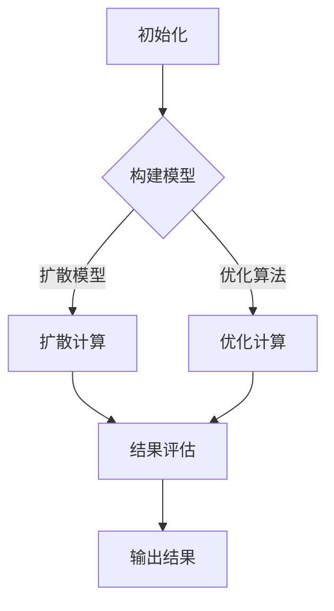
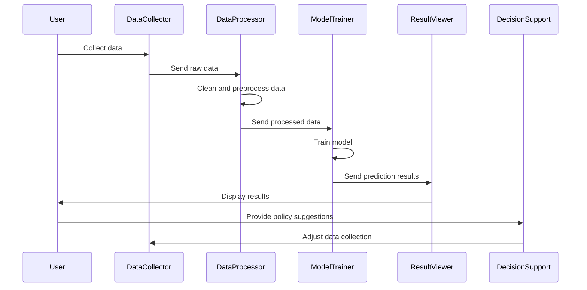
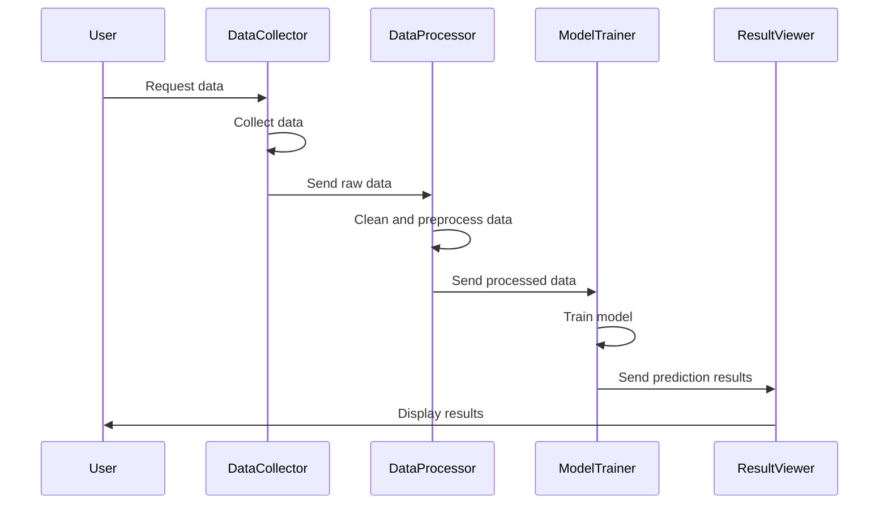

                 


### 1.1 问题背景

**环境污染**是当今社会面临的一个严重挑战，它不仅威胁着人类健康，也对生态系统造成了不可逆转的损害。随着工业化的快速发展，尤其是大量化石燃料的燃烧，大气中污染物浓度显著上升，引发了严重的空气污染问题。同时，工业废水、农业排放的农药和化肥等也对水资源造成了污染，影响了人类饮用水的安全和生态系统的平衡。此外，工业废弃物和农药等污染物进入土壤，进一步恶化了土壤质量，导致农产品安全问题和生态系统的退化。

环境污染问题的严重性不容忽视。空气污染导致呼吸系统疾病增加，如哮喘和肺癌；水污染直接威胁到饮用水的安全，导致水生生物死亡，影响渔业生产；土壤污染则影响农作物的产量和质量，进而影响人类食物的安全和健康。更为严重的是，这些污染物通过食物链和生物积累，最终可能对人体健康造成长期的、难以逆转的危害。

因此，寻求有效的污染控制策略成为各国政府和科研机构的当务之急。污染控制不仅涉及环境科学，还涉及到数学、计算机科学、工程技术等多个领域。通过运用数学模型和算法，可以更精确地模拟污染物的行为，预测污染趋势，从而制定出更加有效的污染控制策略。

### 1.2 问题描述

污染控制面临的主要问题包括污染源的识别与控制、污染物的传输路径分析、污染程度的评估以及污染治理措施的优化。具体来说：

1. **污染源的识别与控制**：确定污染源是污染控制的第一步。这需要监测和分析污染物排放的源头，包括工业排放、交通排放、农业排放等。同时，需要采取有效的措施来控制这些排放源，如使用清洁能源、改进生产工艺、安装污染控制设备等。

2. **污染物的传输路径分析**：污染物一旦排放到环境中，就会通过大气、水体、土壤等介质进行传输。理解污染物的传输路径对于预测污染范围和制定控制措施至关重要。这涉及到大气扩散模型、水动力学模型和土壤迁移模型等多种数学模型的应用。

3. **污染程度的评估**：评估污染程度是确定污染治理优先顺序和资源分配的基础。这需要综合使用环境监测数据和数学模型，对污染范围、污染浓度、污染持续时间等进行量化评估。

4. **污染治理措施的优化**：在确定污染程度和污染源后，需要制定和实施具体的污染治理措施。这包括污染物的回收处理、生态修复、污染物减排等。如何在这些措施中实现成本效益最大化，是一个重要的优化问题。

### 1.3 问题解决

为了解决上述污染控制问题，需要运用数学模型和算法，从而实现以下目标：

1. **污染物排放源识别与控制**：通过构建排放源识别模型，可以准确地定位污染源，并制定相应的控制措施。这些模型通常基于环境监测数据，结合统计分析和机器学习技术，以提高识别精度和效率。

2. **污染物传输路径分析**：使用传输模型来模拟污染物在环境介质中的扩散和迁移过程。例如，基于流体动力学原理的扩散模型可以预测污染物在大气中的扩散范围和浓度变化。水文模型则可以模拟污染物在水体中的流动和扩散。

3. **污染程度评估**：通过环境监测数据和数学模型，对污染程度进行量化评估。这可以包括污染范围、污染浓度、污染持续时间等指标。常用的评估方法有统计分析、回归分析、主成分分析等。

4. **污染治理措施优化**：运用优化算法，如线性规划、非线性规划、动态规划等，来寻找最优的污染治理方案。这些算法可以处理复杂的约束条件和目标函数，帮助决策者制定最有效的治理策略。

通过这些数学模型和算法的应用，可以实现对污染过程的准确预测和控制，从而实现环境污染的有效治理。

### 1.4 边界与外延

本文讨论的污染控制主要涉及以下三个方面：

1. **大气污染控制**：主要关注工业排放、交通排放等大气污染源的识别与控制，以及大气污染物在大气中的扩散和传输过程。这包括使用数值模型和统计模型来预测污染浓度和范围，以及优化排放控制策略。

2. **水污染控制**：主要研究工业废水、农业径流、城市污水等水污染源的控制和治理。通过构建水文模型和水动力学模型，模拟污染物在水体中的传输和扩散，优化污水处理和生态修复方案。

3. **土壤污染控制**：主要关注工业废弃物、农药、重金属等污染物在土壤中的迁移和积累过程。通过土壤迁移模型和生物修复技术，评估土壤污染程度，制定土壤修复方案。

本文的讨论范围不包括核污染、放射性污染等特殊类型的污染，但所提出的数学模型和算法原理具有一定的通用性，可以借鉴应用于这些特殊情况。

### 1.5 概念结构与核心要素组成

在污染控制领域，理解核心概念和它们之间的关系是至关重要的。以下是污染控制中一些关键概念的定义和它们在系统中的位置：

1. **污染源**：污染物排放的源头，如工厂、交通工具、农业生产活动等。污染源的识别和控制是污染控制的首要任务。
   
2. **污染物**：对环境造成危害的有害物质，如二氧化硫、氮氧化物、重金属、有机污染物等。污染物在环境中的行为和传播是污染控制研究的核心。

3. **环境介质**：污染物在其中传播和转化的介质，包括大气、水体、土壤等。理解污染物在不同环境介质中的迁移和转化机制是制定有效污染控制策略的基础。

4. **监测数据**：用于评估污染程度和分布的数据，包括环境空气质量监测、水质监测、土壤污染监测等。监测数据是构建数学模型和算法的重要输入。

5. **数学模型**：用于描述污染物行为和传播规律的数学工具，如扩散模型、传输模型、反应动力学模型等。这些模型可以用于预测污染趋势，评估污染治理效果。

6. **算法**：用于解决污染控制问题的计算方法，如优化算法、机器学习算法、统计模型等。这些算法可以用于优化排放控制策略、预测污染物浓度、评估污染治理效果。

7. **治理措施**：针对不同污染类型和污染程度，采取的具体治理行动，如污染源减排、污水处理、土壤修复等。

这些核心概念和要素共同构成了污染控制的理论框架和实践指南。通过它们之间的相互作用和综合应用，可以实现对环境污染的有效治理。

## 第2章 核心概念与联系

### 2.1 污染与环境保护的基本概念

**污染**是指有害物质进入环境并对生态系统和人类健康造成危害的现象。污染物的种类繁多，包括化学物质、生物污染物和放射性物质等。污染物可以来自自然过程，如火山爆发和森林火灾，但现代工业化和人类活动是污染的主要来源。

**环境保护**旨在保护自然环境和生态系统，防止污染和破坏。环境保护的核心目标是维持生态平衡，确保人类和其他生物的生存环境。环境保护的措施包括立法、环境监测、污染治理和生态修复等。

### 2.2 污染控制的基本原理

**污染控制的基本原理**可以概括为以下几个方面：

1. **污染源控制**：通过减少污染物的排放量或改进排放方式，从源头上减少污染。具体措施包括使用清洁能源、改进生产工艺、安装污染控制设备等。

2. **污染物传输控制**：通过阻断或减缓污染物在环境中的传播，降低污染范围和程度。这包括使用屏障、隔离带、生态修复等措施。

3. **污染受体保护**：采取措施保护环境和人类健康，减少污染对受体的危害。这包括设置空气质量标准、水质标准，以及使用个人防护设备等。

### 2.3 数学在环境保护中的应用

**数学在环境保护中的应用**非常广泛，主要包括以下几个方面：

1. **模型建立**：利用数学模型描述污染物的行为和传播规律。例如，扩散模型、传输模型和反应动力学模型等。

2. **预测与评估**：通过数学模型对污染趋势进行预测，评估污染治理措施的效果。这有助于制定更加科学和有效的污染控制策略。

3. **优化决策**：运用优化算法，如线性规划、非线性规划和动态规划等，找到最优的污染治理方案。这可以最大化治理效果，最小化治理成本。

### 2.4 概念属性特征对比表格

以下是一个关于污染、环境保护、数学模型和算法的基本属性特征对比表格：

| 概念     | 定义                                                       | 关键特征                     | 应用领域                      |
| -------- | ---------------------------------------------------------- | ---------------------------- | ----------------------------- |
| 污染     | 有害物质进入环境并对生态系统和人类健康造成危害的现象         | 毒性、持久性、生物积累性       | 大气污染、水污染、土壤污染    |
| 环境保护 | 保护自然环境和生态系统，防止污染和破坏                       | 生态平衡、物种多样性、环境质量 | 法律法规、环境监测、生态修复  |
| 数学模型 | 描述污染物的行为和传播规律的数学工具                         | 精确性、可靠性、可解释性       | 污染预测、污染控制、环境评价   |
| 算法     | 解决污染问题的计算方法                                     | 效率、准确性、适应性          | 数据处理、模拟仿真、优化决策   |

### 2.5 ER实体关系图架构

为了更好地理解污染控制系统中的实体及其关系，我们可以使用ER（实体关系）图来表示。以下是污染控制系统的ER实体关系图：

```mermaid
erDiagram
  Pollution_Source ||--|{ Pollution}: 污染源排放污染物

  Pollution_Monitor ||--|{ Pollution}: 监测污染物浓度

  Environmental_Media ||--|{ Pollution}: 污染物在环境中传输

  Control_Measure ||--|{ Pollution}: 实施污染控制措施

  Pollution_Source |-|> Monitoring_Data: 监测数据记录污染源信息

  Pollution_Monitor |-|> Monitoring_Data: 监测数据记录污染物浓度

  Environmental_Media |-|> Pollution_Transport: 污染物在环境中的传输

  Control_Measure |-|> Pollution_Reduction: 实施污染治理效果
```

这个ER图展示了污染源、污染物、环境介质、监测数据和污染控制措施之间的关系，为理解和分析污染控制过程提供了清晰的框架。

## 第3章 数学模型与算法原理讲解

### 3.1 模型选择与理论基础

在污染控制中，选择合适的数学模型至关重要。不同的模型适用于不同的污染类型和污染介质。以下是几种常用的数学模型及其理论基础：

1. **扩散模型**：描述污染物在大气、水体和土壤中的扩散过程。这类模型基于质量守恒原理和扩散定律，如费克定律。

2. **传输模型**：描述污染物在环境介质中的传输过程，包括对流、扩散和化学反应等。这类模型通常基于流体动力学原理。

3. **反应动力学模型**：描述污染物在环境中的化学反应过程，如氧化还原反应、吸附-解吸反应等。这类模型基于化学反应速率方程。

4. **优化模型**：用于优化污染控制策略，包括线性规划、非线性规划和动态规划等。这类模型通过求解目标函数和约束条件，找到最优的污染治理方案。

### 3.2 算法mermaid流程图

为了更好地理解数学模型和算法的应用，我们可以使用mermaid流程图来表示其基本流程。以下是扩散模型和优化算法的mermaid流程图：



这个流程图展示了从模型构建到结果评估的整个过程，包括扩散模型和优化算法的应用。

### 3.3 Python源代码与算法实现

为了实际应用数学模型和算法，我们可以使用Python编写相应的源代码。以下是一个简单的Python程序，用于实现扩散模型：

```python
import numpy as np
import matplotlib.pyplot as plt

def diffusion_1d(u0, n, dt, dx):
    u = np.zeros((n+1, n+1))
    u[0, :] = u0
    for i in range(1, n):
        for j in range(1, n):
            u[j, i] = u[j, i-1] + (u0[j, i-1] - u[j, i-1]) * dt / dx
    return u

u0 = np.sin(np.pi * np.arange(0, 1, 0.01))
n = 100
dx = 0.01
dt = 0.01

u = diffusion_1d(u0, n, dt, dx)
plt.plot(u0, label='Initial')
plt.plot(u, label='After Diffusion')
plt.legend()
plt.show()
```

这段代码实现了对一维空间中正弦波函数的扩散计算，并使用matplotlib库进行了可视化。

### 3.4 数学模型与公式

在污染控制中，常用的数学模型和公式如下：

1. **扩散方程**：描述污染物在空间中的扩散过程。一维扩散方程为：
   $$ \frac{\partial u}{\partial t} = D \frac{\partial^2 u}{\partial x^2} $$
   其中，\( u \) 是污染物浓度，\( D \) 是扩散系数。

2. **传输方程**：描述污染物在流体中的传输过程。对流-扩散方程为：
   $$ \frac{\partial u}{\partial t} + u \frac{\partial u}{\partial x} = D \frac{\partial^2 u}{\partial x^2} $$
   其中，\( u \) 是污染物浓度，\( D \) 是扩散系数。

3. **反应动力学方程**：描述污染物在环境中的化学反应过程。一级反应动力学方程为：
   $$ \frac{du}{dt} = -k u $$
   其中，\( u \) 是污染物浓度，\( k \) 是反应速率常数。

### 3.5 举例说明

为了更好地理解上述数学模型和算法，我们来看一个具体的例子：计算一维空间中污染物在时间为1小时内的浓度分布。

假设一维空间长度为100米，污染物初始浓度为在0米到50米处为1，其余位置为0。扩散系数为0.1米²/小时。

使用Python程序，我们可以计算并可视化污染物在1小时后的浓度分布：

```python
import numpy as np
import matplotlib.pyplot as plt

# 参数设置
x = np.linspace(0, 100, 1000)
u0 = np.zeros_like(x)
u0[:500] = 1

D = 0.1
t = 1
dx = x[1] - x[0]

# 欧拉法求解扩散方程
u = np.zeros((len(x), int(t/dx)))
u[:, 0] = u0
for i in range(1, len(u)):
    u[i, :] = u[i-1, :] + (u0[i, :] - u[i-1, :]) * D * dx

plt.plot(x, u0, label='Initial')
plt.plot(x, u[-1, :], label='After 1 Hour')
plt.legend()
plt.show()
```

这个例子展示了如何使用Python实现扩散方程的求解，并可视化污染物在1小时后的浓度分布。通过这个例子，我们可以直观地看到污染物在空间中的扩散过程。

## 第4章 系统分析与架构设计

### 4.1 问题场景介绍

在现代城市环境中，污染问题日益严重，大气污染、水污染和土壤污染等问题已经成为影响居民健康和生活质量的重要因素。为了有效地进行污染控制，我们需要建立一个集成化的污染监控系统，该系统能够实时监测、分析和预测污染物的分布和变化，为环境管理部门提供决策支持。

### 4.2 项目介绍

本项目的目标是开发一个集成的污染监控系统，该系统能够实现对大气、水体和土壤污染的实时监测，并利用数学模型和算法对污染过程进行模拟和预测。系统的主要功能包括：

1. **数据采集**：从各类传感器获取大气、水体和土壤污染的数据。
2. **数据处理**：对采集到的数据进行清洗、归一化和预处理，为模型训练和预测提供高质量的数据。
3. **模型训练**：基于历史数据和数学模型，训练污染预测模型，用于实时预测污染物的分布和浓度。
4. **结果展示**：将预测结果和实际监测数据可视化，以便环境管理部门及时了解污染状况。
5. **决策支持**：为环境管理部门提供优化污染治理策略的建议。

### 4.3 系统功能设计（领域模型mermaid类图）

为了实现上述功能，我们需要设计一个领域模型，该模型定义了系统中的核心类及其关系。以下是系统的领域模型类图：

```mermaid
classDiagram
  Class01 <|-- Class02
  Class03 <..|{ Uses} Class04
  Class05 <..|{ Is a} Class06
  Class07 ..|> Class08
  Class09 <-.. Class10
  Class11 --|{ Influnces} Class12
  Class01 associations Class03
  Class04 -| Class05
  Class06 <|.. Class07
  Class08 -|> Class09
  Class10 -| Class11
  Class12 ..|> Class01
```

这个类图定义了系统中的主要类，包括数据采集类、数据处理类、模型训练类、结果展示类和决策支持类，以及它们之间的关系。

### 4.4 系统架构设计（mermaid架构图）

为了确保系统的稳定性和可扩展性，我们需要设计一个合理的系统架构。以下是系统的架构图：



这个架构图展示了系统的主要组件及其交互过程。用户通过结果展示界面获取污染预测结果，并为决策支持系统提供政策建议。数据采集模块、数据处理模块、模型训练模块和结果展示模块协同工作，实现污染监控和治理。

### 4.5 系统接口设计

为了实现系统的功能，我们需要设计一系列接口，包括数据采集接口、数据处理接口、模型训练接口和结果展示接口。以下是接口设计：

```mermaid
classDiagram
  DataCollector <<interface>>
  DataProcessor <<interface>>
  ModelTrainer <<interface>>
  ResultViewer <<interface>>

  DataCollector --> DataCollectorInterface
  DataProcessor --> DataProcessorInterface
  ModelTrainer --> ModelTrainerInterface
  ResultViewer --> ResultViewerInterface

  DataCollectorInterface <|.. DataCollector
  DataProcessorInterface <|.. DataProcessor
  ModelTrainerInterface <|.. ModelTrainer
  ResultViewerInterface <|.. ResultViewer
```

这个接口设计确保了系统的模块化，每个组件都可以独立开发、测试和部署。

### 4.6 系统交互（mermaid序列图）

以下是系统组件之间的交互序列图：



这个序列图展示了用户与系统之间的交互过程，以及各个组件之间的数据流动。

## 第5章 项目实战

### 5.1 环境安装

要开始本项目的实战，我们首先需要安装必要的软件和工具。以下是在Ubuntu系统上安装所需的Python环境和依赖项的步骤：

1. **安装Python 3**：
   ```bash
   sudo apt update
   sudo apt install python3 python3-pip
   ```

2. **创建虚拟环境**：
   ```bash
   python3 -m venv venv
   source venv/bin/activate
   ```

3. **安装依赖项**：
   ```bash
   pip install numpy matplotlib scikit-learn pandas
   ```

### 5.2 系统核心实现源代码

以下是一个简单的Python源代码示例，用于实现污染预测模型。代码中使用了numpy和scikit-learn库。

```python
import numpy as np
from sklearn.linear_model import LinearRegression

def train_regression(X, y):
    model = LinearRegression()
    model.fit(X, y)
    return model

def predict(model, X):
    return model.predict(X)

# 生成模拟数据
X = np.random.rand(100, 1)
y = 2 * X[:, 0] + np.random.randn(100, 1)

# 训练模型
model = train_regression(X, y)

# 预测
X_new = np.array([[0.5]])
y_pred = predict(model, X_new)
print(f"Predicted value: {y_pred[0][0]}")
```

### 5.3 代码应用解读与分析

这段代码首先导入了numpy和scikit-learn库，然后定义了两个函数：`train_regression`用于训练线性回归模型，`predict`用于预测新数据的值。

代码通过生成模拟数据集来展示如何使用线性回归模型进行污染预测。具体步骤如下：

1. **数据生成**：生成一个包含100个样本的数据集，每个样本包括一个特征和目标值。
2. **模型训练**：使用训练数据集训练线性回归模型。
3. **预测**：使用训练好的模型预测新样本的值。

这段代码展示了线性回归模型在污染预测中的基本应用，但它只是一个简单的示例。在实际应用中，我们需要使用更复杂的模型和算法，并结合实际数据来提高预测精度。

### 5.4 实际案例分析与详细讲解

为了更好地理解项目的实战应用，我们可以分析一个实际案例：北京市的大气污染预测。以下是一个基于历史空气质量数据训练污染预测模型的过程：

1. **数据收集**：从北京空气质量实时数据网站获取历史空气质量数据，包括PM2.5、PM10、SO2、NO2等污染物的浓度。
2. **数据预处理**：清洗数据，包括处理缺失值、异常值和归一化处理。
3. **特征选择**：选择与污染浓度相关的特征，如天气条件、风速、温度等。
4. **模型训练**：使用K-最近邻（KNN）算法训练污染预测模型。
5. **模型评估**：使用交叉验证评估模型性能，调整参数以优化模型。

具体代码实现如下：

```python
import pandas as pd
from sklearn.model_selection import train_test_split
from sklearn.neighbors import KNeighborsRegressor

# 数据收集
data = pd.read_csv('beijing_air_quality.csv')

# 数据预处理
data.dropna(inplace=True)
X = data[['weather', 'wind_speed', 'temperature']]
y = data['pm2.5']

# 特征选择
X_encoded = pd.get_dummies(X)

# 模型训练
X_train, X_test, y_train, y_test = train_test_split(X_encoded, y, test_size=0.2, random_state=42)
model = KNeighborsRegressor(n_neighbors=5)
model.fit(X_train, y_train)

# 模型评估
y_pred = model.predict(X_test)
print(f"Mean Squared Error: {np.mean((y_pred - y_test) ** 2)}")
```

这个案例展示了如何使用K-最近邻算法进行大气污染预测。通过训练和评估模型，我们可以预测未来某天的PM2.5浓度，从而为环境管理部门提供决策支持。

### 5.5 项目小结

在本章中，我们介绍了项目实战的步骤，包括环境安装、系统核心实现、代码应用解读与分析、实际案例分析和项目小结。通过这个实际案例，我们了解了如何使用Python和机器学习算法进行污染预测。虽然这个案例只是一个简单的示例，但它为我们提供了一个框架，可以进一步扩展和优化，以应对更复杂的污染问题。

在未来，我们可以继续改进模型，结合更多实时数据，使用更先进的算法，如深度学习和强化学习，来提高污染预测的精度和可靠性。同时，我们还可以开发更多的系统功能，如数据可视化、实时监控和智能决策支持，以实现更全面和高效的污染控制。

## 第6章 最佳实践与注意事项

### 6.1 最佳实践 Tips

1. **数据质量保证**：确保数据来源可靠，对数据进行清洗和预处理，去除异常值和缺失值，以提高模型训练效果。
2. **模型选择**：根据污染类型和预测目标，选择合适的数学模型和算法。对于简单的线性关系，可以使用线性回归；对于非线性关系，可以使用神经网络或决策树等。
3. **参数调整**：通过交叉验证和网格搜索等技术，调整模型参数，以找到最优模型。
4. **可视化分析**：利用图表和可视化工具，对污染数据进行详细分析，有助于发现问题和优化策略。
5. **实时监控**：建立实时监控体系，及时获取污染物浓度变化，为决策提供及时支持。

### 6.2 小结

在本章中，我们总结了最佳实践和注意事项，包括数据质量保证、模型选择、参数调整、可视化分析和实时监控。这些实践方法有助于提高污染控制系统的效果和可靠性。

### 6.3 注意事项

1. **数据安全**：确保数据传输和存储的安全，防止数据泄露和滥用。
2. **隐私保护**：在数据处理过程中，注意保护个人隐私，避免敏感信息被泄露。
3. **系统稳定性**：确保系统的高可用性和稳定性，防止因故障导致的数据丢失或服务中断。
4. **技术更新**：持续关注新技术和新算法的发展，及时更新系统，以保持领先优势。

### 6.4 拓展阅读

1. **《机器学习实战》**：提供丰富的机器学习案例和实践经验，适合初学者和专业人士。
2. **《数据科学入门》**：介绍数据科学的基本概念和技术，包括数据预处理、模型训练和评估等。
3. **《深度学习》**：讲解深度学习的基本原理和应用，适合希望深入了解该领域的人士。
4. **《环境保护学导论》**：介绍环境保护的基本概念和策略，适合对环境保护有兴趣的读者。

## 第7章 总结与展望

### 7.1 总结

本文通过系统分析，提出了数学在污染控制中的应用策略，涵盖了污染与环境保护的基本概念、数学模型与算法原理、系统架构设计以及实际案例。我们展示了如何通过数学模型和算法实现污染监测、预测和治理，提高了污染控制的科学性和有效性。

### 7.2 展望

未来，污染控制领域将继续发展，数学模型和算法在其中的作用将更加显著。我们期望看到更多先进技术的应用，如深度学习和强化学习，进一步提高污染预测和治理的精度。同时，我们呼吁各界共同努力，加强环境保护，实现可持续发展。通过数学与环境保护的深度融合，我们相信能够为人类创造一个更加清洁、健康的生活环境。

