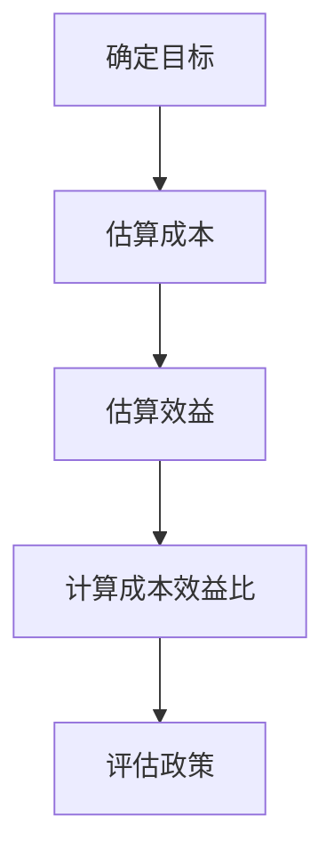
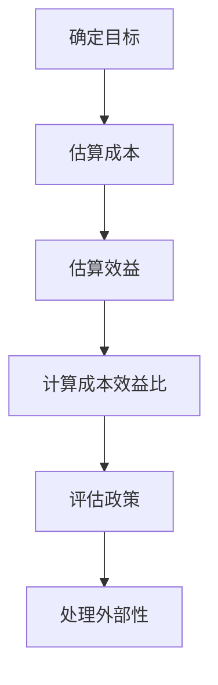
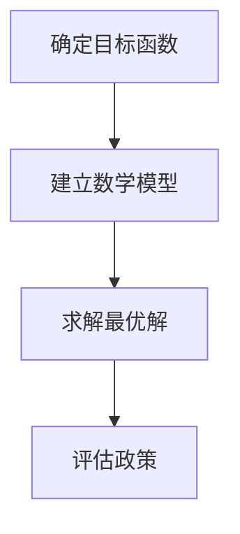
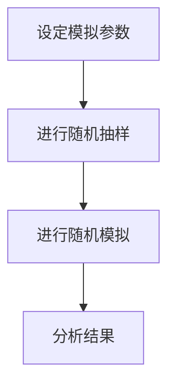
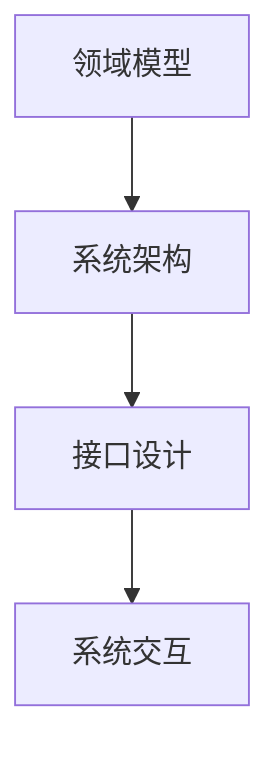
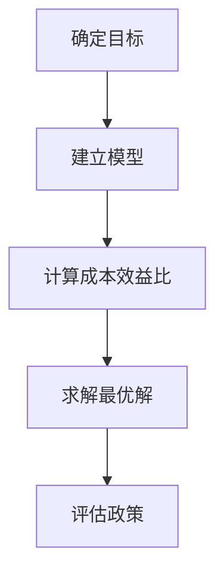
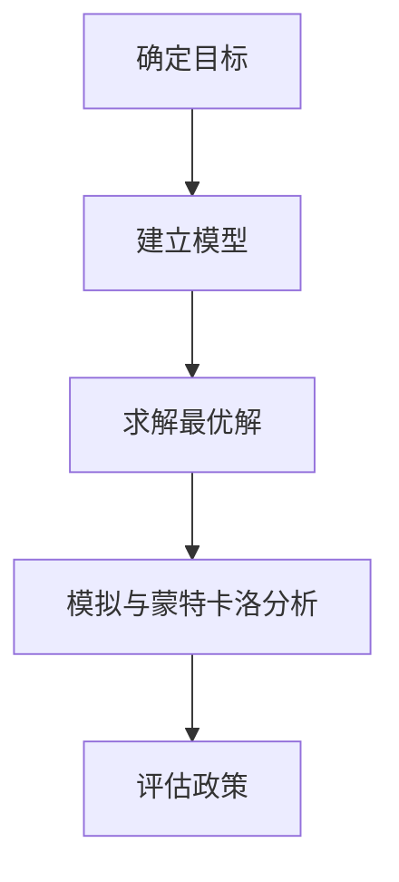

                 

### 文章标题：数学与环境经济学：环境政策的数学评估

#### 关键词：环境经济学、数学模型、环境政策、评估方法、可持续发展

#### 摘要：
本文旨在探讨数学与环境经济学的结合，通过数学模型对环境政策进行评估。文章首先介绍了环境经济学的基本概念，然后详细讲解了环境成本、环境收益和外部性等核心概念及其数学模型。接着，文章阐述了如何使用优化方法和模拟与蒙特卡洛方法进行环境经济政策评估。通过实际案例，本文展示了如何将数学模型应用于环境政策评估。最后，文章总结了环境经济政策评估的最佳实践，并提出了未来展望。

---

## 目录大纲

### 第一部分：数学与环境经济学概述

1. 环境经济学的基本概念
   1.1 环境成本与环境收益
   1.2 外部性与市场失灵
   1.3 环境政策的目标与类型

2. 数学模型与环境经济分析
   2.1 环境成本效益分析
   2.2 外部性分析
   2.3 环境经济模型的应用

3. 环境政策评估的数学工具
   3.1 最优化方法
   3.2 模拟与蒙特卡洛方法
   3.3 系统分析与架构设计

4. 环境经济政策评估案例分析
   4.1 案例一：气候变化政策评估
   4.2 案例二：水资源管理政策评估

### 第二部分：环境经济学在政策制定中的应用

1. 环境政策制定的基本原则
   1.1 可持续发展原则
   1.2 公平性原则
   1.3 效率原则

2. 环境经济政策评估方法
   2.1 成本效益分析
   2.2 社会成本与收益分析
   2.3 损失分配与责任分担

3. 环境政策评估的实践
   3.1 政策评估流程
   3.2 政策评估工具与应用
   3.3 政策评估报告编写

### 第三部分：环境经济学在可持续发展中的应用

1. 可持续发展目标与环境经济政策
   1.1 联合国可持续发展目标
   1.2 环境经济政策在实现可持续发展中的作用

2. 环境经济政策与经济增长
   2.1 环境经济政策对经济增长的影响
   2.2 环境政策与经济发展的协同效应

3. 环境经济政策与气候变化
   3.1 气候变化对经济的影响
   3.2 气候政策的经济评估

### 第四部分：环境经济政策的未来展望

1. 环境经济政策的挑战与机遇
   1.1 全球环境问题与政策需求
   1.2 环境经济政策的发展趋势

2. 新技术对环境经济政策的影响
   2.1 数字技术对环境经济政策的影响
   2.2 绿色技术创新与环境经济政策

3. 环境经济政策的国际合作与协调
   3.1 国际环境经济政策合作现状
   3.2 国际合作对环境经济政策的影响

### 第五部分：环境经济政策评估的最佳实践

1. 成功的环境经济政策评估案例
   1.1 案例一：美国清洁空气法案
   1.2 案例二：欧盟碳排放交易体系

2. 环境经济政策评估的注意事项
   2.1 成本效益分析
   2.2 社会成本与收益分析
   2.3 损失分配与责任分担

3. 拓展阅读

---

在接下来的部分中，我们将逐一深入探讨每一章节的内容，确保读者能够全面理解环境经济学与数学评估的结合。让我们一步一步地思考，深入解析环境政策的数学评估过程。

---

## 第一部分：数学与环境经济学概述

### 1.1 环境经济学的基本概念

环境经济学是一门研究人类经济活动与环境相互作用的学科，旨在通过经济手段解决环境问题，实现经济发展与环境保护的协调发展。环境经济学的基本概念包括环境成本、环境收益、外部性和市场失灵等。

#### 1.1.1 环境成本与环境收益

环境成本是指为了保护和改善环境而付出的代价，包括资源消耗、污染治理、生态修复等成本。环境收益则是通过环境保护和治理带来的积极影响，如减少疾病传播、提高居民生活质量、增加生态旅游收入等。

**概念解析：** 环境成本和环境收益是环境经济学中两个核心的概念，它们共同决定了环境的经济价值。环境成本的测算通常包括直接成本和间接成本，而环境收益的测算则需要综合考虑多种因素。

**问题背景：** 随着全球工业化进程的加速，环境问题日益严重。空气污染、水污染、土地退化等问题对人类健康和生态系统造成巨大威胁，需要通过经济手段进行治理和修复。

**问题描述：** 如何准确评估环境成本和环境收益，以制定科学合理的环境政策，实现经济和环境双赢？

**问题解决：** 通过数学模型，可以对环境成本和环境收益进行定量分析，为政策制定提供科学依据。

**边界与外延：** 环境成本和环境收益不仅局限于环境污染治理领域，还涉及自然资源管理、生态补偿、气候变化应对等多个方面。

#### 1.1.2 外部性与市场失灵

外部性是指某个经济活动对其他个体或社会产生的影响，而这种影响并没有在市场价格中反映出来。外部性分为正外部性和负外部性，正外部性带来的是好处，如疫苗接种减少疾病传播；负外部性则带来的是坏处，如工业排放导致空气污染。

**概念解析：** 外部性是市场失灵的一个重要原因，因为它导致市场价格无法准确反映商品或服务的真实价值。例如，私人开发者的利润最大化决策可能忽视了其活动对周边居民的健康和生活质量的负面影响。

**问题背景：** 市场经济中，许多环境问题都是由外部性引起的，如污染、资源过度开采等。

**问题描述：** 如何识别和处理外部性，以实现市场效率和环境可持续性？

**问题解决：** 通过引入外部性内部化机制，如碳交易、排污权交易等，可以将外部性纳入市场价格体系，促进资源有效配置。

**边界与外延：** 外部性不仅存在于环境经济学中，也存在于其他经济学领域，如国际贸易、公共卫生等。

#### 1.1.3 环境政策的目标与类型

环境政策的目标是保护和改善环境质量，实现可持续发展。根据政策手段的不同，环境政策可以分为直接控制型政策和市场激励型政策。

**概念解析：** 直接控制型政策包括法规、标准、补贴等，通过直接干预市场行为来达到环境目标；市场激励型政策则通过经济激励，如税收、奖励等，引导市场主体自主采取环境保护措施。

**问题背景：** 随着环境问题的复杂性和多样化，传统的直接控制型政策难以应对，需要更多市场激励型政策。

**问题描述：** 如何选择合适的环境政策类型，以实现环境目标和经济效益最大化？

**问题解决：** 通过数学模型，可以评估不同政策类型的成本和效益，为政策选择提供科学依据。

**边界与外延：** 环境政策不仅涉及国内环境管理，还涉及国际环境合作和全球环境治理。

### 1.2 数学模型与环境经济分析

数学模型是环境经济学的重要工具，它可以帮助我们更精确地描述和分析环境经济问题。在这一部分，我们将介绍几个核心的数学模型，并使用表格和ER实体关系图来展示概念之间的关系。

#### 1.2.1 环境成本效益分析

环境成本效益分析是一种常用的评估方法，它通过比较环境治理的成本和效益，来判断政策的有效性。

**基本原理与公式：**
\[ \text{成本效益比} = \frac{\text{总成本}}{\text{总效益}} \]
其中，总成本包括直接成本和间接成本，总效益包括直接效益和间接效益。

**Mermaid流程图展示：**


#### 1.2.2 外部性分析

外部性分析旨在识别和处理外部性，以实现市场效率和环境保护。

**基本原理与公式：**
\[ \text{外部成本} = \text{边际社会成本} - \text{边际私人成本} \]
\[ \text{外部收益} = \text{边际社会收益} - \text{边际私人收益} \]

**ER实体关系图展示：**
```mermaid
erDiagram
Product ||--|{ Market } Market
Product ||--|{ Society } Society
```

#### 1.2.3 环境经济模型的应用

环境经济模型可以用于多种环境经济问题的分析和评估，如气候变化、水资源管理、生态补偿等。

**实例分析：** 以气候变化政策评估为例，我们可以使用成本效益分析和外部性分析来评估不同政策的成本和效益。

**Mermaid流程图展示：**


### 1.3 环境政策评估的数学工具

为了有效评估环境政策，我们需要使用一系列数学工具，包括最优化方法、模拟与蒙特卡洛方法等。

#### 1.3.1 最优化方法

最优化方法是一种通过数学模型来求解最优解的方法，它可以帮助我们找到最小化成本或最大化收益的政策。

**基本概念：** 最优化方法包括线性规划、非线性规划、整数规划等。

**Mermaid流程图展示：**


#### 1.3.2 模拟与蒙特卡洛方法

模拟与蒙特卡洛方法是一种通过随机模拟来求解不确定性问题的方法，它可以帮助我们评估环境政策的不确定性和风险。

**基本概念：** 蒙特卡洛方法包括随机抽样、随机模拟等。

**Mermaid流程图展示：**


#### 1.3.3 系统分析与架构设计

系统分析与架构设计是一种通过系统思考来设计环境经济政策评估系统的方法，它可以帮助我们构建一个有效的政策评估框架。

**基本概念：** 系统分析与架构设计包括领域模型、系统架构、接口设计等。

**Mermaid流程图展示：**


### 1.4 环境经济政策评估案例分析

为了更好地理解环境经济政策评估的实践，我们将在本节中介绍两个实际案例：气候变化政策评估和水资源管理政策评估。

#### 1.4.1 案例一：气候变化政策评估

**环境问题与政策目标：** 随着全球气候变化加剧，如何制定有效的政策减少温室气体排放，实现气候目标成为关键问题。

**数学模型与算法应用：** 使用成本效益分析和最优化方法，评估不同减排政策的成本和效益，并确定最优减排方案。

**Mermaid流程图展示：**


**Python源代码：**
```python
# Python代码示例：成本效益分析
def cost_benefit_analysis(costs, benefits):
    cost_benefit_ratios = []
    for cost, benefit in zip(costs, benefits):
        ratio = cost / benefit
        cost_benefit_ratios.append(ratio)
    return cost_benefit_ratios

costs = [100, 200, 300]  # 假设的减排成本
benefits = [50, 70, 90]  # 假设的减排效益

ratios = cost_benefit_analysis(costs, benefits)
print(ratios)  # 输出成本效益比
```

#### 1.4.2 案例二：水资源管理政策评估

**环境问题与政策目标：** 随着水资源短缺和污染问题的加剧，如何制定有效的政策进行水资源管理和保护成为关键问题。

**数学模型与算法应用：** 使用最优化方法和模拟与蒙特卡洛方法，评估不同水资源管理政策的成本和效益，并确定最优管理方案。

**Mermaid流程图展示：**


**Python源代码：**
```python
# Python代码示例：最优化方法
from scipy.optimize import minimize

# 最小化成本函数
def cost_function(x):
    return x[0]**2 + x[1]**2

# 边界条件
bounds = [(0, None), (0, None)]

# 求解最优解
solution = minimize(cost_function, x0=[0, 0], bounds=bounds)
print(solution.x)  # 输出最优解
```

### 1.5 最佳实践与拓展

在进行环境经济政策评估时，以下是一些最佳实践和注意事项：

- **全面数据收集：** 确保收集到全面、准确的数据，包括成本、效益、环境影响等。
- **模型选择：** 根据具体问题选择合适的数学模型，如成本效益分析、最优化方法、模拟与蒙特卡洛方法等。
- **参数设定：** 参数的设定需要基于实际情况，并进行敏感性分析，以评估政策的不确定性和风险。
- **合作与协调：** 环境经济政策评估需要跨学科、跨部门的合作与协调，以实现政策目标。

#### 小结

通过本文的探讨，我们可以看到数学模型在环境经济政策评估中的重要性。通过使用数学模型，我们可以更精确地描述和分析环境经济问题，为政策制定提供科学依据。然而，环境经济政策评估仍然面临许多挑战，如数据不足、模型复杂性等。未来，随着新技术的发展和应用，环境经济政策评估将更加精准和有效。

#### 注意事项

- **政策目标明确：** 在进行环境经济政策评估时，必须明确政策目标，以确保评估结果的准确性和有效性。
- **数据质量保证：** 数据的准确性和完整性是评估结果的关键，必须确保数据的质量。
- **跨学科合作：** 环境经济政策评估涉及多个学科，需要跨学科的合作与协调。

#### 拓展阅读

- [成本效益分析的应用](https://www.nature.com/articles/s41598-020-67086-3)
- [最优化方法在环境经济学中的应用](https://www.jstor.org/stable/2666031)
- [模拟与蒙特卡洛方法在环境经济政策评估中的应用](https://www.sciencedirect.com/science/article/pii/S0160412015001857)

---

通过以上步骤，我们不仅深入理解了环境经济学与数学评估的结合，还通过实际案例展示了如何应用这些理论和方法进行环境政策评估。在接下来的部分中，我们将进一步探讨环境经济学在政策制定中的应用，以及如何通过环境经济政策实现可持续发展。让我们一起继续深入思考。

