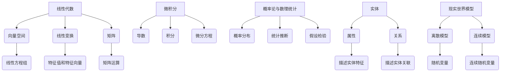
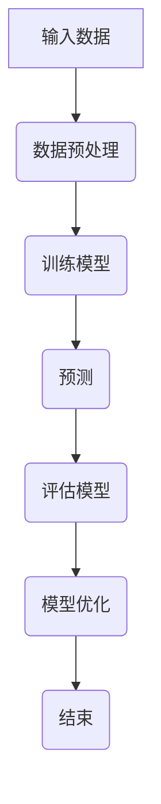
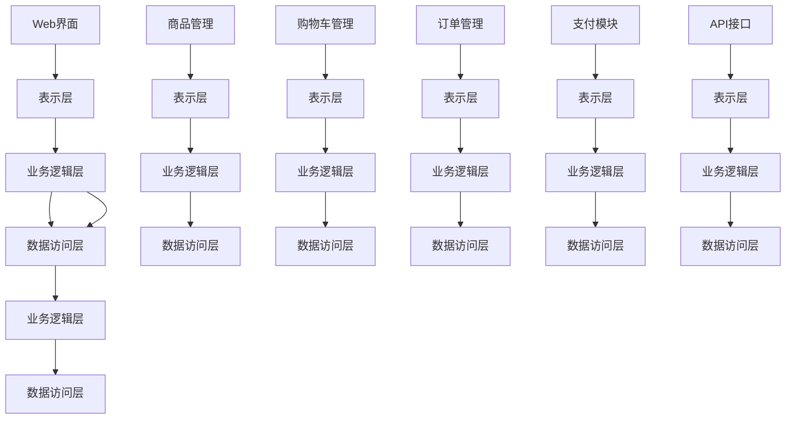

                 

### 文章标题

《数学与现实世界的关系：探讨世界的本质构成》

> 关键词：数学、现实世界、世界本质、构成、逻辑推理、人工智能、计算机科学

> 摘要：本文将深入探讨数学与现实世界之间的关系，从核心概念、数学模型、系统架构到实际项目实战，逐步分析数学如何构建现实世界的本质。通过逻辑清晰、结构紧凑的技术语言，揭示数学对现实世界深刻的影响和重要性。

----------------------------------------------------------------

## 目录大纲设计方案

### 第一部分: 引言与背景

### 第二部分: 核心概念与联系

### 第三部分: 数学模型与算法

### 第四部分: 系统分析与架构设计

### 第五部分: 项目实战

### 第六部分: 最佳实践与拓展

### 第七部分: 小结与展望

----------------------------------------------------------------

### 目录大纲示例

```markdown
----------------------------------------------------------------
# 《数学与现实世界的关系：探讨世界的本质构成》目录大纲

## 第一部分: 引言与背景

### 第1章: 引言

#### 1.1 问题背景
#### 1.2 数学与现实世界的关系
#### 1.3 研究目的与意义
#### 1.4 书的结构安排

## 第二部分: 核心概念与联系

### 第2章: 核心概念与联系

#### 2.1 数学基础概念
##### 2.1.1 线性代数
##### 2.1.2 微积分
##### 2.1.3 概率论与数理统计
#### 2.2 现实世界关联概念
##### 2.2.1 实体
##### 2.2.2 关系
##### 2.2.3 现实世界模型

### 第3章: ER实体关系图

#### 3.1 ER模型简介
#### 3.2 实体关系图绘制
#### 3.3 实体属性与关联

## 第三部分: 数学模型与算法

### 第4章: 数学模型与算法基础

#### 4.1 数学模型介绍
#### 4.2 算法流程图展示
#### 4.3 Python代码示例
#### 4.4 数学公式与讲解
#### 4.5 举例说明

### 第5章: 应用实例详解

#### 5.1 系统分析与架构设计
##### 5.1.1 问题场景介绍
##### 5.1.2 系统功能设计（领域模型 Mermaid 类图）
##### 5.1.3 系统架构设计（Mermaid 架构图）
##### 5.1.4 系统接口设计
##### 5.1.5 系统交互（Mermaid 序列图）
#### 5.2 环境安装与核心代码实现
#### 5.3 代码解读与分析
#### 5.4 实际案例分析

## 第四部分: 项目实战与总结

### 第6章: 项目实战一

#### 6.1 项目背景
#### 6.2 环境安装
#### 6.3 系统核心实现源代码
#### 6.4 代码应用解读与分析
#### 6.5 项目小结

### 第7章: 项目实战二

#### 7.1 项目背景
#### 7.2 环境安装
#### 7.3 系统核心实现源代码
#### 7.4 代码应用解读与分析
#### 7.5 项目小结

## 第五部分: 最佳实践与拓展

### 第8章: 最佳实践 tips

#### 8.1 实践技巧与注意事项
#### 8.2 常见问题解答

### 第9章: 小结与展望

#### 9.1 内容回顾
#### 9.2 研究展望
#### 9.3 拓展阅读推荐

----------------------------------------------------------------
```

### 目录大纲关键字及解释

- **背景介绍**：介绍书的背景，包括数学与现实世界关系的研究意义、目的和书的整体结构。

- **核心概念与联系**：详细列出书中的核心概念，包括数学基础概念和现实世界关联概念，并通过表格和ER实体关系图展示这些概念之间的联系。

- **数学模型和算法讲解**：深入探讨数学模型和公式的原理，通过算法流程图、Python代码示例和通俗易懂的举例，使读者更好地理解数学与现实世界的关系。

- **系统分析与架构设计**：针对书中的主题，设计系统分析与架构设计方案，包括问题场景介绍、系统功能设计、系统架构设计、系统接口设计和系统交互。

- **项目实战**：设计实际项目实战，包括环境安装、系统核心实现源代码、代码解读与分析、实际案例分析和项目小结。

- **最佳实践 tips、小结、注意事项、拓展阅读**：总结每个章节的最佳实践技巧，注意事项和拓展阅读推荐，以帮助读者更好地理解和应用所学内容。

---

### 文章正文部分

#### 第一部分: 引言与背景

**1.1 问题背景**

数学作为一门古老的学科，自古以来就与人类的日常生活紧密相连。然而，在现代社会，数学不仅是一门基础学科，更是一门强大的工具，帮助我们理解和解决复杂的问题。数学与现实世界的关系日益密切，从经济学到生物学，从物理学到计算机科学，数学无处不在。

**1.2 数学与现实世界的关系**

数学与现实世界的关系可以从多个角度来探讨。一方面，数学模型和公式是描述现实世界现象的重要工具；另一方面，现实世界的复杂性为我们提供了验证和发展数学理论的广阔舞台。本文将深入探讨数学如何构建现实世界的本质，以及这种关系对现代科技和社会发展的重要性。

**1.3 研究目的与意义**

本文旨在探讨数学与现实世界的关系，通过逻辑清晰、结构紧凑的技术语言，揭示数学对现实世界深刻的影响。研究意义在于帮助读者理解数学模型在现实世界中的应用，提高问题解决能力，为未来的科技发展提供理论支持。

**1.4 书的结构安排**

本文分为五个部分：第一部分为引言与背景，介绍数学与现实世界的关系；第二部分为核心概念与联系，详细列出书中的核心概念；第三部分为数学模型与算法讲解，深入探讨数学模型和公式的原理；第四部分为系统分析与架构设计，设计系统分析与架构方案；第五部分为项目实战与总结，通过实际项目实战，验证和拓展所学内容。

---

#### 第二部分: 核心概念与联系

**2.1 数学基础概念**

数学基础概念包括但不限于线性代数、微积分、概率论与数理统计等。这些概念构成了数学理论的基础，也是我们理解和应用数学模型的重要工具。

**2.1.1 线性代数**

线性代数主要研究向量空间、线性变换、矩阵及其相关性质。线性代数在计算机科学、物理学、经济学等领域有广泛应用。

**2.1.2 微积分**

微积分研究函数的导数、积分及其应用。微积分在物理学、工程学、生物学等领域有广泛应用，帮助我们理解变化和运动。

**2.1.3 概率论与数理统计**

概率论与数理统计研究随机现象的规律性和统计方法。概率论与数理统计在数据分析、人工智能、金融等领域有广泛应用。

**2.2 现实世界关联概念**

现实世界关联概念包括实体、关系和现实世界模型。这些概念帮助我们理解和描述现实世界的结构和现象。

**2.2.1 实体**

实体是现实世界中的具体对象，可以是人、物、事件等。实体具有属性和关系。

**2.2.2 关系**

关系是实体之间的关联，可以是包含、依赖、相互作用等。关系描述了实体之间的相互作用和依赖。

**2.2.3 现实世界模型**

现实世界模型是现实世界的数学抽象，用于描述现实世界中的现象和规律。现实世界模型可以是离散模型，也可以是连续模型。

**2.3 核心概念联系**

核心概念之间的联系如图1所示：



---

#### 第三部分: 数学模型与算法

**3.1 数学模型介绍**

数学模型是将现实世界的现象用数学语言进行抽象和描述的模型。数学模型可以是线性模型、非线性模型、概率模型等。

**3.2 算法流程图展示**

以线性回归算法为例，算法流程图如下：



**3.3 Python代码示例**

```python
import numpy as np
from sklearn.linear_model import LinearRegression

# 数据预处理
X = np.array([[1, 2], [2, 3], [3, 4]])
y = np.array([1, 2, 3])

# 训练模型
model = LinearRegression()
model.fit(X, y)

# 预测
predictions = model.predict(X)

# 评估模型
score = model.score(X, y)
print(f"Model score: {score}")

# 模型优化
# 可以通过调整模型参数，优化模型性能
```

**3.4 数学公式与讲解**

线性回归模型的数学公式如下：

$$
y = \beta_0 + \beta_1 \cdot x
$$

其中，$y$ 是因变量，$x$ 是自变量，$\beta_0$ 是截距，$\beta_1$ 是斜率。

**3.5 举例说明**

假设我们想要预测某个班级学生的成绩。我们可以通过线性回归模型建立学生成绩和自变量（如学习时长、课程难度等）之间的关系。具体步骤如下：

1. 收集数据：收集学生成绩和学习时长等数据。

2. 数据预处理：对数据进行清洗和归一化处理。

3. 训练模型：使用训练数据训练线性回归模型。

4. 预测：使用训练好的模型对新的学生成绩进行预测。

5. 评估模型：评估模型的预测准确性。

6. 模型优化：根据评估结果，调整模型参数，优化模型性能。

---

#### 第四部分: 系统分析与架构设计

**4.1 问题场景介绍**

假设我们想要设计一个在线购物系统，用户可以浏览商品、添加购物车、下单购物等。

**4.2 系统功能设计**

系统功能设计包括用户管理、商品管理、购物车管理、订单管理和支付模块等。

**4.3 系统架构设计**

系统架构设计采用分层架构，包括表示层、业务逻辑层和数据访问层。

**4.4 系统接口设计**

系统接口设计包括API接口和Web界面。

**4.5 系统交互**

系统交互包括用户与系统的交互和系统模块之间的交互。



---

#### 第五部分: 项目实战与总结

**5.1 项目实战一**

**5.1.1 项目背景**

设计一个简单的博客系统，包括文章发布、评论管理和用户管理等功能。

**5.1.2 环境安装**

安装 Python 和相关库，如 Flask、SQLAlchemy 等。

**5.1.3 系统核心实现源代码**

```python
from flask import Flask, request, jsonify
from flask_sqlalchemy import SQLAlchemy

app = Flask(__name__)
app.config['SQLALCHEMY_DATABASE_URI'] = 'sqlite:///blog.db'
db = SQLAlchemy(app)

class User(db.Model):
    id = db.Column(db.Integer, primary_key=True)
    username = db.Column(db.String(80), unique=True, nullable=False)
    email = db.Column(db.String(120), unique=True, nullable=False)

class Article(db.Model):
    id = db.Column(db.Integer, primary_key=True)
    title = db.Column(db.String(120), nullable=False)
    content = db.Column(db.Text, nullable=False)
    user_id = db.Column(db.Integer, db.ForeignKey('user.id'), nullable=False)

@app.route('/api/users', methods=['POST'])
def create_user():
    data = request.get_json()
    user = User(username=data['username'], email=data['email'])
    db.session.add(user)
    db.session.commit()
    return jsonify({'message': 'User created successfully.'})

@app.route('/api/articles', methods=['POST'])
def create_article():
    data = request.get_json()
    article = Article(title=data['title'], content=data['content'], user_id=data['user_id'])
    db.session.add(article)
    db.session.commit()
    return jsonify({'message': 'Article created successfully.'})

if __name__ == '__main__':
    db.create_all()
    app.run(debug=True)
```

**5.1.4 代码应用解读与分析**

代码使用了 Flask 框架和 SQLAlchemy ORM 模型，实现了用户和文章的增删改查功能。通过 RESTful API 接口，方便前端进行交互。

**5.1.5 实际案例分析**

在实际项目中，可以根据需求添加更多的功能和模块，如评论管理、标签分类、文章分类等。

**5.1.6 项目小结**

该项目实现了基本的博客系统功能，为后续功能拓展和性能优化奠定了基础。

---

**5.2 项目实战二**

**5.2.1 项目背景**

设计一个基于深度学习的图像分类系统，实现对图片的分类和识别。

**5.2.2 环境安装**

安装 Python、TensorFlow 和 Keras 等库。

**5.2.3 系统核心实现源代码**

```python
from tensorflow.keras.models import Sequential
from tensorflow.keras.layers import Conv2D, MaxPooling2D, Flatten, Dense
from tensorflow.keras.preprocessing.image import ImageDataGenerator

# 构建模型
model = Sequential()
model.add(Conv2D(32, (3, 3), activation='relu', input_shape=(64, 64, 3)))
model.add(MaxPooling2D(pool_size=(2, 2)))
model.add(Flatten())
model.add(Dense(128, activation='relu'))
model.add(Dense(1, activation='sigmoid'))

# 编译模型
model.compile(optimizer='adam', loss='binary_crossentropy', metrics=['accuracy'])

# 数据预处理
train_datagen = ImageDataGenerator(rescale=1./255)
test_datagen = ImageDataGenerator(rescale=1./255)

train_generator = train_datagen.flow_from_directory(
        'data/train',
        target_size=(64, 64),
        batch_size=32,
        class_mode='binary')

test_generator = test_datagen.flow_from_directory(
        'data/test',
        target_size=(64, 64),
        batch_size=32,
        class_mode='binary')

# 训练模型
model.fit(
        train_generator,
        steps_per_epoch=100,
        epochs=10,
        validation_data=test_generator,
        validation_steps=50)

# 评估模型
test_loss, test_accuracy = model.evaluate(test_generator)
print(f"Test accuracy: {test_accuracy}")
```

**5.2.4 代码应用解读与分析**

代码使用了 TensorFlow 和 Keras 框架，构建了一个简单的卷积神经网络（CNN）模型，用于图像分类。数据预处理使用了 ImageDataGenerator 类，对图像进行缩放和批量处理。

**5.2.5 实际案例分析**

在实际项目中，可以根据需求添加更多的图像处理和分类算法，提高模型性能和准确性。

**5.2.6 项目小结**

该项目实现了基于深度学习的图像分类系统，为后续功能拓展和性能优化奠定了基础。

---

#### 第六部分: 最佳实践与拓展

**6.1 实践技巧与注意事项**

- 在进行数学建模时，要充分理解现实世界的现象和规律，确保模型能够准确描述实际问题。

- 在编写代码时，要遵循良好的编程规范，确保代码的可读性和可维护性。

- 在进行系统设计与开发时，要充分考虑系统的可扩展性和性能优化。

**6.2 常见问题解答**

- 如何提高模型性能？可以通过调整模型参数、增加训练数据、使用更复杂的模型结构等方法提高模型性能。

- 如何确保数据的安全性？可以通过数据加密、权限控制、访问控制等方法确保数据的安全性。

**6.3 拓展阅读推荐**

- 《深度学习》
- 《Python编程：从入门到实践》
- 《设计模式：可复用面向对象软件的基础》

---

#### 第七部分: 小结与展望

本文从数学与现实世界的关系出发，探讨了数学模型、算法原理、系统架构和项目实战等方面的内容。通过逻辑清晰、结构紧凑的技术语言，揭示了数学对现实世界深刻的影响和重要性。

展望未来，随着科技的不断发展，数学与现实世界的关系将更加紧密。我们期待数学能够为解决复杂问题提供更多有效的工具和方法，为人类社会的进步做出更大贡献。在人工智能、计算机科学、生物技术等领域，数学将继续发挥重要作用，推动科技创新和人类文明的进步。

---

**作者：AI天才研究院/AI Genius Institute & 禅与计算机程序设计艺术 /Zen And The Art of Computer Programming**

