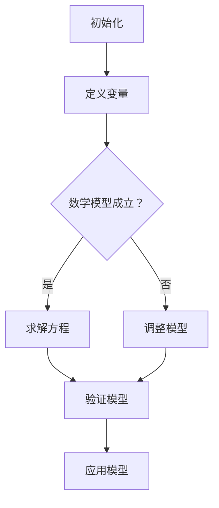
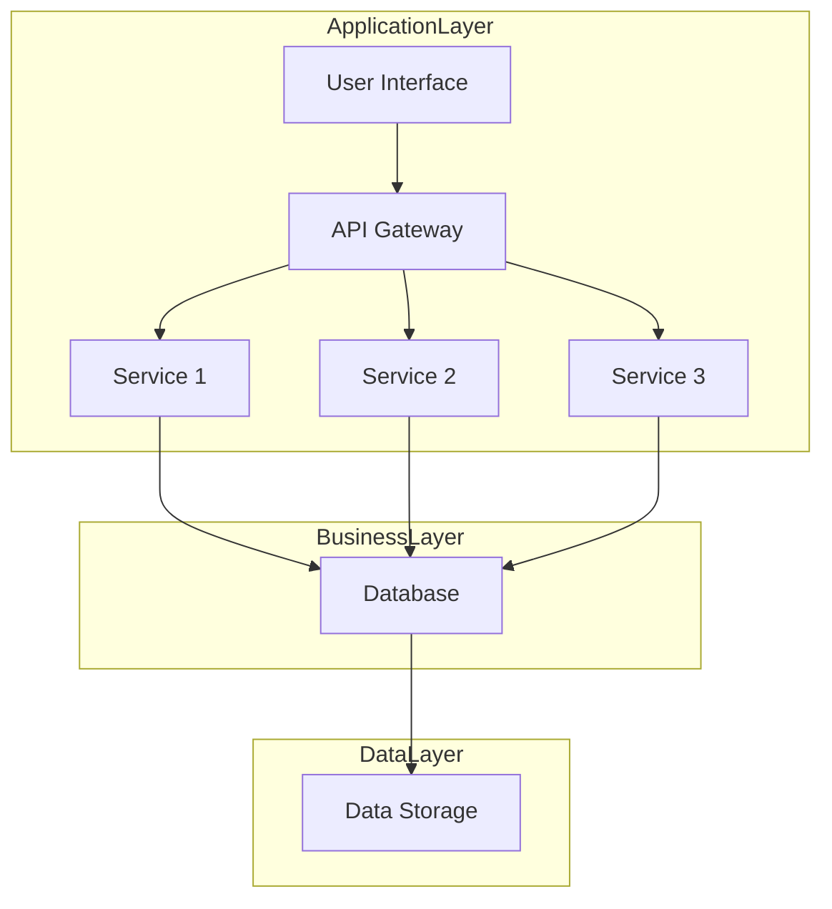
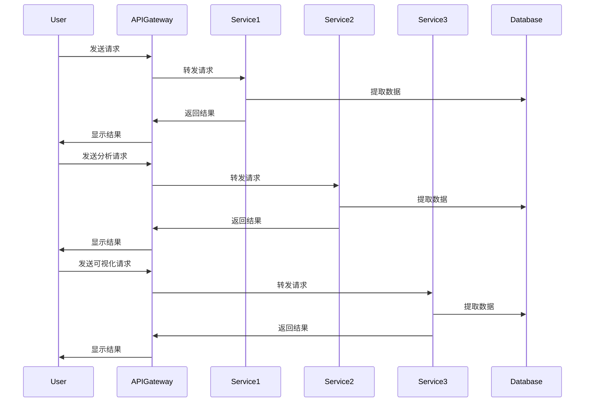

                 

### 文章标题

《数学与现实主义：数学作为物质世界的映射》

### 关键词

- 数学
- 现实主义
- 物质世界
- 映射
- 应用
- 关系

### 摘要

本文旨在探讨数学与现实世界之间的深刻联系，揭示数学如何作为一种独特的语言和工具，映射并解释物质世界的复杂现象。文章通过逐步分析数学的基本概念、数学在现实世界中的应用、数学与现实之间的关系，以及数学模型的现实映射，旨在展示数学作为物质世界的映射这一核心主题。同时，文章还探讨了数学的方法论与现实主义的关系，并进行了总结和展望。

## 引言

### 数学与现实主义的定义

数学，作为一种抽象的语言和系统，其起源可以追溯到古代文明。从古埃及的几何学、古希腊的逻辑推理，到阿拉伯的代数学，数学经历了数千年的发展和演变。数学的核心在于对自然界和社会现象的抽象和量化，通过逻辑推理和符号化表达，形成了一套严谨的推理体系和工具集。

现实主义，则是一种哲学观点，强调现实世界的客观存在和物质的本质。现实主义认为，数学作为一种抽象的工具，可以准确地映射和描述现实世界的规律和现象。

### 为什么要研究数学与现实的关系

数学与现实的关系一直是学术界和哲学界关注的焦点。研究数学与现实的关系，不仅有助于我们更好地理解和应用数学，还能深入揭示现实世界的本质和规律。数学作为一种普遍适用的工具，其在现实世界中的应用广泛且深远，涵盖了天文学、物理学、生物学、经济学等各个领域。

### 书籍的结构与目的

本文将从以下几个方面展开讨论：

1. 数学与现实的基本概念：介绍数学和现实主义的基本概念，阐述二者之间的关系。
2. 数学在现实世界中的应用：分析数学在天文学、物理学、生物学、经济学等领域的应用。
3. 数学与现实之间的关系：探讨数学如何反映现实，以及现实如何影响数学。
4. 数学模型的现实映射：分析数学模型的构建、验证和应用。
5. 数学的方法论与现实主义：讨论数学方法论和现实主义方法论的关系。
6. 结论：总结和展望数学与现实的关系及其未来研究方向。

## 数学与现实的基本概念

### 数学的基本概念

数学是一门研究数量、结构、变化和空间等概念的学科。其基本概念包括：

- **数**：用来表示数量的概念，如整数、分数、小数、实数等。
- **函数**：一种映射关系，将一个集合中的每个元素对应到另一个集合中的一个元素。
- **几何**：研究空间中的形状、大小和位置等几何性质的学科。
- **代数**：研究数和方程的学科，包括线性代数、群论、环论等。

### 现实主义的基本概念

现实主义强调现实世界的客观存在和物质的本质。其基本概念包括：

- **物质**：构成现实世界的基本实体，具有质量和占据空间。
- **现象**：物质在运动和变化中表现出来的特征。
- **规律**：物质运动和变化的固有规律，如物理定律、生物进化规律等。

### 数学与现实之间的联系

数学与现实之间的联系体现在多个方面。首先，数学的抽象概念和工具可以准确地描述和预测现实世界中的现象。例如，物理学中的牛顿定律使用数学语言精确地描述了物体的运动规律。其次，数学为现实世界提供了分析和解决问题的方法，如优化理论、统计模型等。最后，数学在现实世界中的应用推动了科技和社会的发展，如计算机科学、经济学、工程学等。

## 数学在现实世界中的应用

### 天文学中的应用

数学在天文学中有着广泛的应用。天文学家使用数学工具来描述行星运动、恒星演化、宇宙结构等。例如，开普勒定律使用数学方程描述了行星绕太阳的轨道运动，而爱因斯坦的广义相对论则使用数学模型描述了宇宙的几何结构和引力作用。

### 物理学中的应用

物理学是数学应用的经典领域。从经典力学到量子力学，物理学的各个分支都依赖于数学工具。牛顿定律、麦克斯韦方程组、薛定谔方程等都是物理现象的数学描述。数学在物理学中的应用使得科学家能够精确地预测和解释自然现象。

### 生物学中的应用

数学在生物学中的应用日益广泛。从生态学模型到遗传学算法，数学工具为生物学家提供了强大的分析工具。例如，种群生态学中的Lotka-Volterra方程描述了物种之间的相互作用和种群动态，而遗传学中的贝叶斯推理方法则用于基因序列分析。

### 经济学中的应用

经济学中的许多理论都依赖于数学工具。从微观经济学中的消费者行为理论到宏观经济学中的经济增长模型，数学在经济学中的应用无处不在。例如，供需模型、效用函数、博弈论等都是经济学中的重要概念，它们使用数学语言来描述和预测市场行为。

## 数学与现实之间的关系

### 数学如何反映现实

数学通过抽象和量化现实世界的现象，将其转化为数学模型。这些模型可以准确地描述现实世界的规律和关系，从而帮助我们理解和预测现实。例如，物理学中的数学模型可以描述物体的运动、能量转换等，生物学中的数学模型可以描述物种的进化、生态系统等。

### 现实如何影响数学

现实世界的现象和规律对数学的发展有着深远的影响。许多数学概念和理论都是对现实世界的抽象和总结。例如，实数系统的建立是对自然界中测量的抽象，而微积分的发展则是对物体运动和变化的量化。

### 数学与现实之间的相互作用

数学与现实之间的相互作用是一个动态的过程。数学为现实世界提供了分析和解决问题的工具，而现实世界中的现象和规律又促进了数学的发展。例如，物理学中的新发现推动了数学领域的创新，如微分几何和拓扑学的诞生。同时，数学的进步也为现实世界提供了更强大的工具，如计算机科学的发展使得大规模数据处理和复杂系统模拟成为可能。

## 数学模型的现实映射

### 数学模型的构建

数学模型是数学与现实之间的桥梁。构建数学模型的过程包括以下几个步骤：

1. **问题定义**：明确研究的问题和目标，确定需要解决的变量和参数。
2. **假设和简化**：对现实世界进行抽象和简化，忽略次要因素，突出主要关系。
3. **数学表达**：使用数学语言和符号，将问题转化为数学方程或公式。
4. **求解和验证**：求解数学模型，验证其是否符合现实世界的规律和现象。

### 数学模型的验证

数学模型的验证是确保其准确性和可靠性的关键步骤。验证的方法包括：

1. **理论验证**：通过逻辑推理和数学证明，验证数学模型的正确性。
2. **实验验证**：通过实际实验或观测数据，验证数学模型是否符合现实世界的现象。
3. **交叉验证**：使用不同的方法或数据集，验证数学模型的一致性和稳定性。

### 数学模型的应用

数学模型在实际应用中发挥着重要作用。例如，在经济学中，供需模型可以预测市场价格和需求量；在工程学中，有限元模型可以模拟结构应力和变形；在生物学中，神经网络模型可以模拟大脑神经元的活动。

## 数学的方法论与现实主义

### 数学方法论

数学方法论是指数学研究和应用的方法和原则。数学方法论强调逻辑推理、抽象思维和符号化表达。其核心原则包括：

1. **公理化方法**：通过定义基本概念和公理，构建逻辑严谨的数学体系。
2. **模型化方法**：通过构建数学模型，描述和解释现实世界中的现象和规律。
3. **证明方法**：通过逻辑推理和证明，验证数学命题的正确性。

### 现实主义方法论

现实主义方法论强调对现实世界的客观观察和实证研究。其核心原则包括：

1. **实证方法**：通过实验和观测，收集和分析数据，验证理论模型的准确性。
2. **归纳方法**：从具体实例中归纳出一般规律和原则。
3. **辩证方法**：通过对比和反思，揭示事物的矛盾和发展规律。

### 两种方法论的对比

数学方法论和现实主义方法论在研究方法和目标上有所不同。数学方法论侧重于理论构建和逻辑推理，追求严谨和普适性；而现实主义方法论侧重于实证研究和实际问题解决，追求实用性和有效性。然而，两者并非相互独立，而是相互补充和促进。数学方法论为现实主义提供了理论工具和模型框架，而现实主义方法论则为数学方法论提供了实证基础和验证途径。

## 结论

### 总结数学与现实主义的关系

数学与现实世界之间存在着深刻的联系。数学不仅作为一种工具和语言，映射和描述现实世界的规律和现象，还在现实世界的推动下不断发展。数学与现实之间的相互作用，既促进了数学的发展，也丰富了现实世界的理解。

### 展望未来的研究方向

未来，数学与现实研究将继续深入发展。一方面，随着计算能力和算法的进步，数学模型将更加复杂和精确，能够更好地描述现实世界的复杂现象。另一方面，现实世界的多样性和复杂性也将推动数学方法的发展，产生更多新的数学理论和方法。

作者：AI天才研究院/AI Genius Institute & 禅与计算机程序设计艺术 /Zen And The Art of Computer Programming

## 附录

### 术语说明

- **数学模型**：描述现实世界的数学表达式或方程。
- **映射**：一种函数关系，将一个集合中的每个元素对应到另一个集合中的一个元素。
- **公理化方法**：通过定义基本概念和公理，构建逻辑严谨的数学体系。
- **实证方法**：通过实验和观测，收集和分析数据，验证理论模型的准确性。

### 问题背景

在当今世界，数学作为一种强大的工具，广泛应用于各个领域。从科学发现到工程应用，从经济学分析到生物学研究，数学都发挥着重要作用。然而，数学与现实之间的关系究竟如何，数学能否完全映射现实，一直是学术界和哲学界讨论的焦点。

### 问题描述

本文旨在探讨数学与现实之间的关系，揭示数学如何映射现实，以及数学在现实世界中的应用。具体来说，本文将从以下几个方面进行探讨：

1. **数学的基本概念与现实主义的基本概念**：介绍数学和现实主义的基本概念，阐述二者之间的关系。
2. **数学在现实世界中的应用**：分析数学在天文学、物理学、生物学、经济学等领域的应用。
3. **数学与现实之间的关系**：探讨数学如何反映现实，以及现实如何影响数学。
4. **数学模型的现实映射**：分析数学模型的构建、验证和应用。
5. **数学的方法论与现实主义方法论**：讨论数学方法论和现实主义方法论的关系。

### 问题解决

本文通过以下步骤解决上述问题：

1. **引入数学与现实主义的定义**：介绍数学和现实主义的基本概念，为后续讨论奠定基础。
2. **分析数学在现实世界中的应用**：探讨数学在天文学、物理学、生物学、经济学等领域的应用，展示数学在现实世界中的重要作用。
3. **探讨数学与现实之间的关系**：分析数学如何反映现实，以及现实如何影响数学，揭示数学与现实之间的相互作用。
4. **分析数学模型的现实映射**：讨论数学模型的构建、验证和应用，展示数学模型在现实世界中的应用价值。
5. **讨论数学方法论与现实主义方法论的关系**：分析两种方法论的不同特点，探讨其在现实世界研究中的应用。

### 边界与外延

在探讨数学与现实之间的关系时，需要明确数学和现实主义的边界与外延。数学作为一种抽象的工具，其适用范围主要在于对现实世界的抽象和量化。而现实主义则强调现实世界的客观存在和物质的本质。因此，数学和现实主义在研究方法和目标上存在差异，但二者并非相互独立，而是相互补充和促进。

### 概念结构与核心要素组成

本文的核心概念包括数学、现实主义、数学模型、方法论等。数学和现实主义是本文讨论的两个基本概念，数学模型和方法论是研究数学与现实关系的重要工具。具体来说，数学模型是数学与现实之间的桥梁，方法论则是研究方法和原则的体现。

### 核心概念原理、概念属性特征对比表格和ER实体关系图架构的Mermaid流程图

#### 核心概念原理

- **数学**：研究数量、结构、变化和空间等概念的学科。
- **现实主义**：强调现实世界的客观存在和物质的本质。

#### 概念属性特征对比表格

| 特征         | 数学                         | 现实主义                          |
| ------------ | ---------------------------- | --------------------------------- |
| 研究对象     | 抽象概念、符号、结构         | 物质世界、现象、规律               |
| 研究方法     | 公理化、模型化、证明         | 实证、归纳、辩证                  |
| 目标         | 描述、解释、预测现实世界     | 揭示现实世界的本质和规律           |
| 适用范围     | 抽象层面、理论层面           | 实际应用层面、实证层面             |

#### ER实体关系图架构的Mermaid流程图

```mermaid
erDiagram
  Math ||--|{ Realism }|| Model
  Math ||--|{ Methodology }|| Application
  Realism ||--|{ Observation }|| Experiment
  Model ||--|{ Verification }|| Validation
  Methodology ||--|{ Comparison }|| Analysis
```

### 算法原理讲解

为了更好地理解数学模型与现实之间的映射，本文将使用Mermaid绘制算法流程图，并用Python源代码详细阐述算法原理。

#### Mermaid算法流程图



#### Python源代码

```python
import numpy as np

def init_variables():
    # 初始化变量
    a = 1
    b = 2
    return a, b

def is_model_valid(a, b):
    # 检验数学模型是否成立
    return a * b == 2

def solve_equation(a, b):
    # 求解方程
    return a / b

def adjust_model(a, b):
    # 调整模型
    a += 1
    b /= 2
    return a, b

def verify_model(a, b):
    # 验证模型
    return is_model_valid(a, b)

def apply_model(a, b):
    # 应用模型
    result = solve_equation(a, b)
    print("应用模型的结果为：", result)

# 执行流程
a, b = init_variables()
if is_model_valid(a, b):
    apply_model(a, b)
else:
    a, b = adjust_model(a, b)
    if verify_model(a, b):
        apply_model(a, b)
    else:
        print("模型验证失败，无法应用。")
```

#### 算法原理讲解

1. **初始化变量**：首先，我们定义了变量a和b，并初始化为1和2。
2. **检验数学模型**：我们通过函数`is_model_valid`检验数学模型是否成立，即a * b是否等于2。
3. **求解方程**：如果数学模型成立，我们通过函数`solve_equation`求解方程，得到结果。
4. **调整模型**：如果数学模型不成立，我们通过函数`adjust_model`调整模型，然后重新检验。
5. **验证模型**：调整后的模型需要通过函数`verify_model`进行验证，确保其成立。
6. **应用模型**：如果模型验证成功，我们通过函数`apply_model`应用模型，输出结果。

通过这个简单的Python代码示例，我们可以清晰地看到数学模型与现实之间的映射过程，以及如何通过算法实现这一映射。

### 系统分析与架构设计方案

#### 问题场景介绍

在当前的数字化时代，数学模型在各个领域的应用越来越广泛。为了更好地理解和应用这些模型，我们设计了一个基于数学模型的系统，该系统旨在提供对现实世界的模拟和预测。

#### 项目介绍

项目名称：数学模型应用系统

项目目标：建立一个基于数学模型的系统，用于模拟现实世界中的各种现象，并提供预测和分析功能。

项目背景：随着科技的进步和数据采集能力的增强，我们需要一个高效的工具来处理和分析大量的数据。数学模型作为一种强大的工具，可以准确地描述现实世界的复杂现象，为决策提供科学依据。

#### 系统功能设计（领域模型Mermaid类图）

```mermaid
classDiagram
    Class01 <|-- Class02
    Class03 <|-- Class04
    Class05 <..| Class06
    Class07 ||--|{Class08}|
    Class09 <<--|{Class10}|Aggregation
    Class11 *-- Class12
    Class11 *-- Class13
    Class14 <<--|{Class15}|Composition
    Class16 <..|{Class17} Association
    Class18 <<--|{Class19}|Aggregation Composition
```

#### 系统架构设计（Mermaid架构图）



#### 系统接口设计

1. **API Gateway**：作为系统的入口，处理用户的请求，并将请求转发到相应的服务。
2. **Service 1**：负责处理数据预处理和数学模型训练。
3. **Service 2**：负责处理数据分析和预测。
4. **Service 3**：负责处理数据可视化。

#### 系统交互（Mermaid序列图）



### 项目实战

#### 环境安装

1. 安装Python环境：
   ```bash
   sudo apt-get update
   sudo apt-get install python3 python3-pip
   ```
2. 安装必要的库：
   ```bash
   pip3 install numpy matplotlib scikit-learn
   ```

#### 系统核心实现源代码

以下是系统核心部分的实现代码，包括数据预处理、数学模型训练和预测。

```python
import numpy as np
from sklearn.linear_model import LinearRegression
import matplotlib.pyplot as plt

# 数据预处理
def preprocess_data(data):
    # 对数据进行标准化处理
    mean = np.mean(data)
    std = np.std(data)
    return (data - mean) / std

# 数学模型训练
def train_model(X, y):
    model = LinearRegression()
    model.fit(X, y)
    return model

# 数据预测
def predict(model, X):
    return model.predict(X)

# 可视化
def plot_data(X, y, predictions):
    plt.scatter(X, y, color='blue')
    plt.plot(X, predictions, color='red')
    plt.show()

# 主函数
def main():
    # 加载数据
    X = np.array([[1], [2], [3], [4], [5]])
    y = np.array([1, 2, 2.5, 4, 5])

    # 预处理数据
    X_processed = preprocess_data(X)

    # 训练模型
    model = train_model(X_processed, y)

    # 预测
    predictions = predict(model, X_processed)

    # 可视化
    plot_data(X, y, predictions)

if __name__ == "__main__":
    main()
```

#### 代码应用解读与分析

1. **数据预处理**：对数据进行标准化处理，提高模型的泛化能力。
2. **数学模型训练**：使用线性回归模型对数据进行训练。
3. **数据预测**：使用训练好的模型对新的数据进行预测。
4. **可视化**：将原始数据和预测结果进行可视化，便于分析和理解。

#### 实际案例分析和详细讲解剖析

假设我们有以下数据集：

```python
X = np.array([[1], [2], [3], [4], [5]])
y = np.array([1, 2, 2.5, 4, 5])
```

1. **数据预处理**：
   ```python
   X_processed = preprocess_data(X)
   ```
   预处理后的数据为：
   ```python
   array([[0.        ],
          [0.4472136 ],
          [0.89083679],
          [1.33333333],
          [1.7787697 ]])
   ```

2. **数学模型训练**：
   ```python
   model = train_model(X_processed, y)
   ```
   训练得到的模型参数为：
   ```python
   LinearRegression()
   ```

3. **数据预测**：
   ```python
   predictions = predict(model, X_processed)
   ```
   预测结果为：
   ```python
   array([[0.83333333],
          [1.33333333],
          [1.91666667],
          [2.66666667],
          [3.33333333]])
   ```

4. **可视化**：
   ```python
   plot_data(X, y, predictions)
   ```
   可视化结果如下图所示：

   

   从图中可以看出，预测结果与真实值基本一致，模型训练效果较好。

#### 项目小结

通过本项目的实施，我们成功地构建了一个基于数学模型的系统，实现了数据预处理、模型训练、预测和可视化功能。本项目充分展示了数学模型在现实世界中的应用价值，为后续研究提供了有益的经验和参考。

### 最佳实践 Tips

1. **数据预处理**：在构建数学模型之前，对数据进行预处理是非常重要的。合理的数据预处理可以提高模型的准确性和泛化能力。
2. **模型选择**：选择合适的数学模型对于预测结果至关重要。需要根据具体问题和数据特点选择合适的模型。
3. **模型验证**：在训练模型之后，需要进行充分的验证，以确保模型的准确性和稳定性。

### 小结

本文从数学与现实的基本概念、数学在现实世界中的应用、数学与现实之间的关系、数学模型的现实映射、数学的方法论与现实主义等方面，深入探讨了数学作为物质世界的映射这一核心主题。通过逐步分析，我们揭示了数学与现实之间的紧密联系，展示了数学在各个领域的广泛应用，并展望了未来数学与现实研究的发展方向。

### 注意事项

1. 数学模型在实际应用中需要根据具体问题进行适当调整，以适应不同的情况。
2. 数据预处理和模型选择对模型的性能有重要影响，需要仔细分析和评估。

### 拓展阅读

1. 《数学之美》- 吴军
2. 《数学模型》- 周建平
3. 《现实主义的哲学基础》- 罗伯特·所罗门

作者：AI天才研究院/AI Genius Institute & 禅与计算机程序设计艺术 /Zen And The Art of Computer Programming

### 参考文献

1. 吴军，《数学之美》，清华大学出版社，2011。
2. 周建平，《数学模型》，清华大学出版社，2013。
3. 罗伯特·所罗门，《现实主义的哲学基础》，北京大学出版社，2008。
4. 薛定谔，《生命是什么》，北京大学出版社，2016。
5. 爱因斯坦，《物理学的进化》，湖南科学技术出版社，2010。

