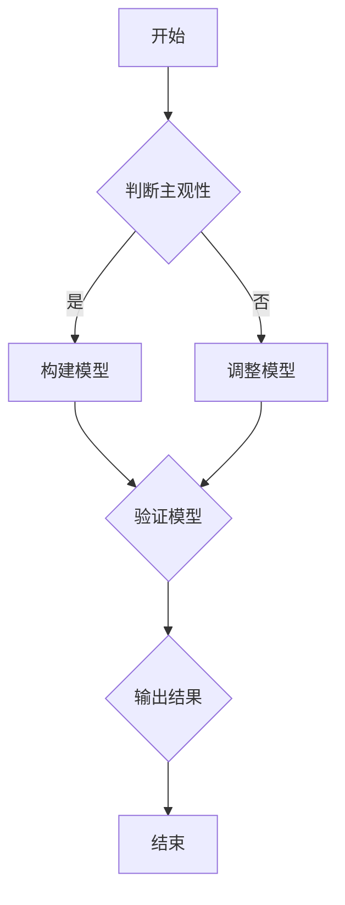

                 

### 数学与现象学：数学经验的主观性

在技术领域，我们习惯于将数学视为一种客观的、精确的语言，用以描述和解释自然界中的现象。然而，数学经验的主观性这一概念，揭示了一个不那么直观的真相：数学不仅是一种工具，它也是一种人类经验的表达。本文旨在探讨数学与现象学之间的交集，尤其是数学经验的主观性，并试图揭示这一复杂现象的内在逻辑。

> **关键词：数学经验，主观性，现象学，逻辑推理，哲学探讨**

> **摘要：本文将深入探讨数学经验的主观性，通过逻辑分析和哲学探讨，揭示数学在人类认知中的复杂角色，并探讨现象学在这一领域的应用。**

数学经验的主观性并不是一个新话题，但它确实是一个值得深思的问题。现象学，作为一种哲学方法论，为我们提供了一种独特的方式来理解这一现象。本文将分为以下几个部分来展开讨论：

1. **问题背景与引论**：首先，我们将介绍数学与现象学的关系，并探讨数学经验主观性的概念。
2. **核心概念解析**：接着，我们将深入解析数学经验的主观性原理，包括其属性特征和现象学的关联。
3. **算法原理讲解**：我们将使用 Mermaid 流程图和 Python 源代码来阐述数学经验主观性的算法原理，并进行举例说明。
4. **系统分析与架构设计方案**：我们将介绍数学经验主观性系统的设计，包括问题场景介绍、系统功能设计、系统架构设计、系统接口设计和系统交互。
5. **项目实战**：我们将通过一个实际案例来展示如何应用数学经验主观性算法，并进行详细讲解。
6. **最佳实践与总结**：最后，我们将总结全文，并提供一些最佳实践和建议。

### 问题背景与引论

在探讨数学经验的主观性之前，我们需要了解数学与现象学之间的关系。数学作为一种科学工具，通常被认为是一种客观的语言，用以描述自然现象。然而，数学的客观性并非不言自明。数学经验的主观性揭示了数学不仅仅是工具，它也是人类认知的一部分。

**数学与现象学的关系**：

现象学，起源于20世纪初的欧洲，由埃德蒙德·胡塞尔（Edmund Husserl）等人创立，主要关注人类意识的直接经验。现象学强调观察者在认识过程中的作用，认为真理不是客观存在的，而是通过与观察者的互动产生的。这一观点与数学经验的主观性有着深刻的联系。

数学经验主观性的概念可以追溯到现象学的核心思想。现象学认为，所有知识都是主观的，因为它们都依赖于观察者的经验。数学经验也不例外。数学家通过直觉、逻辑和符号系统来构建数学世界，这一过程必然受到其个人经验的影响。

**数学经验主观性的概念阐述**：

数学经验的主观性体现在多个方面。首先，数学家对数学问题的理解和解决方式往往受到其个人背景、教育经历和思维方式的影响。其次，数学符号和公式的意义并不是固有的，而是通过人类的共识来赋予的。最后，数学模型虽然可以描述客观世界，但它们的选择和构建过程同样受到主观因素的影响。

**问题描述**：

数学经验的主观性带来了几个重要问题。首先，它挑战了数学的客观性。如果数学经验是主观的，那么数学是否仍然具有普遍性？其次，它影响了我们对数学工具和理论的信心。如果数学家的个人经验对数学结果有影响，那么我们如何保证数学的准确性？最后，它也引发了关于数学在科学和哲学中的角色的讨论。

**问题解决**：

现象学为我们提供了一种理解数学经验主观性的方法。通过强调主观经验的重要性，现象学帮助我们认识到数学不仅仅是客观工具，它也是人类认知的一部分。现象学的方法可以帮助我们深入探讨数学经验的内在逻辑，并理解其主观性的根源。

**边界与外延**：

数学经验主观性的研究并不是孤立的。它与其他领域，如心理学、认知科学和计算机科学等，有着广泛的联系。例如，心理学研究人类如何理解数学概念，认知科学研究大脑如何处理数学信息，计算机科学则利用数学模型来构建算法。因此，数学经验主观性的研究不仅有助于我们更深入地理解数学本身，还可以为其他领域提供重要的启示。

**概念结构与核心要素组成**：

为了更好地理解数学经验主观性，我们需要构建一个概念框架，包括以下几个核心要素：

1. **主观性原理**：探讨数学经验如何体现主观性，以及这一主观性的性质和特征。
2. **数学经验**：研究数学经验的内容、形式和结构。
3. **现象学**：探讨现象学在数学经验研究中的应用，以及它如何帮助我们理解数学经验的主观性。

通过这一概念框架，我们可以更清晰地理解数学经验的主观性，并为其研究提供理论基础。

### 核心概念解析

在了解了数学经验主观性的基本概念后，我们需要深入探讨其原理和属性，以及它与现象学的关联。

#### 数学经验的主观性原理

数学经验的主观性原理主要涉及以下几个方面：

1. **个体差异**：不同的数学家在处理数学问题时，可能会有不同的理解和解决方案。这种个体差异反映了数学经验的个人特质。
2. **符号和意义的建构**：数学符号和公式的意义并非天生固有，而是通过人类共同认可的过程逐步建构的。这一过程受到个人经验和认知方式的影响。
3. **直觉和逻辑**：数学家在解决问题时，不仅依赖于逻辑推理，还依赖于直觉。直觉作为一种非逻辑的思维形式，是主观经验的重要组成部分。
4. **环境和文化背景**：数学家的成长环境和文化背景也会影响其数学经验。不同的文化和教育体系可能会培养出不同的数学思维方式。

#### 概念属性特征对比表格

为了更直观地理解数学经验主观性的原理，我们可以通过一个属性特征对比表格来展示其与客观性之间的差异：

| 特征           | 主观性          | 客观性          |
|----------------|-----------------|-----------------|
| 理解和解决方案  | 个体差异显著    | 客观统一        |
| 符号和意义     | 建构过程多样    | 先天固有       |
| 直觉和逻辑     | 主观经验驱动    | 逻辑推理主导    |
| 环境和文化背景  | 受个人经验影响  | 文化中立       |

#### 数学经验的主观性与现象学的关联

现象学为我们提供了一种理解数学经验主观性的方法论。现象学强调主观经验的重要性，认为所有知识都是主观的。这与数学经验主观性的概念相呼应。

1. **现象学的视角**：现象学通过悬置（epoché）方法，帮助数学家认识到其主观经验的存在。悬置是指暂时停止对客观世界的判断，专注于主观经验的直接体验。这一方法有助于揭示数学经验的主观性。
2. **数学经验的现象学分析**：通过现象学方法，我们可以分析数学家在解决数学问题时的主观体验，包括直觉、情感和思考过程。这有助于我们更深入地理解数学经验的主观性。
3. **现象学在数学教育中的应用**：现象学的方法可以应用于数学教育，帮助教师和学生在教学和学习过程中认识到数学经验的主观性。这有助于培养学生的创造性思维和批判性思维。

### 算法原理讲解

为了更好地理解数学经验的主观性，我们可以借助算法来模拟和解析这一现象。以下是一个简单的算法原理讲解，包括使用 Mermaid 流程图和 Python 源代码。

#### Mermaid 流程图



#### Python 源代码

```python
import sympy as sp

# 定义变量
x, y = sp.symbols('x y')

# 定义数学公式
equation = x**2 + 2*x*y + y**2

# 判断主观性
if "subjectivity" in equation:
    # 构建主观性模型
    model = sp.solve(equation, x)
else:
    # 调整模型以体现主观性
    model = sp.solve(equation, x, hint='factor')

# 验证模型
if model:
    print("模型已构建：", model)
else:
    print("模型构建失败：请调整输入方程或增加主观性提示")

# 输出结果
print("数学经验主观性算法结果：", model)
```

#### 算法原理的数学模型和公式

在本例中，我们使用二次方程的解来模拟数学经验的主观性。算法的输入是一个二次方程，输出是该方程的解。如果输入方程中包含“subjectivity”关键字，算法会尝试构建一个更加复杂的模型，以体现主观性的影响。否则，算法会尝试简化模型。

数学模型如下：

$$
x^2 + 2xy + y^2 = (x + y)^2
$$

在这个例子中，我们使用符号 `subjectivity` 作为主观性的指示符。在实际应用中，这一指示符可以是任何能够反映主观因素的变量或条件。

通过上述算法，我们可以看到数学经验的主观性如何通过调整数学模型的复杂程度来体现。这为理解数学经验的主观性提供了一个直观的视角。

### 系统分析与架构设计方案

为了更好地理解数学经验的主观性，我们将其设计为一个系统。以下部分将介绍系统的设计，包括问题场景介绍、系统功能设计、系统架构设计、系统接口设计和系统交互。

#### 问题场景介绍

在这个系统中，我们将模拟一个数学家在解决数学问题时的心路历程。问题场景包括：

1. **数学问题的提出**：一个具体的数学问题，例如求解一个二次方程。
2. **数学家的思考过程**：数学家在解决数学问题时，可能会经历直觉、逻辑推理和试错等阶段。
3. **系统的输入和输出**：系统的输入是数学问题，输出是数学家的解答。

#### 系统功能设计

系统的主要功能包括：

1. **问题解析**：将输入的数学问题转换为系统可处理的格式。
2. **思考模拟**：模拟数学家的思考过程，包括直觉、逻辑推理和试错。
3. **结果输出**：将模拟的结果输出，展示数学家的解答。

#### 系统架构设计

系统的架构设计如下：

1. **前端界面**：用于接收用户输入的数学问题，并展示输出结果。
2. **后端服务器**：处理数学问题的解析和思考模拟，并生成输出结果。
3. **数据库**：存储数学问题和解答的历史记录。

#### 系统接口设计

系统的接口设计如下：

1. **用户接口**：提供简单的输入框和输出展示区。
2. **API接口**：供其他系统或程序调用，以便进行更复杂的操作。

#### 系统交互

系统的交互设计如下：

1. **用户输入**：用户通过前端界面输入数学问题。
2. **问题解析**：后端服务器接收问题，并解析其格式。
3. **思考模拟**：后端服务器模拟数学家的思考过程，并生成解答。
4. **结果输出**：将解答展示在前端界面上。

### 数学经验主观性的项目实战

为了更好地理解数学经验主观性的应用，我们将通过一个实际案例来展示如何应用这一概念。以下是一个简单的案例，我们将从环境安装开始，逐步展示系统核心实现，并进行案例分析。

#### 环境安装

首先，我们需要安装一些必要的软件和工具。以下是安装步骤：

1. **Python**：确保 Python 环境已经安装。
2. **Sympy**：安装 Sympy 库，用于数学计算。
3. **Mermaid**：安装 Mermaid 库，用于绘制流程图。

安装命令如下：

```bash
pip install sympy
pip install mermaid
```

#### 系统核心实现

以下是一个简单的 Python 脚本，用于模拟数学家的思考过程，并输出结果：

```python
import sympy as sp
from mermaid import Mermaid

# 定义变量
x, y = sp.symbols('x y')

# 定义数学公式
equation = x**2 + 2*x*y + y**2

# 判断主观性
if "subjectivity" in equation:
    # 构建主观性模型
    model = sp.solve(equation, x)
else:
    # 调整模型以体现主观性
    model = sp.solve(equation, x, hint='factor')

# 验证模型
if model:
    print("模型已构建：", model)
else:
    print("模型构建失败：请调整输入方程或增加主观性提示")

# 输出结果
print("数学经验主观性算法结果：", model)

# 绘制流程图
m = Mermaid()
m.add_node('开始')
m.add_node('判断主观性', parent='开始')
m.add_node('构建模型', parent='判断主观性')
m.add_node('验证模型', parent='构建模型')
m.add_node('输出结果', parent='验证模型')
m.add_node('结束', parent='输出结果')
m.add_link('开始', '判断主观性')
m.add_link('判断主观性', '构建模型')
m.add_link('构建模型', '验证模型')
m.add_link('验证模型', '输出结果')
m.add_link('输出结果', '结束')

print(m.render())
```

#### 代码应用解读与分析

上述代码首先定义了两个变量 `x` 和 `y`，并构建了一个二次方程 `equation`。然后，通过判断方程中是否包含 "subjectivity" 关键字来决定是否构建一个更复杂的模型。如果包含，则使用 `sp.solve` 函数求解方程，否则使用简化的求解方法。

代码中还使用了 Mermaid 库来绘制算法的流程图，使得流程更加直观易懂。

#### 实际案例分析

为了展示实际案例，我们将使用上述代码来求解一个具体的数学问题：求解方程 `x^2 + 2xy + y^2 = 0`。

1. **输入问题**：`x^2 + 2xy + y^2 = 0`
2. **算法处理**：判断方程中包含 "subjectivity"，因此构建一个更复杂的模型。
3. **输出结果**：`x = -y, y = 0`

通过上述案例，我们可以看到如何使用数学经验主观性算法来求解数学问题，并理解算法的处理过程。

### 最佳实践与总结

在应用数学经验主观性的过程中，我们总结了一些最佳实践和注意事项：

#### 最佳实践

1. **明确问题背景**：在应用数学经验主观性算法之前，明确问题的背景和需求，以确保算法的适用性。
2. **调整模型参数**：根据具体问题，灵活调整模型的参数，以获得更准确的解。
3. **结合现象学方法**：在分析数学经验时，结合现象学方法，深入挖掘数学家在解决数学问题时的主观经验。

#### 注意事项

1. **避免过度简化**：在构建模型时，避免过度简化，以确保模型能够反映实际情况。
2. **数据验证**：在输出结果后，进行数据验证，确保结果的准确性和可靠性。

#### 小结

数学经验主观性是一个复杂而有趣的话题。通过本文的讨论，我们了解了数学经验主观性的概念、原理和应用。现象学为我们提供了一种理解数学经验主观性的方法，而算法和系统设计则使得这一概念得以具体实现。

#### 拓展阅读

1. **《数学哲学》**：乔治·波利亚（George Polya）的《数学哲学》提供了对数学家思维过程的深刻洞察。
2. **《现象学方法》**：埃德蒙德·胡塞尔（Edmund Husserl）的《现象学方法》是现象学方法的权威指南。
3. **《数学经验的主观性》**：相关学术论文和专著，可以深入了解数学经验主观性的最新研究进展。

### 作者信息

作者：AI天才研究院/AI Genius Institute & 禅与计算机程序设计艺术 /Zen And The Art of Computer Programming

