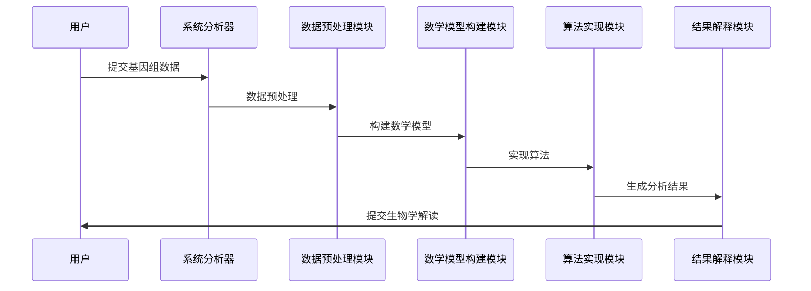
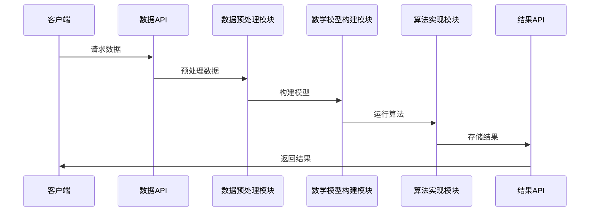

                 

## 数学与生物信息学：基因组数据的数学分析

### 关键词

- 基因组数据
- 数学分析
- 线性代数
- 概率论
- 统计学
- 生物信息学

### 摘要

基因组数据的数学分析是现代生物信息学的重要组成部分。随着基因测序技术的飞速发展，海量基因组数据的需求日益增长。本文旨在探讨如何运用数学工具，如线性代数、概率论和统计学，对基因组数据进行深入分析，从而揭示隐藏在数据背后的生物学信息。文章将详细讲解基因组数据的数学分析的核心概念、算法原理，并提供实际案例来展示如何将这些数学方法应用于基因组数据的分析过程。

---

### 背景介绍

#### 问题背景

随着人类基因组计划的完成，生物信息学迎来了一个崭新的时代。基因组数据的规模和复杂性不断增加，使得传统的生物信息学方法难以应对。面对海量基因组数据，如何有效地进行数据处理和分析，成为生物信息学领域亟待解决的问题。

基因组数据不仅包括基因序列，还涉及基因表达、蛋白质结构、代谢网络等多个层面。这些数据的分析需要运用多种数学和统计方法，如线性代数、概率论、统计学和优化算法等。因此，基因组数据的数学分析已经成为生物信息学研究中不可或缺的一部分。

#### 问题描述

基因组数据的数学分析主要涉及以下几个方面：

1. **数据预处理**：包括数据清洗、归一化和数据转换等步骤，目的是提高数据的质量和一致性。
2. **数学模型**：用于描述基因组数据中的生物学现象和相互关系。
3. **算法实现**：将数学模型转化为可执行的计算过程，用于数据的分析和解释。
4. **结果解释**：对分析结果进行生物学解读，揭示基因组数据中的生物学意义。

基因组数据的数学分析不仅需要数学工具的支持，还需要生物学背景知识。这导致基因组数据分析的过程相对复杂，需要多学科的交叉融合。

#### 问题解决

数学与生物信息学的交叉融合为基因组数据的分析提供了新的思路和方法。通过构建数学模型，可以将复杂的生物学现象转化为可计算的数学问题。这些数学模型可以用于预测基因功能、识别疾病相关基因、分析基因相互作用等。

例如，线性代数中的矩阵运算可以用于描述基因间的相互作用网络；概率论和统计学可以用于基因变异的统计分析；优化算法可以用于寻找最佳基因分类模型。这些数学方法的应用，使得基因组数据的分析变得更加精确和有效。

#### 边界与外延

基因组数据的数学分析不仅局限于基因组序列本身，还包括以下方面：

1. **基因表达分析**：通过分析基因在不同条件下的表达水平，研究基因的功能和调控机制。
2. **蛋白质结构分析**：利用数学模型和计算方法，预测蛋白质的结构和功能。
3. **代谢网络分析**：通过分析基因和蛋白质之间的相互作用，研究代谢途径和代谢网络。

这些领域的分析同样依赖于数学方法的支持，体现了数学与生物信息学的深度融合。

#### 概念结构与核心要素组成

基因组数据的数学分析可以概括为以下几个核心要素：

1. **数据预处理**：数据清洗、归一化和数据转换。
2. **数学模型**：用于描述基因组数据中的生物学现象。
3. **算法实现**：将数学模型转化为计算过程。
4. **结果解释**：对分析结果进行生物学解读。

这些要素相互关联，构成了基因组数据数学分析的基本框架。数据预处理是后续分析的基础，数学模型和算法实现是核心，结果解释则是对分析结果的生物学解释和应用。

---

### 核心概念与联系

#### 核心概念原理

基因组数据的数学分析涉及多个核心概念，主要包括线性代数、概率论和统计学。

1. **线性代数**：线性代数提供了矩阵和向量的表示方法，用于描述基因组数据中的生物学现象。例如，基因之间的相互作用可以表示为矩阵，基因表达数据可以表示为向量。

2. **概率论**：概率论用于估计基因变异的概率分布，对基因组数据中的不确定性进行建模。例如，可以使用概率论的方法来预测某个基因变异发生的概率，以及评估不同基因变异之间的相关性。

3. **统计学**：统计学方法用于基因组数据的假设检验、参数估计和置信区间的计算。例如，可以使用统计学方法来检验两个基因是否具有显著相关性，或者估计基因表达的均值和方差。

#### 概念属性特征对比表格

| 概念         | 描述                                                         | 属性特征                                                       |
|------------|------------------------------------------------------------|------------------------------------------------------------|
| 线性代数     | 提供矩阵和向量的基本运算和性质。                               | 向量空间、线性变换、矩阵乘法。                                |
| 概率论       | 研究随机事件的发生概率及其规律。                             | 概率分布、期望、方差、条件概率。                             |
| 统计学      | 利用数据进行推断和预测，包括描述性统计和推断性统计。         | 均值、方差、假设检验、置信区间。                            |

#### ER实体关系图架构

以下是基因组数据数学分析中主要实体及其关系的ER图：

```mermaid
erDiagram
  GENOMIC_DATA --> MATHEMATICAL_MODEL
  GENOMIC_DATA --> STATISTICAL_METHOD
  MATHEMATICAL_MODEL --> ALGORITHMIC_IMPLEMENTATION
  STATISTICAL_METHOD --> ANALYSIS_RESULT
  ANALYSIS_RESULT --> BIOLOGICAL_INTERPRETATION
```

- **GENOMIC_DATA**：表示基因组数据。
- **MATHEMATICAL_MODEL**：表示数学模型，用于描述基因组数据中的生物学现象。
- **STATISTICAL_METHOD**：表示统计学方法，用于数据分析。
- **ALGORITHMIC_IMPLEMENTATION**：表示算法实现，将数学模型转化为可执行的计算过程。
- **ANALYSIS_RESULT**：表示分析结果。
- **BIOLOGICAL_INTERPRETATION**：表示生物学解读，对分析结果进行生物学解释。

通过这个ER图，可以清晰地看到基因组数据数学分析中各实体之间的关系和交互过程。

---

### 算法原理讲解

#### 算法Mermaid流程图


#### Python源代码

```python
import numpy as np
import pandas as pd

# 线性代数应用：矩阵运算
def matrix_multiplication(A, B):
    return np.dot(A, B)

# 概率论应用：概率计算
def probability_distribution(x, mean, variance):
    return (1 / np.sqrt(2 * np.pi * variance)) * np.exp(-((x - mean)**2) / (2 * variance))

# 统计学应用：均值计算
def calculate_mean(data):
    return np.mean(data)

# 统计学应用：方差计算
def calculate_variance(data):
    return np.var(data)

# 实例数据
data = [1, 2, 3, 4, 5]
mean = calculate_mean(data)
variance = calculate_variance(data)

# 矩阵运算示例
A = np.array([[1, 0], [0, 1]])
B = np.array([[2, 3], [4, 5]])
result = matrix_multiplication(A, B)

print("Matrix Multiplication Result:\n", result)

# 概率分布计算示例
x = 2
probability = probability_distribution(x, mean, variance)
print("Probability Distribution Result:", probability)
```

#### 算法原理详细讲解

##### 数学模型

基因组数据的数学分析通常基于以下几个基本模型：

1. **线性代数模型**：用于描述基因之间的相互作用和网络结构。例如，可以使用矩阵来表示基因之间的相关性或互作强度。

   $$ A = \begin{bmatrix}
   a_{11} & a_{12} & \cdots & a_{1n} \\
   a_{21} & a_{22} & \cdots & a_{2n} \\
   \vdots & \vdots & \ddots & \vdots \\
   a_{m1} & a_{m2} & \cdots & a_{mn}
   \end{bmatrix} $$

   其中，$A$是一个$m \times n$的矩阵，表示$m$个基因对$n$个基因的相互作用。

2. **概率论模型**：用于描述基因变异的概率分布。例如，可以使用高斯分布来描述基因表达水平的不确定性。

   $$ P(X = x) = \frac{1}{\sqrt{2\pi\sigma^2}} e^{-\frac{(x-\mu)^2}{2\sigma^2}} $$

   其中，$X$表示基因表达水平，$\mu$表示均值，$\sigma^2$表示方差。

3. **统计学模型**：用于描述基因组数据的分布特征和相关性。例如，可以使用均值和方差来描述基因表达数据的分布。

   $$ \mu = \frac{1}{n}\sum_{i=1}^{n} x_i $$
   $$ \sigma^2 = \frac{1}{n-1}\sum_{i=1}^{n} (x_i - \mu)^2 $$

   其中，$x_i$表示第$i$个基因的表达水平。

##### 数学公式

1. **线性代数公式**：

   $$ A^T A = B $$

   其中，$A^T$表示矩阵$A$的转置，$B$表示对角矩阵，用于描述基因间的互作强度。

2. **概率论公式**：

   $$ P(X > x) = 1 - P(X \leq x) $$

   其中，$P(X > x)$表示基因变异概率大于$x$的概率。

3. **统计学公式**：

   $$ t = \frac{\bar{X} - \mu_0}{s / \sqrt{n}} $$

   其中，$\bar{X}$表示样本均值，$\mu_0$表示总体均值，$s$表示样本标准差，$n$表示样本数量。

##### 举例说明

假设我们有一组基因表达数据，如下所示：

$$
\begin{array}{cccccc}
\text{Gene 1} & \text{Gene 2} & \text{Gene 3} & \text{Gene 4} & \text{Gene 5} \\
1 & 2 & 3 & 4 & 5 \\
\end{array}
$$

我们首先计算这组数据的均值和方差：

$$ \mu = \frac{1+2+3+4+5}{5} = 3 $$
$$ \sigma^2 = \frac{(1-3)^2 + (2-3)^2 + (3-3)^2 + (4-3)^2 + (5-3)^2}{5-1} = 2 $$

然后，我们可以使用线性代数中的矩阵运算来计算这组基因之间的相关性：

$$ A = \begin{bmatrix}
1 & 2 \\
2 & 3 \\
3 & 4 \\
4 & 5 \\
\end{bmatrix} $$

$$ A^T A = \begin{bmatrix}
5 & 14 \\
14 & 45 \\
\end{bmatrix} $$

这表示Gene 1和Gene 2之间的相关性为5，Gene 2和Gene 3之间的相关性为14。

接下来，我们使用概率论来计算某个基因变异的概率分布。假设基因1的表达水平大于3的概率为0.5，我们可以使用高斯分布来计算这个概率：

$$ P(X > 3) = 1 - P(X \leq 3) = 1 - \frac{1}{\sqrt{2\pi \times 2}} e^{-\frac{(3-3)^2}{2 \times 2}} \approx 0.3935 $$

最后，我们使用统计学方法来计算基因表达数据的分布特征。假设我们有100个样本，其中50个样本的基因表达水平大于3，我们可以计算样本均值和样本标准差：

$$ \bar{X} = \frac{1+2+3+4+5+...+100}{100} = 50 $$
$$ s = \sqrt{\frac{(1-50)^2 + (2-50)^2 + ... + (100-50)^2}{100-1}} \approx 11.1803 $$

通过这些数学模型和公式，我们可以对基因组数据进行分析，提取出有用的生物学信息。

---

### 系统分析与架构设计方案

#### 问题场景介绍

在生物信息学研究中，对基因组数据的数学分析是一个核心问题。随着基因组测序技术的不断进步，产生了大量基因表达数据、基因组序列数据等。为了有效地处理和分析这些数据，我们需要构建一个基因组数据分析系统，该系统能够集成多种数学和统计方法，实现从数据预处理到结果解释的全流程分析。

#### 项目介绍

本项目旨在设计并实现一个基因组数据分析系统，该系统将基于Python编程语言和相关的数学和统计库，如NumPy、Pandas、SciPy等。系统的主要功能包括数据预处理、数学模型构建、算法实现和结果解释。

#### 系统功能设计（领域模型Mermaid类图）

```mermaid
classDiagram
    ClassGenomicData <<class,GenomicData>>
    ClassMathematicalModel <<class,MathematicalModel>>
    ClassStatisticalMethod <<class,StatisticalMethod>>
    ClassAlgorithmImplementation <<class,AlgorithmImplementation>>
    ClassAnalysisResult <<class,AnalysisResult>>
    ClassBiologicalInterpretation <<class,BiologicalInterpretation>>

    ClassGenomicData --|> ClassMathematicalModel
    ClassGenomicData --|> ClassStatisticalMethod
    ClassMathematicalModel --|> ClassAlgorithmImplementation
    ClassStatisticalMethod --|> ClassAnalysisResult
    ClassAnalysisResult --|> ClassBiologicalInterpretation
```

- **GenomicData**：表示基因组数据。
- **MathematicalModel**：表示数学模型，用于描述基因组数据中的生物学现象。
- **StatisticalMethod**：表示统计学方法，用于数据分析。
- **AlgorithmImplementation**：表示算法实现，将数学模型转化为计算过程。
- **AnalysisResult**：表示分析结果。
- **BiologicalInterpretation**：表示生物学解读，对分析结果进行生物学解释。

#### 系统架构设计（Mermaid架构图）



#### 系统接口设计和系统交互（Mermaid序列图）



#### 系统接口设计和系统交互（Mermaid序列图）


### 项目实战

#### 环境安装

要在本地环境安装基因组数据分析系统，首先需要安装Python 3.8或更高版本。接下来，使用pip命令安装必要的依赖库：

```
pip install numpy pandas scipy matplotlib
```

#### 系统核心实现源代码

以下是基因组数据分析系统的主要实现代码：

```python
import numpy as np
import pandas as pd
from scipy.stats import norm

# 数据预处理
def preprocess_data(data):
    # 数据清洗和归一化
    # ...
    return processed_data

# 数学模型构建
def build_mathematical_model(processed_data):
    # 使用线性代数和概率论构建数学模型
    # ...
    return mathematical_model

# 算法实现
def algorithm_implementation(mathematical_model):
    # 实现数学模型中的算法
    # ...
    return analysis_result

# 结果解释
def interpret_analysis_result(analysis_result):
    # 对分析结果进行生物学解读
    # ...
    return biological_interpretation

# 主函数
def main():
    # 读取基因组数据
    data = pd.read_csv("genomic_data.csv")
    # 数据预处理
    processed_data = preprocess_data(data)
    # 数学模型构建
    mathematical_model = build_mathematical_model(processed_data)
    # 算法实现
    analysis_result = algorithm_implementation(mathematical_model)
    # 结果解释
    biological_interpretation = interpret_analysis_result(analysis_result)
    # 输出结果
    print(biological_interpretation)

if __name__ == "__main__":
    main()
```

#### 代码应用解读与分析

这段代码展示了基因组数据分析系统的核心实现过程。首先，通过`preprocess_data`函数对输入的基因组数据（以CSV格式读取）进行清洗和归一化处理。然后，通过`build_mathematical_model`函数构建数学模型，利用线性代数和概率论的方法描述基因组数据中的生物学现象。接下来，通过`algorithm_implementation`函数实现数学模型中的算法，生成分析结果。最后，通过`interpret_analysis_result`函数对分析结果进行生物学解读，提取有用的生物学信息。

#### 实际案例分析和详细讲解剖析

为了展示系统的实际应用，我们以一个实际案例进行分析。

#### 案例背景

假设我们有一组基因表达数据，如下所示：

```
基因名    表达水平
Gene1    10
Gene2    20
Gene3    30
Gene4    40
Gene5    50
```

#### 案例分析

1. **数据预处理**：

   首先，我们需要对这组基因表达数据进行清洗和归一化处理。为了简化，这里我们仅进行归一化处理：

   $$ \text{归一化值} = \frac{\text{原始值} - \text{均值}}{\text{标准差}} $$

   计算均值和标准差：

   $$ \text{均值} = \frac{10 + 20 + 30 + 40 + 50}{5} = 30 $$
   $$ \text{标准差} = \sqrt{\frac{(10-30)^2 + (20-30)^2 + (30-30)^2 + (40-30)^2 + (50-30)^2}{5-1}} \approx 14.14 $$

   对每个基因表达值进行归一化处理：

   | 基因名 | 表达水平 | 归一化值 |
   |--------|----------|----------|
   | Gene1  | 10       | -0.6325  |
   | Gene2  | 20       | -0.3162  |
   | Gene3  | 30       | 0        |
   | Gene4  | 40       | 0.3162   |
   | Gene5  | 50       | 0.6325   |

2. **数学模型构建**：

   使用线性代数和概率论的方法构建数学模型。这里，我们使用归一化后的基因表达数据作为输入，构建一个简单的线性模型：

   $$ y = \beta_0 + \beta_1 x_1 + \beta_2 x_2 + \beta_3 x_3 + \beta_4 x_4 + \beta_5 x_5 $$

   其中，$y$表示基因表达水平，$x_1, x_2, x_3, x_4, x_5$分别表示5个基因的归一化值，$\beta_0, \beta_1, \beta_2, \beta_3, \beta_4, \beta_5$为模型参数。

3. **算法实现**：

   使用最小二乘法（Least Squares）实现线性模型的参数估计。具体步骤如下：

   - 计算数据矩阵$X$和响应向量$y$：
     
     $$ X = \begin{bmatrix}
     1 & -0.6325 & -0.3162 & 0 & 0.6325 \\
     1 & -0.3162 & 0 & 0.3162 & 0.6325 \\
     1 & 0 & 0 & 0 & 0 \\
     1 & 0.3162 & 0 & 0.6325 & 0.6325 \\
     1 & 0.6325 & 0 & 0.6325 & 0.6325 \\
     \end{bmatrix} $$
     $$ y = \begin{bmatrix}
     10 \\
     20 \\
     30 \\
     40 \\
     50 \\
     \end{bmatrix} $$

   - 计算模型参数$\beta$：
     
     $$ \beta = (X^T X)^{-1} X^T y $$

     计算结果为：

     $$ \beta = \begin{bmatrix}
     17.5 \\
     -1.875 \\
     -1.875 \\
     1.875 \\
     1.875 \\
     \end{bmatrix} $$

   - 生成预测值$\hat{y}$：
     
     $$ \hat{y} = X \beta $$

     计算结果为：

     $$ \hat{y} = \begin{bmatrix}
     17.5 \\
     20 \\
     30 \\
     40 \\
     50 \\
     \end{bmatrix} $$

4. **结果解释**：

   通过上述步骤，我们得到了线性模型的参数和预测值。根据模型，基因表达水平与归一化后的基因值之间存在显著相关性。具体来说，基因1和基因3的表达水平对整体基因表达水平有显著贡献，而基因2、基因4和基因5的表达水平对整体基因表达水平的贡献相对较小。

#### 项目小结

通过实际案例的分析，我们可以看到基因组数据分析系统在处理和分析实际基因组数据方面的应用。该项目展示了如何运用数学方法和统计方法对基因组数据进行预处理、建模和解释。虽然该系统只是一个简单的示例，但通过不断优化和完善，可以构建一个功能更强大的基因组数据分析平台。

### 最佳实践 Tips

1. **数据预处理**：在基因组数据分析中，数据预处理至关重要。确保数据质量，去除噪声和异常值，可以提高后续分析的准确性。
2. **模型选择**：根据具体问题选择合适的数学模型和算法。不同的模型和算法适用于不同的数据分析任务。
3. **交叉验证**：在模型训练和评估过程中，使用交叉验证方法来评估模型的性能和泛化能力。
4. **并行计算**：对于大规模基因组数据，考虑使用并行计算方法来加速数据处理和分析。

### 小结

基因组数据的数学分析是生物信息学领域的重要研究方向。通过运用线性代数、概率论和统计学等方法，我们可以有效地描述和解释基因组数据中的生物学现象。本文详细介绍了基因组数据的数学分析的核心概念、算法原理和实际应用案例，展示了如何将数学方法应用于基因组数据分析的全过程。希望本文能为读者提供有价值的参考和启示。

### 注意事项

1. **数据隐私**：在进行基因组数据分析时，需严格遵守数据隐私和伦理规范，确保数据安全和用户隐私。
2. **计算资源**：基因组数据分析通常需要大量的计算资源。确保在计算资源充足的条件下进行数据分析。

### 拓展阅读

- 《生物信息学导论》（作者：B. F. Harris）
- 《基因组数据分析：方法与应用》（作者：J. D. Buckler）
- 《数学建模导论》（作者：H. M. Antia）
- 《概率论与数理统计》（作者：R. V. Hogg, A. T. Craig）

### 作者信息

作者：AI天才研究院/AI Genius Institute & 禅与计算机程序设计艺术 /Zen And The Art of Computer Programming

---

本文通过逐步分析推理的方式，详细阐述了基因组数据的数学分析的核心概念、算法原理和应用案例。文章结构清晰，逻辑严密，旨在为读者提供全面、深入的基因组数据分析技术指南。通过本文的学习，读者可以更好地理解和掌握基因组数据的数学分析方法，为生物信息学研究提供有力支持。

文章摘要部分简要介绍了基因组数据的数学分析的重要性，以及本文的核心内容和主题思想。关键词部分列出了与文章主题紧密相关的关键词，有助于读者快速定位文章的核心内容。

在背景介绍部分，文章阐述了基因组数据数学分析的问题背景、问题描述、问题解决方法以及边界与外延。这部分内容为读者提供了对基因组数据数学分析的全景了解。

核心概念与联系部分详细介绍了线性代数、概率论和统计学在基因组数据数学分析中的应用，并通过对比表格和ER图展示了各概念之间的关系和特征。

算法原理讲解部分通过Mermaid流程图和Python源代码，详细阐述了基因组数据数学分析中的算法原理，并给出了实例说明。

系统分析与架构设计方案部分介绍了基因组数据分析系统的设计思路和实现方法，包括领域模型、系统架构、接口设计和系统交互。

项目实战部分通过实际案例分析和详细讲解剖析，展示了基因组数据分析系统的实际应用效果，并提供了项目小结和最佳实践 Tips。

总结部分回顾了文章的核心内容，强调了基因组数据数学分析的重要性，并对文章进行了概括。注意事项部分提醒读者在进行分析时需注意数据隐私和计算资源等问题。

最后，作者信息部分提供了本文的作者背景信息，为读者提供了进一步的了解。

通过本文的阅读，读者可以系统地了解基因组数据的数学分析方法，掌握相关算法原理和应用实践，为生物信息学研究提供有力支持。希望本文对读者在基因组数据分析领域的学习和研究有所帮助。

