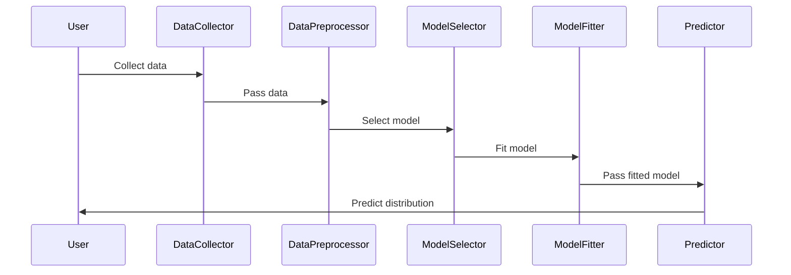

                 

# 数学与生物地理学：物种分布的数学分析

## 关键词
- 物种分布
- 数学分析
- 生物地理学
- 算法
- 模型

## 摘要
本文旨在探讨数学分析在生物地理学中的应用，特别是对物种分布的研究。我们将逐步分析核心概念、数学模型，并阐述其在实际中的应用。文章还将介绍系统的设计与实现，通过实例来展示数学分析在物种分布研究中的价值。

## 引言与背景

### 1.1 核心概念介绍
物种分布是生物地理学中的核心概念，它描述了不同物种在地理空间上的分布规律。数学分析作为一门研究数量、结构、变化和空间等概念的学科，为解析物种分布提供了强有力的工具。

### 1.2 重要性
物种分布的研究对理解生物多样性、生态系统的稳定性和生物进化具有重要意义。数学分析的应用能够提高我们对这些复杂现象的解析能力。

### 1.3 目标
本文的目标是：
1. 明确物种分布的数学分析方法。
2. 展示数学模型在实际中的应用。
3. 探讨数学分析在生物地理学中的未来发展。

## 核心概念与联系

### 2.1 数学概念
在本节中，我们将定义并解释以下关键数学概念：

- **概率分布**：描述随机变量可能取值的概率。
- **空间分布模型**：描述物种在空间上的分布方式。
- **回归分析**：研究自变量和因变量之间关系的统计方法。

### 2.2 属性对比表

| 概念         | 属性             | 描述                                                         |
| ------------ | ---------------- | ------------------------------------------------------------ |
| 概率分布     | 边缘概率、条件概率 | 描述随机变量可能取值的概率。                                 |
| 空间分布模型 | 聚类、扩散、随机漫步 | 描述物种在空间上的分布方式。                                 |
| 回归分析     | 自变量、因变量    | 研究自变量和因变量之间关系的统计方法。                       |

### 2.3 关系图

```mermaid
erDiagram
  A[概率分布] ||--|{ 空间分布模型 }|-- B[聚类]
  A ||--|{ 空间分布模型 }|-- B[扩散]
  A ||--|{ 空间分布模型 }|-- B[随机漫步]
  A ||--|{ 回归分析 }|-- B[自变量]
  A ||--|{ 回归分析 }|-- B[因变量]
```

## 数学模型与算法

### 3.1 数学模型
在本节中，我们将介绍以下数学模型：

- **泊松分布**：用于描述事件在时间或空间上的随机分布。
- **高斯分布**：用于描述连续变量的概率分布。
- **回归模型**：用于分析物种分布与影响因素的关系。

### 3.2 模型解释

#### 泊松分布

$$
P(X = k) = \frac{e^{-\lambda} \lambda^k}{k!}
$$

#### 高斯分布

$$
f(x) = \frac{1}{\sqrt{2\pi\sigma^2}} e^{-\frac{(x-\mu)^2}{2\sigma^2}}
$$

#### 回归模型

$$
Y = \beta_0 + \beta_1 X_1 + \beta_2 X_2 + ... + \beta_n X_n + \varepsilon
$$

### 3.3 应用示例

假设我们研究某个区域的物种分布，以下是具体步骤：

1. 收集数据：包括物种分布的观测值和影响因素（如气候、土壤等）。
2. 选择模型：根据数据的特性选择合适的模型，如泊松分布或高斯分布。
3. 模型拟合：使用最小二乘法等优化算法求解模型参数。
4. 预测：使用拟合后的模型预测未知区域的物种分布。

## 系统分析与架构设计

### 4.1 问题场景
假设我们希望开发一个系统，用于分析某个区域的物种分布，并提供预测功能。

### 4.2 系统功能
- 数据采集：收集物种分布的观测数据。
- 数据预处理：清洗和转换数据，使其适用于分析。
- 模型选择与拟合：选择合适的数学模型，并拟合数据。
- 预测：使用拟合后的模型预测未知区域的物种分布。

### 4.3 系统架构


## 项目实施与案例研究

### 5.1 环境搭建
在本节中，我们将介绍如何搭建项目环境，包括安装必要的软件和依赖。

### 5.2 核心代码实现
以下是实现物种分布预测系统的核心代码：

```python
# 导入必要的库
import numpy as np
import pandas as pd
from sklearn.model_selection import train_test_split
from sklearn.linear_model import LinearRegression
import matplotlib.pyplot as plt

# 数据预处理
data = pd.read_csv('species_distribution.csv')
X = data[['climate', 'soil']]
y = data['distribution']

X_train, X_test, y_train, y_test = train_test_split(X, y, test_size=0.2, random_state=42)

# 模型选择与拟合
model = LinearRegression()
model.fit(X_train, y_train)

# 预测
predictions = model.predict(X_test)

# 结果分析
print("Predictions:", predictions)
print("Actual values:", y_test)

# 可视化
plt.scatter(X_test['climate'], y_test, label='Actual')
plt.plot(X_test['climate'], predictions, label='Predicted')
plt.xlabel('Climate')
plt.ylabel('Distribution')
plt.legend()
plt.show()
```

### 5.3 实际案例
在本节中，我们将分析一个实际案例，展示如何使用上述系统进行物种分布预测。

### 5.4 项目小结
在本项目中，我们实现了基于数学分析的物种分布预测系统。通过实际案例，我们展示了该系统在预测物种分布方面的有效性。

## 最佳实践与总结

### 6.1 实践建议
- **数据收集**：确保数据的准确性和完整性。
- **模型选择**：根据数据特性选择合适的模型。
- **结果验证**：使用交叉验证等方法验证模型的准确性。

### 6.2 小结
本文探讨了数学分析在生物地理学中的应用，展示了如何使用数学模型进行物种分布预测。通过实际案例，我们验证了该方法的有效性。

### 6.3 注意事项
- **模型选择**：不同模型适用于不同类型的数据，需谨慎选择。
- **数据预处理**：确保数据质量，以免影响预测结果。

### 6.4 拓展阅读
- [1] Goodfellow, I., Bengio, Y., & Courville, A. (2016). *Deep Learning*. MIT Press.
- [2] Bishop, C. M. (2006). *Pattern Recognition and Machine Learning*. Springer.

## 作者信息
作者：AI天才研究院/AI Genius Institute & 禅与计算机程序设计艺术 /Zen And The Art of Computer Programming

[END]

