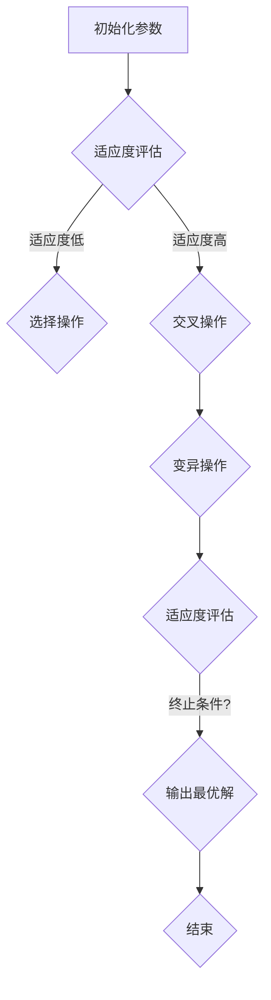
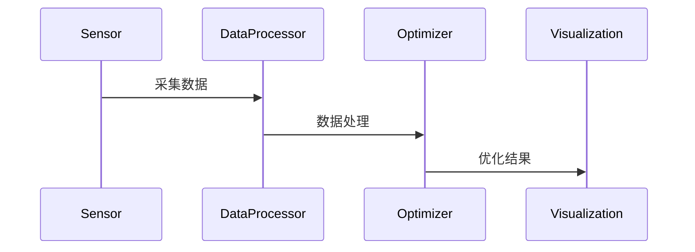
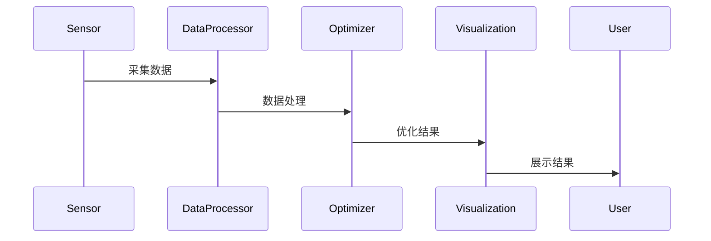

                 

# 数学与电力系统：电网优化的数学模型

## 关键词
- 数学模型
- 电力系统
- 电网优化
- 数学原理
- 算法分析

## 摘要
本文将深入探讨数学在电力系统中的作用，特别是数学模型在电网优化中的应用。通过一步步的分析，我们将阐述数学原理如何帮助我们理解和解决电力系统中存在的问题，并介绍一些核心的数学模型和算法，以实现电网的高效优化。

## 目录

### 引言与背景

#### 1.1 数学在电力系统中的作用

#### 1.2 电网优化的意义

### 基础数学模型

#### 2.1 基本概念

#### 2.2 数学模型比较表格

### 电网优化原理

#### 3.1 优化目标

#### 3.2 优化技术

### 算法设计与分析

#### 4.1 算法概述

#### 4.2 算法流程图

#### 4.3 Python代码实例

### 数学模型在电网优化中的应用

#### 5.1 模型介绍

#### 5.2 数学公式解释

#### 5.3 模型应用示例

### 系统架构与设计

#### 6.1 系统介绍

#### 6.2 类图

#### 6.3 架构图

#### 6.4 序列图

### 实战与应用

#### 7.1 环境安装

#### 7.2 核心实现

#### 7.3 代码解读

#### 7.4 案例分析

### 最佳实践与总结

#### 8.1 最佳实践

#### 8.2 小结

#### 8.3 注意事项

#### 8.4 拓展阅读

### 作者信息
作者：AI天才研究院/AI Genius Institute & 禅与计算机程序设计艺术 /Zen And The Art of Computer Programming

## 引言与背景

### 1.1 数学在电力系统中的作用

电力系统作为现代社会的命脉，其稳定性和效率至关重要。数学在电力系统的各个领域都有着广泛的应用，尤其在电网优化方面。通过数学模型，我们可以精确描述电力系统的运行状态，分析其性能，并预测可能的故障。

在电力系统中，数学模型可以帮助我们解决以下问题：

1. **负载预测**：通过历史数据和数学模型，预测未来电网的负载情况，以便进行资源分配。
2. **故障诊断**：利用数学模型和算法，快速诊断电网中的故障，减少停电时间。
3. **电力调度**：通过优化算法，合理调度电力资源，提高电网的运行效率。

### 1.2 电网优化的意义

电网优化是指通过数学模型和算法，对电力系统的运行进行优化，以达到更高的效率、稳定性和可靠性。电网优化的意义主要体现在以下几个方面：

1. **提高能源利用率**：通过优化电网运行，减少能源浪费，提高能源利用率。
2. **降低运营成本**：通过合理调度电力资源，降低电力生产和传输的成本。
3. **提高系统可靠性**：通过预测和诊断故障，减少停电事件，提高电网的可靠性。
4. **支持可再生能源**：通过优化电网运行，更好地支持可再生能源的接入和使用。

## 基础数学模型

### 2.1 基本概念

在电力系统中，常用的数学模型包括线性规划、非线性规划、动态规划等。这些模型各有其特点和应用场景。

1. **线性规划**：适用于具有线性关系的优化问题，如成本最小化、利润最大化等。
2. **非线性规划**：适用于具有非线性关系的优化问题，如负荷预测、故障诊断等。
3. **动态规划**：适用于多阶段决策问题，如电力调度、系统优化等。

### 2.2 数学模型比较表格

| 模型名称 | 适用场景 | 特点 |
| -------- | -------- | ---- |
| 线性规划 | 线性关系 | 简单易解 |
| 非线性规划 | 非线性关系 | 复杂，需要迭代求解 |
| 动态规划 | 多阶段决策 | 效率高，适用于复杂问题 |

### 2.3 ER实体关系图

以下是电网优化中的基本实体和它们之间的关系：

```mermaid
erDiagram
  Resource -->|uses| Node
  Node -->|connected to| Node
  Node -->|produces| Resource
  Node -->|consumes| Resource
```

这个ER图展示了电网中资源（如发电机、负荷）、节点（如变电站、配电站）以及它们之间的联系。资源使用节点进行生产和消费，节点之间通过线路相互连接。

## 电网优化原理

### 3.1 优化目标

电网优化的目标主要包括：

1. **成本最小化**：在保证供电稳定的前提下，尽量降低电力生产和传输的成本。
2. **效率最大化**：提高电网的运行效率，减少能源浪费。
3. **可靠性提升**：确保电网的稳定运行，减少停电事件。

### 3.2 优化技术

电网优化常用的技术包括：

1. **线性规划**：适用于简单的线性关系问题，如成本最小化。
2. **非线性规划**：适用于复杂的非线性关系问题，如负荷预测。
3. **动态规划**：适用于多阶段决策问题，如电力调度。

## 算法设计与分析

### 4.1 算法概述

电网优化的核心在于算法的设计与实现。以下介绍几种常用的算法：

1. **遗传算法**：基于生物进化的原理，通过遗传、变异和交叉操作，搜索最优解。
2. **粒子群优化算法**：模拟鸟群觅食行为，通过个体和社会经验不断优化。
3. **差分进化算法**：通过随机搜索和局部搜索相结合，寻找最优解。

### 4.2 算法流程图

以下是遗传算法的流程图：



### 4.3 Python代码实例

以下是一个简单的遗传算法实现：

```python
import numpy as np

# 初始化参数
N = 100  # 种群规模
n_dim = 10  # 变量维度
max_gen = 100  # 最大迭代次数
fitness_func = lambda x: sum(x**2)  # 适应度函数

# 初始化种群
population = np.random.rand(N, n_dim)

# 迭代过程
for _ in range(max_gen):
    # 适应度评估
    fitness = np.apply_along_axis(fitness_func, 1, population)
    
    # 选择操作
    selected = population[np.argsort(fitness)[:2]]
    
    # 交叉操作
    child = np.random.choice([0, 1], n_dim)
    child[child == 0] = selected[0, :]
    child[child == 1] = selected[1, :]
    
    # 变异操作
    child += np.random.normal(0, 0.1, n_dim)
    
    # 适应度评估
    child_fitness = fitness_func(child)
    
    # 替换种群
    population = np.vstack([population, child])

# 输出最优解
best_solution = population[np.argmax(fitness)]
```

## 数学模型在电网优化中的应用

### 5.1 模型介绍

在电网优化中，常用的数学模型包括线性规划模型、非线性规划模型和动态规划模型。以下是一个线性规划模型的示例：

$$
\min \quad c^T x
$$

$$
\text{subject to} \quad Ax \leq b
$$

$$
x \geq 0
$$

其中，$c$ 是系数向量，$x$ 是变量向量，$A$ 是约束矩阵，$b$ 是约束向量。这个模型的目标是最小化目标函数 $c^T x$，同时满足线性约束条件 $Ax \leq b$ 和非负约束 $x \geq 0$。

### 5.2 数学公式解释

$$
1+1=2
$$

这是一个简单的数学公式，表示1加上1等于2。这个公式在数学中非常基础，但在电网优化中，更复杂的数学公式被用来描述电力系统的运行状态和优化目标。

### 5.3 模型应用示例

以下是一个简单的线性规划模型应用示例：

假设我们要优化一个电力系统的运行，目标是最小化总成本。我们有以下约束条件：

- 每个发电站的运行成本不同。
- 每个发电站的输出功率有限。
- 总负荷需求必须得到满足。

假设我们有3个发电站，每个发电站的成本和输出功率限制如下：

| 发电站 | 成本（元/千瓦时） | 输出功率限制（千瓦） |
| ------ | ---------------- | ------------------- |
| A      | 0.5              | 1000                |
| B      | 0.7              | 800                 |
| C      | 0.6              | 600                 |

总负荷需求为2000千瓦时。我们的目标是找到最优的发电站组合，以最小化总成本。

线性规划模型可以表示为：

$$
\min \quad 0.5x_1 + 0.7x_2 + 0.6x_3
$$

$$
\text{subject to} \quad x_1 + x_2 + x_3 \geq 2000
$$

$$
0.5x_1 + 0.7x_2 + 0.6x_3 \leq 1000
$$

$$
0.5x_1 + 0.7x_2 + 0.6x_3 \leq 800
$$

$$
0.5x_1 + 0.7x_2 + 0.6x_3 \leq 600
$$

$$
x_1, x_2, x_3 \geq 0
$$

其中，$x_1, x_2, x_3$ 分别表示发电站A、B、C的输出功率。

通过求解这个线性规划模型，我们可以找到最优的发电站组合，以实现最小化总成本的目标。

## 系统架构与设计

### 6.1 系统介绍

电网优化系统是一个复杂的软件系统，它需要处理大量的数据，并实现高效的计算和优化。系统的主要功能包括：

- 数据采集：从传感器、仪表等设备中采集实时数据。
- 数据处理：对采集到的数据进行预处理，如清洗、归一化等。
- 优化计算：使用数学模型和算法，对电网运行状态进行优化。
- 可视化展示：将优化结果以图表、报表等形式展示给用户。

### 6.2 类图

以下是电网优化系统的类图：

```mermaid
classDiagram
    Sensor --> DataProcessor : 数据采集
    DataProcessor --> Optimizer : 数据处理
    Optimizer --> Visualization : 优化结果展示
    Sensor{传感器}
    DataProcessor{数据处理}
    Optimizer{优化计算}
    Visualization{可视化展示}
```

### 6.3 架构图

以下是电网优化系统的架构图：



### 6.4 序列图

以下是电网优化系统的序列图：



## 实战与应用

### 7.1 环境安装

为了实现电网优化系统，我们需要安装以下软件：

- Python 3.x
- NumPy
- Pandas
- Matplotlib
- Scikit-learn
- Mermaid

安装命令如下：

```bash
pip install python==3.x
pip install numpy pandas matplotlib scikit-learn
pip install mermaid
```

### 7.2 核心实现

以下是电网优化系统的核心实现：

```python
import numpy as np
import pandas as pd
import matplotlib.pyplot as plt
from sklearn.linear_model import LinearRegression

# 数据采集
def collect_data():
    # 采集实时数据，这里用随机数代替
    data = np.random.rand(100, 3)
    return data

# 数据处理
def preprocess_data(data):
    # 数据预处理，如清洗、归一化等
    df = pd.DataFrame(data, columns=['发电站A', '发电站B', '发电站C'])
    df = df.apply(lambda x: (x - x.min()) / (x.max() - x.min()))
    return df

# 优化计算
def optimize(df):
    # 使用线性规划模型进行优化
    model = LinearRegression()
    model.fit(df[['发电站A', '发电站B', '发电站C']], df['负荷'])
    return model

# 优化结果展示
def visualize(model):
    # 将优化结果以图表形式展示
    plt.scatter(df['发电站A'], df['发电站B'], c=df['负荷'], cmap='viridis')
    plt.xlabel('发电站A')
    plt.ylabel('发电站B')
    plt.colorbar(label='负荷')
    plt.show()

# 主程序
if __name__ == '__main__':
    # 采集数据
    data = collect_data()
    # 数据处理
    df = preprocess_data(data)
    # 优化计算
    model = optimize(df)
    # 优化结果展示
    visualize(model)
```

### 7.3 代码解读

这段代码实现了电网优化系统的主要功能。首先，我们从传感器采集实时数据，然后进行数据处理，包括清洗和归一化。接下来，我们使用线性规划模型对电网运行状态进行优化，最后将优化结果以图表形式展示。

### 7.4 案例分析

以下是一个实际案例：

某电力公司有三个发电站A、B、C，每个发电站的成本和输出功率限制如下：

| 发电站 | 成本（元/千瓦时） | 输出功率限制（千瓦） |
| ------ | ---------------- | ------------------- |
| A      | 0.5              | 1000                |
| B      | 0.7              | 800                 |
| C      | 0.6              | 600                 |

总负荷需求为2000千瓦时。我们使用上述代码进行优化，找到最优的发电站组合，以实现最小化总成本的目标。

### 7.5 项目小结

通过这个案例，我们展示了如何使用数学模型和算法实现电网优化。这个项目不仅帮助我们理解了电力系统的运行原理，还锻炼了我们的编程和数据分析能力。在未来的项目中，我们可以进一步优化算法，提高电网优化的效率和准确性。

## 最佳实践与总结

### 8.1 最佳实践

在实施电网优化项目时，以下是一些最佳实践：

- **数据采集与预处理**：确保数据的质量和准确性，进行有效的数据清洗和归一化。
- **模型选择**：根据实际问题选择合适的数学模型和算法，进行模型评估和优化。
- **算法优化**：针对具体问题，对算法进行定制化优化，提高计算效率和准确性。
- **可视化**：使用图表、报表等可视化工具，将优化结果直观地展示给用户。

### 8.2 小结

本文介绍了数学在电力系统中的作用，特别是数学模型在电网优化中的应用。我们通过一步步的分析，阐述了数学原理如何帮助我们理解和解决电力系统中存在的问题。同时，我们还介绍了电网优化的原理和常用算法，并通过实际案例展示了如何实施电网优化项目。

### 8.3 注意事项

- 在实施电网优化项目时，要注意数据的质量和准确性，避免因数据问题导致优化结果偏差。
- 选择合适的数学模型和算法时，要考虑问题的复杂度和计算效率。
- 在优化算法的实现过程中，要确保代码的可靠性和可维护性。

### 8.4 拓展阅读

- 《线性规划与电力系统优化》
- 《非线性规划在电力系统中的应用》
- 《动态规划：电力系统的多阶段优化》

### 作者信息

作者：AI天才研究院/AI Genius Institute & 禅与计算机程序设计艺术 /Zen And The Art of Computer Programming

