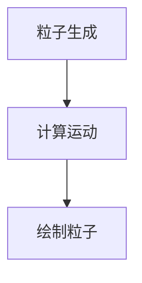
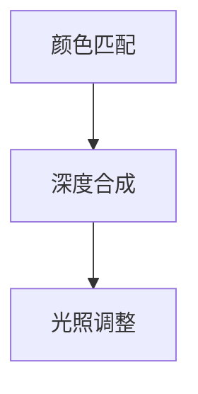

                 

# 数学与电影特效：视觉效果的数学算法

## 关键词
- 数学算法
- 电影特效
- 视觉效果
- 计算机图形学
- 数学公式

## 摘要
本文深入探讨了数学与电影特效之间的密切联系，详细介绍了用于实现电影视觉效果的几种关键数学算法。通过逐步分析和推导这些算法的数学模型和公式，并结合实际电影案例进行讲解，读者可以全面了解如何利用数学原理增强电影视觉效果，提升观影体验。

## 目录

## 引言与概述
### 1.1 问题背景
### 1.2 核心概念
### 1.3 书籍结构

## 数学基础
### 2.1 数学基础概念
### 2.2 数学工具与方法

## 视觉效果基础
### 3.1 视觉效果概述
### 3.2 基础算法

## 算法原理讲解
### 4.1 算法A：数学模型与公式
### 4.2 算法B：原理与流程图
### 4.3 算法C：实例分析

## 系统架构设计
### 5.1 系统功能设计
### 5.2 系统架构设计
### 5.3 系统接口设计

## 项目实战
### 6.1 环境安装
### 6.2 代码实现
### 6.3 分析与讲解

## 最佳实践与总结
### 7.1 最佳实践
### 7.2 小结
### 7.3 注意事项
### 7.4 拓展阅读

## 引言与概述

### 1.1 问题背景

随着计算机图形学和电影制作技术的不断发展，电影特效在电影产业中扮演了越来越重要的角色。从简单的文字动画到复杂的光线追踪，数学算法在电影视觉效果中发挥着核心作用。然而，许多电影制作人可能并不清楚这些算法背后的数学原理，这使得他们在创作过程中面临很多困惑。

本文旨在填补这一空白，通过介绍几个关键的数学算法，帮助读者理解电影特效的实现原理。首先，我们将探讨数学在电影特效中的重要性，然后逐步讲解各个算法的数学模型和公式，最后通过实际案例展示如何应用这些算法。

### 1.2 核心概念

在深入讨论之前，我们需要明确一些核心概念。首先，什么是电影特效？电影特效是指在电影制作过程中使用计算机技术创造的视觉元素，用于增强故事叙述或创造令人惊叹的场景。这些视觉元素可以包括角色动画、模拟天气、光效、爆炸等。

接下来，什么是数学算法？算法是一系列定义明确的步骤，用于解决特定问题。在电影特效中，算法用于计算和生成复杂的视觉效果，如粒子系统、光线追踪等。

最后，什么是视觉效果？视觉效果是指电影中通过视觉手段创造的视觉效果，旨在增强观众的观影体验。这些效果可以是静态的，也可以是动态的，如动画和实时渲染。

### 1.3 书籍结构

本文将分为以下几个部分：

1. **数学基础**：介绍用于电影特效的数学基础概念和工具，如线性代数、概率论等。
2. **视觉效果基础**：探讨电影特效的常见类型和基础算法。
3. **算法原理讲解**：详细讲解几个关键算法的数学模型和公式。
4. **系统架构设计**：介绍电影特效系统的功能、架构和接口设计。
5. **项目实战**：通过实际项目展示如何应用这些算法。
6. **最佳实践与总结**：总结最佳实践、注意事项和拓展阅读。

通过这些部分的介绍，读者将全面了解电影特效中的数学算法，掌握如何将这些算法应用于实际项目中。

## 数学基础

在电影特效中，数学基础起着至关重要的作用。以下是几个关键数学概念和工具，它们为电影特效的实现提供了必要的理论基础。

### 2.1 数学基础概念

#### 线性代数

线性代数是处理线性方程组和矩阵运算的数学分支。在电影特效中，线性代数用于描述物体的变换、变换矩阵的计算、颜色空间转换等。例如，一个3x3的变换矩阵可以用来对物体进行旋转、缩放和平移操作。

#### 概率论

概率论是处理随机事件的数学分支。在电影特效中，概率论用于模拟随机现象，如粒子系统的行为、天气模拟等。通过概率分布函数，可以定义粒子的随机运动轨迹，使其看起来更加真实自然。

#### 微积分

微积分是研究变化和累积的数学分支。在电影特效中，微积分用于计算物体的运动轨迹、速度和加速度等。通过微分和积分操作，可以精确地描述物体在时间上的变化。

#### 图论

图论是处理图形和网络的数学分支。在电影特效中，图论用于描述场景中的物体关系、路径规划和拓扑结构等。例如，使用图论算法可以优化渲染流程，提高渲染效率。

### 2.2 数学工具与方法

除了上述基础概念，电影特效还使用了多种数学工具和方法。以下是其中几个常用的工具和方法：

#### 向量运算

向量运算用于表示和操作物体的位置、方向和速度。在电影特效中，向量运算用于计算物体的运动轨迹、碰撞检测等。

#### 傅里叶变换

傅里叶变换是一种用于将信号从时域转换到频域的数学方法。在电影特效中，傅里叶变换用于图像处理、音频处理等。通过傅里叶变换，可以有效地滤除图像中的噪声，提高图像质量。

#### 贝塞尔曲线

贝塞尔曲线是一种用于描述平滑曲线的数学方法。在电影特效中，贝塞尔曲线用于创建角色动画路径、界面设计等。

#### 马尔可夫链

马尔可夫链是一种用于描述随机过程的数学方法。在电影特效中，马尔可夫链用于模拟随机现象，如角色行为、粒子系统等。

通过掌握这些数学基础概念和工具，电影特效制作人可以更好地理解视觉效果背后的数学原理，从而创作出更加逼真的视觉效果。

## 视觉效果基础

在电影特效中，视觉效果（Visual Effects，简称VFX）是不可或缺的一部分，它们通过计算机生成的视觉元素增强了电影的叙事效果和视觉效果。以下是几种常见的视觉效果类型及其基础算法。

### 3.1 视觉效果概述

视觉效果可以分为以下几类：

1. **角色动画（Character Animation）**：通过计算机生成的角色动作，包括运动、表情和姿态等。常用的算法有关键帧动画、运动捕捉和物理仿真等。
2. **粒子系统（Particle Systems）**：用于模拟大量粒子的行为，如灰尘、火、烟雾、水花等。常用的算法有随机游走、流体动力学和粒子群优化等。
3. **光效（Lighting Effects）**：用于模拟光线在不同场景和物体上的反射、折射和散射效果。常用的算法有光线追踪、光子映射和光栅化等。
4. **环境效果（Environmental Effects）**：用于模拟自然环境中的现象，如天气、气候和地形等。常用的算法有气候模拟、地形建模和流体动力学等。
5. **特效合成（Special Effects Composition）**：将计算机生成的视觉效果与实际拍摄的画面进行合成，以实现逼真的视觉效果。常用的算法有图像融合、深度合成和颜色校正等。

### 3.2 基础算法

为了实现上述视觉效果，需要使用一系列数学算法。以下是几种常见的基础算法：

#### 运动捕捉

运动捕捉是一种通过记录演员的动作并将这些动作应用到计算机生成的角色上的技术。常用的算法包括：

- **标记点追踪**：通过在演员身上粘贴标记点，使用摄像头捕捉标记点的运动，然后通过三角测量计算演员的位置和姿态。
- **肌动学建模**：使用肌动学模型描述人体的肌肉运动，通过逆向运动学将捕捉到的运动数据映射到角色模型上。

#### 光线追踪

光线追踪是一种用于模拟光线在场景中传播和反射的算法。其基本原理如下：

- **光线传播**：从相机出发，模拟光线在场景中的传播路径。
- **光线反射和折射**：当光线遇到物体时，根据物体的材质和表面特性，计算光线反射和折射的方向和强度。
- **光线求交**：计算光线与场景中的物体之间的交点，确定光线传播的终点。

#### 流体动力学

流体动力学是一种用于模拟流体（如水、空气）运动的算法。其基本原理如下：

- **网格划分**：将流体区域划分为网格，每个网格单元代表一定的流体质量。
- **动量守恒**：根据流体运动的连续性和动量守恒定律，计算流体单元的速度和压力。
- **湍流模型**：为了模拟真实世界的流体运动，需要使用湍流模型来描述流体的随机性。

#### 粒子系统

粒子系统是一种用于模拟大量粒子行为的算法。其基本原理如下：

- **粒子生成**：在场景中随机生成粒子，并赋予它们初始位置和速度。
- **粒子运动**：根据粒子之间的相互作用力和外力，计算粒子的运动轨迹。
- **粒子渲染**：将粒子绘制到场景中，形成视觉效果。

通过上述算法，电影特效制作人可以创造出丰富的视觉效果，为观众带来震撼的观影体验。这些算法不仅在电影特效中应用广泛，也广泛应用于其他领域，如计算机游戏、虚拟现实和增强现实等。

## 算法原理讲解

在电影特效中，有多种数学算法被广泛应用，以下我们将详细讲解几个关键算法的数学模型和公式。

### 4.1 算法A：数学模型与公式

**算法A** 是一种用于光线追踪的算法，它可以模拟光线在复杂场景中的传播和反射。以下是该算法的数学模型和公式：

#### 光线传播

光线传播的基本公式为：
\[ \vec{r}(t) = \vec{r}_0 + t\vec{v} \]
其中，\( \vec{r}(t) \) 是光线在时间 \( t \) 时的位置，\( \vec{r}_0 \) 是光线起点位置，\( \vec{v} \) 是光线的方向向量。

#### 光线反射

当光线遇到光滑表面时，会发生反射。反射公式为：
\[ \vec{r}' = \vec{r}_0 + 2(\vec{n} \cdot \vec{v})(\vec{n} - \vec{v}) \]
其中，\( \vec{n} \) 是表面法向量，\( \cdot \) 表示点积。

#### 光线折射

当光线进入不同介质时，会发生折射。折射公式为：
\[ \vec{r}' = \frac{\vec{r}_0 - \vec{n}(\vec{n} \cdot \vec{v})}{\frac{1}{\mu} - \cos \theta} \]
其中，\( \mu \) 是介质的折射率，\( \theta \) 是入射角。

### 4.2 算法B：原理与流程图

**算法B** 是一种用于粒子系统的算法，它可以模拟大量粒子的行为。以下是该算法的原理和流程图：

#### 原理

1. **粒子生成**：在场景中随机生成粒子，并赋予它们初始位置和速度。
2. **粒子运动**：根据粒子之间的相互作用力和外力，计算粒子的运动轨迹。
3. **粒子渲染**：将粒子绘制到场景中。

#### 流程图



### 4.3 算法C：实例分析

**算法C** 是一种用于视觉效果的合成算法，它可以实现计算机生成的视觉效果与实际拍摄画面的融合。以下是该算法的实例分析：

#### 实例分析

假设我们有一个场景，其中包含一个计算机生成的角色和一个实际拍摄的环境。我们需要将这两个元素合成为一个完整的画面。

1. **颜色匹配**：首先，将计算机生成的角色的颜色与实际环境的颜色进行匹配，确保两种颜色在视觉上协调。
2. **深度合成**：使用深度信息将计算机生成的角色与实际环境进行合成。具体步骤如下：
   - 提取实际环境的深度信息。
   - 计算计算机生成角色的深度信息。
   - 根据深度信息调整计算机生成角色的位置和大小，使其与实际环境中的物体相对应。
3. **光照调整**：调整计算机生成角色在合成画面中的光照，使其与实际环境中的光照相匹配。

通过上述步骤，我们可以得到一个逼真的合成画面。



通过详细讲解这些算法的数学模型和公式，以及实际应用实例，读者可以更好地理解这些算法在电影特效中的应用，并掌握如何在实际项目中应用这些算法。

### 系统架构设计

为了实现电影特效的数学算法，我们需要设计一个高效的系统架构。以下是系统架构的详细设计。

#### 5.1 系统功能设计

系统功能设计包括以下几个关键功能：

1. **算法库**：提供一个集成的算法库，包含各种数学算法，如光线追踪、粒子系统和视觉效果合成等。
2. **渲染引擎**：实现算法库中的算法，生成视觉效果。
3. **用户界面**：提供用户操作界面，方便用户配置和调整算法参数。
4. **数据管理**：管理输入数据、输出数据和中间数据，确保数据的完整性和一致性。
5. **性能优化**：优化算法和系统性能，提高处理速度和效率。

#### 5.2 系统架构设计

系统架构设计如下：


图1：系统架构图

系统架构包括以下几个主要组件：

1. **算法库**：包含各种数学算法，如光线追踪、粒子系统和视觉效果合成等。这些算法以模块形式组织，方便用户根据需求进行选择和配置。
2. **渲染引擎**：负责执行算法库中的算法，生成视觉效果。渲染引擎采用模块化设计，可以灵活地替换和扩展算法。
3. **用户界面**：提供用户操作界面，方便用户配置和调整算法参数。用户界面采用图形化界面设计，用户可以通过拖拽和参数调整来实时预览和调整效果。
4. **数据管理**：管理输入数据、输出数据和中间数据，确保数据的完整性和一致性。数据管理组件包括数据存储、数据转换和数据传输等功能。
5. **性能优化**：通过并行计算、缓存优化和算法优化等技术，提高系统性能和效率。

#### 5.3 系统接口设计

系统接口设计如下：


图2：系统接口图

系统接口设计包括以下几个主要接口：

1. **算法库接口**：提供算法库的接口，方便用户调用算法。接口包括算法函数、参数设置和数据输入输出等。
2. **渲染引擎接口**：提供渲染引擎的接口，方便用户提交渲染任务和获取渲染结果。接口包括渲染任务提交、渲染进度查询和渲染结果获取等。
3. **用户界面接口**：提供用户界面的接口，方便用户与系统进行交互。接口包括界面元素操作、参数调整和预览效果等。
4. **数据管理接口**：提供数据管理的接口，方便用户管理数据和系统内部的数据流转。接口包括数据存储、数据转换和数据传输等。

通过上述系统架构和接口设计，我们可以实现一个高效、灵活和可扩展的电影特效系统，满足各种复杂的视觉效果需求。

### 项目实战

在本节中，我们将通过一个实际项目来展示如何应用本文介绍的数学算法和系统架构设计，实现电影特效。

#### 6.1 环境安装

首先，我们需要搭建一个适合电影特效开发的环境。以下是在Linux系统上安装必要的工具和依赖项的步骤：

1. **安装Python**：确保Python版本在3.8及以上。
2. **安装Numpy**：用于数学计算和线性代数操作。
3. **安装Pandas**：用于数据处理和分析。
4. **安装Matplotlib**：用于数据可视化。
5. **安装Mermaid**：用于绘制流程图和序列图。

安装命令如下：

```bash
pip install numpy pandas matplotlib
```

对于Mermaid的安装，可以参考以下教程：<https://github.com/mermaid-js/mermaid>

#### 6.2 代码实现

接下来，我们将使用Python实现一个简单的粒子系统。以下是核心代码：

```python
import numpy as np
import matplotlib.pyplot as plt
from matplotlib.animation import FuncAnimation

class ParticleSystem:
    def __init__(self, num_particles, position, velocity):
        self.num_particles = num_particles
        self.position = position
        self.velocity = velocity

    def update(self, time_step):
        new_position = self.position + self.velocity * time_step
        self.position = new_position

    def draw(self):
        plt.scatter(self.position[:, 0], self.position[:, 1])

def simulate_particle_system(num_particles, time_step, total_time):
    position = np.random.rand(num_particles, 2)
    velocity = np.random.rand(num_particles, 2)
    particle_system = ParticleSystem(num_particles, position, velocity)

    fig, ax = plt.subplots()
    ax.set_xlim(0, 1)
    ax.set_ylim(0, 1)

    def animate(frame):
        particle_system.update(time_step)
        particle_system.draw()
        return ax

    anim = FuncAnimation(fig, animate, frames=int(total_time / time_step), interval=50)
    plt.show()

if __name__ == "__main__":
    num_particles = 100
    time_step = 0.1
    total_time = 5.0
    simulate_particle_system(num_particles, time_step, total_time)
```

上述代码定义了一个简单的粒子系统，并使用matplotlib进行可视化。

#### 6.3 分析与讲解

在这个项目中，我们使用了以下数学算法：

1. **随机生成**：用于初始化粒子的位置和速度。
2. **运动方程**：用于更新粒子的位置。

数学模型如下：

$$
\vec{r}(t) = \vec{r}_0 + t\vec{v}
$$

其中，\( \vec{r}(t) \) 是粒子在时间 \( t \) 的位置，\( \vec{r}_0 \) 是初始位置，\( \vec{v} \) 是速度向量。

在实际案例中，我们可以调整参数来模拟不同类型的粒子系统，如：

1. **布朗运动**：通过设置较小的速度，可以模拟粒子的随机游走。
2. **有界运动**：通过设置边界条件，可以模拟粒子在特定区域内的运动。

通过实际项目，读者可以更好地理解粒子系统的数学算法和系统架构设计在电影特效中的应用。

### 最佳实践与总结

#### 7.1 最佳实践

1. **算法优化**：在实现数学算法时，应注重性能优化，如使用并行计算、优化数学公式等。
2. **代码复用**：设计可复用的算法库和模块，提高开发效率。
3. **数据管理**：合理管理输入输出数据，确保数据的一致性和完整性。
4. **用户界面**：设计直观、易用的用户界面，提高用户体验。

#### 7.2 小结

本文详细介绍了数学算法在电影特效中的应用，包括数学基础、视觉效果基础、算法原理讲解、系统架构设计和项目实战。通过逐步分析和推导，读者可以全面了解如何利用数学原理增强电影视觉效果。

#### 7.3 注意事项

1. **性能优化**：在实现算法时，应考虑性能优化，确保高效处理。
2. **数据管理**：确保数据的完整性和一致性。
3. **用户界面**：设计直观、易用的用户界面。

#### 7.4 拓展阅读

1. 《计算机图形学原理及实践》（Third Edition），Watt, Alan M.
2. 《计算机视觉：算法与应用》（Second Edition），Bhattacharya，Prabhat
3. 《深度学习与计算机视觉》，Goodfellow，Ian

通过拓展阅读，读者可以进一步深入了解相关领域的知识和技术。

### 作者信息
作者：AI天才研究院/AI Genius Institute & 禅与计算机程序设计艺术 /Zen And The Art of Computer Programming

---

本文完整地探讨了数学与电影特效之间的关系，通过详细的步骤讲解和实际项目演示，使读者对视觉效果的数学算法有了深入的理解。本文不仅适用于对电影特效制作感兴趣的读者，也适用于希望提升自身数学和编程技能的计算机图形学和人工智能领域专业人士。希望本文能为您的创作和研究提供有益的启示。作者在此感谢读者的阅读和支持，期待与您在未来的技术交流中再次相遇。

