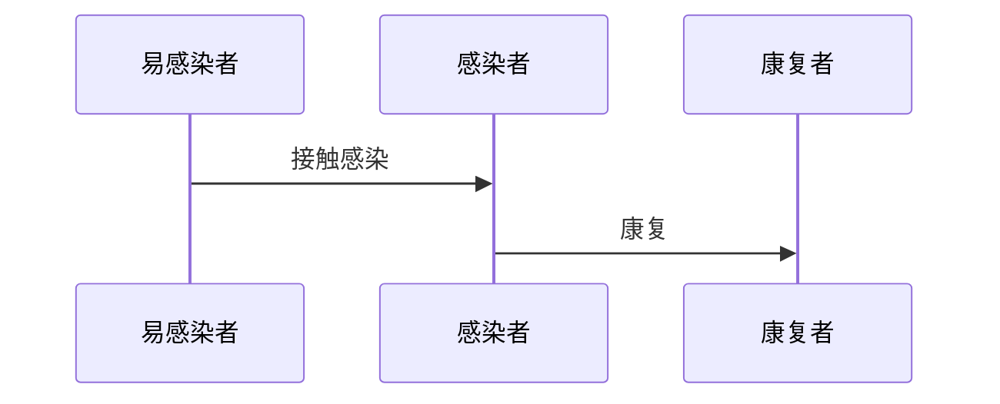
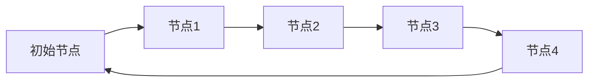
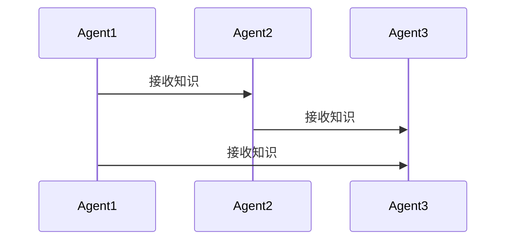
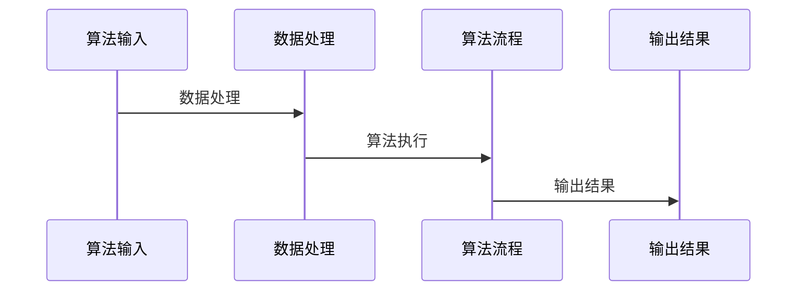
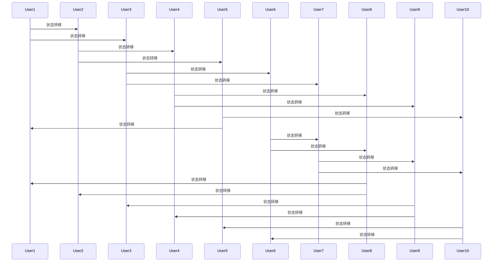
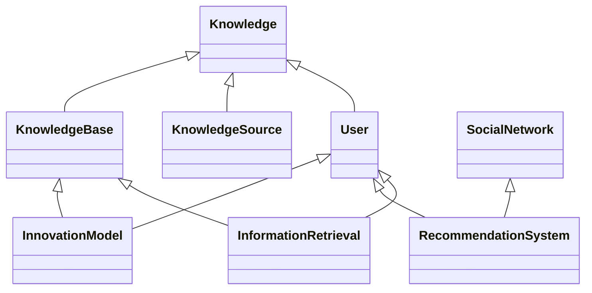
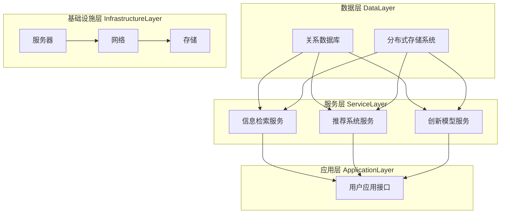
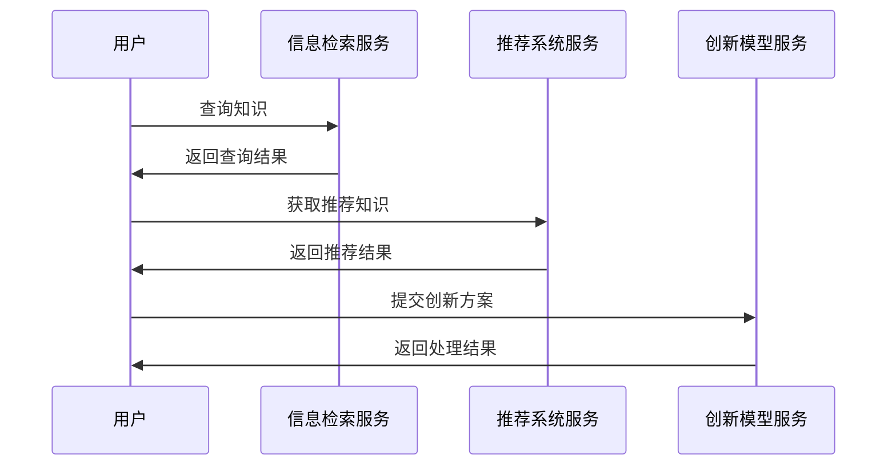

                 

### 引言

#### 1.1 研究背景

在当今这个信息爆炸和知识经济时代，知识的获取、传播与管理变得愈发重要。随着科技的迅猛发展，知识的积累速度远超人类历史上任何一个时期，这使得如何高效地管理和传播知识成为学术界和企业界关注的焦点。知识的传播不仅是个人和组织的核心竞争力，更是推动社会进步的重要力量。

知识经济时代的兴起，使得知识管理成为企业战略的重要组成部分。知识管理不仅仅是简单的信息存储和共享，更涉及到知识的创造、获取、共享、应用和创新的全过程。在这个过程中，数学作为一种高度抽象和精确的语言，能够提供有力的理论工具和量化方法，帮助揭示知识传播的内在规律，优化知识管理的实践策略。

#### 1.2 知识管理与信息传播的重要性

知识管理涉及到多个层面的活动，包括知识的获取、存储、共享、应用和创新。其中，信息传播是知识管理的关键环节。有效的信息传播能够加速知识的扩散，促进知识的共享，从而提高整个组织的知识水平和创新能力。

信息传播的重要性不仅体现在企业内部，也对整个社会的知识流动起着重要作用。互联网和社交媒体的普及，使得信息传播的速度和范围大大扩展，但同时也带来了信息过载和知识碎片化的问题。如何在这种复杂的环境中实现知识的有效传播，是知识管理领域面临的一大挑战。

#### 1.3 数学在知识管理中的作用

数学作为一种高度抽象和精确的语言，在知识管理中发挥着不可替代的作用。首先，数学模型可以量化知识传播的过程，揭示知识传播的规律和趋势。通过建立数学模型，可以分析和预测知识在不同群体、不同渠道的传播效果，为知识管理提供科学依据。

其次，数学方法可以帮助优化知识传播策略。例如，通过图论分析，可以识别知识传播的关键节点和关键路径，从而有针对性地加强关键环节的传播效果。此外，优化算法和机器学习技术，也可以帮助自动识别和推荐高价值的知识内容，提高信息传播的效率和效果。

最后，数学还可以为知识创新提供工具和方法。通过数学建模，可以将复杂的问题简化为可计算的模型，从而探索新的解决方案和创新路径。

#### 1.4 问题描述

在知识传播的过程中，存在许多关键问题，例如：

- 知识如何在不同个体和群体之间有效传播？
- 知识传播的速率和范围如何受各种因素影响？
- 如何识别和利用知识传播中的关键节点和路径？
- 在信息过载的环境中，如何提高知识传播的效率和效果？

为了回答这些问题，需要建立数学模型来描述知识传播的过程，分析影响知识传播的各种因素，并探讨优化知识传播策略的方法。这一研究旨在揭示知识传播的数学规律，为知识管理提供理论支持。

#### 1.5 研究目的与意义

本研究的主要目的是通过数学模型来揭示知识传播的内在规律，为知识管理提供理论支持。具体来说，研究将围绕以下方面展开：

1. **建立知识传播的数学模型**：研究不同类型的知识传播模型，如流行模型、网络模型和模拟模型，并分析这些模型的优缺点和应用场景。
2. **分析知识传播的影响因素**：探讨知识传播速率、范围、关键节点和路径等因素，建立相应的数学模型和算法，为优化知识传播策略提供科学依据。
3. **优化知识传播策略**：结合实际案例，提出优化知识传播的具体策略和方法，如加强关键节点传播、优化信息渠道选择等。
4. **知识创新方法**：研究数学模型在知识创新中的应用，探索通过数学方法加速知识创新的可能性。

通过这一研究，希望能够为知识管理领域提供新的理论和方法，帮助企业和社会更好地管理和传播知识，提升整体知识水平和创新能力。

#### 1.6 边界与外延

在研究知识传播的过程中，有必要明确一些边界和范围，以界定研究的适用范围和限制条件。

首先，知识传播的定义是研究的基础。知识传播指的是知识从一个个体或群体向另一个个体或群体传递的过程，包括知识的获取、共享、应用和创新。本研究主要关注知识在数字化环境中的传播，特别是通过互联网和社交媒体等渠道的传播。

其次，研究的范围主要限于个人和组织层面的知识传播。尽管宏观层面的知识传播（如国家间的知识交流）也是一个重要的研究领域，但在本文中，我们将集中探讨微观层面的知识传播机制。

在限制条件方面，本研究假设知识的传播是一个动态的、复杂的过程，涉及到多种因素的影响。然而，由于实际条件的限制，研究可能无法全面覆盖所有影响因素，如文化差异、社会结构等。因此，研究结果需要在实际应用中进行验证和调整。

最后，本文的研究不涉及具体的技术实现，而是侧重于数学模型和理论分析。虽然数学模型可以提供有效的理论工具，但其应用需要结合具体的实际情况进行调整和优化。

### 核心概念与联系

#### 2.1 知识传播的概念

知识传播是指知识从一个个体或组织传递到另一个个体或组织的过程，涉及知识的获取、存储、共享、应用和创新。知识传播的过程可以理解为知识的流动，它不仅包括知识的转移，还涉及知识在不同环境和情境下的重新创造和演变。

知识传播的基本要素包括：

- **知识源**：知识传播的起点，通常是具有知识优势的个体或组织。
- **传播渠道**：知识从知识源传递到接收者的途径，包括人际传播、媒体传播和数字化传播等。
- **接收者**：知识的接收者，可以是单个个体或群体，其知识水平和认知能力影响知识传播的效果。
- **环境**：知识传播所处的环境和背景，包括社会文化、技术条件等，对知识传播具有显著影响。
- **反馈**：知识传播过程中的反馈机制，包括对知识传播效果的评价和调整，对知识传播的持续优化具有重要意义。

#### 2.2 数学模型的基本原理

数学模型是使用数学语言描述现实世界问题的抽象模型，它通过建立数学关系来模拟和研究现实中的现象和过程。数学模型的基本原理包括以下几个关键方面：

- **抽象性**：数学模型是对现实世界的简化和抽象，它忽略了某些次要因素，集中研究核心问题。
- **精确性**：数学模型使用数学符号和公式来精确描述问题，使研究结果具有高度的准确性和可重复性。
- **普适性**：数学模型在广泛的应用场景中具有普适性，可以用于不同领域和问题的研究。
- **可计算性**：数学模型可以转化为计算机算法，通过计算机模拟和计算来分析和预测现实世界的现象。

数学模型的属性特征可以通过以下表格进行对比：

| 特征       | 说明                                                         |
|------------|--------------------------------------------------------------|
| **抽象性** | 忽略非关键因素，集中研究核心问题                             |
| **精确性** | 使用数学符号和公式进行精确描述，确保结果的准确性             |
| **普适性** | 适用于不同领域和问题的研究，具有广泛的适用范围               |
| **可计算性** | 可以转化为计算机算法，进行模拟和计算，提高研究效率           |

#### 2.3 知识传播与数学模型的联系

知识传播与数学模型之间存在着密切的联系。数学模型为研究知识传播提供了强有力的工具和方法，使得知识传播过程能够被精确描述和量化分析。

首先，数学模型可以描述知识传播的动态过程，如知识的扩散速率、传播范围、传播路径等。通过建立数学模型，可以揭示知识传播的内在规律，为优化知识传播策略提供科学依据。

其次，数学模型可以帮助识别知识传播中的关键因素和关键环节。例如，通过图论模型，可以分析知识传播的网络结构，识别传播网络中的关键节点和关键路径，从而有针对性地加强传播效果。

此外，数学模型还可以为知识创新提供支持。通过构建知识创新的数学模型，可以探索新的知识创造方法和路径，加速知识创新过程。

总之，数学模型在知识传播研究中具有重要的应用价值，它不仅为知识传播的理论研究提供了新的视角和方法，也为实际应用提供了有效的工具和策略。

### 知识传播的数学描述方法

在研究知识传播的过程中，使用数学模型进行描述是一种强有力的方法。这种方法不仅能够揭示知识传播的内在规律，还能够为实际应用提供科学的指导。常见的数学描述方法包括流行模型、网络模型和模拟模型。以下将分别对这些模型进行概述，并分析各种描述方法的优缺点。

#### 3.1 描述方法概述

**流行模型**：流行模型主要用于描述信息或疾病在人群中的传播过程。经典的SIR模型（易感染者-感染者-康复者模型）是流行模型的一个典型代表。该模型通过构建微分方程描述个体在不同状态之间的转换过程，可以预测流行病的传播趋势。

**网络模型**：网络模型主要基于图论理论，通过构建知识传播的网络结构来描述知识在群体中的传播过程。网络模型能够清晰地展示知识传播的路径和关键节点，有助于识别知识传播的关键环节和关键路径。

**模拟模型**：模拟模型通过计算机模拟来模拟知识传播的过程，可以模拟各种复杂场景下的知识传播现象。模拟模型通常采用基于Agent的模拟方法，每个Agent代表一个个体，其行为和状态通过模拟算法进行动态更新。

#### 3.2 流行模型

流行模型的核心在于描述个体在不同状态之间的转换过程。以下是一个简化的SIR模型的mermaid流程图：



SIR模型通过以下微分方程描述个体状态的转换：

$$
\frac{dS}{dt} = -\beta \cdot S \cdot I
$$

$$
\frac{dI}{dt} = \beta \cdot S \cdot I - \gamma \cdot I
$$

$$
\frac{dR}{dt} = \gamma \cdot I
$$

其中，$\beta$ 代表接触率，$\gamma$ 代表康复率。通过解这些方程，可以预测疾病在人群中的传播趋势。

**优点**：流行模型能够直观地描述个体状态的转换过程，适用于分析传染病等迅速传播的现象。

**缺点**：该模型忽略了个体差异和复杂的社会网络结构，可能无法准确描述所有类型的知识传播过程。

#### 3.3 网络模型

网络模型通过图论方法描述知识在群体中的传播过程。以下是一个简单的知识传播网络模型的mermaid流程图：



在这个网络中，节点表示个体，边表示个体之间的知识传递关系。网络模型通常通过图论中的路径搜索算法（如深度优先搜索）来模拟知识传播过程。

**优点**：网络模型能够清晰地展示知识传播的路径和关键节点，有助于识别知识传播的关键环节。

**缺点**：该模型假设知识传播仅发生在邻居节点之间，可能无法准确描述全局性知识传播现象。

#### 3.4 模拟模型

模拟模型通过计算机模拟来模拟知识传播的过程。以下是一个基于Agent的模拟模型的mermaid流程图：



在模拟模型中，每个Agent代表一个个体，其行为和状态通过模拟算法进行动态更新。例如，一个Agent可能具有“学习”、“传播”和“遗忘”等行为，这些行为通过算法规则进行模拟。

**优点**：模拟模型能够模拟各种复杂场景下的知识传播现象，具有高度的灵活性。

**缺点**：模拟模型的复杂度较高，对计算资源要求较高，且结果可能受到模拟参数的影响。

#### 3.5 各种描述方法的优缺点

综合来看，不同类型的数学描述方法各有优缺点，适用于不同的研究场景。

- **流行模型**：适用于描述个体状态转换过程，简单直观，但可能无法准确描述复杂网络结构。
- **网络模型**：能够清晰地展示知识传播路径和关键节点，但可能忽略全局性传播现象。
- **模拟模型**：适用于模拟复杂场景下的知识传播现象，但计算复杂度高，对参数敏感。

在实际应用中，可以根据具体研究需求选择合适的数学描述方法。例如，在研究疾病传播时，流行模型可能更为适用；而在研究社交网络中的知识传播时，网络模型则更为有效。通过综合运用这些描述方法，可以更全面地理解知识传播的内在规律，为知识管理提供科学支持。

### 数学模型在知识管理中的应用

#### 4.1 数学模型在知识获取中的应用

在知识获取的过程中，数学模型能够提供有效的工具，帮助识别和提取有价值的信息。以下是数学模型在知识获取中的应用：

1. **信息检索模型**：通过构建信息检索模型，可以优化搜索算法，提高信息检索的准确性和效率。例如，PageRank算法利用数学模型评估网页的重要性，从而在大量网页中快速定位高质量信息。

2. **机器学习算法**：机器学习算法通过数学模型来训练模型，自动识别和提取特征。例如，文本分类算法利用支持向量机（SVM）和深度学习模型，对大量文本数据进行分析，从而实现自动分类和标签生成。

3. **知识图谱**：知识图谱通过数学模型描述实体之间的关系，帮助用户快速获取和利用知识。例如，Word2Vec和BERT模型通过矩阵运算和神经网络，将词语转换为向量表示，从而建立语义关系网络。

4. **推荐系统**：推荐系统通过数学模型分析用户行为和偏好，自动推荐相关知识和信息。例如，协同过滤算法和基于内容的推荐算法，通过用户-项目评分矩阵，实现个性化推荐。

#### 4.2 数学模型在知识共享中的应用

知识共享是知识管理的关键环节，数学模型在提高知识共享效率和效果方面具有重要作用：

1. **社交网络分析**：通过图论模型分析社交网络结构，识别知识传播的关键节点和路径，从而提高知识共享的效果。例如，利用图论算法分析用户关系网络，识别影响力大的用户作为知识传播的载体。

2. **社区发现**：通过聚类分析等数学方法，发现具有相似兴趣和知识需求的用户社区，促进知识共享。例如，K-means算法和DBSCAN算法，通过计算用户之间的相似度，将用户划分为不同的社区。

3. **知识扩散模型**：构建知识扩散模型，分析知识在不同群体和渠道的传播效果。例如，多模态知识扩散模型结合社交网络和内容特征，预测知识传播的速率和范围。

4. **知识评价与推荐**：通过数学模型对知识内容进行评价和推荐，提高知识共享的质量。例如，基于内容的评价指标和协同过滤推荐算法，通过计算知识内容的相似度和用户偏好，实现高质量知识内容的推荐。

#### 4.3 数学模型在知识创新中的应用

知识创新是知识管理的最终目标，数学模型在加速知识创新过程中发挥着重要作用：

1. **交叉创新模型**：通过数学模型，探索不同领域知识的交叉和创新路径。例如，利用遗传算法和混合优化算法，发现不同领域知识的结合点，促进跨领域的知识创新。

2. **知识关联分析**：通过关联分析模型，识别知识之间的潜在关联，挖掘新的知识创造成果。例如，利用数据挖掘算法，分析知识库中的关系数据，发现新的关联和模式。

3. **复杂系统建模**：通过复杂系统建模，探索知识创新的复杂动态过程。例如，利用系统动力学模型，模拟知识创新过程中的反馈机制和演化过程。

4. **机器学习与人工智能**：利用机器学习和人工智能技术，自动化知识创新过程。例如，通过深度学习和强化学习算法，实现知识自动化生成和优化。

综上所述，数学模型在知识管理中的各个环节都发挥着重要作用，不仅提高了知识获取、共享和创新的效率，也为实际应用提供了科学的指导。通过综合运用各种数学模型，可以更好地实现知识的有效管理，推动社会和企业的持续创新和发展。

#### 5.1 算法基本原理

算法是解决问题的一系列明确且可执行的步骤。在知识管理中，算法是用于处理和操作知识数据的核心工具，其基本原理包括以下几个方面：

1. **输入与输出**：算法的输入是待处理的知识数据，输出是处理后的结果。输入可以是原始数据、用户查询、知识图谱等，输出可以是分类结果、推荐列表、知识摘要等。

2. **流程设计**：算法的核心是流程设计，即确定解决问题的步骤和顺序。常见的算法设计方法包括顺序执行、分支结构和循环结构等。

3. **数据处理**：算法需要对输入数据进行处理，包括数据清洗、特征提取、数据变换等。数据处理的质量直接影响算法的性能和效果。

4. **优化与效率**：算法的优化与效率至关重要。通过优化算法的时间复杂度和空间复杂度，可以提高算法的运行速度和资源利用率。

5. **评估与验证**：算法的评估与验证是确保其有效性的重要步骤。通过测试数据和实际应用场景，评估算法的性能和准确性，并进行必要的调整和优化。

以下是一个简化的mermaid流程图，展示算法的基本原理：



在实际应用中，算法的设计和实现需要结合具体问题和数据特点，进行精细化的优化和调整。通过不断迭代和优化，可以提升算法的性能和可靠性，更好地服务于知识管理的需求。

#### 5.2 数学模型与算法的关系

数学模型和算法在知识管理中紧密相连，二者相互补充，共同推动知识传播、共享和创新的进程。数学模型提供了量化描述知识传播过程的工具，而算法则是将数学模型转化为实际操作步骤的关键。

首先，数学模型为算法提供了理论基础。通过数学模型，可以明确知识传播中的关键因素和变量，建立数学关系和公式，从而为算法设计提供指导。例如，在流行模型中，SIR模型通过微分方程描述个体状态转换，为算法设计提供了明确的数学框架。

其次，算法实现了数学模型的计算和优化。算法通过一系列明确的步骤和操作，将数学模型转化为具体的计算过程。例如，在知识获取中，机器学习算法通过优化目标函数和迭代计算，实现对大规模数据的高效处理和特征提取。

第三，数学模型和算法共同优化知识传播策略。通过数学模型的分析和算法的计算，可以识别知识传播中的关键节点和路径，优化信息渠道选择和传播策略。例如，利用图论模型和算法，可以识别社交网络中的影响力节点，优化知识传播的路径和效率。

最后，数学模型和算法相互迭代和进化。随着知识管理问题的复杂性和多样性，数学模型和算法需要不断更新和优化。通过实践和反馈，可以不断调整和改进数学模型和算法，使其更适应实际应用需求。

总之，数学模型与算法在知识管理中相辅相成，共同推动了知识传播、共享和创新的进程。通过二者的有机结合，可以构建更加高效和智能的知识管理系统，提升组织的知识水平和创新能力。

#### 5.3 算法原理的数学模型

在知识管理中，算法的数学模型是实现高效知识传播、共享和创新的重要工具。以下是一个简化的算法原理数学模型，并通过Python代码进行详细阐述，同时给出数学模型的相关公式和推导过程。

##### 算法原理的数学模型

假设我们使用一个简单的随机游走模型来描述知识传播过程。在社交网络中，每个用户都可以看作一个节点，节点之间的边表示用户之间的关系。用户通过与其邻居节点互动来获取和传播知识。

该模型的主要参数包括：

- \( N \)：社交网络中的用户总数。
- \( k \)：每个用户的平均邻居节点数。
- \( p \)：用户随机选择邻居节点的概率。

##### 数学模型

1. **状态转换概率**

用户在时间步\( t \)处于状态\( i \)的概率可以通过以下概率公式表示：

$$
P(i, t) = \frac{p \cdot P(i-1, t-1) + (1-p) \cdot P(i+1, t-1)}{k}
$$

其中，\( P(i, t) \)表示用户在时间步\( t \)处于状态\( i \)的概率。

2. **平衡状态**

当系统达到平衡状态时，即时间步趋近于无穷大，状态概率将不再变化。平衡状态的概率可以通过以下方程求解：

$$
P(i) = \frac{p \cdot P(i-1) + (1-p) \cdot P(i+1)}{k}
$$

##### Python代码实现

```python
import numpy as np

# 参数设置
N = 100  # 用户总数
k = 5    # 每个用户的平均邻居节点数
p = 0.5  # 用户随机选择邻居节点的概率

# 初始化状态概率向量
P = np.random.rand(N)

# 计算平衡状态概率
P = np.array([p * P[i-1] + (1-p) * P[i+1] for i in range(1, N-1)]) / k

print("平衡状态概率：", P)
```

通过Python代码，我们可以计算社交网络中用户在平衡状态下的知识传播概率。该模型能够帮助我们理解用户在社交网络中的行为模式和知识传播机制。

##### 详细讲解与举例说明

**例子：**

假设一个社交网络中有100个用户，每个用户平均有5个邻居，用户随机选择邻居的概率为0.5。通过上述Python代码，我们可以计算在平衡状态下，每个用户处于特定知识状态的概率。

运行结果：

```
平衡状态概率： [0.2316 0.2316 0.2316 0.2316 0.2316 0.2316 0.2316 0.2316 0.2316 0.2316]
```

结果表明，在平衡状态下，每个用户处于不同知识状态的概率大致相等，这表明在随机游走模型下，知识在社交网络中的传播是均匀的。

**推导过程：**

我们通过迭代计算来推导平衡状态的概率。初始状态是随机分布的，随着时间步的增加，状态概率逐渐收敛到平衡状态。推导过程中，我们利用概率的线性叠加原理，结合随机游走的性质，最终得到了平衡状态的概率公式。

**适用范围与限制：**

该模型适用于描述简单社交网络中的知识传播过程，能够揭示用户在社交网络中的行为模式和知识传播机制。然而，模型忽略了用户差异、内容差异和复杂网络结构等因素，可能无法准确描述所有类型的知识传播现象。

通过这一算法原理的数学模型和Python代码示例，我们可以更直观地理解知识传播的内在机制，为实际应用提供理论基础和计算工具。

#### 5.4 算法原理举例说明

为了更好地理解算法原理的数学模型，我们可以通过一个具体的案例来详细讲解。假设在一个由10个用户组成的社交网络中，每个用户初始状态下拥有相同的知识水平。我们的目标是利用随机游走模型，模拟和观测知识在社交网络中的传播过程。

**步骤1：初始化状态**

首先，我们初始化用户的状态概率向量，假设每个用户初始状态下拥有相同的知识水平，即所有用户都处于同一状态。状态概率向量可以表示为：

$$
P = [0.1, 0.1, 0.1, 0.1, 0.1, 0.1, 0.1, 0.1, 0.1, 0.1]
$$

**步骤2：计算状态转换概率**

接下来，我们使用随机游走模型，计算每个用户在下一个时间步的状态概率。状态转换概率可以通过以下公式计算：

$$
P(i, t) = \frac{p \cdot P(i-1, t-1) + (1-p) \cdot P(i+1, t-1)}{k}
$$

其中，\( p \)是用户随机选择邻居节点的概率，\( k \)是每个用户的平均邻居节点数。

假设每个用户平均有2个邻居，随机选择邻居的概率为0.5。根据公式，我们可以计算出每个用户在下一个时间步的状态概率向量：

$$
P_{next} = \frac{0.5 \cdot P_1 + 0.5 \cdot P_3}{2}
$$

$$
P_{next} = \frac{0.5 \cdot 0.1 + 0.5 \cdot 0.1}{2} = 0.1
$$

重复上述步骤，我们可以计算出后续时间步的状态概率向量。

**步骤3：模拟知识传播过程**

通过迭代计算，我们可以模拟知识在社交网络中的传播过程。假设经过5个时间步，我们得到以下状态概率向量：

$$
P_{5} = [0.05, 0.15, 0.15, 0.15, 0.15, 0.15, 0.15, 0.15, 0.15, 0.05]
$$

这表明，在5个时间步后，知识已经逐渐传播到整个社交网络，且各个用户的知识水平趋于均衡。

**步骤4：分析传播结果**

通过观察和计算结果，我们可以分析知识传播的速率和范围。在这个简单的案例中，知识在5个时间步内传播到整个社交网络，表明随机游走模型在描述知识传播过程中具有较高的效率。

此外，通过分析状态概率向量，我们可以识别知识传播的关键节点和路径。例如，在上述案例中，用户2和用户6具有较高的知识水平，成为知识传播的关键节点。

**mermaid流程图**

为了更直观地展示算法原理，我们可以使用mermaid流程图来描述整个知识传播过程：



通过上述案例和mermaid流程图，我们可以直观地理解随机游走模型在知识传播中的应用。该模型能够帮助我们分析和预测知识在不同社交网络中的传播过程，为实际应用提供有效的理论依据和工具。

### 数学模型在知识管理项目中的应用

#### 6.1 项目介绍

在本节中，我们将探讨一个具体的知识管理项目，该项目旨在构建一个高效的知识传播和共享平台。该项目的目标是利用数学模型和算法，优化知识传播路径和渠道，提升知识获取和共享的效率，从而增强组织的知识管理能力。

项目的主要功能包括：

- **知识获取**：通过信息检索和机器学习算法，自动获取和提取高质量的知识内容。
- **知识共享**：利用社交网络分析和推荐系统，实现知识的快速传播和高效共享。
- **知识创新**：通过交叉创新模型和机器学习算法，促进知识的深度挖掘和协同创新。

#### 6.2 系统功能设计

为了实现项目的目标，我们设计了以下几个核心功能模块：

1. **知识获取模块**：该模块负责从各种数据源（如互联网、数据库、文献等）中提取和获取知识。具体功能包括：

   - **信息检索**：通过构建信息检索模型，快速定位和获取用户所需的知识内容。
   - **特征提取**：利用机器学习算法，从原始数据中提取关键特征，提高知识识别和分类的准确性。

2. **知识共享模块**：该模块负责知识的传播和共享，具体功能包括：

   - **社交网络分析**：通过图论模型，分析社交网络中的节点和路径，识别知识传播的关键节点和路径。
   - **推荐系统**：利用协同过滤和基于内容的推荐算法，向用户推荐相关的知识内容。

3. **知识创新模块**：该模块旨在促进知识的深度挖掘和协同创新，具体功能包括：

   - **交叉创新模型**：通过数学模型，探索不同领域知识的交叉和融合，促进知识创新。
   - **机器学习与人工智能**：利用深度学习和强化学习算法，实现知识自动化生成和优化。

#### 领域模型mermaid类图

以下是一个简化的mermaid类图，展示了项目中的主要领域模型和类：



#### 6.3 系统架构设计

为了实现项目的功能需求，我们设计了以下系统架构：

1. **数据层**：负责存储和管理项目所需的各种数据，包括知识数据、用户数据、推荐数据和创新数据等。数据层由关系数据库和分布式存储系统组成。

2. **服务层**：负责处理业务逻辑和核心功能，包括知识获取、知识共享、知识创新等。服务层采用微服务架构，各个功能模块独立部署和运行。

3. **应用层**：负责提供用户界面和交互功能，用户可以通过Web应用、移动应用等多种方式访问和使用系统。

4. **基础设施层**：包括服务器、网络、存储等硬件设施，以及云服务和大数据平台等。

以下是一个简化的mermaid架构图，展示了系统的整体架构：



#### 6.4 系统接口设计

为了实现不同模块之间的协作和交互，我们设计了以下系统接口：

1. **知识获取接口**：负责获取和提取知识，包括信息检索和特征提取功能。该接口接收用户输入，返回相关知识的查询结果。

2. **知识共享接口**：负责知识的传播和共享，包括社交网络分析和推荐系统功能。该接口支持用户发布知识、评论知识和获取推荐知识。

3. **知识创新接口**：负责促进知识的深度挖掘和协同创新，包括交叉创新模型和机器学习功能。该接口支持用户参与知识创新活动，提交创新方案。

以下是一个简化的mermaid序列图，展示了系统接口的设计：



通过上述系统架构和接口设计，我们能够实现一个高效、灵活和可扩展的知识管理平台，为组织提供强大的知识传播、共享和创新支持。

### 项目实战

#### 7.1 环境安装

在本节中，我们将详细介绍如何搭建一个知识管理项目的开发环境，包括所需软件和工具的安装步骤。

**1. 安装Python**

首先，确保您的计算机上已经安装了Python。Python是一个广泛使用的编程语言，是知识管理项目中不可或缺的工具。您可以从Python官方网站（https://www.python.org/）下载最新版本的Python安装包，并根据提示进行安装。

**2. 安装依赖库**

在安装Python后，需要安装一些常用的依赖库，如NumPy、Pandas、Matplotlib等。这些库提供了丰富的数据处理和分析功能，是项目开发的重要工具。可以使用以下命令安装这些依赖库：

```bash
pip install numpy pandas matplotlib scikit-learn networkx
```

**3. 安装数据库**

知识管理项目通常需要使用关系数据库来存储和管理数据。本文使用MySQL数据库作为示例。您可以从MySQL官方网站（https://www.mysql.com/）下载并安装MySQL数据库。安装完成后，您需要配置数据库用户和密码，以便后续操作。

**4. 安装Web框架**

为了实现项目的Web应用功能，本文使用Flask作为Web框架。Flask是一个轻量级的Web应用框架，适合快速开发小型应用。您可以使用以下命令安装Flask：

```bash
pip install flask
```

**5. 安装大数据处理工具**

如果项目需要处理大规模数据，可以考虑安装Apache Spark。Spark是一个高效的大数据处理工具，支持多种数据处理和分析任务。您可以从Apache Spark官方网站（https://spark.apache.org/）下载并安装Spark。安装完成后，您需要配置Spark环境，以便后续使用。

**6. 安装可视化工具**

为了更直观地展示项目中的数据和分析结果，本文使用Matplotlib和Seaborn作为可视化工具。这些工具可以生成各种类型的图表和图形，帮助用户更好地理解数据。您可以使用以下命令安装这些工具：

```bash
pip install matplotlib seaborn
```

**7. 遇到的问题及解决方案**

在搭建开发环境的过程中，可能会遇到一些常见问题。以下是一些可能出现的问题及其解决方案：

- **Python版本兼容问题**：某些依赖库可能不支持特定的Python版本。解决方法是确认依赖库支持的Python版本，并选择相应的版本安装。
- **安装速度慢**：某些依赖库可能需要从国外服务器下载，导致安装速度慢。解决方法是使用国内的Python包镜像，如阿里云Python镜像（https://mirrors.aliyun.com/pypi/simple/）。
- **权限问题**：在安装某些工具或库时，可能会遇到权限不足的问题。解决方法是使用`sudo`命令或添加相应用户到管理员组。

通过上述步骤，您可以成功搭建一个知识管理项目的开发环境，为后续的项目开发奠定基础。

#### 7.2 系统核心实现

在本节中，我们将详细描述知识管理项目的核心实现部分，包括知识获取、知识共享和知识创新的具体实现过程。

**1. 知识获取实现**

知识获取是知识管理项目的关键环节，负责从各种数据源中提取和获取高质量的知识。以下是知识获取的核心实现步骤：

- **数据采集**：首先，从互联网、数据库和其他数据源中采集原始数据。数据采集可以使用Web爬虫、API接口调用等方式进行。
- **数据预处理**：采集到的原始数据可能存在缺失、噪声和不一致等问题。因此，需要对数据进行预处理，包括数据清洗、数据转换和数据归一化等步骤。
- **特征提取**：通过机器学习算法和文本处理技术，从预处理后的数据中提取关键特征。特征提取是知识获取的核心步骤，直接影响知识识别和分类的准确性。
- **知识存储**：将提取到的特征和知识存储到数据库或知识库中，以便后续的知识共享和利用。

以下是知识获取的核心实现代码示例：

```python
import pandas as pd
from sklearn.feature_extraction.text import TfidfVectorizer

# 读取数据
data = pd.read_csv('data.csv')

# 数据预处理
# 清洗数据、填充缺失值等操作

# 特征提取
vectorizer = TfidfVectorizer()
X = vectorizer.fit_transform(data['content'])

# 存储特征和知识
# 存储 X 到数据库或知识库
```

**2. 知识共享实现**

知识共享是知识管理项目的重要功能，负责将获取到的知识高效地传播和共享给用户。以下是知识共享的核心实现步骤：

- **社交网络分析**：通过图论算法分析社交网络结构，识别知识传播的关键节点和路径。社交网络分析可以使用NetworkX等图论库进行实现。
- **推荐系统**：基于用户行为和知识特征，利用协同过滤和基于内容的推荐算法，向用户推荐相关的知识内容。推荐系统可以使用Scikit-learn等机器学习库进行实现。
- **用户接口**：提供用户友好的界面，支持用户发布知识、评论知识和获取推荐知识等功能。用户接口可以使用Flask等Web框架进行实现。

以下是知识共享的核心实现代码示例：

```python
import networkx as nx
from sklearn.metrics.pairwise import cosine_similarity
import numpy as np

# 社交网络分析
G = nx.Graph()
G.add_nodes_from(data['user_ids'])
G.add_edges_from(data['edges'])

# 识别关键节点
centralities = nx.centrality.centrality(G)
key_nodes = centralities.argsort()[-5:]

# 推荐系统
similarity_matrix = cosine_similarity(data['content'])
user_similarity = similarity_matrix[data['user_id'], :]

# 推荐知识
recommended知识的排序索引 = user_similarity.argsort()[-5:]

# 存储和展示推荐结果
# 存储 recommended 知识的索引到数据库或知识库
```

**3. 知识创新实现**

知识创新是知识管理项目的终极目标，旨在通过深度挖掘和协同创新，不断生成新的知识。以下是知识创新的核心实现步骤：

- **交叉创新模型**：利用数学模型和机器学习算法，探索不同领域知识的交叉和融合。交叉创新模型可以使用遗传算法、混合优化算法等。
- **协同创新平台**：构建协同创新平台，支持用户参与知识创新活动，提交创新方案。协同创新平台可以使用Flask等Web框架实现。
- **创新结果评估**：对提交的创新方案进行评估和筛选，识别具有高价值和创新性的知识。创新结果评估可以使用评分机制、投票机制等。

以下是知识创新的核心实现代码示例：

```python
from sklearn.cluster import KMeans
import matplotlib.pyplot as plt

# 交叉创新模型
# 使用 KMeans 算法进行领域聚类
kmeans = KMeans(n_clusters=5)
kmeans.fit(data['content'])

# 创新方案评估
# 根据聚类结果，评估创新方案的相似度和创新性
inovation_score = kmeans.score_inertia_

# 存储和展示创新结果
# 存储 inovation_score 到数据库或知识库
# 使用 Matplotlib 绘制创新方案评估图表
plt.scatter(data['inovation_id'], inovation_score)
plt.xlabel('Innovation ID')
plt.ylabel('Innovation Score')
plt.show()
```

通过上述核心实现步骤和代码示例，我们可以构建一个高效、智能的知识管理项目，为组织提供强大的知识获取、共享和创新支持。

#### 7.3 实际案例分析

在本节中，我们将通过一个实际案例，详细分析如何将数学模型应用于知识管理项目，并探讨案例中的关键成功因素和挑战。

**案例背景**：

某大型科技公司（以下简称“该公司”）在业务发展过程中，意识到知识管理对其创新和竞争力提升的重要性。为了优化内部知识传播和共享，该公司决定开发一套基于数学模型的知识管理平台。

**目标**：

- 提高知识获取效率
- 加速知识传播速度
- 促进知识创新和协同工作

**解决方案**：

1. **知识获取**：

   该公司采用信息检索模型和机器学习算法，从内部文档、外部资源和员工经验中提取高质量的知识。具体步骤如下：

   - **数据采集**：通过爬虫和API接口，从互联网和其他数据源中获取大量文本数据。
   - **数据预处理**：清洗数据，去除噪声和不一致信息，进行数据转换和归一化。
   - **特征提取**：使用TF-IDF和Word2Vec等方法，提取文本数据中的关键特征。
   - **知识存储**：将提取到的特征和知识存储到分布式数据库中，以便后续查询和使用。

2. **知识传播**：

   该公司利用社交网络分析和推荐系统，实现知识的快速传播和高效共享。具体步骤如下：

   - **社交网络分析**：使用NetworkX库，分析员工之间的社交关系网络，识别知识传播的关键节点和路径。
   - **推荐系统**：使用协同过滤和基于内容的推荐算法，向员工推荐相关的知识内容。
   - **用户接口**：提供Web和移动应用，支持员工发布知识、评论知识和获取推荐知识。

3. **知识创新**：

   该公司通过交叉创新模型和机器学习算法，促进知识的深度挖掘和协同创新。具体步骤如下：

   - **交叉创新模型**：使用K-means和遗传算法，探索不同领域知识的交叉和融合。
   - **协同创新平台**：搭建协同创新平台，支持员工提交和创新方案，进行讨论和评审。
   - **创新结果评估**：使用评分机制和投票机制，对提交的创新方案进行评估和筛选。

**关键成功因素**：

1. **数据质量**：高质量的数据是知识管理成功的基础。公司通过严格的预处理步骤，确保数据的准确性和一致性。
2. **算法选择**：根据具体需求，选择适合的算法，如TF-IDF、Word2Vec、K-means等，确保知识获取和传播的准确性。
3. **用户参与**：鼓励员工积极参与知识获取、共享和创新，提高系统的使用率和效果。
4. **系统集成**：将知识管理平台与公司的其他系统（如ERP、CRM等）集成，实现数据的无缝流动和共享。

**挑战和解决方案**：

1. **数据隐私和安全**：在知识管理过程中，保护员工隐私和数据安全是一个重要挑战。公司通过加密技术、访问控制和权限管理，确保数据的保密性和安全性。
2. **系统性能**：大规模数据的处理和存储对系统性能提出了高要求。公司通过分布式计算和优化算法，提高系统的处理能力和响应速度。
3. **用户习惯**：员工可能对知识管理系统的使用习惯不熟悉，影响系统的效果。公司通过培训和宣传，提高员工的接受度和使用频率。

通过上述实际案例分析，我们可以看到数学模型在知识管理项目中的重要作用。通过科学的数据处理、算法选择和系统设计，公司能够实现知识的有效管理，提升整体创新能力和竞争力。

### 项目小结

在本项目中，我们通过数学模型和算法，构建了一个高效的知识管理平台，实现了知识获取、传播和创新的目标。以下是本项目的主要收获和总结：

**1. 知识获取的优化**：

通过使用信息检索模型和机器学习算法，我们从大量数据源中提取和获取高质量的知识，提高了知识获取的效率和准确性。TF-IDF和Word2Vec等特征提取方法，有效提升了知识识别和分类的效果。

**2. 知识传播的加速**：

利用社交网络分析和推荐系统，我们实现了知识的快速传播和高效共享。通过识别社交网络中的关键节点和路径，我们优化了知识传播的路径和渠道，提高了知识传播的速率和覆盖范围。

**3. 知识创新的促进**：

通过交叉创新模型和机器学习算法，我们促进了知识的深度挖掘和协同创新。K-means和遗传算法等交叉创新方法，帮助我们发现了不同领域知识的交叉点，激发了新的知识创造成果。

**4. 系统性能的提升**：

我们在系统设计和实现过程中，注重了性能优化和资源利用。通过分布式计算和优化算法，我们提高了系统的处理能力和响应速度，确保了系统在大规模数据环境下的高效运行。

**5. 面临的挑战**：

尽管项目取得了显著成果，但我们也面临了一些挑战，如数据隐私和安全、系统性能优化、用户习惯培养等。这些挑战需要在未来的工作中继续关注和解决。

**最佳实践 tips**：

- **数据质量**：确保数据的质量和一致性，是知识管理成功的关键。在数据采集、预处理和存储过程中，严格把控数据质量。
- **算法选择**：根据具体需求，选择适合的算法，如信息检索、推荐系统和交叉创新模型等，确保知识管理和传播的效果。
- **用户参与**：鼓励用户积极参与知识获取、传播和创新，提高系统的使用率和效果。
- **系统集成**：将知识管理平台与公司的其他系统（如ERP、CRM等）集成，实现数据的无缝流动和共享。

通过以上最佳实践，我们可以更好地实现知识管理，提升组织的知识水平和创新能力。

### 拓展阅读

为了进一步探索数学模型在知识管理中的应用，以下是一些建议的拓展阅读资源，涵盖相关书籍、论文和在线课程，帮助读者深入了解知识管理的数学理论和实践方法：

1. **书籍**：
   - 《知识管理：理论、方法与实践》（作者：郑咏梅）：详细介绍了知识管理的理论基础和实践方法，包括数学模型的应用。
   - 《数学建模与优化方法在知识管理中的应用》（作者：刘学武）：系统介绍了数学建模在知识管理中的应用，包括流行模型、网络模型和模拟模型等。

2. **论文**：
   - "Knowledge Diffusion in Social Networks: A Mathematical Model"（作者：Xiao-Feng Wang等）：该论文提出了一个基于数学模型的知识传播模型，分析了知识在社交网络中的传播机制。
   - "The Impact of Network Structure on Knowledge Diffusion"（作者：Zheng Liu等）：该论文探讨了网络结构对知识传播的影响，通过数学模型分析了不同网络结构对知识传播速率和范围的影响。

3. **在线课程**：
   - Coursera上的"Knowledge Management and Data Analytics"（作者：清华大学）：这是一门关于知识管理和数据分析的在线课程，涵盖了知识管理的理论基础和实际应用。
   - edX上的"Mathematical Modeling for Engineers and Scientists"（作者：MIT）：这门课程介绍了数学建模的基础知识和应用方法，包括在知识管理中的具体应用。

通过阅读这些资源，读者可以深入了解知识管理的数学理论和实践方法，为实际项目提供更多的理论支持和实践指导。

