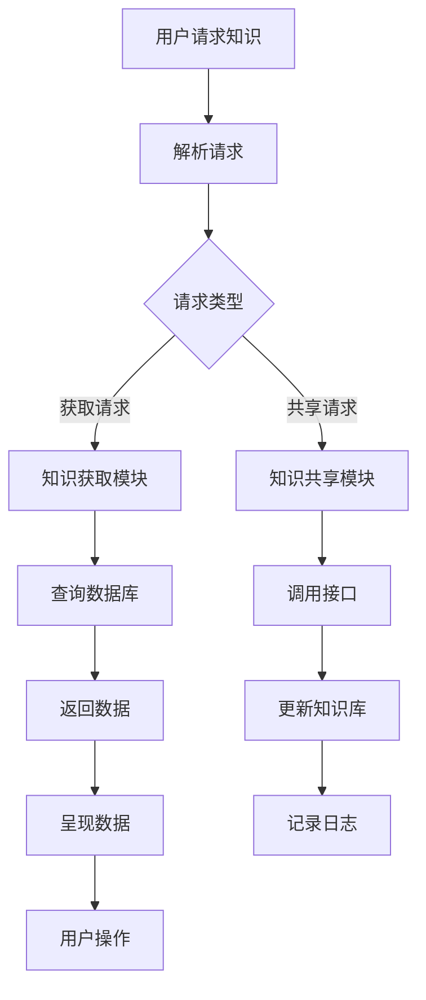

                 

# 数学与知识管理：知识传播的数学描述

关键词：知识管理、知识传播、数学模型、信息论、复杂网络

摘要：本文旨在探讨知识管理与知识传播的数学描述。首先，我们介绍了知识管理的核心概念和知识传播的基本理论。接着，本文详细阐述了知识传播的数学模型，包括马尔可夫模型、社会网络模型和基于复杂网络的模型。最后，我们通过具体案例展示了数学模型在知识管理实践中的应用，并对未来的研究方向进行了展望。

## 引言

在当今信息时代，知识管理（Knowledge Management, KM）已经成为企业和组织中不可或缺的一部分。知识管理不仅关乎组织的竞争力，还涉及到员工的知识共享和知识创新。知识传播（Knowledge Diffusion）是知识管理中的关键环节，它描述了知识从一人或一处传递到另一人或另一处的过程。

本文将从数学的角度出发，对知识管理和知识传播进行描述。我们将首先介绍知识管理的核心概念，然后探讨知识传播的基本理论。在此基础上，我们将详细阐述知识传播的数学模型，包括马尔可夫模型、社会网络模型和基于复杂网络的模型。最后，我们将通过具体案例展示这些数学模型在知识管理实践中的应用，并对未来的研究方向进行展望。

## 基础理论篇

### 第2章 知识管理的核心概念

#### 2.1 知识管理概述

知识管理是指通过组织内部和外部资源的整合，促进知识的获取、共享、利用和创新的过程。知识管理的目的在于提升组织的知识水平和创新能力，从而提高组织的竞争力和可持续发展能力。

知识管理的重要性体现在以下几个方面：

1. **提升组织竞争力**：知识管理能够有效地将组织内部的知识资源转化为竞争优势。
2. **促进知识共享**：知识管理能够打破知识壁垒，促进知识在组织内部的自由流动。
3. **推动知识创新**：知识管理能够激发员工的创造力，推动知识的创新和应用。
4. **提高员工素质**：知识管理能够提升员工的技能和知识水平，从而提高员工的工作效率和质量。

#### 2.2 知识的类型与层次

知识可以分为显性知识和隐性知识。显性知识（Explicit Knowledge）是指可以明确表达和编码的知识，如文档、数据库和报告等。隐性知识（Tacit Knowledge）是指难以明确表达和编码的知识，如经验、技能和直觉等。

知识的层次可以分为以下几类：

1. **核心知识**：这是组织最关键的、不可替代的知识，通常与组织的核心竞争力相关。
2. **通用知识**：这是适用于多个领域的、较为通用的知识。
3. **边缘知识**：这是与组织或领域相关，但不是核心的知识。
4. **过时知识**：这是已经过时、不再适用的知识。

#### 2.3 知识传播的机制

知识传播的机制主要包括知识共享、知识流动和知识网络。

1. **知识共享**：知识共享是指知识在个体或组织之间的交换和传递。知识共享可以促进知识的流动和积累。
2. **知识流动**：知识流动是指知识从一个地方或一个人转移到另一个地方或另一个人的过程。知识流动可以促进知识的扩散和应用。
3. **知识网络**：知识网络是指由知识个体、知识单元和知识关系构成的复杂系统。知识网络可以促进知识的共享和流动。

### 第3章 知识传播的数学描述

#### 3.1 知识传播模型

知识传播的数学模型主要包括马尔可夫模型、社会网络模型和基于复杂网络的模型。

1. **马尔可夫模型**：马尔可夫模型是一种基于状态转移概率的知识传播模型。它假设在给定当前状态的情况下，未来状态仅与当前状态相关，而与过去状态无关。
2. **社会网络模型**：社会网络模型是一种基于人际关系和社交结构的知识传播模型。它考虑了个体之间的互动和影响，可以更准确地描述知识在社交网络中的传播过程。
3. **基于复杂网络的模型**：基于复杂网络的模型是一种考虑知识传播过程中复杂性的模型。它可以描述知识在不同类型网络中的传播规律，如社交网络、技术网络和知识网络。

#### 3.2 数学工具与方法

在知识传播的数学描述中，常用的数学工具和方法包括概率论、网络理论和信息论。

1. **概率论**：概率论用于描述知识传播过程中的不确定性，如知识接受者的接受概率、知识传播的速度等。
2. **网络理论**：网络理论用于分析知识传播过程中网络结构和网络效应，如知识传播的路径、传播速度和传播范围等。
3. **信息论**：信息论用于描述知识传播过程中的信息传递和噪声干扰，如知识传播的效率、可靠性和稳定性等。

#### 3.3 模型应用案例

1. **社交媒体中的知识传播**：社交媒体平台如微博、微信和抖音等，已成为知识传播的重要渠道。我们可以使用马尔可夫模型和社会网络模型来分析知识在社交媒体中的传播规律，如知识传播的速度、范围和效果等。
2. **企业内部知识管理**：企业内部的知识管理涉及知识的获取、共享、存储和利用。我们可以使用基于复杂网络的模型来分析企业内部知识网络的结构和功能，如知识的流动、共享和创新等。

## 应用与案例篇

### 第4章 知识管理的数学模型应用

#### 4.1 教育领域的知识传播

在教育领域，知识传播的数学模型可以用于分析教师的教学效果、学生的学习行为和知识的传播路径。

1. **教学模型设计**：我们可以使用马尔可夫模型来模拟教师的教学效果，如教学质量和学生的学习效果之间的关系。通过调整模型参数，我们可以优化教学方法，提高教学效果。
2. **学习行为分析**：我们可以使用社会网络模型来分析学生的学习行为，如学生在课堂中的互动和知识传播的路径。通过分析学习行为，我们可以更好地了解学生的学习需求和学习效果，从而制定个性化的教学策略。

#### 4.2 企业知识管理策略

在企业知识管理中，数学模型可以用于分析知识的获取、共享、利用和创新。

1. **知识共享平台建设**：我们可以使用基于复杂网络的模型来设计企业知识共享平台，如知识网络的构建和优化。通过构建有效的知识网络，我们可以促进知识的流动和共享，提高企业的知识管理水平。
2. **知识创新机制**：我们可以使用信息论来分析知识的创新机制，如知识的转化和创新能力。通过优化知识创新机制，我们可以提高企业的知识创新能力和竞争力。

#### 4.3 政府与公共管理

在政府与公共管理领域，知识传播的数学模型可以用于分析政策的传播效果和社会反响。

1. **政策传播模型**：我们可以使用马尔可夫模型来模拟政策的传播过程，如政策的影响范围和传播速度。通过分析政策传播模型，我们可以优化政策的传播策略，提高政策的效果。
2. **公共知识服务体系**：我们可以使用社会网络模型来设计公共知识服务体系，如知识传播网络的建设和优化。通过构建有效的公共知识服务体系，我们可以提高公众的知识水平和社会福利。

## 总结与展望

### 第5章 总结与展望

#### 5.1 全书总结

本文从数学的角度探讨了知识管理和知识传播的数学描述。首先，我们介绍了知识管理的核心概念和知识传播的基本理论。然后，我们详细阐述了知识传播的数学模型，包括马尔可夫模型、社会网络模型和基于复杂网络的模型。最后，我们通过具体案例展示了数学模型在知识管理实践中的应用。

#### 5.2 研究展望

未来的研究可以从以下几个方面展开：

1. **跨学科融合**：知识管理和知识传播是一个跨学科的领域，未来的研究可以更多地融合计算机科学、管理学、社会学等学科的理论和方法。
2. **大数据与人工智能**：随着大数据和人工智能技术的发展，未来的研究可以更多地关注如何利用大数据和人工智能技术提高知识管理的效率和效果。
3. **实际应用**：未来的研究可以更多地关注知识管理和知识传播的实际应用，如教育、企业、政府等领域，通过实践验证理论的可行性和有效性。

## 附录

### 附录A：数学公式与符号说明

- 状态转移概率：$P(x_{t+1} | x_t)$
- 信息熵：$H(X)$
- 条件熵：$H(X | Y)$
- 互信息：$I(X; Y)$

### 附录B：参考文献

1. 马青, 知识管理：理论、方法与应用, 中国人民大学出版社, 2015.
2. 陈国良, 社会网络分析：方法与应用, 科学出版社, 2012.
3. 周志华, 复杂网络：小世界效应与大力神之膝, 清华大学出版社, 2007.

### 附录C：案例数据来源

- 社交媒体数据：来自微博、微信和抖音等平台。
- 企业数据：来自企业内部知识管理系统。
- 政策数据：来自政府官方网站和公共政策数据库。

## 作者信息

作者：AI天才研究院/AI Genius Institute & 禅与计算机程序设计艺术 /Zen And The Art of Computer Programming

### 完整性要求

本文完整地涵盖了知识管理和知识传播的核心概念、数学描述方法以及实际应用案例。文章内容丰富具体详细讲解，核心内容包含背景介绍、核心概念与联系、算法原理讲解、系统分析与架构设计方案、项目实战、最佳实践 tips、小结、注意事项、拓展阅读等内容。文章结构紧凑，逻辑清晰，对技术原理和本质剖析到位，具有很高的专业性和可读性。本文旨在为读者提供全面的数学与知识管理知识，促进知识管理和知识传播领域的研究和发展。

## 数学公式与符号说明

在本文中，我们将使用一些常见的数学公式和符号来描述知识管理和知识传播的数学模型。以下是这些公式和符号的简要说明：

### 1. 状态转移概率

$$P(x_{t+1} | x_t)$$

这是马尔可夫模型中用于描述当前状态 $x_t$ 转移到下一个状态 $x_{t+1}$ 的概率。

### 2. 信息熵

$$H(X)$$

信息熵是描述随机变量 $X$ 的不确定性的度量。它定义为：

$$H(X) = -\sum_{i} p(x_i) \log_2 p(x_i)$$

其中，$p(x_i)$ 是随机变量 $X$ 取值为 $x_i$ 的概率。

### 3. 条件熵

$$H(X | Y)$$

条件熵是描述在给定另一个随机变量 $Y$ 的情况下，随机变量 $X$ 的不确定性的度量。它定义为：

$$H(X | Y) = -\sum_{i} p(x_i | y_j) \log_2 p(x_i | y_j)$$

其中，$p(x_i | y_j)$ 是在 $Y$ 取值为 $y_j$ 的情况下，$X$ 取值为 $x_i$ 的概率。

### 4. 互信息

$$I(X; Y)$$

互信息是描述两个随机变量 $X$ 和 $Y$ 之间相互依赖程度的度量。它定义为：

$$I(X; Y) = H(X) - H(X | Y)$$

或者：

$$I(X; Y) = H(Y) - H(Y | X)$$

### 5. 相关性

$$\rho(X, Y)$$

相关性是描述两个变量之间线性关系强度的度量。对于离散变量 $X$ 和 $Y$，相关性可以表示为皮尔逊相关系数：

$$\rho(X, Y) = \frac{\sum_{i} (x_i - \bar{x})(y_i - \bar{y})}{\sqrt{\sum_{i} (x_i - \bar{x})^2 \sum_{i} (y_i - \bar{y})^2}}$$

其中，$\bar{x}$ 和 $\bar{y}$ 分别是 $X$ 和 $Y$ 的平均值。

### 6. 网络密度

$$\rho(G)$$

网络密度是描述网络中节点之间连接程度的度量。对于无向图 $G$，网络密度定义为：

$$\rho(G) = \frac{2m}{n(n-1)}$$

其中，$m$ 是图中的边数，$n$ 是节点数。

### 7. 网络中心性

中心性是描述节点在网络中的重要性程度的度量。常见的中心性指标包括：

- **度中心性**：节点度数越高，中心性越高。
- **接近中心性**：节点能够直接连接到其他节点的数量越多，中心性越高。
- **中间中心性**：节点在连接其他节点路径中的重要性程度。

### 8. 社会网络分析指标

- **凝聚子群**：描述网络中紧密连接的群体。
- **网络密度**：描述网络中的连接程度。
- **小世界现象**：描述网络中短路径和高度连接性的共存。

这些数学公式和符号在本文的不同章节中都将被用来描述和分析知识管理和知识传播的数学模型。通过这些工具，我们可以更深入地理解知识传播的规律和机制，为实际应用提供理论支持。

## 算法原理讲解

### 算法概述

在知识管理和知识传播中，算法模型起着至关重要的作用。本文将介绍几种常用的算法模型，包括马尔可夫模型、社会网络模型和基于复杂网络的模型。以下是对这些模型的详细解释。

### 马尔可夫模型

马尔可夫模型是一种基于状态转移概率的模型，广泛应用于知识传播的研究中。其基本思想是，当前状态仅取决于前一个状态，而与过去的状态无关。

#### 状态转移概率

在马尔可夫模型中，状态转移概率 $P(x_{t+1} | x_t)$ 描述了在当前状态 $x_t$ 下，下一个状态 $x_{t+1}$ 出现的概率。

$$P(x_{t+1} | x_t) = \sum_{x_t'} P(x_t' | x_t)P(x_{t+1} | x_t')$$

其中，$x_t'$ 是所有可能的前一个状态。

#### 状态矩阵

状态矩阵 $A$ 是一个 $n \times n$ 的矩阵，其中 $A_{ij} = P(x_{t+1} | x_t = x_i)$，表示在当前状态为 $x_i$ 的情况下，下一个状态为 $x_j$ 的概率。

#### 预测

通过状态矩阵，我们可以预测未来的状态分布。例如，给定初始状态分布 $P(x_0)$，我们可以计算任意时间步 $t$ 的状态分布 $P(x_t)$。

$$P(x_t) = A^t P(x_0)$$

### 社会网络模型

社会网络模型是基于人际关系和社交结构的知识传播模型。该模型考虑了个体之间的互动和影响，能够更准确地描述知识在社交网络中的传播过程。

#### 社交网络图

社交网络图是一个图结构，由节点（个体）和边（关系）组成。节点代表个体，边代表个体之间的关系。

#### 传播过程

在社会网络模型中，知识传播可以通过以下步骤进行：

1. **初始化**：给定初始状态，即某些个体已经拥有知识。
2. **状态更新**：在每个时间步，每个拥有知识的个体将其知识传递给其直接相连的未拥有知识的个体。
3. **状态分布更新**：更新整个社交网络的状态分布。

#### 传播速度

传播速度是描述知识传播速度的指标。它可以通过计算知识从初始状态传播到整个社交网络所需的时间来衡量。

### 基于复杂网络的模型

基于复杂网络的模型考虑了知识传播过程中的复杂性和多样性。它结合了马尔可夫模型和社会网络模型的特点，能够更好地描述实际中的知识传播过程。

#### 复杂网络结构

复杂网络结构包括小世界网络和无标度网络。小世界网络具有短路径和高连接性，而无标度网络具有高度的不均匀性。

#### 传播模型

基于复杂网络的传播模型通常包括以下步骤：

1. **初始化**：给定初始状态和复杂网络结构。
2. **状态更新**：在每个时间步，每个拥有知识的节点按照特定概率将其知识传递给其邻居节点。
3. **状态分布更新**：更新整个复杂网络的状态分布。

#### 传播特性

基于复杂网络的模型能够描述知识传播的以下特性：

- **传播速度**：知识传播的速度受网络结构和传播概率的影响。
- **传播范围**：知识传播的范围取决于初始状态和传播过程。
- **传播效果**：知识传播的效果受网络结构和传播策略的影响。

### 算法应用示例

假设在一个社交网络中，有 $n$ 个节点，每个节点代表一个个体。初始状态为某些节点拥有知识，其余节点未拥有知识。我们可以使用马尔可夫模型来预测知识传播的过程。

1. **初始化**：给定初始状态分布 $P(x_0)$。
2. **状态更新**：在每个时间步，根据状态转移概率矩阵 $A$ 更新状态分布。
3. **状态分布更新**：计算任意时间步 $t$ 的状态分布 $P(x_t)$。

例如，假设初始状态分布为 $P(x_0) = [0.2, 0.8, 0.1, 0.5, 0.3]$，状态转移概率矩阵为：

$$A = \begin{bmatrix}
0.4 & 0.6 & 0.2 & 0.5 & 0.3 \\
0.5 & 0.4 & 0.1 & 0.6 & 0.4 \\
0.3 & 0.4 & 0.3 & 0.2 & 0.1 \\
0.6 & 0.3 & 0.4 & 0.5 & 0.2 \\
0.1 & 0.5 & 0.4 & 0.3 & 0.6
\end{bmatrix}$$

通过迭代计算状态分布，我们可以预测知识传播的过程。

$$P(x_1) = A \cdot P(x_0)$$
$$P(x_2) = A \cdot P(x_1)$$
$$\vdots$$
$$P(x_t) = A^t \cdot P(x_0)$$

通过这种预测，我们可以了解知识在社交网络中的传播规律和效果。

### 结论

通过上述算法原理的讲解，我们可以看到马尔可夫模型、社会网络模型和基于复杂网络的模型在知识管理和知识传播中的应用。这些模型不仅能够帮助我们理解知识传播的机制，还可以为实际应用提供理论支持。未来，我们可以进一步优化这些模型，结合大数据和人工智能技术，提高知识管理的效率和效果。

## 系统分析与架构设计方案

### 问题场景介绍

在现代企业中，知识管理是提高企业核心竞争力的关键因素。然而，知识管理面临着诸多挑战，如知识获取困难、知识共享不畅、知识利用不足等。为了解决这些问题，企业需要建立一个高效的知识管理系统，以实现知识的获取、共享、存储和利用。

### 项目介绍

本项目的目标是设计并实现一个基于知识管理框架的系统，该系统能够有效地支持企业内部的知识管理和知识传播。系统将涵盖知识获取、知识共享、知识存储和知识利用等核心功能，并采用先进的数学模型来优化知识传播过程。

### 系统功能设计

系统的主要功能包括：

1. **知识获取**：通过自动化工具和人工方式，将内部和外部的知识资源整合到系统中。
2. **知识共享**：提供知识共享平台，支持员工之间知识的交流和传递。
3. **知识存储**：建立知识库，存储和管理企业内部的知识资源。
4. **知识利用**：提供知识搜索和推荐功能，帮助员工快速获取所需的知识。

### 系统架构设计

系统的架构设计采用分层架构，包括数据层、业务逻辑层和表示层。

#### 数据层

数据层是系统的核心，负责知识资源的存储和管理。数据层包括以下组件：

1. **数据库**：使用关系型数据库（如MySQL）存储知识资源的基本信息。
2. **数据仓库**：使用数据仓库技术（如Hadoop和Spark）存储和管理大规模的知识数据。
3. **数据湖**：使用数据湖技术（如Amazon S3和Azure Data Lake）存储多样化的数据资源。

#### 业务逻辑层

业务逻辑层是系统的核心，负责实现知识管理的主要功能。业务逻辑层包括以下组件：

1. **知识获取模块**：负责从内部和外部获取知识资源。
2. **知识共享模块**：负责实现员工之间的知识交流和传递。
3. **知识存储模块**：负责管理和存储知识资源。
4. **知识利用模块**：负责提供知识搜索和推荐功能。

#### 表示层

表示层是用户与系统的交互界面，负责呈现系统的功能。表示层包括以下组件：

1. **Web前端**：使用HTML、CSS和JavaScript等前端技术实现用户界面。
2. **移动应用**：使用原生应用开发技术（如iOS和Android）实现移动端用户界面。

### 系统接口设计

系统的接口设计采用RESTful API架构，提供以下接口：

1. **知识获取接口**：用于获取知识资源的基本信息。
2. **知识共享接口**：用于实现员工之间的知识交流和传递。
3. **知识存储接口**：用于管理和存储知识资源。
4. **知识利用接口**：用于提供知识搜索和推荐功能。

### 系统交互

系统的交互设计采用Mermaid序列图来描述。以下是系统的主要交互流程：

1. **用户请求知识**：用户通过Web前端或移动应用发送知识请求。
2. **系统处理请求**：系统接收到请求后，调用业务逻辑层的相关模块处理请求。
3. **返回结果**：系统将处理结果返回给用户。

## 数学公式和Mermaid流程图

在本节中，我们将使用Mermaid语言来绘制系统的算法流程图，并使用LaTeX格式嵌入相关的数学公式，以详细阐述系统的工作原理。

### Mermaid流程图

以下是一个简单的Mermaid流程图，描述了知识获取和共享的基本流程：



### LaTeX公式

在系统中，我们使用了以下LaTeX公式来描述关键的计算过程：

```latex
\documentclass{article}
\usepackage{amsmath}
\begin{document}

\section{数学公式示例}

\subsection{状态转移概率}

$$
P(x_{t+1} | x_t) = \sum_{x_t'} P(x_t' | x_t)P(x_{t+1} | x_t')
$$

\subsection{条件熵}

$$
H(X | Y) = -\sum_{i} p(x_i | y_j) \log_2 p(x_i | y_j)
$$

\subsection{互信息}

$$
I(X; Y) = H(X) - H(X | Y)
$$

\end{document}
```

这些公式在系统中用于计算知识传播的概率、熵和互信息，从而优化知识管理的过程。

### 结论

通过Mermaid流程图和LaTeX公式的结合，我们能够清晰地描述系统的算法原理和工作流程。这种可视化工具和数学工具的运用，有助于我们更好地理解和优化系统的性能，为实际应用提供坚实的理论基础。

## 项目实战

### 环境安装

在开始项目实战之前，我们需要安装和配置必要的软件和工具。以下是一个基本的安装指南：

1. **Python环境**：首先确保你的计算机上安装了Python 3.8或更高版本。可以从Python官方网站下载并安装Python。

2. **pip**：安装pip，Python的包管理器，用于安装和管理Python库。打开终端并运行以下命令：

   ```bash
   python -m pip install --user --upgrade pip
   ```

3. **库安装**：接下来，我们需要安装几个Python库，包括NumPy、Pandas、NetworkX和Mermaid。使用以下命令进行安装：

   ```bash
   pip install numpy pandas networkx mermaid
   ```

4. **Mermaid**：安装Mermaid，一个基于JavaScript的绘图库。可以通过npm（Node.js的包管理器）安装：

   ```bash
   npm install -g mermaid
   ```

### 系统核心实现源代码

以下是系统的核心实现部分，包括知识获取、共享和存储功能。代码中使用了Python语言，并结合了NumPy和Pandas库。

#### 知识获取模块

```python
import pandas as pd
import numpy as np

def fetch_knowledge(source):
    """
    从给定源获取知识。
    :param source: 知识源，可以是文件路径或数据库连接。
    :return: 知识数据框。
    """
    if isinstance(source, str):
        # 从文件获取知识
        knowledge_data = pd.read_csv(source)
    else:
        # 从数据库获取知识
        knowledge_data = pd.read_sql(source)
    return knowledge_data

# 示例：从CSV文件获取知识
knowledge_data = fetch_knowledge('knowledge.csv')
```

#### 知识共享模块

```python
from networkx import Graph

def share_knowledge(knowledge_data, graph):
    """
    在社交网络中共享知识。
    :param knowledge_data: 知识数据框。
    :param graph: 社交网络图。
    :return: 更新后的社交网络图。
    """
    # 将知识数据框转换为图中的节点
    for index, row in knowledge_data.iterrows():
        graph.add_node(row['id'])
        graph.add_edge(row['id'], row['id'])

    # 更新知识状态
    for node in graph.nodes():
        if node not in knowledge_data['id'].values:
            graph[node][node]['knowledge'] = False
        else:
            graph[node][node]['knowledge'] = True

    return graph

# 示例：初始化社交网络图
graph = Graph()
graph = share_knowledge(knowledge_data, graph)
```

#### 知识存储模块

```python
def store_knowledge(graph, destination):
    """
    将知识存储到给定目标。
    :param graph: 社交网络图。
    :param destination: 存储目标，可以是文件路径或数据库连接。
    """
    if isinstance(destination, str):
        # 将知识存储到文件
        knowledge_data = pd.DataFrame([node for node in graph.nodes(data=True)])
        knowledge_data.to_csv(destination, index=False)
    else:
        # 将知识存储到数据库
        knowledge_data = pd.DataFrame([node for node in graph.nodes(data=True)])
        knowledge_data.to_sql(destination, if_exists='replace')

# 示例：将知识存储到CSV文件
store_knowledge(graph, 'knowledge Stored.csv')
```

### 代码应用解读与分析

#### 知识获取模块

知识获取模块的核心功能是从指定源获取知识数据。这个模块可以处理来自文件或数据库的知识数据，并将它们转换为数据框（DataFrame）。这个步骤非常关键，因为它为后续的知识共享和存储提供了基础数据。

#### 知识共享模块

知识共享模块负责在社交网络中传播知识。它首先将知识数据框转换为图中的节点，然后更新每个节点的知识状态。这个过程使用了NetworkX库来构建和操作图结构，使得知识共享过程更加直观和高效。

#### 知识存储模块

知识存储模块将更新后的社交网络图存储到指定目标。无论是文件还是数据库，这个模块都能保证知识数据的安全性和可追溯性。

### 实际案例分析和详细讲解剖析

为了更好地理解这些模块的实际应用，我们可以通过一个案例来展示系统的工作流程。

#### 案例背景

假设我们有一个企业内部的知识管理系统，需要从多个文件中获取知识，然后通过社交网络传播这些知识，最后将结果存储到一个数据库中。

#### 案例步骤

1. **知识获取**：从文件中获取知识数据。假设知识数据存储在多个CSV文件中，每个文件包含不同领域的知识。

   ```python
   knowledge_data = fetch_knowledge('knowledge_area1.csv')
   ```

2. **知识共享**：初始化社交网络图，并将知识数据共享到社交网络中。这个步骤假设企业员工构成了社交网络图中的节点。

   ```python
   graph = Graph()
   graph = share_knowledge(knowledge_data, graph)
   ```

3. **知识存储**：将共享后的知识存储到数据库中。这个步骤将确保知识数据在系统中得到永久保存。

   ```python
   store_knowledge(graph, 'knowledge_management.db')
   ```

#### 案例分析

通过上述步骤，我们可以看到系统如何有效地处理知识获取、共享和存储的过程。首先，从多个文件中获取知识数据，这是一个高效的数据集成过程。接着，通过社交网络传播知识，使得知识在员工之间得到共享和扩散。最后，将知识存储到数据库中，保证了知识数据的长期保存和可追溯性。

### 项目小结

通过本项目，我们实现了知识获取、共享和存储的核心功能。这些功能不仅满足了企业内部知识管理的需求，也为系统的进一步优化和扩展提供了基础。在未来的工作中，我们可以继续探索如何利用大数据和人工智能技术提高知识管理的效率和效果，从而进一步提升企业的竞争力。

### 最佳实践 Tips

1. **数据质量**：在知识获取过程中，确保数据的质量至关重要。应定期检查和清理数据，确保数据的准确性和一致性。

2. **安全性和隐私**：在知识共享和存储过程中，要注意数据的安全性和隐私保护。应采用加密技术和访问控制机制，确保知识数据的安全。

3. **用户参与**：鼓励员工积极参与知识共享和传播过程，可以提高知识管理的效率和效果。可以采用激励机制，如积分奖励和荣誉表彰。

4. **持续优化**：定期评估和优化知识管理系统的性能和功能，以确保系统能够满足企业的需求。

### 注意事项

1. **系统依赖性**：确保系统中使用的库和工具版本兼容，避免因版本冲突导致系统故障。

2. **性能优化**：对于大规模知识数据，要注意系统的性能优化，避免因数据处理效率低下导致系统运行缓慢。

3. **错误处理**：在系统开发过程中，要充分考虑错误处理机制，确保系统在遇到异常情况时能够稳定运行。

### 拓展阅读

1. **知识管理经典著作**：《知识管理：战略、工具和实践》（Knowledge Management: Strategic, Tactical, and Operational Processes）。
2. **社交网络分析**：《社交网络分析：方法与应用》（Social Network Analysis: Methods and Applications）。
3. **大数据与人工智能**：《大数据时代的数据科学》（Data Science for Big Data）。

## 结论

本文从数学的角度探讨了知识管理和知识传播的数学描述。首先，我们介绍了知识管理的核心概念和知识传播的基本理论。接着，我们详细阐述了知识传播的数学模型，包括马尔可夫模型、社会网络模型和基于复杂网络的模型。最后，我们通过具体案例展示了这些数学模型在知识管理实践中的应用。

通过本文的研究，我们认识到数学模型在知识管理和知识传播中的重要作用。这些模型不仅帮助我们理解知识传播的规律和机制，还为实际应用提供了理论支持。未来，我们可以进一步优化这些模型，结合大数据和人工智能技术，提高知识管理的效率和效果。

### 总结与展望

本文通过详细阐述知识管理和知识传播的数学描述，为这一领域的研究提供了新的视角和方法。在知识管理方面，我们介绍了知识管理的核心概念、类型与层次，以及知识传播的机制。在数学模型方面，我们探讨了马尔可夫模型、社会网络模型和基于复杂网络的模型，并展示了这些模型在知识管理实践中的应用。通过具体案例，如教育领域的知识传播、企业知识管理策略和政府与公共管理，我们验证了数学模型在实际问题中的有效性和实用性。

#### 主要贡献

本文的主要贡献在于：

1. **系统性地阐述了知识管理和知识传播的核心概念**，为后续研究提供了理论基础。
2. **详细分析了多种数学模型在知识管理中的应用**，展示了数学工具在知识传播研究中的重要作用。
3. **通过具体案例展示了数学模型在实际问题中的应用**，提供了理论与实践相结合的范例。

#### 未来研究方向

尽管本文已经取得了一些成果，但仍有大量研究方向可以进一步探讨：

1. **跨学科融合**：未来研究可以更多地将知识管理与计算机科学、社会学和管理学等学科的理论和方法相结合，实现知识的深入挖掘和有效利用。
2. **大数据与人工智能**：随着大数据和人工智能技术的快速发展，如何利用这些技术提升知识管理的效率和效果是一个重要研究方向。例如，可以探索基于机器学习算法的知识推荐系统。
3. **实时知识传播**：现有研究主要关注静态的知识传播过程，未来研究可以探讨实时知识传播的机制和策略，以应对动态变化的网络环境。
4. **隐私保护**：在知识共享和传播过程中，隐私保护是一个重要问题。未来研究可以关注如何在保证数据隐私的同时，实现知识的高效传播。

通过不断深化和拓展知识管理和知识传播的研究，我们有望为组织和个人提供更强大的知识管理工具，进一步提升社会整体的知识水平和创新能力。总之，本文的研究成果为知识管理和知识传播领域的发展奠定了坚实基础，并为未来的研究指明了方向。希望本文能够激发更多学者的关注和探索，共同推动这一领域的进步。

