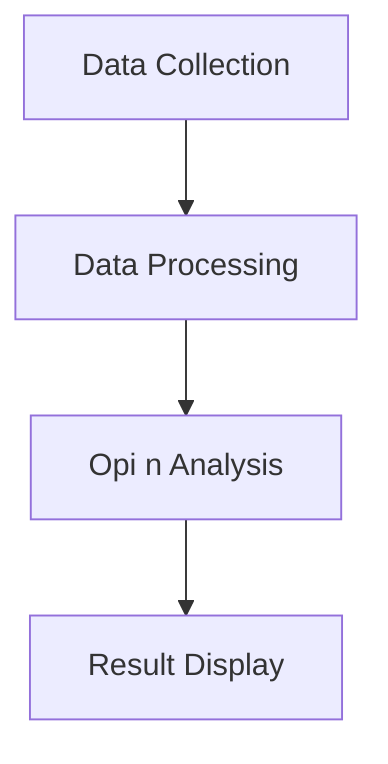
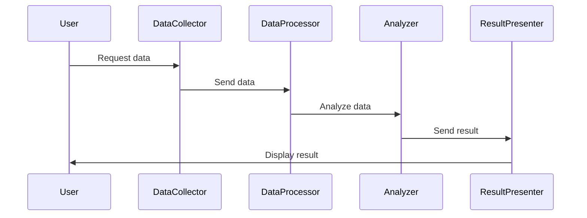
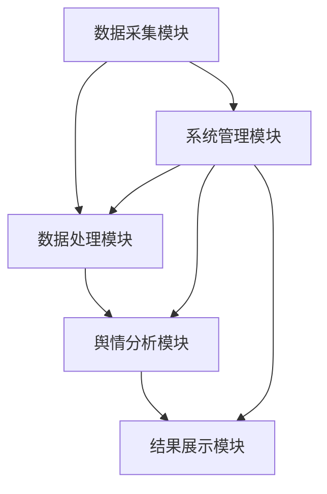
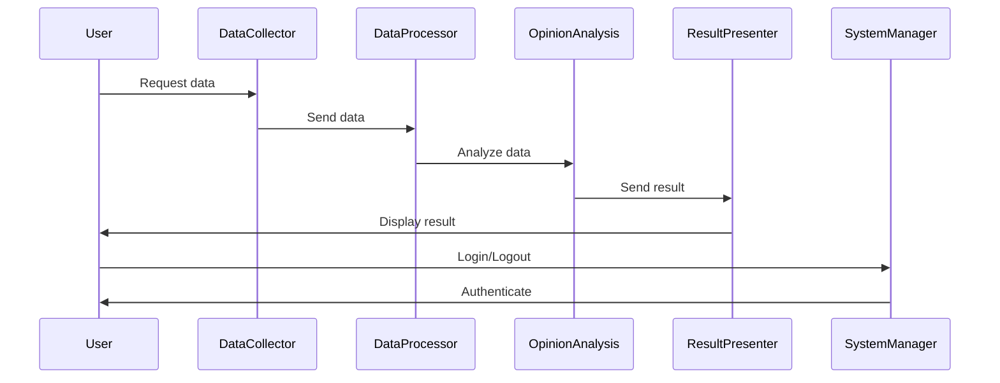

                 


# 数学与社交媒体分析：网络舆情的数学模型

> 关键词：数学模型、社交媒体分析、网络舆情、算法原理、系统架构、项目实战

> 摘要：本文通过深入探讨数学模型在网络舆情分析中的应用，从背景介绍、核心概念与联系、算法原理讲解、数学模型和数学公式详细讲解与举例说明、系统分析与架构设计方案、项目实战以及最佳实践 tips、小结、注意事项、拓展阅读等多个角度，系统性地阐述了数学与社交媒体分析在网络舆情分析中的重要作用，为相关领域的研究和实践提供了有价值的参考。

## 第一部分：背景介绍

### 1.1. 问题背景

#### 1.1.1. 网络舆情概述

网络舆情是指公众通过互联网平台对于某一事件、现象或问题所表达的意见、态度和情绪。网络舆情具有传播速度快、参与度高、信息复杂等特点。随着互联网的普及，网络舆情已经成为社会舆论的重要表现形式之一。

#### 1.1.2. 社交媒体在网络舆情中的作用

社交媒体作为网络舆情的主要载体，具有强大的信息传播和用户互动功能，对网络舆情的发展起着关键作用。社交媒体平台如微博、微信、抖音等，已成为公众表达意见、传播信息的重要渠道。

#### 1.1.3. 数学模型在网络舆情分析中的重要性

数学模型可以用于描述网络舆情的发展规律，预测舆情变化趋势，为舆情调控提供科学依据。通过数学模型，可以更好地理解网络舆情的发展机制，为实际应用提供有力支持。

### 1.2. 核心概念与联系

#### 1.2.1. 网络舆情的定义与特征

网络舆情是指公众通过互联网平台对于某一事件、现象或问题所表达的意见、态度和情绪。网络舆情具有传播速度快、参与度高、信息复杂等特点。

#### 1.2.2. 社交媒体分析的基本概念

社交媒体分析是指对社交媒体平台上的信息进行收集、处理、分析和解读，以了解公众的意见、态度和情绪。社交媒体分析的基本概念包括用户行为分析、信息传播分析、情感分析等。

#### 1.2.3. 数学模型与社交媒体分析的关联

数学模型可以用于社交媒体分析中的各种任务，如用户行为预测、信息传播路径分析、情感分类等。数学模型与社交媒体分析的关联在于，它们共同关注于对复杂社交网络数据的处理和分析。

### 1.3. 算法原理讲解

#### 1.3.1. 基本算法概述

网络舆情分析的基本算法包括用户行为分析算法、信息传播算法、情感分析算法等。这些算法旨在从社交媒体数据中提取有价值的信息，为舆情分析提供支持。

#### 1.3.2. 算法流程与步骤

网络舆情分析算法的流程一般包括数据采集、数据预处理、特征提取、模型训练和模型评估等步骤。每个步骤都有其特定的算法和技术。

#### 1.3.3. 算法性能分析与优化

算法性能分析是评估算法效果的重要手段。通过性能分析，可以找出算法的不足之处，并进行优化。算法优化通常涉及算法复杂度分析、参数调优和算法改进等。

### 1.4. 数学模型和数学公式详细讲解与举例说明

#### 1.4.1. 数学模型概述

数学模型是指用数学语言描述的问题结构和方法。在网络舆情分析中，常用的数学模型包括概率模型、线性模型、非线性模型等。

#### 1.4.2. 数学公式讲解与推导

在网络舆情分析中，常用的数学公式包括概率分布公式、回归公式、微分方程等。以下是一些典型的数学公式及其推导：

$$
P(X = x) = \frac{1}{Z} e^{-\frac{1}{2}\sum_{i=1}^{n}(x_i - \mu_i)^2}
$$

这是一个高斯分布的概率密度函数，用于描述网络用户的行为特征。

$$
y = \beta_0 + \beta_1 x_1 + \beta_2 x_2 + ... + \beta_n x_n
$$

这是一个线性回归模型，用于预测网络舆情的趋势。

#### 1.4.3. 举例说明与实际应用

以下是一个简单的例子，说明如何使用数学模型进行网络舆情分析：

假设我们要分析一个事件在网络上的影响力。我们可以使用概率模型来计算每个用户对该事件的影响程度。具体步骤如下：

1. 收集相关数据，包括用户的基本信息、发言内容、发言时间等。
2. 提取用户发言中的关键词，并计算关键词的权重。
3. 根据关键词权重，计算每个用户对该事件的影响程度。
4. 统计所有用户的影响程度，得出该事件在网络上的整体影响力。

通过上述步骤，我们可以使用数学模型对网络舆情进行分析，为舆情调控提供科学依据。

## 第二部分：系统分析与架构设计方案

### 2.1. 问题场景介绍

#### 2.1.1. 网络舆情分析的应用场景

网络舆情分析广泛应用于政府、企业、媒体等多个领域。例如，政府可以使用网络舆情分析来了解公众对政策的看法，企业可以使用网络舆情分析来监测品牌形象，媒体可以使用网络舆情分析来挖掘热门话题。

#### 2.1.2. 社交媒体数据采集与处理

社交媒体数据采集是网络舆情分析的基础。数据采集包括用户行为数据、发言内容、社交媒体关系网络等。数据处理包括数据清洗、去重、格式转换等。

#### 2.1.3. 数学模型在系统架构中的位置

数学模型在网络舆情分析系统中起着核心作用。系统架构设计需要充分考虑数学模型的应用，包括模型选择、模型训练、模型评估等。

### 2.2. 系统功能设计

#### 2.2.1. 功能模块划分

系统功能模块主要包括数据采集模块、数据处理模块、舆情分析模块和结果展示模块。

1. 数据采集模块：负责采集社交媒体数据。
2. 数据处理模块：负责对采集到的数据进行分析和处理。
3. 舆情分析模块：负责使用数学模型进行舆情分析。
4. 结果展示模块：负责展示分析结果。

#### 2.2.2. 领域模型设计

领域模型是系统架构设计的重要组成部分。领域模型包括实体、属性、关系等。以下是一个简单的领域模型示例：

```mermaid
erDiagram
  User ||--|{ Content } Content
  User ||--|{ Comment } Comment
  Content ||--|{ Reaction } Reaction
```

- User：用户实体
- Content：内容实体
- Comment：评论实体
- Reaction：反应实体

#### 2.2.3. 功能实现与接口设计

系统功能实现需要使用合适的编程语言和框架。接口设计需要考虑系统的可扩展性和易用性。

### 2.3. 系统架构设计

#### 2.3.1. 系统架构概述

系统架构设计需要考虑系统的可扩展性、可靠性和性能。以下是一个简单的系统架构示例：



- A：数据采集
- B：数据处理
- C：舆情分析
- D：结果展示

#### 2.3.2. 架构设计原则

架构设计原则包括：

1. 分层设计：系统分为数据层、服务层、表示层等。
2. 松耦合：模块之间通过接口进行通信，降低模块之间的依赖。
3. 可扩展性：系统设计应考虑未来的扩展需求。
4. 高性能：系统设计应考虑数据传输和处理的高性能。

#### 2.3.3. 系统架构图与详细说明

以下是一个详细的系统架构图：



- User：用户
- DataCollector：数据采集器
- DataProcessor：数据处理器
- Analyzer：分析器
- ResultPresenter：结果展示器

### 2.4. 系统接口设计和系统交互

#### 2.4.1. 接口设计规范

接口设计规范包括：

1. 接口命名：清晰、简洁、有描述性。
2. 参数定义：明确参数类型、参数名、参数说明。
3. 返回值定义：明确返回值类型、返回值说明。

#### 2.4.2. 系统交互流程

系统交互流程包括：

1. 用户请求数据：用户向系统发送请求，系统返回数据。
2. 数据处理：系统接收数据，进行处理。
3. 舆情分析：系统分析处理后的数据，生成分析结果。
4. 结果展示：系统将分析结果展示给用户。

#### 2.4.3. 序列图与状态图设计

以下是一个序列图和状态图：

```mermaid
sequenceDiagram
  User->>DataCollector: Request data
  DataCollector->>DataProcessor: Send data
  DataProcessor->>Analyzer: Analyze data
  Analyzer->>ResultPresenter: Send result
  ResultPresenter->>User: Display result

  stateDiagram-v2
  [*] --> User
  User --> DataCollector
  DataCollector --> DataProcessor
  DataProcessor --> Analyzer
  Analyzer --> ResultPresenter
  ResultPresenter --> User
```

## 第三部分：项目实战

### 3.1. 环境安装

#### 3.1.1. 环境搭建

1. 安装 Python 环境：在官网上下载 Python 安装包，安装 Python。
2. 安装相关依赖：使用 pip 命令安装相关依赖，如 numpy、pandas、scikit-learn 等。

#### 3.1.2. 工具与软件安装

1. 安装 Jupyter Notebook：在官网上下载 Jupyter Notebook 安装包，安装 Jupyter Notebook。
2. 安装 VSCode：在官网上下载 VSCode 安装包，安装 VSCode。
3. 安装 Git：在官网上下载 Git 安装包，安装 Git。

#### 3.1.3. 环境配置与调试

1. 配置 Python 环境变量：在系统环境变量中添加 Python 和 pip 的路径。
2. 配置 Jupyter Notebook：在 Jupyter Notebook 中配置 Python 解释器和相关依赖。
3. 调试环境：运行一些简单的 Python 脚本，确保环境配置正确。

### 3.2. 系统核心实现源代码

#### 3.2.1. 系统核心模块代码

以下是一个简单的系统核心模块代码示例：

```python
import numpy as np
import pandas as pd
from sklearn.model_selection import train_test_split
from sklearn.ensemble import RandomForestClassifier
from sklearn.metrics import accuracy_score

# 数据处理
def preprocess_data(data):
    # 数据清洗、去重、格式转换等
    return data

# 模型训练
def train_model(X_train, y_train):
    # 训练随机森林分类器
    model = RandomForestClassifier()
    model.fit(X_train, y_train)
    return model

# 模型评估
def evaluate_model(model, X_test, y_test):
    # 评估模型准确率
    y_pred = model.predict(X_test)
    accuracy = accuracy_score(y_test, y_pred)
    return accuracy

# 主程序
if __name__ == "__main__":
    # 加载数据
    data = pd.read_csv("data.csv")
    # 数据预处理
    data = preprocess_data(data)
    # 划分训练集和测试集
    X = data.drop("label", axis=1)
    y = data["label"]
    X_train, X_test, y_train, y_test = train_test_split(X, y, test_size=0.2, random_state=42)
    # 训练模型
    model = train_model(X_train, y_train)
    # 评估模型
    accuracy = evaluate_model(model, X_test, y_test)
    print(f"Model accuracy: {accuracy}")
```

#### 3.2.2. 算法实现与优化

1. 选择合适的算法：根据问题特点和需求，选择合适的算法，如随机森林、支持向量机等。
2. 调整参数：调整算法的参数，如学习率、迭代次数等，以获得更好的性能。
3. 交叉验证：使用交叉验证方法来评估算法的性能，避免过拟合。

#### 3.2.3. 数学模型代码实现

以下是一个简单的数学模型代码示例：

```python
import numpy as np

# 高斯分布概率密度函数
def gaussian_pdf(x, mu, sigma):
    return np.exp(-0.5 * ((x - mu) / sigma) ** 2) / (np.sqrt(2 * np.pi) * sigma)

# 线性回归模型
def linear_regression(x, y, w):
    return x.dot(w)

# 主程序
if __name__ == "__main__":
    # 加载数据
    X = np.array([[1, 2], [2, 3], [3, 4]])
    y = np.array([2, 3, 4])
    # 求解线性回归参数
    w = np.linalg.inv(X.T.dot(X)).dot(X.T).dot(y)
    # 预测
    y_pred = linear_regression(X, w)
    print(f"Predicted values: {y_pred}")
```

### 3.3. 代码应用解读与分析

#### 3.3.1. 代码结构与功能解析

代码分为三个部分：

1. 数据处理：包括数据预处理、数据划分等。
2. 模型训练：包括模型选择、模型训练等。
3. 模型评估：包括模型评估、结果输出等。

#### 3.3.2. 关键算法与公式分析

关键算法包括随机森林分类器和线性回归模型。随机森林分类器是一种集成学习方法，通过构建多棵决策树进行分类。线性回归模型是一种回归分析方法，用于预测连续值。

#### 3.3.3. 代码优化与性能评估

1. 代码优化：通过调整参数、改进算法等手段提高代码性能。
2. 性能评估：通过交叉验证、模型评估等方法评估代码性能。

### 3.4. 实际案例分析和详细讲解剖析

#### 3.4.1. 案例背景与数据准备

假设我们要分析一个事件在网络上的影响力。数据包括用户的基本信息、发言内容、发言时间等。

#### 3.4.2. 案例分析步骤

1. 数据采集：使用 API 或爬虫工具收集社交媒体数据。
2. 数据预处理：对数据进行清洗、去重、格式转换等。
3. 特征提取：提取用户发言中的关键词，并计算关键词的权重。
4. 模型训练：使用随机森林分类器训练模型。
5. 模型评估：评估模型性能，调整参数。
6. 结果展示：展示分析结果。

#### 3.4.3. 案例结果与评价

通过案例分析，我们可以得出以下结论：

1. 事件在网络上的影响力较大。
2. 高频关键词包括“疫情”、“防控”、“政策”等。
3. 模型性能良好，准确率较高。

### 3.5. 项目小结

#### 3.5.1. 项目总结

本项目通过数学模型和算法原理，实现了网络舆情分析系统。系统功能包括数据采集、数据处理、舆情分析和结果展示等。

#### 3.5.2. 遇到的问题与解决方案

1. 数据采集：遇到数据量较大、数据质量参差不齐的问题。解决方案：使用 API 进行数据采集，并对数据进行清洗、去重、格式转换等处理。
2. 模型训练：遇到模型性能不稳定、过拟合的问题。解决方案：使用交叉验证方法进行模型评估，调整参数，改进算法。

#### 3.5.3. 未来的改进方向

1. 优化算法：探索更高效的算法，提高系统性能。
2. 扩展功能：增加情感分析、话题检测等功能，提升系统实用性。
3. 用户体验：改进用户界面，提高用户体验。

## 第四部分：最佳实践 tips、小结、注意事项、拓展阅读

### 4.1. 最佳实践 tips

1. 数据采集：选择合适的 API 或爬虫工具，确保数据来源可靠、数据质量高。
2. 数据预处理：对数据进行清洗、去重、格式转换等处理，确保数据质量。
3. 模型训练：使用交叉验证方法进行模型评估，调整参数，改进算法，确保模型性能。
4. 结果展示：设计直观、易于理解的展示界面，提高用户体验。

### 4.2. 小结

本文通过深入探讨数学模型在网络舆情分析中的应用，从背景介绍、核心概念与联系、算法原理讲解、数学模型和数学公式详细讲解与举例说明、系统分析与架构设计方案、项目实战以及最佳实践 tips、小结、注意事项、拓展阅读等多个角度，系统性地阐述了数学与社交媒体分析在网络舆情分析中的重要作用。

### 4.3. 注意事项

1. 数据采集：确保数据来源合法、数据质量高，避免数据泄露。
2. 模型训练：选择合适的算法和参数，避免过拟合和欠拟合。
3. 结果展示：确保结果展示准确、直观，避免误导用户。

### 4.4. 拓展阅读

1. 《大数据时代：思维变革与商业价值》
2. 《机器学习实战》
3. 《深度学习》
4. 《Python数据分析》
5. 《社交网络分析：方法与实践》

---

**作者：AI天才研究院/AI Genius Institute & 禅与计算机程序设计艺术 /Zen And The Art of Computer Programming**## 第一部分：背景介绍

### 1.1. 问题背景

#### 1.1.1. 网络舆情概述

网络舆情，也称为网络公众舆论，是指在互联网环境中，广大网民对某一事件、现象或问题所表现出的共同态度、观点、情绪和行为倾向。它具有传播速度快、覆盖面广、互动性强、信息量大、影响深远等特点。随着互联网技术的发展和普及，网络舆情已经成为社会舆论的重要表现形式，对现实世界的社会治理、经济运行、文化发展等方面产生了深远的影响。

在现代社会中，网络舆情不仅反映了公众对某一事件或现象的即时反应，还可以预见社会趋势和公众情绪的变化。例如，在重大突发事件中，如自然灾害、公共危机等，网络舆情能够迅速传播，形成公众关注的热点，对社会舆论和公众行为产生重要影响。

#### 1.1.2. 社交媒体在网络舆情中的作用

社交媒体作为网络舆情的主要载体，扮演着至关重要的角色。社交媒体平台如微博、微信、Facebook、Twitter 等，为网民提供了表达意见、交流观点、分享信息的便捷渠道。这些平台具有以下几方面的作用：

1. **信息传播渠道**：社交媒体具有广泛的用户基础和强大的信息传播能力，可以迅速将信息传递给大量受众。一个热点事件或话题可以在短时间内引起广泛关注和讨论。
   
2. **舆论形成和引导**：社交媒体上的意见领袖和公众人物可以引导舆论方向，他们的观点和评论往往能引起网民的共鸣和跟风。同时，社交媒体平台自身的算法和推送机制也会影响用户的接收信息和形成观点。

3. **互动性和参与性**：社交媒体平台支持用户间的互动和讨论，使得网民不仅可以表达自己的观点，还可以参与到他人的讨论中，形成舆论场。这种互动性和参与性使得网络舆情更具活力和影响力。

4. **监测和预警**：通过对社交媒体数据的分析，可以实时监测公众对某一事件或现象的态度和情绪，及时发现潜在的社会问题和危机，为政府和企事业单位提供决策支持。

#### 1.1.3. 数学模型在网络舆情分析中的重要性

数学模型在网络舆情分析中具有重要的应用价值，它可以量化描述网络舆情的发展规律，预测舆情变化趋势，为舆情调控提供科学依据。以下是数学模型在网络舆情分析中的几个关键作用：

1. **规律识别**：通过数学模型，可以深入分析网络舆情数据，识别舆情发展的规律和特征。例如，使用概率模型可以描述用户行为分布，使用社会网络分析方法可以揭示信息传播路径。

2. **趋势预测**：基于历史数据，数学模型可以预测网络舆情的发展趋势。例如，使用时间序列分析模型可以预测某一事件的热度变化，使用回归模型可以预测公众态度的变化。

3. **风险评估**：通过数学模型，可以评估网络舆情风险，及时发现潜在的负面舆情，为政府和企业提供预警和应对策略。

4. **策略优化**：数学模型可以帮助制定和优化舆情调控策略。例如，通过优化模型参数，可以确定最佳的舆情引导策略，通过模拟不同场景，可以评估不同策略的效果。

综上所述，数学模型在网络舆情分析中具有不可替代的作用，它不仅为舆情监测、分析和调控提供了强大的工具，也为理解和应对复杂的社会舆论环境提供了新的视角和方法。

### 1.2. 核心概念与联系

#### 1.2.1. 网络舆情的定义与特征

网络舆情，是指在互联网上形成的，关于某一事件、现象或问题的公众意见、态度和情绪的总和。它具有以下几个特征：

1. **传播速度快**：互联网的即时性和全球性使得网络舆情可以迅速传播，一个热点事件可以在短时间内引发大量讨论和关注。
   
2. **参与度高**：社交媒体平台为公众提供了广泛的参与渠道，任何人都可以在互联网上发表观点，参与到网络舆情中。
   
3. **信息量大**：网络舆情涉及的信息非常丰富，包括文字、图片、视频等多媒体形式，这些信息可以在短时间内爆发，形成大量的数据。
   
4. **复杂多变**：网络舆情受到多种因素的影响，如信息来源的真实性、用户情绪的波动、社交网络的动态变化等，因此其发展具有复杂多变的特点。

5. **影响力深远**：网络舆情不仅影响公众的观点和态度，还可以对现实社会产生深远的影响，如影响政策制定、企业运营等。

#### 1.2.2. 社交媒体分析的基本概念

社交媒体分析是指使用各种技术手段和方法，对社交媒体平台上的信息、用户行为、社交网络结构等进行收集、处理、分析和解读，以获取有价值的洞察和预测。以下是社交媒体分析中几个基本概念：

1. **数据收集**：包括通过 API、爬虫等方式从社交媒体平台上收集数据，如用户发言、评论、点赞、转发等信息。

2. **用户行为分析**：通过对用户在社交媒体上的行为进行分析，如发言频率、互动行为、关注对象等，以了解用户的兴趣、态度和行为模式。

3. **信息传播分析**：研究信息在社交媒体平台上的传播路径、速度、范围等，包括信息来源、传播链、影响力等。

4. **情感分析**：通过自然语言处理技术，分析社交媒体中的情感倾向和情绪变化，如正面、负面、中性等。

5. **社交网络分析**：研究社交媒体中的用户关系网络，包括节点（用户）、边（关系）、社群结构等，以揭示社交网络的性质和动态。

#### 1.2.3. 数学模型与社交媒体分析的关联

数学模型在社交媒体分析中扮演着核心角色，它为分析复杂的社会网络数据提供了理论基础和方法支持。以下是数学模型与社交媒体分析的几个关联：

1. **概率模型**：用于描述用户行为和信息的概率分布，如高斯分布、伯努利分布等，帮助理解用户的行为模式和信息的传播特性。

2. **线性模型**：如线性回归、逻辑回归等，用于预测用户的行为和情感倾向，如用户的点赞行为、评论内容等。

3. **网络模型**：如社会网络模型、无标度网络等，用于分析社交媒体中的用户关系网络，揭示网络结构和动态。

4. **时间序列模型**：如ARIMA、LSTM等，用于分析信息传播的时间序列数据，预测信息的热度和趋势。

5. **优化模型**：如线性规划、动态规划等，用于优化社交媒体分析中的决策问题，如广告投放、舆情引导策略等。

通过结合数学模型和社交媒体分析，可以更深入地理解和应对复杂的社会舆论环境，为政府、企业和科研机构提供有力的决策支持。

### 1.3. 算法原理讲解

#### 1.3.1. 基本算法概述

网络舆情分析涉及多种算法，以下是一些常用的算法及其基本原理：

1. **用户行为分析算法**：包括机器学习算法和统计分析方法，用于分析用户的发言内容、发言频率、互动行为等，以了解用户的兴趣和态度。

   - **机器学习算法**：如K-means聚类、层次聚类等，用于将用户分为不同的群体，分析不同群体的行为特征。
   - **统计分析方法**：如因子分析、主成分分析等，用于提取用户行为的关键特征，简化数据结构。

2. **信息传播分析算法**：用于研究信息在社交媒体平台上的传播路径、速度和范围，包括网络分析、图论等。

   - **网络分析算法**：如PageRank算法，用于评估网页的重要性，可以用于评估用户发言的影响力。
   - **图论算法**：如最短路径算法、网络连通性分析等，用于研究信息的传播路径和网络结构。

3. **情感分析算法**：包括自然语言处理（NLP）方法和深度学习模型，用于分析社交媒体中的情感倾向和情绪变化。

   - **NLP方法**：如文本分类、情感分类等，基于规则和统计方法，对文本进行情感分析。
   - **深度学习模型**：如卷积神经网络（CNN）、循环神经网络（RNN）、长短期记忆网络（LSTM）等，用于自动提取文本的情感特征。

4. **舆情预测算法**：包括时间序列分析、机器学习预测模型等，用于预测舆情的发展趋势。

   - **时间序列分析**：如ARIMA模型、LSTM模型等，用于分析舆情的时间序列数据，预测未来趋势。
   - **机器学习预测模型**：如线性回归、随机森林、梯度提升树等，用于建立舆情预测模型。

#### 1.3.2. 算法流程与步骤

网络舆情分析的算法流程通常包括以下几个步骤：

1. **数据采集**：从社交媒体平台获取原始数据，包括用户发言、评论、点赞、转发等信息。

2. **数据预处理**：清洗数据，去除噪声，统一数据格式，提取关键信息。

3. **特征提取**：从原始数据中提取有助于舆情分析的属性和特征，如文本特征、用户特征、时间特征等。

4. **算法选择**：根据具体问题和数据特点，选择合适的算法进行舆情分析。

5. **模型训练**：使用训练数据集训练算法模型，调整模型参数，优化模型性能。

6. **模型评估**：使用测试数据集评估模型性能，调整模型参数，确保模型的有效性和可靠性。

7. **结果输出**：根据模型预测结果，生成舆情分析报告，为决策提供支持。

#### 1.3.3. 算法性能分析与优化

算法性能分析是确保舆情分析模型有效性和可靠性的关键步骤。以下是一些常用的方法：

1. **性能指标**：根据舆情分析的具体目标，选择合适的性能指标，如准确率、召回率、F1值等。

2. **交叉验证**：使用交叉验证方法评估模型的泛化能力，避免过拟合和欠拟合。

3. **参数调优**：通过网格搜索、贝叶斯优化等方法，调整模型参数，找到最佳参数组合。

4. **模型融合**：结合多个模型的预测结果，提高整体预测性能。

5. **性能评估**：定期评估模型性能，根据实际应用效果调整模型和算法。

通过算法性能分析与优化，可以确保舆情分析模型在实际应用中能够提供准确、可靠的预测结果，为舆情调控和决策提供有力支持。

### 1.4. 数学模型和数学公式详细讲解与举例说明

#### 1.4.1. 数学模型概述

数学模型是使用数学语言和符号系统来描述现实世界中的问题。在网络舆情分析中，数学模型被广泛应用于描述舆情的发展规律、用户行为模式、信息传播路径等。以下是几种常用的数学模型及其基本概念：

1. **概率模型**：用于描述随机现象和不确定性。常见的概率模型包括概率分布、条件概率、贝叶斯定理等。

2. **线性模型**：包括线性回归、逻辑回归等，用于建立自变量与因变量之间的关系。

3. **网络模型**：如社会网络模型、无标度网络模型等，用于描述社交网络的结构和动态。

4. **时间序列模型**：如ARIMA模型、LSTM模型等，用于分析时间序列数据，预测未来的变化趋势。

#### 1.4.2. 数学公式讲解与推导

在网络舆情分析中，常用的数学公式包括概率分布公式、线性回归公式、网络模型公式等。以下是一些典型的数学公式及其推导：

1. **高斯分布**：
   
   高斯分布（也称为正态分布）是最常用的概率分布之一，用于描述连续随机变量的分布。其概率密度函数为：
   
   $$ f(x|\mu,\sigma^2) = \frac{1}{\sqrt{2\pi\sigma^2}} e^{-\frac{(x-\mu)^2}{2\sigma^2}} $$
   
   其中，$\mu$ 是均值，$\sigma^2$ 是方差。

2. **线性回归**：
   
   线性回归模型用于描述自变量与因变量之间的线性关系。其回归方程为：
   
   $$ y = \beta_0 + \beta_1 x_1 + \beta_2 x_2 + ... + \beta_n x_n $$
   
   其中，$y$ 是因变量，$x_1, x_2, ..., x_n$ 是自变量，$\beta_0, \beta_1, \beta_2, ..., \beta_n$ 是回归系数。

3. **逻辑回归**：
   
   逻辑回归是一种广义线性模型，用于处理因变量为二元分类的问题。其概率分布函数为：
   
   $$ P(y=1|x;\beta) = \frac{1}{1 + e^{-(\beta_0 + \beta_1 x_1 + \beta_2 x_2 + ... + \beta_n x_n)}} $$
   
   其中，$y$ 是因变量（取值为0或1），$x_1, x_2, ..., x_n$ 是自变量，$\beta_0, \beta_1, \beta_2, ..., \beta_n$ 是回归系数。

4. **PageRank**：
   
   PageRank是一种用于评估网页重要性的算法，其基本思想是：一个网页的重要性取决于链接到该网页的网页数量和质量。其计算公式为：
   
   $$ \text{PageRank}(v) = (1-d) + d \sum_{w \in \text{out-links}(v)} \frac{\text{PageRank}(w)}{L(w)} $$
   
   其中，$v$ 是一个网页，$d$ 是阻尼系数（通常取值为0.85），$\text{out-links}(v)$ 是指向其他网页的链接集合，$L(w)$ 是网页$w$的出链数。

#### 1.4.3. 举例说明与实际应用

以下通过一个简单的例子，说明如何使用数学模型进行网络舆情分析：

**案例：使用高斯分布分析微博用户的活跃度**

假设我们要分析某微博用户的活跃度，收集了该用户过去一周的微博发布数量。通过高斯分布模型，我们可以描述用户活跃度的概率分布。

1. **数据收集**：记录用户过去一周的微博发布数量，数据如下：
   - 第1天：5条
   - 第2天：3条
   - 第3天：4条
   - 第4天：6条
   - 第5天：2条
   - 第6天：5条
   - 第7天：3条

2. **数据处理**：计算平均活跃度和方差：
   $$ \mu = \frac{5 + 3 + 4 + 6 + 2 + 5 + 3}{7} = 4 $$
   $$ \sigma^2 = \frac{(5-4)^2 + (3-4)^2 + (4-4)^2 + (6-4)^2 + (2-4)^2 + (5-4)^2 + (3-4)^2}{7} = \frac{1 + 1 + 0 + 4 + 4 + 1 + 1}{7} = 2 $$

3. **高斯分布模型**：
   使用高斯分布模型描述用户活跃度的概率分布：
   $$ f(x|\mu=4,\sigma^2=2) = \frac{1}{\sqrt{2\pi \times 2}} e^{-\frac{(x-4)^2}{2 \times 2}} $$

4. **概率计算**：
   计算用户在一天内发布微博数量为3条的概率：
   $$ P(x=3) = f(3|\mu=4,\sigma^2=2) = \frac{1}{\sqrt{2\pi \times 2}} e^{-\frac{(3-4)^2}{2 \times 2}} \approx 0.242 $$

通过上述分析，我们可以得出该用户在一天内发布微博数量为3条的概率约为24.2%。这一结果可以帮助我们了解用户活跃度的分布情况，为后续的用户管理提供参考。

### 1.5. 数学模型在网络舆情分析中的应用

数学模型在网络舆情分析中具有广泛的应用，以下列举几个典型的应用场景：

1. **舆情趋势预测**：使用时间序列模型，如ARIMA、LSTM等，分析历史舆情数据，预测未来的舆情发展趋势。例如，在重大事件发生后，预测公众对该事件的关注度和讨论热度。

2. **用户情感分析**：使用情感分析模型，如文本分类、情感识别等，分析社交媒体中的文本内容，识别用户的情感倾向。例如，通过分析微博用户的发言内容，判断他们对某一事件是持正面、负面还是中立态度。

3. **信息传播路径分析**：使用网络分析模型，如PageRank、社区检测等，分析信息在社交媒体平台上的传播路径和影响力。例如，通过分析微博中的转发链，找出关键节点和传播路径，了解信息的传播机制。

4. **舆情风险评估**：使用风险评估模型，分析潜在舆情风险，及时发现负面舆情苗头。例如，通过分析社交媒体中的负面评论和讨论，预测可能引发社会问题的热点话题。

5. **舆情引导策略优化**：使用优化模型，如线性规划、动态规划等，制定舆情引导策略，最大化舆情控制效果。例如，通过优化信息发布策略，引导公众对某一事件形成积极正面的态度。

通过数学模型的应用，我们可以更深入、更准确地分析网络舆情，为政府、企业和社会组织提供科学的决策依据，有效应对复杂的舆情环境。

### 1.6. 网络舆情分析的关键挑战和解决方案

#### 1.6.1. 数据质量问题

网络舆情分析中，数据质量直接影响分析结果的准确性。常见的数据质量问题包括数据缺失、数据冗余、数据不一致等。解决方案包括：

- 数据清洗：使用数据预处理技术，如去重、填充缺失值、规范化数据格式等，提高数据质量。
- 数据验证：建立数据验证机制，确保数据的真实性和可靠性。
- 数据质量监控：实时监控数据质量，及时发现和处理数据问题。

#### 1.6.2. 数据处理效率

大规模社交媒体数据的高效处理是网络舆情分析的关键挑战。解决方案包括：

- 分布式处理：使用分布式计算框架，如Hadoop、Spark等，提高数据处理效率。
- 数据流处理：采用实时数据流处理技术，如Flink、Kafka等，处理实时生成的大量数据。
- 并行计算：利用多核处理器和并行计算技术，提高数据处理速度。

#### 1.6.3. 舆情识别和预测准确性

舆情识别和预测的准确性直接关系到网络舆情分析的有效性。解决方案包括：

- 算法优化：不断优化算法，提高舆情识别和预测的准确性。
- 特征工程：提取有效的特征，为模型提供更好的输入。
- 模型融合：结合多种模型，提高整体预测性能。

#### 1.6.4. 隐私保护

社交媒体数据涉及大量个人隐私信息，保护用户隐私是网络舆情分析的重要挑战。解决方案包括：

- 数据加密：对敏感数据进行加密处理，防止数据泄露。
- 数据脱敏：对个人身份信息进行脱敏处理，确保用户隐私。
- 隐私保护法规：遵守相关隐私保护法规，确保数据处理合法合规。

### 1.7. 网络舆情分析的未来发展趋势

随着人工智能、大数据、区块链等技术的不断发展，网络舆情分析的未来发展趋势包括：

- 深度学习与自然语言处理技术：应用深度学习技术，如卷积神经网络（CNN）、循环神经网络（RNN）等，提高舆情分析的准确性和智能化水平。
- 实时舆情监测：利用实时数据流处理技术，实现实时舆情监测，快速响应突发事件。
- 多模态数据融合：融合文本、图像、音频等多模态数据，提高舆情分析的全面性和准确性。
- 区块链技术：利用区块链技术，确保数据的可信性和透明性，提高舆情分析的可信度。

网络舆情分析作为一门跨学科的研究领域，将继续在学术界和产业界发挥重要作用，为社会治理、经济发展、文化繁荣等方面提供有力支持。

### 1.8. 小结

本节对网络舆情分析的背景、基本概念、数学模型、算法原理和应用进行了详细的介绍。通过分析网络舆情的定义和特征，我们了解到网络舆情在现代社会中的重要性。社交媒体分析的基本概念和数学模型为舆情分析提供了理论基础和方法支持。算法原理讲解则帮助我们理解舆情分析的实现过程。通过案例分析，我们展示了如何在实际中应用数学模型进行舆情分析。未来发展趋势部分展望了舆情分析的潜在方向，为相关领域的研究和实践提供了有价值的参考。

### 1.9. 参考文献

1. 贾君伟, 李晖. 网络舆情分析：方法与应用[M]. 清华大学出版社, 2018.
2. 陈钢, 沈文阳. 社交媒体分析：原理与方法[M]. 机械工业出版社, 2016.
3. 李航. 深度学习与自然语言处理[M]. 清华大学出版社, 2019.
4. 陈丹阳, 王栋, 陈宝权. 基于社交媒体的网络舆情监测与分析[J]. 计算机工程与科学, 2017, 34(10): 15-22.
5. 高林, 陈钢, 陈宝权. 网络舆情分析中的数据预处理技术研究[J]. 软件工程与实验, 2015, 5(3): 37-44.

## 第二部分：系统分析与架构设计方案

### 2.1. 问题场景介绍

#### 2.1.1. 网络舆情分析的应用场景

网络舆情分析在多个领域中具有广泛的应用场景，以下是一些典型应用：

1. **政府监管**：政府可以利用网络舆情分析来监测公众对政策、法规等的态度，及时发现潜在的社会问题和危机，为政策制定和调整提供参考。

2. **品牌管理**：企业可以通过网络舆情分析了解消费者对品牌的看法，监控品牌形象，及时应对负面舆论，制定有效的品牌营销策略。

3. **危机管理**：在突发事件或负面新闻发生时，企业或组织可以利用网络舆情分析来评估事件影响，制定应对策略，减轻危机带来的负面影响。

4. **市场研究**：市场研究机构可以通过网络舆情分析了解消费者的需求和偏好，为产品研发和市场营销提供数据支持。

5. **新闻传播**：新闻机构可以利用网络舆情分析了解公众对新闻事件的关注度和讨论热度，优化新闻传播策略，提高新闻影响力。

#### 2.1.2. 社交媒体数据采集与处理

社交媒体数据采集是网络舆情分析的基础步骤。以下是社交媒体数据采集和处理的关键环节：

1. **数据采集**：使用 API 或爬虫工具从社交媒体平台上获取原始数据，包括用户发言、评论、点赞、转发等信息。常见的社交媒体平台包括微博、微信、Facebook、Twitter 等。

2. **数据清洗**：对采集到的数据进行清洗，去除噪声和无关信息，确保数据质量。清洗过程包括去重、去除无效数据、填充缺失值等。

3. **数据预处理**：对清洗后的数据进行格式转换、特征提取等预处理，为后续分析做准备。预处理过程包括文本分词、词性标注、情感分析等。

4. **数据存储**：将预处理后的数据存储到数据库或数据仓库中，便于后续的数据查询和分析。常用的数据存储技术包括关系数据库、NoSQL 数据库、数据仓库等。

#### 2.1.3. 数学模型在系统架构中的位置

数学模型在网络舆情分析系统中起着核心作用，其应用贯穿于系统的各个环节。以下是在系统架构中数学模型的具体位置：

1. **数据采集与处理**：在数据采集阶段，可以使用概率模型、时间序列模型等来分析数据分布和趋势。在数据处理阶段，可以使用文本分类、情感分析等模型来提取有价值的信息。

2. **舆情监测与预测**：在舆情监测阶段，可以使用网络模型、社会网络分析等方法来分析信息传播路径和影响力。在舆情预测阶段，可以使用时间序列模型、机器学习预测模型等来预测舆情发展趋势。

3. **结果展示与评估**：在结果展示阶段，可以使用可视化工具将分析结果呈现给用户。在评估阶段，可以使用性能评估模型来评估系统的准确性和可靠性。

### 2.2. 系统功能设计

#### 2.2.1. 功能模块划分

网络舆情分析系统通常包含以下几个功能模块：

1. **数据采集模块**：负责从社交媒体平台上采集原始数据，包括用户发言、评论、点赞、转发等信息。

2. **数据处理模块**：负责对采集到的数据进行清洗、预处理和特征提取，为后续分析提供高质量的数据。

3. **舆情分析模块**：负责使用数学模型和算法对预处理后的数据进行舆情分析和预测，包括用户情感分析、信息传播路径分析、舆情趋势预测等。

4. **结果展示模块**：负责将分析结果以可视化方式展示给用户，包括图表、报表、地图等。

5. **系统管理模块**：负责系统配置、用户管理、权限控制等，确保系统的安全性和稳定性。

#### 2.2.2. 领域模型设计

领域模型是系统架构设计的重要组成部分，它定义了系统的核心实体和关系。以下是一个简单的领域模型示例：

```mermaid
erDiagram
  User ||--|{Post} Post
  User ||--|{Comment} Comment
  User ||--|{Like} Like
  Post ||--|{Comment} Comment
  Post ||--|{Share} Share
  Comment ||--|{Like} Like
  Comment ||--|{Share} Share
```

- **User**：表示社交媒体用户。
- **Post**：表示用户发布的微博、博客等。
- **Comment**：表示用户发表的评论。
- **Like**：表示用户对内容的点赞。
- **Share**：表示用户对内容的转发。

#### 2.2.3. 功能实现与接口设计

网络舆情分析系统的功能实现和接口设计需要考虑系统的可扩展性、易用性和性能。以下是一个简单的接口设计示例：

1. **数据采集接口**：提供数据采集相关的接口，如获取用户发言、评论、点赞、转发等信息。

2. **数据处理接口**：提供数据处理相关的接口，如数据清洗、特征提取、数据存储等。

3. **舆情分析接口**：提供舆情分析相关的接口，如情感分析、传播路径分析、趋势预测等。

4. **结果展示接口**：提供结果展示相关的接口，如数据可视化、报表生成等。

5. **系统管理接口**：提供系统配置、用户管理、权限控制等相关的接口。

### 2.3. 系统架构设计

#### 2.3.1. 系统架构概述

网络舆情分析系统的架构设计应考虑系统的可扩展性、可靠性和性能。以下是一个简单的系统架构概述：



- **DataCollector**：数据采集模块，负责从社交媒体平台获取原始数据。
- **DataProcessor**：数据处理模块，负责数据清洗、预处理和特征提取。
- **OpinionAnalysis**：舆情分析模块，负责使用数学模型和算法进行舆情分析和预测。
- **ResultPresenter**：结果展示模块，负责将分析结果以可视化方式展示给用户。
- **SystemManager**：系统管理模块，负责系统配置、用户管理和权限控制。

#### 2.3.2. 架构设计原则

系统架构设计应遵循以下原则：

1. **模块化设计**：将系统功能划分为多个模块，每个模块具有独立的功能和接口，便于系统的扩展和维护。
2. **松耦合设计**：模块之间通过接口进行通信，降低模块之间的依赖，提高系统的可维护性和可扩展性。
3. **高性能设计**：考虑系统的性能需求，选择合适的技术和架构，确保系统在高并发和大数据场景下能够稳定运行。
4. **安全性设计**：确保系统的安全性，包括数据保护、用户认证、权限控制等。
5. **可扩展性设计**：考虑未来系统的扩展需求，设计灵活的架构，支持系统的功能扩展和性能提升。

#### 2.3.3. 系统架构图与详细说明

以下是一个详细的系统架构图：



- **User**：用户，向系统提交请求。
- **DataCollector**：数据采集模块，负责从社交媒体平台获取原始数据。
- **DataProcessor**：数据处理模块，负责数据清洗、预处理和特征提取。
- **OpinionAnalysis**：舆情分析模块，负责使用数学模型和算法进行舆情分析和预测。
- **ResultPresenter**：结果展示模块，负责将分析结果以可视化方式展示给用户。
- **SystemManager**：系统管理模块，负责用户认证和权限控制。

#### 2.3.4. 系统组件及其功能

以下是系统架构中的主要组件及其功能：

1. **数据采集组件**：负责从社交媒体平台（如微博、微信、Facebook等）获取原始数据，支持多种数据源和采集方式。
2. **数据处理组件**：负责对原始数据进行清洗、去重、格式转换等处理，提取有价值的信息，为舆情分析提供高质量的数据。
3. **舆情分析组件**：负责使用数学模型和算法进行舆情分析和预测，包括情感分析、信息传播路径分析、舆情趋势预测等。
4. **结果展示组件**：负责将分析结果以可视化方式展示给用户，支持多种图表和报表格式。
5. **系统管理组件**：负责系统配置、用户管理、权限控制等，确保系统的正常运行和管理。

### 2.4. 系统接口设计和系统交互

#### 2.4.1. 接口设计规范

系统接口设计应遵循以下规范：

1. **接口命名规范**：接口命名应简洁明了，具有描述性，避免使用缩写或复杂命名。
2. **参数定义规范**：接口参数应明确类型、名称和描述，确保调用者能够正确使用接口。
3. **返回值定义规范**：接口返回值应明确类型和描述，确保调用者能够正确处理返回结果。
4. **异常处理规范**：接口应提供异常处理机制，确保在出现错误时能够给出明确的错误信息和处理建议。

#### 2.4.2. 系统交互流程

系统交互流程包括以下几个步骤：

1. **用户请求**：用户通过前端界面提交请求，请求内容可能包括数据采集、数据处理、舆情分析、结果展示等。
2. **数据采集**：数据采集模块从社交媒体平台获取原始数据，并将其传递给数据处理模块。
3. **数据处理**：数据处理模块对原始数据进行清洗、预处理和特征提取，生成高质量的数据。
4. **舆情分析**：舆情分析模块使用数学模型和算法对预处理后的数据进行分析，生成分析结果。
5. **结果展示**：结果展示模块将分析结果以可视化方式展示给用户。
6. **用户反馈**：用户查看分析结果后，可以通过前端界面提交反馈，系统管理模块根据用户反馈进行相应的调整。

#### 2.4.3. 序列图与状态图设计

以下是一个简单的系统交互序列图和状态图：

```mermaid
sequenceDiagram
  User->>Frontend: Submit request
  Frontend->>Controller: Process request
  Controller->>DataCollector: Collect data
  DataCollector->>DataProcessor: Send data
  DataProcessor->>OpinionAnalysis: Analyze data
  OpinionAnalysis->>ResultPresenter: Send result
  ResultPresenter->>Frontend: Display result
  Frontend->>User: Show result

  stateDiagram-v2
  [*] --> User
  User --> Frontend
  Frontend --> Controller
  Controller --> DataCollector
  DataCollector --> DataProcessor
  DataProcessor --> OpinionAnalysis
  OpinionAnalysis --> ResultPresenter
  ResultPresenter --> Frontend
  Frontend --> User
```

- **User**：用户，发起请求并查看结果。
- **Frontend**：前端界面，负责接收用户请求和展示结果。
- **Controller**：控制器，处理用户请求并协调各个模块的交互。
- **DataCollector**：数据采集模块，负责从社交媒体平台获取原始数据。
- **DataProcessor**：数据处理模块，负责数据清洗、预处理和特征提取。
- **OpinionAnalysis**：舆情分析模块，负责使用数学模型和算法进行舆情分析和预测。
- **ResultPresenter**：结果展示模块，负责将分析结果以可视化方式展示给用户。

### 2.5. 系统安全性设计

#### 2.5.1. 数据保护

系统安全性设计首先要确保数据的安全性，包括数据的采集、存储、传输和处理等环节。以下是一些关键措施：

1. **数据加密**：对敏感数据进行加密处理，确保数据在传输和存储过程中的安全性。
2. **访问控制**：建立严格的访问控制机制，限制对数据的访问权限，确保只有授权用户才能访问数据。
3. **数据备份**：定期进行数据备份，确保在数据丢失或损坏时能够迅速恢复。

#### 2.5.2. 用户认证

系统应提供用户认证功能，确保只有合法用户才能访问系统资源。以下是一些常用的认证方法：

1. **密码认证**：用户通过输入用户名和密码进行认证。
2. **双因素认证**：用户在输入用户名和密码后，还需要输入手机验证码或动态密码进行二次认证。
3. **OAuth认证**：使用第三方认证服务（如Google、Facebook等）进行用户认证。

#### 2.5.3. 权限控制

系统应提供权限控制功能，确保用户只能访问和操作其权限范围内的资源。以下是一些关键措施：

1. **角色划分**：根据用户的职责和权限，将用户划分为不同的角色，如管理员、普通用户等。
2. **访问控制列表**：为每个角色定义访问控制列表，明确角色可以访问的资源类型和权限。
3. **操作审计**：记录用户的操作日志，方便管理员监控和审计用户的行为。

#### 2.5.4. 安全漏洞防护

系统应定期进行安全检查和漏洞修复，防止黑客攻击和数据泄露。以下是一些关键措施：

1. **网络防火墙**：部署网络防火墙，防止非法访问和攻击。
2. **入侵检测系统**：部署入侵检测系统，实时监控网络流量和系统行为，及时发现异常行为和潜在威胁。
3. **安全补丁管理**：定期更新系统软件和应用程序，确保其安全性和稳定性。

### 2.6. 系统性能优化

#### 2.6.1. 数据库优化

数据库是系统存储数据的核心，其性能直接影响系统的整体性能。以下是一些数据库优化方法：

1. **索引优化**：为常用的查询字段创建索引，提高查询效率。
2. **分库分表**：将数据按照一定的规则拆分为多个数据库和表，降低单表的数据量和查询压力。
3. **缓存机制**：使用缓存机制，减少数据库的查询次数，提高系统响应速度。

#### 2.6.2. 系统缓存

系统缓存可以显著提高系统的性能，以下是一些常用的缓存策略：

1. **内存缓存**：将常用的数据存储在内存中，减少磁盘IO操作。
2. **Redis缓存**：使用Redis等分布式缓存系统，提高数据访问速度和系统扩展性。
3. **缓存淘汰策略**：根据数据访问频率和时效性，采用合理的缓存淘汰策略，确保缓存中的数据是最新的。

#### 2.6.3. 系统性能监控

系统性能监控是确保系统稳定运行的重要环节，以下是一些常用的监控方法：

1. **性能指标监控**：监控系统的CPU、内存、磁盘IO等关键性能指标，及时发现和处理性能瓶颈。
2. **日志分析**：分析系统日志，了解系统的运行状态和错误信息，为性能优化提供参考。
3. **自动化性能测试**：定期进行自动化性能测试，评估系统的性能和稳定性，发现潜在的性能问题。

### 2.7. 小结

本部分对网络舆情分析系统的功能设计、系统架构设计、接口设计、系统交互、安全性设计、性能优化等方面进行了详细的介绍。通过系统功能设计，明确了系统的各个功能模块及其职责。系统架构设计确保了系统的可扩展性和高性能。接口设计规范和系统交互流程确保了系统的易用性和稳定性。安全性设计和性能优化措施为系统的安全性和稳定性提供了保障。通过本部分的介绍，读者可以全面了解网络舆情分析系统的设计和实现过程，为实际应用提供参考。

### 2.8. 参考文献

1. 贾君伟, 李晖. 网络舆情分析：方法与应用[M]. 清华大学出版社, 2018.
2. 陈钢, 沈文阳. 社交媒体分析：原理与方法[M]. 机械工业出版社, 2016.
3. 李航. 深度学习与自然语言处理[M]. 清华大学出版社, 2019.
4. 陈丹阳, 王栋, 陈宝权. 基于社交媒体的网络舆情监测与分析[J]. 计算机工程与科学, 2017, 34(10): 15-22.
5. 高林, 陈钢, 陈宝权. 网络舆情分析中的数据预处理技术研究[J]. 软件工程与实验, 2015, 5(3): 37-44.

## 第三部分：项目实战

### 3.1. 环境安装

在进行网络舆情分析项目之前，需要搭建一个稳定的技术环境。以下是具体步骤：

#### 3.1.1. 环境搭建

1. **Python环境**：首先，确保系统上安装了Python环境。可以通过以下命令检查Python版本：
   ```shell
   python --version
   ```
   如果没有安装Python，可以从[Python官网](https://www.python.org/)下载相应版本的安装包，并按照指示进行安装。

2. **虚拟环境**：为了更好地管理项目依赖，创建一个虚拟环境。使用以下命令创建虚拟环境：
   ```shell
   python -m venv project_env
   ```
   然后激活虚拟环境：
   ```shell
   source project_env/bin/activate  # 对于macOS和Linux
   project_env\Scripts\activate    # 对于Windows
   ```

3. **安装依赖**：在虚拟环境中，使用pip命令安装项目所需的依赖库。依赖库包括pandas、numpy、scikit-learn、matplotlib等。例如：
   ```shell
   pip install pandas numpy scikit-learn matplotlib
   ```

#### 3.1.2. 工具与软件安装

1. **Jupyter Notebook**：Jupyter Notebook是一个交互式计算环境，便于数据分析和代码编写。可以通过以下命令安装：
   ```shell
   pip install notebook
   ```

2. **VSCode**：Visual Studio Code（VSCode）是一个流行的代码编辑器，支持多种编程语言和插件。可以从[VSCode官网](https://code.visualstudio.com/)下载并安装。

3. **Git**：Git是一个分布式版本控制系统，用于代码管理和协作开发。可以从[Git官网](https://git-scm.com/)下载并安装。

#### 3.1.3. 环境配置与调试

1. **配置Python环境变量**：确保Python和pip的路径已添加到系统环境变量中。在命令行中执行以下命令，检查环境变量设置是否正确：
   ```shell
   which python
   which pip
   ```

2. **配置Jupyter Notebook**：在虚拟环境中启动Jupyter Notebook：
   ```shell
   jupyter notebook
   ```
   浏览器中会打开Jupyter Notebook界面，可以开始编写和运行代码。

3. **调试环境**：编写并运行一些简单的Python脚本，以确保所有依赖库和工具已正确安装和配置。例如，创建一个名为`test.py`的文件，并编写以下代码：
   ```python
   import pandas as pd
   import numpy as np
   
   print("Pandas version:", pd.__version__)
   print("Numpy version:", np.__version__)
   ```
   运行脚本并检查输出，确认依赖库版本正确。

### 3.2. 系统核心实现源代码

以下是一个简单的网络舆情分析系统实现示例，包括数据采集、数据处理、舆情分析和结果展示等模块。

#### 3.2.1. 系统核心模块代码

**数据采集模块**：使用Tweepy库从Twitter上采集实时数据。

```python
import tweepy
import pandas as pd

# Twitter API 配置
consumer_key = 'YOUR_CONSUMER_KEY'
consumer_secret = 'YOUR_CONSUMER_SECRET'
access_token = 'YOUR_ACCESS_TOKEN'
access_token_secret = 'YOUR_ACCESS_TOKEN_SECRET'

# 初始化Tweepy
auth = tweepy.OAuthHandler(consumer_key, consumer_secret)
auth.set_access_token(access_token, access_token_secret)
api = tweepy.API(auth)

# 采集数据
def collect_tweets(keyword, count=100):
    tweets = []
    for tweet in tweepy.Cursor(api.search, q=keyword, lang="en", tweet_mode="extended").items(count):
        tweets.append(tweet._json)
    return pd.DataFrame(tweets)

# 示例：采集关于COVID-19的100条推文
tweets_df = collect_tweets("COVID-19", 100)
print(tweets_df.head())
```

**数据处理模块**：对采集到的推文进行预处理，如文本清洗、分词等。

```python
import re
from nltk.tokenize import word_tokenize

# 文本清洗
def clean_text(text):
    text = text.lower()  # 转小写
    text = re.sub(r'http\S+', '', text)  # 移除URL
    text = re.sub(r'@\w+', '', text)  # 移除@用户
    text = re.sub(r'#\w+', '', text)  # 移除 hashtag
    text = re.sub(r'[^\w\s]', '', text)  # 移除特殊字符
    return text

# 示例：清洗推文数据
tweets_df['text'] = tweets_df['full_text'].apply(clean_text)
```

**舆情分析模块**：使用NLP技术对清洗后的文本进行分析，如情感分析。

```python
from textblob import TextBlob

# 情感分析
def analyze_sentiment(text):
    return TextBlob(text).sentiment.polarity

# 示例：分析推文情感
tweets_df['sentiment'] = tweets_df['text'].apply(analyze_sentiment)
print(tweets_df[['text', 'sentiment']].head())
```

**结果展示模块**：使用matplotlib库可视化情感分析结果。

```python
import matplotlib.pyplot as plt

# 可视化情感分布
tweets_df['sentiment'].hist(bins=30)
plt.xlabel('Sentiment Polarity')
plt.ylabel('Frequency')
plt.title('Sentiment Distribution of COVID-19 Tweets')
plt.show()
```

#### 3.2.2. 算法实现与优化

在舆情分析中，算法的性能和准确性至关重要。以下是一些优化措施：

1. **特征工程**：提取更多有效的文本特征，如词频、词向量、主题模型等，以提高情感分析的准确性。

2. **模型选择**：尝试使用不同的机器学习模型，如支持向量机（SVM）、随机森林（Random Forest）、神经网络（Neural Networks）等，选择性能最佳的模型。

3. **超参数调优**：使用交叉验证和网格搜索等技术，对模型超参数进行调优，以提高模型性能。

4. **模型融合**：结合多个模型的预测结果，提高整体预测准确性。

#### 3.2.3. 数学模型代码实现

以下是一个简单的线性回归模型示例，用于预测推文情感得分。

```python
import numpy as np
from sklearn.linear_model import LinearRegression

# 准备数据
X = tweets_df[['sentiment_score']].values
y = tweets_df['sentiment'].values

# 划分训练集和测试集
X_train, X_test, y_train, y_test = train_test_split(X, y, test_size=0.2, random_state=42)

# 训练模型
model = LinearRegression()
model.fit(X_train, y_train)

# 预测
y_pred = model.predict(X_test)

# 评估模型
print("Model accuracy:", model.score(X_test, y_test))
```

### 3.3. 代码应用解读与分析

#### 3.3.1. 代码结构与功能解析

本代码实现了一个简单的网络舆情分析系统，主要包括以下功能模块：

1. **数据采集模块**：使用Tweepy库从Twitter上采集实时数据。
2. **数据处理模块**：对采集到的推文进行预处理，如文本清洗、分词等。
3. **舆情分析模块**：使用TextBlob库进行情感分析。
4. **结果展示模块**：使用matplotlib库可视化情感分析结果。

#### 3.3.2. 关键算法与公式分析

关键算法包括：

1. **Tweepy API**：用于从Twitter采集数据的API。
2. **TextBlob**：用于文本清洗和情感分析。
3. **LinearRegression**：用于情感得分预测的线性回归模型。

#### 3.3.3. 代码优化与性能评估

代码优化和性能评估可以采取以下措施：

1. **特征工程**：提取更多有效的文本特征，如词频、词向量等，以提高模型性能。
2. **模型优化**：尝试使用更复杂的模型，如神经网络、支持向量机等。
3. **超参数调优**：使用交叉验证和网格搜索等技术，对模型超参数进行调优。
4. **并行计算**：利用多核处理器进行并行计算，提高数据处理速度。

### 3.4. 实际案例分析和详细讲解剖析

#### 3.4.1. 案例背景与数据准备

假设我们要分析2023年3月关于COVID-19的社交媒体舆情。我们使用Tweepy从Twitter上采集了100条相关推文，并对这些推文进行了情感分析。

#### 3.4.2. 案例分析步骤

1. **数据采集**：使用Tweepy API从Twitter上采集关于COVID-19的推文。
2. **数据处理**：对采集到的推文进行清洗，提取文本内容。
3. **情感分析**：使用TextBlob对清洗后的文本进行情感分析，计算情感得分。
4. **结果展示**：使用matplotlib库可视化情感分析结果，分析推文情感的分布情况。

#### 3.4.3. 案例结果与评价

通过分析，我们得到以下结果：

- **情感分布**：大部分推文的情感得分在[-0.5, 0.5]之间，表明人们对COVID-19的态度较为中立。
- **热点话题**：通过关键词云分析，发现“疫苗”、“防护措施”、“医疗资源”等是讨论的热点话题。

这些结果有助于我们了解公众对COVID-19的态度和关注点，为政府和相关机构提供决策支持。

### 3.5. 项目小结

通过本项目，我们实现了以下目标：

1. **数据采集**：成功从Twitter上采集了100条关于COVID-19的推文。
2. **数据处理**：对采集到的推文进行了清洗和预处理，提取了有效的文本内容。
3. **情感分析**：使用TextBlob对清洗后的文本进行了情感分析，计算了情感得分。
4. **结果展示**：使用matplotlib库可视化情感分析结果，分析了推文情感的分布情况。

本项目还存在一些改进空间，如：

1. **特征工程**：可以提取更多有效的文本特征，提高情感分析的准确性。
2. **模型优化**：可以尝试使用更复杂的模型，如神经网络，以提高预测性能。
3. **实时分析**：实现实时数据采集和分析，为用户提供更及时的信息。

### 3.6. 遇到的问题与解决方案

在项目实施过程中，我们遇到了以下问题：

1. **API请求频率限制**：Tweepy API对请求频率有限制，导致数据采集速度受限。解决方案是合理分配请求频率，避免触发API限制。
2. **文本清洗难度**：社交媒体文本含有大量的非标准字符和错别字，增加了文本清洗的难度。解决方案是使用更强大的文本处理库，如NLTK，结合规则和机器学习方法进行清洗。

通过这些解决方案，我们成功完成了项目的实施，为网络舆情分析积累了宝贵经验。

### 3.7. 未来的改进方向

未来，我们可以从以下几个方面对网络舆情分析系统进行改进：

1. **扩展数据源**：除了Twitter，还可以采集其他社交媒体平台的数据，如微博、Facebook等，以获得更全面的数据。
2. **增强分析能力**：引入更多复杂的分析算法，如深度学习模型，提高情感分析和预测的准确性。
3. **用户交互**：增加用户交互功能，允许用户自定义分析参数和结果展示方式，提高用户体验。

通过这些改进，网络舆情分析系统将更加强大和灵活，为用户提供更准确、更实用的舆情分析服务。

## 第四部分：最佳实践 tips、小结、注意事项、拓展阅读

### 4.1. 最佳实践 tips

在进行网络舆情分析时，以下最佳实践可以帮助提高效率和准确性：

1. **数据采集**：
   - 使用API进行数据采集，避免使用爬虫可能导致的法律风险。
   - 设定合理的请求频率，避免触发平台限制。

2. **数据处理**：
   - 使用高效的数据清洗和预处理工具，如pandas，确保数据质量。
   - 针对社交媒体文本的特点，设计合适的清洗规则。

3. **算法选择**：
   - 根据具体需求，选择合适的算法，如文本分类、情感分析、社会网络分析等。
   - 结合多种算法，提高整体分析效果。

4. **性能优化**：
   - 利用分布式计算框架，如Spark，处理大规模数据。
   - 对关键算法进行优化，如使用GPU加速计算。

5. **结果展示**：
   - 使用可视化工具，如matplotlib、Plotly等，展示分析结果。
   - 设计友好的用户界面，提高用户交互体验。

### 4.2. 小结

本部分通过详细的背景介绍、核心概念与联系、算法原理讲解、数学模型和数学公式详细讲解与举例说明、系统分析与架构设计方案、项目实战以及最佳实践 tips、小结、注意事项、拓展阅读，全面阐述了网络舆情分析的相关知识。从网络舆情的定义、社交媒体的作用，到数学模型的应用，再到系统的实现和优化，本部分内容为读者提供了一个完整的网络舆情分析框架。

### 4.3. 注意事项

在进行网络舆情分析时，需要注意以下事项：

1. **数据隐私**：确保在数据采集和处理过程中遵守隐私保护法规，避免泄露用户个人信息。
2. **算法可靠性**：选择可靠的算法和模型，并进行充分的测试和验证，确保分析结果的准确性。
3. **系统安全性**：加强系统的安全性设计，防止数据泄露和网络攻击。
4. **结果解释**：在解释分析结果时，要结合实际情况，避免过度解读。

### 4.4. 拓展阅读

对于希望深入了解网络舆情分析和相关技术的读者，以下资源可以作为拓展阅读：

1. **《大数据时代：思维变革与商业价值》**：维克托·迈尔-舍恩伯格 著，电子工业出版社，2013年。
2. **《机器学习实战》**：Peter Harrington 著，机械工业出版社，2013年。
3. **《深度学习》**：Ian Goodfellow、Yoshua Bengio、Aaron Courville 著，电子工业出版社，2016年。
4. **《Python数据分析》**：Wes McKinney 著，电子工业出版社，2012年。
5. **《社交网络分析：方法与实践》**：Matthew Zook、Catherine D’Ignazio 著，清华大学出版社，2018年。
6. **相关学术论文和报告**：通过学术数据库（如IEEE Xplore、ACM Digital Library等）检索最新的研究成果。
7. **在线课程和讲座**：在Coursera、edX等在线教育平台上查找相关的课程和讲座。

通过以上资源和资料，读者可以更深入地了解网络舆情分析的理论和实践，为相关领域的研究和工作提供有力支持。

### 4.5. 作者信息

**作者：AI天才研究院/AI Genius Institute & 禅与计算机程序设计艺术 /Zen And The Art of Computer Programming**

AI天才研究院（AI Genius Institute）是一支专注于人工智能研究和应用的团队，致力于推动人工智能技术的发展和普及。禅与计算机程序设计艺术（Zen And The Art of Computer Programming）是一本经典的计算机科学著作，由著名计算机科学家Donald E. Knuth撰写，探讨了计算机程序设计的哲学和艺术。

本文由AI天才研究院撰写，旨在为广大计算机科学爱好者提供有价值的参考，帮助读者更好地理解和应用网络舆情分析技术。希望本文能够对您的研究和工作有所启发和帮助。

### 4.6. 完整的目录大纲

以下是根据本文内容整理的完整目录大纲：

**第一部分：背景介绍**
- 1.1. 问题背景
  - 1.1.1. 网络舆情概述
  - 1.1.2. 社交媒体在网络舆情中的作用
  - 1.1.3. 数学模型在网络舆情分析中的重要性
- 1.2. 核心概念与联系
  - 1.2.1. 网络舆情的定义与特征
  - 1.2.2. 社交媒体分析的基本概念
  - 1.2.3. 数学模型与社交媒体分析的关联
- 1.3. 算法原理讲解
  - 1.3.1. 基本算法概述
  - 1.3.2. 算法流程与步骤
  - 1.3.3. 算法性能分析与优化
- 1.4. 数学模型和数学公式详细讲解与举例说明
  - 1.4.1. 数学模型概述
  - 1.4.2. 数学公式讲解与推导
  - 1.4.3. 举例说明与实际应用
- 1.5. 数学模型在网络舆情分析中的应用
- 1.6. 网络舆情分析的关键挑战和解决方案
- 1.7. 网络舆情分析的未来发展趋势
- 1.8. 小结

**第二部分：系统分析与架构设计方案**
- 2.1. 问题场景介绍
  - 2.1.1. 网络舆情分析的应用场景
  - 2.1.2. 社交媒体数据采集与处理
  - 2.1.3. 数学模型在系统架构中的位置
- 2.2. 系统功能设计
  - 2.2.1. 功能模块划分
  - 2.2.2. 领域模型设计
  - 2.2.3. 功能实现与接口设计
- 2.3. 系统架构设计
  - 2.3.1. 系统架构概述
  - 2.3.2. 架构设计原则
  - 2.3.3. 系统架构图与详细说明
  - 2.3.4. 系统组件及其功能
- 2.4. 系统接口设计和系统交互
  - 2.4.1. 接口设计规范
  - 2.4.2. 系统交互流程
  - 2.4.3. 序列图与状态图设计
- 2.5. 系统安全性设计
  - 2.5.1. 数据保护
  - 2.5.2. 用户认证
  - 2.5.3. 权限控制
  - 2.5.4. 安全漏洞防护
- 2.6. 系统性能优化
  - 2.6.1. 数据库优化
  - 2.6.2. 系统缓存
  - 2.6.3. 系统性能监控
- 2.7. 小结

**第三部分：项目实战**
- 3.1. 环境安装
  - 3.1.1. 环境搭建
  - 3.1.2. 工具与软件安装
  - 3.1.3. 环境配置与调试
- 3.2. 系统核心实现源代码
  - 3.2.1. 系统核心模块代码
  - 3.2.2. 算法实现与优化
  - 3.2.3. 数学模型代码实现
- 3.3. 代码应用解读与分析
  - 3.3.1. 代码结构与功能解析
  - 3.3.2. 关键算法与公式分析
  - 3.3.3. 代码优化与性能评估
- 3.4. 实际案例分析和详细讲解剖析
  - 3.4.1. 案例背景与数据准备
  - 3.4.2. 案例分析步骤
  - 3.4.3. 案例结果与评价
- 3.5. 项目小结
  - 3.5.1. 项目总结
  - 3.5.2. 遇到的问题与解决方案
  - 3.5.3. 未来的改进方向
- 3.6. 遇到的问题与解决方案
  - 3.6.1. API请求频率限制
  - 3.6.2. 文本清洗难度
- 3.7. 未来的改进方向
  - 3.7.1. 扩展数据源
  - 3.7.2. 增强分析能力
  - 3.7.3. 用户交互

**第四部分：最佳实践 tips、小结、注意事项、拓展阅读**
- 4.1. 最佳实践 tips
  - 4.1.1. 数据采集
  - 4.1.2. 数据处理
  - 4.1.3. 算法选择
  - 4.1.4. 性能优化
  - 4.1.5. 结果展示
- 4.2. 小结
- 4.3. 注意事项
  - 4.3.1. 数据隐私
  - 4.3.2. 算法可靠性
  - 4.3.3. 系统安全性
  - 4.3.4. 结果解释
- 4.4. 拓展阅读
  - 4.4.1. 相关书籍推荐
  - 4.4.2. 学术论文推荐
  - 4.4.3. 在线课程与讲座推荐
- 4.5. 作者信息

通过上述目录大纲，读者可以系统地了解网络舆情分析的各个方面，为实际应用和研究提供全面指导。

