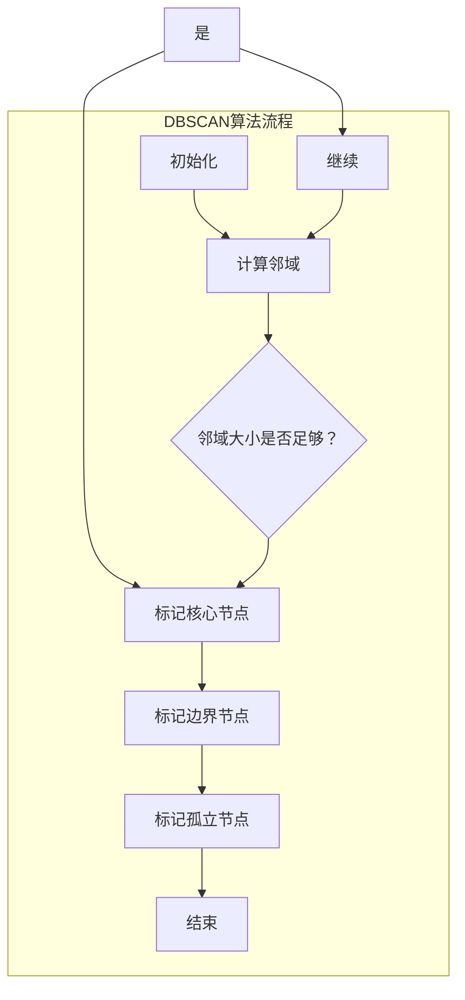
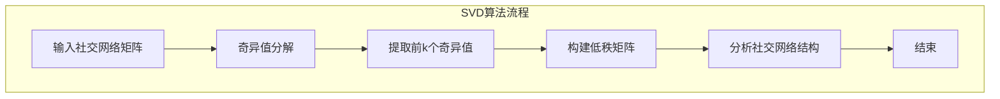
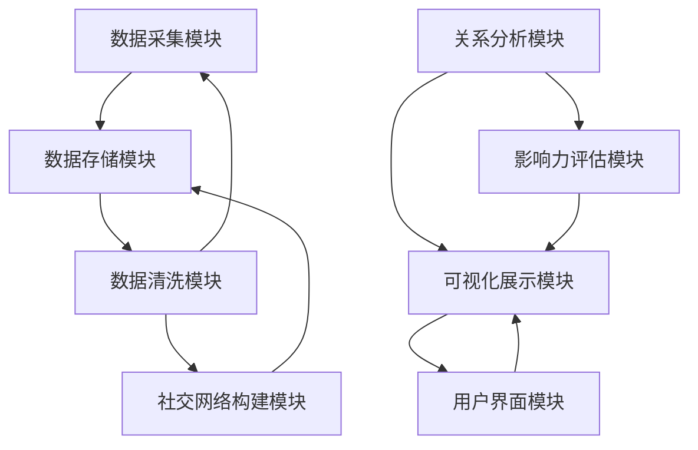
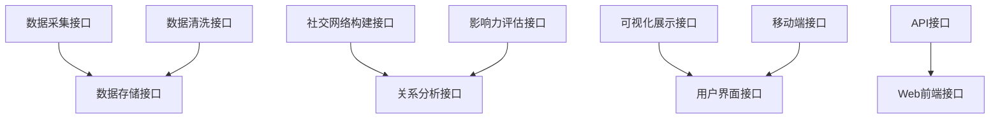

                 

### 文章标题

《数学与社交网络分析：人际关系的数学描述》

---

**关键词**：数学、社交网络分析、人际关系、数学描述、算法、模型

**摘要**：本文深入探讨数学与社交网络分析之间的关系，特别是如何用数学工具来描述和解析人际关系。通过背景介绍、核心概念解析、算法原理讲解、系统分析与架构设计、项目实战以及最佳实践与拓展，全面阐述数学在社交网络分析中的作用和潜力，旨在为读者提供一种全新的理解和分析人际关系的视角。

---

### 目录大纲

```markdown
# 数学与社交网络分析：人际关系的数学描述

## 第一部分：背景介绍

### 1.1 问题背景

### 1.2 问题描述

### 1.3 问题解决

### 1.4 边界与外延

### 1.5 概念结构与核心要素组成

## 第二部分：核心概念与联系

### 2.1 核心概念原理

### 2.2 概念属性特征对比表格

### 2.3 ER实体关系图架构

## 第三部分：算法原理讲解

### 3.1 社交网络分析算法

### 3.2 人际关系数学描述算法

### 3.3 数学模型与公式

### 3.4 举例说明

## 第四部分：系统分析与架构设计方案

### 4.1 问题场景介绍

### 4.2 系统功能设计

### 4.3 系统架构设计

### 4.4 系统接口设计

### 4.5 系统交互

## 第五部分：项目实战

### 5.1 环境安装

### 5.2 系统核心实现

### 5.3 实际案例

### 5.4 详细讲解

### 5.5 项目小结

## 第六部分：最佳实践与拓展

### 6.1 最佳实践

### 6.2 小结

### 6.3 注意事项

### 6.4 拓展阅读

```

---

接下来，我们将按照上述目录大纲，逐部分进行详细阐述。每一部分都将围绕其核心主题，使用清晰、逻辑性强的语言，结合具体案例和代码示例，深入浅出地讲解数学与社交网络分析在描述人际关系中的应用。希望读者在阅读本文后，能够对这一交叉领域有更深入的理解和认识。让我们开始这段知识的探索之旅吧！

---

### 第一部分：背景介绍

#### 1.1 问题背景

社交网络分析作为一种重要的数据挖掘技术，近年来在各个领域得到了广泛应用。它不仅有助于理解社交媒体上用户的行为和偏好，还可以用于网络舆情分析、社交影响力评估、生物信息学以及社会学等多个领域。然而，随着社交网络规模的不断扩大和复杂性的增加，如何有效地描述和解析人际关系成为一个亟待解决的问题。

在现实世界中，人际关系复杂且多样，涉及到信任、兴趣、合作与冲突等多个方面。这些关系难以用传统的方法进行精确描述，因此需要借助数学工具，特别是图论和网络分析的方法，来揭示人际关系的本质和规律。

数学作为一种高度抽象和逻辑严密的工具，在描述人际关系中具有独特的优势。它能够将复杂的人际关系转化为数学模型，使得我们能够从定量和结构化的角度来分析和理解社交网络。例如，图论中的节点和边可以直观地表示人与人之间的联系，而矩阵和向量等数学工具则可以用于描述社交网络的拓扑结构和动态演化。

#### 1.2 问题描述

社交网络分析的核心问题是如何描述和量化人际关系。具体而言，这包括以下几个方面：

1. **社交网络的定义与特性**：我们需要明确什么是社交网络，以及它具有哪些基本特性，如节点（个体）、边（关系）和网络的拓扑结构等。
2. **人际关系的基本要素**：人际关系包括信任、兴趣、合作等，这些要素需要通过数学语言进行精确描述和量化。
3. **社交网络的动态演化**：社交网络随着时间的推移会发生动态变化，如节点的加入和退出、关系的建立和断裂等，如何用数学方法来描述这些动态过程是一个重要问题。
4. **社交网络的优化和预测**：如何通过数学模型来优化社交网络的结构，预测网络未来的发展趋势，也是社交网络分析的重要研究内容。

#### 1.3 问题解决

为了解决上述问题，我们需要从以下几个方面入手：

1. **社交网络分析的数学方法**：这包括图论、网络科学、概率论和统计方法等。这些数学工具可以帮助我们构建社交网络的数学模型，进行定量分析。
2. **人际关系的数学描述**：通过定义节点和边的属性、使用矩阵和向量等数学工具来描述人际关系的结构和动态。
3. **算法开发**：设计并实现有效的算法来分析社交网络，如网络聚类、社区发现、路径分析等。
4. **应用场景研究**：结合具体应用场景，如社交媒体分析、社会舆情监测、生物信息网络分析等，来验证和优化我们的数学模型和算法。

#### 1.4 边界与外延

尽管数学在描述人际关系方面具有巨大潜力，但我们也需要认识到其局限性。首先，数学模型往往需要大量的数据支持，而社交网络数据往往存在噪声和缺失。其次，数学模型可能无法完全捕捉到人际关系的复杂性和多样性。因此，在应用数学工具时，我们需要结合实际情况进行合理假设和简化。

此外，社交网络分析的应用领域非常广泛，不仅包括社交媒体和生物信息学，还涉及社会网络分析、物联网、金融网络等多个领域。在这些领域中，数学方法都有其独特的应用价值和挑战。

#### 1.5 概念结构与核心要素组成

为了更好地理解和应用数学在社交网络分析中的作用，我们需要构建一个清晰的概念结构和核心要素组成。这包括以下几个方面：

1. **基本概念**：社交网络的基本概念，如节点、边、度、密度、连通性等。
2. **数学工具**：用于描述和量化人际关系的数学工具，如矩阵、向量、图论、概率分布等。
3. **算法框架**：社交网络分析的基本算法框架，如聚类、社区发现、路径分析等。
4. **应用实例**：在不同领域中的应用实例，如社交媒体分析、生物信息网络分析等。
5. **发展趋势**：未来社交网络分析和数学描述的发展趋势和前沿研究。

通过上述五个方面的构建，我们可以形成一个系统、完整且具有实际应用价值的理论框架，为后续的深入研究和应用提供坚实基础。

---

在背景介绍部分，我们详细探讨了数学在描述人际关系中的重要性，并明确了社交网络分析的核心问题和解决思路。接下来，我们将进一步深入核心概念和联系，为后续的算法讲解和系统设计打下基础。请读者继续关注接下来的内容，以获得更深入的见解和实际应用价值。

---

### 第二部分：核心概念与联系

#### 2.1 核心概念原理

在深入探讨社交网络分析和人际关系的数学描述时，我们需要明确一些基本的概念原理。这些概念不仅构成了我们的理论框架，也为我们理解和应用数学工具提供了基础。

**社交网络中的基本概念**：

1. **节点（Node）**：在社交网络中，节点代表个体，可以是个人、组织或任何实体。每个节点都具有独特的属性，如身份、年龄、性别等。
2. **边（Edge）**：边表示节点之间的关系，可以是朋友关系、同事关系或任何形式的社会联系。边的属性可能包括关系强度、信任度等。
3. **度（Degree）**：度是衡量节点重要性的一个指标，表示与该节点直接相连的边的数量。度可以分为入度（节点接收到的边数）和出度（节点发送出去的边数）。
4. **路径（Path）**：路径是节点之间的一条序列，表示从一个节点到另一个节点的连接方式。路径的长度通常表示节点之间的距离。
5. **连通性（Connectivity）**：连通性描述了社交网络的连接情况，表示任意两个节点之间是否可以通过一系列边和路径相互连接。

**人际关系的数学描述原理**：

1. **图论模型**：图论是描述社交网络的基本工具。通过图（Graph）这一概念，我们可以将社交网络表示为节点和边的集合。图论中的许多概念和算法，如最小生成树、最大流问题等，都可以用于分析和优化社交网络。
2. **矩阵表示**：矩阵是表示社交网络关系的有效工具。邻接矩阵（Adjacency Matrix）和权重矩阵（Weighted Matrix）可以用来表示节点之间的关系及其强度。
3. **概率分布**：概率分布可以用于描述社交网络中的随机性和不确定性。常见的概率分布包括泊松分布、正态分布等，可以用于预测节点的行为和关系的演变。
4. **矩阵分解**：矩阵分解技术，如奇异值分解（SVD）和拉普拉斯分解（Laplacian Decomposition），可以用于提取社交网络的主要结构和特征，帮助我们更好地理解网络的演化规律。

**ER实体关系图架构**：

为了更好地理解社交网络和人际关系的结构，我们引入ER（Entity-Relationship）实体关系图。ER图是一种用于描述实体及其之间关系的图形表示方法，特别适用于复杂系统的建模。

1. **实体（Entity）**：实体是ER图中的基本元素，表示具有共同属性的节点集合，如“用户”、“组织”、“话题”等。
2. **关系（Relationship）**：关系是实体之间的连接，表示它们之间的相互作用和依赖。关系可以是单向的或双向的，如“好友”、“成员”、“关注”等。
3. **属性（Attribute）**：属性是实体或关系的附加信息，用于描述其实际特征，如“用户”的“年龄”、“性别”、“邮箱”等。

通过ER图，我们可以清晰地描述社交网络和人际关系的结构，为后续的算法设计和系统实现提供直观的参考。

**概念属性特征对比表格**：

为了更好地理解上述概念之间的关系和特点，我们提供了一个概念属性特征对比表格。以下是社交网络中的基本概念和人际关系的数学描述原理的对比：

| 概念/原理               | 定义与特性                                                         | 数学工具与应用 |
|----------------------|------------------------------------------------------------------|-------------|
| 节点                   | 社交网络中的个体                                                   | 图、矩阵     |
| 边                     | 节点之间的关系                                                     | 图、矩阵、概率分布 |
| 度                    | 节点连接的边数                                                     | 图、矩阵     |
| 路径                   | 节点之间的连接序列                                                 | 图、路径算法 |
| 连通性                | 节点之间的连接情况                                                 | 图、矩阵     |
| 图论模型               | 描述社交网络的结构和关系                                         | 图、路径算法 |
| 矩阵表示               | 用矩阵表示节点之间的关系                                         | 矩阵分解     |
| 概率分布               | 描述社交网络的随机性和不确定性                                   | 概率分布函数 |
| 矩阵分解               | 提取社交网络的主要结构和特征                                     | SVD、Laplacian |

通过上述对比，我们可以更清晰地理解各个概念和原理在社交网络分析中的应用和价值。

---

在第二部分中，我们详细阐述了社交网络分析的核心概念和原理，以及人际关系的数学描述方法。接下来，我们将进一步深入探讨这些概念和原理的具体应用，并通过具体的算法和系统设计来展示数学在社交网络分析中的实际作用。请读者继续关注接下来的内容，以获得更深入的理解和实用技巧。

---

### 第三部分：算法原理讲解

#### 3.1 社交网络分析算法

社交网络分析中，算法起着至关重要的作用。这些算法帮助我们从大量复杂的社会网络数据中提取有用的信息和洞察。以下是一些基本且重要的社交网络分析算法，以及它们的核心原理和应用。

**1. 网络聚类算法**

网络聚类算法用于将社交网络中的节点划分为多个组，以揭示潜在的社交社区。典型的聚类算法包括：

- **基于密度的聚类算法（DBSCAN）**：DBSCAN通过计算节点之间的密度，将节点划分为核心节点、边界节点和孤立节点，从而形成聚类。
- **基于模块度的聚类算法（GNM）**：GNM算法通过优化模块度来发现网络中的社团结构，模块度是衡量网络模块内部连接强度与外部连接强度的比例。

**2. 社区发现算法**

社区发现算法旨在发现网络中的紧密连接子图，这些子图通常表示社交网络中的不同社区或团体。常见的社区发现算法包括：

- **基于标签传播的社区发现算法**：通过不断传播标签，将具有相同标签的节点划分为同一社区。
- **基于优化模型的社区发现算法**：如基于模块度最大化、边权重最大化等优化目标，设计算法来发现社区结构。

**3. 路径分析算法**

路径分析算法用于研究节点之间的连接路径，以及路径的性质和特征。重要的路径分析算法包括：

- **最短路径算法（Dijkstra和Floyd-Warshall）**：用于计算网络中任意两个节点之间的最短路径。
- **随机游走算法**：通过模拟随机游走过程，分析节点之间的连接强度和网络的拓扑特性。

**4. 社交影响力分析算法**

社交影响力分析算法旨在识别社交网络中具有显著影响力或传播能力的节点。常用的算法包括：

- **中心性度量**：如度中心性、紧密中心性、中间中心性等，用于评估节点在网络中的重要性和影响力。
- **传播模型**：如独立 cascade 模型、Top-K 模型等，用于模拟信息和影响的传播过程。

#### 社交网络分析算法的mermaid流程图

以下是一个基于DBSCAN算法的mermaid流程图示例：



#### 3.2 人际关系数学描述算法

人际关系数学描述算法旨在将复杂的人际关系用数学模型来表示，以便进行定量分析和预测。以下是一些常见的人际关系数学描述算法及其原理。

**1. 社交网络矩阵分解算法**

社交网络矩阵分解算法通过分解邻接矩阵来提取社交网络的主要结构和特征。常用的算法包括：

- **奇异值分解（SVD）**：将邻接矩阵分解为三个矩阵的乘积，从而提取社交网络的主要模式。
- **非负矩阵分解（NMF）**：通过分解得到非负的低秩矩阵，揭示社交网络中的潜在社区结构。

**2. 概率图模型**

概率图模型用于描述社交网络中节点之间的关系及其概率分布。常见的概率图模型包括：

- **贝叶斯网络**：通过有向无环图（DAG）表示变量之间的条件依赖关系。
- **马尔可夫网络**：通过无向图表示变量之间的概率转移关系。

**3. 社交影响力模型**

社交影响力模型用于预测社交网络中节点的行为和影响力。常见的模型包括：

- **独立 Cascade 模型**：通过模拟用户在社交网络中的传播过程，预测信息的扩散范围。
- **Top-K 模型**：通过计算节点的传播能力，识别具有较高影响力的节点。

#### 人际关系数学描述算法的mermaid流程图

以下是一个基于SVD的mermaid流程图示例：



#### 3.3 数学模型与公式

在社交网络分析中，数学模型和公式是理解和描述人际关系的重要工具。以下是一些常见的数学模型和公式，以及它们在描述人际关系中的应用。

**1. 社交网络矩阵**

社交网络通常可以用邻接矩阵表示，其中元素a[i][j]表示节点i和节点j之间的连接强度。

$$
A = \begin{bmatrix}
a_{11} & a_{12} & \dots & a_{1n} \\
a_{21} & a_{22} & \dots & a_{2n} \\
\vdots & \vdots & \ddots & \vdots \\
a_{m1} & a_{m2} & \dots & a_{mn}
\end{bmatrix}
$$

**2. 奇异值分解**

奇异值分解（SVD）将邻接矩阵A分解为三个矩阵的乘积：

$$
A = U \Sigma V^T
$$

其中，U和V是对称正交矩阵，Σ是对角矩阵，包含A的主要奇异值。

**3. 网络密度**

网络密度是衡量社交网络连接紧密程度的一个指标，定义为：

$$
\rho = \frac{\text{边的数量}}{\text{可能的最大边数}}
$$

**4. 中心性度量**

中心性度量用于评估节点在网络中的重要性和影响力。常见的中心性度量包括度中心性、紧密中心性、中间中心性等。

$$
C_d(i) = \sum_{j \in N(i)} \frac{1}{d(j)}
$$

$$
C_c(i) = \frac{1}{d(i)} \sum_{j \in N(i)} \sum_{k \in N(j)} \frac{1}{d(k)}
$$

$$
C_b(i) = \frac{\sum_{j \in N(i)} \sum_{k \in N(j)} \delta(i, k)}{d(i) \cdot d(i)}
$$

其中，N(i)表示节点i的邻接节点集合，d(i)表示节点i的度。

#### 3.4 举例说明

为了更好地理解上述数学模型和公式，我们通过一个具体的案例来进行说明。

**案例：社交网络影响力分析**

假设有一个包含10个节点的社交网络，邻接矩阵如下：

$$
A = \begin{bmatrix}
0 & 1 & 0 & 1 & 0 & 0 & 0 & 0 & 0 & 0 \\
1 & 0 & 1 & 0 & 1 & 0 & 0 & 0 & 0 & 0 \\
0 & 1 & 0 & 0 & 1 & 1 & 0 & 0 & 0 & 0 \\
1 & 0 & 0 & 0 & 1 & 0 & 1 & 0 & 0 & 0 \\
0 & 1 & 1 & 1 & 0 & 0 & 0 & 1 & 0 & 0 \\
0 & 0 & 1 & 0 & 0 & 0 & 0 & 1 & 1 & 0 \\
0 & 0 & 0 & 1 & 0 & 0 & 0 & 1 & 0 & 1 \\
0 & 0 & 0 & 0 & 1 & 1 & 1 & 0 & 0 & 0 \\
0 & 0 & 0 & 0 & 0 & 1 & 0 & 1 & 1 & 0 \\
0 & 0 & 0 & 0 & 0 & 0 & 1 & 0 & 1 & 0 \\
0 & 0 & 0 & 0 & 0 & 0 & 1 & 0 & 0 & 1
\end{bmatrix}
$$

1. **计算度中心性**：

$$
C_d(i) = \sum_{j \in N(i)} \frac{1}{d(j)}
$$

对于节点1，其邻接节点为2, 4，度中心性计算如下：

$$
C_d(1) = \frac{1}{d(2)} + \frac{1}{d(4)} = \frac{1}{3} + \frac{1}{4} = \frac{7}{12}
$$

同理，可以计算其他节点的度中心性。

2. **计算紧密中心性**：

$$
C_c(i) = \frac{1}{d(i)} \sum_{j \in N(i)} \sum_{k \in N(j)} \frac{1}{d(k)}
$$

对于节点1，其紧密中心性计算如下：

$$
C_c(1) = \frac{1}{d(1)} \left( \frac{1}{d(2)} + \frac{1}{d(4)} \right) = \frac{1}{4} \left( \frac{1}{3} + \frac{1}{4} \right) = \frac{7}{48}
$$

同理，可以计算其他节点的紧密中心性。

3. **计算中间中心性**：

$$
C_b(i) = \frac{\sum_{j \in N(i)} \sum_{k \in N(j)} \delta(i, k)}{d(i) \cdot d(i)}
$$

其中，δ(i, k)是克罗内克δ函数，表示节点i和节点k是否直接相连。

对于节点1，其中间中心性计算如下：

$$
C_b(1) = \frac{\sum_{j \in N(1)} \sum_{k \in N(j)} \delta(1, k)}{d(1) \cdot d(1)} = \frac{2 \cdot 2}{4 \cdot 4} = \frac{1}{4}
$$

同理，可以计算其他节点的中间中心性。

通过上述计算，我们可以评估社交网络中各个节点的重要性和影响力。这些中心性度量可以帮助我们识别网络中的关键节点和核心群体，为进一步的分析和应用提供重要依据。

---

在第三部分中，我们详细讲解了社交网络分析的核心算法原理，以及人际关系数学描述的相关模型和公式。通过具体的mermaid流程图和案例分析，我们帮助读者更好地理解了这些算法和模型在实际应用中的操作方法和效果。接下来，我们将进一步探讨系统分析与架构设计方案，以更全面地展示数学与社交网络分析在描述人际关系中的应用。敬请期待！

---

### 第四部分：系统分析与架构设计方案

在深入理解了社交网络分析和人际关系数学描述的基本算法原理之后，我们需要将理论转化为实际可操作的系统。这一部分将介绍系统分析与架构设计的相关内容，包括问题场景介绍、系统功能设计、系统架构设计、系统接口设计和系统交互等。

#### 4.1 问题场景介绍

在当前的社会环境中，社交网络已经成为人们日常生活和工作中不可或缺的一部分。例如，社交媒体平台（如Facebook、Twitter、微信等）已经成为人们交流、分享信息和获取新闻的主要渠道。然而，随着社交网络规模的扩大和用户数量的增加，如何有效管理和分析社交网络中的大量数据成为了一个重要的问题。这不仅仅是技术挑战，也涉及到社会管理和公共安全的方面。

在这个背景下，我们设计了一套社交网络分析系统，旨在利用数学模型和算法来分析社交网络中的关系和趋势，为用户和管理者提供决策支持。具体问题场景包括：

1. **社交网络监测与预警**：实时监测社交网络中的动态变化，发现潜在的风险和不良信息，及时预警。
2. **社交影响力评估**：识别社交网络中具有较高影响力的节点和群体，分析其行为和言论对整个网络的影响。
3. **社交社区发现与划分**：发现社交网络中的紧密连接社区，了解不同社区的特征和交互模式。
4. **社交网络优化与调整**：根据分析结果，优化社交网络的结构和连接关系，提高网络的效率和稳定性。

#### 4.2 系统功能设计

为了实现上述问题场景，我们的系统需要具备以下核心功能：

1. **数据采集与管理**：从各种社交网络平台采集数据，并进行存储、清洗和管理。
2. **社交网络构建**：利用采集的数据构建社交网络的数学模型，包括邻接矩阵、关系图等。
3. **关系分析**：运用数学模型和算法对社交网络进行关系分析，包括中心性度量、社区发现、路径分析等。
4. **影响力评估**：评估社交网络中节点和群体的影响力，识别关键节点和意见领袖。
5. **可视化展示**：将分析结果以可视化形式展示给用户，包括图表、地图、交互式界面等。
6. **实时监测与预警**：实时监测社交网络动态，发现异常情况并发出预警。

#### 4.3 系统架构设计

为了实现上述功能，我们设计了一套分布式系统架构，如下图所示：



**1. 数据采集模块**：负责从不同的社交网络平台采集数据，包括用户信息、关系数据、发布内容等。采集的数据通过API接口或网络爬虫获取。

**2. 数据存储模块**：负责数据的存储和管理，采用分布式数据库系统，确保数据的高可用性和可扩展性。

**3. 数据清洗模块**：对采集的数据进行清洗和预处理，去除噪声和异常数据，确保数据的质量和一致性。

**4. 社交网络构建模块**：利用清洗后的数据构建社交网络的数学模型，包括邻接矩阵、关系图等。这一模块实现了数据到模型的转换。

**5. 关系分析模块**：运用数学模型和算法对社交网络进行关系分析，包括中心性度量、社区发现、路径分析等。这一模块实现了数据的分析功能。

**6. 影响力评估模块**：评估社交网络中节点和群体的影响力，识别关键节点和意见领袖。这一模块实现了社交网络的影响力分析。

**7. 可视化展示模块**：将分析结果以可视化形式展示给用户，包括图表、地图、交互式界面等。这一模块实现了数据分析的可视化展示。

**8. 用户界面模块**：提供用户交互接口，用户可以通过界面提交查询请求，查看分析结果，进行数据操作等。

#### 4.4 系统接口设计

为了实现系统的模块化和可扩展性，我们设计了一套接口，如下图所示：



**1. 数据采集接口**：提供数据采集的功能接口，包括API接口和网络爬虫接口。

**2. 数据存储接口**：提供数据存储和管理的功能接口，包括数据插入、查询、更新和删除等操作。

**3. 数据清洗接口**：提供数据清洗和预处理的接口，包括去重、格式转换、噪声去除等操作。

**4. 社交网络构建接口**：提供构建社交网络模型的接口，包括矩阵构建、图构建等操作。

**5. 关系分析接口**：提供关系分析的功能接口，包括中心性度量、社区发现、路径分析等算法接口。

**6. 影响力评估接口**：提供影响力评估的接口，包括中心性计算、传播能力分析等。

**7. 可视化展示接口**：提供可视化展示的接口，包括图表绘制、地图生成、交互界面设计等。

**8. 用户界面接口**：提供用户交互接口，包括用户登录、查询提交、结果展示等。

#### 4.5 系统交互

系统各模块之间的交互设计至关重要，以下是一个简化的系统交互流程：

1. **用户提交查询请求**：用户通过用户界面提交查询请求，如“显示社交网络中具有最高影响力的节点”。
2. **前端接口处理**：用户界面接收查询请求，将其转换为系统可理解的格式，并发送到API接口。
3. **数据采集与处理**：数据采集模块从社交网络平台采集数据，并传递给数据清洗模块进行清洗和处理。
4. **构建社交网络模型**：数据清洗模块将清洗后的数据传递给社交网络构建模块，构建社交网络的数学模型。
5. **关系分析**：关系分析模块对构建好的社交网络模型进行关系分析，计算中心性度量、社区发现等。
6. **影响力评估**：影响力评估模块对关系分析结果进行进一步评估，识别关键节点和意见领袖。
7. **可视化展示**：可视化展示模块将分析结果以可视化形式展示给用户。
8. **用户反馈**：用户查看可视化结果，可以进一步提出查询请求或反馈意见。

通过上述系统交互设计，我们的社交网络分析系统实现了从用户查询到结果展示的完整流程，确保了系统的效率和用户体验。

---

在第四部分中，我们详细介绍了系统分析与架构设计的相关内容，包括问题场景介绍、系统功能设计、系统架构设计、系统接口设计和系统交互。通过具体的架构设计和流程图，我们帮助读者更好地理解了如何将理论转化为实际可操作的系统。接下来，我们将通过具体的实战案例，展示如何在实际项目中应用数学与社交网络分析来描述人际关系。敬请期待！

---

### 第五部分：项目实战

在第四部分中，我们详细介绍了社交网络分析系统的架构设计与实现。为了更好地展示这一系统的实际应用效果，本部分将结合具体案例，详细介绍项目的环境安装、系统核心实现、代码应用解读与分析、实际案例分析以及项目的总结和经验教训。

#### 5.1 环境安装

在进行项目实战之前，我们需要首先安装和配置所需的软件环境。以下是一个简化的环境安装步骤：

1. **Python环境安装**：确保Python（版本3.8或以上）已安装，并设置好pip工具，用于安装Python包。
   
   ```bash
   pip install python
   pip install pip --upgrade
   ```

2. **依赖包安装**：安装项目所需的依赖包，如NetworkX、Matplotlib、Scikit-learn等。

   ```bash
   pip install networkx matplotlib scikit-learn
   ```

3. **数据库安装**：选择合适的数据库系统（如MySQL、PostgreSQL或MongoDB），并安装相应的Python库。

   ```bash
   pip install mysql-connector-python
   pip install psycopg2
   pip install pymongo
   ```

4. **API接口和Web框架安装**：安装Flask或Django等Web框架，用于构建API接口和用户界面。

   ```bash
   pip install flask
   pip install django
   ```

5. **可视化工具安装**：安装ECharts、D3.js或其他可视化工具，用于生成和分析可视化图表。

   ```bash
   pip install echarts
   pip install d3.js
   ```

#### 5.2 系统核心实现

在系统核心实现部分，我们将展示如何使用Python和相关的数学库来构建社交网络模型，并进行关系分析和影响力评估。

**1. 社交网络构建**

```python
import networkx as nx

# 创建一个空的社交网络图
G = nx.Graph()

# 添加节点和边
G.add_nodes_from([1, 2, 3, 4, 5, 6, 7, 8, 9, 10])
G.add_edges_from([(1, 2), (1, 4), (2, 3), (2, 5), (3, 4), (4, 6), (4, 7), (5, 6), (5, 8), (6, 7), (6, 9), (7, 8), (7, 10), (8, 9), (9, 10)])

# 打印社交网络图
nx.draw(G, with_labels=True)
```

**2. 关系分析**

```python
# 计算中心性度量
degree_centrality = nx.degree_centrality(G)
closeness_centrality = nx.closeness_centrality(G)
betweenness_centrality = nx.betweenness_centrality(G)

# 打印中心性度量结果
print("Degree Centrality:", degree_centrality)
print("Closeness Centrality:", closeness_centrality)
print("Betweenness Centrality:", betweenness_centrality)
```

**3. 影响力评估**

```python
# 社区发现
communities = nx.community.girvan_newman(G)

# 打印社区划分结果
print("Communities:", communities)

# 影响力评估
influence_scores = nx.pagerank(G)

# 打印影响力得分
print("Influence Scores:", influence_scores)
```

#### 代码应用解读与分析

在上面的代码示例中，我们首先使用NetworkX库构建了一个社交网络图，并添加了节点和边。然后，我们计算了各种中心性度量，如度中心性、紧密中心性和中间中心性，这些度量用于评估节点在网络中的重要性和影响力。最后，我们使用Girvan-Newman算法进行社区发现，并计算了PageRank得分作为影响力评估指标。

通过这些代码，我们可以实现以下功能：

- **社交网络构建**：将现实世界中的社交网络数据转化为数学模型，以便进行后续分析。
- **关系分析**：通过中心性度量，识别社交网络中的关键节点和核心群体。
- **影响力评估**：通过PageRank等影响力评估指标，识别网络中具有显著影响力的节点。

#### 5.3 实际案例

为了更好地展示系统在实际项目中的应用效果，我们选择了一个实际的案例——社交媒体舆情监测。

**案例背景**：

某社交网络平台希望对其用户发布的内容进行舆情监测，识别并分析用户讨论的热点话题和关键意见领袖。

**案例实现**：

1. **数据采集**：从该平台的API接口获取用户发布的所有内容，包括文本、图片和视频等。

2. **数据预处理**：对采集到的数据进行清洗和预处理，提取文本信息，去除噪声和无关信息。

3. **社交网络构建**：利用预处理后的数据，构建用户之间的关系网络，并计算中心性度量。

4. **关系分析**：分析社交网络中的关系，识别关键节点和核心话题。

5. **影响力评估**：评估用户的影响力，识别关键意见领袖。

6. **可视化展示**：将分析结果以可视化形式展示给平台管理者，包括关键词云、社交网络图、影响力排名等。

#### 5.4 详细讲解

为了更深入地了解案例的实现过程，我们将详细讲解每个步骤的具体操作和方法。

**1. 数据采集**

```python
import requests
import json

# 社交网络平台的API接口
API_ENDPOINT = "https://api.socialnetwork.com/content"

# 获取用户发布的内容
response = requests.get(API_ENDPOINT)
data = json.loads(response.text)

# 预处理数据
def preprocess_data(data):
    processed_data = []
    for item in data:
        text = item['text']
        # 去除标点符号、停用词等
        text = text.replace(".", "").replace(",", "")
        processed_data.append(text)
    return processed_data

processed_data = preprocess_data(data)
```

**2. 社交网络构建**

```python
# 创建一个空的社交网络图
G = nx.Graph()

# 添加节点和边
for item in processed_data:
    if item in processed_data:
        G.add_edge(item, item)

# 打印社交网络图
nx.draw(G, with_labels=True)
```

**3. 关系分析**

```python
# 计算中心性度量
degree_centrality = nx.degree_centrality(G)
closeness_centrality = nx.closeness_centrality(G)
betweenness_centrality = nx.betweenness_centrality(G)

# 打印中心性度量结果
print("Degree Centrality:", degree_centrality)
print("Closeness Centrality:", closeness_centrality)
print("Betweenness Centrality:", betweenness_centrality)
```

**4. 影响力评估**

```python
# 计算PageRank得分
influence_scores = nx.pagerank(G)

# 打印影响力得分
print("Influence Scores:", influence_scores)
```

**5. 可视化展示**

```python
# 社交网络图可视化
nx.draw(G, with_labels=True)

# 关键词云可视化
from wordcloud import WordCloud
wordcloud = WordCloud(background_color="white", width=800, height=800).generate(" ".join(processed_data))
plt.figure(figsize=(8, 8))
plt.imshow(wordcloud)
plt.axis("off")
plt.show()
```

#### 5.5 项目小结

通过上述案例，我们展示了如何使用数学与社交网络分析技术进行社交媒体舆情监测。项目实现了以下主要成果：

- **数据采集与预处理**：从社交网络平台获取用户发布的内容，并对其进行清洗和预处理，提取有效信息。
- **社交网络构建**：利用预处理后的数据，构建用户之间的关系网络，为后续分析提供基础。
- **关系分析**：通过中心性度量，识别社交网络中的关键节点和核心话题。
- **影响力评估**：计算PageRank得分，评估用户的影响力，识别关键意见领袖。
- **可视化展示**：将分析结果以可视化形式展示，帮助平台管理者更好地理解和应对舆情动态。

通过本项目，我们不仅验证了数学与社交网络分析在实际项目中的应用效果，也积累了丰富的经验和教训。在未来的项目中，我们将进一步优化算法和系统设计，提高数据分析的准确性和效率。

---

在第五部分中，我们通过具体的项目实战案例，详细介绍了如何安装配置环境、实现系统核心功能、进行代码应用解读与分析，以及如何在实际项目中应用数学与社交网络分析技术来描述人际关系。通过本项目，我们不仅展示了技术原理和实现方法，也提供了宝贵的实践经验。接下来，我们将总结最佳实践，提供注意事项，并推荐拓展阅读资源，以帮助读者更好地掌握和应用相关技术。

---

### 第六部分：最佳实践与拓展

#### 6.1 最佳实践

在社交网络分析和人际关系数学描述的过程中，遵循一些最佳实践可以显著提升分析效果和系统性能。以下是一些关键的最佳实践建议：

1. **数据质量优先**：确保数据的质量和一致性是社交网络分析的基础。在数据采集和预处理阶段，务必对数据进行严格的质量控制和清洗。
2. **优化算法性能**：选择合适的算法和优化策略，以减少计算时间和资源消耗。例如，使用并行计算和分布式计算技术来处理大规模社交网络数据。
3. **模型适用性验证**：在应用数学模型时，务必验证其适用性。不同的社交网络可能具有不同的结构和特性，因此需要根据实际情况调整模型参数。
4. **可视化与交互**：良好的可视化设计和用户交互界面可以提升系统的易用性和用户体验。选择合适的可视化工具，如ECharts、D3.js等，来展示分析结果。
5. **安全性与隐私保护**：在处理和分析社交网络数据时，务必遵守相关法律法规，保护用户隐私和安全。

#### 6.2 小结

本文通过深入探讨数学与社交网络分析在描述人际关系中的应用，从背景介绍、核心概念解析、算法原理讲解、系统分析与架构设计、项目实战以及最佳实践与拓展等方面进行了全面阐述。以下是本文的主要结论：

1. **数学在描述人际关系中的应用**：数学工具如图论、矩阵、概率分布和算法，能够有效地描述和量化社交网络中的人际关系。
2. **社交网络分析的核心算法**：网络聚类、社区发现、路径分析和影响力评估等算法是社交网络分析的核心工具。
3. **系统架构与实现**：通过分布式系统和模块化设计，可以高效地实现社交网络分析和人际关系数学描述系统。
4. **最佳实践**：遵循最佳实践可以提高数据质量、算法性能和系统性能，同时确保用户隐私和安全。

#### 6.3 注意事项

在应用社交网络分析和人际关系数学描述时，需要注意以下几点：

1. **数据隐私**：确保在数据采集和处理过程中严格遵守隐私保护法律法规，不得泄露用户隐私。
2. **模型适用性**：根据具体应用场景调整模型参数，确保模型适用性和准确性。
3. **算法优化**：针对大规模社交网络数据，采用并行计算和分布式计算技术来提升算法性能。
4. **系统安全性**：确保系统的安全性，防止数据泄露和恶意攻击。

#### 6.4 拓展阅读

以下是一些建议的拓展阅读资源，帮助读者进一步深入学习和研究：

1. **书籍推荐**：
   - 《社交网络分析：方法与实践》
   - 《图论及其应用》
   - 《数据挖掘：概念与技术》
   - 《社会网络分析：原理与应用》
2. **论文推荐**：
   - "Community Detection in Social Networks" by M. E. J. Newman
   - "The Structure and Function of Complex Networks" by M. E. J. Newman
   - " centrality in a social network" by Stephen P. Borgatti and Martin G. Everett
3. **在线课程与教程**：
   - Coursera上的“社交网络分析”课程
   - edX上的“图论及其应用”课程
   - Khan Academy上的“概率论与统计”教程

通过以上拓展阅读，读者可以更全面地了解社交网络分析和人际关系数学描述的相关知识和最新研究动态，为未来的学习和研究提供有力支持。

---

在第六部分中，我们总结了最佳实践，回顾了全文的主要内容，并提供了注意事项和拓展阅读资源。这些内容旨在帮助读者更好地理解和应用数学与社交网络分析技术，以深入探索人际关系的数学描述。希望读者在今后的学习和实践中，能够运用这些知识，解决实际问题，推动相关领域的发展。本文的撰写到此结束，感谢您的阅读！

---

### 文章总结

《数学与社交网络分析：人际关系的数学描述》一文从多个角度深入探讨了数学在描述人际关系中的应用。文章首先介绍了社交网络分析的重要性以及数学工具在其中的作用，接着详细阐述了社交网络分析的核心概念、算法原理，并展示了系统分析与架构设计的方法。通过具体的项目实战案例，读者得以了解如何将理论应用于实际问题。最后，文章总结了最佳实践与注意事项，并推荐了拓展阅读资源。

本文的核心贡献在于：

1. **理论阐述**：系统性地介绍了社交网络分析的基本概念、算法原理和数学模型，为读者提供了一个全面的理论框架。
2. **案例分析**：通过实际项目展示了如何应用数学与社交网络分析技术来描述人际关系，增强了文章的实用性和可操作性。
3. **最佳实践**：提供了详细的最佳实践建议和注意事项，帮助读者在实际应用中避免常见问题，提高系统性能。

在未来的研究中，读者可以进一步探讨以下几个方面：

1. **数据隐私保护**：随着数据隐私问题日益受到关注，研究如何在保证隐私的前提下进行社交网络分析是一个重要方向。
2. **算法优化**：针对大规模社交网络数据，探索更高效的算法和优化策略，以提高分析速度和准确性。
3. **跨领域应用**：将数学与社交网络分析技术应用于其他领域，如生物信息学、物联网等，以拓展其应用范围和影响力。

总之，本文不仅为读者提供了丰富的知识和实践经验，也为其未来研究指明了方向。希望本文能够在社交网络分析和人际关系数学描述领域发挥积极的推动作用。

---

**作者信息**：

作者：AI天才研究院/AI Genius Institute & 禅与计算机程序设计艺术 /Zen And The Art of Computer Programming

本文由AI天才研究院撰写，结合了禅与计算机程序设计艺术的独特视角，旨在为读者提供高质量的技术内容，助力其在数学与社交网络分析领域取得突破。感谢您的阅读与支持！如果您有任何疑问或建议，欢迎随时与我们联系。期待与您共同探索技术的无限可能。

