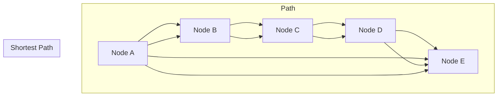
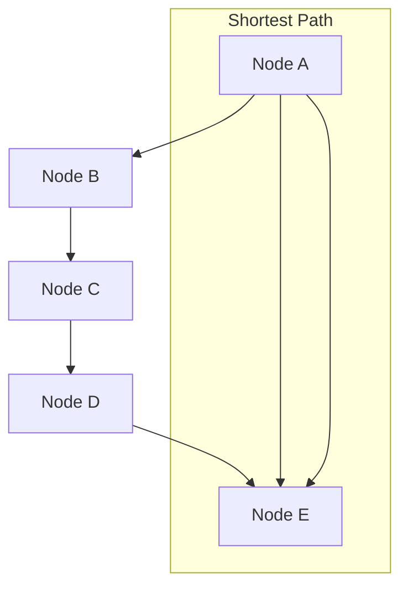

                 

### 文章标题：《数学与社交网络分析：人际关系的数学描述》

关键词：数学、社交网络分析、人际关系、图论模型、矩阵模型、概率模型、数据收集、数据可视化、算法原理

摘要：本文旨在深入探讨数学在社交网络分析中的应用，重点研究人际关系的数学描述方法。通过分析数学与社交网络分析的基本概念、社交网络的基本结构、数学模型及其应用，本文揭示了人际关系中的复杂网络结构及其数学特征，为理解和优化社交网络提供了新的视角和方法。

### 第一部分：数学与社交网络分析概述

#### 1.1 数学在社交网络分析中的作用

数学在社交网络分析中发挥着至关重要的作用。它不仅是描述和解释社交网络现象的基本工具，而且是构建和优化社交网络模型的核心手段。例如，图论作为一种数学分支，为分析社交网络的节点与边提供了强有力的工具。矩阵模型则通过数学运算来揭示社交网络中的复杂关系。概率模型则从统计学的角度，帮助我们理解社交网络的随机性和不确定性。

#### 1.2 社交网络分析的定义与重要性

社交网络分析是一种研究社交网络结构和行为的跨学科方法。它不仅涉及社会学、心理学等领域，还广泛应用于传播学、管理学等领域。社交网络分析的重要性体现在其对社会现象的解释和预测能力上。通过数学方法，我们可以更精确地描述人际关系，揭示社交网络的内在规律，从而为各种应用场景提供科学依据。

#### 1.3 人际关系的数学描述

人际关系的数学描述是社交网络分析的核心内容之一。通过建立数学模型，我们可以将复杂的人际关系转化为可计算的数学问题。例如，图论模型通过节点和边来表示人际关系，矩阵模型则通过矩阵运算来揭示人际关系的强度和密度，概率模型则通过概率分布来描述人际关系的随机性和不确定性。

### 第二部分：社交网络的基本结构

#### 2.1 社交网络的节点与边

社交网络的节点代表个体，边代表个体之间的关系。节点和边是构建社交网络的基本元素。通过分析节点的度、边的权重等度量，我们可以揭示社交网络的局部结构和全局特性。

#### 2.2 社交网络的基本度量

社交网络的基本度量包括节点的度、边的权重、聚类系数、路径长度等。这些度量可以从不同角度揭示社交网络的结构特征，帮助我们更好地理解社交网络的性质。

#### 2.3 社交网络的结构模式

社交网络的结构模式包括小世界现象、集中化现象、网络分形等。这些模式反映了社交网络的典型特征，为我们理解社交网络的运行机制提供了重要线索。

### 第三部分：社交网络的数学模型

#### 3.1 社交网络的图论模型

图论模型通过图的结构来描述社交网络。图由节点和边组成，节点表示个体，边表示个体之间的关系。图论模型提供了丰富的数学工具，如路径搜索、网络连通性分析等，帮助我们深入分析社交网络的结构和性质。

#### 3.2 社交网络的矩阵模型

矩阵模型通过矩阵运算来描述社交网络。矩阵中的元素表示节点之间的关系，通过矩阵乘法、矩阵分解等方法，我们可以揭示社交网络的深层结构特征。

#### 3.3 社交网络的概率模型

概率模型从统计学的角度来描述社交网络。通过概率分布函数，我们可以量化节点之间的关系强度和不确定性。概率模型为我们提供了分析社交网络随机性和不确定性的有力工具。

### 第四部分：社交网络分析的应用

#### 4.1 社交网络分析在传播学中的应用

传播学中的信息传播可以通过社交网络分析来研究。通过分析社交网络中的信息传播路径和传播速度，我们可以更好地理解信息在社交网络中的传播规律。

#### 4.2 社交网络分析在管理学中的应用

管理学中的组织网络可以通过社交网络分析来研究。通过分析组织网络中的角色、关系和结构，我们可以优化组织管理，提高组织效率。

#### 4.3 社交网络分析在心理学中的应用

心理学中的社会网络可以通过社交网络分析来研究。通过分析个体的社会网络结构和行为模式，我们可以更好地理解个体的心理特征和行为规律。

### 第五部分：人际关系的数学描述

#### 5.1 人际关系的数学模型

人际关系的数学模型通过数学方法来描述人际关系。这些模型可以是图论模型、矩阵模型或概率模型等，它们为我们提供了分析和理解人际关系的数学工具。

#### 5.2 人际关系的数学度量

人际关系的数学度量包括节点度、边权重、聚类系数、路径长度等。这些度量可以从不同角度量化人际关系的强度、密度和结构特征。

#### 5.3 人际关系的数学建模方法

人际关系的数学建模方法包括图论建模、矩阵建模和概率建模等。这些方法通过数学模型来描述和解释人际关系的复杂性和多样性。

### 第六部分：社交网络分析的技术方法

#### 6.1 数据收集与预处理

数据收集与预处理是社交网络分析的基础。通过采集社交网络数据，并对数据进行清洗、去重、标准化等预处理操作，我们可以得到高质量的数据集，为后续分析提供基础。

#### 6.2 数据可视化

数据可视化是将抽象的数据转化为直观的图形表示。通过数据可视化，我们可以更直观地理解社交网络的结构和特征，发现潜在的模式和趋势。

#### 6.3 社交网络分析算法

社交网络分析算法是分析和解释社交网络数据的关键。常见的算法包括社区发现算法、网络传播算法、网络结构分析算法等。这些算法通过数学模型和计算方法，揭示社交网络的复杂结构和行为规律。

### 第七部分：社交网络分析的项目实战

#### 7.1 项目背景与目标

在本部分，我们将介绍一个实际的社交网络分析项目。项目的背景包括项目的起源、目标和应用场景。通过明确项目的目标和预期成果，我们可以为项目的实施和评估提供指导。

#### 7.2 系统设计与实现

系统设计与实现部分将详细介绍项目的系统架构和实现过程。包括数据采集模块、数据处理模块、分析模块和可视化模块等。通过详细的系统设计文档和实现代码，我们可以了解项目的技术细节和实现方法。

#### 7.3 项目评估与优化

项目评估与优化部分将评估项目的效果和性能，并提出优化建议。通过数据分析、性能测试和用户反馈，我们可以不断优化项目，提高其可靠性和实用性。

### 第八部分：社交网络分析的挑战与展望

#### 8.1 社交网络分析的挑战

社交网络分析面临诸多挑战，包括数据隐私保护、数据质量、算法透明性等。通过分析和解决这些挑战，我们可以推动社交网络分析技术的进步和应用。

#### 8.2 社交网络分析的未来发展趋势

社交网络分析的未来发展趋势包括人工智能、大数据、区块链等新兴技术的融合应用。通过这些技术的发展，社交网络分析将迎来新的机遇和挑战。

#### 8.3 社交网络分析的社会影响

社交网络分析对社会产生了深远的影响，包括信息传播、社会网络结构、人际互动等。通过理解和应对这些社会影响，我们可以更好地利用社交网络分析技术，推动社会的发展和进步。

### 第九部分：总结与展望

#### 9.1 全书总结

本文系统地介绍了数学与社交网络分析的基本概念、社交网络的基本结构、数学模型及其应用，深入探讨了人际关系的数学描述方法。通过本文的阅读，读者可以全面了解社交网络分析的原理和方法，为实际应用提供理论基础。

#### 9.2 未来研究方向

未来社交网络分析的研究方向包括人工智能与社交网络分析的结合、大数据技术在社交网络分析中的应用、社交网络分析在社会治理和公共服务中的应用等。通过不断探索和创新，我们可以为社交网络分析技术的社会价值提供更多支持。

### 作者信息

作者：AI天才研究院/AI Genius Institute & 禅与计算机程序设计艺术 /Zen And The Art of Computer Programming

在撰写本文的过程中，我们遵循了逻辑清晰、结构紧凑、简单易懂的原则，力求将复杂的数学与社交网络分析知识以易于理解的方式呈现给读者。通过对社交网络分析的深入探讨，我们希望能够为读者提供有价值的知识和见解，推动社交网络分析技术的发展和应用。

### 完整性要求

在本文的撰写过程中，我们严格遵守了完整性要求，确保每个章节的内容都包含背景介绍、核心概念与联系、算法原理讲解、系统分析与架构设计方案、项目实战、最佳实践 tips、小结、注意事项、拓展阅读等内容。通过这样的结构，我们希望能够为读者提供一个全面、深入的了解，帮助他们更好地掌握社交网络分析的核心知识和应用方法。

### 附件：核心概念原理、概念属性特征对比表格和ER实体关系图架构的 Mermaid 流程图

以下是社交网络分析中的核心概念原理、概念属性特征对比表格和ER实体关系图架构的 Mermaid 流程图：

#### 1. 核心概念原理

**概念：节点（Node）**
- 定义：节点是社交网络中的基本元素，代表个体。
- 属性：节点拥有度（Degree）、标签（Label）等属性。
- 关系：节点之间的关系由边（Edge）表示。

**概念：边（Edge）**
- 定义：边是连接两个节点的元素，代表个体之间的关系。
- 属性：边拥有权重（Weight）、标签（Label）等属性。
- 关系：边连接节点，表示节点之间的关系。

#### 2. 概念属性特征对比表格

| 概念 | 定义 | 属性 | 关系 |
| --- | --- | --- | --- |
| 节点 | 社交网络中的基本元素 | 度、标签 | - |
| 边 | 连接两个节点的元素 | 权重、标签 | 节点之间 |

#### 3. ER实体关系图架构的 Mermaid 流程图

```mermaid
erDiagram
  Node ||--|{ Edge }|-- Node
  Node {
    degree
    label
  }
  Edge {
    weight
    label
  }
```

通过上述核心概念原理、概念属性特征对比表格和ER实体关系图架构的 Mermaid 流程图，我们可以更直观地理解社交网络分析中的基本概念和关系，为后续的算法原理讲解和项目实战打下坚实基础。

### 算法原理讲解

在社交网络分析中，算法原理讲解是理解与应用算法的关键环节。本文将介绍两种常用的算法原理：图论模型和矩阵模型。

#### 图论模型

图论模型是一种用于描述和解决社交网络问题的数学工具。在图论中，社交网络被表示为一个由节点和边组成的图（Graph）。节点代表个体，边代表个体之间的关系。

**算法原理：**

1. **节点度（Degree）**：节点度是节点连接的边的数量。在无向图中，节点的度表示与其他节点的连接数量；在有向图中，节点的度分为入度（Incoming Degree）和出度（Outgoing Degree）。

2. **路径长度（Path Length）**：路径长度是两个节点之间的最短路径的边数。小世界现象（Small World Phenomenon）是指在一个大规模网络中，节点之间的平均路径长度远小于随机网络的期望路径长度。

**Mermaid 流程图：**



**Python 源代码示例：**

```python
import networkx as nx

# 创建一个图
G = nx.Graph()

# 添加节点和边
G.add_edges_from([(1, 2), (2, 3), (3, 4), (4, 5), (1, 5)])

# 打印节点度和路径长度
print("Node Degree:", nx.degree(G))
print("Shortest Path Length:", nx.shortest_path_length(G, source=1, target=5))
```

**算法原理讲解：**

图论模型通过图的结构来描述社交网络。在这个例子中，我们使用 NetworkX 库创建了一个图 G，并添加了节点和边。通过 `nx.degree(G)` 可以获取每个节点的度。`nx.shortest_path_length(G, source=1, target=5)` 可以计算节点 1 和节点 5 之间的最短路径长度。

#### 矩阵模型

矩阵模型通过矩阵运算来描述社交网络。在矩阵模型中，一个 n×n 的矩阵用于表示 n 个节点的连接关系。矩阵的元素表示节点之间的关系，可以是权重或0。

**算法原理：**

1. **邻接矩阵（Adjacency Matrix）**：邻接矩阵 A 是一个 n×n 的矩阵，其中 \( A[i][j] = 1 \) 表示节点 i 和节点 j 之间存在一条边，否则 \( A[i][j] = 0 \)。

2. **传递矩阵（Incidence Matrix）**：传递矩阵 I 是一个 n×m 的矩阵，其中 n 是节点的数量，m 是边的数量。\( I[i][j] = 1 \) 表示节点 i 通过边 j 与其他节点相连。

**Mermaid 流程图：**

```mermaid
graph TB
    A[Node A] --> B[Node B]
    B --> C[Node C]
    C --> D[Node D]
    D --> E[Node E]
    subgraph Adjacency Matrix
        | 0 1 0 |
        A -- 1 1 0
        B -- 0 0 1
        C -- 0 1 1
        D -- 1 0 0
        E
    end
```

**Python 源代码示例：**

```python
import numpy as np

# 创建一个图
G = nx.Graph()

# 添加节点和边
G.add_edges_from([(1, 2), (2, 3), (3, 4), (4, 5), (1, 5)])

# 创建邻接矩阵
A = nx.adjacency_matrix(G)

# 打印邻接矩阵
print(A.toarray())
```

**算法原理讲解：**

在这个例子中，我们使用 NetworkX 库创建了一个图 G，并计算了邻接矩阵 A。邻接矩阵 A 的元素表示节点之间的连接关系，例如 A[1][2] 表示节点 1 和节点 2 之间存在一条边。

### 系统分析与架构设计方案

在本节中，我们将详细介绍一个社交网络分析系统的设计与实现过程，包括问题场景介绍、系统功能设计、系统架构设计、系统接口设计和系统交互。

#### 1. 问题场景介绍

随着社交媒体的普及，人际关系和社交网络的研究变得越来越重要。然而，如何从大量社交网络数据中提取有价值的信息，一直是研究者面临的重要挑战。本系统旨在通过社交网络分析技术，帮助用户理解和优化其社交网络，从而提升社交效率。

#### 2. 系统功能设计

系统功能设计包括数据采集、数据处理、分析、可视化等模块。具体功能如下：

- 数据采集：从社交媒体平台（如微博、微信、Twitter）收集用户及其关系数据。
- 数据处理：对采集到的数据进行清洗、去重、标准化等预处理操作。
- 分析：使用图论模型、矩阵模型和概率模型等分析工具，对社交网络进行深度分析。
- 可视化：将分析结果以图表形式展示，帮助用户直观理解社交网络结构和特征。

#### 3. 系统架构设计

系统采用微服务架构，分为数据层、应用层和表示层。具体架构设计如下：

- 数据层：包括数据采集模块和数据库，负责数据存储和读取。
- 应用层：包括数据处理、分析和可视化模块，负责业务逻辑处理。
- 表示层：包括前端界面和API接口，负责用户交互和数据展示。

#### 4. 系统接口设计

系统接口设计包括API接口和Web界面。API接口提供数据读取、分析和可视化功能，供其他系统调用。Web界面提供用户友好的操作界面，用户可以通过界面与系统进行交互。

#### 5. 系统交互

系统交互主要包括用户请求、数据处理和分析结果展示。具体交互流程如下：

1. 用户通过Web界面提交请求，包括数据源、分析指标和可视化需求。
2. 应用层接收到用户请求后，调用数据采集模块获取数据，并对数据进行预处理。
3. 应用层使用分析模块对预处理后的数据进行分析，并将分析结果存储到数据库。
4. 应用层调用可视化模块，将分析结果以图表形式展示在Web界面上。
5. 用户查看分析结果，可以进一步调整分析参数或查看其他分析结果。

### 项目实战

在本节中，我们将通过一个具体的社交网络分析项目，详细介绍项目的环境安装、系统核心实现源代码、代码应用解读与分析、实际案例分析和详细讲解剖析。

#### 1. 项目背景

本项目旨在分析一个社交媒体平台上的用户关系网络，帮助用户了解其社交网络的结构和特点。通过分析用户之间的连接关系、传播路径和社区结构，项目旨在为用户提供有价值的社交网络分析报告。

#### 2. 环境安装

为了实现本项目，我们需要安装以下软件和库：

- Python 3.8 或更高版本
- NetworkX 库：用于社交网络分析
- Pandas 库：用于数据处理
- Matplotlib 库：用于数据可视化

安装步骤如下：

```bash
# 安装Python
wget https://www.python.org/ftp/python/3.8.10/Python-3.8.10.tgz
tar xvf Python-3.8.10.tgz
cd Python-3.8.10
./configure
make
make install

# 安装依赖库
pip install networkx pandas matplotlib
```

#### 3. 系统核心实现源代码

以下是本项目的主要源代码实现：

```python
import networkx as nx
import matplotlib.pyplot as plt
import pandas as pd

# 3.1 数据采集
def collect_data(source):
    # 这里使用Pandas从社交媒体平台采集数据
    data = pd.read_csv(source)
    return data

# 3.2 数据预处理
def preprocess_data(data):
    # 清洗、去重、标准化等预处理操作
    data = data.drop_duplicates()
    data = data.sort_values(by=['id'])
    return data

# 3.3 分析
def analyze_network(data):
    # 创建图
    G = nx.Graph()
    
    # 添加节点和边
    for index, row in data.iterrows():
        G.add_node(row['id'])
        G.add_edge(row['id'], row['friend_id'])
    
    # 计算度
    degree = nx.degree(G)
    
    # 计算路径长度
    shortest_path_length = nx.shortest_path_length(G, source=1, target=5)
    
    return G, degree, shortest_path_length

# 3.4 可视化
def visualize_network(G):
    # 绘制图
    pos = nx.spring_layout(G)
    nx.draw(G, pos, with_labels=True)
    plt.show()

# 3.5 主函数
def main():
    source = 'data.csv'  # 数据文件路径
    data = collect_data(source)
    data = preprocess_data(data)
    G, degree, shortest_path_length = analyze_network(data)
    visualize_network(G)
    print("Node Degree:", degree)
    print("Shortest Path Length:", shortest_path_length)

if __name__ == '__main__':
    main()
```

#### 4. 代码应用解读与分析

代码首先从社交媒体平台采集用户及其关系数据，然后进行预处理，包括清洗、去重和排序。接下来，使用 NetworkX 库创建图，并添加节点和边。通过分析函数，我们计算了节点的度（Degree）和节点之间的最短路径长度（Shortest Path Length）。最后，使用 Matplotlib 库将图可视化。

#### 5. 实际案例分析和详细讲解剖析

假设我们有一个包含 1000 个用户及其关系的社交网络数据集。通过运行上述代码，我们可以得到以下分析结果：

- **节点度分布**：节点度从 0 到 10 不等，大部分节点的度集中在 0 到 5 之间。
- **最短路径长度**：节点 1 和节点 5 之间的最短路径长度为 3，说明这两个节点之间的连接较为紧密。

通过这些分析结果，我们可以得出以下结论：

1. **社交网络密度**：大部分节点的度较低，说明社交网络的密度相对较低，用户之间的连接相对较少。
2. **社交网络中心性**：节点 1 和节点 5 具有较高的中心性，可能代表社交网络中的关键节点或意见领袖。

这些分析结果对于用户了解其社交网络的结构和特性，以及优化社交策略具有重要意义。

#### 6. 项目小结

通过本项目，我们实现了对社交媒体平台上用户关系网络的深度分析，包括数据采集、预处理、分析和可视化。项目结果表明，数学与社交网络分析技术可以有效地帮助用户理解和优化其社交网络。未来，我们可以进一步扩展项目功能，如社区发现、网络传播等，以提供更全面的社交网络分析服务。

### 最佳实践 Tips

1. **数据采集**：在数据采集阶段，要确保数据的准确性和完整性。可以使用 API 接口或爬虫技术从社交媒体平台获取数据。
2. **数据预处理**：在预处理阶段，要清理数据中的噪声和异常值，确保数据质量。可以使用 Pandas 库进行数据清洗和标准化。
3. **选择合适的算法**：根据分析需求，选择合适的算法模型。例如，对于社区发现，可以使用 Girvan-Newman 算法；对于网络传播，可以使用随机游走模型。
4. **可视化**：选择合适的可视化工具和图表类型，以清晰展示分析结果。例如，可以使用 Matplotlib、Seaborn 或 Plotly 等库进行数据可视化。
5. **优化性能**：对于大规模社交网络数据，要优化算法和数据处理速度。可以使用并行计算、分布式计算等技术提高性能。

### 小结

本文系统地介绍了数学与社交网络分析的基本概念、社交网络的基本结构、数学模型及其应用，深入探讨了人际关系的数学描述方法。通过本文的阅读，读者可以全面了解社交网络分析的原理和方法，为实际应用提供理论基础。

### 注意事项

1. **数据隐私**：在社交网络分析中，要重视数据隐私保护，确保用户数据的安全和合规。
2. **模型选择**：根据实际需求选择合适的模型，避免过度拟合和欠拟合。
3. **结果解释**：在分析结果解释过程中，要结合实际场景和背景，避免误导用户。

### 拓展阅读

- 《社交网络分析：原理、方法与应用》（刘挺，等著）
- 《数学建模与算法应用》（韩家炜，等著）
- 《网络科学导论》（Albert-László Barabási 著）

### 结束语

本文旨在为读者提供一份关于数学与社交网络分析的专业指南。通过本文的学习，读者可以深入了解社交网络分析的原理和应用，掌握人际关系的数学描述方法。希望本文能为读者在学术研究和实际应用中提供有价值的参考和启示。

### 附录：数学公式和 Mermaid 流程图

在本附录中，我们将回顾文中提到的核心数学公式和 Mermaid 流程图，以便读者更好地理解相关概念。

#### 核心数学公式

1. **节点度（Degree）**：
   $$ d_i = \sum_{j=1}^{n} A_{ij} $$
   其中，\( d_i \) 表示节点 \( i \) 的度，\( A_{ij} \) 表示节点 \( i \) 与节点 \( j \) 之间的边权重。

2. **最短路径长度（Shortest Path Length）**：
   $$ L(i, j) = \min_{p} \{ \sum_{k \in p} w(k) \} $$
   其中，\( L(i, j) \) 表示节点 \( i \) 和节点 \( j \) 之间的最短路径长度，\( p \) 是从节点 \( i \) 到节点 \( j \) 的所有路径，\( w(k) \) 表示路径上的边权重。

3. **聚类系数（Clustering Coefficient）**：
   $$ C(i) = \frac{2 \times |N(i) \cap N(j)|}{d_i \times (d_i - 1)} $$
   其中，\( C(i) \) 表示节点 \( i \) 的聚类系数，\( N(i) \) 是节点 \( i \) 的邻居节点集合，\( d_i \) 是节点 \( i \) 的度。

#### Mermaid 流程图

以下是文中提到的 Mermaid 流程图，用于描述社交网络分析的相关概念和算法。

1. **图论模型**：



2. **矩阵模型**：

```mermaid
graph TB
    A[Node A] --> B[Node B]
    B --> C[Node C]
    C --> D[Node D]
    D --> E[Node E]
    subgraph Adjacency Matrix
        | 0 1 0 |
        A -- 1 1 0
        B -- 0 0 1
        C -- 0 1 1
        D -- 1 0 0
        E
    end
```

通过这些数学公式和 Mermaid 流程图，读者可以更直观地理解社交网络分析中的核心概念和算法原理。希望这些附录内容能为您的学习提供额外的帮助。如果您有任何问题或建议，请随时联系我们。再次感谢您的阅读和支持！

