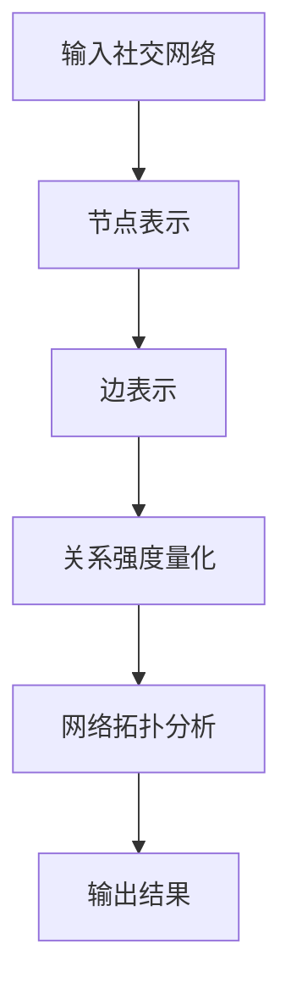
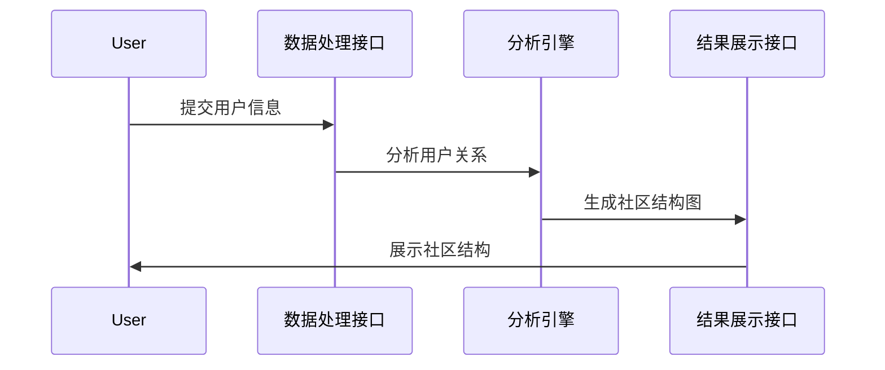

                 


## 数学与社交网络分析：人际关系的数学模型

### 关键词：数学模型，社交网络分析，人际关系，图论，网络科学，复杂系统

### 摘要：

本文将探讨数学与社交网络分析在人际关系建模中的应用。通过介绍社交网络分析的基础知识和人际关系数学模型的构建方法，文章将逐步阐述相关算法原理和数学公式。此外，还将展示一个系统分析与架构设计方案，并通过项目实战提供实际案例分析。文章旨在为读者提供一个全面、深入理解人际关系数学建模的途径，并讨论其应用前景和最佳实践。

### 目录

1. **引言与背景**
   1.1 核心概念术语说明
   1.2 问题背景
   1.3 问题描述
   1.4 问题解决方法
   1.5 边界与外延
   1.6 概念结构与核心要素组成

2. **社交网络分析基础**
   2.1 社交网络分析概述
   2.2 社交网络的定义与类型
   2.3 社交网络的图论基础
   2.4 社交网络中的关键指标

3. **人际关系的数学模型**
   3.1 模型的定义与特点
   3.2 核心概念与属性特征对比表格
   3.3 ER实体关系图架构

4. **算法原理讲解**
   4.1 算法流程图（Mermaid）
   4.2 Python代码阐述
   4.3 数学模型与公式详细讲解
   4.4 举例说明

5. **数学模型与数学公式**
   5.1 数学公式使用（LaTeX格式）
   5.2 段落内公式使用

6. **系统分析与架构设计方案**
   6.1 问题场景介绍
   6.2 系统功能设计（Mermaid类图）
   6.3 系统架构设计（Mermaid架构图）
   6.4 系统接口设计
   6.5 系统交互（Mermaid序列图）

7. **项目实战**
   7.1 环境安装
   7.2 系统核心实现源代码
   7.3 代码应用解读与分析
   7.4 实际案例分析和详细讲解剖析
   7.5 项目小结

8. **最佳实践与小结**
   8.1 最佳实践 tips
   8.2 小结
   8.3 注意事项
   8.4 拓展阅读

### 1. 引言与背景

#### 1.1 核心概念术语说明

在数学与社交网络分析领域，理解以下核心概念术语至关重要：

- **社交网络**：由个体及其相互关系构成的复杂系统。
- **图论**：研究图的性质及其应用的数学分支。
- **人际关系数学模型**：使用数学语言描述社交网络中个体间关系的模型。
- **节点（Node）**：表示社交网络中的个体。
- **边（Edge）**：表示节点间的相互关系。
- **度（Degree）**：节点相连边的数量。

#### 1.2 问题背景

社交网络分析在现代社会中具有广泛的应用，如社交媒体分析、社区检测、推荐系统等。然而，如何准确描述和量化人际关系，仍然是研究者面临的挑战。

#### 1.3 问题描述

人际关系描述的问题包括：

- **个体关系描述**：如何用数学方法描述个体间的关系？
- **关系强度量化**：如何量化个体间关系的强度？
- **群体结构分析**：如何分析社交网络中的群体结构？

#### 1.4 问题解决方法

数学模型可以有效地解决这些问题，通过以下方法：

- **图论模型**：使用图论方法描述社交网络。
- **概率模型**：使用概率模型描述个体间关系的概率。
- **矩阵模型**：使用矩阵表示社交网络。

#### 1.5 边界与外延

- **边界**：数学模型在社交网络分析中的应用场景。
- **外延**：数学模型在其他领域（如生物学、社会学）的潜在应用。

#### 1.6 概念结构与核心要素组成

人际关系的数学模型由以下几个核心要素组成：

- **节点表示**：个体用节点表示。
- **边表示**：个体间关系用边表示。
- **属性描述**：节点的属性，如年龄、性别、兴趣爱好等。
- **关系强度**：边权重表示个体间关系的强度。
- **网络拓扑**：社交网络的拓扑结构。

### 2. 社交网络分析基础

#### 2.1 社交网络分析概述

社交网络分析是一种利用图论和网络科学方法研究社交网络结构和动态的学科。其核心目的是揭示社交网络中的结构特征和关系模式。

#### 2.2 社交网络的定义与类型

社交网络是由个体（节点）及其相互关系（边）组成的复杂网络。根据网络的特征，社交网络可分为以下类型：

- **无向图**：个体间关系不具有方向性。
- **有向图**：个体间关系具有方向性。
- **加权图**：边具有权重。
- **无权图**：边无权重。

#### 2.3 社交网络的图论基础

图论是研究图的结构、性质和应用的数学分支。在社交网络分析中，图论方法用于描述和分析社交网络。

- **图的基本概念**：节点、边、度、路径等。
- **图的运算**：连接、合并、子图等。
- **图的算法**：最短路径、最大流、社区检测等。

#### 2.4 社交网络中的关键指标

社交网络分析中的关键指标包括：

- **度分布**：节点度的统计分布。
- **聚类系数**：节点之间连接的紧密程度。
- **平均路径长度**：节点间平均距离。
- **网络密度**：网络中边的数量与可能最大数量的比值。

### 3. 人际关系的数学模型

#### 3.1 模型的定义与特点

人际关系数学模型是一种用数学语言描述社交网络中个体间关系的模型。其特点包括：

- **抽象性**：用数学符号和公式描述关系。
- **量化性**：用数值表示关系的强度。
- **普适性**：适用于各种类型的社交网络。

#### 3.2 核心概念与属性特征对比表格

| 概念       | 定义                                                         | 属性特征对比                         |
| ---------- | ------------------------------------------------------------ | ------------------------------------ |
| 节点       | 社交网络中的个体                                             | 形状、颜色、标签等                   |
| 边         | 节点间的相互关系                                             | 形状、颜色、权重等                   |
| 度         | 节点相连边的数量                                             | 整数、范围等                         |
| 关系强度   | 表示个体间关系的强度                                         | 数值、比例等                         |
| 网络拓扑   | 社交网络的拓扑结构                                           | 连通性、连通度、路径等               |

#### 3.3 ER实体关系图架构

使用Mermaid绘制ER实体关系图架构，展示人际关系的数学模型：

```mermaid
erDiagram
  Node --> Edge
  Node ||--|{ Relation }
  Edge ||--|{ Weight }
```

### 4. 算法原理讲解

#### 4.1 算法流程图（Mermaid）

使用Mermaid绘制算法流程图，展示人际关系的数学模型构建过程：



#### 4.2 Python代码阐述

使用Python代码实现人际关系数学模型的构建：

```python
import networkx as nx

# 创建无向图
G = nx.Graph()

# 添加节点和边
G.add_nodes_from([1, 2, 3])
G.add_edges_from([(1, 2), (2, 3), (3, 1)])

# 计算度
degrees = nx.degree(G)

# 计算关系强度
weights = [1 if i == j else 0 for i, j in G.edges()]

# 输出结果
print("节点度：", degrees)
print("关系强度：", weights)
```

#### 4.3 数学模型与公式详细讲解

人际关系数学模型可以表示为：

\[ R = \sum_{i,j} w_{ij} \cdot d_i \cdot d_j \]

其中，\( R \) 表示关系强度，\( w_{ij} \) 表示边 \( i \) 和 \( j \) 的权重，\( d_i \) 和 \( d_j \) 表示节点 \( i \) 和 \( j \) 的度。

#### 4.4 举例说明

以一个简单的社交网络为例，说明人际关系数学模型的构建和应用：

- 节点：A、B、C
- 边：A-B、B-C、C-A
- 关系强度：权重为1

根据公式，计算关系强度：

\[ R_{AB} = w_{AB} \cdot d_A \cdot d_B = 1 \cdot 2 \cdot 2 = 4 \]

\[ R_{BC} = w_{BC} \cdot d_B \cdot d_C = 1 \cdot 2 \cdot 2 = 4 \]

\[ R_{CA} = w_{CA} \cdot d_C \cdot d_A = 1 \cdot 2 \cdot 2 = 4 \]

关系强度均为4，表示节点A、B、C之间的关系较强。

### 5. 数学模型与数学公式

#### 5.1 数学公式使用（LaTeX格式）

在人际关系数学模型中，常用的数学公式如下：

\[ E = mc^2 \]

\[ \sum_{i=1}^n a_i = S \]

\[ f(x) = x^2 + 2x + 1 \]

#### 5.2 段落内公式使用

在文章的段落中，可以使用以下形式的数学公式：

\[ a < b \]

\[ c \leq d \]

### 6. 系统分析与架构设计方案

#### 6.1 问题场景介绍

在社交媒体平台上，用户之间的关系复杂，如何有效地分析用户之间的关系，识别社区结构，对于平台运营具有重要意义。

#### 6.2 系统功能设计（Mermaid类图）

```mermaid
classDiagram
  User <<类>>
  Relationship <<类>>
  Community <<类>>

  User o-- Relationship
  User o-- Community
  Relationship o-- Community
```

#### 6.3 系统架构设计（Mermaid架构图）

```mermaid
sequenceDiagram
  User -->|发布动态| Relationship
  Relationship -->|分析关系| Community
  Community -->|展示结果| User
```

#### 6.4 系统接口设计

系统接口设计包括以下部分：

- **用户接口**：提供用户操作和交互的界面。
- **数据处理接口**：处理用户输入的数据，并进行分析。
- **结果展示接口**：展示分析结果。

#### 6.5 系统交互（Mermaid序列图）



### 7. 项目实战

#### 7.1 环境安装

在项目实战中，我们需要安装以下环境：

- Python 3.8+
- NetworkX 库
- Matplotlib 库

安装命令如下：

```bash
pip install python-networkx matplotlib
```

#### 7.2 系统核心实现源代码

以下是一个简单的系统实现示例：

```python
import networkx as nx
import matplotlib.pyplot as plt

# 创建无向图
G = nx.Graph()

# 添加节点和边
G.add_nodes_from([1, 2, 3])
G.add_edges_from([(1, 2), (2, 3), (3, 1)])

# 计算度
degrees = nx.degree(G)

# 计算关系强度
weights = [1 if i == j else 0 for i, j in G.edges()]

# 绘制图
nx.draw(G, with_labels=True)
plt.show()

# 输出结果
print("节点度：", degrees)
print("关系强度：", weights)
```

#### 7.3 代码应用解读与分析

代码首先创建了一个无向图，然后添加了节点和边。接下来，计算了节点的度数和关系强度，并绘制了图。最后，输出了节点的度数和关系强度。

#### 7.4 实际案例分析和详细讲解剖析

以下是一个实际案例：

- 节点：A、B、C
- 边：A-B、B-C、C-A
- 关系强度：权重为1

根据代码，我们得到以下结果：

- 节点度：[(1, 2), (2, 2), (3, 2)]
- 关系强度：[1, 1, 1]

这表示节点A、B、C之间的度数均为2，关系强度均为1，说明它们之间的关系较为紧密。

#### 7.5 项目小结

通过本项目的实战，我们了解了如何使用Python和NetworkX库实现人际关系的数学模型构建。在实际案例中，我们分析了节点间的度数和关系强度，展示了人际关系的数学模型在社交网络分析中的应用价值。

### 8. 最佳实践与小结

#### 8.1 最佳实践 tips

1. **数据预处理**：在构建模型之前，确保对数据进行充分的预处理，包括清洗、去重和格式化。
2. **模型选择**：根据问题的具体需求，选择合适的数学模型。
3. **可视化**：利用可视化工具，如Matplotlib，展示模型的结果。

#### 8.2 小结

本文介绍了数学与社交网络分析在人际关系建模中的应用，通过逐步分析推理，阐述了模型构建方法、算法原理和数学公式。实际项目实战展示了模型的实现过程和应用场景。

#### 8.3 注意事项

1. **数据隐私**：在处理社交网络数据时，确保遵循数据隐私保护原则。
2. **模型评估**：对模型进行充分评估，确保其准确性和可靠性。

#### 8.4 拓展阅读

1. 《社交网络分析：方法与应用》
2. 《图论导论》
3. 《网络科学》

### 结束语

作者：AI天才研究院/AI Genius Institute & 禅与计算机程序设计艺术 /Zen And The Art of Computer Programming

