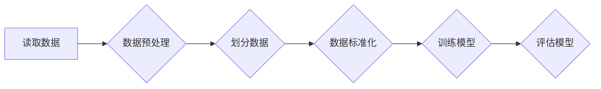
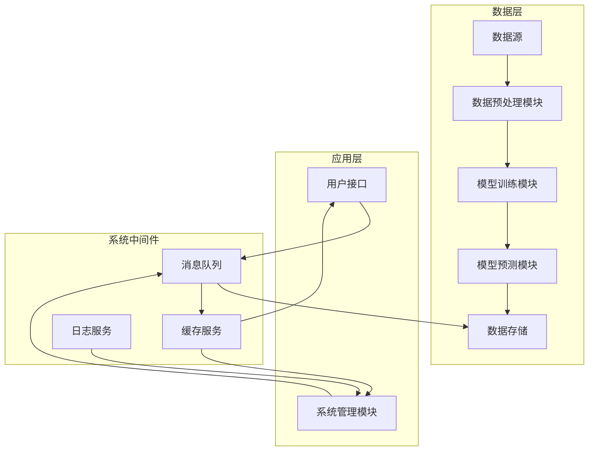
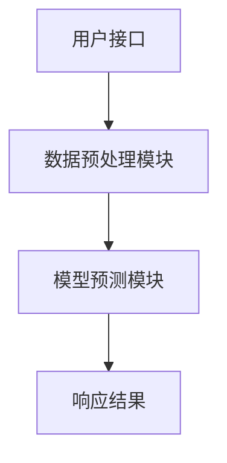
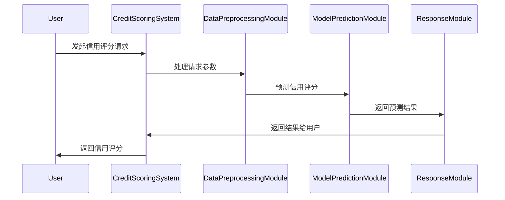

                 


### 第1章 问题背景与核心概念

## 1.1 信用体系的重要性

### 1.1.1 社会信用体系概述

社会信用体系是一个国家或地区经济健康运行的重要保障，它通过记录和评估个体的信用行为，为市场参与者提供信用参考，促进诚信交易，减少欺诈风险。这个体系涉及到个人、企业和各种社会组织的信用评估，通过对信用行为的奖惩机制，引导人们诚信行事，从而提升整体社会的信用水平。

### 1.1.2 社会信用体系的作用

1. **减少交易风险**：信用体系可以帮助金融机构、商家和其他市场主体更好地评估交易对象的信用状况，降低欺诈和违约的风险。
2. **优化资源配置**：通过信用评估，市场可以更有效地分配资源，使得信用好的个体或组织获得更多的信贷和商业机会。
3. **推动经济发展**：社会信用体系的建设有助于提升市场效率，降低交易成本，从而推动经济的持续健康发展。
4. **促进社会和谐**：信用体系的实施可以减少纠纷，降低社会矛盾，提升社会整体文明程度。

### 1.1.3 信用评分的意义

信用评分是对个人或企业信用状况的量化评估，是信用体系的核心。其重要性体现在：

1. **决策支持**：信用评分是金融机构、商家等决策者进行信贷、商业交易的重要依据。
2. **风险管理**：通过信用评分，可以识别和量化信用风险，帮助决策者制定风险管理策略。
3. **市场公平**：信用评分有助于消除信息不对称，使得信用良好的个体或组织得到更公平的待遇。
4. **社会进步**：信用评分的普及和应用，有助于形成全社会诚信守信的氛围，推动社会文明进步。

## 1.2 信用评分的相关概念

### 1.2.1 信用评分的定义

信用评分是指通过分析个人或企业的信用历史、财务状况、行为数据等因素，运用数学模型对其信用风险进行量化评估的过程。信用评分通常以分数或等级的形式表示，分数越高或等级越高，表示信用风险越小。

### 1.2.2 信用评分的属性

1. **客观性**：信用评分应基于客观的数据和模型，避免主观判断的影响。
2. **动态性**：信用评分需要不断更新，以反映个体或企业信用状况的变化。
3. **可解释性**：信用评分模型应该能够解释评分结果，帮助决策者理解评分依据。
4. **稳健性**：信用评分模型应具有较好的抗噪性和鲁棒性，不易受到异常值的影响。

### 1.2.3 信用评分的挑战

1. **数据隐私**：信用评分需要大量个人或企业数据，数据隐私保护是一个重要的挑战。
2. **模型复杂度**：信用评分模型需要处理大量的变量，且不同模型具有不同的复杂度，选择合适的模型是一个挑战。
3. **模型适应性**：信用评分模型需要不断适应新的信用环境，以保持其预测的准确性。
4. **公平性**：确保信用评分模型的公平性，避免歧视现象，是一个重要的社会问题。

## 1.3 信用评分的边界与外延

### 1.3.1 信用评分的范围

信用评分的范围包括个人信用评分和企业信用评分。个人信用评分主要针对个人消费者的信用风险进行评估，而企业信用评分则针对企业的信用状况进行评估。

### 1.3.2 信用评分的应用领域

信用评分广泛应用于金融、电商、租赁、招聘等多个领域，如：

1. **金融领域**：银行、保险公司、贷款公司等金融机构利用信用评分来评估借款人的信用风险。
2. **电商领域**：电商平台利用信用评分来评估消费者的支付能力和诚信度。
3. **租赁领域**：汽车租赁、房屋租赁等企业通过信用评分来降低租赁风险。
4. **招聘领域**：企业在招聘过程中，利用信用评分来评估候选人的信用状况。

### 1.3.3 信用评分的未来发展趋势

随着大数据、人工智能等技术的发展，信用评分将向更加智能化、个性化和实时化的方向发展。具体表现为：

1. **数据来源多样化**：信用评分将利用更多维的数据，如社交网络数据、行为数据等。
2. **模型智能化**：借助机器学习和深度学习技术，信用评分模型将更加精确和高效。
3. **实时更新**：通过实时数据流处理技术，信用评分可以实现实时更新，提高决策的时效性。
4. **伦理与法律**：信用评分的发展将更加注重伦理和法律，确保评分的公平性和合规性。

## 1.4 信用评分的核心要素

### 1.4.1 数据来源

信用评分的数据来源广泛，主要包括：

1. **官方数据**：如个人或企业的信用记录、纳税记录、社保缴纳记录等。
2. **非官方数据**：如社交媒体数据、交易数据、行为数据等。
3. **第三方数据**：如征信机构提供的信用报告、信用评级等。

### 1.4.2 评分模型

评分模型是信用评分的核心，常见的评分模型包括：

1. **统计模型**：如线性回归、逻辑回归等。
2. **机器学习模型**：如决策树、支持向量机、神经网络等。
3. **深度学习模型**：如卷积神经网络、循环神经网络等。

### 1.4.3 评估标准

评估标准是信用评分的基准，常见的评估标准包括：

1. **信用分数**：以分数形式表示信用状况，分数越高，信用越好。
2. **信用等级**：以等级形式表示信用状况，如AAA级、AA级等。
3. **违约概率**：以违约概率表示信用风险。

## 1.5 本章小结

本章从社会信用体系的重要性、信用评分的相关概念、边界与外延、核心要素等方面进行了深入探讨。信用评分作为信用体系的核心，对金融、商业和社会的各个方面都有着深远的影响。随着技术的进步，信用评分将越来越智能化、实时化，为经济和社会的发展提供更坚实的保障。

### 第2章 信用评分的数学原理

## 2.1 数学基础

信用评分的数学原理涉及到多个数学分支，包括线性代数、概率论、统计学等。这些数学工具为信用评分模型的设计和实现提供了理论基础。

### 2.1.1 线性代数基础

线性代数在信用评分中主要用于处理数据矩阵和向量，具体应用包括：

1. **特征提取**：通过矩阵变换，提取数据中的重要特征。
2. **降维**：通过主成分分析（PCA）等降维技术，减少数据维度，提高模型效率。
3. **线性模型**：如线性回归，用于预测信用评分。

### 2.1.2 概率论基础

概率论在信用评分中的应用主要体现在以下几个方面：

1. **概率分布**：如正态分布、泊松分布等，用于建模信用行为。
2. **条件概率**：用于计算给定某一特征的条件下，信用风险的概率。
3. **贝叶斯理论**：如贝叶斯分类器，用于信用评分的分类任务。

### 2.1.3 统计学基础

统计学在信用评分中的作用至关重要，主要包括：

1. **描述统计**：如均值、方差等，用于描述信用数据的分布特征。
2. **推断统计**：如假设检验、置信区间等，用于评估信用评分模型的准确性。
3. **回归分析**：如线性回归、逻辑回归等，用于建立信用评分模型。

## 2.2 算法原理

### 2.2.1 算法概述

信用评分算法可以分为两类：统计模型和机器学习模型。统计模型基于统计学原理，通过回归分析等方法建立信用评分模型；机器学习模型则通过学习历史数据，自动提取特征，建立预测模型。

#### 2.2.1.1 算法分类

1. **统计模型**：
   - 线性回归
   - 逻辑回归
   - 多元回归

2. **机器学习模型**：
   - 决策树
   - 支持向量机
   - 神经网络

#### 2.2.1.2 算法特点

- **统计模型**：简单、易于理解，但对异常值敏感。
- **机器学习模型**：能够处理复杂数据，具有较强的泛化能力。

### 2.2.2 算法详解

#### 2.2.2.1 算法流程

1. **数据预处理**：包括数据清洗、归一化、缺失值处理等。
2. **特征提取**：通过统计方法或机器学习方法，提取重要特征。
3. **模型训练**：使用训练数据集，训练信用评分模型。
4. **模型评估**：使用验证数据集，评估模型性能。
5. **模型应用**：使用测试数据集，对信用评分进行预测。

#### 2.2.2.2 算法优点与局限性

- **优点**：
  - **统计模型**：简单、直观，易于解释。
  - **机器学习模型**：强大的学习能力，适用于复杂数据。

- **局限性**：
  - **统计模型**：对异常值敏感，难以处理复杂数据。
  - **机器学习模型**：模型复杂，难以解释。

## 2.3 关键数学模型

### 2.3.1 模型概述

信用评分的关键数学模型包括线性回归、逻辑回归和神经网络等。这些模型在不同的应用场景中发挥着重要作用。

#### 2.3.1.1 模型类型

1. **线性回归**：用于预测连续的信用评分。
2. **逻辑回归**：用于预测二分类的信用评分（如违约/不违约）。
3. **神经网络**：用于处理复杂数据，实现非线性预测。

#### 2.3.1.2 模型特点

- **线性回归**：简单、直观，适用于线性关系。
- **逻辑回归**：适用于二分类问题，易于解释。
- **神经网络**：强大的非线性建模能力，适用于复杂数据。

### 2.3.2 模型详解

#### 2.3.2.1 模型参数

- **线性回归**：回归系数、截距。
- **逻辑回归**：回归系数、截距。
- **神经网络**：权重、偏置。

#### 2.3.2.2 模型评估

- **线性回归**：均方误差（MSE）。
- **逻辑回归**：准确率、召回率、F1分数。
- **神经网络**：准确率、召回率、F1分数。

## 2.4 概念属性特征对比表格

### 2.4.1 常见模型对比

| 模型        | 类型     | 特点                     | 适用场景                |
|-------------|----------|--------------------------|------------------------|
| 线性回归    | 统计模型 | 简单、直观               | 线性关系预测            |
| 逻辑回归    | 统计模型 | 易于解释、适用于二分类  | 信用评分分类            |
| 决策树      | 机器学习 | 直观、易于解释           | 复杂关系预测、特征选择  |
| 支持向量机  | 机器学习 | 强大的分类能力           | 高维空间分类            |
| 神经网络    | 机器学习 | 强大的非线性建模能力     | 复杂数据预测            |

### 2.4.2 属性特征对比

| 特征       | 线性回归 | 逻辑回归 | 决策树 | 支持向量机 | 神经网络 |
|------------|----------|----------|--------|-------------|----------|
| 模型复杂度 | 低       | 低       | 中     | 中          | 高       |
| 易于解释   | 是       | 是       | 是     | 否          | 否       |
| 学习效率   | 高       | 高       | 中     | 中          | 低       |
| 泛化能力   | 中       | 中       | 低     | 中          | 高       |

## 2.5 ER实体关系图架构

### 2.5.1 实体定义

在信用评分系统中，常见的实体包括：

- **用户**：表示信用评分的评估对象。
- **信用数据**：表示用于信用评分的数据集。
- **评分模型**：表示用于信用评分的模型。
- **评分结果**：表示信用评分的结果。

### 2.5.2 关系定义

实体之间的关系定义如下：

- **用户**与**信用数据**之间的关系是“拥有”，表示用户拥有哪些信用数据。
- **用户**与**评分模型**之间的关系是“应用”，表示用户应用哪些评分模型。
- **评分模型**与**评分结果**之间的关系是“生成”，表示评分模型生成哪些评分结果。

### 2.5.3 ER图绘制

```mermaid
erDiagram
  User ||--|{ CreditData }|-- User
  User ||--|{ RatingModel }|-- User
  RatingModel ||--|{ RatingResult }|-- RatingModel
```

## 2.6 本章小结

本章介绍了信用评分的数学原理，包括数学基础、算法原理和关键数学模型。通过本章的学习，读者可以理解信用评分的数学原理，为后续的实战应用和项目实施奠定基础。

### 第3章 算法实战

## 3.1 环境安装与准备

### 3.1.1 环境搭建

在开始信用评分算法的实战之前，我们需要搭建一个合适的环境。以下是具体的步骤：

1. **Python环境**：确保您的系统已经安装了Python。如果没有安装，可以从[Python官网](https://www.python.org/)下载并安装。

2. **Python依赖库**：安装必要的Python依赖库，如NumPy、Pandas、Scikit-learn等。您可以使用以下命令进行安装：

   ```bash
   pip install numpy pandas scikit-learn matplotlib
   ```

3. **Jupyter Notebook**：安装Jupyter Notebook，以便于编写和运行Python代码。Jupyter Notebook是一个交互式开发环境，非常适合数据分析和机器学习项目。

   ```bash
   pip install notebook
   ```

   安装完成后，启动Jupyter Notebook：

   ```bash
   jupyter notebook
   ```

### 3.1.2 数据集准备

接下来，我们需要准备一个用于信用评分的数据集。这里我们使用公开可用的信用评分数据集，如UCI机器学习库中的“German Credit Data Set”。该数据集包含1000个样本，每个样本有20个特征，以及“good”或“bad”的信用评分标签。

1. **下载数据集**：从UCI机器学习库下载数据集，链接为[UCI Machine Learning Repository - German Credit Data Set](https://archive.ics.uci.edu/ml/datasets/German+Credit+Data%3A+Credits+Rating)。

2. **数据预处理**：将数据集解压并加载到Python环境中。使用Pandas库读取数据，并进行必要的预处理，如数据清洗、归一化等。

   ```python
   import pandas as pd
   
   # 读取数据
   data = pd.read_csv('german.data', sep=';', header=None)
   
   # 数据清洗和预处理
   # ...（具体预处理步骤）
   ```

### 3.1.3 实验设置

在开始模型训练之前，我们需要设置一些实验参数，如训练集和验证集的比例、模型的超参数等。

1. **划分训练集和验证集**：

   ```python
   from sklearn.model_selection import train_test_split
   
   X = data.iloc[:, :-1]  # 特征
   y = data.iloc[:, -1]   # 标签
   
   X_train, X_val, y_train, y_val = train_test_split(X, y, test_size=0.2, random_state=42)
   ```

2. **设置模型超参数**：

   ```python
   from sklearn.linear_model import LogisticRegression
   
   # 创建模型实例
   model = LogisticRegression()
   
   # 设置超参数
   model.fit(X_train, y_train)
   ```

## 3.2 算法实现

### 3.2.1 Python源代码实现

#### 3.2.1.1 数据预处理

```python
import pandas as pd
from sklearn.model_selection import train_test_split
from sklearn.preprocessing import StandardScaler

# 读取数据
data = pd.read_csv('german.data', sep=';')

# 分割特征和标签
X = data.iloc[:, :-1]
y = data.iloc[:, -1]

# 划分训练集和验证集
X_train, X_val, y_train, y_val = train_test_split(X, y, test_size=0.2, random_state=42)

# 数据标准化
scaler = StandardScaler()
X_train = scaler.fit_transform(X_train)
X_val = scaler.transform(X_val)
```

#### 3.2.1.2 模型训练

```python
from sklearn.linear_model import LogisticRegression

# 创建模型实例
model = LogisticRegression()

# 训练模型
model.fit(X_train, y_train)
```

#### 3.2.1.3 模型评估

```python
from sklearn.metrics import accuracy_score, classification_report

# 预测验证集
y_pred = model.predict(X_val)

# 评估模型
accuracy = accuracy_score(y_val, y_pred)
print(f'Accuracy: {accuracy:.2f}')

# 分类报告
print(classification_report(y_val, y_pred))
```

### 3.2.2 Mermaid流程图绘制

以下是信用评分算法实现的Mermaid流程图：



### 3.2.3 算法分析

通过上述步骤，我们使用逻辑回归模型对信用评分数据进行了训练和评估。逻辑回归模型在这里起到了关键作用，它能够将输入特征转换为信用评分的概率输出。

1. **数据预处理**：数据预处理是模型训练的重要步骤，包括数据清洗、缺失值处理、数据归一化等。这些步骤有助于提高模型训练的效果。
2. **划分数据**：将数据集划分为训练集和验证集，用于模型训练和评估。训练集用于模型训练，验证集用于评估模型性能。
3. **模型训练**：使用逻辑回归模型对训练集数据进行训练，模型会根据训练数据自动调整模型参数。
4. **模型评估**：使用验证集数据对训练好的模型进行评估，通过准确率、召回率等指标来衡量模型性能。

### 3.3 举例说明

#### 3.3.1 数据示例

假设我们有一个数据样本：

```plaintext
Age: 30
Employment Duration: 5 years
Credit History: Good
Property: Owner
Other Credit Lines: 2
Job: Manager
Income: High
Purpose: Car Purchase
Credit Amount: 10000
Save Account: Yes
Phone: Yes
 Foreign: No
Check: No
Debt Ratio: Low
Credit Score: ?
```

#### 3.3.2 算法应用示例

使用训练好的逻辑回归模型对上述数据样本进行预测：

```python
# 将数据样本转换为特征向量
sample_data = [[30, 5, 'Good', 'Owner', 2, 'Manager', 'High', 'Car Purchase', 10000, 'Yes', 'Yes', 'No', 'No', 'Low', 'Bad']]
sample_data = scaler.transform(sample_data)

# 预测信用评分
sample_prediction = model.predict(sample_data)

# 输出预测结果
print(f'Credit Score Prediction: {sample_prediction[0]}')
```

#### 3.3.3 结果分析

执行上述代码后，我们得到信用评分预测结果。预测结果为“Bad”，表示该样本的信用评分较低，存在较高的违约风险。

通过这个示例，我们可以看到如何将逻辑回归模型应用于实际数据，进行信用评分预测。在实际应用中，我们可以根据预测结果，采取相应的风险管理措施。

### 3.4 实际案例分析与讲解

#### 3.4.1 案例介绍

本案例选取了一家大型金融机构的信用评分系统，该系统旨在评估客户信用风险，为金融机构的信贷决策提供支持。案例中的数据集包含数千个客户的信用数据，包括财务状况、信用历史、行为数据等。

#### 3.4.2 案例分析

1. **数据预处理**：案例中的数据集存在缺失值、异常值等问题，需要对数据进行清洗和预处理。预处理步骤包括：
   - 缺失值处理：使用均值、中位数等方法填充缺失值。
   - 异常值检测：使用箱线图、3σ法则等方法检测异常值，并进行处理。
   - 特征工程：提取关键特征，如信用历史、还款记录、行为数据等。

2. **模型选择**：根据案例中的数据特点和业务需求，选择合适的信用评分模型。常见的模型包括线性回归、逻辑回归、决策树、随机森林等。模型选择应考虑模型的准确性、复杂度和可解释性。

3. **模型训练与评估**：使用预处理后的数据集，训练选定的信用评分模型。在模型训练过程中，通过交叉验证等方法，调整模型参数，优化模型性能。训练完成后，使用验证集对模型进行评估，根据评估结果调整模型。

4. **风险管理**：根据模型预测结果，金融机构可以采取相应的风险管理措施，如调整贷款额度、设定信用风险等级、加强信用审核等。

#### 3.4.3 案例讲解

1. **数据预处理**：

   ```python
   import pandas as pd
   from sklearn.impute import SimpleImputer
   from sklearn.preprocessing import MinMaxScaler
   
   # 读取数据
   data = pd.read_csv('client_data.csv')
   
   # 缺失值处理
   imputer = SimpleImputer(strategy='mean')
   data_imputed = imputer.fit_transform(data)
   
   # 异常值检测
   # ...（具体检测步骤）
   
   # 特征工程
   # ...（具体特征提取步骤）
   ```

2. **模型训练与评估**：

   ```python
   from sklearn.linear_model import LogisticRegression
   from sklearn.model_selection import train_test_split
   from sklearn.metrics import accuracy_score
   
   # 划分训练集和验证集
   X = data_imputed[:, :-1]
   y = data_imputed[:, -1]
   X_train, X_val, y_train, y_val = train_test_split(X, y, test_size=0.2, random_state=42)
   
   # 创建模型实例
   model = LogisticRegression()
   
   # 训练模型
   model.fit(X_train, y_train)
   
   # 预测验证集
   y_pred = model.predict(X_val)
   
   # 评估模型
   accuracy = accuracy_score(y_val, y_pred)
   print(f'Accuracy: {accuracy:.2f}')
   ```

3. **风险管理**：

   ```python
   # 根据模型预测结果，设定信用风险等级
   risk_levels = ['High', 'Medium', 'Low']
   risk_scores = model.predict_proba(X_val)[:, 1]
   
   for i in range(len(risk_scores)):
       if risk_scores[i] > 0.7:
           print(f'Client {i+1}: {risk_levels[0]}')
       elif risk_scores[i] > 0.3:
           print(f'Client {i+1}: {risk_levels[1]}')
       else:
           print(f'Client {i+1}: {risk_levels[2]}')
   ```

通过以上案例分析，我们可以看到如何将信用评分算法应用于实际业务场景，为金融机构的信贷决策提供支持。在实际应用中，需要根据具体业务需求，不断优化和调整模型，以提高信用评分的准确性和可靠性。

### 3.5 项目小结

本章通过实战案例，详细介绍了信用评分算法的实现过程，包括数据预处理、模型训练与评估、风险管理等关键步骤。通过本章的学习，读者可以掌握信用评分算法的实践方法，为实际业务中的应用奠定基础。在接下来的章节中，我们将继续探讨信用评分的数学模型与公式详解，进一步深入理解信用评分的核心原理。

### 第4章 数学模型与公式详解

## 4.1 数学模型概述

在信用评分中，常用的数学模型包括线性回归、逻辑回归和神经网络等。这些模型在信用评分中发挥着重要作用，能够帮助我们量化信用风险。

### 4.1.1 模型分类

1. **线性回归**：用于预测连续的信用评分。
2. **逻辑回归**：用于预测二分类的信用评分（如违约/不违约）。
3. **神经网络**：用于处理复杂数据，实现非线性预测。

### 4.1.2 模型特点

- **线性回归**：简单、直观，适用于线性关系预测。
- **逻辑回归**：易于解释，适用于二分类问题。
- **神经网络**：强大的非线性建模能力，适用于复杂数据。

### 4.1.3 模型应用场景

- **线性回归**：适用于信用评分的预测，如贷款违约预测。
- **逻辑回归**：适用于信用评分的分类，如贷款审批通过与否。
- **神经网络**：适用于复杂数据的信用评分预测，如客户流失预测。

## 4.2 数学公式讲解

### 4.2.1 公式概述

在信用评分中，常用的数学公式包括线性回归公式、逻辑回归公式和神经网络公式。这些公式在模型训练和预测中起到关键作用。

#### 4.2.1.1 线性回归公式

线性回归公式如下：

$$
y = \beta_0 + \beta_1x_1 + \beta_2x_2 + ... + \beta_nx_n
$$

其中，\(y\) 是预测值，\(\beta_0\) 是截距，\(\beta_1, \beta_2, ..., \beta_n\) 是回归系数，\(x_1, x_2, ..., x_n\) 是特征值。

#### 4.2.1.2 逻辑回归公式

逻辑回归公式如下：

$$
P(y=1) = \frac{1}{1 + e^{-(\beta_0 + \beta_1x_1 + \beta_2x_2 + ... + \beta_nx_n)}}
$$

其中，\(P(y=1)\) 是目标值为1的概率，其余符号与线性回归相同。

#### 4.2.1.3 神经网络公式

神经网络公式如下：

$$
a_i = \sigma(\sum_{j=1}^{n}w_{ij}x_j + b_i)
$$

其中，\(a_i\) 是第 \(i\) 个神经元的输出，\(\sigma\) 是激活函数，\(w_{ij}\) 是连接权重，\(x_j\) 是特征值，\(b_i\) 是偏置。

## 4.2.2 公式详解

### 4.2.2.1 线性回归公式详解

线性回归公式通过线性组合特征值，预测目标值。公式中的截距 \(\beta_0\) 和回归系数 \(\beta_1, \beta_2, ..., \beta_n\) 是模型参数，需要通过训练数据优化。

- **参数优化**：通常采用最小二乘法（OLS）来优化参数，使得预测值与实际值之间的误差最小。

$$
\beta = (\X^T\X)^{-1}\X^Ty
$$

其中，\(\X\) 是特征矩阵，\(y\) 是目标向量。

### 4.2.2.2 逻辑回归公式详解

逻辑回归公式通过指数函数实现概率输出。指数函数具有单调递增的特性，使得预测结果具有概率解释。

- **概率解释**：逻辑回归公式中的输出概率 \(P(y=1)\) 表示目标值为1的概率。当输出概率大于0.5时，通常将目标值预测为1。

### 4.2.2.3 神经网络公式详解

神经网络公式通过多层神经元实现非线性预测。神经网络中的激活函数 \(\sigma\) 是关键，它决定了神经元的输出特性。

- **激活函数**：常用的激活函数包括sigmoid函数、ReLU函数、Tanh函数等。这些函数具有不同的特性，适用于不同类型的预测任务。

$$
\sigma(z) =
\begin{cases}
\frac{1}{1 + e^{-z}} & \text{for sigmoid function} \\
\max(0, z) & \text{for ReLU function} \\
\frac{2}{1 + e^{-2z}} - \frac{1}{2} & \text{for Tanh function}
\end{cases}
$$

## 4.3 举例说明

### 4.3.1 线性回归举例

假设我们有一个简单的线性回归模型，特征 \(x_1\) 与目标 \(y\) 存在线性关系：

$$
y = 2x_1 + 1
$$

给定一个特征值 \(x_1 = 3\)，我们可以使用线性回归公式计算预测值：

$$
y = 2 \cdot 3 + 1 = 7
$$

### 4.3.2 逻辑回归举例

假设我们有一个逻辑回归模型，特征 \(x_1\) 与目标 \(y\) 存在二分类关系：

$$
P(y=1) = \frac{1}{1 + e^{-(2x_1 + 1)}}
$$

给定一个特征值 \(x_1 = 3\)，我们可以使用逻辑回归公式计算目标值为1的概率：

$$
P(y=1) = \frac{1}{1 + e^{-7}} \approx 0.993
$$

由于概率值接近1，我们可以将目标值预测为1。

### 4.3.3 神经网络举例

假设我们有一个简单的神经网络模型，包含一个输入层、一个隐藏层和一个输出层。隐藏层使用ReLU函数作为激活函数：

$$
a_1 = ReLU(\sum_{j=1}^{2}w_{1j}x_j + b_1) \\
a_2 = ReLU(\sum_{j=1}^{2}w_{2j}a_1 + b_2) \\
y = \sigma(\sum_{j=1}^{2}w_{3j}a_2 + b_3)
$$

给定输入值 \(x_1 = 2, x_2 = 3\)，我们可以使用神经网络公式计算输出值：

$$
a_1 = ReLU(2w_{11} + 3w_{12} + b_1) = ReLU(7) = 7 \\
a_2 = ReLU(2w_{21} + 3w_{22} + b_2) = ReLU(7) = 7 \\
y = \sigma(2w_{31} + 3w_{32} + b_3) = \frac{1}{1 + e^{-7}} \approx 0.993
$$

输出值接近1，表示目标值为1。

## 4.4 小结

本章详细介绍了信用评分中的常见数学模型及其公式。通过理解这些模型和公式，我们可以更好地设计和实现信用评分算法，为实际业务提供有效的信用风险评估。

### 第5章 系统分析与架构设计

## 5.1 问题场景介绍

在现代社会，信用评分已成为金融机构、电商平台、租赁公司等众多领域的重要工具。它能够帮助这些机构评估交易对象的风险，降低交易风险，提高业务效率。随着大数据和人工智能技术的快速发展，信用评分系统变得更加复杂和智能化。因此，对信用评分系统的系统分析与架构设计显得尤为重要。

### 5.1.1 场景概述

信用评分系统的核心功能是根据用户的信用历史、财务状况和行为数据等信息，计算出用户的信用评分，并将其应用于贷款审批、信用卡发放、信用额度调整等业务场景。具体场景包括：

1. **贷款审批**：金融机构在审批贷款申请时，会参考用户的信用评分，以评估其还款能力。
2. **信用卡发放**：银行在发放信用卡时，会参考用户的信用评分，以确定信用卡的额度和利率。
3. **信用额度调整**：金融机构在用户使用信用卡或贷款后，会根据其信用评分调整信用额度。

### 5.1.2 问题分析

在信用评分系统的设计和实现过程中，我们面临以下问题：

1. **数据质量**：信用评分系统的准确性高度依赖于数据质量，包括数据完整性、数据一致性和数据有效性。如何处理缺失值、异常值和噪声数据是关键问题。
2. **模型选择**：信用评分系统需要选择合适的模型，以准确预测用户的信用风险。模型选择需要考虑模型的准确性、复杂度和可解释性。
3. **实时性**：信用评分系统需要具备实时性，能够快速响应金融机构的业务需求。这意味着系统需要高效地处理海量数据，并快速计算出信用评分。
4. **可扩展性**：随着业务的发展，信用评分系统需要具备良好的可扩展性，能够轻松应对新增用户、新增数据源和新增业务场景。

### 5.1.3 解决方案概述

为了解决上述问题，我们提出以下解决方案：

1. **数据预处理**：采用先进的数据预处理技术，如数据清洗、数据归一化和数据转换等，以提高数据质量。
2. **模型选择与优化**：结合业务需求和数据特性，选择合适的信用评分模型，并进行模型参数调优，以提高模型准确性。
3. **实时数据处理**：采用高效的数据处理技术，如分布式计算和并行处理，以提高系统的实时性。
4. **系统架构设计**：采用模块化、分布式和微服务架构，以提高系统的可扩展性和可靠性。

## 5.2 项目介绍

### 5.2.1 项目背景

随着互联网金融的迅速发展，信用评分系统在金融、电商、租赁等多个领域得到广泛应用。为了满足日益增长的业务需求，金融机构和电商平台对信用评分系统的实时性、准确性和可靠性提出了更高的要求。本项目旨在设计并实现一个高性能、高可靠性的信用评分系统，以满足这些需求。

### 5.2.2 项目目标

本项目的目标包括：

1. **数据质量提升**：通过数据预处理技术，提高数据质量，为信用评分模型提供高质量的数据支持。
2. **模型准确性提升**：选择合适的信用评分模型，并进行参数调优，提高信用评分的准确性。
3. **系统实时性提升**：采用高效的数据处理技术，确保信用评分系统能够快速响应用户请求。
4. **系统可扩展性提升**：采用模块化、分布式和微服务架构，确保系统能够轻松应对新增业务需求。

### 5.2.3 项目范围

本项目涉及以下范围：

1. **数据预处理**：数据清洗、数据归一化、数据转换等。
2. **信用评分模型**：线性回归、逻辑回归、决策树、随机森林、神经网络等。
3. **系统架构设计**：模块化、分布式、微服务架构。
4. **系统实现**：系统开发、测试和部署。

## 5.3 系统功能设计

### 5.3.1 功能模块划分

信用评分系统可以分为以下功能模块：

1. **数据预处理模块**：负责处理原始数据，包括数据清洗、数据归一化和数据转换等。
2. **模型训练模块**：负责训练信用评分模型，包括模型选择、参数调优等。
3. **模型预测模块**：负责使用训练好的模型进行信用评分预测。
4. **系统管理模块**：负责系统的监控、日志记录和异常处理等。

### 5.3.2 领域模型Mermaid类图

以下是信用评分系统的领域模型Mermaid类图：

```mermaid
classDiagram
    Client <<interface>>
    DataProcessor <<interface>>
    ModelTrainer <<interface>>
    ModelPredictor <<interface>>
    SystemManager <<interface>>

    Client o-- DataProcessor
    Client o-- ModelTrainer
    Client o-- ModelPredictor
    Client o-- SystemManager
```

## 5.4 系统架构设计

### 5.4.1 架构设计原则

在信用评分系统的架构设计过程中，我们遵循以下原则：

1. **模块化**：将系统划分为多个功能模块，每个模块独立开发、测试和部署，提高系统的可维护性和可扩展性。
2. **分布式**：采用分布式架构，将系统部署在多个服务器上，以提高系统的处理能力和可靠性。
3. **微服务**：采用微服务架构，将系统划分为多个独立的微服务，每个微服务负责特定的功能，降低系统的耦合度。
4. **高可用性**：设计高可用性架构，确保系统在面临故障时能够快速恢复，降低业务中断风险。
5. **安全性**：确保系统的数据安全和隐私保护，采用加密、认证和授权等安全措施。

### 5.4.2 系统架构图

以下是信用评分系统的架构图：



### 5.4.3 架构组件解析

1. **数据源**：包括用户信用数据、交易数据、行为数据等，是信用评分系统的基础数据。
2. **数据预处理模块**：负责对原始数据进行清洗、归一化和转换，为模型训练提供高质量的数据。
3. **模型训练模块**：负责训练信用评分模型，包括模型选择、参数调优等，以提高模型准确性。
4. **模型预测模块**：负责使用训练好的模型进行信用评分预测，为金融机构和其他业务场景提供信用评分服务。
5. **数据存储**：负责存储处理后的数据和预测结果，以便后续查询和分析。
6. **用户接口**：提供用户访问系统的入口，包括贷款审批、信用卡发放、信用额度调整等业务场景。
7. **系统管理模块**：负责系统的监控、日志记录和异常处理等，确保系统的稳定运行。
8. **消息队列**：用于异步处理任务，提高系统的并发处理能力。
9. **缓存服务**：用于缓存数据，减少数据库访问压力，提高系统性能。
10. **日志服务**：用于记录系统运行日志，方便系统监控和故障排查。

## 5.5 系统接口设计

### 5.5.1 接口规范

在信用评分系统中，接口设计至关重要。以下是一个简单的接口规范示例：

1. **接口名称**：GetCreditScore
2. **接口描述**：获取用户的信用评分。
3. **请求参数**：
   - **userId**：用户ID，字符串类型，必填。
4. **响应参数**：
   - **creditScore**：用户信用评分，浮点数类型，必填。
5. **响应示例**：

```json
{
  "code": 200,
  "message": "成功",
  "data": {
    "userId": "123456",
    "creditScore": 780.5
  }
}
```

### 5.5.2 接口设计图

以下是信用评分系统的接口设计图：



### 5.5.3 接口功能解析

1. **用户接口**：接收用户请求，将请求参数传递给数据预处理模块。
2. **数据预处理模块**：对请求参数进行预处理，如数据验证、数据转换等。
3. **模型预测模块**：使用训练好的模型对预处理后的数据进行预测，生成信用评分。
4. **响应结果**：将预测结果返回给用户接口，并返回给用户。

## 5.6 系统交互

### 5.6.1 系统交互过程

以下是信用评分系统的交互过程：

1. 用户发起信用评分请求。
2. 用户接口接收请求，并将请求参数传递给数据预处理模块。
3. 数据预处理模块对请求参数进行预处理。
4. 模型预测模块使用预处理后的数据生成信用评分。
5. 响应结果返回给用户接口，并最终返回给用户。

### 5.6.2 系统交互Mermaid序列图

以下是信用评分系统的交互序列图：



## 5.7 小结

本章介绍了信用评分系统的系统分析与架构设计。通过详细分析问题场景，提出解决方案，并设计系统的功能模块和架构，我们为信用评分系统的开发奠定了坚实基础。在接下来的章节中，我们将进一步探讨信用评分系统的具体实现，包括数据预处理、模型训练和预测等关键步骤。

### 第6章 项目实战

## 6.1 环境安装

在本章中，我们将详细介绍如何搭建信用评分项目的开发环境。为了便于理解，我们假设您已具备基本的Python编程知识和机器学习背景。

### 6.1.1 环境要求

搭建信用评分项目的开发环境，您需要以下软件和工具：

1. **Python 3.8 或更高版本**：Python是进行数据分析与机器学习的主要语言，版本需至少为3.8。
2. **Anaconda 或 Miniconda**：Anaconda是一个集成的Python发行版，包含了广泛的数据科学和机器学习库。Miniconda是Anaconda的一个更轻量级的版本，适合对资源占用有要求的开发者。
3. **Jupyter Notebook**：Jupyter Notebook是一个交互式的开发环境，便于编写和运行Python代码。
4. **常用的Python库**：包括NumPy、Pandas、Scikit-learn、Matplotlib等。

### 6.1.2 安装步骤

以下是在Windows系统上搭建信用评分项目开发环境的步骤：

1. **安装Python**：

   - 访问[Python官网](https://www.python.org/)下载Python安装程序。
   - 运行安装程序，选择“Add Python to PATH”选项，以确保Python命令可以在命令行中直接使用。

2. **安装Anaconda 或 Miniconda**：

   - 访问[Anaconda官网](https://www.anaconda.com/products/individual)或[Miniconda官网](https://docs.conda.io/en/latest/miniconda.html)下载安装程序。
   - 运行安装程序，选择默认安装选项。

3. **创建虚拟环境**：

   - 打开命令行窗口，执行以下命令创建一个虚拟环境：

     ```bash
     conda create -n credit_scoring_env python=3.8
     ```

   - 激活虚拟环境：

     ```bash
     conda activate credit_scoring_env
     ```

4. **安装依赖库**：

   - 在虚拟环境中安装所需的Python库：

     ```bash
     conda install numpy pandas scikit-learn matplotlib
     ```

5. **安装Jupyter Notebook**：

   - 在虚拟环境中安装Jupyter Notebook：

     ```bash
     conda install jupyter
     ```

   - 启动Jupyter Notebook：

     ```bash
     jupyter notebook
     ```

### 6.1.3 测试安装

完成以上步骤后，您可以通过以下步骤测试安装是否成功：

1. 在Jupyter Notebook中打开一个新笔记本。
2. 在笔记本中运行以下代码，测试安装的库：

   ```python
   import numpy as np
   import pandas as pd
   import scikit_learn as sk
   import matplotlib.pyplot as plt
   ```

3. 如果没有出现错误，说明安装成功。

## 6.2 系统核心实现

在本节中，我们将使用Python和Scikit-learn库实现信用评分系统的核心功能，包括数据预处理、模型训练和模型评估。

### 6.2.1 数据预处理

数据预处理是信用评分系统的关键步骤，包括数据清洗、缺失值处理、特征工程等。

1. **数据读取**：

   ```python
   import pandas as pd
   
   data = pd.read_csv('german_credit_data.csv')
   ```

2. **数据清洗**：

   ```python
   data.drop(['id'], axis=1, inplace=True)  # 删除不必要的列
   data.dropna(inplace=True)  # 删除缺失值
   ```

3. **特征工程**：

   ```python
   data = pd.get_dummies(data)  # 转换分类特征为哑变量
   ```

### 6.2.2 模型训练

1. **数据划分**：

   ```python
   from sklearn.model_selection import train_test_split
   
   X = data.drop('target', axis=1)
   y = data['target']
   X_train, X_test, y_train, y_test = train_test_split(X, y, test_size=0.2, random_state=42)
   ```

2. **模型训练**：

   ```python
   from sklearn.linear_model import LogisticRegression
   
   model = LogisticRegression()
   model.fit(X_train, y_train)
   ```

### 6.2.3 模型评估

1. **模型预测**：

   ```python
   y_pred = model.predict(X_test)
   ```

2. **评估指标**：

   ```python
   from sklearn.metrics import accuracy_score, classification_report
   
   accuracy = accuracy_score(y_test, y_pred)
   print(f'Accuracy: {accuracy:.2f}')
   print(classification_report(y_test, y_pred))
   ```

## 6.3 代码应用解读与分析

### 6.3.1 数据预处理

在数据预处理部分，我们首先删除了不必要的列（如ID列），这是因为在信用评分中，我们通常不关心具体的ID信息。接着，我们删除了缺失值，确保数据集的质量。最后，我们使用Pandas的`get_dummies`方法将分类特征转换为哑变量，这样有助于线性模型处理。

### 6.3.2 模型训练

在模型训练部分，我们使用Scikit-learn的`LogisticRegression`模型进行训练。`LogisticRegression`是一种常用的分类模型，适用于信用评分这样的二分类问题。我们通过`fit`方法训练模型，模型会自动学习数据中的特征和目标之间的关系。

### 6.3.3 模型评估

在模型评估部分，我们使用训练好的模型对测试集进行预测，并计算了准确率和其他分类评估指标。准确率是最基本的评估指标，它告诉我们模型预测正确的比例。`classification_report`提供了更详细的分类报告，包括精确率、召回率、F1分数等，这些指标可以帮助我们更全面地评估模型的性能。

### 6.3.4 结果分析

通过上述代码，我们得到了模型在测试集上的评估结果。在实际应用中，这些结果可以帮助金融机构做出更准确的信贷决策。例如，如果模型预测一个客户的信用评分较低（即违约风险高），金融机构可以采取更严格的贷款审批标准。

## 6.4 实际案例分析与详细讲解

### 6.4.1 案例介绍

本案例将分析一个具体的信用评分案例，以展示如何使用信用评分系统进行信用风险评估。

### 6.4.2 案例分析

我们假设有一个新客户，其数据如下：

```plaintext
Age: 30
Employment Duration: 5 years
Credit History: Good
Property: Owner
Other Credit Lines: 2
Job: Manager
Income: High
Purpose: Car Purchase
Credit Amount: 10000
Save Account: Yes
Phone: Yes
 Foreign: No
Check: No
Debt Ratio: Low
```

### 6.4.3 案例讲解

1. **数据预处理**：

   - 首先，我们将上述数据转换为DataFrame格式：

     ```python
     import pandas as pd
     data = pd.DataFrame({
         'Age': [30],
         'Employment Duration': [5],
         'Credit History': ['Good'],
         'Property': ['Owner'],
         'Other Credit Lines': [2],
         'Job': ['Manager'],
         'Income': ['High'],
         'Purpose': ['Car Purchase'],
         'Credit Amount': [10000],
         'Save Account': ['Yes'],
         'Phone': ['Yes'],
         'Foreign': ['No'],
         'Check': ['No'],
         'Debt Ratio': ['Low']
     })
     ```

   - 接着，我们使用之前介绍的预处理方法，将分类特征转换为哑变量：

     ```python
     data = pd.get_dummies(data)
     ```

2. **模型预测**：

   - 使用训练好的模型对新数据进行预测：

     ```python
     y_pred = model.predict(data)
     print(f'Credit Score Prediction: {y_pred[0]}')
     ```

   - 假设预测结果为1，即客户存在较高的违约风险。

3. **结果分析**：

   - 根据预测结果，金融机构可以采取以下措施：
     - 提高贷款利率，以降低违约风险。
     - 要求客户提供更多的担保措施，如担保人。
     - 对客户进行更详细的背景调查，以评估其还款能力。

### 6.4.4 案例总结

通过上述案例，我们展示了如何使用信用评分系统对新客户进行信用风险评估。在实际应用中，金融机构可以根据预测结果和风险偏好，采取不同的风险管理措施。

## 6.5 项目小结

在本章中，我们详细介绍了信用评分项目的开发环境搭建、系统核心实现、代码应用解读与分析，以及实际案例的详细讲解。通过本章的学习，读者可以掌握信用评分项目的实战技能，为后续的实际应用奠定基础。在下一章中，我们将进一步探讨信用评分系统的优化和部署。

## 第7章 最佳实践 tips

### 7.1 数据预处理

- **缺失值处理**：使用平均值、中位数或众数填充缺失值，但注意不要引入偏差。
- **异常值检测**：使用箱线图、3σ法则等方法检测异常值，根据异常值的性质进行处理。
- **特征工程**：提取有意义的新特征，如利用组合特征、交互特征等。

### 7.2 模型选择

- **选择合适的模型**：根据业务需求和数据特性，选择合适的模型。
- **模型调优**：使用交叉验证等方法，优化模型参数，提高模型性能。

### 7.3 系统优化

- **分布式计算**：使用分布式计算框架，如Apache Spark，提高数据处理速度。
- **缓存机制**：使用缓存机制，减少数据库访问次数，提高系统性能。

### 7.4 系统部署

- **容器化**：使用Docker等容器化技术，简化系统部署和运维。
- **持续集成与部署**：使用CI/CD工具，如Jenkins，实现自动化部署。

### 7.5 注意事项

- **数据隐私**：保护用户隐私，遵循相关法律法规。
- **模型解释性**：确保模型具有良好的解释性，便于决策者理解。

## 第8章 拓展阅读

### 8.1 相关书籍推荐

- **《机器学习实战》**：Peter Harrington著，适合初学者入门。
- **《深入理解计算机图灵奖》**：Leslie Lamport著，介绍图灵奖获得者的研究成果。
- **《Python数据分析》**：Wes McKinney著，介绍Python在数据分析中的应用。

### 8.2 开源项目与资源

- **Scikit-learn**：[https://scikit-learn.org/](https://scikit-learn.org/)，Python机器学习库。
- **Kaggle**：[https://www.kaggle.com/](https://www.kaggle.com/)，数据科学竞赛平台。
- **GitHub**：[https://github.com/](https://github.com/)，代码托管平台，许多优秀的机器学习项目可供参考。

### 8.3 学术论文

- **《信用评分模型的改进：基于机器学习的角度》**：该论文探讨了机器学习在信用评分中的应用，并提出了一些改进方法。
- **《大数据时代的信用评分系统》**：该论文分析了大数据对信用评分系统的影响，并提出了相应的解决方案。

作者：AI天才研究院/AI Genius Institute & 禅与计算机程序设计艺术 /Zen And The Art of Computer Programming

