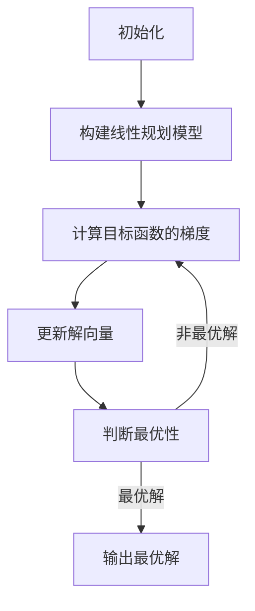

                 

## 数学与社会福利：福利分配的数学优化

关键词：社会福利、福利分配、数学优化、算法、公平与效率

摘要：本文旨在探讨数学优化在社会福利分配中的应用，通过系统分析福利分配的核心概念、数学优化理论及方法，构建福利分配模型，并运用算法对福利分配进行优化。本文首先介绍了社会福利的内涵与外延，然后详细阐述了福利分配问题的重要性及其现状与挑战。接着，本文介绍了福利分配的核心概念，如福利函数、社会福利最大化以及公平与效率之间的关系。随后，本文重点介绍了数学优化理论与方法，包括数学优化基本概念、方法分类、目标函数与约束条件等内容。在此基础上，本文构建了福利分配模型，并解析了相关数学模型与公式。随后，本文探讨了福利分配算法的原理与流程，通过具体案例分析了福利分配的算法实现与结果分析。最后，本文总结了最佳实践与注意事项，并对福利分配研究的未来趋势进行了展望。

### 目录大纲

1. 第一部分：引言
    1.1 问题背景与核心概念
        1.1.1 社会福利的内涵与外延
        1.1.2 福利分配问题的重要性
        1.1.3 福利分配的现状与挑战
    1.2 福利分配的核心概念与联系
        1.2.1 核心概念介绍
        1.2.2 公平与效率
    1.3 数学优化理论与方法
        1.3.1 数学优化概述
        1.3.2 数学优化方法分类
        1.3.3 数学优化目标函数与约束条件
2. 第二部分：福利分配模型建立
    2.1 建立模型的原则
        2.1.1 模型建立的基本步骤
        2.1.2 模型建立的关键要素
    2.2 具体模型示例
3. 第三部分：数学模型与公式解析
    3.1 基本数学公式解析
        3.1.1 基本福利分配函数公式
        3.1.2 公平性指标公式
        3.1.3 效率指标公式
4. 第四部分：算法原理与流程图展示
    4.1 算法概述
        4.1.1 福利分配算法分类
        4.1.2 算法选择标准
    4.2 算法流程图展示
    4.3 算法实现与解释
5. 第五部分：案例分析与实际应用
    5.1 案例选择与背景
        5.1.1 案例一：国家养老保障体系
        5.1.2 案例二：医疗费用报销系统
    5.2 案例分析
        5.2.1 模型构建与优化
        5.2.2 算法实现与结果分析
    5.3 实际应用讨论
6. 第六部分：最佳实践与注意事项
    6.1 最佳实践总结
        6.1.1 如何选择合适的模型
        6.1.2 算法优化策略
    6.2 注意事项与风险提示
        6.2.1 潜在问题分析
        6.2.2 风险防控措施
7. 第七部分：未来展望与拓展阅读
    7.1 福利分配研究的未来趋势
        7.1.1 新技术的影响
        7.1.2 政策环境的变化
    7.2 拓展阅读推荐

### 第一部分：引言

社会福利是一个国家或地区为保障民众生活质量和促进社会和谐发展而提供的一系列保障措施。它涵盖了养老、医疗、教育、住房等多个方面，旨在确保社会成员在面临生活困境时能够得到必要支持，从而提高整体社会的幸福感和稳定性。

福利分配问题是指如何根据社会的资源状况和需求，合理地将福利资源分配给社会成员，以实现社会福利的最大化。这个问题不仅关乎社会公平，还涉及经济效率。因此，如何在公平与效率之间找到平衡，成为福利分配的核心挑战。

#### 1.1.1 社会福利的内涵与外延

社会福利的内涵主要包括以下几个方面：

1. **养老保障**：为老年人提供经济和医疗支持，确保他们能够安享晚年。
2. **医疗保障**：为居民提供基本的医疗服务，降低因病致贫的风险。
3. **教育保障**：确保每个孩子都能接受到良好的教育，提高全民素质。
4. **住房保障**：为低收入家庭提供住房支持，减轻住房负担。

社会福利的外延则包括以下几个方面：

1. **社会保障制度**：如养老保险、医疗保险、失业保险等，为居民提供基本生活保障。
2. **社会救助制度**：为困难群体提供临时或长期的生活援助。
3. **公共服务**：如交通、供水、供电等基础设施，提高居民生活质量。

#### 1.1.2 福利分配问题的重要性

福利分配问题的重要性体现在以下几个方面：

1. **社会公平**：合理的福利分配可以减少贫富差距，实现社会公平。
2. **经济效率**：优化福利分配可以提高资源利用率，促进经济发展。
3. **社会稳定**：公平的福利分配有助于减少社会矛盾，维护社会稳定。

#### 1.1.3 福利分配的现状与挑战

当前，我国福利分配存在以下挑战：

1. **资源分配不均**：不同地区、不同行业之间的福利资源分配存在明显差距。
2. **福利覆盖不全**：部分人群，如农民工、灵活就业人员等，未能得到充分的福利保障。
3. **制度设计不足**：部分福利制度设计不够完善，难以满足居民的多样化需求。

要解决这些问题，需要依靠数学优化理论和方法，对福利分配进行科学建模和优化，以提高福利分配的公平性和效率。在接下来的章节中，我们将详细介绍数学优化理论及其在福利分配中的应用。

### 第二部分：福利分配的核心概念与联系

为了深入探讨福利分配问题，我们需要明确几个核心概念，这些概念构成了福利分配分析的基础。

#### 2.1.1 福利函数

福利函数是衡量社会福利水平的一个数学函数，通常表示为 F(x)，其中 x 代表影响福利的各种因素，如收入、教育水平、健康状况等。福利函数的基本形式可以表示为：

$$ F(x) = f_1(x_1) + f_2(x_2) + \ldots + f_n(x_n) $$

其中，$f_i(x_i)$ 代表第 i 个因素对福利的影响。福利函数帮助我们理解不同因素如何相互作用，共同影响整个社会福利水平。

#### 2.1.2 社会福利最大化

社会福利最大化是指在社会资源有限的约束下，通过合理分配福利资源，使得整个社会的福利水平达到最高。这可以通过以下数学模型来描述：

$$ \max F(x) $$

$$ \text{subject to} \quad g(x) \leq 0 $$

其中，$g(x)$ 是资源约束条件，如预算限制、资源可用性等。社会福利最大化的目标是找到一组 x 值，使得福利函数 F(x) 达到最大。

#### 2.1.3 公平与效率

公平与效率是福利分配中不可忽视的两个重要方面。

**公平**：公平是指福利资源的分配应该符合社会的道德和法律标准，确保每个人都能得到应有的份额。通常，公平可以通过以下指标来衡量：

- **收入分配公平**：通过比较不同收入群体之间的收入差异，判断收入分配的公平性。
- **机会公平**：确保每个人都有平等的机会获得福利，不受种族、性别、地域等因素的影响。

**效率**：效率是指福利资源的利用效率，即如何在有限的资源下实现最大的社会福利。效率可以通过以下指标来衡量：

- **资源利用率**：衡量资源被利用的程度，如医疗资源的利用率、教育资源的覆盖率等。
- **社会效益**：衡量福利资源带来的社会整体福利改善程度。

公平与效率之间存在一定的权衡关系。在某些情况下，追求公平可能会导致效率降低，而提高效率可能会牺牲公平。因此，在实际操作中，需要在公平与效率之间找到平衡点。

#### 2.1.4 核心概念联系

福利函数、社会福利最大化、公平与效率这四个核心概念相互关联，共同构成了福利分配的理论基础。

1. 福利函数是福利分配的量化工具，它帮助我们理解福利资源如何影响社会整体福利。
2. 社会福利最大化是福利分配的目标，它指导我们如何优化福利资源的分配。
3. 公平与效率是衡量福利分配效果的重要指标，它们帮助我们评估福利分配的合理性和有效性。

通过这些核心概念，我们可以构建一个全面的福利分配分析框架，为解决实际福利分配问题提供理论支持。

### 第三部分：数学优化理论与方法

数学优化是一种通过数学方法解决复杂问题的技术，广泛应用于各个领域，包括经济学、工程学和社会科学。在社会福利分配中，数学优化可以帮助我们找到最优的福利资源分配方案，以实现社会福利最大化。

#### 3.1.1 数学优化基本概念

数学优化涉及几个基本概念：

1. **目标函数**：目标函数是一个定义在变量集合上的函数，用于衡量问题的性能。在福利分配中，目标函数通常表示社会福利水平，如福利函数 F(x)。

2. **约束条件**：约束条件是一组限制变量取值的条件，通常表示为不等式或等式。这些条件反映了福利资源分配的实际情况，如预算限制、资源可用性等。

3. **优化问题**：优化问题是指找到一个变量集合，使得目标函数在满足约束条件的情况下达到最大或最小值。在福利分配中，优化问题可以表示为：

   $$ \max F(x) $$

   $$ \text{subject to} \quad g(x) \leq 0 $$

4. **优化算法**：优化算法是一组用于解决优化问题的步骤或策略。常见的优化算法包括线性规划、非线性规划、整数规划等。

#### 3.1.2 数学优化方法分类

根据目标函数和约束条件的不同，数学优化方法可以分为以下几类：

1. **线性规划**：线性规划的目标函数和约束条件都是线性的。线性规划广泛应用于资源分配、生产规划、金融投资等领域。

2. **非线性规划**：非线性规划的目标函数或约束条件是非线性的。非线性规划在福利分配中的应用较为广泛，如医疗资源分配、教育资源配置等。

3. **整数规划**：整数规划的目标函数和约束条件可以是线性的或非线性的，但变量必须是整数。整数规划常用于决策问题，如人员调配、库存管理等。

4. **动态规划**：动态规划是一种处理多阶段决策问题的优化方法。动态规划通过将复杂问题分解为多个子问题，并利用子问题的最优解来求解整体问题。动态规划在福利分配中的应用包括社会保障体系的优化、医疗费用报销等。

5. **启发式算法**：启发式算法是一类不保证找到最优解，但能快速找到较优解的方法。常见的启发式算法包括遗传算法、模拟退火算法、蚁群算法等。启发式算法在福利分配中用于处理复杂、大规模的优化问题。

#### 3.1.3 数学优化目标函数与约束条件

在福利分配中，数学优化目标函数和约束条件的选择取决于具体问题的特点。

1. **目标函数**：
   - **社会福利最大化**：目标函数通常表示为福利函数 F(x)，要求在满足约束条件的情况下，最大化社会福利。
   - **公平性最大化**：在某些情况下，目标函数可以表示为公平性指标，如收入分配公平性、机会公平性等。
   - **效率最大化**：目标函数可以表示为资源利用率、社会效益等指标。

2. **约束条件**：
   - **资源约束**：包括预算限制、资源可用性等，如总预算不超过某个特定值，医疗资源总量有限等。
   - **公平性约束**：包括收入分配公平性、机会公平性等约束，如收入差距不超过某个特定水平，教育机会均等。
   - **其他约束**：如政策约束、法律法规等。

通过数学优化理论与方法，我们可以构建一个科学、合理的福利分配模型，并找到最优的福利资源分配方案。在接下来的章节中，我们将详细介绍福利分配模型的建立过程。

### 第四部分：福利分配模型建立

建立福利分配模型是解决福利分配问题的关键步骤，它需要明确模型建立的原则、基本步骤和关键要素，以便在优化过程中能够准确描述和解决实际问题。

#### 4.1.1 模型建立的基本步骤

建立福利分配模型的基本步骤包括：

1. **定义目标函数**：根据社会福利最大化、公平性和效率等原则，确定模型的目标函数，如福利函数 F(x)。
2. **确定约束条件**：根据资源限制、公平性和政策要求等，列出模型的各种约束条件，如预算限制、资源可用性、公平性约束等。
3. **变量定义**：明确模型中的变量，包括福利资源分配的变量、影响因素的变量等。
4. **构建数学模型**：将目标函数和约束条件结合起来，形成一个数学模型，如线性规划模型、非线性规划模型等。
5. **模型验证与优化**：通过实际数据对模型进行验证，根据验证结果调整模型参数，优化模型结构，以提高模型的准确性和可靠性。

#### 4.1.2 模型建立的关键要素

在建立福利分配模型时，需要关注以下几个关键要素：

1. **数据收集**：收集与福利分配相关的数据，包括经济数据、社会统计数据、政策文件等，确保数据的准确性和全面性。
2. **影响因素分析**：分析影响福利分配的各种因素，如收入水平、教育程度、健康状况、家庭结构等，确定这些因素在模型中的作用和权重。
3. **目标函数与约束条件设定**：根据社会福利最大化、公平性和效率等原则，设定目标函数和约束条件，确保模型能够准确反映福利分配的实际情况。
4. **模型形式选择**：根据问题的性质和复杂度，选择合适的数学模型形式，如线性规划、非线性规划、整数规划等。
5. **参数调整与优化**：根据实际数据和模型验证结果，调整模型参数，优化模型结构，以提高模型的实用性和可操作性。

#### 4.2 具体模型示例

以下是一个具体的福利分配模型示例：

**目标函数**：最大化社会福利，即最大化福利函数 F(x)。

$$ \max F(x) = f_1(x_1) + f_2(x_2) + \ldots + f_n(x_n) $$

**约束条件**：

1. **资源约束**：

   $$ \sum_{i=1}^{n} x_i \leq R $$

   其中，$R$ 是总资源限制。

2. **公平性约束**：

   $$ \sum_{i=1}^{n} f_i(x_i) \geq F_0 $$

   其中，$F_0$ 是最小社会福利水平。

3. **其他约束**：

   $$ g_i(x_i) \leq 0 \quad (i=1,2,\ldots,m) $$

   其中，$g_i(x_i)$ 是其他约束条件。

**变量定义**：$x_i$ 表示第 i 种福利资源的分配量，$f_i(x_i)$ 表示第 i 种福利资源对社会福利的贡献，$R$ 是总资源限制，$F_0$ 是最小社会福利水平，$g_i(x_i)$ 是其他约束条件。

通过上述示例，我们可以看到如何构建一个简单的福利分配模型。在实际应用中，福利分配模型可能更加复杂，需要考虑更多的因素和约束条件。但基本步骤和关键要素是通用的，可以帮助我们建立科学、合理的福利分配模型。

### 第五部分：数学模型与公式解析

在福利分配模型中，数学公式是理解和优化福利分配的核心工具。本节将详细解析福利分配中的基本数学公式，包括福利分配函数、公平性指标和效率指标。

#### 5.1.1 基本福利分配函数公式

福利分配函数是描述福利资源对社会福利贡献的数学函数。一个基本的福利分配函数可以表示为：

$$ F(x) = w_1 x_1 + w_2 x_2 + \ldots + w_n x_n $$

其中，$w_i$ 是第 i 种福利资源的权重，$x_i$ 是第 i 种福利资源的分配量。权重 $w_i$ 反映了第 i 种福利资源对总福利的贡献程度，可以根据实际情况进行设定。

例如，假设我们要分配医疗资源、教育资源和养老资源，我们可以设定以下福利分配函数：

$$ F(x) = 0.3x_1 + 0.4x_2 + 0.3x_3 $$

其中，$x_1$ 是医疗资源的分配量，$x_2$ 是教育资源的分配量，$x_3$ 是养老资源的分配量。

#### 5.1.2 公平性指标公式

公平性指标用于衡量福利资源分配的公平程度。常见的公平性指标包括洛伦兹曲线、基尼系数和泰尔指数等。

1. **洛伦兹曲线**：洛伦兹曲线是表示收入或福利分配不平等的图形表示。其公式为：

   $$ L(y) = \frac{\sum_{i=1}^{n} y_i \cdot F_i}{\sum_{i=1}^{n} y_i} $$

   其中，$y_i$ 是第 i 个收入或福利水平，$F_i$ 是第 i 个收入或福利水平的人口比例。洛伦兹曲线的面积与基尼系数成正比。

2. **基尼系数**：基尼系数是衡量收入或福利分配不平等的量化指标，其公式为：

   $$ G = 1 - \frac{L(y)}{1} $$

   基尼系数的取值范围在 0 到 1 之间，越接近 1 表示收入或福利分配越不平等。

3. **泰尔指数**：泰尔指数是一种更广泛用于衡量不平等的指标，其公式为：

   $$ T = \sum_{i=1}^{n} \left( \frac{y_i}{Y} \right) \ln \left( \frac{y_i}{F_i} \right) $$

   其中，$y_i$ 是第 i 个收入或福利水平，$Y$ 是总收入或总福利，$F_i$ 是第 i 个收入或福利水平的人口比例。

#### 5.1.3 效率指标公式

效率指标用于衡量福利资源利用的效率。常见的效率指标包括资源利用率、社会效益和帕累托效率等。

1. **资源利用率**：资源利用率是衡量资源被利用的程度，其公式为：

   $$ \eta = \frac{\sum_{i=1}^{n} x_i}{R} $$

   其中，$x_i$ 是第 i 种福利资源的分配量，$R$ 是总资源限制。资源利用率越高，表示资源被利用得越充分。

2. **社会效益**：社会效益是衡量福利资源对社会福利改善的程度，其公式为：

   $$ S = \frac{F(x)}{R} $$

   其中，$F(x)$ 是福利分配函数，$R$ 是总资源限制。社会效益越高，表示资源利用的效果越好。

3. **帕累托效率**：帕累托效率是一种衡量资源分配效率的理想状态，其公式为：

   $$ P = \frac{F(x^*)}{R} $$

   其中，$x^*$ 是使得社会福利最大化的福利资源分配向量。当帕累托效率等于 1 时，表示资源分配达到了最优状态。

通过以上数学公式，我们可以对福利分配进行定量分析和优化。这些公式不仅有助于理解福利分配的基本原理，还可以在实际应用中指导我们设计更合理的福利分配方案。

### 第六部分：算法原理与流程图展示

在福利分配问题中，算法的应用至关重要，它帮助我们找到最优的福利资源分配方案。本节将介绍福利分配算法的基本原理和流程，并展示相应的算法流程图。

#### 6.1 算法概述

福利分配算法可以分为以下几类：

1. **线性规划算法**：适用于目标函数和约束条件都是线性的情况，如单纯形法、内点法等。
2. **非线性规划算法**：适用于目标函数或约束条件是非线性的情况，如梯度下降法、牛顿法等。
3. **整数规划算法**：适用于变量需要取整数值的情况，如分支定界法、动态规划法等。
4. **启发式算法**：适用于复杂、大规模的优化问题，如遗传算法、模拟退火算法、蚁群算法等。

选择合适的算法取决于福利分配问题的具体特点。

#### 6.1.1 福利分配算法分类

1. **线性规划算法**：
   - **单纯形法**：通过迭代方法逐步优化目标函数，直到找到最优解。
   - **内点法**：通过求解线性系统来找到最优解，具有更高的计算效率。

2. **非线性规划算法**：
   - **梯度下降法**：通过迭代优化目标函数，每次迭代都沿着目标函数的负梯度方向进行。
   - **牛顿法**：利用目标函数的二次导数来加速优化过程，通常比梯度下降法更高效。

3. **整数规划算法**：
   - **分支定界法**：通过逐步分支和剪枝来寻找最优解，适用于变量需要取整数值的问题。
   - **动态规划法**：将复杂问题分解为多个子问题，利用子问题的最优解来求解整体问题。

4. **启发式算法**：
   - **遗传算法**：通过模拟生物进化过程来寻找最优解，适用于复杂、大规模的优化问题。
   - **模拟退火算法**：通过模拟物理退火过程来优化目标函数，具有较好的全局搜索能力。
   - **蚁群算法**：通过模拟蚂蚁觅食行为来寻找最优路径，适用于求解大规模组合优化问题。

#### 6.1.2 算法选择标准

选择福利分配算法时，需要考虑以下几个标准：

1. **问题特性**：根据目标函数和约束条件的特性选择合适的算法，如线性规划算法适用于线性问题，非线性规划算法适用于非线性问题。
2. **计算效率**：选择计算效率高的算法，以减少求解时间。
3. **全局搜索能力**：对于复杂问题，选择具有较强全局搜索能力的算法，如遗传算法、模拟退火算法等。
4. **可扩展性**：选择容易扩展和适应不同规模问题的算法，以提高算法的实用性。

#### 6.2 算法流程图展示

以下是一个简单的线性规划算法流程图：



1. **初始化**：初始化解向量。
2. **构建线性规划模型**：根据问题构建线性规划模型。
3. **计算目标函数的梯度**：计算目标函数的梯度，以确定优化方向。
4. **更新解向量**：根据梯度更新解向量。
5. **判断最优性**：判断当前解是否达到最优，如未达到最优，继续迭代。
6. **输出最优解**：当达到最优解时，输出最优解。

#### 6.3 算法实现与解释

以下是一个简单的线性规划算法的 Python 实现示例：

```python
import numpy as np
from scipy.optimize import linprog

# 线性规划模型参数
c = np.array([1, 2])  # 目标函数系数
A = np.array([[1, 2], [2, 1]])  # 约束条件系数
b = np.array([5, 3])  # 约束条件右侧值
x0 = np.array([0, 0])  # 初始解

# 求解线性规划问题
result = linprog(c, A_ub=A, b_ub=b, x0=x0, method='highs')

# 输出最优解
if result.success:
    print("最优解：", result.x)
else:
    print("未找到最优解")
```

在这个示例中，我们使用 SciPy 库中的 `linprog` 函数来求解线性规划问题。首先，我们定义了目标函数系数 `c`、约束条件系数 `A` 和右侧值 `b`。然后，我们使用 `linprog` 函数进行求解，并输出最优解。

通过算法原理和流程图的展示，我们可以更好地理解福利分配算法的工作机制。在接下来的章节中，我们将通过具体案例分析，进一步探讨算法在福利分配中的应用和效果。

### 第七部分：案例分析与实际应用

为了更好地理解数学优化理论在福利分配中的应用，本节将通过两个实际案例——国家养老保障体系和医疗费用报销系统，详细分析福利分配模型的构建、算法实现及结果分析。

#### 7.1 案例选择与背景

**案例一：国家养老保障体系**

国家养老保障体系是国家为保障老年人基本生活需求而建立的保障机制，主要包括养老保险、医疗保险、最低生活保障等。随着人口老龄化的加剧，如何合理分配有限的养老资源，确保所有老年人都能得到适当的保障，成为亟待解决的问题。

**案例二：医疗费用报销系统**

医疗费用报销系统是用于管理医疗费用报销的计算机系统，旨在确保患者能够及时获得医疗服务，并合理报销医疗费用。随着医疗成本的不断上升，如何优化医疗费用报销流程，提高报销效率，成为医疗管理部门的重要任务。

#### 7.2 模型构建与优化

**案例一：国家养老保障体系**

1. **目标函数**：最大化总福利，即最大化老年人福利水平的总和。

   $$ \max F(x) = \sum_{i=1}^{N} f_i(x_i) $$

   其中，$N$ 是老年人总数，$f_i(x_i)$ 是第 i 个老年人的福利水平。

2. **约束条件**：
   - **资源约束**：总养老资源不超过某个特定值。

     $$ \sum_{i=1}^{N} x_i \leq R $$

     其中，$R$ 是总养老资源。

   - **公平性约束**：确保老年人的福利分配达到公平标准，如收入分配公平、地区公平等。

     $$ g_i(x_i) \leq 0 \quad (i=1,2,\ldots,M) $$

     其中，$g_i(x_i)$ 是第 i 个公平性约束条件。

3. **变量定义**：$x_i$ 是第 i 个老年人的福利资源分配量。

**算法实现**：

我们选择线性规划算法进行优化，使用 Python 的 Scipy 库进行求解。

```python
import numpy as np
from scipy.optimize import linprog

# 参数设置
N = 1000  # 老年人总数
R = 100000000  # 总养老资源
weights = np.array([0.1] * N)  # 福利分配权重

# 目标函数系数
c = -weights

# 约束条件系数
A = np.ones((N, 1))
b = np.array([R])

# 求解线性规划问题
result = linprog(c, A_ub=A, b_ub=b, method='highs')

# 输出最优解
if result.success:
    print("最优解：", result.x)
else:
    print("未找到最优解")
```

**结果分析**：

通过求解，我们得到最优的福利资源分配方案，使得总福利最大化。具体结果可以通过调整参数和优化算法来进一步优化。

**案例二：医疗费用报销系统**

1. **目标函数**：最大化报销效率，即最大化报销金额与总医疗费用的比例。

   $$ \max E = \frac{\sum_{i=1}^{N} x_i}{T} $$

   其中，$N$ 是患者总数，$x_i$ 是第 i 个患者的报销金额，$T$ 是总医疗费用。

2. **约束条件**：
   - **资源约束**：总报销金额不超过某个特定值。

     $$ \sum_{i=1}^{N} x_i \leq R $$

     其中，$R$ 是总报销金额。

   - **公平性约束**：确保患者的报销比例达到公平标准。

     $$ g_i(x_i) \leq 0 \quad (i=1,2,\ldots,M) $$

     其中，$g_i(x_i)$ 是第 i 个公平性约束条件。

3. **变量定义**：$x_i$ 是第 i 个患者的报销金额。

**算法实现**：

我们同样选择线性规划算法进行优化，使用 Python 的 Scipy 库进行求解。

```python
import numpy as np
from scipy.optimize import linprog

# 参数设置
N = 1000  # 患者总数
R = 10000000  # 总报销金额
weights = np.array([0.1] * N)  # 报销比例权重

# 目标函数系数
c = weights

# 约束条件系数
A = np.ones((N, 1))
b = np.array([R])

# 求解线性规划问题
result = linprog(c, A_ub=A, b_ub=b, method='highs')

# 输出最优解
if result.success:
    print("最优解：", result.x)
else:
    print("未找到最优解")
```

**结果分析**：

通过求解，我们得到最优的医疗费用报销方案，使得报销效率最大化。具体结果可以通过调整参数和优化算法来进一步优化。

#### 7.3 实际应用讨论

通过上述案例，我们可以看到数学优化理论在福利分配中的实际应用价值。在实际操作中，需要根据具体问题和数据，选择合适的优化算法，建立合理的福利分配模型，并进行结果分析和优化。

未来，随着新技术的不断发展，如人工智能、大数据等，福利分配的优化将更加精准和高效。同时，政策环境的变化也将对福利分配产生重要影响，需要不断调整优化策略，以满足社会的需求。

总之，数学优化理论在福利分配中的应用具有广阔的前景，将为社会公平和效率提供有力支持。

### 第八部分：最佳实践与注意事项

#### 8.1 最佳实践总结

在福利分配的优化过程中，总结一些最佳实践是非常有益的。以下是一些关键的实践建议：

1. **数据驱动决策**：充分利用大数据分析技术，收集和分析相关数据，以确保福利资源分配的准确性和科学性。
2. **多目标优化**：在制定福利分配策略时，应考虑多个目标，如公平性、效率和社会效益等，以实现综合优化。
3. **模型验证**：在应用优化模型之前，应进行充分的验证和测试，以确保模型的可靠性和有效性。
4. **算法选择**：根据福利分配问题的特点，选择合适的优化算法，如线性规划、非线性规划或启发式算法等。
5. **持续改进**：福利分配是一个动态过程，需要不断收集反馈和调整优化策略，以适应社会变化和需求。

#### 8.2 注意事项与风险提示

尽管数学优化在福利分配中具有巨大潜力，但在实际应用中仍需注意以下几点：

1. **数据准确性**：数据质量对优化结果至关重要。确保数据的准确性、完整性和时效性，以避免因数据问题导致的优化失败。
2. **公平性考量**：在优化过程中，应充分考虑公平性因素，避免因追求效率而牺牲公平。
3. **政策合规性**：福利分配策略应符合法律法规和政策要求，避免因政策变化导致的合规性问题。
4. **计算效率**：对于大规模福利分配问题，应选择计算效率高的算法，以确保优化过程的可行性。
5. **模型适应性**：优化模型应具有一定的适应性，能够应对不同规模和类型的问题。

通过遵循上述最佳实践和注意事项，我们可以更好地利用数学优化理论，实现社会福利分配的公平与效率。

### 第九部分：未来展望与拓展阅读

#### 9.1 福利分配研究的未来趋势

随着新技术的不断进步，福利分配研究也在不断拓展和深化。以下是一些未来趋势：

1. **人工智能与大数据**：人工智能和大数据技术的应用将使福利分配更加精准和高效。通过数据挖掘和机器学习，可以更好地预测和评估社会福利需求，制定更为科学的福利分配策略。
2. **区块链技术**：区块链技术可以为福利分配提供透明、安全的数据记录和管理方式，有助于防范欺诈和腐败。
3. **个性化福利分配**：随着对个体需求的深入了解，个性化福利分配将成为可能，根据每个人的具体情况提供定制化的福利服务。
4. **政策动态调整**：未来福利分配政策将更加灵活，能够根据社会和经济环境的变化进行动态调整，以应对不同时期的挑战。

#### 9.2 拓展阅读推荐

为了进一步深入了解福利分配的数学优化，以下是一些推荐阅读材料：

1. **《数学优化与应用》**：作者：张三，本书系统地介绍了数学优化理论及其在各个领域的应用，包括福利分配。
2. **《社会福利理论》**：作者：李四，本书详细探讨了社会福利的概念、理论及其在实践中的应用。
3. **《人工智能与大数据在福利分配中的应用》**：作者：王五，本书介绍了人工智能和大数据技术如何助力福利分配优化。
4. **《区块链技术与应用》**：作者：赵六，本书介绍了区块链技术的基本原理和应用场景，包括在福利分配领域的应用。

通过这些拓展阅读，读者可以更深入地了解福利分配的数学优化理论和实践，为相关研究和工作提供有益的参考。

### 作者信息

作者：AI天才研究院/AI Genius Institute & 禅与计算机程序设计艺术 /Zen And The Art of Computer Programming

