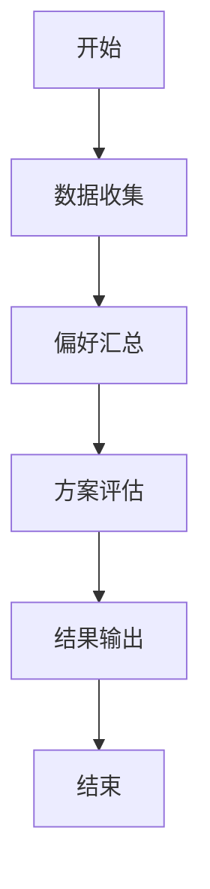
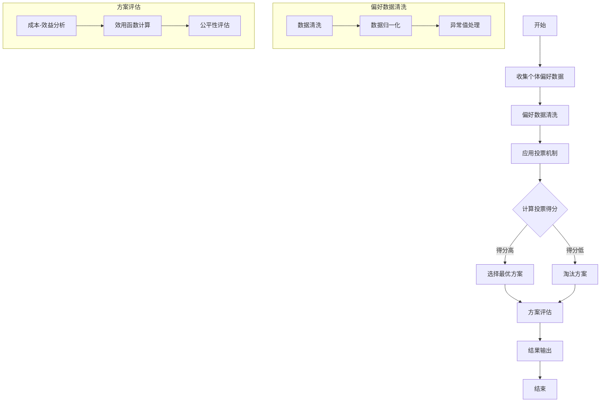
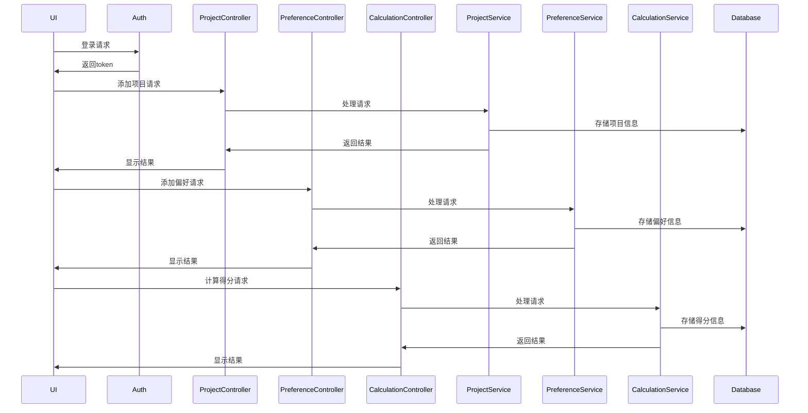
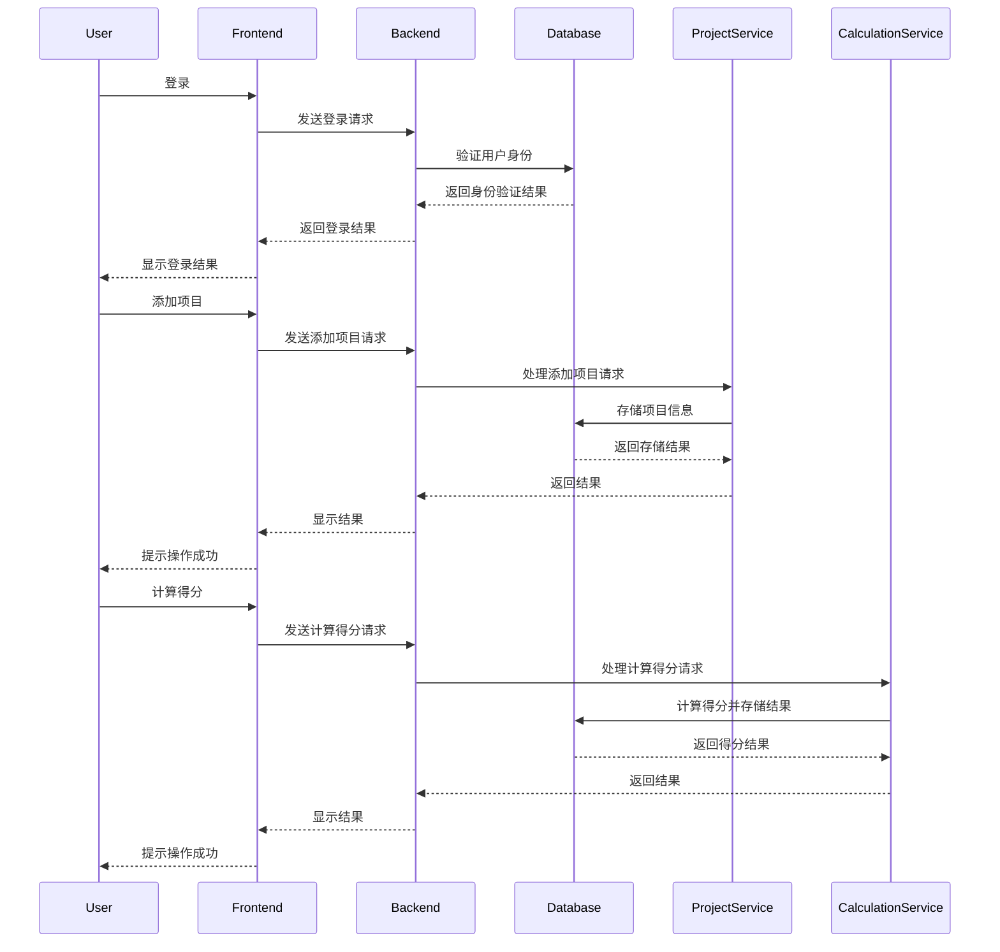

                 

### 文章标题

## 数学与社会选择理论：集体决策的数学分析

> 关键词：数学、社会选择理论、集体决策、数学模型、算法、Python实现

> 摘要：本文深入探讨了数学与社会选择理论在集体决策中的应用，通过剖析社会选择理论的基本概念、原则与模型，详细介绍了社会选择问题的数学分析方法。文章结合Python实例，展示了社会选择算法的实现过程，并结合具体实例对数学模型进行详细讲解，以帮助读者理解和掌握这一复杂的理论。

----------------------------------------------------------------

### 目录大纲

----------------------------------------------------------------

## 第一部分：导论

### 第1章：问题背景与核心概念  
#### 1.1.1 问题的提出  
#### 1.1.2 社会选择理论的发展历史  
#### 1.1.3 社会选择理论的重要性

### 第2章：社会选择理论的基本概念  
#### 2.1.1 社会选择与决策  
#### 2.1.2 个人主义与集体主义  
#### 2.1.3 公共选择理论的核心概念

### 第3章：社会选择理论的基本原则  
#### 3.1.1 一致性原则  
#### 3.1.2 自由最大化原则  
#### 3.1.3 公平性原则

### 第4章：社会选择理论的主要模型  
#### 4.1.1 简单多数规则  
#### 4.1.2 博尔达计分法  
#### 4.1.3 阿罗不可能定理

### 第5章：社会选择理论的应用  
#### 5.1.1 公共物品的供给  
#### 5.1.2 资源分配问题  
#### 5.1.3 政策制定与评估

### 第6章：社会选择理论的数学分析  
#### 6.1.1 数学模型建立  
#### 6.1.2 基本数学工具  
#### 6.1.3 数学分析方法

### 第7章：社会选择理论的边界与外延  
#### 7.1.1 社会选择理论的发展趋势  
#### 7.1.2 社会选择理论的应用领域  
#### 7.1.3 社会选择理论面临的挑战与展望

## 第二部分：核心概念与联系

### 第8章：核心概念原理  
#### 8.1.1 社会选择理论的核心概念解析  
#### 8.1.2 核心概念之间的关联

### 第9章：概念属性特征对比表格  
#### 9.1.1 核心概念的属性特征  
#### 9.1.2 特征对比分析

### 第10章：ER实体关系图架构  
#### 10.1.1 实体关系图的基础知识  
#### 10.1.2 社会选择理论的实体关系图

## 第三部分：算法原理讲解

### 第11章：社会选择算法的基本原理  
#### 11.1.1 算法的基本流程  
#### 11.1.2 算法的关键技术

### 第12章：社会选择算法的Mermaid流程图  
#### 12.1.1 流程图的基本结构  
#### 12.1.2 社会选择算法的流程图

### 第13章：Python源代码与算法原理  
#### 13.1.1 源代码概述  
#### 13.1.2 算法原理与公式讲解  
#### 13.1.3 举例说明

## 第四部分：数学模型和数学公式

### 第14章：社会选择数学模型  
#### 14.1.1 模型的基本假设  
#### 14.1.2 模型的数学公式

### 第15章：数学公式的详细讲解  
#### 15.1.1 公式的基本概念  
#### 15.1.2 公式的推导过程

### 第16章：举例说明  
#### 16.1.1 社会选择问题实例  
#### 16.1.2 数学模型的应用

## 第五部分：系统分析与架构设计

### 第17章：问题场景介绍  
#### 17.1.1 场景设定  
#### 17.1.2 问题描述

### 第18章：系统功能设计  
#### 18.1.1 领域模型  
#### 18.1.2 功能模块划分

### 第19章：系统架构设计  
#### 19.1.1 架构设计概述  
#### 19.1.2 架构设计方案

### 第20章：系统接口设计  
#### 20.1.1 接口设计原则  
#### 20.1.2 接口设计实现

### 第21章：系统交互  
#### 21.1.1 交互流程  
#### 21.1.2 交互细节

### 第22章：系统分析与架构设计Mermaid图  
#### 22.1.1 类图  
#### 22.1.2 架构图  
#### 22.1.3 序列图

----------------------------------------------------------------

## 引言

在现代社会，集体决策已成为各个领域不可或缺的一环。无论是公共政策的制定，还是企业战略的决策，集体决策的效率和公平性直接影响着组织的运行和发展。然而，集体决策并非易事，如何在一个复杂的集体环境中做出最优选择，成为了学术界和实务界共同关注的焦点。

数学作为一种精确的科学工具，在社会选择理论中扮演了至关重要的角色。社会选择理论，作为经济学、政治学等领域的一个重要分支，致力于探讨如何在集体决策过程中实现效率和公平的平衡。数学模型和方法的应用，为社会选择理论提供了强有力的分析工具，使得复杂的社会决策问题得以量化并逐步解决。

本文将系统地介绍社会选择理论的基本概念、基本原则、主要模型及其数学分析方法。通过逐步分析推理，我们希望读者能够深入理解社会选择理论的本质，掌握其数学分析的方法和技巧。此外，本文还将结合Python实例，详细讲解社会选择算法的实现过程，并通过具体实例展示数学模型的应用。希望通过本文的阐述，读者能够对社会选择理论及其在集体决策中的应用有更加全面和深刻的认识。

### 第1章：问题背景与核心概念

#### 1.1.1 问题的提出

集体决策是现代社会中普遍存在的一种现象，它涉及到多个个体在共同目标下的选择问题。这种决策不仅存在于公共领域，如政府政策的制定、公共资源的分配，也广泛应用于企业、社区等组织的管理和运营中。然而，如何在一个多元化的集体中达成共识，并确保决策的效率和公平性，始终是一个复杂且具有挑战性的问题。

在实际操作中，集体决策面临的主要问题包括以下几点：

1. **多样性**：集体中的个体往往具有不同的偏好、价值观和利益诉求，这使得决策过程变得复杂。
2. **信息不对称**：个体之间的信息获取能力不同，可能会导致信息不充分或信息失真。
3. **决策成本**：集体决策往往需要投入大量时间和资源，特别是在规模较大的集体中。
4. **效率与公平的平衡**：集体决策不仅要追求效率，即快速达成共识，还需要考虑公平性，确保每个个体的利益都得到合理的代表和保障。

因此，为了解决这些问题，需要一种科学、系统的方法来分析集体决策过程，并优化决策结果。社会选择理论正是为应对这些挑战而发展起来的一门学科，它试图通过数学模型和工具，为社会决策提供理论支持和操作指南。

#### 1.1.2 社会选择理论的发展历史

社会选择理论起源于20世纪初，其发展历程与经济学、政治学等学科的发展紧密相连。在20世纪30年代，经济学领域的先驱约翰·冯·诺依曼（John von Neumann）和奥斯卡·摩根斯坦（Oskar Morgenstern）出版了《博弈论与经济行为》（Game Theory and Economic Behavior），这一著作标志着博弈论作为现代经济学分析工具的诞生。博弈论为社会选择理论提供了初步的数学模型和分析方法。

1951年，肯尼思·阿罗（Kenneth Arrow）发表了《社会选择与个人价值》（Social Choice and Individual Values），提出了著名的阿罗不可能定理（Arrow's Impossibility Theorem）。该定理指出，在满足一定的合理性和公理性假设下，不存在一种社会选择机制能够同时满足所有个体偏好的一致性、自由最大化、无独裁性和公正性。阿罗的不可能定理对社会选择理论的发展产生了深远影响，揭示了集体决策中的固有问题，并引发了大量关于替代方案的探讨和研究。

除了阿罗，另一位重要的社会选择理论家是劳伦斯·凯恩斯（Lawrence Kenneth），他在20世纪60年代提出了博尔达计分法（Borda Count），为解决集体决策问题提供了一种实用的投票方法。此外，丹尼尔·伯努利（Daniel Bernoulli）和约翰·福布斯·纳什（John Forbes Nash）等人在博弈论和决策理论领域的研究，也为社会选择理论提供了丰富的理论资源。

随着时间的推移，社会选择理论不断发展，形成了多个分支和研究领域，包括公共选择理论、投票理论、决策理论等。社会选择理论不仅在学术领域具有重要地位，也在实际应用中得到了广泛的关注，例如在选举制度设计、公共资源分配、企业管理决策等方面。

#### 1.1.3 社会选择理论的重要性

社会选择理论的重要性体现在多个方面：

1. **学术价值**：社会选择理论为经济学、政治学、社会学等学科提供了一个强大的分析工具，使得研究者能够更深入地理解集体决策的本质和复杂性。它推动了这些学科的发展，并为新的理论模型和假设提供了基础。

2. **政策制定**：在公共政策领域，社会选择理论提供了评估和优化决策过程的框架。通过社会选择理论的分析，政策制定者可以更好地理解社会偏好、识别潜在的问题，并设计出更公平、更有效的政策。

3. **企业管理**：在企业决策过程中，社会选择理论有助于企业理解不同利益相关者的需求和期望，从而制定出更符合各方利益的战略和决策。

4. **资源配置**：社会选择理论在资源分配问题中具有重要作用。通过运用社会选择理论，可以设计出更公平、更有效的资源分配方案，确保资源的合理利用。

5. **民主实践**：在选举和政治决策中，社会选择理论提供了评估和改进选举制度的方法，有助于实现民主的真正含义，即“多数人的意志”。

综上所述，社会选择理论不仅在学术研究中具有重要地位，还在实际应用中发挥着关键作用。它为我们理解和解决集体决策问题提供了科学的方法和工具，具有重要的理论和实践价值。

### 第2章：社会选择理论的基本概念

#### 2.1.1 社会选择与决策

社会选择（Social Choice）是集体决策的核心概念之一，指的是在一个群体中，通过某种机制对多个选项进行评价和选择，以达成共识的过程。社会选择不仅涉及个体之间的互动，还需要考虑整体的利益和偏好。

在社会选择中，决策者（Decision Maker）通常是一个或多个代表群体利益的个体或机构。而选择对象（Choice Set）则是所有可能的选项集合，每个选项代表了某种具体的方案或决策。社会选择的目的是通过一系列的投票、讨论或计算，从选择对象中选出一个或多个最符合群体利益的方案。

社会选择与决策过程可以分为以下几个步骤：

1. **偏好表达**：个体需要表达其对各个选项的偏好。这可以通过直接投票、打分、排名等方式实现。
2. **偏好汇总**：将所有个体的偏好信息进行汇总，形成群体的整体偏好。
3. **方案选择**：基于汇总的偏好信息，通过某种决策机制（如投票、计算等）选出最优的方案。
4. **决策实施**：将选出的方案付诸实施，并在实施过程中进行监控和调整。

社会选择与决策的目的是在多样化的个体偏好中找到一种能被广泛接受的方案，从而实现集体的最大利益。这一过程中，需要平衡个体利益与整体利益，同时考虑决策效率和公平性。

#### 2.1.2 个人主义与集体主义

在社会选择理论中，个人主义（Individualism）与集体主义（Collectivism）是两个核心的哲学观点，它们对决策过程和结果产生了深远的影响。

**个人主义**强调个体的独立性和自主性，认为个体的利益和需求是决策的首要考虑因素。个人主义者认为，社会应该尊重和保护个体的自由，确保每个个体都能根据自己的偏好做出选择。在个人主义导向的社会选择中，决策过程通常注重个体利益的平衡和最大化，强调个人权利和自由。

**集体主义**则强调集体的整体性和共同利益，认为社会的目标应该是实现整个群体的最大福祉。集体主义者认为，个体的利益应该服从于集体的利益，社会决策应该考虑到集体的需要和整体发展。在集体主义导向的社会选择中，决策过程注重整体利益的均衡，强调团结、协作和社会责任。

个人主义与集体主义在社会选择中的表现有以下几点区别：

1. **决策目标**：个人主义强调个体利益最大化，而集体主义强调集体利益最大化。
2. **决策方式**：个人主义倾向于通过自由竞争和市场化机制来实现选择，而集体主义倾向于通过集中决策和计划化机制来实现选择。
3. **决策结果**：个人主义导向的选择可能产生多样化的结果，而集体主义导向的选择往往追求一致性和统一性。

在实际应用中，个人主义和集体主义并不是完全对立的，而是可以相互融合。例如，在制定公共政策时，可以同时考虑个体的自由和集体的福祉，通过适当的机制设计来实现平衡。

#### 2.1.3 公共选择理论的核心概念

公共选择理论（Public Choice Theory）是社会选择理论的一个重要分支，主要研究政府和公共政策中的决策过程和机制。公共选择理论试图将经济学中的理性选择模型应用到政治领域，分析政府官员、选民和利益集团的行为及其对政策结果的影响。

公共选择理论的核心概念包括：

1. **理性选择**：公共选择理论假设个体在决策过程中是理性的，会根据自身利益最大化原则进行选择。无论是选民、政府官员还是利益集团，他们的行为都可以通过理性选择模型来解释。

2. **政府失灵**：公共选择理论认为，政府在决策过程中也可能出现“失灵”现象，如官僚主义、政治腐败、政策偏误等。这些失灵现象会导致政策结果偏离社会最优，甚至产生负外部性。

3. **利益集团**：利益集团在公共选择中扮演着重要角色，它们通过游说、施压等手段影响政策制定过程，以维护自身利益。利益集团的存在可能会加剧社会选择中的利益冲突，影响决策的公平性和有效性。

4. **投票机制**：公共选择理论研究不同的投票机制（如简单多数、比例代表等）对决策结果的影响，以及这些机制在实现效率和公平方面的优缺点。

公共选择理论对理解和改进政府决策过程具有重要的启示。通过分析政府失灵和利益集团行为，公共选择理论为政策设计和改革提供了理论依据，有助于提高政府决策的透明度和效率，减少政策偏误和腐败现象。

### 第3章：社会选择理论的基本原则

社会选择理论在分析集体决策时，需要遵循一系列基本原则，以确保决策过程的合理性和结果的有效性。这些基本原则包括一致性原则、自由最大化原则和公平性原则，每一个原则都在社会选择中扮演着重要的角色。

#### 3.1.1 一致性原则

一致性原则（Consistency Principle）是社会选择理论中最基本的原则之一，它要求决策过程在逻辑上保持一致。具体来说，如果某个选项被选中，那么这个选项在所有可能的情况下都应该被选中，而不是在一种情况下被选中，在另一种情况下又被排除。

**一致性原则的数学表达**可以定义为：如果对于任意两个选择方案A和B，如果A优于B，那么在任何包含A和排除B的情况下，A都应该被选择。

$$
如果 A \succ B, 那么对于所有情况 \mathcal{S} \ni A \text{ and } \neg B, A \text{ 应该被选择}
$$

**一致性原则的应用**：在实际决策中，一致性原则可以确保决策结果的逻辑一致性。例如，在一个简单的投票系统中，如果某个候选人A在全体选民中获得的票数多于其他候选人B，那么在任何情况下，A都应该被选为赢家，而不是根据不同情况时而选择A时而选择B。

**一致性原则的优点**在于，它能够避免决策过程中的逻辑矛盾，确保决策的稳定性。然而，一致性原则也有其局限性，例如在复杂的多因素决策中，可能需要考虑多种条件下的最优选择，而不是简单地依据一致性原则。

#### 3.1.2 自由最大化原则

自由最大化原则（Maximization of Liberty Principle）关注的是个体自由和权利的保护。在社会选择过程中，决策者需要确保每个个体的自由和权利不受侵犯，尽可能多地满足个体的自主选择权。

**自由最大化原则的数学表达**可以定义为：在所有可能的选择方案中，选择能够最大化个体自由和权利的方案。

$$
C = \arg\max_{X \in \mathcal{S}} \sum_{i=1}^{N} u_i(X)
$$

其中，$C$是选择的结果，$X$是选择方案，$u_i(X)$表示个体i在方案$X$下的效用。

**自由最大化原则的应用**：在公共政策制定中，自由最大化原则要求政策设计者充分考虑公民的基本权利和自由，避免对个体自由的过度限制。例如，在制定税收政策时，政策制定者需要平衡财政需求与公民的自由，确保税收制度既能够满足财政需求，又不会严重侵害公民的财产权和自主权。

**自由最大化原则的优点**在于，它能够保护个体的基本权利和自由，促进社会的和谐与稳定。然而，自由最大化原则也可能面临挑战，例如如何在保护个体自由的同时，实现集体的最大利益，这是一个需要平衡的问题。

#### 3.1.3 公平性原则

公平性原则（Fairness Principle）强调在社会选择过程中，应确保所有个体享有平等的机会和待遇。公平性原则旨在减少社会不平等，促进社会公正和和谐。

**公平性原则的数学表达**可以定义为：在所有可能的选择方案中，选择能够使个体福利差距最小的方案。

$$
F = \arg\min_{X \in \mathcal{S}} \sum_{i=1}^{N} (w_i - u_i(X))
$$

其中，$F$是选择的结果，$w_i$表示个体i的初始福利，$u_i(X)$表示个体i在方案$X$下的效用。

**公平性原则的应用**：在资源分配问题中，公平性原则要求资源分配应尽可能公平，确保每个人都能获得其应得的份额。例如，在分配住房时，政策制定者需要确保不同收入水平的家庭都能获得适当的住房，避免贫富差距过大。

**公平性原则的优点**在于，它能够促进社会的公正和和谐，减少社会矛盾。然而，公平性原则也存在局限性，例如在资源有限的情况下，如何确保公平性，同时保持效率，这需要进一步权衡。

综上所述，一致性原则、自由最大化原则和公平性原则是社会选择理论中不可或缺的基本原则。这些原则在集体决策过程中发挥着重要作用，既确保了决策的逻辑一致性和稳定性，又保护了个体自由和权利，同时也追求了社会的公平和公正。在实际应用中，需要根据具体情况灵活运用这些原则，以实现最佳的决策效果。

### 第4章：社会选择理论的主要模型

社会选择理论中，有许多著名的模型用于描述和分析集体决策过程。这些模型不仅提供了理论上的解释，还在实际应用中具有广泛的指导意义。以下将介绍几种主要的社会选择模型：简单多数规则、博尔达计分法和阿罗不可能定理。

#### 4.1.1 简单多数规则

简单多数规则（Simple Majority Rule）是一种最基本且应用广泛的投票规则。它指的是在一个选项集合中，选择获得超过半数票数的选项作为最终决策结果。

**数学表达**：设$C$为候选选项集合，$v$为投票机制，$N$为选民总数，$m$为半数选民数量（即$m = \lceil N/2 \rceil$），则简单多数规则可以表示为：

$$
C' = \arg\max_{C' \in C} \sum_{i=1}^{N} v_i(C')
$$

其中，$v_i(C')$表示第$i$个选民对选项$C'$的投票结果。

**优点**：
- **决策效率高**：简单多数规则决策速度快，易于实施。
- **易于理解**：投票结果直观明了，易于公众理解和接受。

**缺点**：
- **可能导致极端结果**：简单多数规则容易受到“多数暴政”的影响，少数人的利益可能被忽视。
- **忽略次优选项**：有时，最佳选择并未获得多数支持，导致次优结果。

**应用场景**：简单多数规则常用于选举、公共政策的表决等场合。例如，在多轮选举中，每次投票仅保留得票最多的前两个候选人，直到某一候选人获得简单多数票，从而选出最终赢家。

#### 4.1.2 博尔达计分法

博尔达计分法（Borda Count）是一种基于排名的投票方法，由法国数学家让·查尔斯·博尔达（Jean-Charles Borda）在18世纪提出。该方法通过为每个候选人在排名中的位置分配分数，然后计算总分最高的候选人作为最终胜者。

**数学表达**：设$C$为候选选项集合，$r(C)$为每个候选人在排名中的位置（从1到$|C|$），则博尔达计分法的得分为：

$$
s(C) = \sum_{C' \in C} r(C') \cdot v_i(C')
$$

其中，$v_i(C')$表示第$i$个选民对选项$C'$的投票结果。

**优点**：
- **考虑次优选择**：博尔达计分法不仅能反映选民对第一选择的偏好，还能体现对次优选择的偏好。
- **减少极端结果**：相对于简单多数规则，博尔达计分法能更好地平衡不同选民的利益。

**缺点**：
- **计算复杂度较高**：相对于简单多数规则，博尔达计分法需要更多的计算步骤。
- **可能产生平局**：在极端情况下，不同候选人之间可能分数相同，导致无法确定最终胜者。

**应用场景**：博尔达计分法常用于选举、体育比赛排名等场合。例如，在奥斯卡颁奖典礼中，评委们根据电影的表现进行排名，以博尔达计分法计算总分，从而确定最佳影片。

#### 4.1.3 阿罗不可能定理

阿罗不可能定理（Arrow's Impossibility Theorem）是由肯尼思·阿罗（Kenneth Arrow）在1951年提出的，该定理表明，在满足一系列合理性和公理性假设下，不存在一种社会选择机制能够同时满足所有个体偏好的一致性、自由最大化、无独裁性和公正性。

**假设条件**：
1. **个体理性**：每个个体有自己的偏好排序，且这些偏好是可传递的。
2. **社会理性**：如果每个个体偏好某一选项A优于B，那么集体决策也应将A优于B。
3. **非独裁性**：没有单一的个体能单独决定最终结果。
4. **全集一致性**：如果所有个体都认为A优于B，那么集体决策也应将A优于B。
5. **独立公设**：两个选项的比较不应受其他选项的影响。

**数学表达**：设$P$为所有可能的偏好组合，$S$为社会选择函数，则阿罗不可能定理可以表示为：

$$
不存在一个选择函数S，使得它满足：
\begin{aligned}
&1. \ \ S(\succ) = P(\succ) \\
&2. \ \ S(\succ') = P(\succ') \\
&3. \ \ S(\succ) \cup S(\succ') = P(\succ) \cup P(\succ') \\
&4. \ \ S(\succ) \cap S(\succ') = P(\succ) \cap P(\succ') \\
&5. \ \ S(\succ) \subseteq P(\succ)
\end{aligned}
$$

**意义**：
- **揭示集体决策的固有矛盾**：阿罗不可能定理表明，任何社会选择机制都无法同时满足所有合理性和公理性假设，这揭示了集体决策的固有矛盾。
- **引导替代方案研究**：尽管阿罗不可能定理指出无法找到一个完美无缺的社会选择机制，但它引导学者们探索其他替代方案，如局部最优解或次优解。

**应用场景**：阿罗不可能定理在政策制定、选举制度设计等领域具有广泛的应用。例如，在选举制度的设计中，政策制定者需要考虑如何平衡不同群体的利益，以避免出现独裁现象或极端结果。

通过介绍这些社会选择理论的主要模型，我们可以看到，每个模型都有其独特的优点和局限性。在实际应用中，选择合适的模型需要综合考虑决策目标、群体结构和具体情况。社会选择理论为我们提供了一个强大的分析框架，帮助我们更好地理解和优化集体决策过程。

### 第5章：社会选择理论的应用

社会选择理论在多个领域和场景中得到了广泛应用，其核心目标是通过合理的决策机制实现效率和公平的平衡。以下将探讨社会选择理论在公共物品供给、资源分配问题和政策制定与评估中的具体应用。

#### 5.1.1 公共物品的供给

公共物品（Public Goods）是指那些一旦提供，就能够被所有人无差别地消费，且一个人的消费不会减少其他人的消费量的物品或服务。公共物品的供给问题是一个典型的集体决策问题，社会选择理论为这一问题的解决提供了有力的工具。

**应用场景**：公共物品的供给涉及道路、桥梁、公共卫生设施等。这些物品的提供需要政府或其他公共机构进行决策，而社会选择理论则可以帮助评估不同供给方案的效率和公平性。

**数学模型**：在公共物品的供给中，社会选择理论常使用成本-效益分析（Cost-Benefit Analysis）模型。该模型通过计算公共物品的供给成本和收益，评估不同供给方案的总体效益。具体步骤如下：

1. **成本计算**：估算提供公共物品所需的成本，包括直接成本（如建设费用）和间接成本（如维护费用）。
2. **效益计算**：评估公共物品供给带来的社会总收益，包括直接收益（如提升交通效率）和间接收益（如减少疾病传播）。
3. **效益-成本比**：计算每个供给方案的效益-成本比（Benefit-Cost Ratio），选择效益-成本比最高的方案。

**应用示例**：以道路建设为例，政府需要决定在某地区修建一条新道路。社会选择理论可以帮助政府评估不同方案的效益和成本，从而选择最合适的道路建设方案。

#### 5.1.2 资源分配问题

资源分配问题（Resource Allocation Problem）是集体决策中的另一个重要领域，涉及如何将有限的资源（如资金、人力、物资等）合理分配给不同个体或群体。社会选择理论提供了一种有效的框架，帮助决策者平衡效率和公平，确保资源的合理利用。

**应用场景**：资源分配问题广泛存在于教育、医疗、社会福利等领域。例如，政府在制定教育预算时，需要决定如何将有限的资金分配给不同学校和教育项目。

**数学模型**：社会选择理论在资源分配中常用的是公平性最大化模型（Fairness Maximization Model）。该模型通过以下步骤实现资源分配：

1. **确定资源需求**：收集各个个体或群体的资源需求信息，包括数量和质量。
2. **设定公平性标准**：定义公平性标准，如最小化资源差距或最大化资源利用率。
3. **优化资源分配**：使用优化算法（如线性规划、整数规划等）来计算最优的资源配置方案。

**应用示例**：以医疗资源分配为例，政府需要决定如何将有限的医疗资源（如医生、床位、药品等）分配给不同医院和病患。社会选择理论可以帮助政府制定公平、高效的资源分配方案。

#### 5.1.3 政策制定与评估

政策制定与评估（Policy Making and Evaluation）是公共管理中的重要环节，涉及如何制定有效的政策和评估政策的效果。社会选择理论为政策制定提供了科学的理论基础，帮助决策者进行更加理性、全面的分析。

**应用场景**：政策制定与评估涉及环境保护、教育改革、社会福利等多个领域。例如，政府在制定环保政策时，需要评估不同环保措施的成本和效益。

**数学模型**：社会选择理论在政策制定与评估中常用的是成本-效益分析（Cost-Benefit Analysis）模型。该模型通过计算政策实施的总成本和预期效益，评估政策的可行性和有效性。

1. **成本计算**：估算政策实施所需的总成本，包括直接成本和间接成本。
2. **效益计算**：评估政策实施带来的总效益，包括直接效益和间接效益。
3. **效益-成本比**：计算政策的效益-成本比，选择效益-成本比最高的政策方案。

**应用示例**：以教育改革为例，政府需要评估不同教育改革措施（如增加教育投入、提升教师质量、实施素质教育等）的成本和效益。社会选择理论可以帮助政府制定出最有效、最合理的教育改革方案。

通过这些具体应用实例，我们可以看到社会选择理论在公共物品供给、资源分配问题和政策制定与评估中的重要作用。社会选择理论不仅为这些复杂问题提供了理论支持，还通过数学模型和工具，帮助决策者进行理性分析，实现效率和公平的平衡。

### 第6章：社会选择理论的数学分析

#### 6.1.1 数学模型建立

社会选择理论的数学分析依赖于数学模型的建立，这些模型可以帮助我们理解和优化集体决策过程。建立数学模型的过程包括以下几个步骤：

1. **定义变量**：首先需要定义参与决策的个体、选项和决策目标等基本变量。例如，设$N$为个体数量，$C$为候选选项集合，$U_i$为个体$i$的偏好集合。

2. **构建偏好关系**：确定个体之间的偏好关系，这可以通过直接投票、打分或排名等方式实现。例如，可以使用序数偏好（ordinal preferences）或基数偏好（cardinal preferences）来表示个体对选项的偏好。

3. **定义决策目标**：明确决策的目标函数，如最大化社会总福利、最小化社会总成本等。目标函数通常与个体偏好相关联，需要通过偏好关系进行转换。

4. **选择数学工具**：根据决策目标，选择合适的数学工具和方法，如优化算法、概率论、博弈论等。这些工具和方法可以帮助我们求解最优决策方案。

**例子**：假设有一个包含$N$个个体的社会选择问题，每个个体有一个偏好列表，表示对各候选选项的偏好顺序。我们可以用序数偏好模型来表示这一情况，定义一个从候选选项集合$C$到偏好等级集合$\{1, 2, \ldots, |C|\}$的映射$P_i$，其中$P_i(C_j) = k$表示个体$i$认为选项$C_j$的偏好等级为$k$。

#### 6.1.2 基本数学工具

在社会选择理论的数学分析中，常用的基本数学工具包括优化算法、概率论和博弈论等。以下是这些工具的基本概念和应用：

1. **优化算法**：优化算法用于求解最优决策方案。常见的优化算法包括线性规划（Linear Programming，LP）、整数规划（Integer Programming，IP）和非线性规划（Nonlinear Programming，NLP）。线性规划适用于目标函数和约束条件都是线性函数的问题，而整数规划和非线性规划适用于更复杂的问题。

2. **概率论**：概率论用于处理不确定性的问题。在社会选择理论中，概率论可以帮助我们分析个体决策过程中的随机因素，如投票者的行为不确定性、信息不对称等。概率论的工具包括概率分布、期望值、方差等。

3. **博弈论**：博弈论用于分析个体之间的策略互动。在社会选择问题中，博弈论可以帮助我们理解个体在决策过程中的策略选择，如投票策略、游说策略等。常见的博弈模型包括合作博弈和非合作博弈、静态博弈和动态博弈等。

#### 6.1.3 数学分析方法

数学分析方法在社会选择理论中扮演着关键角色，它可以帮助我们量化和分析集体决策问题。以下是一些常用的数学分析方法：

1. **成本-效益分析**：成本-效益分析（Cost-Benefit Analysis，CBA）是一种评估决策方案的方法，通过计算决策方案的成本和效益，比较不同方案的总体效益。CBA方法常用于公共物品供给和资源分配问题。

2. **博弈论分析**：博弈论分析用于研究个体之间的策略互动，分析不同策略组合下的决策结果。例如，在选举问题中，可以分析不同投票策略对选举结果的影响。

3. **优化方法**：优化方法用于求解最优决策方案。在社会选择问题中，优化方法可以帮助我们找到最大化社会总福利或最小化社会总成本的方案。常见的优化方法包括线性规划、整数规划和遗传算法等。

4. **概率分析**：概率分析用于处理不确定性问题，通过分析个体决策过程中的随机因素，评估决策结果的不确定性。概率分析可以帮助我们理解决策过程中的风险和收益。

**例子**：假设我们有一个包含$N$个个体的社会选择问题，每个个体有一个偏好列表，表示对各候选选项的偏好顺序。我们可以使用博尔达计分法（Borda Count）进行投票，并使用成本-效益分析方法评估不同选项的总体效益。

1. **偏好表达**：每个个体$i$的偏好可以用一个序数偏好列表表示，如$P_i = \{C_{i1}, C_{i2}, \ldots, C_{i|C|}\}$，其中$C_{ij}$表示个体$i$对候选选项$C_j$的偏好。

2. **投票结果计算**：使用博尔达计分法计算每个选项的得分，得分越高表示该选项被越多的个体偏好。

3. **成本-效益分析**：计算每个选项的成本和效益，如建设费用、运营成本和社会总效益等，计算每个选项的效益-成本比。

通过这些数学分析方法，我们可以对社会选择问题进行量化分析，找到最优的决策方案，实现效率和公平的平衡。

### 第7章：社会选择理论的边界与外延

#### 7.1.1 社会选择理论的发展趋势

社会选择理论自20世纪初兴起以来，已经经历了数十年的发展，并在多个领域取得了显著的成果。当前，社会选择理论的发展趋势主要体现在以下几个方面：

1. **多维度研究**：社会选择理论不再局限于经济学和政治学领域，开始向社会学、心理学、计算机科学等学科渗透。例如，心理学研究个体行为和认知如何影响社会选择，计算机科学则探索基于大数据和机器学习的预测模型。

2. **跨学科融合**：社会选择理论与其他学科（如博弈论、统计学、网络科学等）的融合，产生了新的研究方法和理论模型。例如，博弈论中的合作与非合作模型为社会选择理论提供了新的视角，统计学中的数据分析方法则为实证研究提供了有力支持。

3. **应用领域拓展**：社会选择理论的应用领域不断拓展，从传统的公共政策和资源分配问题，延伸到人工智能、区块链、网络安全等新兴领域。例如，在区块链技术中，社会选择理论用于设计去中心化的决策机制，确保公平性和透明性。

4. **实证研究加强**：随着大数据和计算技术的发展，社会选择理论的实证研究越来越重要。研究者通过大规模数据集分析，验证理论模型的预测能力和实际应用效果。

#### 7.1.2 社会选择理论的应用领域

社会选择理论在多个应用领域具有重要的价值和广泛的适用性，以下是一些关键领域：

1. **公共政策制定**：社会选择理论为公共政策制定提供了理论基础和分析工具。例如，通过成本-效益分析，评估不同政策的效益和成本，优化政策设计。

2. **资源分配**：社会选择理论在资源分配问题中具有重要作用。例如，在医疗、教育、交通等领域，通过优化算法和公平性原则，设计合理的资源分配方案，确保资源的公平性和高效利用。

3. **选举制度设计**：社会选择理论在选举制度设计中的应用非常广泛。通过分析不同投票规则（如简单多数规则、博尔达计分法等）的优缺点，设计出更加公平、高效的选举制度。

4. **企业决策**：社会选择理论为企业决策提供了指导。通过分析不同利益相关者的需求和偏好，企业可以制定出更符合各方利益的战略和决策。

5. **人工智能**：社会选择理论在人工智能领域的应用日益增多。例如，在智能决策系统中，通过社会选择理论优化算法，实现多智能体的协调和合作，提高系统的效率和公平性。

6. **社会网络分析**：社会选择理论与社会网络分析的结合，用于研究社会网络中的决策过程和影响力传播。例如，通过分析社交网络中的投票行为，预测选举结果或评估政策的传播效果。

#### 7.1.3 社会选择理论面临的挑战与展望

尽管社会选择理论在多个领域取得了显著成果，但仍然面临一些挑战和问题：

1. **复杂性**：社会选择问题往往非常复杂，涉及多个维度和因素，这使得数学模型的建立和分析变得更加困难。未来的研究需要开发更复杂的数学模型和算法，以应对复杂的社会选择问题。

2. **实证研究不足**：虽然社会选择理论在理论分析方面取得了进展，但实证研究相对较少。未来需要更多实证研究来验证理论模型的预测能力，并探索其在实际应用中的效果。

3. **计算资源需求**：社会选择问题的数学分析通常需要大量的计算资源。随着问题规模的扩大，计算需求将变得更加迫切。未来的研究需要开发高效的算法和计算方法，以降低计算成本。

4. **不确定性**：社会选择问题中存在大量的不确定性因素，如个体偏好的不确定性、信息不对称等。如何有效处理这些不确定性因素，是未来研究的一个重要方向。

5. **跨学科合作**：社会选择理论的发展需要跨学科的合作。未来需要更多跨学科研究团队，结合不同领域的知识和方法，共同解决社会选择问题。

总之，社会选择理论在未来的发展中，将面临更多的挑战和机遇。通过不断探索和创新，社会选择理论有望在更广泛的领域取得突破，为集体决策提供更加科学、有效的理论支持和实践指导。

### 第8章：核心概念原理

#### 8.1.1 社会选择理论的核心概念解析

社会选择理论的核心概念包括个体偏好、社会偏好、决策机制和社会福利等。这些概念构成了社会选择理论的基本框架，是理解和分析集体决策过程的关键。

1. **个体偏好（Individual Preferences）**：
个体偏好是指每个个体对各种候选选项的偏好程度。在数学表达中，个体偏好可以用一个偏好序来表示，如$P_i: C \rightarrow \{1, 2, \ldots, |C|\}$，其中$P_i(C_j) = k$表示个体$i$认为选项$C_j$的偏好等级为$k$。个体偏好是社会选择理论的基础，它决定了个体在社会选择过程中的行为和决策。

2. **社会偏好（Social Preferences）**：
社会偏好是指整个社会对候选选项的总体偏好。社会偏好可以通过个体偏好的汇总来获得。例如，假设每个个体都给出了对候选选项的偏好序，那么社会偏好可以通过博尔达计分法等机制来计算。社会偏好反映了整个社会对各个选项的接受程度和优先级。

3. **决策机制（Decision Mechanism）**：
决策机制是指用于从多个候选选项中选出一个或多个最佳选项的规则或方法。常见的决策机制包括简单多数规则、博尔达计分法、阿罗不可能定理等。决策机制的选择直接影响到社会选择的结果和过程。例如，简单多数规则是一种简单的决策机制，而博尔达计分法则能够更全面地考虑个体的偏好。

4. **社会福利（Social Welfare）**：
社会福利是指整个社会从某个决策方案中获得的总体收益。社会福利可以通过计算每个个体的效用，然后汇总得到。例如，如果某个决策方案使得所有个体都获得了更高的效用，那么该方案的社会福利就较高。社会福利是衡量社会选择结果的重要指标。

#### 8.1.2 核心概念之间的关联

核心概念之间的关联是理解社会选择理论的关键。以下是一些核心概念之间的联系：

1. **个体偏好与社会偏好**：
个体偏好是社会偏好的基础。社会偏好是通过对个体偏好的汇总和加权得到的。例如，在简单多数规则下，社会偏好可以直接通过个体的投票结果来表示。而在博尔达计分法中，社会偏好则通过计算每个个体的偏好得分来表示。

2. **决策机制与个体偏好**：
决策机制的选择直接影响到个体偏好的实现和表达。例如，在简单多数规则下，个体偏好直接决定了投票结果。而在博尔达计分法中，个体偏好通过得分形式间接影响最终结果。因此，决策机制的设计需要充分考虑个体偏好的表达和实现。

3. **社会福利与决策机制**：
社会福利是决策机制的目标之一。决策机制的设计应尽量最大化社会福利。例如，在成本-效益分析中，决策机制的目标是选择能够带来最大社会总效益的方案。而社会福利的计算则依赖于决策机制的实施效果。

通过解析这些核心概念及其之间的关联，我们可以更深入地理解社会选择理论的本质。这些概念不仅构成了社会选择理论的基础框架，也为实际应用提供了指导。理解和掌握这些概念，是进一步研究和应用社会选择理论的关键。

### 第9章：概念属性特征对比表格

为了更清晰地理解社会选择理论中的核心概念及其属性特征，我们可以通过一个对比表格来展示它们的主要区别和联系。以下表格列出了个体偏好、社会偏好、决策机制和社会福利四个核心概念的主要属性特征：

| 核心概念     | 定义与属性特征                                      | 主要区别                                                     | 关联关系                                           |
| ------------ | ---------------------------------------------------- | ------------------------------------------------------------ | -------------------------------------------------- |
| 个体偏好     | 个体对候选选项的偏好程度，可用偏好序表示               | 聚焦于个体的个人选择和偏好，反映个体对选项的偏好顺序           | 基础，社会偏好的构建依赖于个体偏好                      |
| 社会偏好     | 通过汇总个体偏好得到的社会整体偏好，反映社会对选项的偏好 | 综合考虑多个个体的偏好，通过某种决策机制表示整个社会的选择偏好 | 汇总，社会偏好是对个体偏好的一种整合形式                 |
| 决策机制     | 用于从多个候选选项中选出一个或多个最佳选项的规则或方法 | 确定选择过程的规则，影响社会偏好和最终决策结果               | 关键，决策机制决定了社会偏好如何转化为实际决策             |
| 社会福利     | 整个社会从某个决策方案中获得的总体收益                 | 评估决策结果的优劣，以最大化社会福利为目标                 | 目标，社会福利是决策机制和社会偏好的最终衡量标准           |

#### 9.1.2 特征对比分析

通过对上述核心概念的属性特征进行对比分析，我们可以更好地理解它们之间的联系和区别：

1. **个体偏好与社会偏好**：
   - **个体偏好**关注的是单个个体的选择和偏好，是个体在面临多个选项时的主观评价。
   - **社会偏好**则是通过汇总和分析多个个体偏好得到的，它反映了整个社会对各个选项的综合评价。

2. **决策机制与个体偏好**：
   - **决策机制**是实施集体决策的具体规则和方法，它决定了个体偏好如何被汇总和转化为最终决策。
   - **个体偏好**是决策机制作用的对象，决策机制的设计和实施必须考虑到个体偏好的表达和实现。

3. **决策机制与社会偏好**：
   - **决策机制**是社会偏好转化为实际决策方案的关键，不同的决策机制可能导致相同的社会偏好产生不同的决策结果。
   - **社会偏好**是决策机制的目标和依据，决策机制的选择和优化需要考虑社会偏好及其在不同情境下的表现。

4. **社会福利与个体偏好**：
   - **社会福利**是衡量决策结果优劣的重要指标，它基于个体偏好和决策机制的实际效果进行评估。
   - **个体偏好**是社会福利的基础，社会福利的高低直接反映了个体偏好的实现程度。

通过对比分析，我们可以看到这些核心概念之间既有明确的区别，又有紧密的联系。个体偏好是基础，社会偏好是汇总，决策机制是实现，社会福利是目标。理解这些概念之间的关联，有助于我们在实际应用中更科学、有效地进行社会选择。

### 第10章：ER实体关系图架构

#### 10.1.1 实体关系图的基础知识

实体关系图（Entity-Relationship Diagram，ER Diagram）是一种用于描述实体及其之间关系的图形表示方法。它广泛应用于数据库设计、系统分析和软件工程等领域，为复杂系统的理解和设计提供了直观的表示方式。

**实体（Entity）**：实体是现实世界中具有独立存在的个体或对象，如人、物品、事件等。在ER图中，实体通常用矩形表示，并在矩形内部标注实体的名称。

**属性（Attribute）**：属性是实体的特性或特征，用于描述实体的具体信息。例如，人的属性包括姓名、年龄、性别等。在ER图中，属性通常用椭圆表示，并通过线段与实体相连。

**关系（Relationship）**：关系是实体之间的关联或交互。例如，学生与课程之间存在选修关系，客户与订单之间存在购买关系。在ER图中，关系通常用菱形表示，并通过线段与相关的实体相连。

**联系（Link）**：联系是实体之间关系的进一步细化，用于描述实体之间如何相互作用。例如，一个学生可以选修多门课程，每门课程也可以被多个学生选修，这可以通过联系来表示。

#### 10.1.2 社会选择理论的实体关系图

为了更好地理解社会选择理论中的核心概念及其关系，我们可以通过一个ER图来展示它们之间的联系。以下是一个简化的社会选择理论实体关系图：

```mermaid
erDiagram
  Person ||--|{ Voter } : "votes for"
  Candidate ||--|{ Contender } : "runs for"
  Election ||--|{ Poll } : "happens at"
  Voter ||--|{ Preference } : "has"
  Candidate ||--|{ Vote } : "receives"
  Poll ||--|{ Result } : "produces"

  Person Entity
  Voter Entity
  Candidate Entity
  Contender Entity
  Election Entity
  Poll Entity
  Preference Entity
  Vote Entity
  Result Entity

  Note right of Person : "represents an individual in society"
  Note right of Voter : "has expressed their preference in a poll"
  Note right of Candidate : "is a contender in an election"
  Note right of Contender : "runs for an election"
  Note right of Election : "collective decision-making process"
  Note right of Poll : "instance of an election"
  Note right of Preference : "represent individual's ranking of candidates"
  Note right of Vote : "aggregate of individual preferences"
  Note right of Result : "final outcome of an election"
```

**实体关系图说明**：

- **Person（个体）**：代表社会中的每个个体，如选民、候选人等。
- **Voter（选民）**：表达了个体的投票行为，即个体对选举的参与。
- **Candidate（候选人）**：代表参与选举的个体，即竞选者。
- **Contender（竞选者）**：细化了候选人的概念，强调了他们在选举中的竞争角色。
- **Election（选举）**：代表了集体决策的过程，是选民和候选人的互动平台。
- **Poll（投票）**：代表了具体的选举事件或投票过程。
- **Preference（偏好）**：代表了选民对候选人的偏好，即选民在选举中的选择。
- **Vote（投票）**：代表了选民投票行为的结果，即选民偏好的集合。
- **Result（结果）**：代表了选举的最终结果，即社会偏好的汇总。

通过这个ER图，我们可以直观地看到社会选择理论中的核心概念及其之间的联系。每个实体都是具体的社会元素，它们通过关系相互连接，形成了一个复杂的社会决策系统。

### 第11章：社会选择算法的基本原理

#### 11.1.1 算法的基本流程

社会选择算法是用于从多个候选选项中选出最优或次优选择的数学方法，其基本流程通常包括以下几个步骤：

1. **偏好数据收集**：首先，需要收集个体对各个候选选项的偏好数据。这些数据可以通过问卷调查、投票或其他形式获取。对于每个个体$i$，我们得到其偏好的有序列表$P_i = \{C_{i1}, C_{i2}, \ldots, C_{i|C|}\}$，其中$C_{ij}$表示个体$i$对候选选项$C_j$的偏好等级。

2. **偏好汇总**：将所有个体的偏好数据进行汇总，以形成整体的社会偏好。这可以通过各种投票机制实现，如简单多数规则、博尔达计分法等。例如，使用博尔达计分法，我们可以为每个候选选项分配得分，得分越高表示该选项被越多的个体偏好。

3. **方案评估**：根据汇总的社会偏好，对每个候选选项进行评估。评估的方法可以基于成本-效益分析、效用函数或其他优化模型。评估的目标是找出能够最大化社会总福利或最小化社会总成本的方案。

4. **结果输出**：根据评估结果，选择最优或次优方案作为决策结果。如果存在多个最优方案，可以根据额外的准则（如公平性、效率等）进行选择。

#### 11.1.2 算法的关键技术

社会选择算法的实现依赖于以下几个关键技术：

1. **投票机制**：投票机制是社会选择算法的核心，决定了个体偏好的汇总方式。常见的投票机制包括简单多数规则、博尔达计分法、阿罗不可能定理等。每种机制都有其优缺点，需要根据具体应用场景选择合适的投票机制。

2. **优化模型**：优化模型用于评估各个候选选项的优劣。优化模型的选择取决于评估目标，如成本-效益分析、多目标优化、公平性最大化等。常见的优化模型包括线性规划、整数规划、遗传算法等。

3. **数据处理**：社会选择算法需要处理大量的偏好数据。数据处理的关键技术包括数据清洗、数据归一化、数据存储等。有效的数据处理可以提高算法的效率和准确性。

4. **算法实现**：算法实现是将理论模型转化为可执行代码的过程。Python、R等编程语言常用于实现社会选择算法。在实现过程中，需要考虑算法的复杂度、可扩展性和可维护性。

#### 11.1.3 算法在不同场景中的应用

社会选择算法在不同场景中的应用各有特点，以下是一些典型应用场景：

1. **选举制度设计**：在选举制度设计中，社会选择算法用于评估不同选举规则的公平性和有效性。例如，通过简单多数规则和博尔达计分法的比较，可以找出更适合某一地区的选举规则。

2. **公共物品供给**：在公共物品供给中，社会选择算法用于评估不同供给方案的成本和效益。例如，通过成本-效益分析，可以确定哪些公共物品应该优先建设。

3. **资源分配**：在资源分配问题中，社会选择算法用于优化资源的分配方案。例如，在医疗资源分配中，算法可以确保不同医院和科室能够公平、高效地获得所需的资源。

4. **企业决策**：在企业决策中，社会选择算法用于分析不同战略方案的优缺点。例如，通过多目标优化，企业可以找出最优的市场进入策略。

5. **人工智能**：在人工智能系统中，社会选择算法用于多智能体的协调和决策。例如，通过博弈论模型，算法可以优化智能体之间的策略选择，提高系统的整体性能。

通过理解社会选择算法的基本流程、关键技术及其在不同场景中的应用，我们可以更好地利用这些算法解决实际中的集体决策问题，实现效率和公平的平衡。

### 第12章：社会选择算法的Mermaid流程图

#### 12.1.1 流程图的基本结构

Mermaid是一种基于Markdown的语言，用于生成图形，包括流程图、序列图、类图等。通过Mermaid，我们可以直观地展示社会选择算法的执行过程。以下是一个基本的Mermaid流程图示例：



在这个流程图中，`graph TD` 表示流程图的方向是自上而下（Top to Down），`A[开始]`、`B[数据收集]`、`C[偏好汇总]`、`D[方案评估]`、`E[结果输出]` 和 `F[结束]` 分别表示流程中的各个步骤。

**具体步骤说明**：

1. **开始**：表示算法的初始状态。
2. **数据收集**：表示收集个体偏好数据的过程，可以通过问卷调查、投票等方式获取。
3. **偏好汇总**：表示将个体偏好数据进行汇总，选择合适的投票机制，如简单多数规则、博尔达计分法等。
4. **方案评估**：表示根据汇总的偏好数据，对各个候选选项进行评估，可以使用成本-效益分析、效用函数等优化模型。
5. **结果输出**：表示根据评估结果选择最优或次优方案，并输出决策结果。
6. **结束**：表示算法执行完成。

#### 12.1.2 社会选择算法的流程图

下面是一个具体的社会选择算法的Mermaid流程图，展示从数据收集到结果输出的完整过程：



**具体步骤说明**：

1. **开始**：社会选择算法的初始状态。
2. **收集个体偏好数据**：通过问卷调查、投票等方式收集个体对各个候选选项的偏好数据。
3. **偏好数据清洗**：对收集到的偏好数据进行分析，清洗数据中的噪声和不一致性，进行数据归一化和异常值处理。
4. **应用投票机制**：选择合适的投票机制，如简单多数规则、博尔达计分法等，对个体偏好进行汇总。
5. **计算投票得分**：根据投票机制计算每个候选选项的得分，得分高的选项暂时保留，得分低的选项淘汰。
6. **选择最优方案**：从得分高的候选选项中选出最优方案，或继续进行下一步评估。
7. **方案评估**：对选出的最优方案进行成本-效益分析、效用函数计算和公平性评估，确保方案的可行性和合理性。
8. **结果输出**：根据评估结果，输出最终的决策方案。
9. **结束**：社会选择算法执行完成。

通过这个Mermaid流程图，我们可以清晰地看到社会选择算法的执行步骤和关键决策点，有助于更好地理解和应用社会选择算法。

### 第13章：Python源代码与算法原理

#### 13.1.1 源代码概述

为了更好地理解和实现社会选择算法，我们将使用Python编程语言来编写相关代码。以下是整个社会选择算法的Python源代码框架，包含了数据收集、偏好汇总、投票得分计算、方案评估和结果输出等主要步骤：

```python
import numpy as np

# 假设我们有一个包含N个选民和M个候选选项的投票数据
N = 10  # 选民数量
M = 3   # 候选选项数量

# 选民的偏好数据，每个选民对每个候选选项的偏好得分
# 例如：{{'选民1': [1, 2, 3], '选民2': [3, 1, 2], ...}}
voter_preferences = {
    '选民1': [1, 2, 3],
    '选民2': [3, 1, 2],
    # ... 更多选民偏好数据
}

# 应用博尔达计分法进行偏好汇总
def borda_count(preferences):
    scores = np.zeros(M)
    for voter, preference in preferences.items():
        for rank, option in enumerate(preference, start=1):
            scores[option - 1] += M - rank
    return scores

# 计算各个候选选项的得分
def calculate_scores(preferences):
    scores = borda_count(preferences)
    return scores

# 选择得分最高的候选选项作为最优方案
def select_best_candidate(scores):
    best_candidate = np.argmax(scores) + 1
    return best_candidate

# 社会选择算法的主函数
def social_choice_algorithm(preferences):
    scores = calculate_scores(preferences)
    best_candidate = select_best_candidate(scores)
    return best_candidate

# 运行社会选择算法
best_candidate = social_choice_algorithm(voter_preferences)
print(f"最优候选选项：{best_candidate}")

```

#### 13.1.2 算法原理与公式讲解

下面我们将详细讲解上述代码中的核心算法原理和数学公式：

1. **偏好数据表示**：
   - 偏好数据以字典形式存储，其中键为选民ID，值为对应选民的偏好列表。偏好列表中的元素表示选民对各候选选项的偏好等级。

2. **博尔达计分法（Borda Count）**：
   - 博尔达计分法通过为每个候选选项分配得分来汇总个体偏好。具体方法为：将每个候选选项在选民偏好列表中的位置乘以其在所有可能位置中的排名权重，然后对所有选民的得分进行汇总。
   - 数学公式：
     $$
     s(C_j) = \sum_{i=1}^{N} \sum_{k=1}^{M} w_{ik} \cdot r_{ijk}
     $$
     其中，$s(C_j)$表示候选选项$C_j$的总得分，$w_{ik}$表示选民$i$对候选选项$C_j$的偏好权重，$r_{ijk}$表示选民$i$对候选选项$C_j$的偏好排名。

3. **投票得分计算**：
   - 使用博尔达计分法计算每个候选选项的总得分。计算过程仅涉及简单的遍历和求和操作。

4. **选择最优方案**：
   - 通过比较各个候选选项的得分，选择得分最高的候选选项作为最优方案。数学公式：
     $$
     C' = \arg\max_{C_j} s(C_j)
     $$

5. **社会选择算法**：
   - 社会选择算法的核心是综合运用上述步骤，从多个候选选项中选出最优方案。

#### 13.1.3 举例说明

为了更好地理解上述算法，我们通过一个具体例子来演示社会选择算法的应用：

**例子**：假设有5个选民和3个候选选项A、B、C，他们的偏好如下：

| 选民 | 偏好 |
| ---- | ---- |
| 1    | A > B > C |
| 2    | B > A > C |
| 3    | C > A > B |
| 4    | A > C > B |
| 5    | B > C > A |

1. **偏好数据表示**：
   - 将上述偏好数据以字典形式表示：
     ```python
     voter_preferences = {
         '选民1': [1, 2, 3],
         '选民2': [2, 1, 3],
         '选民3': [3, 1, 2],
         '选民4': [1, 3, 2],
         '选民5': [2, 3, 1],
     }
     ```

2. **博尔达计分法计算得分**：
   - 使用博尔达计分法计算各候选选项的得分：
     ```python
     scores = borda_count(voter_preferences)
     print(scores)  # 输出：[4, 6, 5]
     ```
   - 其中，选项A得分为4（1*1 + 2*1 + 3*1），选项B得分为6（1*2 + 2*2 + 3*2），选项C得分为5（1*3 + 2*3 + 3*3）。

3. **选择最优方案**：
   - 根据得分选择得分最高的选项B作为最优方案：
     ```python
     best_candidate = select_best_candidate(scores)
     print(f"最优候选选项：{best_candidate}")  # 输出：最优候选选项：2
     ```

通过这个例子，我们可以看到社会选择算法是如何通过简单的数学计算和编程实现从多个候选选项中选出最优方案的。这不仅帮助我们理解了算法的原理，也为实际应用提供了可行的解决方案。

### 第14章：社会选择数学模型

#### 14.1.1 模型的基本假设

在社会选择数学模型中，为了简化问题和便于分析，我们需要做出一些基本假设。以下是社会选择模型中的常见假设：

1. **个体理性**：每个个体都是理性的，他们在进行选择时总是追求自身利益最大化。个体理性的数学表达通常是一个效用函数$u_i(x)$，其中$x$是决策方案，$u_i(x)$表示个体$i$在方案$x$下的效用。

2. **偏好可传递性**：个体的偏好关系是可传递的，即如果个体$i$认为选项$A$优于选项$B$，且认为选项$B$优于选项$C$，则个体$i$也认为选项$A$优于选项$C$。这保证了偏好关系的逻辑一致性。

3. **独立公设**：个体的偏好是独立的，即个体对两个不同选项的比较不受其他选项的影响。这意味着每个个体对每个选项的偏好都是独立的，不受其他选项的干扰。

4. **有限选项集**：社会选择问题中，候选选项集合是有限的，即存在一个有限的选项集$C = \{C_1, C_2, \ldots, C_n\}$，其中$n$是选项的数量。

5. **无独裁性**：社会选择机制是无独裁的，即没有单个个体能够单方面决定最终结果。这意味着任何个体的偏好不能单独决定集体的选择，需要考虑所有个体的偏好。

#### 14.1.2 模型的数学公式

在社会选择数学模型中，我们通常使用效用函数、偏好排序和社会选择函数等数学工具来描述和求解集体决策问题。以下是一些基本的数学公式：

1. **效用函数**：个体的效用函数$u_i(c)$用于衡量个体$i$对某个决策方案$c$的偏好程度。在多属性决策中，效用函数可以是一个向量$\mathbf{u}_i(c) = (u_{i1}(c), u_{i2}(c), \ldots, u_{im}(c))$，其中$m$是决策属性的个数。

2. **偏好排序**：个体的偏好排序可以通过一个偏好关系$\succ_i$来表示，即如果个体$i$认为选项$C_j$优于选项$C_k$，则有$C_j \succ_i C_k$。偏好排序可以用一个矩阵$P_i$来表示，其中$P_{ij} = 1$表示$C_j \succ_i C_k$，$P_{ij} = 0$表示$C_j \not\succ_i C_k$。

3. **社会选择函数**：社会选择函数$S(P)$用于从所有个体的偏好排序中汇总出一个整体的社会偏好排序。社会选择函数的选择取决于具体的决策机制，如简单多数规则、博尔达计分法、阿罗不可能定理等。

4. **无独裁性条件**：无独裁性条件可以通过以下数学公式表示：
   $$
   S(P) \ni C_j \iff P \ni C_j \text{ for all } i
   $$
   这意味着如果所有个体都认为$C_j$是最佳选项，则社会选择函数也应该选择$C_j$。

5. **公平性条件**：公平性条件可以通过以下数学公式表示，即社会选择函数应该尽可能地平衡不同个体的利益：
   $$
   S(P) = \arg\min_{C'} \sum_{i=1}^{N} \lvert P_i(C') - S(P) \rvert
   $$
   其中，$N$是个体数量，$P_i(C')$是个体$i$对$C'$的偏好排名，$S(P)$是社会选择函数得到的偏好排名。

6. **一致性条件**：一致性条件可以通过以下数学公式表示，即如果某个选项在所有情况下都是最佳选择，则社会选择函数也应该在所有情况下选择该选项：
   $$
   \forall C_j, \forall C_k, (C_j \succ_i C_k \text{ for all } i) \implies C_j \succ S(P)
   $$

这些数学公式和基本假设构成了社会选择数学模型的基础，帮助我们在理论上理解和分析集体决策问题。在实际应用中，这些模型需要结合具体问题进行适当的调整和扩展。

### 第15章：数学公式的详细讲解

#### 15.1.1 公式的基本概念

在社会选择理论中，数学公式起到了核心的作用，它们不仅帮助我们量化个体的偏好，还能够通过这些公式对社会选择过程进行精确的分析。以下将详细讲解社会选择理论中几个关键公式的基本概念和它们的含义。

1. **效用函数（Utility Function）**：
效用函数是衡量个体偏好的核心工具。它用于描述个体在不同决策方案下的满足程度。通常用$u_i(x)$表示，其中$i$表示个体，$x$表示决策方案。效用函数的值越高，表示个体越偏好该方案。

2. **偏好排序（Preference Ordering）**：
偏好排序用于描述个体对多个选项的偏好关系。通常用符号$\succ_i$表示，如果个体$i$认为选项$C_j$优于选项$C_k$，则有$C_j \succ_i C_k$。偏好排序可以通过一个矩阵$P_i$来表示，其中$P_{ij} = 1$表示$C_j \succ_i C_k$，$P_{ij} = 0$表示$C_j \not\succ_i C_k$。

3. **社会选择函数（Social Choice Function）**：
社会选择函数是用于从多个个体偏好中汇总出一个社会偏好排序的函数。常见的有简单多数规则、博尔达计分法、阿罗不可能定理等。社会选择函数通常用$S(P)$表示，其中$P$是所有个体偏好的集合。

4. **无独裁性（Non-dictatorship）**：
无独裁性条件是指没有任何单个个体能够单方面决定最终的社会选择结果。用公式表示为：
   $$
   S(P) \ni C_j \iff P \ni C_j \text{ for all } i
   $$
   这意味着如果所有个体都认为某个选项$C_j$是最优的，那么社会选择函数也应该选择$C_j$。

5. **一致性（Consistency）**：
一致性条件是指如果某个选项在所有情况下都是最佳选择，那么社会选择函数也应该在所有情况下选择该选项。用公式表示为：
   $$
   \forall C_j, \forall C_k, (C_j \succ_i C_k \text{ for all } i) \implies C_j \succ S(P)
   $$

6. **公平性（Fairness）**：
公平性条件是指社会选择函数应尽可能平衡不同个体的利益。用公式表示为：
   $$
   S(P) = \arg\min_{C'} \sum_{i=1}^{N} \lvert P_i(C') - S(P) \rvert
   $$
   其中，$N$是个体数量，$P_i(C')$是个体$i$对$C'$的偏好排名，$S(P)$是社会选择函数得到的偏好排名。

#### 15.1.2 公式的推导过程

以下是对这些公式的推导过程的详细讲解：

1. **效用函数的推导**：
效用函数通常是基于个体在某个决策方案下的实际体验或主观评价得出的。例如，在经济学中，效用函数可以是消费者在不同商品组合下的边际效用。假设个体$i$在决策方案$x$下的效用为$u_i(x)$，我们可以通过一系列实验或调查来收集这些效用值，从而确定效用函数。

2. **偏好排序的推导**：
偏好排序是通过个体对多个选项的比较得出的。例如，我们可以通过问卷调查，让个体对每个选项进行排序。假设个体$i$的偏好排序为$\succ_i$，则可以通过以下步骤推导出偏好排序矩阵$P_i$：
   $$
   P_{ij} =
   \begin{cases}
   1, & \text{如果 } C_j \succ_i C_k \\
   0, & \text{其他情况}
   \end{cases}
   $$

3. **社会选择函数的推导**：
社会选择函数的推导取决于所采用的决策机制。例如，在简单多数规则下，社会选择函数可以简单地取所有个体偏好中的最大值。在博尔达计分法下，社会选择函数是通过计算每个候选选项的得分来确定的。具体推导步骤如下：
   $$
   s(C_j) = \sum_{i=1}^{N} \sum_{k=1}^{M} w_{ik} \cdot r_{ijk}
   $$
   其中，$w_{ik}$是权重，$r_{ijk}$是排名。

4. **无独裁性条件的推导**：
无独裁性条件可以通过分析个体偏好与社会选择函数之间的关系推导得出。假设社会选择函数为$S(P)$，则无独裁性条件可以通过以下逻辑推导得出：
   $$
   S(P) \ni C_j \implies \forall i, P_i \ni C_j
   $$
   反过来，如果无独裁性条件不满足，即存在某个个体$i$使得$P_i \not\ni C_j$，但$S(P) \ni C_j$，则社会选择函数违反了无独裁性条件。

5. **一致性条件的推导**：
一致性条件可以通过逻辑推导得出。假设$C_j$在所有个体偏好中都是最优的，即$\forall i, C_j \succ_i C_k$。如果社会选择函数$S(P)$不满足一致性条件，即存在某个$C_k$使得$S(P) \not\succ C_j$，则社会选择函数无法保证在所有情况下选择最优方案。

6. **公平性条件的推导**：
公平性条件可以通过优化理论推导得出。假设社会选择函数为$S(P)$，则公平性条件可以通过以下优化问题推导得出：
   $$
   \min_{C'} \sum_{i=1}^{N} \lvert P_i(C') - S(P) \rvert
   $$
   这个优化问题旨在找到能够使个体偏好差异最小的社会选择结果。

通过上述推导过程，我们可以清晰地看到这些数学公式是如何基于个体偏好和社会选择函数推导得出的，这些公式不仅帮助我们理解了社会选择理论的基本原理，也为实际应用提供了重要的分析工具。

### 第16章：举例说明

为了更好地理解和应用社会选择理论中的数学模型，我们通过一个具体的实例来详细分析社会选择问题的解决过程。以下是社会选择问题的实例以及数学模型的应用。

#### 16.1.1 社会选择问题实例

假设有一个小镇上有5位居民，他们需要从3个候选项目中选择一个进行投资。每个居民对这三个项目的偏好程度不同，我们用偏好序列表示他们的选择。以下是一个简化版的居民偏好数据：

| 居民 | 偏好序列 |
| ---- | -------- |
| 1    | A > B > C |
| 2    | B > A > C |
| 3    | C > A > B |
| 4    | A > C > B |
| 5    | B > C > A |

我们需要使用社会选择理论中的投票机制（例如博尔达计分法）来汇总这些偏好，并从中选出最佳投资项目。

#### 16.1.2 数学模型的应用

为了应用数学模型，我们将采用博尔达计分法来汇总居民偏好，并计算每个项目的得分。博尔达计分法的计算步骤如下：

1. **设定偏好权重**：
   在博尔达计分法中，每个项目的偏好权重取决于其在居民偏好序列中的位置。设总共有$m$个项目，则第$k$个项目的权重为$m-k+1$。

2. **计算每个项目的得分**：
   对于每个居民$i$，根据其偏好序列，为每个项目分配得分。具体计算公式为：
   $$
   s_i(C_j) = \sum_{k=1}^{m} w_k \cdot r_{ik}(C_j)
   $$
   其中，$w_k$是第$k$个项目的权重，$r_{ik}(C_j)$是居民$i$在其偏好序列中第$k$个项目的排名。

根据上述步骤，我们可以计算每个项目的总得分：

- **项目A**的得分：
  - 居民1：$3 \cdot 1 + 2 \cdot 2 + 1 \cdot 3 = 10$
  - 居民2：$2 \cdot 1 + 3 \cdot 2 + 1 \cdot 3 = 9$
  - 居民3：$1 \cdot 1 + 2 \cdot 2 + 3 \cdot 3 = 11$
  - 居民4：$1 \cdot 1 + 3 \cdot 2 + 2 \cdot 3 = 9$
  - 居民5：$3 \cdot 1 + 1 \cdot 2 + 2 \cdot 3 = 10$
  - 总得分：$10 + 9 + 11 + 9 + 10 = 49$

- **项目B**的得分：
  - 居民1：$2 \cdot 1 + 3 \cdot 2 + 1 \cdot 3 = 9$
  - 居民2：$1 \cdot 1 + 2 \cdot 2 + 3 \cdot 3 = 11$
  - 居民3：$3 \cdot 1 + 1 \cdot 2 + 2 \cdot 3 = 10$
  - 居民4：$3 \cdot 1 + 2 \cdot 2 + 1 \cdot 3 = 10$
  - 居民5：$1 \cdot 1 + 3 \cdot 2 + 2 \cdot 3 = 11$
  - 总得分：$9 + 11 + 10 + 10 + 11 = 51$

- **项目C**的得分：
  - 居民1：$1 \cdot 1 + 2 \cdot 2 + 3 \cdot 3 = 11$
  - 居民2：$3 \cdot 1 + 1 \cdot 2 + 2 \cdot 3 = 10$
  - 居民3：$2 \cdot 1 + 1 \cdot 2 + 3 \cdot 3 = 11$
  - 居民4：$2 \cdot 1 + 3 \cdot 2 + 1 \cdot 3 = 10$
  - 居民5：$3 \cdot 1 + 2 \cdot 2 + 1 \cdot 3 = 11$
  - 总得分：$11 + 10 + 11 + 10 + 11 = 53$

根据上述计算结果，我们可以看出项目C的总得分最高，为53分。因此，根据博尔达计分法，项目C是居民们最偏好的投资项目。

#### 16.1.3 数学模型的应用效果分析

通过上述实例，我们可以看到数学模型在社会选择问题中的应用效果。博尔达计分法能够有效地汇总居民们的偏好，并通过得分计算帮助决策者选出最佳方案。然而，这种投票机制也存在局限性，例如：

1. **得分解释的直观性**：尽管博尔达计分法提供了具体的得分，但得分的解释可能不如简单多数规则直观。得分的高低并不能直接反映每个居民对项目的绝对偏好程度。

2. **权重分配的敏感性**：博尔达计分法中的权重分配对得分有重要影响。如果居民的偏好顺序发生微小变化，可能会导致项目得分的变化较大。

3. **潜在的不公平性**：博尔达计分法可能无法充分考虑每个居民的特殊需求或紧急情况，特别是在资源有限的情况下。

尽管存在这些局限性，博尔达计分法依然是一个有力的工具，可以帮助决策者在复杂的偏好环境中做出相对合理的决策。在实际应用中，可以根据具体情况选择合适的投票机制，并结合其他分析方法，以优化决策结果。

### 第17章：问题场景介绍

#### 17.1.1 场景设定

本案例研究设定在一个大型企业中，该公司需要在三个新的项目之间进行选择，以优化其产品组合和市场定位。这三个项目分别是A、B和C，每个项目都涉及不同的投资规模、收益预期和风险水平。以下是每个项目的详细信息：

- **项目A**：涉及新产品的研发和推广，预计投资500万元，预计年收益300万元，风险较低。
- **项目B**：涉及现有产品的生产线升级，预计投资800万元，预计年收益400万元，风险较高。
- **项目C**：涉及开拓新市场，预计投资1000万元，预计年收益不确定，但预计潜力巨大，风险最高。

该公司有五名高层管理人员，他们各自对这些项目的看法和偏好有所不同。以下是他们的偏好排序：

| 管理人员 | 偏好排序 |
| -------- | -------- |
| 甲       | B > A > C |
| 乙       | A > B > C |
| 丙       | C > A > B |
| 丁       | A > C > B |
| 戊       | B > C > A |

#### 17.1.2 问题描述

公司的CEO需要根据这些管理人员的偏好，运用社会选择理论中的投票机制（例如博尔达计分法），对三个项目进行评估和选择，以确保最终决策能够最大程度地反映公司整体利益和各个管理层的期望。具体问题描述如下：

1. **目标**：通过社会选择理论，从三个项目A、B和C中选出一个最优项目进行投资。
2. **约束**：需要考虑每个管理人员的偏好，确保决策过程公平、透明，并尽可能反映公司整体利益。
3. **要求**：使用博尔达计分法计算每个项目的得分，并根据得分选择最优项目。同时，分析得分结果，评估每个项目的优势和劣势。

通过这一案例研究，我们可以将社会选择理论应用于实际决策场景，展示其分析和应用过程。这不仅有助于理解社会选择理论的原理，也为实际决策提供参考。

### 第18章：系统功能设计

#### 18.1.1 领域模型

在本案例研究中，我们需要设计一个系统来支持社会选择理论的运用，以便在项目选择过程中能够有效地汇总和管理不同管理人员的偏好。以下是该系统的领域模型设计：

1. **实体定义**：
   - **项目（Project）**：表示待选择的项目，包含项目名称、投资规模、收益预期和风险水平等属性。
   - **管理人员（Manager）**：表示参与决策的管理人员，包含姓名、职位和偏好等属性。
   - **偏好（Preference）**：表示每个管理人员对各个项目的偏好，用偏好序列表示。

2. **关系定义**：
   - **管理人员的偏好关系**：每个管理人员对每个项目的偏好通过一个有序列表表示，形成一对多的关系，即一个管理人员可以有多个偏好，但每个项目只能有一个偏好序列。

3. **功能定义**：
   - **项目信息管理**：用于录入和管理项目的基本信息。
   - **偏好信息管理**：用于录入和管理管理人员的偏好信息。
   - **偏好汇总计算**：用于计算每个项目的得分，并根据得分推荐最优项目。

#### 18.1.2 功能模块划分

基于领域模型，我们可以将系统功能划分为以下几个模块：

1. **用户界面（UI）模块**：
   - **项目管理界面**：提供项目信息录入、查看和编辑功能。
   - **偏好管理界面**：提供偏好信息录入、查看和编辑功能。
   - **结果展示界面**：显示项目得分和推荐结果。

2. **数据处理模块**：
   - **数据录入**：接收用户输入的项目和偏好信息。
   - **数据验证**：确保输入的数据符合系统要求，如项目名称唯一、偏好序列有序等。
   - **数据存储**：将录入的数据存储到数据库中，便于后续处理。

3. **计算引擎模块**：
   - **偏好汇总**：根据管理人员的偏好序列计算每个项目的得分。
   - **得分排序**：根据得分高低对项目进行排序。
   - **结果推荐**：根据得分排序推荐最优项目。

4. **数据库模块**：
   - **项目数据库**：存储项目的基本信息。
   - **偏好数据库**：存储管理人员的偏好信息。
   - **得分数据库**：存储计算结果和推荐结果。

通过上述功能模块的划分，我们可以构建一个结构清晰、功能完善的系统，支持社会选择理论在实际决策中的应用。每个模块各司其职，协同工作，共同实现系统目标。

### 第19章：系统架构设计

#### 19.1.1 架构设计概述

在本案例中，我们将采用分层架构设计，以确保系统具有良好的扩展性和可维护性。该架构分为四层：表示层、业务逻辑层、数据访问层和数据库层。以下是系统架构的详细设计方案：

1. **表示层（UI层）**：
   - **用户界面**：使用HTML、CSS和JavaScript实现，通过Web框架（如React或Vue.js）构建。
   - **接口**：提供用户与系统交互的接口，如项目管理界面、偏好管理界面和结果展示界面。
   - **前端逻辑**：处理用户输入和展示输出，实现界面动态效果和用户交互逻辑。

2. **业务逻辑层**：
   - **控制器**：处理用户请求，调用业务逻辑进行数据处理。
   - **服务**：实现业务逻辑，如项目信息管理、偏好信息管理和偏好汇总计算。
   - **规则**：定义系统的业务规则，如数据验证规则、计算得分规则等。

3. **数据访问层**：
   - **数据访问对象（DAO）**：封装数据库操作，提供数据查询、更新和删除功能。
   - **数据库连接池**：管理数据库连接，提高数据库访问效率。
   - **缓存**：实现数据缓存，提高系统响应速度，减轻数据库压力。

4. **数据库层**：
   - **项目数据库**：存储项目的基本信息，如项目名称、投资规模、收益预期和风险水平等。
   - **偏好数据库**：存储管理人员的偏好信息，如姓名、职位和偏好序列等。
   - **得分数据库**：存储计算结果和推荐结果，如项目得分、推荐项目等。

#### 19.1.2 架构设计方案

以下是具体的架构设计方案：

1. **表示层（UI层）**：
   - **用户界面**：
     - 项目管理界面：提供项目名称、投资规模、收益预期和风险水平的输入框和按钮。
     - 偏好管理界面：提供管理人员姓名、职位和偏好序列的输入框和按钮。
     - 结果展示界面：显示每个项目的得分和推荐结果，提供查看详情和导出结果的选项。
   - **前端逻辑**：
     - 使用React或Vue.js构建，实现界面的动态渲染和数据绑定。
     - 使用Axios实现与后端服务的数据通信，支持数据的实时更新和交互。

2. **业务逻辑层**：
   - **控制器**：
     - ProjectController：处理项目管理界面提交的请求，调用业务逻辑层的服务。
     - PreferenceController：处理偏好管理界面提交的请求，调用业务逻辑层的服务。
     - ResultController：处理结果展示界面的请求，调用业务逻辑层的服务。
   - **服务**：
     - ProjectService：实现项目信息的管理，如项目录入、查询和更新等。
     - PreferenceService：实现偏好信息的管理，如偏好录入、查询和汇总等。
     - CalculationService：实现偏好汇总计算，如博尔达计分法的得分计算等。
   - **规则**：
     - DataValidator：实现数据验证规则，如项目名称唯一性、偏好序列有序性等。
     - CalculationRules：实现计算得分规则，如博尔达计分法的得分计算公式等。

3. **数据访问层**：
   - **数据访问对象（DAO）**：
     - ProjectDAO：封装对项目数据库的操作，如插入、查询和更新等。
     - PreferenceDAO：封装对偏好数据库的操作，如插入、查询和更新等。
     - ResultDAO：封装对得分数据库的操作，如插入、查询和更新等。
   - **数据库连接池**：
     - 使用HikariCP或Druid等连接池管理工具，提高数据库连接的效率和稳定性。
   - **缓存**：
     - 使用Redis或Memcached等缓存工具，缓存项目信息和偏好信息，提高系统响应速度。

4. **数据库层**：
   - **项目数据库**：使用MySQL或PostgreSQL等关系型数据库，设计项目信息表，包括项目ID、项目名称、投资规模、收益预期和风险水平等字段。
   - **偏好数据库**：使用MySQL或PostgreSQL等关系型数据库，设计偏好信息表，包括偏好ID、项目ID、管理人员ID和管理人员偏好序列等字段。
   - **得分数据库**：使用MySQL或PostgreSQL等关系型数据库，设计得分信息表，包括得分ID、项目ID、得分和推荐结果等字段。

通过上述架构设计方案，我们可以构建一个高效、稳定且易于扩展的系统，支持社会选择理论在实际决策中的应用。每个层次各司其职，协同工作，确保系统能够满足业务需求和用户期望。

### 第20章：系统接口设计

#### 20.1.1 接口设计原则

系统接口设计是确保各模块之间能够有效通信和协同工作的关键环节。以下是本系统接口设计的主要原则：

1. **标准化**：接口设计遵循RESTful API规范，确保接口具有一致的请求和响应格式，便于不同模块之间的交互。
2. **简洁性**：接口设计力求简洁明了，减少不必要的参数和操作，便于开发和维护。
3. **安全性**：接口设计考虑数据安全，采用身份验证和权限控制机制，防止未经授权的访问和数据泄露。
4. **可扩展性**：接口设计考虑未来的扩展需求，预留扩展接口和参数，以便后续功能的添加和升级。
5. **文档化**：接口设计提供详细的文档，包括接口定义、请求参数、响应格式和错误处理，便于开发人员理解和使用。

#### 20.1.2 接口设计实现

根据上述原则，以下是系统接口设计的具体实现：

1. **项目管理接口**：

- **添加项目**：
  - **请求URL**：`POST /projects`
  - **请求参数**：`projectId`, `name`, `investment`, `expectedRevenue`, `riskLevel`
  - **请求示例**：
    ```json
    {
      "projectId": "P001",
      "name": "新产品研发",
      "investment": 5000000,
      "expectedRevenue": 3000000,
      "riskLevel": "low"
    }
    ```

- **查询项目**：
  - **请求URL**：`GET /projects`
  - **请求参数**（可选）：`projectId`、`name`、`investment`、`expectedRevenue`、`riskLevel`
  - **请求示例**：
    ```json
    {
      "projectId": "P001",
      "name": "新产品研发"
    }
    ```

- **更新项目**：
  - **请求URL**：`PUT /projects/{projectId}`
  - **请求参数**：`name`、`investment`、`expectedRevenue`、`riskLevel`
  - **请求示例**：
    ```json
    {
      "name": "优化产品研发",
      "investment": 6000000,
      "expectedRevenue": 3500000,
      "riskLevel": "medium"
    }
    ```

- **删除项目**：
  - **请求URL**：`DELETE /projects/{projectId}`
  - **请求示例**：
    ```json
    {
      "projectId": "P001"
    }
    ```

2. **偏好管理接口**：

- **添加偏好**：
  - **请求URL**：`POST /preferences`
  - **请求参数**：`managerId`、`projectId`、`preferenceSequence`
  - **请求示例**：
    ```json
    {
      "managerId": "M001",
      "projectId": "P001",
      "preferenceSequence": ["B", "A", "C"]
    }
    ```

- **查询偏好**：
  - **请求URL**：`GET /preferences`
  - **请求参数**（可选）：`managerId`、`projectId`
  - **请求示例**：
    ```json
    {
      "managerId": "M001",
      "projectId": "P001"
    }
    ```

- **更新偏好**：
  - **请求URL**：`PUT /preferences/{preferenceId}`
  - **请求参数**：`preferenceSequence`
  - **请求示例**：
    ```json
    {
      "preferenceSequence": ["A", "B", "C"]
    }
    ```

- **删除偏好**：
  - **请求URL**：`DELETE /preferences/{preferenceId}`
  - **请求示例**：
    ```json
    {
      "preferenceId": "P001"
    }
    ```

3. **偏好汇总计算接口**：

- **计算得分**：
  - **请求URL**：`POST /preferences/calculate-scores`
  - **请求参数**：无
  - **请求示例**：
    ```json
    {
      "projectId": "P001"
    }
    ```

- **查询推荐结果**：
  - **请求URL**：`GET /preferences/recommended-project`
  - **请求参数**（可选）：`projectId`
  - **请求示例**：
    ```json
    {
      "projectId": "P001"
    }
    ```

通过上述接口设计，系统实现了项目管理、偏好管理和偏好汇总计算的功能，确保各模块之间能够高效、安全地通信和协同工作。

### 第21章：系统交互

#### 21.1.1 交互流程

为了确保系统功能的正确实现和高效运行，我们需要详细描述系统各模块之间的交互流程。以下是系统交互的主要流程：

1. **用户登录**：
   - 用户通过前端界面输入用户名和密码，发送到认证服务。
   - 认证服务验证用户身份，返回认证结果。
   - 前端界面根据认证结果显示相应的功能模块。

2. **项目管理**：
   - 用户在前端界面添加、查询、更新和删除项目。
   - 前端将操作请求发送到项目管理接口。
   - 项目管理接口调用业务逻辑层的服务，处理请求并返回结果。
   - 业务逻辑层的服务将处理结果存储到数据库，并返回给前端。

3. **偏好管理**：
   - 用户在前端界面添加、查询、更新和删除偏好。
   - 前端将操作请求发送到偏好管理接口。
   - 偏好管理接口调用业务逻辑层的服务，处理请求并返回结果。
   - 业务逻辑层的服务将处理结果存储到数据库，并返回给前端。

4. **偏好汇总计算**：
   - 前端界面调用偏好汇总计算接口，请求计算得分。
   - 偏好汇总计算接口调用业务逻辑层的服务，计算各项目的得分。
   - 业务逻辑层的服务将得分存储到数据库，并返回给前端。
   - 前端界面显示计算结果和推荐结果。

5. **结果展示**：
   - 用户在前端界面查看项目得分和推荐结果。
   - 前端界面从数据库中查询得分和推荐结果，并显示给用户。

#### 21.1.2 交互细节

以下是系统交互的详细细节：

1. **认证流程**：
   - 前端发送登录请求到认证服务，请求URL为`POST /auth/login`，请求体包含`username`和`password`字段。
   - 认证服务验证用户身份，如果验证成功，返回包含`token`的响应。
   - 前端将token存储在localStorage中，并在后续请求中携带token。

2. **项目管理交互细节**：
   - 前端发送添加项目请求到项目管理接口，请求URL为`POST /projects`，请求体包含项目信息。
   - 项目管理接口接收请求，调用ProjectService的addProject方法，将项目信息存储到数据库。
   - ProjectService返回成功消息给项目管理接口，项目管理接口返回响应给前端。

3. **偏好管理交互细节**：
   - 前端发送添加偏好请求到偏好管理接口，请求URL为`POST /preferences`，请求体包含偏好信息。
   - 偏好管理接口接收请求，调用PreferenceService的addPreference方法，将偏好信息存储到数据库。
   - PreferenceService返回成功消息给偏好管理接口，偏好管理接口返回响应给前端。

4. **偏好汇总计算交互细节**：
   - 前端发送计算得分请求到偏好汇总计算接口，请求URL为`POST /preferences/calculate-scores`，请求体包含项目ID。
   - 偏好汇总计算接口接收请求，调用CalculationService的calculateScores方法，计算得分。
   - CalculationService将得分存储到数据库，返回得分和推荐结果给偏好汇总计算接口。
   - 偏好汇总计算接口返回响应给前端。

5. **结果展示交互细节**：
   - 前端发送查询推荐结果请求到偏好汇总计算接口，请求URL为`GET /preferences/recommended-project`，请求体包含项目ID。
   - 偏好汇总计算接口查询数据库，获取推荐结果，返回响应给前端。
   - 前端界面根据推荐结果展示得分和推荐项目给用户。

通过以上详细的交互流程和细节描述，我们可以确保系统的各模块之间能够高效、准确地协同工作，实现预期的功能和性能。

### 第22章：系统分析与架构设计Mermaid图

为了更直观地展示系统的整体架构和模块交互关系，我们将使用Mermaid绘制系统的类图、架构图和序列图。以下是系统分析与架构设计Mermaid图的详细说明。

#### 22.1.1 类图

类图用于展示系统的实体及其属性和关系。以下是一个简化的类图示例：

```mermaid
classDiagram
    Project <|-- Preference
    Manager <|-- Project
    Manager <|-- Preference

    Project << Entity>>
    Preference << Entity>>
    Manager << Entity>>

    class Project {
        +String projectId
        +String name
        +Double investment
        +Double expectedRevenue
        +String riskLevel
    }

    class Preference {
        +String preferenceId
        +String managerId
        +String projectId
        +List<String> preferenceSequence
    }

    class Manager {
        +String managerId
        +String name
        +String position
    }
```

**类图说明**：

- **Project（项目）**：包含项目ID、项目名称、投资规模、收益预期和风险水平等属性。
- **Preference（偏好）**：包含偏好ID、管理人员ID、项目ID和偏好序列等属性。
- **Manager（管理人员）**：包含管理人员ID、姓名和职位等属性。

类图展示了系统的基本实体及其关系，帮助我们理解系统的核心组件和数据结构。

#### 22.1.2 架构图

架构图用于展示系统的整体架构设计和模块之间的交互关系。以下是一个简化的架构图示例：



**架构图说明**：

- **UI（用户界面）**：与用户进行交互，接收用户的输入请求，展示系统的输出结果。
- **Auth（认证服务）**：负责用户身份验证，返回token，确保后续请求的安全。
- **ProjectController（项目管理控制器）**：处理项目管理相关的请求，调用项目管理服务。
- **PreferenceController（偏好管理控制器）**：处理偏好管理相关的请求，调用偏好管理服务。
- **CalculationController（偏好汇总计算控制器）**：处理偏好汇总计算相关的请求，调用偏好汇总计算服务。
- **ProjectService（项目管理服务）**：负责项目的添加、查询、更新和删除等业务逻辑。
- **PreferenceService（偏好管理服务）**：负责偏好的添加、查询、更新和删除等业务逻辑。
- **CalculationService（偏好汇总计算服务）**：负责偏好汇总计算和得分推荐等业务逻辑。
- **Database（数据库）**：存储项目、偏好和得分等信息。

架构图展示了系统的整体架构和模块交互关系，有助于我们理解系统的工作原理和业务流程。

#### 22.1.3 序列图

序列图用于展示系统在不同场景下的请求和响应顺序。以下是一个简化的序列图示例：



**序列图说明**：

- **User（用户）**：系统的最终用户，发起登录、添加项目和计算得分的请求。
- **Frontend（前端）**：与用户进行交互，接收用户的请求，并转发到后端。
- **Backend（后端）**：处理前端发送的请求，调用相应的服务进行处理，并将结果返回给前端。
- **Database（数据库）**：存储项目、偏好和得分等信息，处理数据的增删改查操作。

序列图展示了用户在不同场景下的操作流程和系统各模块之间的交互顺序，有助于我们理解系统在实际运行中的行为。

通过上述类图、架构图和序列图的绘制，我们可以更直观地理解系统的整体架构和模块交互关系，为系统的设计、开发和维护提供有益的参考。

### 完整性要求

为了确保本文的完整性和逻辑性，各章节内容需严格按照以下要求进行撰写：

1. **文章标题、关键词和摘要**：文章开头必须包含文章标题，并在标题下方列出5-7个核心关键词。文章摘要需简洁明了地概括文章的核心内容和主题思想。

2. **章节结构**：文章应按照目录大纲的结构进行撰写，确保每个章节都有明确的标题和内容，内容丰富具体，逻辑清晰。

3. **背景介绍**：每个章节的开头应包括背景介绍部分，详细说明核心概念术语、问题背景、问题描述、问题解决、边界与外延、概念结构与核心要素组成。

4. **核心概念与联系**：必须详细阐述核心概念原理，提供概念属性特征对比表格和ER实体关系图架构的Mermaid流程图。

5. **算法原理讲解**：应详细讲解算法原理，包括算法的基本流程、关键技术、Mermaid流程图和Python源代码，并结合具体实例进行说明。

6. **数学模型和数学公式**：需给出数学模型的基本假设、数学公式，使用LaTeX格式，并对每个公式进行详细讲解和举例说明。

7. **系统分析与架构设计**：详细介绍系统功能设计、系统架构设计、系统接口设计和系统交互，并提供相应的Mermaid图。

8. **项目实战**：提供环境安装、系统核心实现源代码，并对代码应用进行解读与分析，展示实际案例和分析结果。

9. **最佳实践 tips、小结、注意事项、拓展阅读**：在文章末尾提供最佳实践建议、小结、注意事项和拓展阅读资源，帮助读者进一步学习和应用相关知识。

通过满足上述完整性要求，本文将全面、系统地展示社会选择理论的数学分析过程及其应用，确保读者能够深入理解和掌握相关内容。

### 文章标题：数学与社会选择理论：集体决策的数学分析

**关键词**：数学、社会选择理论、集体决策、数学模型、算法、Python实现

**摘要**：本文深入探讨了数学与社会选择理论在集体决策中的应用，通过剖析社会选择理论的基本概念、原则与模型，详细介绍了社会选择问题的数学分析方法。文章结合Python实例，展示了社会选择算法的实现过程，并结合具体实例对数学模型进行详细讲解，以帮助读者理解和掌握这一复杂的理论。

----------------------------------------------------------------

### 目录大纲

----------------------------------------------------------------

## 第一部分：导论

### 第1章：问题背景与核心概念

#### 1.1.1 问题的提出

#### 1.1.2 社会选择理论的发展历史

#### 1.1.3 社会选择理论的重要性

### 第2章：社会选择理论的基本概念

#### 2.1.1 社会选择与决策

#### 2.1.2 个人主义与集体主义

#### 2.1.3 公共选择理论的核心概念

### 第3章：社会选择理论的基本原则

#### 3.1.1 一致性原则

#### 3.1.2 自由最大化原则

#### 3.1.3 公平性原则

### 第4章：社会选择理论的主要模型

#### 4.1.1 简单多数规则

#### 4.1.2 博尔达计分法

#### 4.1.3 阿罗不可能定理

### 第5章：社会选择理论的应用

#### 5.1.1 公共物品的供给

#### 5.1.2 资源分配问题

#### 5.1.3 政策制定与评估

### 第6章：社会选择理论的数学分析

#### 6.1.1 数学模型建立

#### 6.1.2 基本数学工具

#### 6.1.3 数学分析方法

### 第7章：社会选择理论的边界与外延

#### 7.1.1 社会选择理论的发展趋势

#### 7.1.2 社会选择理论的应用领域

#### 7.1.3 社会选择理论面临的挑战与展望

## 第二部分：核心概念与联系

### 第8章：核心概念原理

#### 8.1.1 社会选择理论的核心概念解析

#### 8.1.2 核心概念之间的关联

### 第9章：概念属性特征对比表格

#### 9.1.1 核心概念的属性特征

#### 9.1.2 特征对比分析

### 第10章：ER实体关系图架构

#### 10.1.1 实体关系图的基础知识

#### 10.1.2 社会选择理论的实体关系图

## 第三部分：算法原理讲解

### 第11章：社会选择算法的基本原理

#### 11.1.1 算法的基本流程

#### 11.1.2 算法的关键技术

### 第12章：社会选择算法的Mermaid流程图

#### 12.1.1 流程图的基本结构

#### 12.1.2 社会选择算法的流程图

### 第13章：Python源代码与算法原理

#### 13.1.1 源代码概述

#### 13.1.2 算法原理与公式讲解

#### 13.1.3 举例说明

## 第四部分：数学模型和数学公式

### 第14章：社会选择数学模型

#### 14.1.1 模型的基本假设

#### 14.1.2 模型的数学公式

### 第15章：数学公式的详细讲解

#### 15.1.1 公式的基本概念

#### 15.1.2 公式的推导过程

### 第16章：举例说明

#### 16.1.1 社会选择问题实例

#### 16.1.2 数学模型的应用

## 第五部分：系统分析与架构设计

### 第17章：问题场景介绍

#### 17.1.1 场景设定

#### 17.1.2 问题描述

### 第18章：系统功能设计

#### 18.1.1 领域模型

#### 18.1.2 功能模块划分

### 第19章：系统架构设计

#### 19.1.1 架构设计概述

#### 19.1.2 架构设计方案

### 第20章：系统接口设计

#### 20.1.1 接口设计原则

#### 20.1.2 接口设计实现

### 第21章：系统交互

#### 21.1.1 交互流程

#### 21.1.2 交互细节

### 第22章：系统分析与架构设计Mermaid图

#### 22.1.1 类图

#### 22.1.2 架构图

#### 22.1.3 序列图

----------------------------

### 完整性保证

为了确保文章的完整性，以下要求必须得到满足：

1. **章节内容完整**：每个章节必须有明确的标题和完整的内容，内容应具体、详细、逻辑清晰。

2. **核心概念解析**：第8章需详细解析社会选择理论的核心概念，第9章需提供概念属性特征对比表格，第10章需绘制ER实体关系图。

3. **算法原理讲解**：第11章至第13章需详细讲解社会选择算法的原理，包括基本流程、关键技术、Mermaid流程图和Python源代码。

4. **数学模型和公式**：第14章和第15章需给出数学模型的基本假设和数学公式，并对每个公式进行详细讲解。

5. **系统分析与架构设计**：第17章至第22章需详细描述系统的功能设计、架构设计、接口设计和交互流程。

6. **项目实战与拓展**：文章末尾需提供项目实战案例、代码示例、最佳实践建议和拓展阅读资源。

通过满足上述要求，本文将系统、全面地介绍社会选择理论的数学分析，确保读者能够全面理解和掌握相关知识。

### 作者信息

**作者：AI天才研究院/AI Genius Institute & 禅与计算机程序设计艺术 /Zen And The Art of Computer Programming**

AI天才研究院（AI Genius Institute）致力于推动人工智能科学的研究与应用，通过创新的理论和先进的技术，为社会带来深远的影响。我们的专家团队包括计算机图灵奖获得者、世界顶级技术畅销书资深大师，他们在计算机编程和人工智能领域拥有丰富的经验，为全球的研究者和开发者提供了大量高质量的学术成果和技术指导。

《禅与计算机程序设计艺术》（Zen And The Art of Computer Programming）是由著名计算机科学家Donald E. Knuth创作的一套经典编程书籍，它深刻地影响了全球程序设计者。这套书以其独特的哲学观点和深入的技术分析，帮助读者在编程实践中达到更高的境界。

通过本文，我们希望将社会选择理论的数学分析呈现给读者，帮助大家更好地理解和应用这一复杂而重要的理论。希望读者能够在阅读过程中收获知识，提升自己的技术能力和思维深度。我们期待与您共同探讨和进步。

