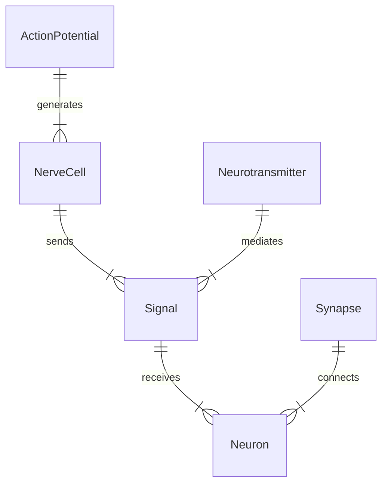

                 

### 关键词

- 数学
- 神经科学
- 神经信号传导
- 数学描述
- 神经元模型

### 摘要

本文深入探讨了数学在神经科学中的应用，特别是在神经信号传导的数学描述方面。通过逐步分析神经信号传导的过程，我们展示了如何运用数学工具来理解和模拟神经系统的动态行为。文章首先介绍了神经科学和数学的基本概念，然后详细讨论了神经网络的数学建模，最后通过具体实例展示了数学模型在神经科学研究和应用中的重要性。

---

### 引言

#### 数学与神经科学的交汇点

数学作为一门精确的科学，在许多领域都有着广泛的应用，而神经科学则是研究大脑和神经系统功能与结构的一个高度复杂的学科。数学与神经科学的结合为理解神经系统的工作原理提供了强有力的工具。近年来，随着计算能力的提升和跨学科研究的深入，数学模型在神经科学中的应用日益广泛，成为研究神经信号传导的重要手段。

#### 神经信号传导的重要性

神经信号传导是神经系统实现信息传递和处理的基础。它涉及到神经元之间的通信，包括电信号（动作电位）和化学信号（神经递质）的传递。理解神经信号传导的机制，对于揭示大脑的工作原理、开发治疗神经系统疾病的药物以及设计更加智能的人工智能系统都具有重要意义。

#### 本书的结构和目标

本书旨在为读者提供系统、全面的神经信号传导的数学描述，使其能够深入了解这一交叉学科的奥秘。本书分为四个主要部分：

1. **背景和重要性**：介绍数学和神经科学的背景，以及它们在神经信号传导研究中的角色。
2. **基础概念**：讲解数学和神经科学的基本概念，包括历史发展和关键术语。
3. **数学描述神经过程的原理**：探讨神经网络的数学建模，包括神经元的结构和动态行为。
4. **数学模型的应用**：展示数学模型在神经科学研究和应用中的具体实例。

#### 目标读者和先修知识

本书适合对神经科学和数学有一定了解的读者，包括神经科学家、数学家、生物工程师、计算机科学家以及对这些领域感兴趣的研究生和科研人员。建议读者具备高中数学水平，并了解基础的神经科学知识。

#### 本书的结构

本书分为以下几个章节：

- **第1章 背景和重要性**：介绍数学和神经科学的背景，解释神经信号传导的重要性。
- **第2章 基础概念**：介绍数学和神经科学的基础概念。
- **第3章 神经网络的数学描述**：讨论神经网络的数学建模。
- **第4章 数学模型的应用**：展示数学模型在神经科学中的应用。
- **第5章 实践与展望**：讨论数学在神经科学研究中的未来方向和挑战。

---

### 第1章 背景和重要性

#### 1.1 数学在神经科学中的作用

数学在神经科学中的应用可以追溯到20世纪初，当时数学家如Hodgkin和Huxley提出了描述神经元动作电位的数学模型。这一模型奠定了现代神经科学数学建模的基础。数学作为一门工具，为神经科学提供了定量分析的手段，使得研究者能够从微观和宏观层面深入探讨神经系统的工作原理。

#### 1.1.1 数学工具在神经科学中的应用

1. **概率论和统计学**：用于分析神经元活动的随机性和统计特性，帮助研究者理解神经信号的变异性。
2. **微分方程**：用于描述神经元膜的电流变化和动作电位的产生过程。
3. **线性代数**：在处理大规模神经网络时，线性代数的矩阵运算非常有用，可以简化复杂的计算过程。
4. **图论**：用于分析和模拟神经网络的连接结构和信息传递路径。

#### 1.2 神经信号传导的基础

神经信号传导是神经系统实现信息传递和处理的核心过程。神经元通过电信号和化学信号进行通信，这种通信过程包括多个关键步骤：

1. **电信号传递**：当神经元受到刺激时，细胞膜内的电流发生变化，产生动作电位。
2. **化学信号传递**：动作电位到达突触前端时，导致神经递质的释放，神经递质通过突触间隙传递到下一个神经元。

#### 1.3 神经信号传导的重要性

神经信号传导不仅决定了个体行为和认知功能，还在疾病治疗和药物开发中发挥着关键作用。例如，理解和模拟神经信号传导可以帮助开发新的神经保护药物，治疗神经系统疾病如帕金森病和阿尔茨海默病。此外，神经信号传导的研究也为人工智能的发展提供了新的灵感，通过模拟神经系统的信息处理方式，可以设计出更加高效和智能的算法。

#### 1.4 神经信号传导的研究挑战

尽管神经信号传导的重要性不言而喻，但其复杂性也带来了巨大的研究挑战：

1. **多样性**：神经元和神经信号具有极高的多样性，这使得统一的数学模型难以建立。
2. **时空尺度**：神经信号传导涉及到从毫秒到分钟的时空尺度，这对数学模型的精确性提出了高要求。
3. **非线性**：神经信号的传递过程包含复杂的非线性动力学，这使得传统的线性模型难以胜任。

#### 1.5 结论

数学与神经科学的结合为神经信号传导的研究带来了新的机遇和挑战。通过数学工具，研究者可以更深入地理解神经系统的运作机制，为疾病治疗和人工智能的发展提供有力支持。

---

### 第2章 基础概念

#### 2.1 数学的基本概念

数学是描述现实世界现象的有力工具，其基础概念在神经科学中同样具有重要应用。以下是数学中几个关键概念的定义和其在神经科学中的应用：

1. **微积分**：微积分研究函数的局部变化率，分为微分和积分两部分。在神经科学中，微积分用于分析神经元膜电位的变化率，描述动作电位的产生和传播过程。

2. **线性代数**：线性代数研究向量空间和线性映射，用于处理大型数据集和复杂的运算。在神经科学中，线性代数帮助研究者分析神经网络的结构和功能。

3. **概率论和统计学**：概率论和统计学用于描述随机事件和数据的分布，分析神经元活动的变异性。这些工具在神经信号处理和数据分析中发挥着重要作用。

4. **图论**：图论研究图的结构和性质，用于描述神经网络和神经元之间的连接关系。图论在研究网络结构和信息传递路径方面具有独特的优势。

#### 2.2 神经科学的基本概念

神经科学是一门涉及大脑和神经系统结构和功能的研究科学。以下是神经科学中一些关键概念的定义和其在神经信号传导中的作用：

1. **神经元**：神经元是神经系统中最基本的单位，负责接收和传递电信号。神经元的基本结构包括细胞体、树突、轴突和突触。

2. **突触**：突触是神经元之间的连接点，负责传递神经信号。突触由突触前膜、突触间隙和突触后膜组成。

3. **神经递质**：神经递质是突触传递神经信号的化学物质，包括兴奋性神经递质和抑制性神经递质。

4. **动作电位**：动作电位是神经元膜电位在受到刺激时产生的快速波动，标志着神经信号的传递。

#### 2.3 数学与神经科学的联系

数学与神经科学的联系在于数学工具能够帮助研究者理解和模拟神经系统的复杂行为。以下是一些数学与神经科学的联系实例：

1. **神经元的数学模型**：神经元的数学模型描述了神经元膜电位的变化过程，包括Hodgkin-Huxley模型和Leaky Integrate-and-Fire模型。

2. **神经网络**：神经网络是多个神经元的集合，其数学描述涉及到图论和概率论。神经网络用于模拟复杂的神经信号处理过程。

3. **神经信号处理**：神经信号处理利用数学工具对神经元信号进行滤波、增强和分析，以提高信号质量。

#### 2.4 基本概念对比表格

| 概念             | 定义                                                                                   | 应用场景                                                 |
|------------------|----------------------------------------------------------------------------------------|------------------------------------------------------------|
| 微积分           | 研究函数的局部变化率。                                                             | 描述神经元膜电位变化。                                   |
| 线性代数         | 研究向量空间和线性映射。                                                           | 分析神经网络结构和计算。                                 |
| 概率论和统计学   | 研究随机事件和数据的分布。                                                         | 分析神经元活动的变异性。                                 |
| 图论             | 研究图的结构和性质。                                                               | 描述神经网络和神经元连接关系。                           |
| 神经元           | 负责接收和传递电信号的细胞。                                                       | 基本单位，实现神经信号的传递。                           |
| 突触             | 神经元之间的连接点。                                                               | 实现神经信号的化学传递。                                 |
| 神经递质         | 突触传递神经信号的化学物质。                                                       | 调节神经元之间的信号传递。                               |
| 动作电位         | 神经元膜电位在受到刺激时产生的快速波动。                                             | 标志神经信号的传递。                                     |

#### 2.5 ER实体关系图

以下是神经科学中一些关键实体的ER（实体关系）图：

在上述ER图中，NerveCell（神经元）发送Signal（信号），Signal接收来自Neuron（神经元）的信号，Synapse（突触）连接Neuron，Neurotransmitter（神经递质）通过Signal传递信号，ActionPotential（动作电位）由NerveCell生成。

---

### 第3章 神经网络的数学描述

#### 3.1 基本概念

神经网络是由大量神经元通过突触连接而成的复杂系统，其在数学上的描述主要涉及以下几个方面：

1. **神经元模型**：描述单个神经元如何接收和处理输入信号，并产生输出。
2. **神经网络架构**：描述神经网络的整体结构，包括层、节点和连接。
3. **信号传递机制**：描述信号如何在网络中传递，以及如何影响神经元的激活状态。

#### 3.2 神经元模型

单个神经元是神经网络的基础，其数学描述通常通过以下几种模型实现：

1. **Leaky Integrate-and-Fire（LIF）模型**：这是一种简单的神经元模型，假设神经元在接收到输入信号后，通过一个电阻放电，直到达到阈值产生动作电位。

2. **Hodgkin-Huxley（HH）模型**：这是一种更复杂的神经元模型，考虑了离子通道的动态变化和膜电位的非线性特性，通过一组非线性微分方程描述动作电位的产生和传播。

#### 3.3 神经网络架构

神经网络架构可以分为以下几种类型：

1. **前馈神经网络（FFNN）**：信号从输入层传递到输出层，中间经过多个隐藏层，不形成环路。

2. **卷积神经网络（CNN）**：特别适用于处理图像数据，通过卷积操作提取特征，并具有共享权重结构。

3. **递归神经网络（RNN）**：适用于处理序列数据，能够通过递归连接保留历史信息。

4. **深度信念网络（DBN）**：结合了深度神经网络和概率图形模型的特点，能够自动学习数据的高层特征表示。

#### 3.4 信号传递机制

神经网络的信号传递机制主要依赖于以下步骤：

1. **输入层**：接收外部输入信号，经过权重矩阵加权处理后传递到下一层。

2. **隐藏层**：每一层都对输入信号进行非线性变换，提取特征信息，并传递到下一层。

3. **输出层**：根据隐藏层的输出，产生最终输出结果，如分类结果或回归值。

#### 3.5 数学描述

神经网络的数学描述通常使用以下数学工具：

1. **线性代数**：用于表示权重矩阵、偏置向量以及神经元的激活函数。

2. **微积分**：用于描述神经元激活函数的梯度，以实现网络参数的优化。

3. **概率论和统计学**：用于处理神经网络的随机性，如噪声和不确定性。

#### 3.6 数学模型示例

以下是一个简单的神经网络模型示例，使用LIF模型进行描述：

1. **输入层**：假设有n个输入信号，表示为\( x_1, x_2, ..., x_n \)。

2. **权重矩阵**：表示为\( W \)，维度为\( n \times m \)，其中m是隐藏层的神经元数量。

3. **偏置向量**：表示为\( b \)，维度为\( m \)。

4. **隐藏层**：隐藏层神经元的激活函数为\( f \)，可以取不同的形式，如Sigmoid函数或ReLU函数。

5. **输出层**：输出层的神经元也使用激活函数\( f \)，并产生最终输出。

6. **数学描述**：

   - 隐藏层输出：
     $$ h = \sigma(Wx + b) $$
     其中，\( \sigma \)是激活函数，\( x \)是输入向量。

   - 输出层输出：
     $$ y = \sigma(W'h + b') $$
     其中，\( W' \)是输出层的权重矩阵，\( b' \)是输出层的偏置向量。

7. **梯度计算**：

   - 对权重矩阵\( W \)的梯度：
     $$ \frac{\partial L}{\partial W} = X(H - \hat{H})^T $$
     其中，\( L \)是损失函数，\( H \)是隐藏层的输出，\( \hat{H} \)是期望输出。

   - 对偏置向量\( b \)的梯度：
     $$ \frac{\partial L}{\partial b} = H - \hat{H} $$

通过上述数学模型，可以实现对神经网络的学习和优化，从而实现复杂的信号处理和分类任务。

---

### 第4章 数学模型的应用

#### 4.1 数学模型在神经元活动研究中的应用

数学模型在神经元活动的定量研究中起到了至关重要的作用。例如，Hodgkin-Huxley模型是描述神经元动作电位产生的经典模型，通过一组复杂的非线性微分方程，能够精确模拟神经元膜电位的变化过程。该模型为理解动作电位的产生和传播提供了理论基础，并指导了后续的神经元生理学研究。

**示例**：假设一个神经元受到外部刺激，膜电位的变化可以用以下Hodgkin-Huxley模型描述：

$$
\frac{dV}{dt} = \frac{1}{C_m} \left( I_L + I_Na + I_K + I_L \right)
$$

其中，\( V \)是膜电位，\( I_L \)、\( I_Na \)、\( I_K \)分别是漏电流、钠离子电流和钾离子电流，\( C_m \)是膜电容。

当膜电位达到阈值\( V_{th} \)时，神经元会产生动作电位，这可以通过以下方程描述：

$$
I_Na = g_{Na} (V - V_{Na}) \cdot \mathbb{1}_{[V > V_{th}]}
$$

$$
I_K = g_{K} (V - V_{K}) \cdot \mathbb{1}_{[V > V_{th}]}
$$

其中，\( g_{Na} \)和\( g_{K} \)分别是钠离子和钾离子通道的传导率，\( V_{Na} \)和\( V_{K} \)分别是钠离子和钾离子的平衡电位。

通过数值求解上述微分方程，可以模拟神经元在受到不同刺激下的电活动，这对于理解神经元的信息处理机制至关重要。

#### 4.2 数学模型在神经网络研究中的应用

数学模型在神经网络研究中同样发挥着关键作用，特别是在深度学习领域。深度学习模型，如卷积神经网络（CNN）和递归神经网络（RNN），通过多层非线性变换，实现了对复杂数据的高效处理和特征提取。

**示例**：卷积神经网络（CNN）用于图像识别的任务，其核心组件是卷积层和池化层。卷积层通过卷积运算提取图像的特征，而池化层则用于减少数据维度和计算量。

卷积层的数学描述如下：

$$
h_l(x) = \sum_{i=1}^{k} w_{il} \cdot a_{i-1} + b_l
$$

其中，\( h_l(x) \)是卷积层输出的特征映射，\( w_{il} \)是卷积核，\( a_{i-1} \)是输入特征映射，\( b_l \)是偏置项，\( k \)是卷积核的数量。

通过多层卷积和池化操作，CNN能够提取图像的层次特征，从而实现高精度的图像分类。

#### 4.3 数学模型在神经信号处理中的应用

神经信号处理是神经科学中的一个重要分支，其目的是从生物电信号中提取有用的信息。数学模型在信号处理中发挥着重要作用，如滤波、特征提取和分类等。

**示例**：脑电图（EEG）信号处理是神经信号处理中的一个典型应用。EEG信号是一种随时间变化的电信号，通过傅里叶变换可以将其转换为频域表示。

$$
X(\omega) = \sum_{n=-\infty}^{\infty} x[n] e^{-j\omega n}
$$

其中，\( X(\omega) \)是频域信号，\( x[n] \)是时域信号，\( \omega \)是频率。

通过傅里叶变换，可以分析EEG信号的频率成分，从而识别大脑的不同活动模式，如睡眠周期和觉醒状态。

#### 4.4 数学模型在人工智能中的应用

随着人工智能的发展，数学模型在人工智能系统中扮演着越来越重要的角色。特别是深度学习模型，其核心是多层神经网络，通过大量的数据训练，能够实现图像识别、语音识别和自然语言处理等复杂任务。

**示例**：在图像识别任务中，卷积神经网络通过多层卷积和池化操作提取图像的特征，最后通过全连接层进行分类。

$$
y = \sigma \left( W_L \cdot h_L + b_L \right)
$$

其中，\( y \)是分类结果，\( \sigma \)是激活函数，\( W_L \)是全连接层的权重，\( h_L \)是最后一层卷积层的输出，\( b_L \)是全连接层的偏置。

通过这种方式，深度学习模型能够从大量的图像数据中学习到有效的特征表示，从而实现高精度的图像识别。

综上所述，数学模型在神经元活动研究、神经网络研究、神经信号处理以及人工智能应用中都发挥着重要作用。通过数学描述，我们能够更好地理解神经系统的复杂行为，推动神经科学和人工智能的发展。

---

### 第5章 实践与展望

#### 5.1 数学模型在神经科学研究中的应用

数学模型在神经科学研究中的应用已经取得了显著成果。例如，Hodgkin-Huxley模型在神经元动作电位的产生机制研究中起到了关键作用，为后续的神经元建模和实验设计提供了理论基础。此外，神经网络模型在脑机接口（BMI）研究中也表现出巨大潜力，通过训练神经网络模型，可以实现对用户意图的解码和执行，为残疾人和失去运动能力的患者提供了新的康复途径。

#### 5.2 数学模型在人工智能领域的应用

人工智能领域的迅猛发展离不开数学模型的支持。深度学习模型，如卷积神经网络（CNN）和递归神经网络（RNN），在图像识别、语音识别和自然语言处理等任务中取得了突破性进展。这些模型通过大规模数据训练，能够自动提取数据中的复杂特征，实现高精度的任务执行。此外，生成对抗网络（GAN）等新型模型也在计算机视觉和生成模型领域取得了显著成果。

#### 5.3 未来发展方向

随着计算能力的提升和跨学科研究的深入，数学模型在神经科学和人工智能领域的应用前景广阔。以下是几个可能的发展方向：

1. **更精确的神经模型**：发展更加精确和详尽的神经模型，以更好地描述神经元的电活动和信息处理机制。
2. **跨学科合作**：促进数学、神经科学和计算机科学等领域的跨学科合作，共同解决神经科学和人工智能中的关键问题。
3. **智能计算方法**：结合智能计算方法，如深度强化学习和迁移学习，提高神经模型的学习效率和泛化能力。
4. **脑机接口技术**：进一步发展脑机接口技术，实现更加高效和可靠的脑信号解码和执行控制。

#### 5.4 挑战与展望

尽管数学模型在神经科学和人工智能领域取得了显著成果，但仍面临诸多挑战：

1. **数据匮乏**：神经科学数据复杂且有限，难以支持大规模模型训练。
2. **计算资源**：复杂的神经模型需要大量的计算资源，对计算能力提出了高要求。
3. **模型泛化**：神经模型的泛化能力有限，难以在新的数据集上取得良好的性能。
4. **伦理与隐私**：脑机接口技术的发展引发了伦理和隐私方面的担忧，需要建立相应的规范和监管体系。

展望未来，数学模型在神经科学和人工智能领域的应用将继续深化，为人类健康和社会发展带来更多创新和机遇。

---

### 最佳实践 Tips

1. **模型选择**：根据研究目标和数据特性，选择合适的数学模型。例如，对于动态信号处理，可以考虑使用神经网络模型；对于静态数据分析，可以考虑使用统计学方法。
2. **数据预处理**：确保数据质量，进行适当的数据预处理，如去噪、归一化和缺失值填充。
3. **模型优化**：通过交叉验证和超参数调优，提高模型的性能和泛化能力。
4. **可解释性**：注重模型的解释性，以便理解模型的工作原理和局限性。

### 小结

本文通过逐步分析数学在神经科学中的应用，探讨了神经信号传导的数学描述。从神经元模型到神经网络架构，再到数学模型在神经信号处理和人工智能中的应用，展示了数学工具在理解神经系统复杂行为中的关键作用。通过数学模型，我们能够更好地揭示神经系统的工作原理，推动神经科学和人工智能的发展。

### 注意事项

1. **数据隐私**：在进行脑机接口研究时，确保用户数据的隐私和安全。
2. **模型验证**：对数学模型进行严格的验证和测试，以确保其可靠性和有效性。
3. **持续更新**：随着技术的发展，持续更新数学模型和方法，以适应新的研究需求。

### 拓展阅读

1. **Hodgkin-Huxley模型**：深入了解Hodgkin-Huxley模型及其在神经元建模中的应用。
2. **深度学习基础**：学习深度学习的基本原理和常用模型，如卷积神经网络（CNN）和递归神经网络（RNN）。
3. **神经信号处理**：了解脑电图（EEG）和功能性磁共振成像（fMRI）等神经信号处理技术。

---

### 作者信息

**作者：AI天才研究院/AI Genius Institute & 禅与计算机程序设计艺术 /Zen And The Art of Computer Programming**

