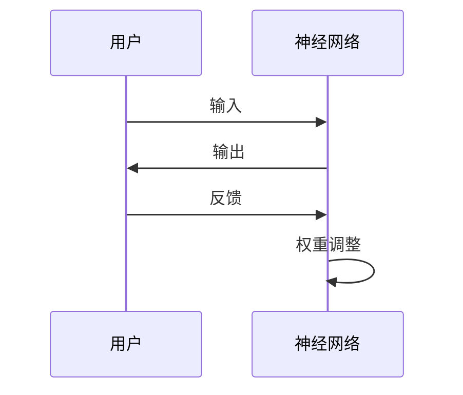
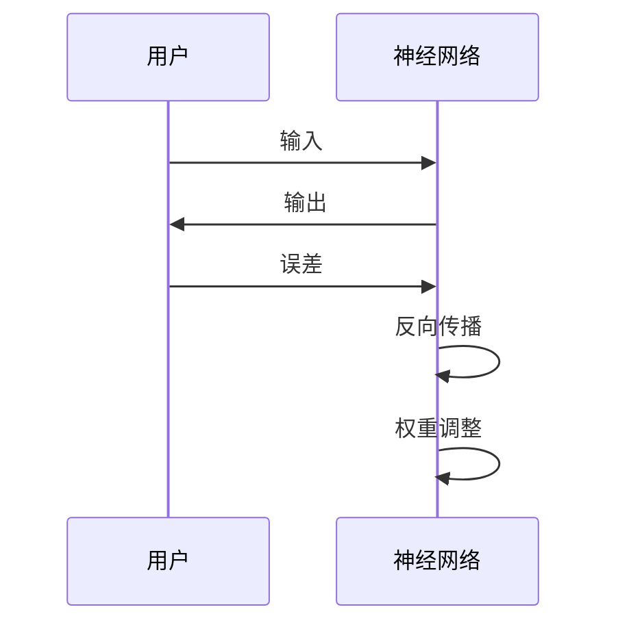
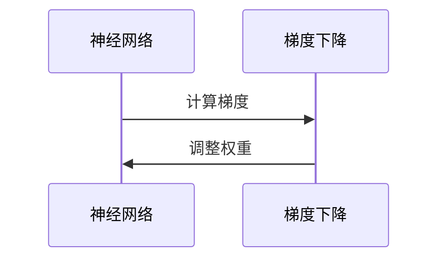
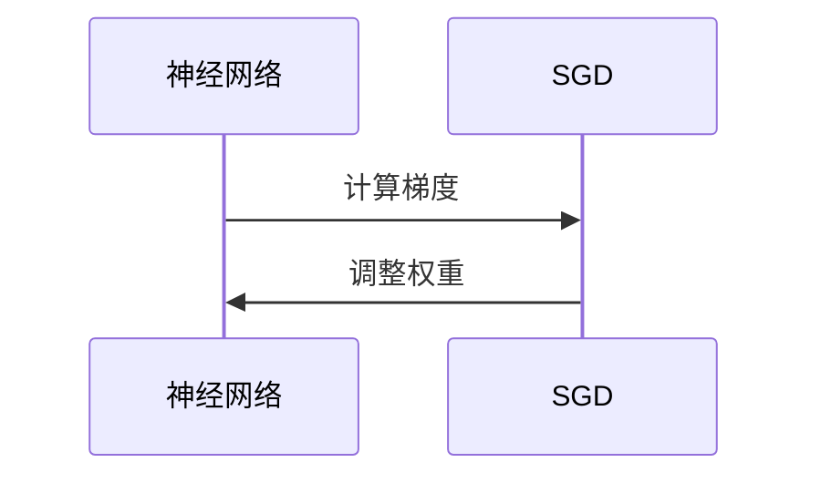
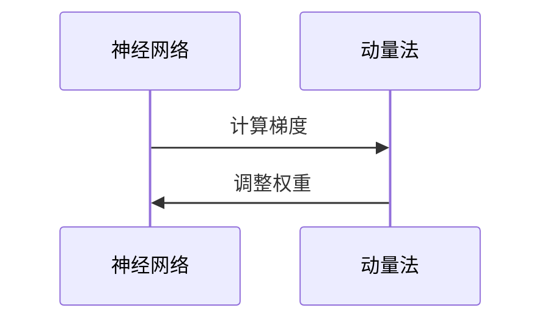
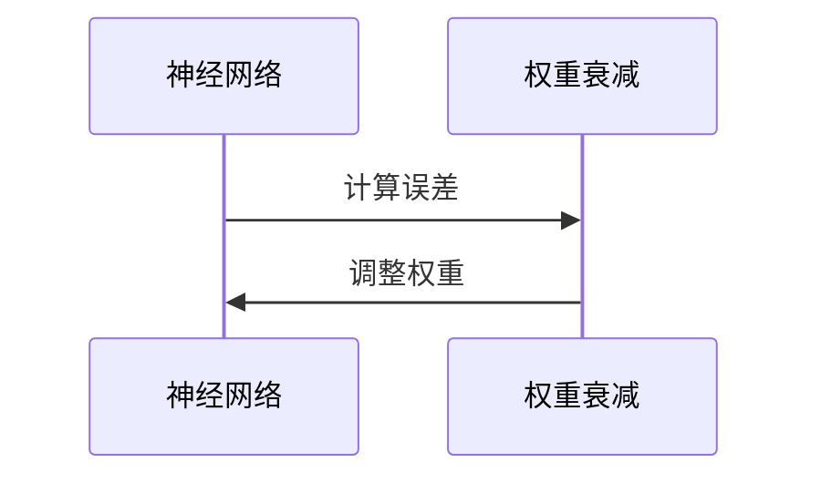
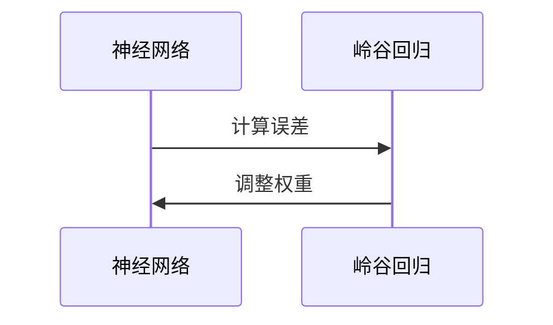
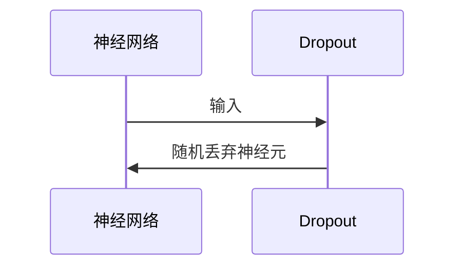

                 

# 数学与神经科学：神经网络的数学模拟

## 关键词
- 神经科学
- 神经网络
- 数学模拟
- 微积分
- 线性代数
- 概率论

## 摘要
本文深入探讨了神经科学与数学模拟的交汇点，特别是神经网络在数学模拟中的应用。通过逐步分析神经科学的基本原理和神经网络的核心算法，本文揭示了神经网络如何模拟人类大脑的运作机制。本文旨在为读者提供一个清晰、系统的理解，帮助他们在这一前沿领域取得深入认识。

## 目录大纲

### 第一部分：神经科学基础

#### 第1章：神经科学简介

##### 1.1 神经系统概述
**背景介绍**：神经系统是人类身体最重要的系统之一，负责接收、处理和传递信息。了解神经系统的基本结构和工作原理对于理解神经网络至关重要。

**核心概念与联系**：
- **神经元**：作为神经系统的基础单元，神经元具有接收、处理和传递信息的能力。
- **突触**：神经元之间的连接点，通过电信号或化学物质传递信息。

**概念属性特征对比表格**：

| 特征 | 神经元 | 突触 |
| --- | --- | --- |
| 主要功能 | 接收、处理、传递信息 | 传递神经信号 |
| 结构组成 | 细胞体、树突、轴突、突触 | 突触前膜、突触间隙、突触后膜 |
| 信息传递 | 电信号、化学信号 | 电信号、化学信号 |

**ER实体关系图架构**：

```mermaid
erDiagram
  神经元 ||--|{ 突触 }
  突触 ||--|{ 神经元 }
```

##### 1.2 神经元结构与功能
**背景介绍**：神经元是神经系统的基本单元，其结构和功能决定了神经系统的复杂性和效率。

**核心概念与联系**：
- **细胞体**：神经元的主体，包含细胞核和其他细胞器。
- **树突**：接收其他神经元传递来的信息。
- **轴突**：传递信息到其他神经元或目标细胞。

**概念属性特征对比表格**：

| 特征 | 细胞体 | 树突 | 轴突 |
| --- | --- | --- | --- |
| 主要功能 | 细胞代谢、信息处理 | 接收信号 | 传递信号 |

**ER实体关系图架构**：

```mermaid
erDiagram
  神经元 ||--|{ 细胞体 }
  神经元 ||--|{ 树突 }
  神经元 ||--|{ 轴突 }
```

##### 1.3 神经传递与突触
**背景介绍**：神经传递是神经元之间信息传递的关键过程，突触是实现这一过程的主要结构。

**核心概念与联系**：
- **神经递质**：传递神经信号的化学物质。
- **突触前膜和突触后膜**：神经信号在突触间的传递通过这两层膜完成。

**概念属性特征对比表格**：

| 特征 | 突触前膜 | 突触后膜 |
| --- | --- | --- |
| 主要功能 | 释放神经递质 | 接受神经递质 |

**ER实体关系图架构**：

```mermaid
erDiagram
  突触 ||--|{ 突触前膜 }
  突触 ||--|{ 突触后膜 }
```

##### 1.4 神经系统的发育与损伤修复
**背景介绍**：神经系统的发育和损伤修复对于维持神经功能的完整性和适应性至关重要。

**核心概念与联系**：
- **神经发生**：神经元的生成和迁移。
- **神经再生**：损伤后的神经元修复过程。

**概念属性特征对比表格**：

| 特征 | 神经发生 | 神经再生 |
| --- | --- | --- |
| 主要功能 | 神经元的生成和迁移 | 神经元的修复和功能恢复 |

**ER实体关系图架构**：

```mermaid
erDiagram
  神经系统 ||--|{ 神经发生 }
  神经系统 ||--|{ 神经再生 }
```

### 第二部分：神经网络基础

#### 第2章：神经网络基础

##### 2.1 神经网络概述
**背景介绍**：神经网络是一种模仿人类大脑结构和功能的计算模型，广泛应用于各种领域。

**核心概念与联系**：
- **人工神经元**：神经网络的基本单元，类似于生物神经元。
- **层**：神经网络中的层次结构，包括输入层、隐藏层和输出层。

**概念属性特征对比表格**：

| 层 | 功能 | 特征 |
| --- | --- | --- |
| 输入层 | 接收输入信号 | 无权重 |
| 隐藏层 | 处理信息 | 含权重 |
| 输出层 | 产生输出信号 | 含权重 |

**ER实体关系图架构**：

```mermaid
erDiagram
  输入层 ||--|{ 隐藏层 }
  隐藏层 ||--|{ 输出层 }
```

##### 2.2 前馈神经网络
**背景介绍**：前馈神经网络（FNN）是最简单的神经网络类型，信息从输入层直接流向输出层，无循环。

**核心概念与联系**：
- **正向传播**：信息从输入层流向输出层。
- **反向传播**：用于训练和调整网络权重。

**概念属性特征对比表格**：

| 过程 | 功能 | 特征 |
| --- | --- | --- |
| 正向传播 | 信息传递 | 无反馈 |
| 反向传播 | 权重调整 | 反向传递误差 |

**ER实体关系图架构**：



##### 2.3 反向传播算法
**背景介绍**：反向传播算法是训练神经网络的核心算法，通过不断调整权重来优化网络性能。

**核心概念与联系**：
- **梯度下降**：优化权重的常用方法。
- **反向传播**：计算梯度并用于权重调整。

**概念属性特征对比表格**：

| 方法 | 功能 | 特征 |
| --- | --- | --- |
| 梯度下降 | 权重优化 | 最小化误差 |
| 反向传播 | 梯度计算 | 误差反向传递 |

**ER实体关系图架构**：



##### 2.4 深度神经网络
**背景介绍**：深度神经网络（DNN）通过增加隐藏层数量来提高模型复杂度和性能。

**核心概念与联系**：
- **多层感知器**：多层神经网络的基本单元。
- **深度学习**：利用深度神经网络进行特征学习和模式识别。

**概念属性特征对比表格**：

| 层 | 功能 | 特征 |
| --- | --- | --- |
| 输入层 | 接收输入信号 | 无权重 |
| 隐藏层 | 处理信息 | 含权重 |
| 输出层 | 产生输出信号 | 含权重 |

**ER实体关系图架构**：

```mermaid
erDiagram
  输入层 ||--|{ 隐藏层 }
  隐藏层 ||--|{ 输出层 }
```

### 第三部分：神经网络的数学基础

#### 第3章：神经网络的数学基础

##### 3.1 微积分基础
**背景介绍**：微积分是研究变化和运动的数学分支，是神经网络算法的重要基础。

**核心概念与联系**：
- **导数**：表示函数的变化率。
- **梯度**：函数在多个变量下的变化率。

**概念属性特征对比表格**：

| 概念 | 功能 | 特征 |
| --- | --- | --- |
| 导数 | 函数变化率 | 一阶导数、高阶导数 |
| 梯度 | 函数多变量变化率 | 偏导数 |

**ER实体关系图架构**：

```mermaid
erDiagram
  导数 ||--|{ 梯度 }
```

##### 3.2 线性代数基础
**背景介绍**：线性代数是研究向量空间和线性变换的数学分支，对于理解神经网络至关重要。

**核心概念与联系**：
- **矩阵**：用于表示线性变换。
- **向量**：用于表示数据。

**概念属性特征对比表格**：

| 概念 | 功能 | 特征 |
| --- | --- | --- |
| 矩阵 | 线性变换 | 行、列、元素 |
| 向量 | 数据表示 | 维度、元素 |

**ER实体关系图架构**：

```mermaid
erDiagram
  矩阵 ||--|{ 向量 }
```

##### 3.3 概率论基础
**背景介绍**：概率论是研究随机现象的数学分支，对于理解和优化神经网络至关重要。

**核心概念与联系**：
- **概率分布**：表示随机变量的可能取值及其概率。
- **期望和方差**：衡量随机变量的中心位置和离散程度。

**概念属性特征对比表格**：

| 概念 | 功能 | 特征 |
| --- | --- | --- |
| 概率分布 | 随机变量概率表示 | 离散分布、连续分布 |
| 期望 | 随机变量中心位置 | 数学期望、平均值 |
| 方差 | 随机变量离散程度 | 方差、标准差 |

**ER实体关系图架构**：

```mermaid
erDiagram
  概率分布 ||--|{ 期望 }
  概率分布 ||--|{ 方差 }
```

##### 3.4 概率分布与信息论
**背景介绍**：概率分布和信息论是神经网络中重要的数学工具，用于理解和优化网络性能。

**核心概念与联系**：
- **熵**：衡量随机变量的不确定性。
- **条件概率**：在给定一个变量的情况下，另一个变量的概率。

**概念属性特征对比表格**：

| 概念 | 功能 | 特征 |
| --- | --- | --- |
| 熵 | 不确定性衡量 | 信息熵、条件熵 |
| 条件概率 | 概率关系 | 条件概率、贝叶斯定理 |

**ER实体关系图架构**：

```mermaid
erDiagram
  熵 ||--|{ 条件概率 }
```

### 第四部分：神经网络的训练与优化

#### 第4章：神经网络的训练与优化

##### 4.1 梯度下降法
**背景介绍**：梯度下降法是训练神经网络的基本方法，通过不断调整权重来优化网络性能。

**核心概念与联系**：
- **梯度**：权重的调整方向。
- **步长**：调整权重的幅度。

**概念属性特征对比表格**：

| 方法 | 功能 | 特征 |
| --- | --- | --- |
| 梯度下降 | 权重优化 | 最小化误差 |
| 步长 | 调整幅度 | 调整速度 |

**ER实体关系图架构**：



##### 4.2 随机梯度下降（SGD）
**背景介绍**：随机梯度下降是梯度下降的一种变种，通过每次更新时使用不同的样本来提高优化效果。

**核心概念与联系**：
- **批量大小**：每次更新时使用的样本数量。
- **随机性**：提高模型泛化能力。

**概念属性特征对比表格**：

| 方法 | 功能 | 特征 |
| --- | --- | --- |
| SGD | 权重优化 | 随机样本 |
| 批量大小 | 样本数量 | 小批量、大数据 |

**ER实体关系图架构**：



##### 4.3 动量法
**背景介绍**：动量法是梯度下降的一种改进，通过引入动量来加速收敛。

**核心概念与联系**：
- **动量**：前一次梯度更新的影响。
- **惯性**：提高收敛速度。

**概念属性特征对比表格**：

| 方法 | 功能 | 特征 |
| --- | --- | --- |
| 动量法 | 权重优化 | 加速收敛 |
| 动量 | 前一次梯度 | 惯性影响 |

**ER实体关系图架构**：



##### 4.4 梯度爆炸与梯度消失
**背景介绍**：梯度爆炸和梯度消失是神经网络训练中的常见问题，影响模型性能。

**核心概念与联系**：
- **梯度爆炸**：梯度值过大导致权重不稳定。
- **梯度消失**：梯度值过小导致权重无法更新。

**概念属性特征对比表格**：

| 问题 | 原因 | 影响 |
| --- | --- | --- |
| 梯度爆炸 | 激活函数饱和 | 权重不稳定 |
| 梯度消失 | 激活函数平滑 | 权重无法更新 |

**ER实体关系图架构**：

```mermaid
erDiagram
  梯度爆炸 ||--|{ 梯度消失 }
```

### 第五部分：神经网络的正则化与优化

#### 第5章：神经网络的正则化与优化

##### 5.1 权重衰减
**背景介绍**：权重衰减是一种常用的正则化方法，通过减小权重来防止过拟合。

**核心概念与联系**：
- **L2正则化**：权重衰减的数学表述。

**概念属性特征对比表格**：

| 方法 | 功能 | 公式 |
| --- | --- | --- |
| 权重衰减 | 防止过拟合 | $\frac{\partial E}{\partial w} = \frac{\partial E}{\partial w} + \lambda w $ |

**ER实体关系图架构**：



##### 5.2 岭回归与L1正则化
**背景介绍**：岭回归和L1正则化是另一种常用的正则化方法，通过引入惩罚项来优化模型。

**核心概念与联系**：
- **L1正则化**：Lasso回归的数学表述。

**概念属性特征对比表格**：

| 方法 | 功能 | 公式 |
| --- | --- | --- |
| 岭回归 | 防止过拟合 | $\frac{\partial E}{\partial w} = \frac{\partial E}{\partial w} + \lambda \sum_{i=1}^{n} w_i^2 $ |
| L1正则化 | 防止过拟合 | $\frac{\partial E}{\partial w} = \frac{\partial E}{\partial w} + \lambda \sum_{i=1}^{n} |w_i| $ |

**ER实体关系图架构**：

```mermaid
erDiagram
  岭回归 ||--|{ L1正则化 }
```

##### 5.3 岭谷回归与L2正则化
**背景介绍**：岭谷回归是岭回归和L2正则化的结合，通过在L2正则化中引入非平滑项来优化模型。

**核心概念与联系**：
- **L2正则化**：岭谷回归的数学表述。

**概念属性特征对比表格**：

| 方法 | 功能 | 公式 |
| --- | --- | --- |
| 岭谷回归 | 防止过拟合 | $\frac{\partial E}{\partial w} = \frac{\partial E}{\partial w} + \lambda \sum_{i=1}^{n} w_i^4 $ |

**ER实体关系图架构**：



##### 5.4 Dropout正则化
**背景介绍**：Dropout是一种常用的正则化方法，通过随机丢弃神经元来防止过拟合。

**核心概念与联系**：
- **随机性**：Dropout的关键特性。

**概念属性特征对比表格**：

| 方法 | 功能 | 特征 |
| --- | --- | --- |
| Dropout | 防止过拟合 | 随机丢弃神经元 |

**ER实体关系图架构**：



### 第六部分：神经网络的变种

#### 第6章：神经网络的变种

##### 6.1 卷积神经网络（CNN）
**背景介绍**：卷积神经网络是用于图像识别等计算机视觉任务的强大工具，通过卷积操作提取图像特征。

**核心概念与联系**：
- **卷积层**：提取图像特征的主要层。
- **池化层**：减少参数和计算量的常用层。

**概念属性特征对比表格**：

| 层 | 功能 | 特征 |
| --- | --- | --- |
| 卷积层 | 特征提取 | 卷积操作 |
| 池化层 | 特征降维 | 最大池化、平均池化 |

**ER实体关系图架构**：

```mermaid
erDiagram
  卷积层 ||--|{ 池化层 }
```

##### 6.2 循环神经网络（RNN）
**背景介绍**：循环神经网络是用于处理序列数据的神经网络，通过循环结构保持序列信息。

**核心概念与联系**：
- **隐藏状态**：RNN的核心组件，用于保存序列信息。
- **门控**：用于控制信息的传递和更新。

**概念属性特征对比表格**：

| 组件 | 功能 | 特征 |
| --- | --- | --- |
| 隐藏状态 | 信息保存 | 循环依赖 |
| 门控 | 信息控制 | 重置门、更新门 |

**ER实体关系图架构**：

```mermaid
sequenceDiagram
  participant RNN as RNN
  RNN->>RNN: 隐藏状态
  RNN->>RNN: 门控
```

##### 6.3 长短时记忆网络（LSTM）
**背景介绍**：长短时记忆网络是RNN的一种改进，通过门控机制解决长短时依赖问题。

**核心概念与联系**：
- **细胞状态**：LSTM的核心组件，用于保存和传递信息。
- **门控**：用于控制信息的传递和更新。

**概念属性特征对比表格**：

| 组件 | 功能 | 特征 |
| --- | --- | --- |
| 细胞状态 | 信息传递 | 长短时依赖 |
| 门控 | 信息控制 | 重置门、更新门、输出门 |

**ER实体关系图架构**：

```mermaid
sequenceDiagram
  participant LSTM as LSTM
  LSTM->>LSTM: 细胞状态
  LSTM->>LSTM: 门控
```

##### 6.4 门控循环单元（GRU）
**背景介绍**：门控循环单元是LSTM的简化版，通过合并输入门和遗忘门来提高计算效率。

**核心概念与联系**：
- **更新门**：控制信息的传递和更新。
- **门控**：用于控制信息的传递和更新。

**概念属性特征对比表格**：

| 组件 | 功能 | 特征 |
| --- | --- | --- |
| 更新门 | 信息传递 | 长短时依赖 |
| 门控 | 信息控制 | 输入门、更新门 |

**ER实体关系图架构**：

```mermaid
sequenceDiagram
  participant GRU as GRU
  GRU->>GRU: 更新门
  GRU->>GRU: 门控
```

### 第七部分：神经网络的实践应用

#### 第7章：神经网络的实践应用

##### 7.1 图像识别
**背景介绍**：图像识别是神经网络最成功的应用之一，广泛应用于计算机视觉领域。

**核心概念与联系**：
- **卷积神经网络**：用于图像特征提取和分类。
- **反向传播算法**：用于训练和优化网络。

**系统分析与架构设计方案**：

**问题场景介绍**：
- 图像识别：输入一张图像，输出对应的标签。

**项目介绍**：
- 使用卷积神经网络进行图像识别。

**系统功能设计（领域模型类图）**：

```mermaid
classDiagram
  Class01 <|-- Class02
  Class03 --|> Class04
  Class05 : <<interface,Interface>>
  Class06 : <<abstract,Abstract>>
  Class07 : <<enum,Enum>>
  Class01 {
  + attribute1
  + attribute2
  + attribute3
  - method1()
  - method2()
  }
  Class02 {
  + isA()
  }
  Class03 {
  + hasA()
  }
  Class04 {
  + implementedInterface()
  }
  Class05 {
  + value1
  + value2
  }
  Class06 {
  + condition1
  + condition2
  }
  Class07 {
  + enumValue1
  + enumValue2
  }
```

**系统架构设计（架构图）**：

```mermaid
graph LR
A[起始页] --> B(卷积神经网络)
B --> C(反向传播算法)
C --> D(模型优化)
D --> E(模型评估)
E --> F(结果输出)
```

**系统接口设计（接口设计）**：

```mermaid
sequenceDiagram
  participant User as 用户
  participant ImageRecognitionSystem as 图像识别系统
  User->>ImageRecognitionSystem: 输入图像
  ImageRecognitionSystem->>User: 输出标签
```

**系统交互（序列图）**：

```mermaid
sequenceDiagram
  participant Image as 图像
  participant Model as 模型
  participant User as 用户
  Image->>Model: 输入图像
  Model->>Model: 特征提取
  Model->>User: 输出标签
```

##### 7.2 自然语言处理
**背景介绍**：自然语言处理是神经网络在语言领域的应用，用于处理文本数据。

**核心概念与联系**：
- **循环神经网络**：用于处理序列数据。
- **嵌入层**：将单词映射到固定维度的向量。

**系统分析与架构设计方案**：

**问题场景介绍**：
- 文本分类：输入一段文本，输出对应的分类。

**项目介绍**：
- 使用循环神经网络进行文本分类。

**系统功能设计（领域模型类图）**：

```mermaid
classDiagram
  Class01 <|-- Class02
  Class03 --|> Class04
  Class05 : <<interface,Interface>>
  Class06 : <<abstract,Abstract>>
  Class07 : <<enum,Enum>>
  Class01 {
  + attribute1
  + attribute2
  + attribute3
  - method1()
  - method2()
  }
  Class02 {
  + isA()
  }
  Class03 {
  + hasA()
  }
  Class04 {
  + implementedInterface()
  }
  Class05 {
  + value1
  + value2
  }
  Class06 {
  + condition1
  + condition2
  }
  Class07 {
  + enumValue1
  + enumValue2
  }
```

**系统架构设计（架构图）**：

```mermaid
graph LR
A[起始页] --> B(循环神经网络)
B --> C(嵌入层)
C --> D(模型优化)
D --> E(模型评估)
E --> F(结果输出)
```

**系统接口设计（接口设计）**：

```mermaid
sequenceDiagram
  participant User as 用户
  participant NaturalLanguageProcessingSystem as 自然语言处理系统
  User->>NaturalLanguageProcessingSystem: 输入文本
  NaturalLanguageProcessingSystem->>User: 输出分类
```

**系统交互（序列图）**：

```mermaid
sequenceDiagram
  participant Text as 文本
  participant Model as 模型
  participant User as 用户
  Text->>Model: 输入文本
  Model->>Model: 嵌入
  Model->>User: 输出分类
```

##### 7.3 强化学习
**背景介绍**：强化学习是神经网络在决策领域的应用，通过不断学习来优化决策策略。

**核心概念与联系**：
- **奖励机制**：用于评估决策的好坏。
- **策略更新**：基于奖励机制进行策略优化。

**系统分析与架构设计方案**：

**问题场景介绍**：
- 自动驾驶：输入环境信息，输出驾驶决策。

**项目介绍**：
- 使用强化学习进行自动驾驶。

**系统功能设计（领域模型类图）**：

```mermaid
classDiagram
  Class01 <|-- Class02
  Class03 --|> Class04
  Class05 : <<interface,Interface>>
  Class06 : <<abstract,Abstract>>
  Class07 : <<enum,Enum>>
  Class01 {
  + attribute1
  + attribute2
  + attribute3
  - method1()
  - method2()
  }
  Class02 {
  + isA()
  }
  Class03 {
  + hasA()
  }
  Class04 {
  + implementedInterface()
  }
  Class05 {
  + value1
  + value2
  }
  Class06 {
  + condition1
  + condition2
  }
  Class07 {
  + enumValue1
  + enumValue2
  }
```

**系统架构设计（架构图）**：

```mermaid
graph LR
A[起始页] --> B(环境模型)
B --> C(策略网络)
C --> D(奖励机制)
D --> E(策略更新)
E --> F(结果输出)
```

**系统接口设计（接口设计）**：

```mermaid
sequenceDiagram
  participant User as 用户
  participant ReinforcementLearningSystem as 强化学习系统
  User->>ReinforcementLearningSystem: 输入环境信息
  ReinforcementLearningSystem->>User: 输出驾驶决策
```

**系统交互（序列图）**：

```mermaid
sequenceDiagram
  participant Environment as 环境
  participant PolicyNetwork as 策略网络
  participant RewardMechanism as 奖励机制
  participant User as 用户
  Environment->>PolicyNetwork: 输入环境信息
  PolicyNetwork->>RewardMechanism: 输出驾驶决策
  RewardMechanism->>User: 输出奖励
```

##### 7.4 其他应用领域
**背景介绍**：神经网络在许多其他领域也有广泛应用，如语音识别、推荐系统等。

**核心概念与联系**：
- **语音识别**：将语音转换为文本。
- **推荐系统**：基于用户行为预测用户喜好。

**系统分析与架构设计方案**：

**问题场景介绍**：
- 语音识别：输入语音，输出文本。
- 推荐系统：输入用户行为，输出推荐结果。

**项目介绍**：
- 使用神经网络进行语音识别和推荐系统。

**系统功能设计（领域模型类图）**：

```mermaid
classDiagram
  Class01 <|-- Class02
  Class03 --|> Class04
  Class05 : <<interface,Interface>>
  Class06 : <<abstract,Abstract>>
  Class07 : <<enum,Enum>>
  Class01 {
  + attribute1
  + attribute2
  + attribute3
  - method1()
  - method2()
  }
  Class02 {
  + isA()
  }
  Class03 {
  + hasA()
  }
  Class04 {
  + implementedInterface()
  }
  Class05 {
  + value1
  + value2
  }
  Class06 {
  + condition1
  + condition2
  }
  Class07 {
  + enumValue1
  + enumValue2
  }
```

**系统架构设计（架构图）**：

```mermaid
graph LR
A[起始页] --> B(语音识别系统)
B --> C(推荐系统)
C --> D(语音识别模块)
D --> E(推荐模块)
E --> F(结果输出)
```

**系统接口设计（接口设计）**：

```mermaid
sequenceDiagram
  participant User as 用户
  participant SpeechRecognitionSystem as 语音识别系统
  participant RecommendationSystem as 推荐系统
  User->>SpeechRecognitionSystem: 输入语音
  SpeechRecognitionSystem->>User: 输出文本
  User->>RecommendationSystem: 输入行为
  RecommendationSystem->>User: 输出推荐结果
```

**系统交互（序列图）**：

```mermaid
sequenceDiagram
  participant Speech as 语音
  participant Text as 文本
  participant User as 用户
  Speech->>Text: 转换文本
  Text->>User: 输出文本

  participant Behavior as 行为
  participant Recommendation as 推荐结果
  participant User as 用户
  Behavior->>Recommendation: 预测喜好
  Recommendation->>User: 输出推荐结果
```

### 第八章：神经网络的安全性、伦理与未来展望

#### 第8章：神经网络的安全性、伦理与未来展望

##### 8.1 神经网络的安全性挑战
**背景介绍**：随着神经网络在各个领域的广泛应用，其安全性成为了一个关键问题。

**核心概念与联系**：
- **对抗攻击**：通过微小扰动改变模型输出。
- **隐私保护**：防止模型泄露用户隐私。

**概念属性特征对比表格**：

| 安全性挑战 | 原因 | 影响 |
| --- | --- | --- |
| 对抗攻击 | 微小扰动 | 输出改变 |
| 隐私保护 | 数据泄露 | 隐私泄露 |

**ER实体关系图架构**：

```mermaid
erDiagram
  对抗攻击 ||--|{ 隐私保护 }
```

##### 8.2 神经网络的伦理问题
**背景介绍**：神经网络的广泛应用引发了伦理问题，如算法偏见和决策透明性。

**核心概念与联系**：
- **算法偏见**：模型可能对某些群体产生偏见。
- **决策透明性**：模型决策过程需要透明可解释。

**概念属性特征对比表格**：

| 伦理问题 | 原因 | 影响 |
| --- | --- | --- |
| 算法偏见 | 数据偏差 | 偏见传播 |
| 决策透明性 | 复杂性 | 决策难以解释 |

**ER实体关系图架构**：

```mermaid
erDiagram
  算法偏见 ||--|{ 决策透明性 }
```

##### 8.3 神经网络的发展趋势
**背景介绍**：神经网络的发展趋势不断推动技术进步，如硬件加速和模型压缩。

**核心概念与联系**：
- **硬件加速**：利用专用硬件提高计算效率。
- **模型压缩**：减小模型体积和计算量。

**概念属性特征对比表格**：

| 发展趋势 | 功能 | 特征 |
| --- | --- | --- |
| 硬件加速 | 计算效率提升 | 专用硬件 |
| 模型压缩 | 模型体积减小 | 参数剪枝、量化 |

**ER实体关系图架构**：

```mermaid
erDiagram
  硬件加速 ||--|{ 模型压缩 }
```

##### 8.4 未来展望
**背景介绍**：神经网络在未来将继续在各个领域发挥重要作用，如智能医疗和智能制造。

**核心概念与联系**：
- **智能医疗**：利用神经网络提高诊断和治疗效率。
- **智能制造**：利用神经网络优化生产流程。

**概念属性特征对比表格**：

| 未来展望 | 功能 | 特征 |
| --- | --- | --- |
| 智能医疗 | 医疗诊断与治疗 | 精准医疗 |
| 智能制造 | 生产流程优化 | 智能化生产 |

**ER实体关系图架构**：

```mermaid
erDiagram
  智能医疗 ||--|{ 智能制造 }
```

### 总结
神经网络作为一种强大的计算模型，在各个领域都有广泛应用。从神经科学的基础原理到数学模拟，再到实践应用和未来展望，神经网络的研究和应用将继续推动人工智能的发展。本文系统地介绍了神经网络的核心概念、算法原理和实践应用，为读者提供了全面的认识。在未来的研究中，我们应该关注神经网络的安全性、伦理问题和硬件加速等前沿领域，以实现更加高效、智能的人工智能系统。

## 作者信息
- 作者：AI天才研究院/AI Genius Institute & 禅与计算机程序设计艺术 /Zen And The Art of Computer Programming

### 参考文献
1. Haykin, S. (1994). Neural Networks: A Comprehensive Foundation. Macmillan.
2. Rumelhart, D. E., Hinton, G. E., & Williams, R. J. (1986). Learning representations by back-propagating errors. Nature, 323(6088), 533-536.
3. LeCun, Y., Bengio, Y., & Hinton, G. (2015). Deep learning. Nature, 521(7553), 436-444.
4. Goodfellow, I., Bengio, Y., & Courville, A. (2016). Deep Learning. MIT Press.
5. Cybenko, G. (1989). Approximation by superpositions of a sigmoid function. Mathematics of Control, Signals, and Systems, 2(4), 303-314.

