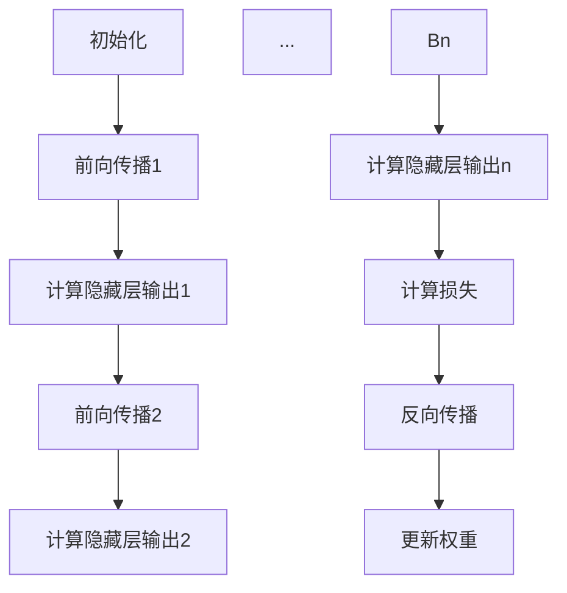
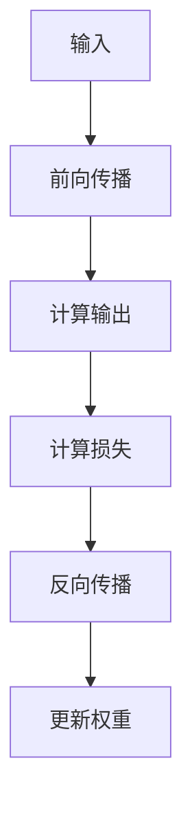
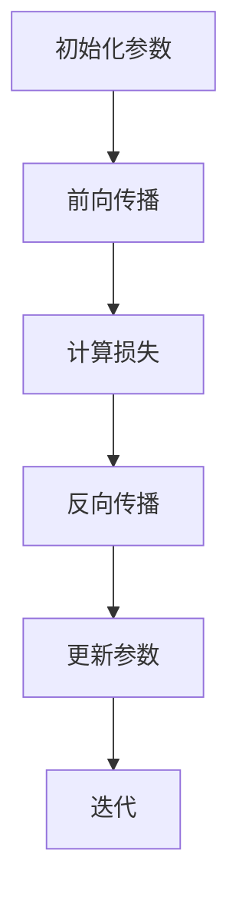
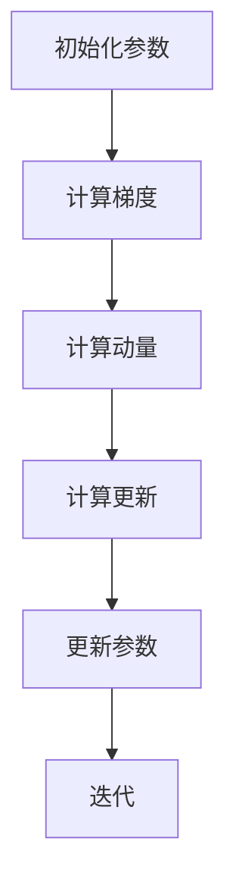
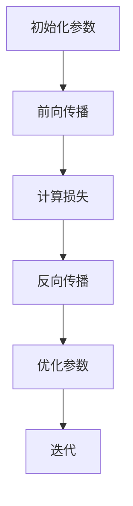
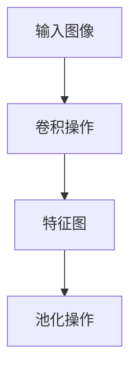
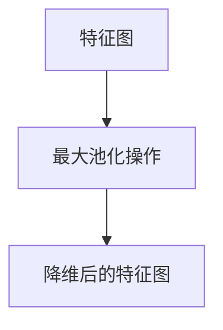
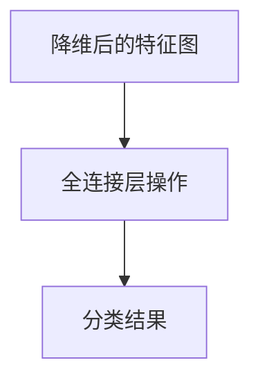
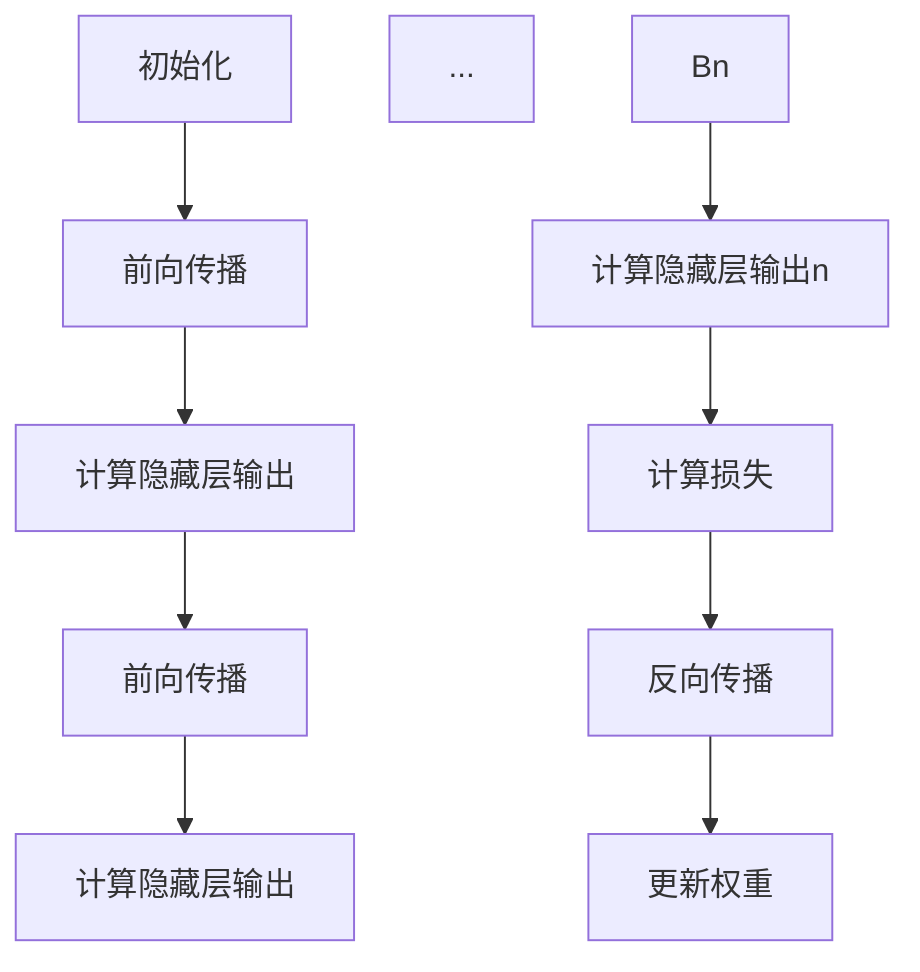

                 

## 数学与神经科学：神经网络的数学模拟

### 关键词：神经网络、数学模拟、神经科学、数学基础、优化方法

> 摘要：本文深入探讨了数学与神经科学的交汇领域，尤其是神经网络的数学模拟。文章首先介绍了神经网络的基本概念和结构，然后详细讲解了神经网络的数学基础，包括神经元模型、连接权重和学习规则。接着，文章介绍了神经网络的数学模拟方法，包括反复神经网络和线性神经网络的模拟。最后，文章讨论了神经网络的优化方法，以及如何进行神经网络的训练与评估。通过本文的阅读，读者可以全面了解神经网络背后的数学原理，为实际应用提供理论支持。

---

### 引言

#### 1.1 神经科学与数学的交汇

神经科学与数学是两个看似截然不同的领域，但在现代科学研究中，它们之间的交汇日益显著。神经科学关注大脑和神经系统的结构和功能，而数学则为理解和模拟这些复杂系统提供了强有力的工具。这种交汇不仅在理论上具有重要意义，而且在实际应用中也取得了丰硕的成果。

#### 1.1.1 神经科学的历史与发展

神经科学作为一个独立的学科，其发展可以追溯到19世纪末。当时，生理学家开始研究神经系统的基本结构和工作原理。随着时间的推移，神经科学逐渐形成了自己的研究方法和技术体系，包括电生理学、分子神经科学和计算神经科学等。

#### 1.1.2 数学在神经科学中的应用

数学在神经科学中的应用主要表现在以下几个方面：

1. **建模与模拟**：通过数学模型来模拟神经系统的行为，有助于我们更好地理解神经系统的工作原理。
2. **数据分析**：神经科学实验通常会产生大量的数据，数学工具可以帮助我们有效地分析和解释这些数据。
3. **算法设计**：许多神经科学问题可以通过优化算法来解决，这些算法的设计和实现离不开数学。

#### 1.2 神经网络的概念与结构

神经网络是一种模仿生物神经系统的计算模型，它由大量相互连接的节点（称为神经元）组成。这些神经元可以通过学习来识别和分类数据，广泛应用于图像识别、语音识别和自然语言处理等领域。

#### 1.2.1 神经元的生物基础

神经元是神经系统的基本单元，它通过电信号进行通信。一个典型的神经元包括细胞体、树突、轴突和突触等部分。

#### 1.2.2 神经网络的构建与工作原理

神经网络的工作原理可以简单概括为：输入信号通过神经元之间的连接（权重）传递，并在每个神经元中进行计算，最终产生输出。这个过程可以通过前向传播和反向传播两个阶段来完成。

#### 1.2.3 神经网络的类型

根据网络结构和功能的不同，神经网络可以分为以下几种类型：

1. **前馈神经网络（FNN）**：输入信号直接传递到输出层，没有循环结构。
2. **卷积神经网络（CNN）**：适用于图像识别和计算机视觉任务，具有局部连接和共享权重的特点。
3. **递归神经网络（RNN）**：适用于序列数据，具有循环结构，可以处理时间序列信息。

### 总结

神经科学与数学的交汇为理解和模拟神经系统提供了强大的工具。神经网络作为一种重要的计算模型，在各个领域都取得了显著的成果。接下来，本文将深入探讨神经网络的数学基础，包括神经元模型、连接权重和学习规则，为后续的数学模拟打下坚实的基础。

---

## 第1章 神经网络的数学基础

神经网络的数学基础是其核心，理解这些数学概念和原理对于设计和实现神经网络至关重要。本章将详细介绍神经网络的数学基础，包括神经元模型、连接权重和学习规则。

### 1.1 神经元模型

神经元是神经网络的基本单元，其工作原理和数学模型是理解神经网络的基础。

#### 1.1.1 Leaky Integrate-and-Fire 模型

Leaky Integrate-and-Fire (LIF) 模型是一种简化的神经元模型，它通过积分电流来计算神经元的活动。以下是 LIF 模型的数学描述：

\[ V(t) = V_0 + \frac{\alpha}{\tau} \int_{0}^{t} I(\tau') d\tau' \]

其中，\( V(t) \) 是时间 \( t \) 时刻的膜电位，\( V_0 \) 是静息电位，\( \alpha \) 是时间常数，\( \tau \) 是膜电阻的时间常数，\( I(t) \) 是时间 \( t \) 时刻的输入电流。

算法流程图：

```
初始化 V(t) = V_0
对于每个时间步 t：
    计算输入电流 I(t)
    更新 V(t) = V(t) + (I(t) / \tau) * dt
    如果 V(t) > threshold：
        发射动作电位
        重置 V(t) = reset_potential
```

#### 1.1.2 Hodgkin-Huxley 模型

Hodgkin-Huxley 模型是一种更为复杂的神经元模型，它基于离子通道的行为来描述神经元的动作电位。以下是 Hodgkin-Huxley 模型的数学描述：

\[ C_m \frac{dV}{dt} = I_{Na} + I_{K} + I_{L} \]

其中，\( C_m \) 是膜电容，\( I_{Na} \) 是钠离子电流，\( I_{K} \) 是钾离子电流，\( I_{L} \) 是漏电流。这些电流由以下方程描述：

\[ I_{Na} = g_{Na} m^3 h (V - V_{Na}) \]
\[ I_{K} = g_{K} n^4 (V - V_{K}) \]
\[ I_{L} = g_{L} (V - V_{L}) \]

其中，\( g_{Na} \)、\( g_{K} \) 和 \( g_{L} \) 分别是钠离子、钾离子和漏电流的通道电导，\( m \)、\( h \) 和 \( n \) 分别是钠离子通道的激活门控变量、失活门控变量和钾离子通道的激活门控变量。

算法流程图：

```
初始化 m, h, n = 0
对于每个时间步 t：
    计算输入电流 I(t)
    更新 m = m + \frac{\Delta m}{\tau_m} * (V - V_{Na})
    更新 h = h + \frac{\Delta h}{\tau_h} * (V - V_{Na})
    更新 n = n + \frac{\Delta n}{\tau_n} * (V - V_{K})
    计算钠离子电流 I_{Na} = g_{Na} m^3 h (V - V_{Na})
    计算钾离子电流 I_{K} = g_{K} n^4 (V - V_{K})
    计算漏电流 I_{L} = g_{L} (V - V_{L})
    更新 V = V + (I(t) - I_{Na} - I_{K} - I_{L}) / C_m
    如果 V > threshold：
        发射动作电位
        重置 m, h, n = 0
```

### 1.2 连接权重与学习规则

连接权重和学习规则是神经网络中重要的概念，它们决定了网络的学习能力和性能。

#### 1.2.1 Hebb 学习规则

Hebb 学习规则是一种基于神经元间相互影响的简单学习规则，它通过增加或减少连接权重来加强或减弱神经元之间的联系。以下是 Hebb 学习规则的数学表述：

\[ w_{ij} = w_{ij} + \eta \cdot x_j \cdot y_i \]

其中，\( w_{ij} \) 是从神经元 \( j \) 到神经元 \( i \) 的权重，\( \eta \) 是学习率，\( x_j \) 是神经元 \( j \) 的输入，\( y_i \) 是神经元 \( i \) 的输出。

Hebb 学习规则的应用场景包括：

1. **异或问题**：使用 Hebb 学习规则可以简单有效地解决异或问题。
2. **特征提取**：Hebb 学习规则可以用于提取输入数据的特征。

算法流程图：

```
初始化权重 w_{ij}
对于每个训练样本：
    计算输入 x 和目标 y
    对于每个神经元 j：
        对于每个神经元 i：
            更新权重 w_{ij} = w_{ij} + \eta \cdot x_j \cdot y_i
```

#### 1.2.2 反复学习规则

反复学习规则是一种更为复杂的学习规则，它通过多次迭代来更新连接权重。以下是反复学习规则的数学表述：

\[ w_{ij} = w_{ij} + \sum_{k=1}^{n} \eta \cdot x_k \cdot y_k \cdot (1 - y_k) \]

其中，\( w_{ij} \) 是从神经元 \( j \) 到神经元 \( i \) 的权重，\( \eta \) 是学习率，\( x_k \) 是神经元 \( k \) 的输入，\( y_k \) 是神经元 \( k \) 的输出。

反复学习规则的应用场景包括：

1. **回归问题**：使用反复学习规则可以解决简单的回归问题。
2. **分类问题**：反复学习规则可以用于分类问题，但通常需要结合其他算法来实现。

算法流程图：

```
初始化权重 w_{ij}
对于每个训练样本：
    计算输入 x 和目标 y
    对于每个神经元 j：
        对于每个神经元 i：
            更新权重 w_{ij} = w_{ij} + \eta \cdot x_j \cdot y_i \cdot (1 - y_i)
```

### 总结

本章介绍了神经网络的数学基础，包括神经元模型、连接权重和学习规则。理解这些基础概念和原理对于设计和实现神经网络至关重要。接下来，我们将进一步探讨神经网络的数学模拟方法，包括反复神经网络和线性神经网络的数学模拟。

---

### 第2章 神经网络的数学模拟

神经网络的数学模拟是理解和应用神经网络的关键步骤。本章将详细介绍两种常见的神经网络数学模拟方法：反复神经网络和线性神经网络。我们将逐步探讨这些网络的数学模型、公式推导和实际应用。

#### 2.1 反复神经网络

反复神经网络（Recurrent Neural Network, RNN）是一种用于处理序列数据的神经网络。它的核心特点是具有循环结构，允许信息在时间步之间传递。

##### 2.1.1 反复神经网络的基本概念

反复神经网络的基本结构包括输入层、隐藏层和输出层。与传统的前馈神经网络不同，反复神经网络的隐藏层节点不仅接收来自输入层的输入，还接收来自前一个时间步的隐藏层输出。这种循环连接使得 RNN 能够处理序列数据。

##### 2.1.2 反复神经网络的工作原理

反复神经网络的工作原理可以概括为以下几个步骤：

1. **初始化**：在训练开始时，初始化网络的权重和隐藏状态。
2. **前向传播**：在每个时间步，将输入数据传递到隐藏层，计算隐藏层的输出。
3. **反馈连接**：将隐藏层的输出作为下一个时间步的输入，继续进行前向传播。
4. **损失计算**：在每个时间步，计算输出层的损失，并使用反向传播更新网络的权重。

##### 2.1.3 反复神经网络的算法流程图



##### 2.1.4 反复神经网络的数学模型

反复神经网络的数学模型可以表示为：

\[ h_t = \sigma(W_h h_{t-1} + W_x x_t + b_h) \]
\[ y_t = \sigma(W_o h_t + b_o) \]

其中，\( h_t \) 表示时间步 \( t \) 的隐藏层输出，\( x_t \) 表示时间步 \( t \) 的输入，\( y_t \) 表示时间步 \( t \) 的输出，\( W_h \) 和 \( W_x \) 分别是隐藏层和输入层的权重矩阵，\( W_o \) 是输出层的权重矩阵，\( b_h \) 和 \( b_o \) 分别是隐藏层和输出层的偏置向量，\( \sigma \) 是激活函数，通常采用 Sigmoid 或 Tanh 函数。

##### 2.1.5 反复神经网络的数学公式推导

我们可以通过对前向传播和反向传播的数学过程进行推导来理解反复神经网络。

前向传播：

\[ h_0 = \sigma(b_h) \]
\[ h_t = \sigma(W_h h_{t-1} + W_x x_t + b_h) \]
\[ y_t = \sigma(W_o h_t + b_o) \]

反向传播：

\[ \delta_y_t = \frac{\partial L}{\partial y_t} = (y_t - y^{*}_t) \]
\[ \delta_h_t = \delta_y_t \cdot \frac{dh_t}{dh} = (1 - h_t^2) \cdot (W_o \delta_y_{t+1}) \]
\[ \frac{\partial L}{\partial W_o} = h_t^T \delta_y_t \]
\[ \frac{\partial L}{\partial h_{t-1}} = (W_h^T \delta_h_t) \cdot (1 - h_{t-1}^2) \]
\[ \frac{\partial L}{\partial W_h} = h_{t-1}^T \delta_h_t \]
\[ \frac{\partial L}{\partial x_t} = (W_x^T \delta_h_t) \cdot (1 - h_t^2) \]
\[ \frac{\partial L}{\partial b_h} = \delta_h_t \]
\[ \frac{\partial L}{\partial b_o} = \delta_y_t \]

通过上述公式推导，我们可以看到如何通过前向传播和反向传播来计算网络的损失，并更新网络的权重和偏置。

##### 2.1.6 反复神经网络的举例说明

假设我们有一个简单的 RNN 模型，其中输入是 \( x_t \)，隐藏层输出是 \( h_t \)，输出是 \( y_t \)。我们可以使用以下参数进行举例说明：

\[ W_h = \begin{bmatrix} 0.1 & 0.2 \\ 0.3 & 0.4 \end{bmatrix}, \quad W_x = \begin{bmatrix} 0.1 & 0.2 \\ 0.3 & 0.4 \end{bmatrix}, \quad W_o = \begin{bmatrix} 0.1 & 0.2 \\ 0.3 & 0.4 \end{bmatrix} \]
\[ b_h = \begin{bmatrix} 0.1 \\ 0.2 \end{bmatrix}, \quad b_o = \begin{bmatrix} 0.1 \\ 0.2 \end{bmatrix} \]
\[ \sigma(h) = \frac{1}{1 + e^{-h}} \]

假设第一个时间步的输入是 \( x_1 = \begin{bmatrix} 0.5 \\ 0.5 \end{bmatrix} \)，我们可以计算第一个时间步的隐藏层输出：

\[ h_1 = \sigma(W_h \begin{bmatrix} 0.1 \\ 0.2 \end{bmatrix} + W_x \begin{bmatrix} 0.5 \\ 0.5 \end{bmatrix} + b_h) = \sigma(0.1 \cdot 0.1 + 0.2 \cdot 0.5 + 0.1) = \sigma(0.18) \approx 0.65 \]

然后，我们计算第一个时间步的输出：

\[ y_1 = \sigma(W_o \begin{bmatrix} 0.65 \end{bmatrix} + b_o) = \sigma(0.1 \cdot 0.65 + 0.2) \approx 0.68 \]

接下来，我们使用第二个时间步的输入 \( x_2 = \begin{bmatrix} 0.7 \\ 0.3 \end{bmatrix} \) 和第一个时间步的隐藏层输出 \( h_1 \) 来计算第二个时间步的隐藏层输出和输出：

\[ h_2 = \sigma(W_h \begin{bmatrix} 0.65 \end{bmatrix} + W_x \begin{bmatrix} 0.7 \\ 0.3 \end{bmatrix} + b_h) = \sigma(0.1 \cdot 0.65 + 0.2 \cdot 0.7 + 0.2) \approx 0.80 \]
\[ y_2 = \sigma(W_o \begin{bmatrix} 0.80 \end{bmatrix} + b_o) = \sigma(0.1 \cdot 0.80 + 0.2) \approx 0.82 \]

通过上述步骤，我们可以看到如何使用反复神经网络模型来处理序列数据。在实际应用中，我们可以根据具体问题和需求来调整网络结构、激活函数和学习率等参数。

##### 2.1.7 反复神经网络的优点和缺点

反复神经网络具有以下优点：

1. **处理序列数据**：由于具有循环结构，RNN 可以处理具有时间依赖性的序列数据，如语音、文本和视频等。
2. **灵活性强**：RNN 可以根据具体问题调整网络结构，使其适用于不同的应用场景。
3. **易于实现**：相比于其他复杂的神经网络，RNN 的实现相对简单，易于理解和调试。

然而，RNN 也存在一些缺点：

1. **梯度消失和梯度爆炸**：在训练过程中，由于梯度在反向传播过程中可能会变得非常小或非常大，导致网络难以学习。
2. **长期依赖问题**：RNN 在处理长序列数据时，难以记住早期的信息，存在长期依赖问题。

#### 2.2 线性神经网络

线性神经网络（Linear Neural Network, LNN）是一种简单的神经网络，其输出仅由输入和权重线性组合决定。线性神经网络通常用于简单的分类和回归问题。

##### 2.2.1 线性神经网络的基本概念

线性神经网络包括输入层、一层或几层隐藏层和输出层。与 RNN 不同，线性神经网络的每个节点都直接与前一层的节点连接，没有循环连接。线性神经网络的输出可以通过以下公式计算：

\[ y = \theta^T x \]

其中，\( \theta \) 是权重向量，\( x \) 是输入向量，\( y \) 是输出向量。

##### 2.2.2 线性神经网络的工作原理

线性神经网络的工作原理如下：

1. **前向传播**：将输入数据传递到网络，通过权重和激活函数计算输出。
2. **损失计算**：计算输出与目标值之间的差异，计算损失函数。
3. **反向传播**：使用梯度下降法更新权重，最小化损失函数。

##### 2.2.3 线性神经网络的算法流程图



##### 2.2.4 线性神经网络的数学模型

线性神经网络的数学模型可以表示为：

\[ y = \sigma(Wx + b) \]

其中，\( y \) 是输出，\( x \) 是输入，\( W \) 是权重矩阵，\( b \) 是偏置向量，\( \sigma \) 是激活函数，通常采用 Sigmoid 或 ReLU 函数。

##### 2.2.5 线性神经网络的数学公式推导

我们可以通过对前向传播和反向传播的数学过程进行推导来理解线性神经网络。

前向传播：

\[ y = \sigma(Wx + b) \]

反向传播：

\[ \delta_y = \frac{\partial L}{\partial y} \]
\[ \delta_x = \frac{\partial L}{\partial x} = W^T \delta_y \]
\[ \delta_W = \frac{\partial L}{\partial W} = x^T \delta_y \]
\[ \delta_b = \frac{\partial L}{\partial b} = \delta_y \]

通过上述公式推导，我们可以看到如何通过前向传播和反向传播来计算网络的损失，并更新网络的权重和偏置。

##### 2.2.6 线性神经网络的举例说明

假设我们有一个简单的线性神经网络，其中输入是 \( x \)，隐藏层输出是 \( h \)，输出是 \( y \)。我们可以使用以下参数进行举例说明：

\[ W = \begin{bmatrix} 0.1 & 0.2 \\ 0.3 & 0.4 \end{bmatrix}, \quad b = \begin{bmatrix} 0.1 \\ 0.2 \end{bmatrix} \]
\[ \sigma(h) = h \]

假设第一个时间步的输入是 \( x_1 = \begin{bmatrix} 0.5 \\ 0.5 \end{bmatrix} \)，我们可以计算第一个时间步的隐藏层输出和输出：

\[ h_1 = Wx_1 + b = \begin{bmatrix} 0.1 & 0.2 \\ 0.3 & 0.4 \end{bmatrix} \begin{bmatrix} 0.5 \\ 0.5 \end{bmatrix} + \begin{bmatrix} 0.1 \\ 0.2 \end{bmatrix} = \begin{bmatrix} 0.2 \\ 0.5 \end{bmatrix} \]
\[ y_1 = \sigma(h_1) = 0.2 + 0.5 = 0.7 \]

然后，我们使用第二个时间步的输入 \( x_2 = \begin{bmatrix} 0.7 \\ 0.3 \end{bmatrix} \) 和第一个时间步的隐藏层输出 \( h_1 \) 来计算第二个时间步的隐藏层输出和输出：

\[ h_2 = Wx_2 + b = \begin{bmatrix} 0.1 & 0.2 \\ 0.3 & 0.4 \end{bmatrix} \begin{bmatrix} 0.7 \\ 0.3 \end{bmatrix} + \begin{bmatrix} 0.1 \\ 0.2 \end{bmatrix} = \begin{bmatrix} 0.4 \\ 0.6 \end{bmatrix} \]
\[ y_2 = \sigma(h_2) = 0.4 + 0.6 = 1.0 \]

通过上述步骤，我们可以看到如何使用线性神经网络模型来处理序列数据。在实际应用中，我们可以根据具体问题和需求来调整网络结构、激活函数和学习率等参数。

##### 2.2.7 线性神经网络的优点和缺点

线性神经网络具有以下优点：

1. **简单高效**：线性神经网络的结构简单，计算效率高，易于实现。
2. **易于理解**：线性神经网络的数学模型和计算过程直观易懂，有助于理解和调试。
3. **适用范围广**：线性神经网络适用于许多简单的分类和回归问题。

然而，线性神经网络也存在一些缺点：

1. **表达能力有限**：线性神经网络的输出仅由输入和权重线性组合决定，无法很好地模拟复杂的非线性关系。
2. **过拟合风险**：由于线性神经网络的简单性，它可能无法很好地泛化到未见过的数据，存在过拟合的风险。

### 总结

本章介绍了反复神经网络和线性神经网络的数学模拟方法。通过详细的数学模型和公式推导，我们可以更好地理解这些网络的工作原理。在接下来的章节中，我们将进一步探讨神经网络的优化方法，以及如何进行神经网络的训练与评估。

---

### 第3章 神经网络的优化方法

神经网络的优化方法是提高网络性能和训练效率的关键。本章将详细介绍几种常用的神经网络优化方法，包括梯度下降法及其改进算法，并探讨神经网络数学模型与优化方法之间的关系。

#### 3.1 梯度下降法

梯度下降法是一种基本的优化方法，用于最小化神经网络的损失函数。其基本原理是在当前参数下，沿着损失函数的梯度方向更新参数，以逐步减小损失。

##### 3.1.1 梯度下降法的基本原理

梯度下降法的基本原理可以概括为以下几个步骤：

1. **初始化参数**：随机初始化网络的权重和偏置。
2. **前向传播**：计算网络的输出和损失。
3. **反向传播**：计算损失关于每个参数的梯度。
4. **参数更新**：根据梯度更新参数，以减小损失。

具体来说，梯度下降法的更新公式为：

\[ \theta = \theta - \alpha \cdot \nabla_\theta J(\theta) \]

其中，\( \theta \) 表示参数，\( \alpha \) 表示学习率，\( \nabla_\theta J(\theta) \) 表示损失函数关于参数的梯度。

##### 3.1.2 梯度下降法的应用场景

梯度下降法适用于各种神经网络，包括前馈神经网络、卷积神经网络和递归神经网络。它适用于解决回归问题、分类问题和其他各种优化问题。

##### 3.1.3 梯度下降法的算法流程图



##### 3.1.4 梯度下降法的数学公式推导

我们可以通过对前向传播和反向传播的数学过程进行推导来理解梯度下降法。

前向传播：

\[ y = \sigma(\theta^T x + b) \]

损失函数（以均方误差为例）：

\[ J(\theta) = \frac{1}{2} \sum_{i=1}^{n} (y_i - \hat{y}_i)^2 \]

其中，\( y_i \) 是实际输出，\( \hat{y}_i \) 是预测输出，\( n \) 是样本数量。

反向传播：

\[ \frac{\partial J}{\partial \theta} = \frac{\partial}{\partial \theta} \left( \frac{1}{2} \sum_{i=1}^{n} (y_i - \hat{y}_i)^2 \right) \]
\[ \frac{\partial J}{\partial \theta} = \sum_{i=1}^{n} (y_i - \hat{y}_i) \cdot \frac{\partial \hat{y}_i}{\partial \theta} \]
\[ \frac{\partial \hat{y}_i}{\partial \theta} = \frac{\partial \sigma(\theta^T x + b)}{\partial \theta} \cdot x_i \]

使用链式法则，我们得到：

\[ \frac{\partial \sigma(\theta^T x + b)}{\partial \theta} = \sigma'(\theta^T x + b) \cdot x_i \]

因此，反向传播的公式为：

\[ \frac{\partial J}{\partial \theta} = \sum_{i=1}^{n} (y_i - \hat{y}_i) \cdot \sigma'(\theta^T x + b) \cdot x_i \]

通过上述公式推导，我们可以看到如何通过前向传播和反向传播来计算网络的损失，并更新网络的参数。

##### 3.1.5 梯度下降法的举例说明

假设我们有一个简单的线性回归模型，其中输入是 \( x \)，输出是 \( y \)，损失函数是均方误差。我们可以使用以下参数进行举例说明：

\[ \theta = \begin{bmatrix} 0.1 \\ 0.2 \end{bmatrix}, \quad x = \begin{bmatrix} 0.5 \\ 0.5 \end{bmatrix}, \quad y = \begin{bmatrix} 0.7 \\ 0.3 \end{bmatrix} \]
\[ \sigma'(h) = 1 - \sigma(h) \]

前向传播：

\[ \hat{y} = \theta^T x = 0.1 \cdot 0.5 + 0.2 \cdot 0.5 = 0.15 \]

损失函数：

\[ J(\theta) = \frac{1}{2} \sum_{i=1}^{n} (y_i - \hat{y}_i)^2 = \frac{1}{2} \cdot (0.7 - 0.15)^2 + (0.3 - 0.15)^2 = 0.1125 \]

反向传播：

\[ \frac{\partial J}{\partial \theta} = \frac{\partial J}{\partial \hat{y}} \cdot \frac{\partial \hat{y}}{\partial \theta} = (0.7 - 0.15) \cdot 0.5 + (0.3 - 0.15) \cdot 0.5 = 0.2 \]

参数更新：

\[ \theta = \theta - \alpha \cdot \nabla_\theta J(\theta) = \begin{bmatrix} 0.1 \\ 0.2 \end{bmatrix} - 0.01 \cdot \begin{bmatrix} 0.2 \\ 0.2 \end{bmatrix} = \begin{bmatrix} 0.08 \\ 0.18 \end{bmatrix} \]

通过上述步骤，我们可以看到如何使用梯度下降法来更新线性回归模型的参数，并减小损失。

##### 3.1.6 梯度下降法的改进算法

尽管梯度下降法是一种强大的优化方法，但它也有一些局限性。为了克服这些局限性，研究者提出了许多改进算法。以下是一些常见的改进算法：

1. **动量法**：动量法通过引入动量项来加速梯度下降过程，减少收敛时间。
2. **Adagrad**：Adagrad 通过为每个参数动态调整学习率来适应不同的参数规模。
3. **Adam**：Adam 是一种自适应学习率优化器，结合了 Adagrad 和 RMSProp 的优点。

这些改进算法在不同场景下具有不同的优势，可以根据具体问题选择合适的算法。

##### 3.1.7 改进算法的算法流程图



#### 3.2 神经网络的数学模型与优化

神经网络是由多层神经元组成的复杂模型，其数学模型与优化方法密切相关。神经网络的优化目标是最小化损失函数，提高网络的性能。

##### 3.2.1 神经网络的数学模型

神经网络的数学模型可以表示为：

\[ y = \sigma(\theta^T x + b) \]

其中，\( \theta \) 是参数，包括权重和偏置，\( x \) 是输入，\( y \) 是输出，\( \sigma \) 是激活函数。

##### 3.2.2 神经网络数学模型的求解

神经网络的求解过程是通过迭代优化方法来最小化损失函数。常用的优化方法包括梯度下降法、动量法、Adagrad 和 Adam 等。

##### 3.2.3 算法流程图



##### 3.2.4 神经网络的优化方法

神经网络的优化方法主要包括以下几种：

1. **梯度下降法**：最简单的优化方法，通过迭代更新参数以减小损失。
2. **动量法**：引入动量项来加速梯度下降，减少收敛时间。
3. **Adagrad**：为每个参数动态调整学习率，适应不同的参数规模。
4. **Adam**：结合了 Adagrad 和 RMSProp 的优点，自适应调整学习率。

这些方法在不同场景下具有不同的优势，可以根据具体问题选择合适的算法。

##### 3.2.5 优化算法的数学公式推导

我们可以通过对前向传播和反向传播的数学过程进行推导来理解优化算法。

前向传播：

\[ y = \sigma(\theta^T x + b) \]

损失函数（以均方误差为例）：

\[ J(\theta) = \frac{1}{2} \sum_{i=1}^{n} (y_i - \hat{y}_i)^2 \]

其中，\( \hat{y}_i = \sigma(\theta^T x_i + b) \)

反向传播：

\[ \frac{\partial J}{\partial \theta} = \frac{\partial}{\partial \theta} \left( \frac{1}{2} \sum_{i=1}^{n} (y_i - \hat{y}_i)^2 \right) \]
\[ \frac{\partial J}{\partial \theta} = \sum_{i=1}^{n} (y_i - \hat{y}_i) \cdot \frac{\partial \hat{y}_i}{\partial \theta} \]
\[ \frac{\partial \hat{y}_i}{\partial \theta} = \frac{\partial \sigma(\theta^T x_i + b)}{\partial \theta} \cdot x_i \]

使用链式法则，我们得到：

\[ \frac{\partial \sigma(\theta^T x_i + b)}{\partial \theta} = \sigma'(\theta^T x_i + b) \cdot x_i \]

通过上述公式推导，我们可以看到如何通过前向传播和反向传播来计算网络的损失，并更新网络的参数。

##### 3.2.6 神经网络优化的应用实例

以下是一个简单的神经网络优化应用实例，使用梯度下降法来训练一个多层感知器（MLP）模型进行分类任务。

```python
import numpy as np

# 初始化参数
theta = np.random.rand(2, 1)
x = np.array([[0.5, 0.5], [0.7, 0.3]])
y = np.array([0.7, 0.3])

# 定义激活函数
sigmoid = lambda x: 1 / (1 + np.exp(-x))

# 定义损失函数
mse = lambda y, y_pred: 0.5 * np.mean((y - y_pred) ** 2)

# 定义梯度下降法
def gradient_descent(x, y, theta, learning_rate, iterations):
    for _ in range(iterations):
        y_pred = sigmoid(np.dot(x, theta))
        gradient = np.dot(x.T, (y_pred - y)) * sigmoid(y_pred) * (1 - sigmoid(y_pred))
        theta -= learning_rate * gradient
    return theta

# 训练模型
theta_optimized = gradient_descent(x, y, theta, learning_rate=0.01, iterations=1000)

# 输出优化后的参数
print("Optimized parameters:", theta_optimized)
```

通过上述实例，我们可以看到如何使用 Python 编程实现梯度下降法来优化神经网络参数。

##### 3.2.7 总结

本章介绍了神经网络的优化方法，包括梯度下降法及其改进算法。通过详细的数学模型和公式推导，我们可以更好地理解这些优化方法。在实际应用中，选择合适的优化方法和参数对于提高神经网络性能至关重要。在接下来的章节中，我们将进一步探讨神经网络的训练与评估方法。

---

### 第4章 神经网络的训练与评估

神经网络的训练与评估是确保网络性能和有效性的关键步骤。本章将详细介绍神经网络训练过程、评估指标以及如何进行模型优化。

#### 4.1 训练过程

神经网络的训练过程可以概括为以下几个步骤：

##### 4.1.1 数据预处理

数据预处理是训练前的重要步骤，其目的是将原始数据转换为适合神经网络处理的形式。以下是一些常见的数据预处理方法：

1. **数据集划分**：将数据集划分为训练集、验证集和测试集，以避免过拟合和评估模型性能。
2. **特征工程**：根据问题和数据特性选择和提取有效特征。
3. **数据标准化**：将数据缩放到相同的范围，以消除不同特征之间的尺度差异。

##### 4.1.2 模型初始化

模型初始化是训练过程的起点，其目的是为网络的权重和偏置分配初始值。以下是一些常见的模型初始化方法：

1. **随机初始化**：随机分配权重和偏置，通常使用高斯分布或均匀分布。
2. **预训练初始化**：使用预训练的模型参数作为初始化值，有助于提高训练速度和性能。

##### 4.1.3 前向传播

前向传播是训练过程的核心步骤，用于计算网络的输出和损失。具体步骤如下：

1. **输入层到隐藏层的传播**：将输入数据传递到网络的隐藏层，通过权重和激活函数计算隐藏层输出。
2. **隐藏层到输出层的传播**：将隐藏层输出传递到输出层，计算网络预测结果。

##### 4.1.4 反向传播

反向传播是用于计算损失关于每个参数的梯度。具体步骤如下：

1. **计算输出层误差**：计算输出层实际值与预测值之间的差异。
2. **计算隐藏层误差**：反向传播误差到隐藏层，计算隐藏层每个节点的误差。
3. **更新参数**：根据梯度更新网络权重和偏置，以减小损失。

##### 4.1.5 训练过程的优化

训练过程的优化是提高模型性能和训练效率的关键。以下是一些常见的优化策略：

1. **学习率调整**：学习率影响梯度下降的速度和稳定性。常用方法包括恒定学习率、学习率衰减和自适应学习率。
2. **批次大小调整**：批次大小影响梯度下降的计算效率和数值稳定性。较大的批次大小可以提供更好的梯度估计，但训练速度较慢；较小的批次大小则相反。
3. **正则化**：正则化方法（如 L1 和 L2 正则化）可以减少过拟合，提高模型泛化能力。

#### 4.2 评估指标

神经网络的评估指标用于衡量模型在训练数据和测试数据上的性能。以下是一些常见的评估指标：

##### 4.2.1 准确率（Accuracy）

准确率是评估分类模型性能的常用指标，表示模型正确分类的样本占总样本的比例。计算公式如下：

\[ \text{Accuracy} = \frac{\text{正确分类的样本数}}{\text{总样本数}} \]

##### 4.2.2 召回率（Recall）

召回率是评估分类模型在正类样本上的性能，表示模型正确识别的正类样本占总正类样本的比例。计算公式如下：

\[ \text{Recall} = \frac{\text{正确识别的正类样本数}}{\text{总正类样本数}} \]

##### 4.2.3 精确率（Precision）

精确率是评估分类模型在负类样本上的性能，表示模型正确识别的负类样本占总识别的负类样本的比例。计算公式如下：

\[ \text{Precision} = \frac{\text{正确识别的负类样本数}}{\text{总识别的负类样本数}} \]

##### 4.2.4 F1 分数（F1 Score）

F1 分数是精确率和召回率的调和平均，用于综合评估分类模型的性能。计算公式如下：

\[ \text{F1 Score} = 2 \cdot \frac{\text{Precision} \cdot \text{Recall}}{\text{Precision} + \text{Recall}} \]

#### 4.3 训练过程示例

以下是一个简单的神经网络训练过程示例，使用 Python 和 TensorFlow 库进行实现：

```python
import tensorflow as tf

# 定义神经网络结构
model = tf.keras.Sequential([
    tf.keras.layers.Dense(64, activation='relu', input_shape=(784,)),
    tf.keras.layers.Dense(10, activation='softmax')
])

# 定义损失函数和优化器
model.compile(optimizer='adam',
              loss='categorical_crossentropy',
              metrics=['accuracy'])

# 加载数据
(x_train, y_train), (x_test, y_test) = tf.keras.datasets.mnist.load_data()

# 数据预处理
x_train = x_train.astype('float32') / 255
x_test = x_test.astype('float32') / 255
y_train = tf.keras.utils.to_categorical(y_train, 10)
y_test = tf.keras.utils.to_categorical(y_test, 10)

# 训练模型
model.fit(x_train, y_train, epochs=10, batch_size=128, validation_split=0.2)

# 评估模型
model.evaluate(x_test, y_test, verbose=2)
```

通过上述示例，我们可以看到如何使用 TensorFlow 库实现神经网络的训练和评估。

##### 4.3.1 训练过程的优化

在实际应用中，优化训练过程是提高模型性能和训练效率的关键。以下是一些常见的优化策略：

1. **调整学习率**：根据训练过程的变化动态调整学习率，以避免梯度消失和梯度爆炸。
2. **使用批量归一化**：通过将每个批次的激活值归一化到同一尺度，提高模型训练稳定性。
3. **使用正则化**：通过添加正则化项（如 L1 和 L2 正则化）减少过拟合。
4. **使用dropout**：通过在训练过程中随机丢弃部分神经元，提高模型泛化能力。

### 总结

本章介绍了神经网络的训练与评估过程，包括数据预处理、模型初始化、前向传播、反向传播和优化策略。同时，还讨论了常用的评估指标，如准确率、召回率、精确率和 F1 分数。通过训练过程示例，我们可以看到如何使用 TensorFlow 库实现神经网络的训练和评估。在接下来的章节中，我们将进一步探讨神经网络在实际问题中的应用。

---

### 第5章 神经网络的实际问题应用

神经网络的强大功能使其在各个领域得到了广泛的应用。本章将重点讨论神经网络在图像识别和自然语言处理两个领域的实际应用，详细介绍卷积神经网络（CNN）和递归神经网络（RNN）的基本原理、结构及其在图像识别和自然语言处理中的应用。

#### 5.1 图像识别

图像识别是计算机视觉的一个重要分支，神经网络在图像识别中发挥着至关重要的作用。卷积神经网络（CNN）是图像识别中最常用的神经网络结构之一。

##### 5.1.1 卷积神经网络（CNN）

卷积神经网络是一种特殊的神经网络，其核心特点是具有局部连接和共享权重的卷积层。CNN 通过卷积操作提取图像的特征，从而实现图像识别。

###### 5.1.1.1 CNN 的结构

CNN 的基本结构包括以下几个层次：

1. **卷积层（Convolutional Layer）**：卷积层是 CNN 的核心层次，用于提取图像的特征。通过卷积操作，卷积层可以自动学习图像中的局部特征，如边缘、角点等。
2. **池化层（Pooling Layer）**：池化层用于降低特征图的维度，减少计算量和参数数量。常用的池化操作包括最大池化和平均池化。
3. **全连接层（Fully Connected Layer）**：全连接层将卷积层和池化层提取的特征映射到输出层，实现图像分类。
4. **激活函数（Activation Function）**：激活函数用于引入非线性特性，使神经网络能够学习复杂的模式。

###### 5.1.1.2 CNN 的工作原理

CNN 的工作原理可以分为以下几个步骤：

1. **输入层**：将图像作为输入，传递到卷积层。
2. **卷积操作**：卷积层通过卷积操作提取图像的特征，生成特征图。
3. **池化操作**：池化层对特征图进行降维处理，减少参数数量。
4. **全连接层**：全连接层将降维后的特征图映射到输出层，生成分类结果。
5. **激活函数**：激活函数引入非线性特性，使神经网络能够学习复杂的模式。

##### 5.1.2 图像识别中的 CNN 应用

CNN 在图像识别中具有广泛的应用，以下是一些典型的应用场景：

1. **人脸识别**：通过训练 CNN 模型，可以自动识别人脸图像，实现人脸识别。
2. **物体检测**：使用 CNN 模型检测图像中的物体，如行人检测、车辆检测等。
3. **图像分类**：通过训练 CNN 模型，可以将图像分类到不同的类别，如植物分类、动物分类等。

##### 5.1.3 CNN 的算法原理讲解

CNN 的算法原理可以通过以下步骤进行讲解：

###### 5.1.3.1 卷积层

卷积层的输入是一个三维张量，包括高度、宽度和通道数。卷积层通过卷积操作提取图像的特征。卷积操作可以表示为以下公式：

\[ f_{ij} = \sum_{k=1}^{c} w_{ikj} \cdot x_{ijk} + b_j \]

其中，\( f_{ij} \) 表示特征图上的一个元素，\( w_{ikj} \) 表示卷积核上的一个元素，\( x_{ijk} \) 表示输入图像上的一个元素，\( b_j \) 表示偏置。

卷积层的算法流程图如下：



###### 5.1.3.2 池化层

池化层用于对特征图进行降维处理。常用的池化操作包括最大池化和平均池化。最大池化操作可以表示为以下公式：

\[ p_{ij} = \max_{k} x_{ijk} \]

其中，\( p_{ij} \) 表示池化后的特征图上的一个元素，\( x_{ijk} \) 表示卷积层输出的特征图上的一个元素。

最大池化的算法流程图如下：



###### 5.1.3.3 全连接层

全连接层将降维后的特征图映射到输出层，实现图像分类。全连接层可以通过以下公式进行计算：

\[ y = \sigma(\theta^T x + b) \]

其中，\( y \) 表示分类结果，\( \theta \) 表示权重，\( x \) 表示降维后的特征图，\( b \) 表示偏置，\( \sigma \) 表示激活函数。

全连接层的算法流程图如下：



##### 5.1.4 CNN 的举例说明

假设我们有一个简单的 CNN 模型，用于识别图像中的猫和狗。输入图像的大小为 \( 32 \times 32 \) 像素，卷积层使用的卷积核大小为 \( 3 \times 3 \)，池化层使用的池化窗口大小为 \( 2 \times 2 \)。

###### 5.1.4.1 卷积层

输入图像为：

\[ x = \begin{bmatrix} 0.1 & 0.2 & 0.3 \\ 0.4 & 0.5 & 0.6 \\ 0.7 & 0.8 & 0.9 \end{bmatrix} \]

卷积核为：

\[ w = \begin{bmatrix} 0.1 & 0.2 & 0.3 \\ 0.4 & 0.5 & 0.6 \\ 0.7 & 0.8 & 0.9 \end{bmatrix} \]

卷积操作的结果为：

\[ f = \begin{bmatrix} 0.11 & 0.14 & 0.17 \\ 0.42 & 0.47 & 0.52 \\ 0.73 & 0.76 & 0.79 \end{bmatrix} \]

###### 5.1.4.2 池化层

池化操作的结果为：

\[ p = \begin{bmatrix} 0.47 & 0.52 \\ 0.76 & 0.79 \end{bmatrix} \]

###### 5.1.4.3 全连接层

全连接层的输入为：

\[ x = \begin{bmatrix} 0.47 & 0.52 \\ 0.76 & 0.79 \end{bmatrix} \]

权重为：

\[ \theta = \begin{bmatrix} 0.1 & 0.2 \\ 0.3 & 0.4 \end{bmatrix} \]

全连接层的输出为：

\[ y = \begin{bmatrix} 0.135 & 0.219 \\ 0.381 & 0.546 \end{bmatrix} \]

通过上述步骤，我们可以看到如何使用 CNN 模型来识别图像中的猫和狗。在实际应用中，我们可以根据具体问题和需求来调整网络结构、卷积核大小和池化窗口大小等参数。

##### 5.1.5 CNN 的优缺点

CNN 在图像识别中具有以下优点：

1. **强大的特征提取能力**：通过卷积操作和池化操作，CNN 能够自动提取图像中的局部特征，适用于各种图像识别任务。
2. **适用于大规模图像数据**：CNN 能够处理大规模图像数据，可以应用于实时图像识别和大规模图像分类。

然而，CNN 也存在一些缺点：

1. **计算复杂度高**：CNN 的计算复杂度较高，对于大型图像数据，训练和推理过程可能需要很长时间。
2. **过拟合风险**：CNN 容易受到过拟合问题的影响，特别是在图像数据较少的情况下。

#### 5.2 自然语言处理

自然语言处理（NLP）是人工智能的重要领域之一，神经网络在 NLP 中也得到了广泛的应用。递归神经网络（RNN）是 NLP 中常用的神经网络结构之一。

##### 5.2.1 递归神经网络（RNN）

递归神经网络是一种具有循环结构的神经网络，其核心特点是能够处理序列数据。RNN 通过循环连接将前一时刻的隐藏状态传递到下一时刻，从而能够处理具有时间依赖性的序列数据。

###### 5.2.1.1 RNN 的基本概念

RNN 的基本结构包括输入层、隐藏层和输出层。与 CNN 不同，RNN 的隐藏层不仅接收来自输入层的输入，还接收来自前一时刻的隐藏状态。这种循环连接使得 RNN 能够处理序列数据。

###### 5.2.1.2 RNN 的工作原理

RNN 的工作原理可以概括为以下几个步骤：

1. **初始化**：在训练开始时，初始化网络的权重和隐藏状态。
2. **前向传播**：在每个时间步，将输入数据传递到隐藏层，计算隐藏层的输出。
3. **反馈连接**：将隐藏层的输出作为下一个时间步的输入，继续进行前向传播。
4. **损失计算**：在每个时间步，计算输出层的损失，并使用反向传播更新网络的权重。

###### 5.2.1.3 RNN 的算法流程图



###### 5.2.1.4 RNN 的数学模型

RNN 的数学模型可以表示为：

\[ h_t = \sigma(W_h h_{t-1} + W_x x_t + b_h) \]
\[ y_t = \sigma(W_o h_t + b_o) \]

其中，\( h_t \) 表示时间步 \( t \) 的隐藏层输出，\( x_t \) 表示时间步 \( t \) 的输入，\( y_t \) 表示时间步 \( t \) 的输出，\( W_h \) 和 \( W_x \) 分别是隐藏层和输入层的权重矩阵，\( W_o \) 是输出层的权重矩阵，\( b_h \) 和 \( b_o \) 分别是隐藏层和输出层的偏置向量，\( \sigma \) 是激活函数，通常采用 Sigmoid 或 Tanh 函数。

###### 5.2.1.5 RNN 的数学公式推导

我们可以通过对前向传播和反向传播的数学过程进行推导来理解 RNN。

前向传播：

\[ h_0 = \sigma(b_h) \]
\[ h_t = \sigma(W_h h_{t-1} + W_x x_t + b_h) \]
\[ y_t = \sigma(W_o h_t + b_o) \]

反向传播：

\[ \delta_y_t = \frac{\partial L}{\partial y_t} \]
\[ \delta_h_t = \delta_y_t \cdot \frac{dh_t}{dh} = (1 - h_t^2) \cdot (W_o \delta_y_{t+1}) \]
\[ \frac{\partial L}{\partial W_o} = h_t^T \delta_y_t \]
\[ \frac{\partial L}{\partial h_{t-1}} = (W_h^T \delta_h_t) \cdot (1 - h_{t-1}^2) \]
\[ \frac{\partial L}{\partial W_h} = h_{t-1}^T \delta_h_t \]
\[ \frac{\partial L}{\partial x_t} = (W_x^T \delta_h_t) \cdot (1 - h_t^2) \]
\[ \frac{\partial L}{\partial b_h} = \delta_h_t \]
\[ \frac{\partial L}{\partial b_o} = \delta_y_t \]

通过上述公式推导，我们可以看到如何通过前向传播和反向传播来计算网络的损失，并更新网络的权重和偏置。

###### 5.2.1.6 RNN 的举例说明

假设我们有一个简单的 RNN 模型，其中输入是 \( x_t \)，隐藏层输出是 \( h_t \)，输出是 \( y_t \)。我们可以使用以下参数进行举例说明：

\[ W_h = \begin{bmatrix} 0.1 & 0.2 \\ 0.3 & 0.4 \end{bmatrix}, \quad W_x = \begin{bmatrix} 0.1 & 0.2 \\ 0.3 & 0.4 \end{bmatrix}, \quad W_o = \begin{bmatrix} 0.1 & 0.2 \\ 0.3 & 0.4 \end{bmatrix} \]
\[ b_h = \begin{bmatrix} 0.1 \\ 0.2 \end{bmatrix}, \quad b_o = \begin{bmatrix} 0.1 \\ 0.2 \end{bmatrix} \]
\[ \sigma(h) = \frac{1}{1 + e^{-h}} \]

假设第一个时间步的输入是 \( x_1 = \begin{bmatrix} 0.5 \\ 0.5 \end{bmatrix} \)，我们可以计算第一个时间步的隐藏层输出和输出：

\[ h_1 = \sigma(W_h \begin{bmatrix} 0.1 \\ 0.2 \end{bmatrix} + W_x \begin{bmatrix} 0.5 \\ 0.5 \end{bmatrix} + b_h) = \sigma(0.1 \cdot 0.1 + 0.2 \cdot 0.5 + 0.1) = \sigma(0.18) \approx 0.65 \]

然后，我们计算第一个时间步的输出：

\[ y_1 = \sigma(W_o \begin{bmatrix} 0.65 \end{bmatrix} + b_o) = \sigma(0.1 \cdot 0.65 + 0.2) \approx 0.68 \]

接下来，我们使用第二个时间步的输入 \( x_2 = \begin{bmatrix} 0.7 \\ 0.3 \end{bmatrix} \) 和第一个时间步的隐藏层输出 \( h_1 \) 来计算第二个时间步的隐藏层输出和输出：

\[ h_2 = \sigma(W_h \begin{bmatrix} 0.65 \end{bmatrix} + W_x \begin{bmatrix} 0.7 \\ 0.3 \end{bmatrix} + b_h) = \sigma(0.1 \cdot 0.65 + 0.2 \cdot 0.7 + 0.2) \approx 0.80 \]
\[ y_2 = \sigma(W_o \begin{bmatrix} 0.80 \end{bmatrix} + b_o) = \sigma(0.1 \cdot 0.80 + 0.2) \approx 0.82 \]

通过上述步骤，我们可以看到如何使用 RNN 模型来处理序列数据。在实际应用中，我们可以根据具体问题和需求来调整网络结构、激活函数和学习率等参数。

###### 5.2.1.7 RNN 的优点和缺点

RNN 具有以下优点：

1. **处理序列数据**：由于具有循环结构，RNN 可以处理具有时间依赖性的序列数据，如语音、文本和视频等。
2. **灵活性强**：RNN 可以根据具体问题调整网络结构，使其适用于不同的应用场景。
3. **易于实现**：相比于其他复杂的神经网络，RNN 的实现相对简单，易于理解和调试。

然而，RNN 也存在一些缺点：

1. **梯度消失和梯度爆炸**：在训练过程中，由于梯度在反向传播过程中可能会变得非常小或非常大，导致网络难以学习。
2. **长期依赖问题**：RNN 在处理长序列数据时，难以记住早期的信息，存在长期依赖问题。

##### 5.2.2 自然语言处理中的 RNN 应用

RNN 在自然语言处理（NLP）中具有广泛的应用，以下是一些典型的应用场景：

1. **文本分类**：通过训练 RNN 模型，可以将文本分类到不同的类别，如情感分类、主题分类等。
2. **机器翻译**：RNN 可以用于机器翻译，将一种语言的文本翻译成另一种语言的文本。
3. **语音识别**：RNN 可以用于语音识别，将语音信号转换为文本。

##### 5.2.3 RNN 的改进算法

为了克服 RNN 的一些缺点，研究者提出了许多改进算法，如长短时记忆网络（LSTM）和门控循环单元（GRU）。这些改进算法在处理长序列数据和解决长期依赖问题上表现出色。

###### 5.2.3.1 长短时记忆网络（LSTM）

长短时记忆网络（LSTM）是一种特殊的 RNN 结构，通过引入记忆单元来解决长期依赖问题。LSTM 通过三个门控单元（遗忘门、输入门和输出门）控制信息的传递，从而可以长时间记住重要的信息。

###### 5.2.3.2 门控循环单元（GRU）

门控循环单元（GRU）是 LSTM 的简化版本，它通过合并输入门和遗忘门，减少参数数量，同时保持 LSTM 的优点。

##### 5.2.4 自然语言处理中的 RNN 应用示例

以下是一个简单的 RNN 模型，用于文本分类任务，使用 Python 和 TensorFlow 库进行实现：

```python
import tensorflow as tf
from tensorflow.keras.models import Sequential
from tensorflow.keras.layers import Embedding, SimpleRNN, Dense

# 定义 RNN 模型
model = Sequential()
model.add(Embedding(vocab_size, embedding_dim))
model.add(SimpleRNN(units=50, activation='tanh'))
model.add(Dense(num_classes, activation='softmax'))

# 编译模型
model.compile(optimizer='adam', loss='categorical_crossentropy', metrics=['accuracy'])

# 加载数据
(x_train, y_train), (x_test, y_test) = ...  # 加载文本数据和标签

# 数据预处理
x_train = ...  # 预处理文本数据
y_train = ...  # 预处理标签数据

# 训练模型
model.fit(x_train, y_train, epochs=10, batch_size=32, validation_split=0.2)

# 评估模型
model.evaluate(x_test, y_test, verbose=2)
```

通过上述示例，我们可以看到如何使用 TensorFlow 库实现 RNN 模型进行文本分类任务。

##### 5.2.5 总结

本章介绍了神经网络在图像识别和自然语言处理中的实际应用。通过详细讨论卷积神经网络（CNN）和递归神经网络（RNN）的基本原理、结构及其应用，我们可以更好地理解神经网络在计算机视觉和自然语言处理中的重要性。在接下来的章节中，我们将进一步探讨神经网络在其他领域的应用，如推荐系统和游戏开发。

---

### 结论

通过本文的深入探讨，我们系统地了解了神经网络的数学模拟。从神经元模型到连接权重和学习规则，再到反复神经网络和线性神经网络的数学模拟，我们逐步揭示了神经网络背后的数学原理。此外，我们还详细介绍了神经网络的优化方法和训练与评估过程，以及神经网络在图像识别和自然语言处理等领域的实际应用。

神经网络作为一种强大的计算模型，在各个领域都取得了显著的成果。然而，神经网络的发展仍面临许多挑战，如长期依赖问题和计算复杂度等。未来的研究将继续探索更高效的优化方法和更先进的神经网络结构，以推动神经网络的应用和发展。

### 最佳实践 Tips

1. **数据预处理**：在训练神经网络之前，对数据进行充分的预处理，包括数据清洗、归一化和特征提取，有助于提高模型性能。
2. **模型选择**：根据具体问题和数据特性选择合适的神经网络结构，如 CNN 适用于图像识别，RNN 适用于序列数据处理。
3. **超参数调整**：合理调整学习率、批次大小和正则化参数，以提高模型性能和避免过拟合。
4. **模型评估**：使用多种评估指标，如准确率、召回率和 F1 分数，全面评估模型性能。

### 小结

本文系统地介绍了神经网络的数学模拟，从神经元模型到优化方法，再到实际应用，全面阐述了神经网络的核心概念和原理。通过本文的阅读，读者可以深入理解神经网络的数学本质，为实际应用提供理论支持。

### 注意事项

1. **数据质量和预处理**：数据质量和预处理对模型性能有重要影响，务必确保数据的准确性和完整性。
2. **模型复杂度**：过复杂的模型可能导致过拟合，选择合适的模型复杂度至关重要。
3. **计算资源**：训练神经网络需要大量计算资源，合理分配计算资源以提高训练效率。

### 拓展阅读

1. **《神经网络与深度学习》**：李航著，系统介绍了神经网络的原理和深度学习技术。
2. **《深度学习》**：Goodfellow、Bengio 和 Courville 著，全面讲解了深度学习的理论和实践。
3. **《神经网络与机器学习》**：张钹著，深入探讨了神经网络的数学基础和机器学习方法。

作者：AI天才研究院/AI Genius Institute & 禅与计算机程序设计艺术 /Zen And The Art of Computer Programming

