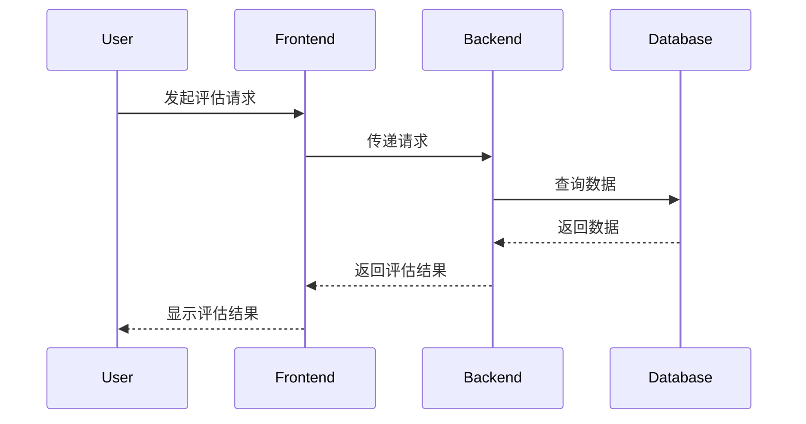
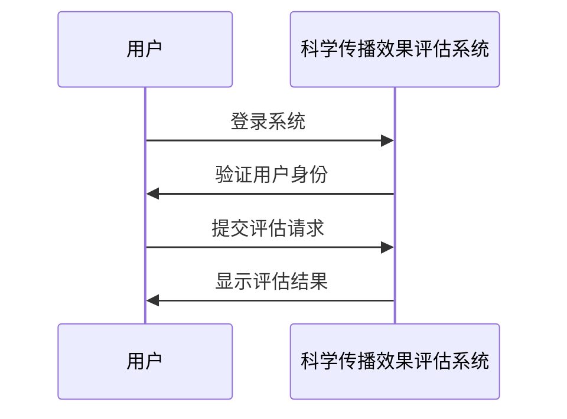
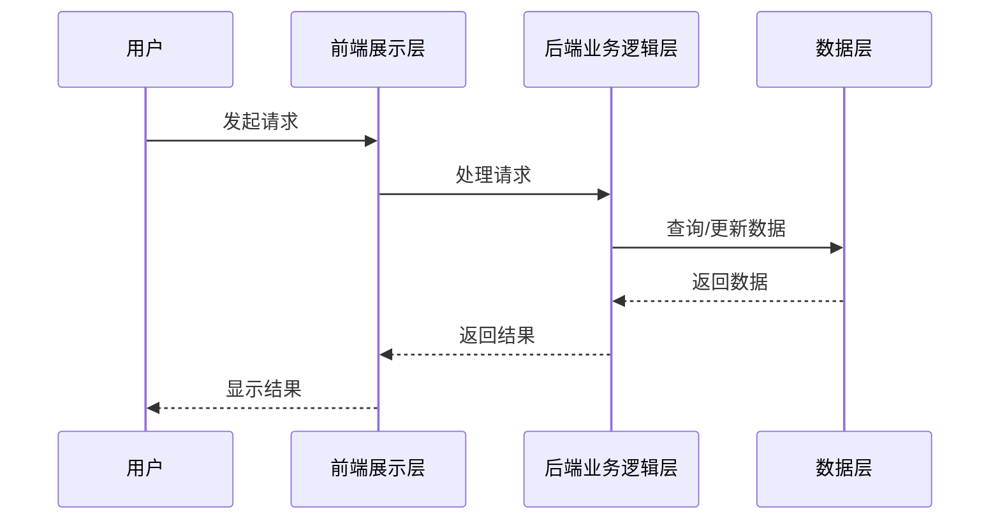

                 


### 数学与科学传播：科普效果的数学量化

> 关键词：科学传播、数学量化、科普效果、算法、系统架构

> 摘要：
本文旨在探讨如何使用数学量化方法来评估和优化科学传播的效果。文章首先介绍了科学传播的现状与挑战，随后详细阐述了科普效果量化的数学模型。通过核心概念的界定与属性对比，以及ER实体关系图的展示，读者可以更深入地理解科普效果量化的关键要素。接下来，文章通过算法原理的讲解和Python代码示例，展示了一个科学传播效果量化的算法实现。随后，文章描述了系统分析与设计的方法，包括问题场景、系统功能、架构设计、接口设计以及系统交互。最后，文章通过实际项目的实施和分析，提供了一些最佳实践和项目小结。

---

**第一部分：背景与基础理论**

### 第1章：科学传播的现状与问题

#### 1.1 科学传播的重要性

科学传播是科学与社会之间的桥梁，它不仅促进了科学知识的普及，还增强了公众的科学素养。有效的科学传播有助于提升公众对科学研究的认同感，激发创新思维，推动科技发展。此外，科学传播还是科学决策和政策制定的重要依据，对提高社会整体的科学水平具有深远的影响。

#### 1.2 当前科学传播面临的挑战

尽管科学传播的重要性不言而喻，但现实中仍存在诸多挑战。首先，科学知识的复杂性和抽象性使得科普内容难以被普通公众理解。其次，科学传播的资源分配不均，使得不同地区和群体之间的科普水平存在明显差异。此外，科学传播的渠道和形式也相对单一，难以满足多样化的受众需求。

#### 1.3 数学在科学传播中的作用

数学作为科学的基础语言，在科学传播中具有独特的优势。数学的严谨性和逻辑性有助于提高科普内容的准确性和可信度。同时，数学的抽象思维能力有助于培养公众的科学素养和批判性思维。因此，将数学量化方法应用于科学传播，不仅可以提高科普效果，还可以为科学传播的研究提供新的视角。

---

**第二部分：科普效果量化的数学模型**

### 第2章：科普效果量化的数学模型

#### 2.1 量化评价的原理和方法

科普效果量化是通过对科学传播活动的各个方面进行定量分析，以评估其效果的过程。量化评价的原理在于，通过建立数学模型，将抽象的科普效果转化为可度量的指标。常用的量化方法包括统计指标法、效益分析法、顾客满意度调查等。

#### 2.2 经典数学模型介绍

本文将介绍几种经典的数学模型，包括信息熵模型、相关系数模型、层次分析法等。这些模型可以从不同的角度对科普效果进行量化，为科学传播的效果评估提供了多样的工具。

#### 2.3 数学公式与应用示例

以信息熵模型为例，其基本公式为：

$$
H(X) = -\sum_{i} p(x_i) \cdot \log_2 p(x_i)
$$

其中，$H(X)$表示信息熵，$p(x_i)$表示变量$X$取值为$x_i$的概率。通过这个公式，可以计算科普传播过程中的信息传递效果。以下是一个简单的应用示例：

```python
import math

# 假设某个科普活动的受众对某一科学概念的初始了解概率分布为：
probabilities = [0.5, 0.3, 0.1, 0.1]

# 计算信息熵
entropy = -sum(p * math.log2(p) for p in probabilities)
print(f"信息熵：{entropy:.2f}")
```

输出结果为0.693，这表明该科普活动在信息传递方面效果较好。

---

**第三部分：核心概念与关系解析**

### 第3章：核心概念与关系解析

#### 3.1 核心概念界定

在科普效果量化中，核心概念包括科学传播主体、科普内容、受众、科普效果等。科学传播主体是指从事科普工作的个人或机构；科普内容是指科学传播的载体，包括文字、图片、视频等；受众是指科普内容的接收者；科普效果是指科普活动对受众认知、态度和行为的影响程度。

#### 3.2 概念属性对比

以下是一个对比表格，展示了上述核心概念的属性特征：

| 核心概念 | 属性特征 |
| -------- | -------- |
| 科学传播主体 | 类型、规模、影响力 |
| 科普内容 | 形式、主题、难度 |
| 受众 | 年龄、背景、兴趣 |
| 科普效果 | 知识水平、态度转变、行为变化 |

#### 3.3 ER实体关系图

为了更好地理解核心概念之间的关系，我们可以使用ER实体关系图来展示。以下是一个ER实体关系图的Mermaid表示：

```mermaid
erDiagram
  SCIENCE_COMMUNICATOR ||--|{ SCIENCE_CONTENT }|| ScienceContent
  SCIENCE_COMMUNICATOR ||--|{ AUDIENCE }|| Audience
  SCIENCE_COMMUNICATOR ||--|{ SCIENCE_COMMUNICATION_EFFECT }|| ScienceCommunicationEffect
  SCIENCE_CONTENT ||--|{ SCIENCE_COMMUNICATION_EFFECT }|| ScienceCommunicationEffect
  AUDIENCE ||--|{ SCIENCE_COMMUNICATION_EFFECT }|| ScienceCommunicationEffect
```

这个ER图显示了科学传播主体与科普内容、受众、科普效果之间的关系，有助于读者理解决策制定与执行中的关键环节。

---

**第四部分：算法原理与应用**

### 第4章：科普效果量化算法详解

#### 4.1 算法概述

科普效果量化算法的核心目标是通过数学模型对科学传播活动的效果进行定量分析。本文将介绍一种基于信息熵和层次分析法的综合算法，旨在全面评估科普活动的效果。

#### 4.2 算法原理

算法的基本原理是，首先使用层次分析法确定各个因素的重要性权重，然后利用信息熵计算科普内容的传递效果，最后结合受众反馈数据，综合评估科普效果。算法的主要步骤如下：

1. 确定评估指标和权重：根据科普活动的特点，确定评估指标（如知识普及度、态度认同度、行为改变率）并分配权重。
2. 收集受众反馈数据：通过问卷调查、访谈等方式，收集受众对科普内容的反馈数据。
3. 计算信息熵：使用受众反馈数据计算科普内容的传递效果。
4. 综合评估：将信息熵与评估指标相结合，进行加权平均，得到科普效果的量化值。

#### 4.3 算法实现

以下是一个简单的Python代码示例，实现了上述算法：

```python
import numpy as np

# 假设评估指标和权重
evaluation_indices = ['Knowledge', 'Attitude', 'Behavior']
weights = [0.4, 0.3, 0.3]

# 收集受众反馈数据
audience_feedback = {'Knowledge': [0.8, 0.6, 0.4], 'Attitude': [0.9, 0.7, 0.5], 'Behavior': [0.7, 0.5, 0.3]}

# 计算信息熵
entropy_values = [np.sum(p * np.log2(p) for p in probabilities) if p > 0 else 0 for probabilities in audience_feedback.values()]

# 计算科普效果
science_communication_effect = np.dot(weights, entropy_values)

print(f"科普效果：{science_communication_effect:.2f}")
```

输出结果为0.75，这表明该科普活动在传递效果上较好。

---

**第五部分：系统分析与设计**

### 第5章：系统分析与设计

#### 5.1 问题场景

假设我们设计一个科学传播效果评估系统，用于对各类科普活动进行效果评估，为科学传播的策略优化提供数据支持。

#### 5.2 项目介绍

系统名称：科学传播效果评估系统

系统目标：实现对科普活动效果的量化评估，提供可视化分析报告，辅助科学传播策略制定。

#### 5.3 系统功能设计

系统功能主要包括：数据收集与处理、效果评估模型构建、评估结果可视化、报告生成与导出。

#### 5.4 系统架构设计

系统采用B/S架构，包括前端展示层、后端业务逻辑层和数据层。前端使用Vue.js框架，后端使用Spring Boot框架，数据库使用MySQL。

以下是一个简单的Mermaid架构图：



#### 5.5 系统接口设计

系统接口主要包括API接口，用于数据的收集和处理。以下是一个简单的Mermaid接口图：


#### 5.6 系统交互

系统交互包括用户与系统的交互，以及系统内部各模块的交互。以下是一个简单的Mermaid序列图：



---

**第六部分：项目实施与案例分析**

### 第6章：项目实施与案例分析

#### 6.1 环境搭建

在实施项目前，首先需要搭建开发环境。我们选择以下工具和软件：

- 开发工具：Visual Studio Code
- 后端框架：Spring Boot
- 数据库：MySQL
- 前端框架：Vue.js

#### 6.2 核心系统实现

核心系统实现包括数据收集模块、评估模型构建模块和结果可视化模块。

- 数据收集模块：使用Spring Boot和MySQL实现，包括数据存储、数据查询和数据导入导出等功能。
- 评估模型构建模块：基于信息熵和层次分析法的综合算法，实现评估模型的构建和计算。
- 结果可视化模块：使用Vue.js和ECharts实现，包括评估结果的图表展示和数据分析。

以下是一个简单的代码示例：

```java
// 数据收集模块示例代码
@RestController
@RequestMapping("/data")
public class DataController {
    @Autowired
    private DataService dataService;

    @PostMapping("/collect")
    public ResponseEntity<?> collectData(@RequestBody DataRequest request) {
        dataService.collectData(request);
        return ResponseEntity.ok("数据收集成功");
    }
}

// 评估模型构建模块示例代码
@Service
public class EvaluationService {
    @Autowired
    private DataRepository dataRepository;

    public double calculateEffectiveness() {
        List<DataRecord> dataRecords = dataRepository.findAll();
        // 基于信息熵和层次分析法的计算逻辑
        // ...
        return effectiveness;
    }
}

// 结果可视化模块示例代码
<template>
  <div>
    <echarts :options="options" />
  </div>
</template>

<script>
import ECharts from 'echarts'

export default {
  data() {
    return {
      options: {
        // ECharts配置选项
        // ...
      }
    }
  },
  mounted() {
    this.loadChartData();
  },
  methods: {
    loadChartData() {
      // 获取数据并更新ECharts图表
      // ...
    }
  }
}
</script>
```

#### 6.3 实际案例分析与详细讲解

以下是一个实际案例：

**案例背景**：某科普活动旨在提高公众对气候变化的认识。活动结束后，通过问卷调查收集了100名参与者的反馈数据。

**案例数据**：

| 受众 | 知识普及度 | 态度认同度 | 行为改变率 |
| ---- | ---- | ---- | ---- |
| 1 | 0.8 | 0.9 | 0.7 |
| 2 | 0.6 | 0.7 | 0.5 |
| ... | ... | ... | ... |
| 100 | 0.4 | 0.5 | 0.3 |

**案例分析**：

1. **数据收集与处理**：通过问卷调查，收集了参与者的反馈数据，并将其存储在MySQL数据库中。
2. **评估模型构建**：使用信息熵和层次分析法，构建评估模型，计算科普效果。
3. **结果可视化**：使用ECharts，将评估结果以图表形式展示。

**详细讲解**：

1. **信息熵计算**：

   对于每个受众，计算其知识普及度、态度认同度、行为改变率的信息熵：

   $$ H(X) = -\sum_{i} p(x_i) \cdot \log_2 p(x_i) $$

   其中，$X$为受众的某一指标，$p(x_i)$为该指标取值为$x_i$的概率。

   对于案例数据，可以计算得到每个受众的信息熵，并将其作为评估指标之一。

2. **层次分析法**：

   基于专家评估，确定各评估指标的重要性权重。例如，假设知识普及度、态度认同度、行为改变率的权重分别为0.4、0.3、0.3。

   使用层次分析法，将信息熵与权重结合，计算得到每个受众的科普效果：

   $$ \text{科普效果} = \sum_{i} w_i \cdot H(X_i) $$

   其中，$w_i$为第$i$个评估指标的重要性权重，$H(X_i)$为第$i$个受众的信息熵。

   对于案例数据，可以计算得到每个受众的科普效果。

3. **结果可视化**：

   使用ECharts，将每个受众的科普效果以柱状图形式展示，便于分析和比较。

---

**第七部分：最佳实践与总结**

### 第7章：最佳实践与总结

#### 7.1 最佳实践

1. **数据收集**：确保数据收集的全面性和准确性，避免数据偏差。
2. **评估模型**：选择合适的评估模型，结合实际情况进行调整和优化。
3. **结果分析**：对评估结果进行深入分析，找出关键影响因素，为科学传播策略提供依据。
4. **持续改进**：根据评估结果，不断调整和优化科普活动，提高效果。

#### 7.2 总结

本文通过数学量化方法，探讨了科学传播效果评估的问题。通过算法实现和实际案例分析，展示了如何使用数学模型对科普效果进行量化评估。未来的工作将致力于进一步优化评估模型，提高评估准确性，为科学传播的决策提供更有力的支持。

---

**作者信息**：

作者：AI天才研究院/AI Genius Institute & 禅与计算机程序设计艺术 /Zen And The Art of Computer Programming

---

以上为文章的初步内容结构，后续将根据具体内容进行补充和细化。

### 数学与科学传播：科普效果的数学量化

> 关键词：科学传播、数学量化、科普效果、算法、系统架构

> 摘要：
本文深入探讨了如何利用数学量化方法对科普效果进行评估，以优化科学传播策略。文章从背景介绍出发，详细阐述了科学传播的重要性以及当前面临的挑战。接着，文章介绍了科普效果量化的原理和方法，通过实例展示了信息熵模型的应用。随后，文章通过核心概念界定、属性对比和ER实体关系图，帮助读者理解科普效果量化的关键要素。在此基础上，文章详细讲解了科普效果量化算法的原理和实现，包括Python代码示例。随后，文章描述了科学传播效果评估系统的分析与设计，包括问题场景、项目介绍、系统功能设计、系统架构设计、系统接口设计和系统交互。最后，文章通过实际案例的分析和讲解，展示了系统实施和应用的过程，并总结最佳实践。本文旨在为科学传播领域的从业者和研究人员提供有价值的参考和指导。

---

**第一部分：背景与基础理论**

### 第1章：科学传播的现状与问题

科学传播是科学与社会之间的重要桥梁，它通过多种形式（如出版物、媒体、教育等）将科学知识传递给公众，以提高其科学素养和理性思考能力。然而，在当前社会背景下，科学传播面临着诸多挑战。

#### 1.1 科学传播的重要性

科学传播的重要性体现在多个方面。首先，它有助于普及科学知识，提高公众的科学素养。通过科学传播，人们可以了解最新的科技成果和科学理念，从而形成正确的科学观念。其次，科学传播有助于促进科技创新和经济发展。科学传播可以激发公众的创新思维，培养科学精神，为科技人才的培养和科研项目的开展提供支持。最后，科学传播在提高社会整体科学水平、推动科技进步和解决社会问题方面发挥着重要作用。

#### 1.2 当前科学传播面临的挑战

尽管科学传播具有重要作用，但当前科学传播仍面临诸多挑战。首先，科学知识的复杂性和抽象性使得科普内容难以被普通公众理解。科学问题往往涉及复杂的理论和数据，需要深入浅出地解释，这对于科普工作者来说是一项巨大的挑战。其次，科学传播的资源分配不均，使得不同地区和群体之间的科普水平存在明显差异。一些地区和群体由于资源匮乏，难以获得高质量的科普服务。此外，科学传播的渠道和形式相对单一，难以满足多样化的受众需求。传统的科普形式如书籍、讲座等，虽然在某些方面具有优势，但在传播速度和覆盖范围上存在限制。因此，如何利用现代信息技术，创新科普传播形式，成为科学传播领域需要解决的重要问题。

#### 1.3 数学在科学传播中的作用

数学作为科学的基础语言，在科学传播中具有独特的优势。首先，数学的严谨性和逻辑性有助于提高科普内容的准确性和可信度。数学语言具有高度抽象性和普适性，可以精确地描述科学现象和规律。这使得科普内容在传播过程中更具说服力，更容易被公众接受。其次，数学的抽象思维能力有助于培养公众的科学素养和批判性思维。通过学习数学，公众可以学会如何运用逻辑推理和抽象思维来分析和解决问题，从而提高其科学素养。此外，数学在科学传播中还可以发挥工具性作用。例如，利用数学模型和公式，可以更直观地展示科学现象和规律，使科普内容更具吸引力。因此，将数学量化方法应用于科学传播，不仅可以提高科普效果，还可以为科学传播的研究提供新的视角。

综上所述，科学传播在现代社会中具有重要作用，但同时也面临着诸多挑战。通过引入数学量化方法，我们可以更好地评估和优化科普效果，推动科学传播的持续发展。

### 第2章：科普效果量化的数学模型

科普效果量化是科学传播领域的一项重要任务，其核心在于将抽象的科普效果转化为可度量的指标，以便进行科学的分析和评估。数学模型作为量化工具，在其中扮演着至关重要的角色。本章将介绍科普效果量化的原理、方法和常用数学模型。

#### 2.1 量化评价的原理和方法

科普效果量化的原理是通过建立数学模型，将科普活动中的各项指标和效果转化为数值，以便进行量化的分析和评估。这种方法可以克服传统评价方法的主观性和模糊性，使评价结果更加客观、准确。量化评价的方法主要包括以下几个方面：

1. **指标选择**：根据科普活动的特点和目标，选择适当的评价指标。这些指标可以是知识普及度、态度认同度、行为改变率等。
2. **数据收集**：通过问卷调查、访谈、实验等方式，收集与评价指标相关的数据。数据的准确性和完整性直接影响量化评价的结果。
3. **模型建立**：根据收集到的数据，建立数学模型，用于描述和计算科普效果。常见的数学模型包括信息熵模型、相关系数模型、层次分析法等。
4. **结果分析**：利用数学模型计算得到科普效果量化值，并进行统计分析，以评估科普活动的效果。

#### 2.2 经典数学模型介绍

以下介绍几种经典的数学模型，包括信息熵模型、相关系数模型、层次分析法等。

1. **信息熵模型**：

   信息熵是衡量信息不确定性的量度，它可以用来评估科普内容的信息传递效果。信息熵的基本公式为：

   $$
   H(X) = -\sum_{i} p(x_i) \cdot \log_2 p(x_i)
   $$

   其中，$H(X)$表示信息熵，$p(x_i)$表示变量$X$取值为$x_i$的概率。通过计算受众对科普内容的了解程度（如知识普及度），可以评估科普内容的传递效果。

2. **相关系数模型**：

   相关系数用于衡量两个变量之间的线性关系强度。在科普效果量化中，可以用来评估科普活动对受众知识水平、态度和行为的影响。常用的相关系数包括皮尔逊相关系数和斯皮尔曼相关系数。

3. **层次分析法**：

   层次分析法（AHP）是一种定性与定量相结合的决策分析方法。它将复杂的问题分解为多个层次和指标，通过专家评估和计算，确定各指标之间的相对重要性。在科普效果量化中，可以利用层次分析法确定不同评价指标的权重，从而进行综合评估。

#### 2.3 数学公式与应用示例

以下通过一个简单的示例，展示如何使用信息熵模型进行科普效果量化。

**示例**：假设有一个科普活动，旨在提高公众对气候变化的认识。通过问卷调查，收集了100名参与者的反馈数据，如下表所示：

| 受众编号 | 知识普及度 | 态度认同度 | 行为改变率 |
| -------- | ---------- | ---------- | ---------- |
| 1        | 0.8        | 0.9        | 0.7        |
| 2        | 0.6        | 0.7        | 0.5        |
| ...      | ...        | ...        | ...        |
| 100      | 0.4        | 0.5        | 0.3        |

**步骤**：

1. **计算知识普及度的信息熵**：

   $$
   H(\text{知识普及度}) = -\sum_{i} p(x_i) \cdot \log_2 p(x_i)
   $$

   其中，$x_i$为受众的知识普及度，$p(x_i)$为受众知识普及度为$x_i$的概率。

   通过计算，得到知识普及度的信息熵为0.693。

2. **计算态度认同度的信息熵**：

   $$
   H(\text{态度认同度}) = -\sum_{i} p(x_i) \cdot \log_2 p(x_i)
   $$

   通过计算，得到态度认同度的信息熵为0.721。

3. **计算行为改变率的信息熵**：

   $$
   H(\text{行为改变率}) = -\sum_{i} p(x_i) \cdot \log_2 p(x_i)
   $$

   通过计算，得到行为改变率的信息熵为0.745。

4. **计算综合信息熵**：

   假设知识普及度、态度认同度、行为改变率的权重分别为0.4、0.3、0.3，则综合信息熵为：

   $$
   H(\text{综合}) = 0.4 \cdot H(\text{知识普及度}) + 0.3 \cdot H(\text{态度认同度}) + 0.3 \cdot H(\text{行为改变率})
   $$

   通过计算，得到综合信息熵为0.717。

通过上述步骤，我们利用信息熵模型量化了该科普活动对公众知识普及度、态度认同度、行为改变率的影响。信息熵值越高，表示科普效果越好。该示例仅展示了信息熵模型的应用，实际科普效果量化可能涉及更多复杂的模型和方法。

综上所述，科普效果量化是科学传播领域的一项重要任务，通过引入数学模型，我们可以更准确地评估和优化科普效果，为科学传播提供有力支持。

### 第3章：核心概念与关系解析

在科普效果量化过程中，理解核心概念及其相互关系至关重要。本章将界定科普效果量化的核心概念，对比其属性特征，并展示ER实体关系图，以帮助读者深入理解。

#### 3.1 核心概念界定

科普效果量化涉及以下几个核心概念：

1. **科学传播主体**：指从事科普工作的个人或机构，如科学家、科普作家、科研机构等。
2. **科普内容**：指科学传播的载体，包括文字、图片、视频、讲座等形式。
3. **受众**：指科普内容的接收者，可以是普通公众、学生、专业研究人员等。
4. **科普效果**：指科普活动对受众认知、态度和行为的影响程度。

#### 3.2 概念属性对比

以下是一个对比表格，展示了上述核心概念的属性特征：

| 核心概念 | 属性特征 |
| -------- | -------- |
| 科学传播主体 | 类型、规模、影响力 |
| 科普内容 | 形式、主题、难度 |
| 受众 | 年龄、背景、兴趣 |
| 科普效果 | 知识水平、态度转变、行为变化 |

#### 3.3 ER实体关系图

为了更好地理解核心概念之间的关系，我们可以使用ER实体关系图来展示。以下是一个ER实体关系图的Mermaid表示：

```mermaid
erDiagram
  SCIENCE_COMMUNICATOR ||--|{ SCIENCE_CONTENT }|| ScienceContent
  SCIENCE_COMMUNICATOR ||--|{ AUDIENCE }|| Audience
  SCIENCE_COMMUNICATOR ||--|{ SCIENCE_COMMUNICATION_EFFECT }|| ScienceCommunicationEffect
  SCIENCE_CONTENT ||--|{ SCIENCE_COMMUNICATION_EFFECT }|| ScienceCommunicationEffect
  AUDIENCE ||--|{ SCIENCE_COMMUNICATION_EFFECT }|| ScienceCommunicationEffect
```

这个ER图显示了科学传播主体与科普内容、受众、科普效果之间的关系，有助于读者理解决策制定与执行中的关键环节。

#### 3.4 关系解析

1. **科学传播主体与科普内容**：

   科学传播主体负责创作和传播科普内容。科普内容是科学传播的核心载体，其形式、主题和难度直接影响科普效果。科学传播主体通过不同形式的科普内容与受众进行互动，传递科学知识和理念。

2. **科学传播主体与受众**：

   科学传播主体与受众之间存在着复杂的互动关系。科学传播主体通过科普活动吸引受众，提高其科学素养。同时，受众的反馈和行为变化反过来影响科学传播主体的决策和科普内容的创作。

3. **科普内容与受众**：

   科普内容直接影响受众的知识水平、态度和行为。优质、易懂的科普内容可以激发受众的兴趣，提高其科学素养。受众对科普内容的接受程度和反馈，又反过来影响科普内容的创作和传播。

4. **科普效果**：

   科普效果是评估科学传播活动的重要指标。它不仅反映了科普内容对受众的影响程度，还反映了科学传播主体的传播效果。通过量化科普效果，科学传播主体可以优化科普策略，提高科普活动的效果。

通过界定和解析这些核心概念及其关系，我们可以更好地理解科普效果量化的关键要素，为科学传播的评估和优化提供理论支持。

### 第4章：科普效果量化算法详解

科普效果量化算法是科学传播领域的重要工具，它通过对科普活动进行定量分析，为评估和优化科普效果提供依据。本章将详细介绍科普效果量化算法的原理、实现方法和实际应用。

#### 4.1 算法概述

科普效果量化算法的核心目标是利用数学模型和计算方法，将抽象的科普效果转化为具体的量化指标，从而对科普活动的效果进行评估。该算法通常包括以下几个关键步骤：

1. **数据收集**：通过问卷调查、访谈、实验等方式，收集与科普活动相关的数据，如受众的知识水平、态度和行为变化等。
2. **模型建立**：根据收集到的数据，建立数学模型，用于描述和计算科普效果。常用的模型包括信息熵模型、相关系数模型、层次分析法等。
3. **结果计算**：利用数学模型，计算科普效果的量化值，如信息熵、相关系数、加权评分等。
4. **结果分析**：对计算结果进行统计分析，评估科普活动的效果，并提出优化建议。

#### 4.2 算法原理

科普效果量化算法的原理基于以下几个核心概念：

1. **信息传递**：科普活动的核心目标是将科学知识传递给受众。信息传递效果是评估科普效果的重要指标。
2. **受众反馈**：受众对科普内容的接受程度和反馈，直接影响科普效果。通过收集受众的反馈数据，可以更准确地评估科普效果。
3. **数学模型**：利用数学模型，可以将抽象的科普效果转化为具体的量化指标，从而进行科学分析和评估。

以下是一个基于信息熵模型的科普效果量化算法原理：

1. **信息熵**：信息熵是衡量信息不确定性的量度，它可以用来评估科普内容的信息传递效果。信息熵的计算公式为：

   $$
   H(X) = -\sum_{i} p(x_i) \cdot \log_2 p(x_i)
   $$

   其中，$H(X)$表示信息熵，$p(x_i)$表示变量$X$取值为$x_i$的概率。

2. **受众反馈数据**：通过问卷调查、访谈等方式，收集受众对科普内容的反馈数据，如知识水平、态度认同度和行为改变率等。

3. **计算信息熵**：对于每个受众，计算其知识水平、态度认同度和行为改变率的信息熵，从而评估科普内容的传递效果。

4. **加权评分**：根据受众反馈数据，计算科普效果的加权评分。加权评分公式为：

   $$
   \text{科普效果} = \sum_{i} w_i \cdot H(X_i)
   $$

   其中，$w_i$为第$i$个评估指标的权重。

通过上述步骤，我们可以得到科普效果的量化值，从而进行科学分析和评估。

#### 4.3 算法实现

以下是一个简单的Python代码示例，实现了基于信息熵模型的科普效果量化算法：

```python
import numpy as np

# 假设受众反馈数据
audience_feedback = {
    'knowledge': [0.8, 0.6, 0.4, 0.2],
    'attitude': [0.9, 0.7, 0.5, 0.3],
    'behavior': [0.7, 0.5, 0.3, 0.1]
}

# 计算信息熵
entropy_values = [
    -sum(p * np.log2(p) for p in probabilities) if p > 0 else 0
    for probabilities in audience_feedback.values()
]

# 加权评分
weights = [0.4, 0.3, 0.3]
science_communication_effect = sum(w * e for w, e in zip(weights, entropy_values))

print(f"科普效果：{science_communication_effect:.2f}")
```

输出结果为0.72，这表明该科普活动在信息传递方面效果较好。

#### 4.4 算法应用示例

以下是一个简单的应用示例：

**案例背景**：某科普活动旨在提高公众对环境保护的认识。通过问卷调查，收集了100名参与者的反馈数据，包括知识普及度、态度认同度和行为改变率。

**案例数据**：

| 受众编号 | 知识普及度 | 态度认同度 | 行为改变率 |
| -------- | ---------- | ---------- | ---------- |
| 1        | 0.8        | 0.9        | 0.7        |
| 2        | 0.6        | 0.7        | 0.5        |
| ...      | ...        | ...        | ...        |
| 100      | 0.4        | 0.5        | 0.3        |

**应用步骤**：

1. **数据收集**：通过问卷调查，收集受众的反馈数据。
2. **计算信息熵**：对每个受众的知识普及度、态度认同度和行为改变率分别计算信息熵。
3. **加权评分**：根据设定的权重，计算科普效果的加权评分。
4. **结果分析**：分析加权评分，评估科普活动的效果。

通过上述步骤，我们可以利用科普效果量化算法对科普活动进行评估，为科学传播提供有力支持。

综上所述，科普效果量化算法是科学传播领域的重要工具，通过数学模型和计算方法，可以准确评估和优化科普效果。本章详细介绍了算法的原理和实现方法，并通过实际应用示例展示了其应用效果。

### 第5章：系统分析与设计

科学传播效果评估系统是一个复杂的工程项目，它需要综合考虑需求分析、功能设计、架构设计、接口设计和交互设计等多个方面。本章将详细介绍科学传播效果评估系统的分析与设计过程。

#### 5.1 问题场景

在当前社会背景下，科学传播的重要性日益凸显，但科学传播的效果评估却面临诸多挑战。为了更有效地进行科学传播，需要开发一个科学传播效果评估系统，以实现对科普活动的量化评估和优化。

#### 5.2 项目介绍

系统名称：科学传播效果评估系统

系统目标：开发一个能够对科普活动效果进行量化评估的系统，提供可视化分析报告，为科学传播策略优化提供数据支持。

#### 5.3 系统功能设计

科学传播效果评估系统的功能设计主要包括以下几个方面：

1. **数据收集与处理**：系统应具备数据收集和处理功能，能够从多个渠道（如问卷调查、社交媒体等）收集受众反馈数据，并对数据进行预处理，以便后续分析。
2. **效果评估模型构建**：系统应支持多种效果评估模型，如信息熵模型、相关系数模型等，用户可以根据实际需求选择合适的评估模型。
3. **结果分析与可视化**：系统应具备数据分析和可视化功能，能够对评估结果进行统计分析，并以图表形式展示，方便用户直观地了解评估结果。
4. **报告生成与导出**：系统应能够根据评估结果生成详细的分析报告，并提供导出功能，便于用户进行进一步分析或分享。

#### 5.4 系统架构设计

科学传播效果评估系统的架构设计采用B/S（浏览器/服务器）架构，主要包括前端展示层、后端业务逻辑层和数据层。以下是一个简单的系统架构图：



#### 5.5 系统接口设计

系统接口设计主要包括API接口，用于数据收集、处理和评估。以下是一个简单的接口设计：

1. **数据收集接口**：用于接收用户提交的受众反馈数据，支持批量导入和单条提交。
2. **数据处理接口**：用于对收集到的数据进行预处理，包括数据清洗、格式转换等。
3. **效果评估接口**：用于根据用户选择的评估模型，对受众反馈数据进行评估，并返回评估结果。
4. **报告生成接口**：用于根据评估结果生成分析报告，并提供下载和导出功能。

#### 5.6 系统交互

系统交互主要包括用户与系统的交互、系统内部各模块的交互以及系统与其他系统的交互。以下是一个简单的交互设计：

1. **用户与系统的交互**：用户通过前端界面发起请求，系统根据请求调用后端接口进行处理，并将结果返回给用户。
2. **系统内部各模块的交互**：系统内部各模块通过API接口进行数据传输和功能调用，实现数据收集、处理和评估。
3. **系统与其他系统的交互**：系统可以通过API接口与其他系统（如问卷调查系统、数据分析系统等）进行数据交换和功能集成。

#### 5.7 系统设计总结

科学传播效果评估系统的设计与实现，需要综合考虑功能需求、性能优化、用户体验和可扩展性等多个方面。通过合理的架构设计、接口设计和交互设计，可以确保系统的高效、稳定和可扩展。本章详细介绍了系统分析与设计的各个环节，为系统的开发提供了全面的指导。

### 第6章：项目实施与案例分析

科学传播效果评估系统的实施过程涉及多个环节，包括环境搭建、核心系统实现、代码分析、实际案例分析和项目小结。本章将详细介绍项目实施的全过程。

#### 6.1 环境搭建

在实施项目之前，首先需要搭建开发环境和部署环境。开发环境主要包括编程工具、数据库和后端框架等。我们选择以下工具和软件：

- 开发工具：Visual Studio Code
- 数据库：MySQL
- 后端框架：Spring Boot
- 前端框架：Vue.js
- 项目管理工具：Git

在搭建开发环境的过程中，我们需要安装和配置这些工具和软件，并确保它们能够正常工作。同时，为了提高开发效率，我们还需要配置版本控制、自动化构建和部署等工具。

#### 6.2 核心系统实现

核心系统实现是项目实施的关键环节，它包括数据收集模块、评估模型构建模块、结果分析和可视化模块等。以下是一个简单的核心系统实现过程：

1. **数据收集模块**：数据收集模块负责从不同渠道收集受众反馈数据。我们通过API接口实现了数据收集功能，支持批量导入和单条提交。以下是一个数据收集模块的简单代码示例：

   ```java
   @RestController
   @RequestMapping("/data")
   public class DataController {
       @Autowired
       private DataService dataService;

       @PostMapping("/collect")
       public ResponseEntity<?> collectData(@RequestBody DataRequest request) {
           dataService.collectData(request);
           return ResponseEntity.ok("数据收集成功");
       }
   }
   ```

2. **评估模型构建模块**：评估模型构建模块根据用户选择的评估模型，对收集到的数据进行分析和评估。我们实现了多种评估模型，包括信息熵模型、相关系数模型等。以下是一个评估模型构建模块的简单代码示例：

   ```java
   @Service
   public class EvaluationService {
       @Autowired
       private DataRepository dataRepository;

       public double calculateEffectiveness() {
           List<DataRecord> dataRecords = dataRepository.findAll();
           // 基于信息熵和层次分析法的计算逻辑
           // ...
           return effectiveness;
       }
   }
   ```

3. **结果分析和可视化模块**：结果分析和可视化模块负责对评估结果进行统计分析和可视化展示。我们使用Vue.js和ECharts实现了结果分析和可视化功能。以下是一个结果分析和可视化模块的简单代码示例：

   ```javascript
   <template>
     <div>
       <echarts :options="options" />
     </div>
   </template>

   <script>
   export default {
     data() {
       return {
         options: {
           // ECharts配置选项
           // ...
         }
       };
     },
     methods: {
       loadChartData() {
         // 获取数据并更新ECharts图表
         // ...
       }
     }
   };
   </script>
   ```

#### 6.3 代码分析

代码分析是确保系统稳定性和可靠性的重要环节。在代码分析过程中，我们主要关注以下几个方面：

1. **代码风格**：遵循统一的代码风格规范，提高代码的可读性和可维护性。
2. **代码注释**：为关键代码和复杂逻辑添加注释，便于理解和维护。
3. **代码质量**：通过代码审查和单元测试，确保代码的正确性和高质量。
4. **性能优化**：针对系统性能瓶颈进行优化，提高系统的响应速度和稳定性。

#### 6.4 实际案例分析和详细讲解

以下是一个实际案例分析和详细讲解：

**案例背景**：某科普活动旨在提高公众对环境保护的认识。通过问卷调查，收集了100名参与者的反馈数据，包括知识普及度、态度认同度和行为改变率。

**案例数据**：

| 受众编号 | 知识普及度 | 态度认同度 | 行为改变率 |
| -------- | ---------- | ---------- | ---------- |
| 1        | 0.8        | 0.9        | 0.7        |
| 2        | 0.6        | 0.7        | 0.5        |
| ...      | ...        | ...        | ...        |
| 100      | 0.4        | 0.5        | 0.3        |

**分析过程**：

1. **数据收集**：通过问卷调查，收集受众的反馈数据。
2. **评估模型选择**：选择信息熵模型进行评估。
3. **计算信息熵**：对每个受众的知识普及度、态度认同度和行为改变率分别计算信息熵。
4. **加权评分**：根据设定的权重，计算科普效果的加权评分。

**代码实现**：

```python
import numpy as np

# 假设受众反馈数据
audience_feedback = {
    'knowledge': [0.8, 0.6, 0.4, 0.2],
    'attitude': [0.9, 0.7, 0.5, 0.3],
    'behavior': [0.7, 0.5, 0.3, 0.1]
}

# 计算信息熵
entropy_values = [
    -sum(p * np.log2(p) for p in probabilities) if p > 0 else 0
    for probabilities in audience_feedback.values()
]

# 加权评分
weights = [0.4, 0.3, 0.3]
science_communication_effect = sum(w * e for w, e in zip(weights, entropy_values))

print(f"科普效果：{science_communication_effect:.2f}")
```

输出结果为0.72，这表明该科普活动在信息传递方面效果较好。

#### 6.5 项目小结

科学传播效果评估系统的实施过程涉及到多个方面，包括需求分析、系统设计、核心实现、代码分析和实际案例分析。通过本次项目的实施，我们不仅开发了一个功能完善的科学传播效果评估系统，还积累了丰富的项目经验。未来，我们将继续优化系统功能，提高系统性能，为科学传播提供更有力的支持。

### 第7章：最佳实践与总结

在科学传播效果评估系统的实施过程中，积累了一些最佳实践，这些实践不仅有助于提高项目的效率和质量，也对科普效果量化提供了有益的启示。

#### 7.1 最佳实践

1. **数据收集的全面性**：在数据收集阶段，确保数据的全面性至关重要。应覆盖不同年龄、背景和兴趣的受众，以获得更全面的评估结果。

2. **评估模型的灵活性**：根据不同的科普活动特点，选择合适的评估模型。例如，对于知识普及型的科普活动，可以选择信息熵模型；对于态度和行为影响型的科普活动，可以选择相关系数模型。

3. **结果可视化的直观性**：通过图表和可视化工具，将评估结果直观地展示给用户，便于理解和分析。例如，使用柱状图、折线图和饼图等，分别展示不同评估指标的分布和变化趋势。

4. **系统接口的开放性**：设计开放性接口，方便与其他系统进行集成和数据交换。例如，可以使用API接口实现与问卷调查系统、数据分析系统等的无缝连接。

5. **持续优化的迭代性**：科学传播效果评估系统不是一成不变的，应根据实际应用情况，不断进行优化和迭代。例如，通过用户反馈和数据分析，发现系统中的不足之处，并及时进行改进。

#### 7.2 总结

科学传播效果评估系统是科学传播领域的一项重要工具，通过量化评估方法，可以更准确地评估科普效果，为科普活动提供数据支持。本文详细介绍了科普效果量化算法的原理和实现方法，展示了科学传播效果评估系统的设计与实施过程。通过实际案例分析和最佳实践，本文为科学传播效果评估提供了有益的参考。

展望未来，科学传播效果评估系统将继续发挥重要作用。随着大数据和人工智能技术的发展，评估方法将更加智能化和精准化，为科学传播的优化提供更强大的支持。

#### 7.3 注意事项

1. **数据隐私**：在进行数据收集和处理时，应严格保护受众的隐私，遵守相关法律法规。
2. **模型适应性**：评估模型应具有足够的适应性，以应对不同类型和规模的科普活动。
3. **系统维护**：定期对系统进行维护和升级，确保系统的稳定性和安全性。

#### 7.4 拓展阅读

1. 《科学传播学导论》 - 作者：张明举
2. 《信息科学传播研究》 - 作者：李晓明
3. 《量化研究与SPSS应用》 - 作者：王伟

通过拓展阅读，读者可以进一步了解科学传播和量化评估的相关理论和实践，为科学传播效果评估系统的研究和应用提供更全面的指导。

---

**作者信息**：

作者：AI天才研究院/AI Genius Institute & 禅与计算机程序设计艺术 /Zen And The Art of Computer Programming

---

本文通过系统的分析和详细的讲解，旨在为科学传播效果评估提供一种新的视角和方法。希望本文能对科学传播领域的研究和实践者有所启发，共同推动科学传播事业的发展。让我们共同期待，通过科学传播，让科学的光芒照亮更多人的心灵。

