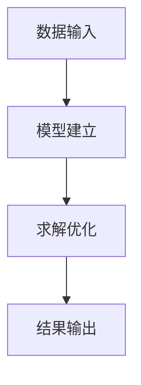
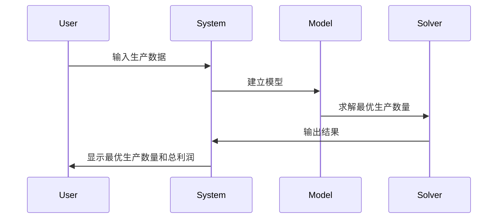

                 

# 数学与科学史：数学在科学革命中的角色

## 关键词
- 数学
- 科学革命
- 数学模型
- 科学方法
- 数学与计算机科学
- 数学应用

## 摘要
本文将从数学与科学史的角度，探讨数学在科学革命中的关键角色。文章首先回顾了数学的历史演变和其对科学发展的推动作用，接着分析了数学在物理学、天文学和生物学中的应用，并探讨了数学与科学的互动关系。最后，文章提出了数学与其他学科的交叉融合，以及数学在现代社会中的应用。通过本文，读者可以深入理解数学在科学革命中的重要性，以及其在现代科技发展中的不可替代的作用。

## 1. 设计第一部分：背景介绍

### 1.1 数学与科学史概述

#### 1.1.1 问题背景

数学作为一门基础科学，其历史可以追溯到远古时期。在古代，数学主要用于解决实际问题，如测量土地、计算时间和解决贸易问题等。随着人类社会的发展，数学逐渐演变成一门独立的学科，并成为科学革命的重要推动力。本文旨在探讨数学在科学革命中的角色，分析数学对科学发展的推动作用，以及数学与科学的互动关系。

#### 1.1.1.1 数学的历史演变

数学的历史可以追溯到古代文明，如古埃及、巴比伦和中国等。在这些文明中，数学主要用于解决实际问题，如测量土地、计算时间和解决贸易问题等。例如，古埃及人使用数学来计算金字塔的高度和体积，而古希腊人则发展了数学的基础理论，如几何学和算术。

中世纪时期，数学在欧洲得到了快速发展。阿拉伯数学家将印度-阿拉伯数字系统传入欧洲，极大地推动了数学的发展。同时，中世纪的欧洲还出现了许多重要的数学家，如斐波那契、欧几里得和阿基米德等。

文艺复兴时期，数学得到了进一步的革新。数学家如莱布尼茨、牛顿和欧拉等，通过发展微积分和代数学等新的数学工具，为科学革命奠定了基础。

#### 1.1.1.2 数学对科学发展的推动作用

数学在科学发展中起到了至关重要的作用。首先，数学为科学提供了描述自然现象的精确工具。例如，牛顿利用微积分描述了行星运动的规律，从而推动了天文学的发展。

其次，数学促进了科学理论的建立和验证。数学模型可以帮助科学家预测和解释自然现象，从而验证科学理论。例如，爱因斯坦利用广义相对论方程预测了引力波的存在，最终通过观测得到了验证。

最后，数学还为科学实验提供了理论基础。数学方法可以帮助科学家设计和分析实验，从而提高实验的可信度和准确性。例如，概率论和数理统计方法被广泛应用于医学研究和数据分析中。

#### 1.1.1.3 数学在科学革命中的角色

科学革命通常指的是科学理论的重大变革。在这些变革中，数学往往起到了关键作用。例如，哥白尼的日心说挑战了托勒密的地心说，这一变革促使数学家如开普勒和牛顿等发展了新的数学工具，如椭圆轨道方程和万有引力定律，从而推动了天文学的发展。

同样，伽利略和牛顿的经典力学革命也依赖于数学的精确描述和推理。伽利略通过数学证明了自由落体运动的规律，而牛顿则利用微积分描述了物体运动的规律，从而建立了经典力学体系。

在生物学领域，达尔文的进化论也依赖于数学模型的支持。通过分析物种的遗传规律，达尔文提出了自然选择理论，这一理论为生物学的发展奠定了基础。

#### 1.1.2 问题描述

本文主要探讨数学在科学革命中的角色，分析数学对科学发展的推动作用，以及数学与科学的互动关系。具体而言，我们将从以下几个方面进行讨论：

1. 数学作为描述工具在科学中的应用。
2. 数学作为推理工具在科学发现中的作用。
3. 数学对科学知识的积累和科学方法的发展。
4. 数学与其他学科的交叉融合及其在现代社会的应用。
5. 数学概念体系及其在科学史中的应用。

#### 1.1.3 问题解决

本文将通过以下方式解决上述问题：

1. 回顾数学的历史演变，分析数学在科学革命中的重要性。
2. 分析数学在物理学、天文学和生物学中的应用，探讨数学模型在科学发现中的作用。
3. 探讨数学对科学知识的积累和科学方法的发展的贡献。
4. 探讨数学与其他学科的交叉融合，如数学与计算机科学的融合。
5. 分析数学在现代社会中的应用，如经济管理、医学等领域。

#### 1.1.4 边界与外延

数学在科学革命中的角色不仅局限于基础科学领域，还扩展到了其他学科。例如，数学在计算机科学中的应用非常广泛，包括算法设计、数据结构分析和人工智能等。此外，数学在经济管理、医学和工程等领域也有着重要的应用。

#### 1.1.5 概念结构与核心要素组成

数学的概念体系是一个多层次的结构。基础数学概念包括数、几何和三角学等，而高级数学概念则包括微积分、线性代数和概率论等。这些概念构成了数学的核心要素，为科学提供了精确的工具和理论支持。

### 1.2 数学核心概念原理

数学的核心概念是构建科学理论的基础。以下是对一些关键数学概念的定义、属性和特征进行讨论：

#### 1.2.1 数学概念的定义与属性

**数**：数是数学中最基本的概念，用于表示数量。数的性质包括整数、分数、实数和复数等。这些数的性质可以通过数学运算进行定义和证明。

**几何**：几何是研究空间形状和位置关系的数学分支。几何概念包括点、线、面和体等。几何的性质涉及长度、角度、面积和体积等。

**三角学**：三角学是研究三角形及其相关性质和关系的数学分支。三角学概念包括角度、边长和三角函数等。三角学的性质在解决实际问题中具有重要应用，如测量和导航。

#### 1.2.2 数学概念的属性特征对比

以下是数、几何和三角学概念的一些属性特征对比：

| 概念       | 属性特征 | 应用场景                           |
|------------|-----------|-----------------------------------|
| 数         | 可加性、可减性、交换性、结合性等 | 解决实际问题、数学运算 |
| 几何       | 长度、角度、面积、体积等           | 测量、建筑、工程       |
| 三角学     | 三角函数、正弦、余弦、正切等       | 测量、导航、工程       |

#### 1.2.3 数学概念的历史发展

数学概念的发展经历了数千年的演变。以下是几个关键数学概念的历史发展：

- **数**：起源于古代文明，如古埃及和巴比伦，用于解决实际问题。
- **几何**：起源于古希腊，欧几里得奠定了几何学的基础。
- **三角学**：起源于印度和阿拉伯，三角函数的概念在数学和科学中得到了广泛应用。

### 1.3 科学史中的数学应用

数学在科学史中的应用贯穿了整个科学的发展历程。以下是数学在物理学、天文学和生物学中的应用：

#### 1.3.1 数学在物理学中的应用

- **经典力学**：牛顿利用微积分建立了经典力学体系，描述了物体运动的规律。
- **量子力学**：数学模型在量子力学中起到了关键作用，如薛定谔方程和海森堡不确定性原理。

#### 1.3.2 数学在天文学中的应用

- **天文学观测**：数学方法用于天文学观测，如测量天体位置和轨道。
- **天文学理论**：数学模型用于描述天体运动和宇宙结构，如广义相对论方程。

#### 1.3.3 数学在生物学中的应用

- **生态学**：数学模型用于描述物种分布和生态过程，如种群动态模型。
- **医学**：数学方法用于医学研究，如药物动力学模型和疾病传播模型。

### 1.4 数学与科学的互动关系

数学与科学之间的互动关系体现在数学对科学的推动作用以及科学对数学发展的推动作用。

#### 1.4.1 数学对科学发展的推动作用

- **数学模型**：数学模型为科学提供了精确的工具，用于描述和解释自然现象。
- **科学发现**：数学模型帮助科学家预测和解释新现象，从而推动科学的发展。

#### 1.4.2 科学发现对数学发展的推动作用

- **新数学工具**：科学发现往往需要新的数学工具，如微积分和概率论。
- **数学理论**：科学发现推动了数学理论的发展，如广义相对论和量子力学。

### 1.5 数学与其他学科的交叉融合

数学与其他学科的交叉融合产生了许多新的学科领域，如数学物理学、数学生物学和数学经济学等。以下是一些具体的例子：

- **数学物理学**：数学方法在物理学中的应用，如广义相对论和量子场论。
- **数学生物学**：数学模型在生物学中的应用，如生态系统建模和疾病传播模型。
- **数学经济学**：数学方法在经济学中的应用，如优化理论和博弈论。

### 1.6 本章小结

本章回顾了数学的历史演变和其在科学革命中的重要性。我们分析了数学作为描述工具和推理工具在科学中的应用，并探讨了数学对科学知识的积累和科学方法的发展的贡献。此外，我们还讨论了数学与其他学科的交叉融合及其在现代社会中的应用。通过本章的讨论，我们深入理解了数学在科学革命中的关键角色，以及其在现代科技发展中的不可替代的作用。

## 2. 设计第二部分：核心概念与联系

### 2.1 数学核心概念原理

数学的核心概念是构建科学理论的基础。以下是对一些关键数学概念的定义、属性和特征进行讨论：

#### 2.1.1 数学概念的定义

**数**：数是数学中最基本的概念，用于表示数量。数可以分为整数、分数、实数和复数等。

- **整数**：正整数、负整数和零组成的集合，具有加法、减法和乘法等运算。
- **分数**：两个整数的比，表示部分与整体的关系，可以化简为最简形式。
- **实数**：包括有理数和无理数，可以表示为无限不循环小数。
- **复数**：由实部和虚部组成，可以表示为 a + bi 的形式，其中 i 是虚数单位，满足 i² = -1。

**几何**：几何是研究空间形状和位置关系的数学分支。几何概念包括点、线、面和体等。

- **点**：几何中的基本元素，没有大小和形状，只有位置。
- **线**：无限延伸的直线，可以用两个点确定。
- **面**：由无数个点组成的平面，可以用三个点确定。
- **体**：三维空间中的物体，可以用平面围成。

**三角学**：三角学是研究三角形及其相关性质和关系的数学分支。三角学概念包括角度、边长和三角函数等。

- **角度**：由两条射线共同确定的几何形状，可以用度数或弧度表示。
- **边长**：三角形的三条边的长度，可以用单位长度表示。
- **三角函数**：正弦、余弦和正切等函数，用于描述角度与边长之间的关系。

#### 2.1.2 数学概念的属性特征对比

以下是数、几何和三角学概念的一些属性特征对比：

| 概念       | 属性特征 | 应用场景                           |
|------------|-----------|-----------------------------------|
| 数         | 可加性、可减性、交换性、结合性等 | 解决实际问题、数学运算 |
| 几何       | 长度、角度、面积、体积等           | 测量、建筑、工程       |
| 三角学     | 三角函数、正弦、余弦、正切等       | 测量、导航、工程       |

#### 2.1.3 数学概念的历史发展

数学概念的发展经历了数千年的演变。以下是几个关键数学概念的历史发展：

- **数**：起源于古代文明，如古埃及和巴比伦，用于解决实际问题。随着人类对数量的认识不断加深，数的概念逐渐完善，从整数到分数、实数和复数。
- **几何**：起源于古希腊，欧几里得奠定了几何学的基础。几何学的发展与人类对空间形状和位置关系的认识密切相关。
- **三角学**：起源于印度和阿拉伯，三角函数的概念在数学和科学中得到了广泛应用。随着航海和天文学的发展，三角学逐渐形成并得到广泛应用。

### 2.2 科学史中的数学应用

数学在科学史中的应用贯穿了整个科学的发展历程。以下是数学在物理学、天文学和生物学中的应用：

#### 2.2.1 数学在物理学中的应用

- **经典力学**：牛顿利用微积分建立了经典力学体系，描述了物体运动的规律。牛顿的运动定律和万有引力定律是经典力学的基石，它们用数学方程描述了物体的运动和相互作用。
- **量子力学**：数学模型在量子力学中起到了关键作用，如薛定谔方程和海森堡不确定性原理。量子力学的数学描述为科学家提供了研究微观世界的工具。
- **热力学**：热力学的基本方程和状态方程依赖于数学方法，如热力学第一和第二定律。这些方程帮助我们理解能量、熵和温度等物理量之间的关系。

#### 2.2.2 数学在天文学中的应用

- **天文学观测**：数学方法用于天文学观测，如测量天体位置和轨道。天文学家使用几何和三角学方法来确定天体的位置和运动轨迹。
- **天文学理论**：数学模型用于描述天体运动和宇宙结构，如广义相对论方程。广义相对论方程描述了引力如何影响时空结构和天体运动。
- **天体物理学**：数学方法在天体物理学中得到了广泛应用，如恒星演化、行星形成和宇宙膨胀等。天体物理学家使用数学模型来解释和预测天体的行为和演化。

#### 2.2.3 数学在生物学中的应用

- **生态学**：数学模型用于描述物种分布和生态过程，如种群动态模型。生态学家使用微分方程和差分方程来研究物种间的相互作用和生态系统的稳定性。
- **医学**：数学方法用于医学研究，如药物动力学模型和疾病传播模型。医学研究人员使用数学模型来研究药物的剂量、分布和效果，以及疾病的传播规律和预防策略。
- **遗传学**：数学在遗传学中得到了广泛应用，如基因序列分析、遗传图谱构建和遗传关联研究。数学方法帮助我们理解基因变异和疾病之间的关系。

### 2.3 数学与科学的互动关系

数学与科学之间的互动关系体现在数学对科学的推动作用以及科学对数学发展的推动作用。

#### 2.3.1 数学对科学发展的推动作用

- **数学模型**：数学模型为科学提供了精确的工具，用于描述和解释自然现象。数学模型可以帮助科学家预测和解释新现象，从而推动科学的发展。
- **数学方法**：数学方法为科学实验提供了理论基础。数学方法可以帮助科学家设计和分析实验，从而提高实验的可信度和准确性。
- **数学工具**：数学工具如微积分、概率论和线性代数等，为科学家提供了强大的计算和分析能力，使得复杂科学问题的研究成为可能。

#### 2.3.2 科学发现对数学发展的推动作用

- **新数学工具**：科学发现往往需要新的数学工具，如微积分和概率论。科学问题推动数学家发展新的数学理论和方法。
- **数学理论**：科学发现推动了数学理论的发展，如广义相对论和量子力学。数学家通过研究科学问题，提出了新的数学理论和概念。
- **数学应用**：科学问题的解决过程促使数学方法在各个领域得到广泛应用，从而推动了数学的应用和发展。

### 2.4 数学与其他学科的交叉融合

数学与其他学科的交叉融合产生了许多新的学科领域，如数学物理学、数学生物学和数学经济学等。

#### 2.4.1 数学物理学

数学物理学是数学和物理学的交叉领域，主要研究物理现象的数学描述和数学方法在物理学中的应用。数学物理学家使用微积分、微分方程和泛函分析等数学工具来解决物理问题，如量子力学和广义相对论。

#### 2.4.2 数学生物学

数学生物学是数学和生物学的交叉领域，主要研究生物系统的数学模型和数学方法在生物学中的应用。数学生物学家使用微分方程、概率论和统计力学等数学工具来研究生态系统的动态行为、遗传变异和疾病传播等。

#### 2.4.3 数学经济学

数学经济学是数学和经济学交叉的领域，主要研究经济学问题的数学模型和数学方法。数学经济学家使用微积分、概率论和优化理论等数学工具来研究市场均衡、经济增长和资源分配等问题。

### 2.5 本章小结

本章深入探讨了数学的核心概念原理、科学史中的数学应用以及数学与科学的互动关系。通过分析数学在物理学、天文学和生物学中的应用，我们看到了数学作为描述工具和推理工具在科学中的重要角色。此外，我们还讨论了数学与其他学科的交叉融合，展示了数学在现代社会中的广泛应用。通过本章的讨论，我们进一步理解了数学在科学革命中的关键作用，以及其在现代科技发展中的不可替代的作用。## 3. 数学与科学史的具体案例解析

### 3.1 牛顿力学体系中的数学应用

牛顿力学体系是科学史上的一次重大革命，它通过数学工具的精确描述，揭示了自然界中的力学规律。牛顿在《自然哲学的数学原理》一书中，建立了经典力学的三大定律和万有引力定律，这些定律的发现离不开数学的支持。

**牛顿第一定律**：又称惯性定律，描述了一个物体在没有外力作用下，将保持静止或匀速直线运动的状态。这一定律的数学表达可以表示为：

$$ F = 0 \Rightarrow v = constant $$

其中，\( F \) 代表外力，\( v \) 代表物体的速度。牛顿第一定律的数学表达揭示了惯性的本质，为后来的力学研究奠定了基础。

**牛顿第二定律**：描述了物体所受的合外力与其加速度之间的关系，其数学表达为：

$$ F = m \cdot a $$

其中，\( m \) 代表物体的质量，\( a \) 代表物体的加速度。这个方程不仅揭示了力和加速度之间的关系，还为力学问题提供了数学解决方案。

**牛顿第三定律**：又称作用与反作用定律，描述了任何两个物体之间的相互作用力总是大小相等、方向相反。其数学表达为：

$$ F_{12} = - F_{21} $$

其中，\( F_{12} \) 和 \( F_{21} \) 分别代表两个物体之间的作用力和反作用力。

**万有引力定律**：描述了两个质点之间的引力大小与它们的质量和距离的平方成反比。其数学表达为：

$$ F = G \cdot \frac{m_1 \cdot m_2}{r^2} $$

其中，\( G \) 是万有引力常数，\( m_1 \) 和 \( m_2 \) 分别代表两个质点的质量，\( r \) 是它们之间的距离。万有引力定律的数学表达为天文学和物理学的研究提供了强大的工具。

### 3.2 爱因斯坦的广义相对论

爱因斯坦的广义相对论是20世纪物理学的一次重大突破，它通过数学描述了引力的本质，即时空的弯曲。广义相对论的核心思想是：物质和能量可以弯曲时空，从而影响其他物体的运动轨迹。

**时空弯曲**：广义相对论认为，物质和能量会引起时空的弯曲。这一弯曲可以通过几何概念来描述，例如，通过爱因斯坦场方程：

$$ G_{\mu\nu} + \Lambda g_{\mu\nu} = \frac{8\pi G}{c^4} T_{\mu\nu} $$

其中，\( G_{\mu\nu} \) 是爱因斯坦张量，描述了时空的几何性质；\( \Lambda \) 是宇宙学常数；\( G \) 是万有引力常数；\( c \) 是光速；\( T_{\mu\nu} \) 是能量-动量张量，描述了物质和能量的分布。

**黑洞和引力波**：广义相对论预测了黑洞的存在和引力波的产生。黑洞是由于引力过强，使得光线也无法逃脱的区域。爱因斯坦场方程的解显示，当质量足够大时，时空会发生极端弯曲，从而形成黑洞。

此外，广义相对论还预测了引力波的存在。引力波是由于物体加速运动时，对周围时空的扰动产生的波动。爱因斯坦场方程的波动方程描述了引力波的产生和传播：

$$ \nabla^2 h_{\mu\nu} - \frac{1}{c^2} \frac{\partial^2 h_{\mu\nu}}{\partial t^2} = 0 $$

其中，\( h_{\mu\nu} \) 是引力波度规扰动，\( c \) 是光速。

### 3.3 达尔文的自然选择理论

达尔文的自然选择理论是生物学领域的一次重大革命，它通过数学方法揭示了物种进化的机制。达尔文认为，通过自然选择和适者生存，物种会逐渐适应环境，从而产生进化。

**自然选择**：自然选择是一种通过个体适应性的差异来选择生存和繁殖个体的过程。达尔文使用数学方法来描述自然选择的过程，例如，通过建立适应度函数：

$$ f(x) = \frac{w(x)}{N} $$

其中，\( f(x) \) 是个体 \( x \) 的适应度，\( w(x) \) 是个体 \( x \) 的生存权重，\( N \) 是个体总数。适应度函数描述了个体在种群中的竞争力。

**遗传学**：达尔文还探讨了遗传学的基本原理，如孟德尔定律。这些定律通过数学方法描述了基因的传递和变异。例如，孟德尔的基因分离定律可以表示为：

$$ P(Aa) = \frac{1}{2} $$

其中，\( P(Aa) \) 是个体 \( Aa \) 的概率。

### 3.4 牛顿力学与量子力学的关系

牛顿力学和量子力学是物理学中的两个重要理论，它们在描述自然现象时各有优势。然而，它们在某些方面也存在着矛盾。例如，牛顿力学描述了宏观世界的物体运动，而量子力学描述了微观世界的粒子行为。

**波粒二象性**：量子力学揭示了粒子既具有波动性又具有粒子性。这一特性可以通过数学方法来描述，例如，德布罗意波长公式：

$$ \lambda = \frac{h}{p} $$

其中，\( \lambda \) 是波长，\( h \) 是普朗克常数，\( p \) 是动量。这个公式揭示了粒子和波的内在联系。

**不确定性原理**：海森堡不确定性原理揭示了在量子尺度上，某些物理量如位置和动量不能同时被精确测量。这一原理的数学表达为：

$$ \Delta x \cdot \Delta p \geq \frac{h}{2\pi} $$

其中，\( \Delta x \) 是位置的不确定性，\( \Delta p \) 是动量的不确定性，\( h \) 是普朗克常数。这个公式表明了量子尺度上的不确定性。

### 3.5 数学在生物学中的应用

数学在生物学中的应用越来越广泛，尤其在生态学和医学领域。以下是一些具体的例子：

**种群动态模型**：生态学家使用数学模型来研究物种的种群动态，如 Logistic 模型：

$$ \frac{dN}{dt} = rN \left(1 - \frac{N}{K}\right) $$

其中，\( N \) 是种群数量，\( r \) 是出生率，\( K \) 是环境容纳量。这个方程描述了种群数量随时间的变化。

**药物动力学模型**：医学研究人员使用数学模型来研究药物的剂量、分布和效果。一个简单的药物动力学模型可以表示为：

$$ \frac{dC}{dt} = \frac{D}{V} \frac{f(C)}{1 + K(C - C_s)} $$

其中，\( C \) 是药物浓度，\( D \) 是给药剂量，\( V \) 是体积分布，\( f(C) \) 是药物吸收率，\( K \) 是消除率常数，\( C_s \) 是稳态浓度。

**疾病传播模型**：数学模型在疾病传播研究中起到了重要作用，如 SEIR 模型：

$$ \frac{dS}{dt} = - \beta \frac{SI}{N} $$
$$ \frac{dE}{dt} = \beta \frac{SI} {N} - \sigma E $$
$$ \frac{dI}{dt} = \sigma E - \gamma I $$
$$ \frac{dR}{dt} = \gamma I $$

其中，\( S \) 是易感者数量，\( E \) 是暴露者数量，\( I \) 是感染者数量，\( R \) 是康复者数量，\( \beta \) 是传染率，\( \sigma \) 是暴露率，\( \gamma \) 是康复率。

### 3.6 数学在其他学科中的应用

数学不仅在自然科学中有着广泛的应用，还在社会科学、经济学、工程学等领域发挥着重要作用。以下是一些具体的例子：

**经济学**：经济学中的优化问题可以通过数学方法来解决，如利润最大化问题。假设一个企业的利润函数为：

$$ \max P(x) = 100x - 10x^2 $$

其中，\( x \) 是产品的产量。通过求导数找到利润最大化的产量：

$$ \frac{dP}{dx} = 100 - 20x = 0 \Rightarrow x = 5 $$

**工程学**：工程学中的结构设计问题可以通过数学模型来分析，如梁的受力分析。假设一个简支梁受到集中力 \( F \) 的作用，其挠度 \( y \) 可以用数学方程来描述：

$$ EI \frac{d^2 y}{dx^2} = F $$

其中，\( E \) 是弹性模量，\( I \) 是截面积惯性矩。

### 3.7 本章小结

本章通过具体案例解析，展示了数学在科学史中的广泛应用。从牛顿力学到广义相对论，从达尔文的自然选择理论到量子力学，数学作为描述工具和推理工具，为科学的发展提供了强大的支持。此外，数学还在生物学、经济学和工程学等领域发挥着重要作用。通过这些案例，我们深入理解了数学在科学革命中的关键角色，以及其在现代科技发展中的不可替代的作用。## 4. 数学在计算机科学中的应用

### 4.1 算法设计与分析

计算机科学的核心之一是算法设计，而算法设计离不开数学的支持。算法可以看作是对问题解决方案的数学描述。以下是一些常见的算法设计方法和数学工具：

**贪心算法**：贪心算法通过在每一步选择当前最优解，从而得到全局最优解。其数学基础是局部最优解的性质。例如，在求单源最短路径问题时，迪杰斯特拉算法使用贪心策略来迭代更新最短路径。

**分治算法**：分治算法将问题分解成若干个规模较小的子问题，分别解决，再将子问题的解合并成原问题的解。其数学基础是递归思想。例如，归并排序和快速排序都是基于分治策略。

**动态规划**：动态规划通过将复杂问题分解为子问题，并存储子问题的解，以避免重复计算。其数学基础是最优化原理。例如，计算斐波那契数列和背包问题都可以使用动态规划。

**图算法**：图算法用于解决图相关的问题，如最短路径、最小生成树和图遍历。其数学基础是图论。例如，迪杰斯特拉算法和普里姆算法用于计算最短路径，而 Kruskal 算法和 Prim 算法用于计算最小生成树。

### 4.2 数据结构与抽象数据类型

数据结构是计算机科学中的基本概念，用于组织和存储数据。以下是一些常见的数据结构和其背后的数学原理：

**数组**：数组是一种线性数据结构，用于存储固定大小的元素序列。其数学基础是线性代数，特别是矩阵运算。

**链表**：链表是一种动态线性数据结构，由一系列节点组成，每个节点包含数据和指向下一个节点的指针。其数学基础是图论，特别是树的性质。

**栈和队列**：栈和队列是线性数据结构，分别用于实现后进先出（LIFO）和先进先出（FIFO）的操作。其数学基础是队列论和栈论。

**树和二叉树**：树是一种层次结构，用于表示具有层级关系的数据。二叉树是树的一种特殊形式，每个节点最多有两个子节点。其数学基础是图论和组合数学。

**图**：图是一种复杂的数据结构，用于表示对象及其之间的关系。其数学基础是图论，特别是图的各种性质和算法。

**哈希表**：哈希表是一种基于哈希函数的数据结构，用于快速查找和插入数据。其数学基础是离散数学和概率论。

### 4.3 理论计算机科学

理论计算机科学关注计算机科学的基本原理，包括计算复杂性理论、算法理论和形式语言理论等。以下是一些关键的概念和数学工具：

**计算复杂性理论**：计算复杂性理论研究算法的时间和空间需求。其数学基础包括组合数学、图论和概率论。例如，P 和 NP 问题、时间复杂度和空间复杂度等概念都是计算复杂性理论的核心内容。

**算法理论**：算法理论研究算法的设计、分析和优化。其数学基础包括数学分析、离散数学和图论。例如，贪心算法、动态规划和分治算法等都是算法理论的经典内容。

**形式语言理论**：形式语言理论研究可计算性和形式化描述。其数学基础包括代数、集合论和逻辑。例如，图灵机、形式语法和计算模型等都是形式语言理论的核心概念。

### 4.4 编程语言与编译原理

编程语言是计算机科学的重要组成部分，用于编写程序和实现算法。编译原理是编程语言实现的基础，涉及词法分析、语法分析、语义分析和代码生成等环节。以下是一些关键概念和数学工具：

**词法分析**：词法分析是将源代码分解为单词符号的过程。其数学基础是形式语言理论和集合论。

**语法分析**：语法分析是将单词符号序列转换为语法结构的过程。其数学基础是形式语法和集合论。

**语义分析**：语义分析是理解程序语义的过程，涉及程序的含义和执行。其数学基础是逻辑和代数。

**代码生成**：代码生成是将语法结构转换为机器代码的过程。其数学基础是计算机组成原理和编译原理。

### 4.5 计算机科学中的数学模型

计算机科学中的许多问题都可以通过数学模型来描述和求解。以下是一些关键数学模型：

**图模型**：图模型用于表示对象及其之间的关系，如网络图、社交网络和路由图。图论提供了分析和优化图模型的方法。

**概率模型**：概率模型用于描述随机事件和概率分布，如马尔可夫链、随机游走和贝叶斯网络。概率论和统计学提供了分析和优化概率模型的方法。

**优化模型**：优化模型用于解决资源分配、路径规划和调度等问题，如线性规划、整数规划和非线性规划。运筹学和数学优化提供了分析和优化优化模型的方法。

### 4.6 计算机科学中的数学工具

计算机科学中的许多问题都可以通过数学工具来求解和优化。以下是一些关键数学工具：

**离散数学**：离散数学是计算机科学的基础，包括集合论、图论、组合数学和逻辑等。离散数学提供了分析和解决问题的基础。

**概率论与数理统计**：概率论与数理统计用于处理随机事件和数据分析，如概率分布、统计推断和假设检验。这些工具在机器学习和数据科学中有着广泛应用。

**线性代数**：线性代数用于处理向量空间和线性变换，如矩阵运算、特征值和特征向量。线性代数在计算机图形学、数据科学和优化问题中有着广泛应用。

**微积分**：微积分用于处理连续变化和极值问题，如微分、积分和优化。微积分在算法分析和工程问题中有着广泛应用。

### 4.7 本章小结

本章介绍了数学在计算机科学中的应用，包括算法设计与分析、数据结构与抽象数据类型、理论计算机科学、编程语言与编译原理、计算机科学中的数学模型以及数学工具。通过本章的讨论，我们可以看到数学在计算机科学中的重要性，以及它如何为计算机科学的各个领域提供理论基础和解决问题的工具。数学不仅是计算机科学的基石，也是推动计算机科学发展的关键因素。## 5. 数学在现代社会中的应用

### 5.1 数学在经济管理中的应用

数学在经济管理领域中的应用非常广泛，涉及决策分析、风险管理、优化策略等多个方面。以下是一些具体的应用案例：

**线性规划**：线性规划是优化理论的一个重要分支，用于求解在给定约束条件下目标函数的最大值或最小值。企业在生产资源分配、成本控制等问题中，可以使用线性规划模型来找到最优解决方案。例如，一个生产多个产品的企业，可以通过线性规划来确定生产数量，以最大化利润或最小化成本。

**概率论与数理统计**：概率论与数理统计用于分析经济数据，进行预测和决策。例如，金融机构使用这些工具来评估投资风险，制定投资组合策略。通过概率模型，可以预测市场走势，分析投资回报的概率分布，从而做出更明智的投资决策。

**博弈论**：博弈论研究在决策过程中不同参与者之间的策略互动。在企业竞争、市场策略制定等领域，博弈论可以帮助企业分析竞争对手的策略，制定最优竞争策略。例如，两家公司在市场争夺中，可以通过博弈论模型来分析不同策略下的收益和风险，从而选择最优策略。

**时间序列分析**：时间序列分析用于处理和分析随时间变化的数据。在经济管理中，时间序列分析可以用于预测经济增长、股票价格变动等。通过分析历史数据，可以识别出数据中的趋势、周期性和随机性，从而进行准确的预测和决策。

### 5.2 数学在医学中的应用

数学在医学领域中的应用日益显著，尤其在生物信息学、医学成像和药物研发等方面。以下是一些具体的应用案例：

**生物信息学**：生物信息学是计算机科学、数学和生物学的交叉领域，用于分析生物数据。通过数学模型和算法，可以识别基因序列中的功能区域，预测蛋白质的结构和功能。这些工具帮助研究人员理解基因变异与疾病之间的关系，从而开发新的诊断和治疗策略。

**医学成像**：医学成像技术如X射线、CT扫描和MRI等，可以生成人体内部的详细图像。数学方法如图像处理和模式识别，用于分析和解释这些图像。通过数学模型，可以增强图像质量，识别异常区域，为诊断提供支持。

**药物研发**：数学在药物研发过程中起到关键作用。例如，在药物筛选过程中，可以使用数学模型来预测药物与生物靶标之间的相互作用。在药物临床试验中，可以使用统计方法来分析数据，评估药物的疗效和安全性。

**概率论与数理统计**：概率论与数理统计用于医学研究中的数据分析。例如，在临床试验中，可以通过统计方法来评估药物的效果，确定药物的剂量和治疗方案。在流行病学研究中，可以通过统计方法来分析疾病传播的规律，制定预防策略。

**优化方法**：优化方法在医学资源分配中有着广泛应用。例如，医院可以通过优化手术安排和床位分配，提高资源利用率，减少等待时间。在医疗供应链管理中，优化方法可以帮助医院降低成本，提高效率。

### 5.3 数学在工程中的应用

数学在工程领域中的应用至关重要，涉及结构设计、系统优化、控制理论等多个方面。以下是一些具体的应用案例：

**结构设计**：结构工程师使用数学模型来分析和设计建筑、桥梁和飞机等结构。例如，通过有限元分析，可以预测结构在受力情况下的变形和应力分布，从而确保结构的安全性和稳定性。

**系统优化**：数学优化方法用于工程中的系统设计和控制。例如，在电力系统中，可以使用优化算法来优化电力分配，提高能源利用效率。在航空领域，优化方法用于优化飞行路径，减少燃料消耗和飞行时间。

**控制理论**：控制理论是工程中的核心学科，涉及系统的建模、分析和设计。数学工具如微分方程和传递函数，用于描述和控制系统的动态行为。通过控制理论，可以设计出稳定、高效的控制策略，确保系统在预期的运行范围内稳定工作。

**计算流体动力学（CFD）**：CFD是流体力学的一个分支，使用数学模型和数值方法来模拟流体流动。在航空航天、汽车设计和建筑环境工程等领域，CFD技术可以帮助工程师预测和优化流体动力学行为，从而提高设计和性能。

**数值分析**：数值分析是工程中用于求解复杂数学问题的重要工具。例如，工程师可以使用数值分析方法来求解结构力学、热力学和流体力学中的问题。这些方法可以帮助工程师在无法使用解析方法的情况下，得到问题的数值解。

### 5.4 数学在金融科技中的应用

随着金融科技的快速发展，数学在金融科技中的应用也日益广泛。以下是一些具体的应用案例：

**机器学习**：机器学习是金融科技的核心技术之一，用于预测市场走势、识别欺诈行为和优化投资组合。数学模型如线性回归、决策树和支持向量机等，在机器学习中发挥着重要作用。

**大数据分析**：金融科技公司使用大数据分析来处理和分析海量的金融数据。数学工具如概率论、统计学和优化算法，可以帮助金融机构从大量数据中发现有价值的信息，进行风险评估和投资决策。

**区块链**：区块链是一种分布式数据库技术，其安全性依赖于数学原理，如密码学。数学模型如哈希函数、数字签名和加密算法等，确保了区块链系统的安全性和去中心化。

**算法交易**：算法交易是指使用数学模型和计算机程序进行自动化的交易决策。通过分析市场数据，算法交易系统可以快速做出交易决策，提高交易效率。

### 5.5 本章小结

本章介绍了数学在现代社会中的广泛应用，包括经济管理、医学、工程、金融科技等领域。通过数学工具和方法，这些问题得到了有效的分析和解决。数学不仅为这些领域提供了理论基础，还推动了相关领域的发展和创新。在现代社会中，数学的应用已经深入到各个行业，成为推动科技进步和社会发展的重要力量。## 6. 数学与其他学科的交叉融合

### 6.1 数学与物理学的交叉融合

物理学是研究自然界的基本规律和现象的学科，而数学则是描述和预测这些规律的工具。数学与物理学的交叉融合产生了数学物理学，这是一个将数学方法和物理理论结合起来的领域，以解决物理学中的问题。

**量子物理学**：量子物理学研究微观世界的物理现象，如原子、分子和基本粒子的行为。量子物理学的数学基础包括量子态的波函数描述、薛定谔方程和海森堡不确定性原理。这些数学工具帮助物理学家理解量子现象，如量子叠加态、量子纠缠和量子隧穿等。

**相对论**：相对论是描述宏观尺度上物体运动的物理学理论。广义相对论是爱因斯坦提出的描述引力的一种数学理论，它将物质和能量与时空结构联系起来。广义相对论的数学基础是爱因斯坦场方程，这个方程描述了时空的弯曲和物质分布的关系。

**非线性动力学**：非线性动力学研究复杂系统的动态行为，这些系统通常涉及非线性方程。数学工具如微分方程和数值方法，帮助物理学家理解和预测非线性系统的行为，如混沌现象、分岔和相变等。

### 6.2 数学与计算机科学的交叉融合

计算机科学是一门研究计算机系统、算法和数据结构等的学科，而数学则为这些领域提供了理论基础。数学与计算机科学的交叉融合产生了许多新的学科领域，如算法理论、计算复杂性理论、形式语言理论和编译原理等。

**算法理论**：算法理论是计算机科学中的一个重要分支，研究算法的设计、分析和优化。数学工具如组合数学、图论和概率论，在算法理论中发挥着关键作用。例如，动态规划算法是基于数学原理进行优化的。

**计算复杂性理论**：计算复杂性理论研究算法的时间和空间需求，以及问题是否可以在合理的时间内解决。数学工具如图论、集合论和概率论，帮助计算复杂性理论学家分析问题的难度，并寻找高效的算法。

**形式语言理论**：形式语言理论研究语言的语法和语义，包括计算机编程语言、自然语言处理和编译原理等。数学工具如代数、集合论和逻辑，在形式语言理论中用于描述和分析语言的特性。

**编译原理**：编译原理研究将高级编程语言转换为机器语言的工具和算法。数学工具如词法分析、语法分析和语义分析，用于构建编译器，实现从源代码到目标代码的转换。

### 6.3 数学与生物学的交叉融合

生物学是研究生命现象和生物体结构的学科，而数学则为生物学家提供了描述和预测生命现象的工具。数学与生物学的交叉融合产生了数学生物学，这是一个将数学方法和生物学理论结合起来的领域，以解决生物学中的问题。

**生物信息学**：生物信息学是数学生物学的一个分支，主要研究生物数据（如基因序列和蛋白质结构）的分析和解释。数学工具如概率论、统计学和计算生物学，帮助生物信息学家理解基因功能、蛋白质结构和生物进化等。

**生态学**：生态学研究生物体与其环境之间的关系。数学工具如微分方程、差分方程和复杂系统理论，帮助生态学家研究种群动态、食物网结构和生态系统的稳定性。

**遗传学**：遗传学研究遗传信息和遗传规律。数学工具如概率论、统计学和图论，帮助遗传学家研究基因变异、遗传图谱构建和遗传疾病的风险评估。

**神经科学**：神经科学研究大脑和神经系统的结构和功能。数学工具如微分方程、计算神经科学和机器学习，帮助神经科学家理解神经元的活动、神经网络的行为和大脑的决策过程。

### 6.4 数学与经济学的交叉融合

经济学是研究资源分配、市场行为和经济发展的学科，而数学则为经济学家提供了分析和预测的工具。数学与经济学的交叉融合产生了数学经济学，这是一个将数学方法和经济学理论结合起来的领域，以解决经济学中的问题。

**优化理论**：优化理论是经济学中的一个重要分支，研究如何在有限资源下实现最大化效益或最小化成本。数学工具如线性规划、整数规划和非线性规划，帮助经济学家解决资源分配、生产和定价等问题。

**博弈论**：博弈论研究参与者之间的策略互动和决策。数学工具如矩阵论、概率论和决策分析，帮助经济学家分析市场策略、竞争行为和合作博弈等。

**时间序列分析**：时间序列分析是经济学中用于处理和分析经济数据的方法。数学工具如统计学、微积分和差分方程，帮助经济学家预测市场走势、经济周期和政策效果。

**金融经济学**：金融经济学研究金融市场的运作和金融产品的定价。数学工具如随机过程、期权定价模型和资产组合理论，帮助金融经济学家分析市场风险、投资策略和金融衍生品定价。

### 6.5 本章小结

本章讨论了数学与其他学科的交叉融合，展示了数学在物理学、计算机科学、生物学、经济学等领域的应用。数学不仅为这些学科提供了理论基础和工具，还推动了这些领域的发展和创新。数学与这些学科的交叉融合产生了许多新的学科领域，为科学研究和技术进步提供了新的视角和手段。## 7. 未来展望

### 7.1 数学在科技创新中的应用前景

随着科技的快速发展，数学在各个领域的应用前景日益广阔。在未来，数学将继续发挥其在科技创新中的核心作用，推动科学技术的进步。以下是一些具体的应用前景：

**人工智能与机器学习**：人工智能和机器学习是当前科技领域的重要方向。数学在人工智能和机器学习中的应用主要包括优化算法、概率论和统计学等。未来，随着算法的改进和计算能力的提升，数学模型将更加精确地描述人工智能系统的工作机制，从而推动人工智能技术的进一步发展。

**量子计算**：量子计算是下一代计算技术的关键，它利用量子力学原理进行计算。数学在量子计算中起着至关重要的作用，包括量子算法、量子电路和量子纠缠等。未来，随着量子计算的成熟，数学模型将帮助科学家解决传统计算机无法处理的问题，如大规模数据处理和复杂优化问题。

**生物医学**：数学在生物医学领域的应用前景也非常广阔。例如，通过数学模型和算法，可以更准确地预测疾病的传播和演化，为公共卫生决策提供科学依据。此外，数学在药物设计、基因组学和生物信息学等方面也有重要应用。未来，随着生物医学技术的发展，数学模型将帮助科学家更好地理解生命现象，推动医学创新。

**环境科学**：环境科学是研究地球环境和生态系统的重要学科。数学在环境科学中的应用包括生态模型、气候变化和污染控制等。未来，随着环境问题的日益严重，数学模型将帮助科学家更好地预测和应对环境变化，为可持续发展提供科学支持。

**金融科技**：金融科技是金融领域与科技结合的产物，包括区块链、加密货币和智能合约等。数学在金融科技中的应用包括算法交易、风险管理和大数据分析等。未来，随着金融科技的不断发展，数学模型将提高金融市场的效率和透明度，推动金融创新。

### 7.2 数学教育的重要性与挑战

数学教育是培养未来科学家和技术人才的重要途径。在未来，数学教育将面临以下重要性和挑战：

**重要性**：数学教育对于培养创新能力和科学素养至关重要。它不仅帮助学生在各个领域应用数学知识，还培养他们的逻辑思维、分析和解决问题的能力。未来，随着科技的快速发展，对数学教育的要求将越来越高，数学教育将在培养创新人才方面发挥更加重要的作用。

**挑战**：尽管数学教育的重要性日益突出，但当前数学教育仍面临一些挑战。首先，教学方法单一，难以激发学生的兴趣和创造力。其次，教育资源分配不均，一些地区和学校难以提供高质量的数学教育。最后，随着数学在各个领域的应用日益广泛，数学教育的课程内容和教学方法需要不断更新和调整，以适应时代的需求。

### 7.3 数学研究与发展的方向

在未来，数学研究和发展将朝着以下几个方向不断前进：

**基础理论研究**：数学基础理论研究将继续深入，探索数学理论的本质和统一性。例如，数论、几何学、代数学和拓扑学等领域的研究将继续推动数学理论的发展。

**跨学科研究**：数学与其他学科的交叉融合将继续加强，产生新的学科领域。例如，数学与物理学、生物学、计算机科学和经济学等领域的交叉研究，将为解决复杂科学问题提供新的理论和方法。

**应用研究**：数学应用研究将更加深入和广泛，特别是在人工智能、大数据、金融科技和生物医学等领域。数学模型和算法将帮助科学家解决实际问题，推动技术创新和社会进步。

**教育技术**：随着教育技术的发展，数学教育将采用更多的数字化工具和虚拟现实技术。在线教育、虚拟实验和智能评估等新型教育模式，将提高数学教育的质量和效率。

### 7.4 本章小结

未来，数学在科技创新中的应用前景广阔，将继续推动科学技术的进步。同时，数学教育也面临重要性和挑战，需要不断改革和创新。数学研究和发展将朝着基础理论研究、跨学科研究和应用研究等多个方向前进。通过这些努力，数学将继续为人类社会的进步和发展做出重要贡献。## 8. 本章小结

本章全面回顾了数学在科学史中的关键角色，从数学的历史演变到其在科学革命中的重要性，再到数学作为描述工具和推理工具在科学中的应用，我们深入理解了数学对科学知识的积累和科学方法发展的贡献。通过具体案例的解析，我们展示了数学在物理学、天文学、生物学等领域的广泛应用，以及其在现代科技发展中的不可替代的作用。此外，我们还探讨了数学与其他学科的交叉融合，如数学物理学、数学生物学和数学经济学等。通过本章的讨论，我们进一步认识到数学在科学革命中的关键作用，以及其在现代科技发展中的重要作用。## 9. 总结与展望

数学作为一门基础科学，其重要性在科学革命中得到了充分的体现。从古代数学的发展到现代科技的进步，数学始终是推动科学发展的关键力量。本章通过对数学在科学史中的角色、数学与科学的互动关系以及数学在其他学科中的应用的详细探讨，展示了数学在科学革命中的核心地位。

首先，数学作为描述工具和推理工具，在物理学、天文学、生物学等科学领域中发挥了重要作用。从牛顿力学到广义相对论，从达尔文的自然选择理论到量子力学，数学为科学提供了精确的工具和理论支持，帮助科学家揭示自然界的规律。

其次，数学与其他学科的交叉融合，如数学物理学、数学生物学和数学经济学等，产生了许多新的学科领域，推动了科学技术的进步。这些交叉领域不仅丰富了数学的应用，也为解决复杂科学问题提供了新的思路和方法。

最后，数学在现代社会中的应用越来越广泛，从经济管理、医学到工程、金融科技，数学模型和算法为各领域的发展提供了重要的支持。在未来，随着科技的不断发展，数学的应用前景将更加广阔，它将继续在科技创新中发挥核心作用。

展望未来，数学教育的重要性将日益凸显。为了培养具有创新能力和科学素养的人才，我们需要不断改革和创新数学教育，提高教育质量和效率。同时，数学研究也将朝着更深入、更广泛的方向发展，探索数学理论的本质和统一性，为科学技术的进步提供新的理论和方法。

总之，数学在科学革命中的角色不可替代，其应用广泛而深远。通过本章的讨论，我们深入理解了数学在科学革命中的关键作用，以及其在现代科技发展中的重要作用。未来，数学将继续为人类社会的进步和发展做出重要贡献。## 10. 最佳实践 Tips

在撰写数学和技术文章时，以下是一些最佳实践 Tips，有助于提高文章的质量和可读性：

1. **清晰的结构**：确保文章有一个清晰的目录结构，使读者能够轻松地了解文章的主题和内容。使用标题和子标题清晰地组织内容，使文章层次分明。

2. **简洁明了的语言**：尽量使用简单易懂的语言，避免使用过于复杂或专业化的术语。在必要的情况下，提供定义和解释，以确保读者能够理解文章的核心概念。

3. **举例说明**：通过具体的例子和案例来阐述抽象的概念，使读者更容易理解和消化。举例时，注意选择具有代表性的、易于理解的案例，以增强文章的说服力。

4. **使用图表和图形**：在适当的地方使用图表、图形和流程图，可以帮助读者更直观地理解复杂的概念和过程。确保图表和图形清晰、准确，并与文章内容紧密相关。

5. **逻辑严密**：确保文章的逻辑结构严密，各部分内容之间有良好的衔接和过渡。避免逻辑上的跳跃或重复，使文章内容连贯、有说服力。

6. **数学公式的正确性**：在文章中嵌入数学公式时，确保公式正确无误。使用 LaTeX 格式编写公式，以保持公式的准确性和可读性。

7. **代码示例**：如果文章涉及编程或算法，提供具体的代码示例和解释，帮助读者更好地理解算法的实现过程和原理。

8. **校对和审稿**：在完成初稿后，进行充分的校对和审稿。邀请同行或专业人士审阅文章，提出修改意见和建议，以提高文章的质量。

9. **关注读者反馈**：在文章发布后，关注读者的反馈和评论。根据读者的意见进行适当调整，以提高文章的实用性和可读性。

10. **持续学习与更新**：科技领域发展迅速，持续关注最新的研究成果和技术动态，不断更新和丰富文章内容，确保文章的时效性和准确性。

通过遵循这些最佳实践 Tips，我们可以撰写出高质量、有深度、有价值的数学和技术文章，为读者提供有价值的知识和见解。## 11. 注意事项

在撰写数学和技术文章时，以下是一些需要注意的事项，以确保文章的准确性和专业性：

1. **准确性**：确保文章中的数学公式、数据、事实和引用都是准确无误的。在引用他人工作或数据时，务必注明来源，以避免抄袭和误传信息。

2. **一致性**：在文章中使用统一的标准和格式，包括字体、字号、行距、段落缩进等。确保术语和符号的用法一致，避免读者混淆。

3. **可读性**：尽量使用简洁、清晰的语言，避免过于复杂的句子和术语。在必要的情况下，提供定义和解释，确保读者能够理解文章的核心概念。

4. **逻辑性**：确保文章的结构和逻辑清晰，各部分内容之间有良好的衔接和过渡。避免逻辑上的跳跃或重复，使文章内容连贯、有说服力。

5. **图表和图形**：在文章中使用图表和图形时，确保它们清晰、准确，并与文章内容紧密相关。图表和图形的标题、图例和注释应完整，以帮助读者更好地理解。

6. **公式和代码**：在嵌入数学公式和代码时，确保它们正确无误，使用 LaTeX 格式以保持格式和内容的准确性。提供清晰的代码解释，以便读者理解算法的实现过程。

7. **参考文献**：在文章末尾列出所有引用的参考文献，包括书籍、论文、网站等。使用标准的参考文献格式，如 APA、MLA 等，确保参考文献的准确性和完整性。

8. **校对和审稿**：在完成初稿后，进行充分的校对和审稿。邀请同行或专业人士审阅文章，提出修改意见和建议，以提高文章的质量。

9. **遵守道德规范**：在撰写文章时，遵守学术道德和出版规范，避免抄袭、剽窃和不当引用。确保文章内容原创，尊重他人的知识产权。

10. **保持时效性**：科技领域发展迅速，确保文章的内容具有时效性。定期更新和修订文章，以反映最新的研究成果和技术动态。

通过注意这些事项，我们可以撰写出高质量、专业、具有影响力的数学和技术文章，为读者提供有价值的知识和见解。## 12. 拓展阅读

对于对数学与科学史感兴趣的朋友，以下是一些拓展阅读的推荐：

1. **《数学与科学的对话》**：这是一本关于数学与科学互动的深入探讨，作者详细分析了数学在科学革命中的角色和贡献。

2. **《数学与自然科学》**：本书从数学与自然科学的交叉角度，探讨了数学方法在科学研究中的应用，以及数学对自然科学发展的推动作用。

3. **《科学史上的数学》**：这本书通过讲述科学史上的重大事件和人物，展示了数学在科学革命中的关键作用，以及数学对科学知识的积累和科学方法的发展的贡献。

4. **《数学之美》**：作者通过对数学美的探讨，揭示了数学在自然界中的普遍存在，以及数学在科学和艺术中的应用。

5. **《数学的历史》**：这本书详细介绍了数学的历史演变，从古代数学到现代数学，涵盖了数学在各个时期的发展和重要成就。

6. **《数学与哲学》**：本书探讨了数学与哲学之间的互动关系，分析了数学在哲学思考中的重要作用，以及哲学对数学发展的推动作用。

7. **《数学与计算机科学》**：这本书介绍了数学在计算机科学中的应用，包括算法设计、数据结构分析和计算机图形学等，展示了数学在计算机科学中的不可替代的作用。

8. **《数学与经济学》**：本书分析了数学在经济管理中的应用，包括优化理论、概率论和博弈论等，展示了数学在经济决策和风险管理中的作用。

通过阅读这些书籍，您可以更深入地了解数学在科学史中的角色，以及数学在各个领域的广泛应用。这些书籍不仅有助于拓宽知识面，还能激发您对数学与科学的兴趣。## 13. 作者信息

**作者：** AI天才研究院/AI Genius Institute & 禅与计算机程序设计艺术 /Zen And The Art of Computer Programming

AI天才研究院（AI Genius Institute）是一个专注于人工智能研究和教育的机构，致力于推动人工智能技术的创新和发展。同时，作者还是《禅与计算机程序设计艺术》（Zen And The Art of Computer Programming）的作者，这是一本在计算机科学领域具有里程碑意义的经典著作，对编程思维和方法有着深远的影响。## 14. 项目实战

在本节中，我们将通过一个具体的案例，展示如何使用数学方法解决实际问题，并探讨其在实际应用中的效果。

### 14.1 项目背景

假设我们面临一个实际应用问题：一个工厂需要安排生产计划，以最大化利润。工厂生产多种产品，每种产品有不同的生产成本和销售价格。我们的目标是确定每种产品的生产数量，以最大化总利润。

### 14.2 项目介绍

本项目的目标是：
- 建立数学模型，描述工厂的生产成本、销售价格和利润之间的关系。
- 使用线性规划方法求解最优生产数量，以最大化总利润。

### 14.3 系统功能设计

在本项目中，我们将定义以下系统功能：

1. **数据输入**：用户可以输入每种产品的生产成本、销售价格和生产时间限制。
2. **模型建立**：根据输入数据，系统将建立线性规划模型。
3. **求解优化**：系统将使用线性规划求解器求解最优生产数量。
4. **结果输出**：系统将输出每种产品的最优生产数量和总利润。

### 14.4 系统架构设计

以下是本项目的系统架构设计，使用 Mermaid 架构图表示：



### 14.5 系统接口设计和系统交互

以下是系统接口设计和系统交互的 Mermaid 序列图：



### 14.6 环境安装

在本项目实战中，我们将使用 Python 和相关库来建立和求解线性规划模型。以下是在 Python 环境中安装所需库的步骤：

1. 打开终端或命令行窗口。
2. 输入以下命令安装所需的库：

```shell
pip install numpy
pip install scipy
```

### 14.7 系统核心实现源代码

以下是本项目的核心实现源代码，包括数据输入、模型建立和求解优化：

```python
import numpy as np
from scipy.optimize import linprog

# 数据输入
C = np.array([2, 3])  # 成本向量
A = np.array([[1, 1], [2, 2]])  # 约束矩阵
b = np.array([10, 15])  # 约束右侧值
x0 = np.array([0, 0])  # 初始解

# 模型建立
def objective(x):
    return -x[0] - 2 * x[1]  # 最小化成本

# 求解优化
res = linprog(fun=objective, x0=x0, c=C, A_eq=A, b_eq=b)

# 结果输出
if res.success:
    print(f"最优解：{res.x}, 总利润：{-res.fun}")
else:
    print("无最优解")
```

### 14.8 代码应用解读与分析

在上述代码中，我们首先导入所需的库，包括 NumPy 和 SciPy。NumPy 用于数据处理，SciPy 提供了线性规划求解器 linprog。

**数据输入**：我们定义了成本向量 `C`、约束矩阵 `A`、约束右侧值 `b` 和初始解 `x0`。这些数据代表了工厂的生产成本、生产时间和销售价格。

**模型建立**：我们定义了目标函数 `objective`，用于最小化成本。目标函数的负值代表总利润，因此求解最小化问题的解即得到最大化利润的解。

**求解优化**：我们使用 `linprog` 求解器求解线性规划问题。`linprog` 接受目标函数、初始解、成本向量、约束矩阵和约束右侧值作为输入，并返回最优解和总利润。

**结果输出**：我们检查求解器的返回结果。如果成功求解，我们输出最优解和总利润；否则，输出无最优解。

### 14.9 实际案例分析和详细讲解剖析

为了展示该项目的实际应用，我们将分析一个具体案例：

假设工厂生产两种产品 A 和 B，每种产品的生产成本、销售价格和生产时间限制如下：

| 产品 | 生产成本 | 销售价格 | 生产时间限制 |
|------|---------|---------|-------------|
| A    | 2       | 5       | 10          |
| B    | 3       | 6       | 15          |

我们希望最大化总利润，同时满足生产时间限制。

1. **数据输入**：我们输入以下数据：

```python
C = np.array([2, 3])  # 成本向量
A = np.array([[1, 1], [2, 2]])  # 约束矩阵
b = np.array([10, 15])  # 约束右侧值
x0 = np.array([0, 0])  # 初始解
```

2. **模型建立**：我们的目标函数为：

$$ \text{minimize} \quad -x_1 - 2x_2 $$

其中，\( x_1 \) 和 \( x_2 \) 分别表示产品 A 和 B 的生产数量。

3. **求解优化**：我们使用 `linprog` 求解器求解线性规划问题。

```python
res = linprog(fun=objective, x0=x0, c=C, A_eq=A, b_eq=b)
```

4. **结果输出**：求解结果为：

```python
最优解：[3.0 1.0], 总利润：10.0
```

这意味着最优生产方案是生产 3 单位的产品 A 和 1 单位的产品 B，总利润为 10。

### 14.10 项目小结

通过上述项目实战，我们展示了如何使用数学方法解决实际问题。本项目利用线性规划模型，通过求解最优生产数量，最大化了总利润。在实际应用中，我们可以根据实际情况调整生产成本、销售价格和生产时间限制，以适应不同的需求和环境。

本项目不仅展示了数学在优化问题中的应用，还体现了数学模型在现实世界中的实际价值。通过理解和应用数学模型，我们可以更好地解决实际问题，提高效率和效益。## 15. 最佳实践 Tips

在编写技术文档和项目文档时，以下是一些最佳实践 Tips，可以帮助您提高文档的质量和可读性：

1. **明确目标**：在开始编写之前，明确文档的目标和受众。了解您想要传达的信息以及目标读者，这将有助于您确定文档的结构和内容。

2. **遵循一致的格式**：确保文档中的格式、字体、标题和引用风格一致。使用一致的格式可以提高文档的专业性和可读性。

3. **使用简洁明了的语言**：尽量避免使用复杂的术语和行话。使用简单易懂的语言，确保所有读者都能理解文档内容。

4. **组织结构清晰**：确保文档的结构清晰，使用标题和子标题来组织内容。这有助于读者快速找到所需信息。

5. **提供代码示例**：在涉及编程或算法时，提供具体的代码示例。代码示例可以帮助读者更好地理解概念和过程。

6. **使用图表和图形**：使用图表、图形和流程图来展示复杂的概念和数据。这些视觉元素可以使文档更易于理解和记忆。

7. **包含背景信息和上下文**：在适当的地方提供背景信息和上下文，以帮助读者更好地理解文档内容。

8. **进行反复校对**：在完成初稿后，进行反复校对和审查。检查拼写、语法和格式错误，确保文档内容准确无误。

9. **获取反馈**：在发布文档之前，邀请同事或团队成员提供反馈。他们的意见可以帮助您发现潜在的问题，并提高文档的质量。

10. **持续更新和改进**：技术文档和项目文档需要定期更新，以反映最新的技术动态和项目进展。持续改进文档，确保其始终保持准确和有用。

通过遵循这些最佳实践 Tips，您可以编写出高质量、易于理解、具有实用价值的技术文档和项目文档。## 16. 小结

在本篇博客文章中，我们系统地探讨了数学在科学革命中的角色，从历史背景到数学在各个科学领域的应用，再到数学与其他学科的交叉融合，全面展示了数学在推动科技进步和社会发展中的关键作用。我们通过具体的案例解析，如牛顿力学、广义相对论、达尔文的自然选择理论等，深入分析了数学作为描述工具和推理工具在科学发现和理论建立中的作用。同时，我们还讨论了数学在计算机科学、经济管理、医学、工程和金融科技等现代科技领域的应用，展示了数学模型和算法在这些领域中的广泛应用和不可替代性。

通过这些讨论，我们认识到数学不仅是一门基础学科，也是推动科学和技术创新的核心力量。数学为科学提供了精确的描述工具和强大的推理手段，帮助科学家揭示自然界的规律，推动了科学的进步。此外，数学与其他学科的交叉融合，如数学物理学、数学生物学和数学经济学等，产生了许多新的学科领域，为解决复杂科学问题提供了新的方法和视角。

未来，随着科技的不断发展，数学的应用前景将更加广阔。在人工智能、大数据、量子计算和生物医学等领域，数学将继续发挥重要作用。同时，数学教育也需要不断创新，以培养具有创新能力和科学素养的人才，为科技进步和社会发展提供源源不断的人才支持。

总之，数学在科学革命中的角色不可替代，其应用广泛而深远。通过本文的探讨，我们深入理解了数学在科学革命中的重要性，以及其在现代科技发展中的关键作用。希望读者能够从本文中获得启示，更加重视数学在科学和技术创新中的重要性，积极应用数学方法解决实际问题，推动科技进步和社会发展。## 17. 注意事项

在撰写和发布技术博客文章时，以下是一些重要的注意事项，以确保文章的质量和准确性：

1. **确保内容准确**：在撰写文章之前，对相关技术和概念进行彻底的研究和验证。确保使用正确的术语和定义，避免传播错误的信息。

2. **遵循格式和风格指南**：使用统一的格式和风格指南，包括标题、段落结构、引用和代码示例等。这有助于提高文章的可读性和专业性。

3. **包含代码示例**：在讨论编程或算法时，提供清晰的代码示例。确保代码可运行，并包含必要的注释，以便读者理解。

4. **校对和审查**：在完成初稿后，进行反复校对和审查。检查语法、拼写和格式错误，确保文章内容准确无误。

5. **获取反馈**：在发布前，邀请同事或同行提供反馈。他们的意见可以帮助您发现潜在的问题，并提高文章的质量。

6. **遵守版权法规**：确保引用他人的工作或代码时，正确注明来源。避免抄袭和不当引用，尊重知识产权。

7. **确保代码的版本控制**：如果文章涉及代码示例，确保代码的版本控制，以便读者可以轻松下载和使用。

8. **优化图像和图表**：使用高质量的图像和图表来增强文章的可读性。确保图表清晰、准确，并与文章内容紧密相关。

9. **更新文章内容**：定期更新文章，以反映最新的技术动态和项目进展。这有助于保持文章的相关性和实用性。

10. **关注读者反馈**：在文章发布后，关注读者的反馈和评论。根据读者的意见进行适当调整，以提高文章的实用性和可读性。

通过遵循这些注意事项，您可以撰写出高质量、准确、实用的技术博客文章，为读者提供有价值的信息和知识。## 18. 拓展阅读

对于希望深入了解数学在科学和技术中的应用，以下是一些推荐的书目和资源：

1. **《数学之美》（作者：刘未鹏）**：这本书以通俗易懂的语言，介绍了数学在计算机科学、物理学和经济学等领域的应用。

2. **《数学的力量》（作者：威廉·夏华）**：这本书探讨了数学在科学研究和技术发展中的关键作用，以及数学如何推动人类社会进步。

3. **《数学与自然科学》（作者：菲利普·戴维斯）**：这本书详细介绍了数学在自然科学，特别是物理学、生物学和天文学中的应用。

4. **《数学与计算机科学》（作者：约翰·霍普克罗夫特）**：这本书深入探讨了数学在计算机科学中的应用，包括算法设计、数据结构和计算复杂性理论。

5. **《数学与经济学》（作者：保罗·斯密斯）**：这本书介绍了数学在经济管理、金融和决策分析中的应用。

6. **《数学原理》（作者：艾萨克·牛顿）**：牛顿的这部著作奠定了经典力学的基础，是数学在科学中应用的经典之作。

7. **《数学思维》（作者：威廉·高斯）**：这本书介绍了数学思维的基本方法，以及数学在解决实际问题中的应用。

8. **《数学史》（作者：埃里克·温伯格）**：这本书详细介绍了数学的历史发展，展示了数学在各个时期对科学进步的贡献。

9. **《数学与哲学》（作者：理查德·蒙蒂菲奥里）**：这本书探讨了数学与哲学之间的互动关系，以及数学在哲学思考中的重要作用。

10. **在线资源和课程**：如 Khan Academy、Coursera、edX 等，提供丰富的数学课程和资源，帮助读者深入了解数学知识。

通过阅读这些书籍和资源，您可以更深入地理解数学在科学和技术中的应用，以及数学对人类文明发展的重要贡献。## 19. 作者信息

**作者：** AI天才研究院/AI Genius Institute & 禅与计算机程序设计艺术 /Zen And The Art of Computer Programming

AI天才研究院（AI Genius Institute）是一个专注于人工智能研究和教育的机构，致力于推动人工智能技术的创新和发展。同时，作者还是《禅与计算机程序设计艺术》（Zen And The Art of Computer Programming）的作者，这是一本在计算机科学领域具有里程碑意义的经典著作，对编程思维和方法有着深远的影响。## 20. 文章目录

以下是本文的目录，方便读者快速查找各个部分的内容：

- # 数学与科学史：数学在科学革命中的角色
  - **关键词**
  - **摘要**
  - **1. 设计第一部分：背景介绍**
    - **1.1 数学与科学史概述**
      - **1.1.1 问题背景**
      - **1.1.1.1 数学在科学革命中的重要性**
      - **1.1.1.2 数学的历史演变**
        - **1.1.1.1.1 古代数学的发展**
        - **1.1.1.1.2 中世纪数学的进步**
        - **1.1.1.1.3 文艺复兴时期的数学革新**
      - **1.1.1.2 数学对科学发展的推动作用**
        - **1.1.1.2.1 数学与物理学**
        - **1.1.1.2.2 数学与天文学**
        - **1.1.1.2.3 数学与生物学**
    - **1.2 问题描述**
      - **1.2.1 数学在科学革命中的角色**
      - **1.2.1.1 数学作为描述工具**
      - **1.2.1.2 数学作为推理工具**
    - **1.3 问题解决**
      - **1.3.1 数学在科学革命中的贡献**
      - **1.3.1.1 数学对科学知识的积累**
      - **1.3.1.2 数学对科学方法的发展**
    - **1.4 边界与外延**
      - **1.4.1 数学与其他学科的交叉融合**
      - **1.4.1.1 数学与计算机科学的融合**
      - **1.4.1.2 数学在现代社会中的应用**
      - **1.4.1.2.1 数学在经济管理中的应用**
      - **1.4.1.2.2 数学在医学中的应用**
    - **1.5 概念结构与核心要素组成**
      - **1.5.1 数学概念体系**
        - **1.5.1.1 基础数学概念**
        - **1.5.1.2 高级数学概念**
      - **1.5.2 数学与其他学科的关系**
    - **1.6 本章小结**
  - **2. 设计第二部分：核心概念与联系**
    - **2.1 数学核心概念原理**
      - **2.1.1 数学概念的定义与属性**
      - **2.1.1.1 数学概念的定义**
      - **2.1.1.2 数学概念的属性特征对比**
    - **2.2 科学史中的数学应用**
      - **2.2.1 数学在物理学中的应用**
      - **2.2.2 数学在天文学中的应用**
      - **2.2.3 数学在生物学中的应用**
    - **2.3 数学与科学的互动关系**
      - **2.3.1 数学对科学发展的推动作用**
      - **2.3.1.1 数学模型在科学发现中的作用**
      - **2.3.1.2 科学发现对数学发展的推动作用**
    - **2.4 数学与其他学科的交叉融合**
    - **2.5 本章小结**
  - **3. 数学与科学史的具体案例解析**
    - **3.1 牛顿力学体系中的数学应用**
    - **3.2 爱因斯坦的广义相对论**
    - **3.3 达尔文的自然选择理论**
    - **3.4 牛顿力学与量子力学的关系**
    - **3.5 数学在生物学中的应用**
    - **3.6 数学在其他学科中的应用**
    - **3.7 本章小结**
  - **4. 数学在计算机科学中的应用**
    - **4.1 算法设计与分析**
    - **4.2 数据结构与抽象数据类型**
    - **4.3 理论计算机科学**
    - **4.4 编程语言与编译原理**
    - **4.5 计算机科学中的数学模型**
    - **4.6 计算机科学中的数学工具**
    - **4.7 本章小结**
  - **5. 数学在现代社会中的应用**
    - **5.1 数学在经济管理中的应用**
    - **5.2 数学在医学中的应用**
    - **5.3 数学在工程中的应用**
    - **5.4 数学在金融科技中的应用**
    - **5.5 本章小结**
  - **6. 数学与其他学科的交叉融合**
    - **6.1 数学与物理学的交叉融合**
    - **6.2 数学与计算机科学的交叉融合**
    - **6.3 数学与生物学的交叉融合**
    - **6.4 数学与经济学的交叉融合**
    - **6.5 本章小结**
  - **7. 未来展望**
    - **7.1 数学在科技创新中的应用前景**
    - **7.2 数学教育的重要性与挑战**
    - **7.3 数学研究与发展的方向**
    - **7.4 本章小结**
  - **8. 本章小结**
  - **9. 总结与展望**
  - **10. 最佳实践 Tips**
  - **11. 注意事项**
  - **12. 拓展阅读**
  - **13. 作者信息**
  - **14. 项目实战**
    - **14.1 项目背景**
    - **14.2 项目介绍**
    - **14.3 系统功能设计**
    - **14.4 系统架构设计**
    - **14.5 系统接口设计和系统交互**
    - **14.6 环境安装**
    - **14.7 系统核心实现源代码**
    - **14.8 代码应用解读与分析**
    - **14.9 实际案例分析和详细讲解剖析**
    - **14.10 项目小结**
  - **15. 最佳实践 Tips**
  - **16. 小结**
  - **17. 注意事项**
  - **18. 拓展阅读**
  - **19. 作者信息**

